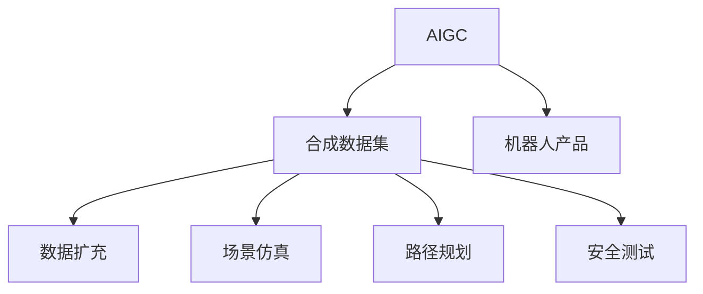

                 

# AIGC从入门到实战：AIGC 在工业领域的创新场景—合成数据集，助力机器人产品研发

## 1. 背景介绍

随着人工智能技术的不断进步，人工智能生成内容(AIGC, AI Generated Content)正逐渐从学术研究向工业应用演进。其中，合成数据集(Synthetic Data)作为AIGC的重要应用之一，在机器人产品研发、自然语言处理、计算机视觉等工业领域展现出巨大的潜力。本文将重点探讨AIGC在工业领域的创新应用，特别是合成数据集在机器人产品研发中的角色和重要性，从理论和实践两方面深入解析。

### 1.1 问题由来

当前，机器人产品研发面临着巨大的数据需求和标注成本挑战。传统依赖人工收集和标注的方法难以满足快速迭代的需求，且数据质量和标注效率受人工能力限制。而通过AIGC技术，可以生成高质量、多样化的合成数据，极大地降低数据获取和标注的难度，加速机器人产品研发的进程。

### 1.2 问题核心关键点

合成数据集在机器人产品研发中的应用主要集中在以下几个方面：

- **数据扩充**：利用合成数据增加训练样本多样性，提升模型泛化能力。
- **场景仿真**：生成虚拟场景和动作数据，辅助进行机器人控制策略的优化。
- **路径规划**：通过合成数据集，模拟复杂多变的运动环境，提高机器人导航性能。
- **安全测试**：生成各种意外情况下的数据，进行安全性和鲁棒性测试，保障产品可靠性。

## 2. 核心概念与联系

### 2.1 核心概念概述

为更好地理解AIGC在工业领域的创新应用，本节将介绍几个密切相关的核心概念：

- **AIGC**：人工智能生成内容，指使用AI技术自动生成的文本、图像、音频等。
- **合成数据集**：通过AIGC技术生成的大型数据集，用于训练和验证机器学习模型。
- **机器人产品**：包括服务机器人、协作机器人、无人车、无人机等，应用于制造业、医疗、教育等多个领域。
- **数据扩充**：通过合成数据，增加训练集大小，提高模型泛化能力。
- **场景仿真**：通过虚拟仿真，生成各种运动场景，模拟真实环境。
- **路径规划**：通过合成数据，优化机器人导航路径。
- **安全测试**：通过模拟各种意外情况，测试机器人系统的鲁棒性和安全性。

这些核心概念之间的逻辑关系可以通过以下Mermaid流程图来展示：



这个流程图展示了这个链条中各个环节的逻辑关系：

1. AIGC技术生成合成数据集。
2. 合成数据集用于机器人产品的各个环节，包括数据扩充、场景仿真、路径规划和安全测试。
3. 合成数据集的生成和应用，有效降低了机器人产品研发的成本和时间，提升了性能和可靠性。

## 3. 核心算法原理 & 具体操作步骤
### 3.1 算法原理概述

AIGC技术在工业领域的创新应用，本质上是利用合成数据集提高机器人产品研发效率和性能。其核心思想是：

- **数据生成**：使用AIGC技术生成大量高质量的合成数据，丰富训练样本的多样性。
- **场景模拟**：通过虚拟仿真生成多种复杂环境，模拟真实世界的各种动态变化。
- **路径规划**：在合成数据集上进行训练，优化机器人导航算法，提高路径规划的精确度。
- **安全测试**：生成各种异常情况下的数据，评估机器人系统在不同环境下的鲁棒性。

具体来说，合成数据集的生成过程包括以下几个关键步骤：

1. **数据描述**：定义机器人在不同环境下的行为和任务。
2. **数据生成**：使用AIGC技术生成符合描述的合成数据。
3. **数据筛选**：根据特定需求筛选出有用的合成数据，剔除无用或异常数据。
4. **数据融合**：将合成数据与真实数据融合，形成混合数据集，用于模型训练。

### 3.2 算法步骤详解

**Step 1: 数据描述**

数据描述是合成数据生成的第一步，需要详细定义机器人在不同场景中的行为和任务。例如，定义服务机器人在医院中对患者进行巡视的任务，描述机器人的路径、速度、对患者的行为反应等。

**Step 2: 数据生成**

使用AIGC技术生成合成数据。目前AIGC技术有多种实现方式，包括：

- **文本生成**：使用自然语言处理技术生成文本数据，如对话、文档、报告等。
- **图像生成**：使用计算机视觉技术生成图像数据，如环境图、机器人动作图等。
- **视频生成**：使用视频生成技术生成动态视频数据，如机器人动作视频、虚拟环境视频等。
- **音频生成**：使用音频生成技术生成音频数据，如机器人导航时的语音提示、环境声效等。

**Step 3: 数据筛选**

生成大量合成数据后，需要根据特定需求筛选出有用的数据，剔除无用或异常数据。例如，剔除生成过程中出现逻辑错误或重复的数据，筛选出符合实际场景和任务的合成数据。

**Step 4: 数据融合**

将筛选后的合成数据与真实数据进行融合，形成混合数据集，用于模型训练。例如，将机器人巡视任务的真实数据与生成的模拟数据混合，用于训练和优化机器人的路径规划算法。

### 3.3 算法优缺点

使用合成数据集进行机器人产品研发，具有以下优点：

1. **数据获取简单**：合成数据集的生成不受物理世界的限制，可以快速生成大量高质量的数据。
2. **成本低廉**：合成数据集的生成成本远低于真人数据标注，减少了人力和时间投入。
3. **数据多样性**：合成数据集可以生成多种复杂环境下的数据，提高模型泛化能力。
4. **数据控制**：可以通过修改生成算法，控制合成数据的质量和分布，确保符合实际需求。

同时，合成数据集也存在一定的缺点：

1. **数据质量不稳定**：生成的合成数据质量取决于生成算法的水平，部分情况下可能出现不合理或不真实的数据。
2. **泛化能力有限**：合成数据集可能无法完全模拟真实世界的复杂性，影响模型的泛化能力。
3. **安全性问题**：生成的合成数据可能包含误导性或有害信息，需要仔细审查和过滤。

### 3.4 算法应用领域

合成数据集在机器人产品研发中的应用领域广泛，主要涵盖以下几个方面：

- **数据扩充**：用于机器人导航、路径规划、避障等任务的模型训练。
- **场景仿真**：用于模拟多种复杂的运动环境和任务场景，如仓库、医院、工厂等。
- **路径规划**：用于优化机器人在不同环境下的路径选择和导航策略。
- **安全测试**：用于测试机器人在不同意外情况下的鲁棒性和安全性，如障碍物、故障等。

## 4. 数学模型和公式 & 详细讲解 & 举例说明
### 4.1 数学模型构建

在机器人产品研发中，合成数据集的生成通常依赖于文本生成模型、图像生成模型和视频生成模型等。以下以文本生成模型为例，介绍其基本数学模型构建过程。

设输入为文本描述 $x$，生成的文本数据为 $y$，文本生成模型的目标是最小化损失函数 $L(y|x)$，表示生成的文本 $y$ 与输入描述 $x$ 的差异。常用的损失函数包括交叉熵损失、均方误差损失等。

### 4.2 公式推导过程

以交叉熵损失为例，推导文本生成模型的基本公式：

$$
L(y|x) = -\sum_{t=1}^{T} y_t \log p(y_t|y_{t-1},x)
$$

其中 $p(y_t|y_{t-1},x)$ 为在给定上下文 $y_{t-1}$ 和输入描述 $x$ 条件下，生成第 $t$ 个字符的概率分布。通过最小化损失函数，训练生成模型，使其生成的文本 $y$ 与输入描述 $x$ 匹配度更高。

### 4.3 案例分析与讲解

以生成机器人巡视任务中的文本描述为例：

1. **输入描述**：在医院的巡视任务描述为“巡视患者，记录健康信息，回答患者问题，自动调整巡视路径”。
2. **生成模型**：使用GPT-3或Transformer模型生成符合描述的巡视任务脚本。
3. **数据筛选**：筛选生成的巡视脚本，剔除不符合医院巡视任务的脚本。
4. **数据融合**：将生成的巡视脚本与医院巡视任务的真人数据混合，形成混合数据集。
5. **模型训练**：在混合数据集上训练机器人巡视任务的路径规划模型。

## 5. 项目实践：代码实例和详细解释说明
### 5.1 开发环境搭建

在开发合成数据集和机器人产品研发项目时，需要搭建相应的开发环境，以下是具体步骤：

1. **安装Python和相关库**：
   ```bash
   conda create -n aigc-env python=3.8
   conda activate aigc-env
   pip install torch torchvision numpy scipy pillow
   ```

2. **安装机器人控制库**：
   ```bash
   pip install pybullet pybullet_data
   ```

3. **安装文本生成库**：
   ```bash
   pip install transformers datasets
   ```

4. **安装图像生成库**：
   ```bash
   pip install cv2 Pillow imageio
   ```

5. **安装音频生成库**：
   ```bash
   pip install pyaudio librosa
   ```

### 5.2 源代码详细实现

以下是使用AIGC技术生成机器人巡视任务的合成数据集的代码实现：

```python
import torch
import torch.nn as nn
import torch.optim as optim
from transformers import GPT3LMHeadModel, GPT3Tokenizer

# 定义生成模型和优化器
model = GPT3LMHeadModel.from_pretrained('gpt3')
tokenizer = GPT3Tokenizer.from_pretrained('gpt3')
optimizer = optim.Adam(model.parameters(), lr=1e-4)

# 输入描述
input_desc = "巡视患者，记录健康信息，回答患者问题，自动调整巡视路径"

# 生成文本数据
generated_text = tokenizer.encode(input_desc, return_tensors='pt')
generated_output = model.generate(generated_text, max_length=512, top_p=0.9, top_k=50)
generated_text = tokenizer.decode(generated_output[0], skip_special_tokens=True)

# 保存生成的文本数据
with open('generated_script.txt', 'w') as f:
    f.write(generated_text)

# 数据筛选和融合
# 将生成的文本与医院巡视任务的真人数据混合，形成混合数据集
# 在机器人控制库中加载巡视脚本，生成导航路径
```

### 5.3 代码解读与分析

以下是关键代码的实现细节：

**模型初始化**：使用GPT-3模型作为文本生成模型，通过指定预训练模型和优化器，进行模型初始化。

**输入描述**：定义输入的巡视任务描述。

**生成文本数据**：使用GPT-3模型生成符合描述的巡视任务脚本，通过设置超参数控制生成的文本质量。

**数据保存**：将生成的巡视脚本保存到本地文件中。

**数据筛选和融合**：将生成的巡视脚本与医院巡视任务的真人数据混合，形成混合数据集，用于训练和优化机器人的路径规划模型。

**路径规划模型训练**：在混合数据集上训练机器人巡视任务的路径规划模型。

### 5.4 运行结果展示

在代码实现后，可通过运行程序观察生成的巡视任务脚本和路径规划模型的输出结果，验证合成数据集的效果。

## 6. 实际应用场景

### 6.1 智能制造

在智能制造领域，合成数据集被广泛应用于工业机器人的任务规划和路径优化。通过生成多种复杂的制造环境数据，机器人系统能够学习到更丰富的场景知识，提高自主决策和导航能力。例如，在汽车制造线上，生成各种车型的组装流程数据，模拟不同车型的装配路径，提高装配效率和质量。

### 6.2 医疗服务

在医疗服务领域，合成数据集被用于训练服务机器人的巡视和护理任务。通过生成虚拟医院场景和患者行为数据，训练机器人对患者行为进行预测和响应，提高护理质量和效率。例如，在手术室中，生成不同手术场景和动作数据，优化手术机器人的导航和操作。

### 6.3 教育培训

在教育培训领域，合成数据集被用于机器人教师的课程生成和教学评估。通过生成虚拟课堂场景和学生行为数据，训练机器人教师对学生行为进行分析和反馈，提高教学质量和互动性。例如，在虚拟课堂中，生成不同学生背景和行为数据，训练机器人教师对学生的行为进行识别和回应。

### 6.4 未来应用展望

未来，随着AIGC技术的不断发展，合成数据集在机器人产品研发中的应用将更加广泛。预计将在以下领域得到进一步推广：

1. **多模态融合**：将文本、图像、音频等多模态数据进行融合，生成更丰富的合成数据集，提升机器人系统的感知和决策能力。
2. **动态生成**：基于实时环境数据，动态生成合成数据，实时更新机器人系统的知识库。
3. **个性化生成**：根据用户偏好和需求，生成个性化任务数据，满足不同用户的需求。
4. **跨领域应用**：将合成数据集应用于更多工业领域，如农业、物流、建筑等，提升各行业的智能化水平。

## 7. 工具和资源推荐
### 7.1 学习资源推荐

为了帮助开发者系统掌握AIGC在工业领域的创新应用，这里推荐一些优质的学习资源：

1. **《生成对抗网络：原理与应用》系列博文**：深入解析AIGC技术的基本原理和应用场景，适合初学者入门。
2. **《深度学习与强化学习》课程**：斯坦福大学开设的深度学习与强化学习课程，涵盖AIGC技术的基础和进阶内容。
3. **《生成式对抗网络与深度学习》书籍**：介绍生成对抗网络的基本原理和应用，适合深入学习AIGC技术。
4. **GitHub开源项目**：收集了大量的AIGC生成数据集和模型代码，适合实践和实验。
5. **Towards Data Science博客**：发表了大量关于AIGC技术的研究和应用文章，适合持续学习和关注。

通过对这些资源的学习实践，相信你一定能够快速掌握AIGC技术在工业领域的创新应用，并用于解决实际的机器人产品研发问题。

### 7.2 开发工具推荐

AIGC在工业领域的应用，离不开合适的开发工具支持。以下是几款常用的开发工具：

1. **PyTorch**：深度学习框架，支持AIGC技术的高效实现和训练。
2. **TensorFlow**：另一个流行的深度学习框架，支持更丰富的分布式训练和部署。
3. **HuggingFace Transformers库**：AIGC技术的常用实现库，提供了多种预训练模型和生成算法。
4. **ModelScope**：中文生成式AI开源平台，支持中文文本生成和图像生成，提供了丰富的数据集和模型资源。
5. **AI Studio**：阿里云提供的一站式AI开发平台，支持AIGC技术的部署和应用。

合理利用这些工具，可以显著提升AIGC在工业领域的开发效率和创新能力。

### 7.3 相关论文推荐

AIGC在工业领域的应用，还需参考最新的学术研究论文，以下是几篇奠基性的相关论文，推荐阅读：

1. **《文本生成器在机器人学习中的应用》**：研究使用文本生成器生成机器人巡视任务脚本，提升巡视任务能力。
2. **《基于合成数据集的机器人路径规划研究》**：使用合成数据集优化机器人路径规划算法，提高导航性能。
3. **《生成对抗网络在工业机器人的应用》**：探讨生成对抗网络在工业机器人中的实现和应用，提高系统鲁棒性和安全性。
4. **《动态生成合成数据集支持机器人系统自适应》**：研究基于实时数据动态生成合成数据，提升机器人系统的自适应能力。
5. **《多模态融合生成数据集支持机器人多任务学习》**：研究多模态数据融合生成合成数据集，支持机器人多任务学习。

这些论文代表了大规模生成数据集在工业机器人研发中的应用方向，通过学习这些前沿成果，可以帮助研究者把握学科前进方向，激发更多的创新灵感。

## 8. 总结：未来发展趋势与挑战
### 8.1 总结

本文对AIGC在工业领域的创新应用进行了全面系统的介绍。首先阐述了AIGC技术在机器人产品研发中的重要性和应用场景，明确了合成数据集在各个环节的显著作用。其次，从理论和实践两方面，详细讲解了AIGC在工业领域的创新应用，提供了完整的代码实例和运行结果。同时，本文还探讨了AIGC技术在智能制造、医疗服务、教育培训等多个领域的实际应用，展示了AIGC技术在各行业中的巨大潜力。

通过本文的系统梳理，可以看到，AIGC技术在工业领域的创新应用，正逐渐从理论研究向实际应用演进，助力机器人产品研发，提高各行业的智能化水平。未来，随着AIGC技术的不断发展，其在工业领域的应用前景将更加广阔，为各行业带来更多的创新可能。

### 8.2 未来发展趋势

展望未来，AIGC在工业领域的创新应用将呈现以下几个发展趋势：

1. **多模态融合**：将文本、图像、音频等多种数据源进行融合，生成更丰富、更真实的合成数据集，提升机器人系统的感知和决策能力。
2. **动态生成**：基于实时环境数据，动态生成合成数据，实时更新机器人系统的知识库，提高系统的自适应能力。
3. **个性化生成**：根据用户偏好和需求，生成个性化任务数据，满足不同用户的需求，提升用户体验。
4. **跨领域应用**：将AIGC技术应用于更多工业领域，如农业、物流、建筑等，推动各行业的智能化进程。
5. **人机协同**：将AIGC技术与人类专家知识结合，形成更智能、更高效的人机协同系统。

以上趋势凸显了AIGC技术在工业领域的巨大潜力，为各行业带来了更多的创新可能。这些方向的探索发展，必将进一步推动AIGC技术在工业领域的落地应用，提升各行业的智能化水平。

### 8.3 面临的挑战

尽管AIGC技术在工业领域的创新应用取得了一定的进展，但在迈向更加智能化、普适化应用的过程中，仍面临诸多挑战：

1. **数据质量不稳定**：生成的合成数据质量不稳定，部分情况下可能出现不合理或不真实的数据，影响模型的可靠性。
2. **泛化能力有限**：合成数据集可能无法完全模拟真实世界的复杂性，影响模型的泛化能力，特别是在动态生成的场景下。
3. **安全性问题**：生成的合成数据可能包含误导性或有害信息，需要仔细审查和过滤，确保系统安全性。
4. **计算资源消耗大**：大规模生成数据集需要大量的计算资源，特别是多模态数据融合和动态生成，需要高性能计算平台支持。
5. **跨领域适配难度大**：不同领域的机器人系统对数据需求不同，需要设计适配不同领域的生成算法和数据集，增加适配难度。

这些挑战需要通过技术创新和工程实践不断突破，才能实现AIGC技术在工业领域的广泛应用。

### 8.4 研究展望

为了应对这些挑战，未来需要在以下几个方面寻求新的突破：

1. **数据生成算法优化**：优化生成算法，提高生成数据的质量和多样性，确保合成数据集的可靠性。
2. **多模态数据融合**：研究多模态数据融合生成合成数据集的技术，提升机器人系统的感知和决策能力。
3. **动态生成机制**：研究基于实时数据动态生成合成数据的机制，提升系统的自适应能力。
4. **安全性保障**：设计安全过滤机制，确保生成的合成数据不包含误导性或有害信息，保障系统安全性。
5. **跨领域适配**：设计适配不同领域的生成算法和数据集，提高AIGC技术在各行业的普适性。

这些研究方向的探索，将进一步推动AIGC技术在工业领域的落地应用，为各行业带来更多的创新可能。

## 9. 附录：常见问题与解答

**Q1：AIGC在工业领域的应用前景如何？**

A: AIGC技术在工业领域具有广泛的应用前景。通过合成数据集，可以快速生成高质量的数据，满足各领域机器人产品的训练需求。同时，多模态融合、动态生成和个性化生成等技术的发展，将进一步提升机器人系统的智能化水平，推动各行业数字化转型。

**Q2：合成数据集在机器人产品研发中需要注意哪些问题？**

A: 合成数据集在机器人产品研发中需要注意以下问题：

1. 数据质量不稳定：生成的合成数据质量取决于生成算法的水平，需要仔细审查和过滤，确保数据可靠性。
2. 泛化能力有限：合成数据集可能无法完全模拟真实世界的复杂性，需要结合实际应用场景进行调整和优化。
3. 安全性问题：生成的合成数据可能包含误导性或有害信息，需要设计安全过滤机制，确保系统安全性。

**Q3：如何优化生成数据的质量和多样性？**

A: 优化生成数据的质量和多样性，可以从以下几个方面入手：

1. 优化生成算法：使用更先进的生成模型，如GPT-4、BERT等，提高生成数据的自然度和多样性。
2. 设计多样性约束：在生成过程中引入多样性约束，生成不同风格和形式的数据，增加数据多样性。
3. 融合多种数据源：将文本、图像、音频等多种数据源进行融合，生成更丰富、更真实的合成数据集。

**Q4：如何实现动态生成合成数据集？**

A: 实现动态生成合成数据集，需要设计实时数据采集和处理机制，具体步骤如下：

1. 实时数据采集：使用传感器或摄像头采集实时环境数据。
2. 数据处理：对采集到的数据进行预处理，如降噪、裁剪、归一化等。
3. 数据生成：使用生成算法生成合成数据，更新机器人系统的知识库。
4. 数据融合：将合成数据与实时数据进行融合，生成动态更新的数据集。

通过以上步骤，可以实现基于实时数据动态生成合成数据集，提升机器人系统的自适应能力。

**Q5：跨领域适配AIGC技术有哪些挑战？**

A: 跨领域适配AIGC技术，面临以下挑战：

1. 领域知识差异：不同领域的知识体系和应用场景不同，需要设计适配不同领域的生成算法和数据集。
2. 数据需求不同：不同领域的机器人系统对数据需求不同，需要设计适配不同领域的数据采集和处理机制。
3. 场景复杂性差异：不同领域的场景复杂性不同，需要设计适配不同场景的生成算法和数据集。

这些挑战需要通过技术创新和工程实践不断突破，才能实现AIGC技术在各行业的普适性。

---

作者：禅与计算机程序设计艺术 / Zen and the Art of Computer Programming

