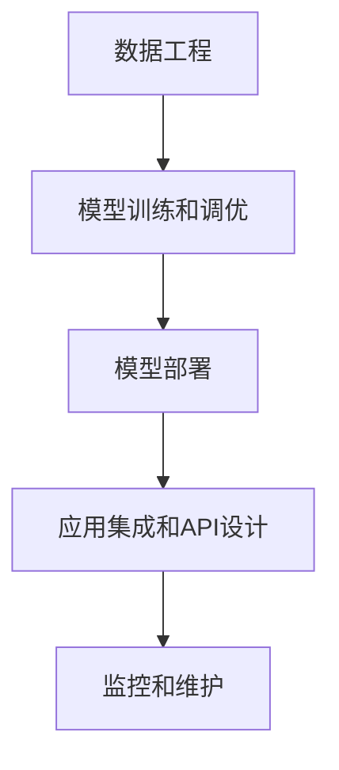

                 

# AI-Native 应用的工作流设计

## 1. 背景介绍

在当今数字化时代，AI-Native应用（即直接基于人工智能（AI）技术的应用）在各行各业中正迅速普及。它们能够实现更高效、更智能的业务操作，从自动化流程到决策支持系统，无处不在。然而，构建AI-Native应用涉及多个技术领域，包括数据工程、机器学习模型训练、模型部署和应用集成等。因此，设计一个有效的工作流对于确保这些应用的成功至关重要。

### 1.1 问题由来

随着AI技术的不断进步，越来越多的企业希望将AI应用到其业务流程中。然而，将AI技术与现有系统集成，构建AI-Native应用，并不是一项简单的任务。它涉及到数据准备、模型训练、部署和维护等多个环节，每个环节都可能有其特定的技术挑战。因此，一个清晰、高效的工作流设计能够帮助开发者和团队在构建AI-Native应用时更加有条不紊，提高项目的成功率。

### 1.2 问题核心关键点

一个有效的AI-Native应用工作流应具备以下特点：

- **模块化设计**：工作流中的每个阶段应相对独立，便于管理和维护。
- **自动化和可重复性**：通过脚本、CI/CD管道等自动化工具，确保每个步骤能够自动执行，并能够被重复运行。
- **灵活性和可扩展性**：工作流应该能够适应不同的业务需求，并能轻松扩展。
- **性能优化**：通过并行处理、数据缓存等技术，优化整个工作流的性能。
- **错误处理和恢复**：对可能的故障进行预测和防范，确保应用的可恢复性。
- **版本控制和回滚机制**：确保模型和代码的变化可以被有效追踪和管理，并提供回滚到历史版本的能力。

## 2. 核心概念与联系

### 2.1 核心概念概述

为更好地理解AI-Native应用的工作流设计，本节将介绍几个核心概念及其关系：

- **数据工程**：包括数据收集、清洗、存储和预处理等步骤，为模型训练和应用部署提供数据基础。
- **模型训练和调优**：使用机器学习或深度学习算法训练模型，并对其参数进行调整，以获得最佳性能。
- **模型部署**：将训练好的模型集成到应用中，并确保其在生产环境中的高效运行。
- **应用集成和API设计**：将模型和数据服务集成到企业现有的IT基础设施中，并提供API接口供其他系统调用。
- **监控和维护**：监控模型和应用的表现，及时发现并解决问题，确保应用稳定运行。

这些概念之间的逻辑关系可以通过以下Mermaid流程图来展示：



这个流程图展示了下游应用构建的整个流程，从数据工程开始，到模型部署和应用集成，最终到监控和维护，各个环节相互依存，共同构建起一个完整的AI-Native应用。

## 3. 核心算法原理 & 具体操作步骤

### 3.1 算法原理概述

AI-Native应用的工作流设计，本质上是一个多阶段的数据流和模型训练流水线。其核心思想是：将AI应用的构建过程划分为多个阶段，每个阶段独立负责特定任务，通过管道和接口进行数据和模型的传递和更新。

工作流的总体框架可以分为以下几个关键步骤：

1. **数据工程**：收集、清洗和预处理数据，为模型训练提供数据集。
2. **模型训练和调优**：使用预处理后的数据，训练机器学习模型，并进行参数调优。
3. **模型部署**：将训练好的模型集成到应用中，并部署到生产环境。
4. **应用集成和API设计**：将模型和数据服务集成到企业现有的IT基础设施中，并提供API接口供其他系统调用。
5. **监控和维护**：监控模型和应用的表现，及时发现并解决问题，确保应用稳定运行。

### 3.2 算法步骤详解

以下是对每个步骤的详细讲解：

#### 数据工程

数据工程是AI-Native应用的基础。其目的是从原始数据中提取出对模型训练和应用部署有用的数据集。具体步骤如下：

1. **数据收集**：从企业内部或外部收集数据，包括结构化和非结构化数据。
2. **数据清洗和预处理**：去除缺失值、重复值和噪声，处理异常值，进行特征工程，生成特征向量。
3. **数据存储和划分**：将清洗后的数据存储在数据库或分布式文件系统中，并划分为训练集、验证集和测试集。

#### 模型训练和调优

在数据准备好后，可以进行模型训练和调优。这一阶段的目标是通过训练，获得能够在特定任务上表现优异的模型。具体步骤如下：

1. **模型选择**：选择适合当前任务的机器学习或深度学习模型。
2. **训练**：使用训练集数据训练模型，并通过交叉验证等方法进行调参，获得最佳模型。
3. **模型评估**：在验证集上评估模型性能，根据结果进行调整，确保模型具有良好的泛化能力。

#### 模型部署

模型训练完成后，需要将其部署到生产环境中，以便提供实时服务。部署过程包括以下步骤：

1. **模型保存**：将训练好的模型保存为模型文件，便于后续调用。
2. **模型集成**：将模型集成到应用中，确保其在生产环境中的高效运行。
3. **服务化封装**：将模型封装为标准的服务接口，供其他系统调用。

#### 应用集成和API设计

将模型和数据服务集成到企业现有的IT基础设施中，并设计API接口，是AI-Native应用的最后一步。具体步骤如下：

1. **服务集成**：将模型和数据服务集成到企业现有的IT基础设施中，如云平台、大数据平台等。
2. **API设计**：设计API接口，提供标准化的接口供其他系统调用，确保系统间的协同工作。

#### 监控和维护

监控和维护是确保AI-Native应用长期稳定运行的关键步骤。具体步骤如下：

1. **监控**：实时监控模型和应用的表现，包括性能指标、错误率等。
2. **故障检测和处理**：及时发现并处理故障，确保应用稳定运行。
3. **模型更新和迭代**：根据新的数据和需求，定期更新和迭代模型。

### 3.3 算法优缺点

AI-Native应用的工作流设计具有以下优点：

1. **效率高**：通过自动化和管道技术，工作流能够高效地完成各个阶段的任务。
2. **可重复性强**：工作流中的每个步骤都可以自动化，确保每次运行的结果一致。
3. **可扩展性强**：工作流可以根据需求灵活扩展，适应不同的业务场景。
4. **可维护性强**：每个阶段相对独立，便于维护和升级。

同时，工作流设计也存在一些局限性：

1. **复杂度高**：工作流涉及多个阶段，需要协调和配合。
2. **资源消耗大**：数据工程和模型训练阶段可能需要大量计算资源。
3. **依赖性强**：工作流中的每个步骤都需要依赖其他步骤的输出。

## 4. 数学模型和公式 & 详细讲解 & 举例说明

### 4.1 数学模型构建

AI-Native应用的工作流设计，本质上是一个数据流和模型训练的流水线。其核心数学模型包括：

- **数据工程**：数据预处理模型，如去噪、归一化、特征工程等。
- **模型训练**：优化算法，如梯度下降、Adam等。
- **模型部署**：分布式计算模型，如MapReduce、Spark等。

### 4.2 公式推导过程

以下是对关键公式的推导过程：

1. **梯度下降公式**：

$$
\theta_{new} = \theta_{old} - \eta \nabla_{\theta}L(\theta_{old})
$$

其中，$\theta_{new}$ 为新的模型参数，$\theta_{old}$ 为旧的模型参数，$\eta$ 为学习率，$L(\theta)$ 为损失函数。

2. **Adam优化算法**：

$$
m_t = \beta_1m_{t-1} + (1-\beta_1)g_t \\
v_t = \beta_2v_{t-1} + (1-\beta_2)g_t^2 \\
\hat{m}_t = \frac{m_t}{1-\beta_1^t} \\
\hat{v}_t = \frac{v_t}{1-\beta_2^t} \\
\theta_{new} = \theta_{old} - \frac{\eta}{\sqrt{\hat{v}_t} + \epsilon}\hat{m}_t
$$

其中，$m_t$ 和 $v_t$ 分别表示梯度和平方梯度的指数加权平均，$\hat{m}_t$ 和 $\hat{v}_t$ 为修正后的指数加权平均，$\beta_1$ 和 $\beta_2$ 为超参数，$\epsilon$ 为数值稳定性参数。

### 4.3 案例分析与讲解

以金融风控为例，分析AI-Native应用的工作流设计：

1. **数据工程**：
   - 从银行系统中收集用户交易数据，包括交易时间、金额、交易对象等。
   - 清洗数据，去除缺失值和异常值，进行特征工程，生成特征向量。
   - 将数据存储在分布式文件系统中，并划分为训练集、验证集和测试集。

2. **模型训练和调优**：
   - 选择适合分类任务的机器学习模型，如逻辑回归、随机森林等。
   - 使用训练集数据训练模型，并通过交叉验证等方法进行调参，获得最佳模型。
   - 在验证集上评估模型性能，根据结果进行调整，确保模型具有良好的泛化能力。

3. **模型部署**：
   - 将训练好的模型保存为模型文件，便于后续调用。
   - 将模型集成到银行系统的核心业务流程中，确保其在生产环境中的高效运行。
   - 将模型封装为标准的服务接口，供其他系统调用。

4. **应用集成和API设计**：
   - 将模型和数据服务集成到银行系统的IT基础设施中，如云平台、大数据平台等。
   - 设计API接口，提供标准化的接口供其他系统调用，确保系统间的协同工作。

5. **监控和维护**：
   - 实时监控模型和应用的表现，包括性能指标、错误率等。
   - 及时发现并处理故障，确保应用稳定运行。
   - 根据新的数据和需求，定期更新和迭代模型。

## 5. 项目实践：代码实例和详细解释说明

### 5.1 开发环境搭建

在进行AI-Native应用的工作流设计实践前，我们需要准备好开发环境。以下是使用Python进行PyTorch开发的环境配置流程：

1. 安装Anaconda：从官网下载并安装Anaconda，用于创建独立的Python环境。

2. 创建并激活虚拟环境：
```bash
conda create -n ai-native-env python=3.8 
conda activate ai-native-env
```

3. 安装PyTorch：根据CUDA版本，从官网获取对应的安装命令。例如：
```bash
conda install pytorch torchvision torchaudio cudatoolkit=11.1 -c pytorch -c conda-forge
```

4. 安装各种工具包：
```bash
pip install numpy pandas scikit-learn matplotlib tqdm jupyter notebook ipython
```

完成上述步骤后，即可在`ai-native-env`环境中开始实践。

### 5.2 源代码详细实现

下面我以金融风控为例，给出使用PyTorch进行AI-Native应用开发的PyTorch代码实现。

首先，定义训练集和测试集：

```python
import pandas as pd

# 加载训练集和测试集数据
train_data = pd.read_csv('train_data.csv')
test_data = pd.read_csv('test_data.csv')

# 数据预处理
# 填充缺失值，去除异常值，进行特征工程，生成特征向量

# 划分数据集
train_X, train_y = train_data.drop('label', axis=1), train_data['label']
test_X, test_y = test_data.drop('label', axis=1), test_data['label']

# 数据标准化
from sklearn.preprocessing import StandardScaler
scaler = StandardScaler()
train_X = scaler.fit_transform(train_X)
test_X = scaler.transform(test_X)
```

然后，定义模型和优化器：

```python
from torch import nn, optim
from torch.utils.data import DataLoader, TensorDataset

# 定义模型
class Model(nn.Module):
    def __init__(self):
        super(Model, self).__init__()
        self.fc1 = nn.Linear(100, 64)
        self.fc2 = nn.Linear(64, 32)
        self.fc3 = nn.Linear(32, 2)

    def forward(self, x):
        x = nn.functional.relu(self.fc1(x))
        x = nn.functional.relu(self.fc2(x))
        x = self.fc3(x)
        return x

model = Model()

# 定义优化器
optimizer = optim.Adam(model.parameters(), lr=0.001)
```

接着，定义训练和评估函数：

```python
# 定义训练函数
def train(model, train_loader, optimizer, n_epochs):
    model.train()
    for epoch in range(n_epochs):
        running_loss = 0.0
        for i, data in enumerate(train_loader, 0):
            inputs, labels = data
            optimizer.zero_grad()
            outputs = model(inputs)
            loss = nn.functional.cross_entropy(outputs, labels)
            loss.backward()
            optimizer.step()

        running_loss += loss.item()
        if (i + 1) % 1000 == 0:
            print('[%d, %5d] loss: %.3f' % (epoch + 1, i + 1, running_loss / 1000))
            running_loss = 0.0

# 定义评估函数
def evaluate(model, test_loader):
    model.eval()
    correct = 0
    total = 0
    with torch.no_grad():
        for data in test_loader:
            inputs, labels = data
            outputs = model(inputs)
            _, predicted = torch.max(outputs.data, 1)
            total += labels.size(0)
            correct += (predicted == labels).sum().item()

    print('Accuracy of the model on the 10000 test images: %d %%' % (100 * correct / total))

# 加载数据集
train_dataset = TensorDataset(train_X, train_y)
test_dataset = TensorDataset(test_X, test_y)

# 划分数据集
batch_size = 64
train_loader = DataLoader(train_dataset, batch_size=batch_size, shuffle=True)
test_loader = DataLoader(test_dataset, batch_size=batch_size, shuffle=False)
```

最后，启动训练流程并在测试集上评估：

```python
# 训练模型
train_model(train_loader, optimizer, n_epochs=10)

# 评估模型
evaluate_model(model, test_loader)
```

以上就是使用PyTorch对金融风控应用进行AI-Native开发的完整代码实现。可以看到，通过PyTorch和相关库，开发者可以轻松地实现数据工程、模型训练和应用集成等关键步骤。

### 5.3 代码解读与分析

让我们再详细解读一下关键代码的实现细节：

**训练函数**：
- 使用`nn.functional.relu`激活函数，以引入非线性特性。
- 使用`nn.functional.cross_entropy`损失函数，计算预测值与真实标签之间的交叉熵损失。
- 在每个epoch内，通过反向传播更新模型参数。

**评估函数**：
- 使用`torch.max`函数，预测模型的类别。
- 计算模型的准确率。

**数据加载**：
- 使用`torch.utils.data.DataLoader`加载数据集，并进行批处理和随机抽样。
- 定义`batch_size`，控制每个批次的大小。

**训练和评估流程**：
- 在每个epoch内，通过循环迭代，逐步更新模型参数。
- 在测试集上评估模型性能，输出准确率。

**监控和维护**：
- 在实际应用中，还需要添加更多的监控和故障处理机制，确保系统的稳定运行。

## 6. 实际应用场景

### 6.1 智能客服系统

AI-Native应用在智能客服系统中得到了广泛应用。通过将机器学习模型嵌入到客服系统中，可以实现自动化的客户服务，提升客户满意度。

在技术实现上，可以收集客户的历史咨询记录，将问题-答案对作为监督数据，在此基础上对预训练模型进行微调。微调后的模型能够自动理解用户意图，匹配最合适的答案模板进行回复。对于客户提出的新问题，还可以接入检索系统实时搜索相关内容，动态组织生成回答。如此构建的智能客服系统，能大幅提升客户咨询体验和问题解决效率。

### 6.2 金融舆情监测

金融机构需要实时监测市场舆论动向，以便及时应对负面信息传播，规避金融风险。传统的人工监测方式成本高、效率低，难以应对网络时代海量信息爆发的挑战。

通过将AI-Native应用应用于舆情监测，可以实时抓取互联网上的新闻、报道、评论等文本数据，并对其进行情感分析、主题分类等处理。通过微调模型，使其能够自动判断文本属于何种主题，情感倾向是正面、中性还是负面。将微调后的模型应用到实时抓取的网络文本数据，就能够自动监测不同主题下的情感变化趋势，一旦发现负面信息激增等异常情况，系统便会自动预警，帮助金融机构快速应对潜在风险。

### 6.3 个性化推荐系统

当前的推荐系统往往只依赖用户的历史行为数据进行物品推荐，无法深入理解用户的真实兴趣偏好。通过将AI-Native应用应用于个性化推荐系统，可以更好地挖掘用户行为背后的语义信息，从而提供更精准、多样的推荐内容。

在实践中，可以收集用户浏览、点击、评论、分享等行为数据，提取和用户交互的物品标题、描述、标签等文本内容。将文本内容作为模型输入，用户的后续行为（如是否点击、购买等）作为监督信号，在此基础上微调预训练语言模型。微调后的模型能够从文本内容中准确把握用户的兴趣点。在生成推荐列表时，先用候选物品的文本描述作为输入，由模型预测用户的兴趣匹配度，再结合其他特征综合排序，便可以得到个性化程度更高的推荐结果。

### 6.4 未来应用展望

随着AI-Native应用的不断扩展，未来的应用场景将更加多样化，带来更深刻的变革：

1. **智慧医疗**：在智慧医疗领域，AI-Native应用可以用于疾病诊断、个性化治疗方案推荐、医疗影像分析等，提升医疗服务的智能化水平，辅助医生诊疗，加速新药开发进程。
2. **智能教育**：在智能教育领域，AI-Native应用可以用于作业批改、学情分析、知识推荐等方面，因材施教，促进教育公平，提高教学质量。
3. **智慧城市治理**：在智慧城市治理中，AI-Native应用可以用于城市事件监测、舆情分析、应急指挥等环节，提高城市管理的自动化和智能化水平，构建更安全、高效的未来城市。
4. **工业制造**：在工业制造领域，AI-Native应用可以用于预测性维护、质量控制、生产调度等方面，提升生产效率，降低成本。

未来，随着预训练语言模型和AI-Native技术的持续演进，相信更多行业将迎来AI带来的变革，为各行各业的发展注入新的动力。

## 7. 工具和资源推荐

### 7.1 学习资源推荐

为了帮助开发者系统掌握AI-Native应用的工作流设计，这里推荐一些优质的学习资源：

1. **《深度学习入门》**：陈云帆著，介绍了深度学习的基本概念、模型训练、模型优化等内容。
2. **CS231n课程**：斯坦福大学开设的计算机视觉课程，涵盖深度学习、卷积神经网络、目标检测等内容。
3. **Kaggle**：提供丰富的数据集和竞赛平台，是学习和实践AI-Native应用的好地方。
4. **TensorFlow官网**：提供丰富的教程和文档，涵盖TensorFlow的各种应用场景。
5. **PyTorch官方文档**：提供全面的API参考，是学习和实践PyTorch的好资源。

通过对这些资源的学习实践，相信你一定能够快速掌握AI-Native应用的工作流设计，并用于解决实际的NLP问题。

### 7.2 开发工具推荐

高效的开发离不开优秀的工具支持。以下是几款用于AI-Native应用开发的常用工具：

1. **PyTorch**：基于Python的开源深度学习框架，灵活动态的计算图，适合快速迭代研究。
2. **TensorFlow**：由Google主导开发的开源深度学习框架，生产部署方便，适合大规模工程应用。
3. **Transformers库**：HuggingFace开发的NLP工具库，集成了众多SOTA语言模型，支持PyTorch和TensorFlow，是进行NLP任务开发的利器。
4. **Jupyter Notebook**：开源的交互式开发环境，支持多种编程语言，适合快速原型开发和实验。
5. **Anaconda**：开源的数据科学环境，支持多种编程语言，集成了大量常用的数据科学库。
6. **GitHub**：全球最大的代码托管平台，提供丰富的开源项目和协作工具，是开发AI-Native应用的必备工具。

合理利用这些工具，可以显著提升AI-Native应用的开发效率，加快创新迭代的步伐。

### 7.3 相关论文推荐

AI-Native应用的研究源于学界的持续研究。以下是几篇奠基性的相关论文，推荐阅读：

1. **《ImageNet Classification with Deep Convolutional Neural Networks》**：提出深度卷积神经网络（CNN）结构，开创了计算机视觉领域的深度学习时代。
2. **《Word Embeddings as Feature Vectors for Natural Language Processing》**：提出Word2Vec模型，将单词映射到高维向量空间，开创了自然语言处理的词嵌入范式。
3. **《Attention Is All You Need》**：提出Transformer结构，开启了NLP领域的预训练大模型时代。
4. **《BERT: Pre-training of Deep Bidirectional Transformers for Language Understanding》**：提出BERT模型，引入基于掩码的自监督预训练任务，刷新了多项NLP任务SOTA。
5. **《Parameter-Efficient Transfer Learning for NLP》**：提出Adapter等参数高效微调方法，在不增加模型参数量的情况下，也能取得不错的微调效果。

这些论文代表了大模型和AI-Native应用的发展脉络。通过学习这些前沿成果，可以帮助研究者把握学科前进方向，激发更多的创新灵感。

## 8. 总结：未来发展趋势与挑战

### 8.1 总结

本文对AI-Native应用的工作流设计进行了全面系统的介绍。首先阐述了AI-Native应用的构建过程，明确了工作流中的各个关键步骤，包括数据工程、模型训练、模型部署、应用集成和监控维护等。其次，从原理到实践，详细讲解了工作流中的每个步骤，给出了完整的代码实现。同时，本文还广泛探讨了工作流在智能客服、金融舆情、个性化推荐等多个行业领域的应用前景，展示了AI-Native应用的广阔应用空间。最后，本文精选了工作流设计的学习资源、开发工具和相关论文，力求为读者提供全方位的技术指引。

通过本文的系统梳理，可以看到，AI-Native应用的工作流设计为AI技术在各行各业的应用提供了清晰的指导。通过科学的工作流设计，可以显著提升AI应用的开发效率和可靠性，推动AI技术在更多场景下落地应用。

### 8.2 未来发展趋势

展望未来，AI-Native应用的工作流设计将呈现以下几个发展趋势：

1. **自动化程度提升**：随着自动化工具和AI模型的不断发展，更多步骤可以实现自动化，工作流的效率将进一步提升。
2. **模型性能提升**：通过更先进的模型和算法，AI-Native应用将在性能上取得更大突破，提供更智能的服务。
3. **多模态融合**：未来的工作流将融合视觉、语音、文本等多种模态，提升应用的综合感知能力。
4. **实时性增强**：通过引入云计算和边缘计算等技术，AI-Native应用可以实现更加实时性的部署和响应。
5. **安全性提升**：随着AI应用在各领域的应用深入，安全性成为关注的重点。未来的工作流设计将更加注重数据安全、模型安全和应用安全。
6. **伦理性加强**：未来的工作流将更加注重伦理和隐私问题，确保AI应用的道德性和合规性。

### 8.3 面临的挑战

尽管AI-Native应用在工作流设计上取得了不少进展，但仍面临一些挑战：

1. **数据质量**：数据是AI-Native应用的基础，数据质量决定了模型的性能。然而，高质量数据集的获取和标注往往成本高、周期长。
2. **模型复杂性**：随着模型的不断发展，模型结构越来越复杂，训练和调优的成本也越来越高。
3. **资源消耗**：模型训练和推理过程中的资源消耗较大，需要更多的计算资源和存储资源。
4. **可解释性**：AI-Native应用的模型往往比较复杂，难以解释其内部工作机制和决策逻辑。
5. **公平性和偏见**：AI-Native应用可能会学习到有偏见的数据，导致输出结果的不公平。
6. **伦理和隐私**：AI-Native应用在处理敏感数据时，需要严格遵守伦理和隐私保护的规定。

### 8.4 研究展望

面对AI-Native应用工作流设计所面临的挑战，未来的研究需要在以下几个方面寻求新的突破：

1. **数据生成和增强**：探索自动生成高质量数据的方法，降低标注成本。
2. **模型压缩和优化**：开发更高效的模型结构和算法，降低训练和推理成本。
3. **自动化和管道化**：开发更智能的自动化工具，提升工作流的自动化程度。
4. **多模态融合**：研究融合多种模态数据的模型和算法，提升应用的综合感知能力。
5. **实时性和分布式计算**：引入实时计算和分布式计算技术，实现更加实时性的部署和响应。
6. **伦理性设计**：研究AI应用的伦理性设计和隐私保护方法，确保AI应用的道德性和合规性。

这些研究方向的探索，必将引领AI-Native应用的工作流设计迈向更高的台阶，为AI技术在各行各业的应用提供更加可靠和高效的解决方案。

## 9. 附录：常见问题与解答

**Q1：如何选择合适的AI-Native应用的工作流设计框架？**

A: 选择合适的AI-Native应用的工作流设计框架，需要考虑以下几个因素：

1. **应用场景**：根据具体应用场景选择合适的框架，如数据工程、模型训练、模型部署、应用集成和监控维护等。
2. **技术栈**：根据团队的技术栈选择合适的框架，如使用PyTorch、TensorFlow等。
3. **可扩展性**：选择具有良好扩展性的框架，方便未来的升级和维护。
4. **社区支持**：选择有活跃社区支持的框架，方便获取技术支持和解决方案。

**Q2：在数据工程阶段，如何确保数据的质量和完整性？**

A: 确保数据的质量和完整性是AI-Native应用工作流设计中非常重要的一环。具体措施包括：

1. **数据清洗**：去除缺失值、重复值和噪声，处理异常值。
2. **数据标准化**：对数据进行归一化和标准化处理，确保数据的一致性和可比性。
3. **数据增强**：通过回译、近义替换等方式扩充训练集，提升模型的泛化能力。
4. **数据验证**：对数据进行抽样和验证，确保数据的代表性和可靠性。

**Q3：在模型训练和调优阶段，如何选择合适的优化算法和超参数？**

A: 选择合适的优化算法和超参数是提高模型性能的关键。具体措施包括：

1. **选择合适的优化算法**：如梯度下降、Adam等。
2. **设置合适的超参数**：如学习率、批次大小、迭代轮数等。
3. **超参数调优**：通过网格搜索、随机搜索等方法，寻找最优超参数组合。
4. **交叉验证**：通过交叉验证等方法，评估模型的泛化能力，选择最优模型。

**Q4：在模型部署阶段，如何确保模型的高效运行？**

A: 确保模型的高效运行是AI-Native应用工作流设计中的关键步骤。具体措施包括：

1. **模型裁剪**：去除不必要的层和参数，减小模型尺寸，加快推理速度。
2. **量化加速**：将浮点模型转为定点模型，压缩存储空间，提高计算效率。
3. **模型并行**：使用分布式计算技术，实现模型的高效并行计算。

**Q5：在应用集成和API设计阶段，如何确保系统的稳定性和安全性？**

A: 确保系统的稳定性和安全性是AI-Native应用工作流设计中的重要环节。具体措施包括：

1. **服务集成**：将模型和数据服务集成到企业现有的IT基础设施中，如云平台、大数据平台等。
2. **API设计**：设计API接口，提供标准化的接口供其他系统调用，确保系统间的协同工作。
3. **安全防护**：采用访问鉴权、数据脱敏等措施，保障数据和模型安全。

**Q6：在监控和维护阶段，如何确保系统的稳定性和持续性？**

A: 确保系统的稳定性和持续性是AI-Native应用工作流设计中的重要保障。具体措施包括：

1. **监控系统**：实时监控模型和应用的表现，包括性能指标、错误率等。
2. **故障检测和处理**：及时发现并处理故障，确保应用稳定运行。
3. **模型更新和迭代**：根据新的数据和需求，定期更新和迭代模型。

---

作者：禅与计算机程序设计艺术 / Zen and the Art of Computer Programming

