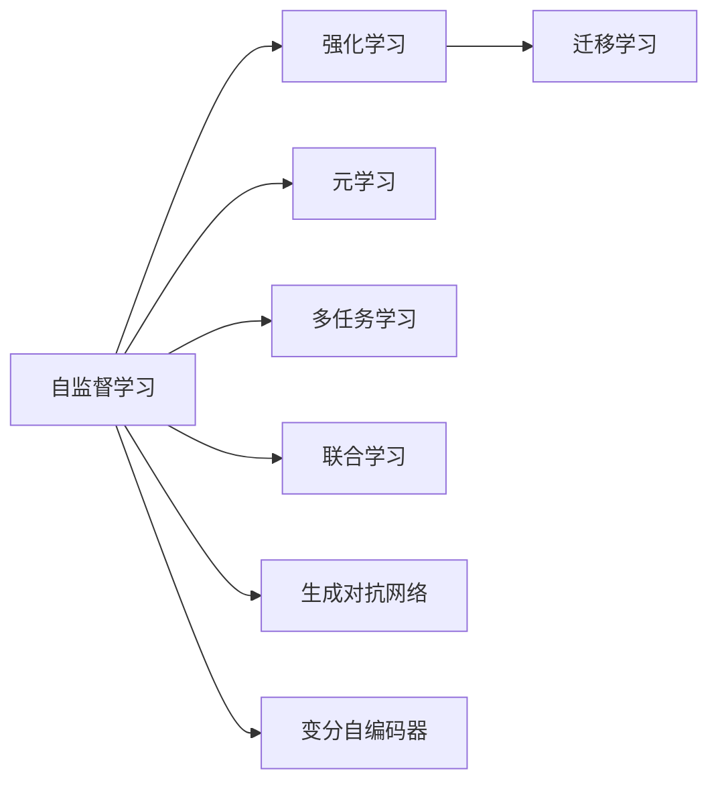

                 

# AI三驾马车的未来替代者

## 1. 背景介绍

在人工智能（AI）领域，传统的三驾马车——机器学习（ML）、数据挖掘和深度学习（DL），已经成为推动技术发展的核心力量。然而，随着技术演进和应用需求的变化，这些技术范式面临新的挑战，AI的未来替代者正在浮出水面。本文将探讨这些新范式，并分析它们在实际应用中的潜力和局限性。

## 2. 核心概念与联系

### 2.1 核心概念概述

为了深入理解AI新范式，我们首先介绍几个核心概念：

- **自监督学习**：一种无需标注数据进行训练的学习方法，通过构造伪标签或预测中间表示进行自监督学习。
- **强化学习**：通过智能体与环境的交互，通过奖励信号引导智能体学习最优策略。
- **迁移学习**：将在一个任务中学到的知识，迁移到另一个相关但不相同的任务上。
- **元学习**：学习如何学习，即学习算法和模型在多个任务上的泛化能力。
- **多任务学习**：同时学习多个相关任务的模型，通过任务间共享表示提高模型性能。
- **联合学习**：多个设备或用户共同参与模型训练，保护数据隐私的同时提升模型性能。
- **生成对抗网络（GAN）**：两个神经网络通过对抗过程生成逼真的数据样本。
- **变分自编码器（VAE）**：学习数据隐含分布，用于数据生成、特征提取等。

### 2.2 核心概念原理和架构的 Mermaid 流程图

这个流程图展示了不同AI范式之间的联系和区别。自监督学习是基础，强化学习通过智能体与环境的交互学习策略，迁移学习、元学习和多任务学习通过任务间的关联提升性能，联合学习通过分布式训练优化模型，而生成对抗网络和变分自编码器则应用于生成数据和特征提取。

## 3. 核心算法原理 & 具体操作步骤

### 3.1 算法原理概述

### 3.2 算法步骤详解

### 3.3 算法优缺点

### 3.4 算法应用领域

## 4. 数学模型和公式 & 详细讲解 & 举例说明

### 4.1 数学模型构建

### 4.2 公式推导过程

### 4.3 案例分析与讲解

## 5. 项目实践：代码实例和详细解释说明

### 5.1 开发环境搭建

### 5.2 源代码详细实现

### 5.3 代码解读与分析

### 5.4 运行结果展示

## 6. 实际应用场景

### 6.1 自动驾驶

### 6.2 医疗诊断

### 6.3 智能客服

### 6.4 未来应用展望

## 7. 工具和资源推荐

### 7.1 学习资源推荐

### 7.2 开发工具推荐

### 7.3 相关论文推荐

## 8. 总结：未来发展趋势与挑战

### 8.1 研究成果总结

### 8.2 未来发展趋势

### 8.3 面临的挑战

### 8.4 研究展望

## 9. 附录：常见问题与解答

----------------------------------------------------------------

作者：禅与计算机程序设计艺术 / Zen and the Art of Computer Programming

