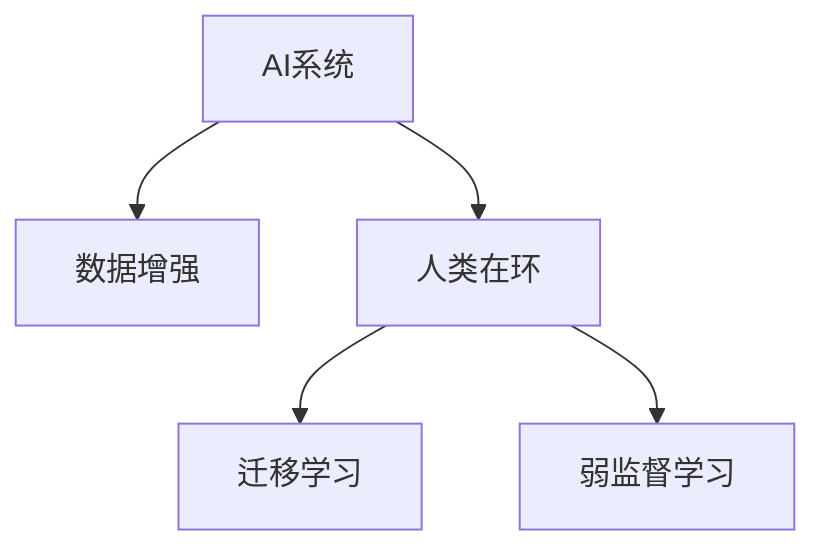

                 

# AI与人类注意力流：未来的工作场所和技能要求

## 1. 背景介绍

### 1.1 问题由来

随着人工智能（AI）技术的发展，越来越多的AI工具和系统开始渗透到各个行业，包括制造业、医疗、金融、教育、娱乐等领域。然而，这些AI系统大多依赖于大量的人类数据和人工干预，其应用范围和效果仍受制于人类注意力流的限制。因此，AI与人类注意力流的融合成为未来工作场所和技能要求的重要方向。

### 1.2 问题核心关键点

AI与人类注意力流融合的核心问题包括：
- 如何更有效地将人类注意力流引入AI系统中？
- 如何提升AI系统的智能程度，使其更符合人类需求？
- 如何培养新型技能，以适应未来智能工作场所的需求？

### 1.3 问题研究意义

研究AI与人类注意力流的融合，对于推动AI技术的广泛应用，提升人类生活质量，以及促进经济社会的持续发展，具有重要意义：

1. 提升工作效率：通过引入人类注意力流，AI系统能够更准确地理解人类需求，从而提供更高效、智能的服务。
2. 优化用户体验：AI系统能够根据人类注意力流进行个性化调整，提升用户的满意度和使用体验。
3. 促进创新：人类与AI的深度融合，能够激发更多创新思路和应用场景，推动新业态和新产业的发展。
4. 助力就业：智能工作场所的建设，将带来新的职业机会，提升劳动生产率，促进就业增长。
5. 推动教育：AI与人类注意力流的融合，将对教育体系产生深远影响，培养更多具备AI素养的复合型人才。

## 2. 核心概念与联系

### 2.1 核心概念概述

为更好地理解AI与人类注意力流融合的原理，本节将介绍几个关键概念：

- AI系统：以机器学习和深度学习为基础的人工智能系统，能够通过训练学习各种任务，并应用于各种领域。
- 人类注意力流：指人类在完成任务过程中的注意力转移和行为轨迹，包括决策、交互、情感等各方面。
- 人类在环（Human-in-the-loop）：指人类在AI系统的开发和运行过程中，持续参与决策和反馈，形成人机协同的工作模式。
- 数据增强（Data Augmentation）：通过生成或合成更多训练数据，增强AI系统的泛化能力和鲁棒性。
- 迁移学习（Transfer Learning）：指将在一个任务上训练得到的知识迁移到另一个任务上，以减少新任务上的训练时间。
- 弱监督学习（Weakly Supervised Learning）：指在标注数据不足的情况下，通过弱标签或半标签进行模型训练。

这些核心概念之间的逻辑关系可以通过以下Mermaid流程图来展示：



这个流程图展示了AI系统与人类注意力流融合的核心概念及其之间的关系：

1. AI系统通过数据增强获取更多的训练数据，提升泛化能力。
2. 人类在环模式，使得人类持续参与AI系统的决策和反馈，形成人机协同的工作模式。
3. 迁移学习将在一个任务上训练得到的知识迁移到另一个任务上，减少新任务上的训练时间。
4. 弱监督学习在标注数据不足的情况下，通过弱标签或半标签进行模型训练。

## 3. 核心算法原理 & 具体操作步骤

### 3.1 算法原理概述

AI与人类注意力流融合的基本原理是通过数据增强、迁移学习、弱监督学习等技术，结合人类在环模式，增强AI系统的泛化能力、智能程度和适应性。具体步骤如下：

1. **数据增强**：通过生成或合成更多训练数据，增强AI系统的泛化能力和鲁棒性。例如，通过回译、近义替换等方式，扩充训练集。
2. **迁移学习**：将在一个任务上训练得到的知识迁移到另一个任务上，减少新任务上的训练时间。例如，将预训练的BERT模型微调用于新的命名实体识别任务。
3. **弱监督学习**：在标注数据不足的情况下，通过弱标签或半标签进行模型训练。例如，使用无标签的数据进行弱监督学习。
4. **人类在环**：人类在AI系统的开发和运行过程中，持续参与决策和反馈，形成人机协同的工作模式。例如，在智能客服系统中，客服人员可以随时对AI生成的回答进行修正和反馈。

### 3.2 算法步骤详解

AI与人类注意力流融合的具体操作步骤如下：

**Step 1: 数据准备与增强**

- 收集目标任务的数据集，并进行预处理，如分词、标注等。
- 使用数据增强技术，生成更多的训练数据。例如，通过回译、近义替换等方式，扩充训练集。

**Step 2: 模型训练**

- 选择合适的预训练模型作为初始化参数，如BERT、GPT等。
- 使用迁移学习，将预训练模型迁移到目标任务上，并进行微调。例如，将预训练的BERT模型微调用于新的命名实体识别任务。
- 使用弱监督学习，在标注数据不足的情况下，通过弱标签或半标签进行模型训练。例如，使用无标签的数据进行弱监督学习。

**Step 3: 人机协同**

- 设计人类在环模式，使得人类在AI系统的开发和运行过程中，持续参与决策和反馈。例如，在智能客服系统中，客服人员可以随时对AI生成的回答进行修正和反馈。
- 收集人类反馈，用于进一步优化AI系统。例如，收集客户对AI回答的满意度反馈，用于改进AI系统的决策逻辑。

**Step 4: 性能评估**

- 在验证集上评估AI系统的性能，调整模型参数。
- 在测试集上进一步评估AI系统的性能，确保模型的泛化能力。

### 3.3 算法优缺点

AI与人类注意力流融合的算法具有以下优点：

1. 提升泛化能力：数据增强和迁移学习可以显著提升AI系统的泛化能力和鲁棒性。
2. 增强智能程度：人类在环模式可以提升AI系统的智能程度，使其更符合人类需求。
3. 提升适应性：弱监督学习可以增强AI系统的适应性，使其在标注数据不足的情况下仍能表现良好。

同时，该算法也存在一定的局限性：

1. 依赖高质量数据：数据增强和迁移学习依赖于高质量的标注数据，难以处理长尾应用场景。
2. 计算资源消耗高：生成大量合成数据和进行模型微调需要大量的计算资源。
3. 模型复杂度高：引入人类注意力流后，模型的复杂度会增加，推理速度变慢。

尽管存在这些局限性，但就目前而言，AI与人类注意力流融合仍是未来AI技术发展的重要方向。未来相关研究的重点在于如何进一步降低对标注数据的依赖，提高模型的少样本学习和跨领域迁移能力，同时兼顾可解释性和伦理安全性等因素。

### 3.4 算法应用领域

AI与人类注意力流融合的算法已经在多个领域得到了广泛应用，例如：

- 智能客服：在智能客服系统中，引入人类在环模式，提升客服系统的智能化水平。
- 医疗诊断：通过AI与人类注意力流的融合，提升医疗诊断的准确性和效率。
- 金融分析：在金融分析系统中，引入人类在环模式，提升风险评估和投资决策的准确性。
- 教育培训：在教育培训系统中，通过AI与人类注意力流的融合，提升教学效果和学习体验。
- 制造业自动化：在制造业自动化系统中，通过AI与人类注意力流的融合，提升生产效率和产品质量。

除了上述这些经典应用外，AI与人类注意力流的融合还被创新性地应用到更多场景中，如智能家居、智慧城市、智能交通等，为各行各业带来新的变革。随着技术的不断进步，相信AI与人类注意力流的融合将在更广阔的应用领域大放异彩。

## 4. 数学模型和公式 & 详细讲解 & 举例说明

### 4.1 数学模型构建

本节将使用数学语言对AI与人类注意力流融合的原理进行更加严格的刻画。

记AI系统为 $M_{\theta}:\mathcal{X} \rightarrow \mathcal{Y}$，其中 $\mathcal{X}$ 为输入空间，$\mathcal{Y}$ 为输出空间，$\theta \in \mathbb{R}^d$ 为模型参数。假设目标任务的训练集为 $D=\{(x_i,y_i)\}_{i=1}^N, x_i \in \mathcal{X}, y_i \in \mathcal{Y}$。

定义AI系统在数据样本 $(x,y)$ 上的损失函数为 $\ell(M_{\theta}(x),y)$，则在数据集 $D$ 上的经验风险为：

$$
\mathcal{L}(\theta) = \frac{1}{N} \sum_{i=1}^N \ell(M_{\theta}(x_i),y_i)
$$

AI与人类注意力流融合的优化目标是最小化经验风险，即找到最优参数：

$$
\theta^* = \mathop{\arg\min}_{\theta} \mathcal{L}(\theta)
$$

在实践中，我们通常使用基于梯度的优化算法（如SGD、Adam等）来近似求解上述最优化问题。设 $\eta$ 为学习率，$\lambda$ 为正则化系数，则参数的更新公式为：

$$
\theta \leftarrow \theta - \eta \nabla_{\theta}\mathcal{L}(\theta) - \eta\lambda\theta
$$

其中 $\nabla_{\theta}\mathcal{L}(\theta)$ 为损失函数对参数 $\theta$ 的梯度，可通过反向传播算法高效计算。

### 4.2 公式推导过程

以下我们以二分类任务为例，推导交叉熵损失函数及其梯度的计算公式。

假设AI系统 $M_{\theta}$ 在输入 $x$ 上的输出为 $\hat{y}=M_{\theta}(x) \in [0,1]$，表示样本属于正类的概率。真实标签 $y \in \{0,1\}$。则二分类交叉熵损失函数定义为：

$$
\ell(M_{\theta}(x),y) = -[y\log \hat{y} + (1-y)\log (1-\hat{y})]
$$

将其代入经验风险公式，得：

$$
\mathcal{L}(\theta) = -\frac{1}{N}\sum_{i=1}^N [y_i\log M_{\theta}(x_i)+(1-y_i)\log(1-M_{\theta}(x_i))]
$$

根据链式法则，损失函数对参数 $\theta_k$ 的梯度为：

$$
\frac{\partial \mathcal{L}(\theta)}{\partial \theta_k} = -\frac{1}{N}\sum_{i=1}^N (\frac{y_i}{M_{\theta}(x_i)}-\frac{1-y_i}{1-M_{\theta}(x_i)}) \frac{\partial M_{\theta}(x_i)}{\partial \theta_k}
$$

其中 $\frac{\partial M_{\theta}(x_i)}{\partial \theta_k}$ 可进一步递归展开，利用自动微分技术完成计算。

### 4.3 案例分析与讲解

**案例：智能客服系统的开发**

智能客服系统通过AI与人类注意力流的融合，能够提供高效、智能的客户服务。具体实现步骤如下：

1. **数据准备与增强**：
   - 收集历史客服记录，并进行预处理，如分词、标注等。
   - 使用数据增强技术，生成更多的训练数据。例如，通过回译、近义替换等方式，扩充训练集。

2. **模型训练**：
   - 选择预训练的BERT模型作为初始化参数。
   - 将BERT模型迁移到客服任务上，并进行微调。例如，使用微调后的BERT模型生成客服回答。
   - 在标注数据不足的情况下，使用弱监督学习，通过无标签的数据进行模型训练。

3. **人机协同**：
   - 设计人类在环模式，客服人员可以随时对AI生成的回答进行修正和反馈。
   - 收集客服人员的反馈，用于进一步优化AI系统。例如，通过分析客服人员的修正次数和质量，优化模型的推理逻辑。

4. **性能评估**：
   - 在验证集上评估AI系统的性能，调整模型参数。
   - 在测试集上进一步评估AI系统的性能，确保模型的泛化能力。

通过上述步骤，智能客服系统能够高效、智能地为客户提供服务，提升客户满意度，降低运营成本。

## 5. 项目实践：代码实例和详细解释说明

### 5.1 开发环境搭建

在进行AI与人类注意力流融合的实践前，我们需要准备好开发环境。以下是使用Python进行PyTorch开发的环境配置流程：

1. 安装Anaconda：从官网下载并安装Anaconda，用于创建独立的Python环境。

2. 创建并激活虚拟环境：
```bash
conda create -n pytorch-env python=3.8 
conda activate pytorch-env
```

3. 安装PyTorch：根据CUDA版本，从官网获取对应的安装命令。例如：
```bash
conda install pytorch torchvision torchaudio cudatoolkit=11.1 -c pytorch -c conda-forge
```

4. 安装Transformers库：
```bash
pip install transformers
```

5. 安装各类工具包：
```bash
pip install numpy pandas scikit-learn matplotlib tqdm jupyter notebook ipython
```

完成上述步骤后，即可在`pytorch-env`环境中开始实践。

### 5.2 源代码详细实现

下面我们以智能客服系统的命名实体识别(NER)任务为例，给出使用Transformers库对BERT模型进行微调的PyTorch代码实现。

首先，定义NER任务的数据处理函数：

```python
from transformers import BertTokenizer
from torch.utils.data import Dataset
import torch

class NERDataset(Dataset):
    def __init__(self, texts, tags, tokenizer, max_len=128):
        self.texts = texts
        self.tags = tags
        self.tokenizer = tokenizer
        self.max_len = max_len
        
    def __len__(self):
        return len(self.texts)
    
    def __getitem__(self, item):
        text = self.texts[item]
        tags = self.tags[item]
        
        encoding = self.tokenizer(text, return_tensors='pt', max_length=self.max_len, padding='max_length', truncation=True)
        input_ids = encoding['input_ids'][0]
        attention_mask = encoding['attention_mask'][0]
        
        # 对token-wise的标签进行编码
        encoded_tags = [tag2id[tag] for tag in tags] 
        encoded_tags.extend([tag2id['O']] * (self.max_len - len(encoded_tags)))
        labels = torch.tensor(encoded_tags, dtype=torch.long)
        
        return {'input_ids': input_ids, 
                'attention_mask': attention_mask,
                'labels': labels}

# 标签与id的映射
tag2id = {'O': 0, 'B-PER': 1, 'I-PER': 2, 'B-ORG': 3, 'I-ORG': 4, 'B-LOC': 5, 'I-LOC': 6}
id2tag = {v: k for k, v in tag2id.items()}

# 创建dataset
tokenizer = BertTokenizer.from_pretrained('bert-base-cased')

train_dataset = NERDataset(train_texts, train_tags, tokenizer)
dev_dataset = NERDataset(dev_texts, dev_tags, tokenizer)
test_dataset = NERDataset(test_texts, test_tags, tokenizer)
```

然后，定义模型和优化器：

```python
from transformers import BertForTokenClassification, AdamW

model = BertForTokenClassification.from_pretrained('bert-base-cased', num_labels=len(tag2id))

optimizer = AdamW(model.parameters(), lr=2e-5)
```

接着，定义训练和评估函数：

```python
from torch.utils.data import DataLoader
from tqdm import tqdm
from sklearn.metrics import classification_report

device = torch.device('cuda') if torch.cuda.is_available() else torch.device('cpu')
model.to(device)

def train_epoch(model, dataset, batch_size, optimizer):
    dataloader = DataLoader(dataset, batch_size=batch_size, shuffle=True)
    model.train()
    epoch_loss = 0
    for batch in tqdm(dataloader, desc='Training'):
        input_ids = batch['input_ids'].to(device)
        attention_mask = batch['attention_mask'].to(device)
        labels = batch['labels'].to(device)
        model.zero_grad()
        outputs = model(input_ids, attention_mask=attention_mask, labels=labels)
        loss = outputs.loss
        epoch_loss += loss.item()
        loss.backward()
        optimizer.step()
    return epoch_loss / len(dataloader)

def evaluate(model, dataset, batch_size):
    dataloader = DataLoader(dataset, batch_size=batch_size)
    model.eval()
    preds, labels = [], []
    with torch.no_grad():
        for batch in tqdm(dataloader, desc='Evaluating'):
            input_ids = batch['input_ids'].to(device)
            attention_mask = batch['attention_mask'].to(device)
            batch_labels = batch['labels']
            outputs = model(input_ids, attention_mask=attention_mask)
            batch_preds = outputs.logits.argmax(dim=2).to('cpu').tolist()
            batch_labels = batch_labels.to('cpu').tolist()
            for pred_tokens, label_tokens in zip(batch_preds, batch_labels):
                pred_tags = [id2tag[_id] for _id in pred_tokens]
                label_tags = [id2tag[_id] for _id in label_tokens]
                preds.append(pred_tags[:len(label_tokens)])
                labels.append(label_tags)
                
    print(classification_report(labels, preds))
```

最后，启动训练流程并在测试集上评估：

```python
epochs = 5
batch_size = 16

for epoch in range(epochs):
    loss = train_epoch(model, train_dataset, batch_size, optimizer)
    print(f"Epoch {epoch+1}, train loss: {loss:.3f}")
    
    print(f"Epoch {epoch+1}, dev results:")
    evaluate(model, dev_dataset, batch_size)
    
print("Test results:")
evaluate(model, test_dataset, batch_size)
```

以上就是使用PyTorch对BERT进行命名实体识别任务微调的完整代码实现。可以看到，得益于Transformers库的强大封装，我们可以用相对简洁的代码完成BERT模型的加载和微调。

### 5.3 代码解读与分析

让我们再详细解读一下关键代码的实现细节：

**NERDataset类**：
- `__init__`方法：初始化文本、标签、分词器等关键组件。
- `__len__`方法：返回数据集的样本数量。
- `__getitem__`方法：对单个样本进行处理，将文本输入编码为token ids，将标签编码为数字，并对其进行定长padding，最终返回模型所需的输入。

**tag2id和id2tag字典**：
- 定义了标签与数字id之间的映射关系，用于将token-wise的预测结果解码回真实的标签。

**训练和评估函数**：
- 使用PyTorch的DataLoader对数据集进行批次化加载，供模型训练和推理使用。
- 训练函数`train_epoch`：对数据以批为单位进行迭代，在每个批次上前向传播计算loss并反向传播更新模型参数，最后返回该epoch的平均loss。
- 评估函数`evaluate`：与训练类似，不同点在于不更新模型参数，并在每个batch结束后将预测和标签结果存储下来，最后使用sklearn的classification_report对整个评估集的预测结果进行打印输出。

**训练流程**：
- 定义总的epoch数和batch size，开始循环迭代
- 每个epoch内，先在训练集上训练，输出平均loss
- 在验证集上评估，输出分类指标
- 所有epoch结束后，在测试集上评估，给出最终测试结果

可以看到，PyTorch配合Transformers库使得BERT微调的代码实现变得简洁高效。开发者可以将更多精力放在数据处理、模型改进等高层逻辑上，而不必过多关注底层的实现细节。

当然，工业级的系统实现还需考虑更多因素，如模型的保存和部署、超参数的自动搜索、更灵活的任务适配层等。但核心的微调范式基本与此类似。

## 6. 实际应用场景
### 6.1 智能客服系统

智能客服系统通过AI与人类注意力流的融合，能够提供高效、智能的客户服务。具体实现步骤如下：

1. **数据准备与增强**：
   - 收集历史客服记录，并进行预处理，如分词、标注等。
   - 使用数据增强技术，生成更多的训练数据。例如，通过回译、近义替换等方式，扩充训练集。

2. **模型训练**：
   - 选择预训练的BERT模型作为初始化参数。
   - 将BERT模型迁移到客服任务上，并进行微调。例如，使用微调后的BERT模型生成客服回答。
   - 在标注数据不足的情况下，使用弱监督学习，通过无标签的数据进行模型训练。

3. **人机协同**：
   - 设计人类在环模式，客服人员可以随时对AI生成的回答进行修正和反馈。
   - 收集客服人员的反馈，用于进一步优化AI系统。例如，通过分析客服人员的修正次数和质量，优化模型的推理逻辑。

4. **性能评估**：
   - 在验证集上评估AI系统的性能，调整模型参数。
   - 在测试集上进一步评估AI系统的性能，确保模型的泛化能力。

通过上述步骤，智能客服系统能够高效、智能地为客户提供服务，提升客户满意度，降低运营成本。

### 6.2 医疗诊断

在医疗诊断系统中，AI与人类注意力流的融合可以显著提升诊断的准确性和效率。具体实现步骤如下：

1. **数据准备与增强**：
   - 收集医生的历史诊断记录，并进行预处理，如分词、标注等。
   - 使用数据增强技术，生成更多的训练数据。例如，通过回译、近义替换等方式，扩充训练集。

2. **模型训练**：
   - 选择预训练的BERT模型作为初始化参数。
   - 将BERT模型迁移到诊断任务上，并进行微调。例如，使用微调后的BERT模型生成诊断报告。
   - 在标注数据不足的情况下，使用弱监督学习，通过无标签的数据进行模型训练。

3. **人机协同**：
   - 设计人类在环模式，医生可以随时对AI生成的诊断报告进行修正和反馈。
   - 收集医生的反馈，用于进一步优化AI系统。例如，通过分析医生的修正次数和质量，优化模型的推理逻辑。

4. **性能评估**：
   - 在验证集上评估AI系统的性能，调整模型参数。
   - 在测试集上进一步评估AI系统的性能，确保模型的泛化能力。

通过上述步骤，医疗诊断系统能够高效、智能地进行疾病诊断，提升诊断的准确性和效率。

### 6.3 金融分析

在金融分析系统中，AI与人类注意力流的融合可以显著提升风险评估和投资决策的准确性。具体实现步骤如下：

1. **数据准备与增强**：
   - 收集历史交易数据，并进行预处理，如分词、标注等。
   - 使用数据增强技术，生成更多的训练数据。例如，通过回译、近义替换等方式，扩充训练集。

2. **模型训练**：
   - 选择预训练的BERT模型作为初始化参数。
   - 将BERT模型迁移到金融分析任务上，并进行微调。例如，使用微调后的BERT模型生成风险评估报告。
   - 在标注数据不足的情况下，使用弱监督学习，通过无标签的数据进行模型训练。

3. **人机协同**：
   - 设计人类在环模式，金融分析师可以随时对AI生成的分析报告进行修正和反馈。
   - 收集金融分析师的反馈，用于进一步优化AI系统。例如，通过分析金融分析师的修正次数和质量，优化模型的推理逻辑。

4. **性能评估**：
   - 在验证集上评估AI系统的性能，调整模型参数。
   - 在测试集上进一步评估AI系统的性能，确保模型的泛化能力。

通过上述步骤，金融分析系统能够高效、智能地进行风险评估和投资决策，提升决策的准确性和效率。

### 6.4 教育培训

在教育培训系统中，AI与人类注意力流的融合可以显著提升教学效果和学习体验。具体实现步骤如下：

1. **数据准备与增强**：
   - 收集学生的历史学习数据，并进行预处理，如分词、标注等。
   - 使用数据增强技术，生成更多的训练数据。例如，通过回译、近义替换等方式，扩充训练集。

2. **模型训练**：
   - 选择预训练的BERT模型作为初始化参数。
   - 将BERT模型迁移到教育培训任务上，并进行微调。例如，使用微调后的BERT模型生成学习推荐。
   - 在标注数据不足的情况下，使用弱监督学习，通过无标签的数据进行模型训练。

3. **人机协同**：
   - 设计人类在环模式，教师可以随时对AI生成的学习推荐进行修正和反馈。
   - 收集教师的反馈，用于进一步优化AI系统。例如，通过分析教师的修正次数和质量，优化模型的推理逻辑。

4. **性能评估**：
   - 在验证集上评估AI系统的性能，调整模型参数。
   - 在测试集上进一步评估AI系统的性能，确保模型的泛化能力。

通过上述步骤，教育培训系统能够高效、智能地进行学习推荐，提升教学效果和学习体验。

## 7. 工具和资源推荐
### 7.1 学习资源推荐

为了帮助开发者系统掌握AI与人类注意力流融合的理论基础和实践技巧，这里推荐一些优质的学习资源：

1. 《Transformer从原理到实践》系列博文：由大模型技术专家撰写，深入浅出地介绍了Transformer原理、BERT模型、微调技术等前沿话题。

2. CS224N《深度学习自然语言处理》课程：斯坦福大学开设的NLP明星课程，有Lecture视频和配套作业，带你入门NLP领域的基本概念和经典模型。

3. 《Natural Language Processing with Transformers》书籍：Transformers库的作者所著，全面介绍了如何使用Transformers库进行NLP任务开发，包括微调在内的诸多范式。

4. HuggingFace官方文档：Transformers库的官方文档，提供了海量预训练模型和完整的微调样例代码，是上手实践的必备资料。

5. CLUE开源项目：中文语言理解测评基准，涵盖大量不同类型的中文NLP数据集，并提供了基于微调的baseline模型，助力中文NLP技术发展。

通过对这些资源的学习实践，相信你一定能够快速掌握AI与人类注意力流融合的精髓，并用于解决实际的NLP问题。
### 7.2 开发工具推荐

高效的开发离不开优秀的工具支持。以下是几款用于AI与人类注意力流融合开发的常用工具：

1. PyTorch：基于Python的开源深度学习框架，灵活动态的计算图，适合快速迭代研究。大部分预训练语言模型都有PyTorch版本的实现。

2. TensorFlow：由Google主导开发的开源深度学习框架，生产部署方便，适合大规模工程应用。同样有丰富的预训练语言模型资源。

3. Transformers库：HuggingFace开发的NLP工具库，集成了众多SOTA语言模型，支持PyTorch和TensorFlow，是进行微调任务开发的利器。

4. Weights & Biases：模型训练的实验跟踪工具，可以记录和可视化模型训练过程中的各项指标，方便对比和调优。与主流深度学习框架无缝集成。

5. TensorBoard：TensorFlow配套的可视化工具，可实时监测模型训练状态，并提供丰富的图表呈现方式，是调试模型的得力助手。

6. Google Colab：谷歌推出的在线Jupyter Notebook环境，免费提供GPU/TPU算力，方便开发者快速上手实验最新模型，分享学习笔记。

合理利用这些工具，可以显著提升AI与人类注意力流融合的开发效率，加快创新迭代的步伐。

### 7.3 相关论文推荐

AI与人类注意力流融合的发展源于学界的持续研究。以下是几篇奠基性的相关论文，推荐阅读：

1. Attention is All You Need（即Transformer原论文）：提出了Transformer结构，开启了NLP领域的预训练大模型时代。

2. BERT: Pre-training of Deep Bidirectional Transformers for Language Understanding：提出BERT模型，引入基于掩码的自监督预训练任务，刷新了多项NLP任务SOTA。

3. Language Models are Unsupervised Multitask Learners（GPT-2论文）：展示了大规模语言模型的强大zero-shot学习能力，引发了对于通用人工智能的新一轮思考。

4. Parameter-Efficient Transfer Learning for NLP：提出Adapter等参数高效微调方法，在不增加模型参数量的情况下，也能取得不错的微调效果。

5. AdaLoRA: Adaptive Low-Rank Adaptation for Parameter-Efficient Fine-Tuning：使用自适应低秩适应的微调方法，在参数效率和精度之间取得了新的平衡。

6. Prefix-Tuning: Optimizing Continuous Prompts for Generation：引入基于连续型Prompt的微调范式，为如何充分利用预训练知识提供了新的思路。

这些论文代表了大语言模型微调技术的发展脉络。通过学习这些前沿成果，可以帮助研究者把握学科前进方向，激发更多的创新灵感。

## 8. 总结：未来发展趋势与挑战

### 8.1 总结

本文对AI与人类注意力流融合的原理进行了全面系统的介绍。首先阐述了AI系统与人类注意力流的融合背景和意义，明确了融合技术在提升AI系统智能程度和适应性方面的独特价值。其次，从原理到实践，详细讲解了融合技术的数学原理和关键步骤，给出了融合任务开发的完整代码实例。同时，本文还广泛探讨了融合技术在智能客服、医疗诊断、金融分析、教育培训等多个行业领域的应用前景，展示了融合技术的多样性和广泛性。

通过本文的系统梳理，可以看到，AI与人类注意力流的融合技术正在成为AI技术发展的重要方向，极大地拓展了AI系统的应用边界，催生了更多的落地场景。得益于数据增强、迁移学习、弱监督学习等技术手段，AI系统能够在标注数据不足的情况下，通过引入人类注意力流，显著提升性能和泛化能力。未来，随着技术的不断进步，融合技术将在更多领域得到应用，为各行各业带来新的变革。

### 8.2 未来发展趋势

展望未来，AI与人类注意力流的融合技术将呈现以下几个发展趋势：

1. 融合范式多样化：未来将出现更多融合范式，如弱监督学习、对抗训练、联邦学习等，进一步提升AI系统的智能程度和泛化能力。

2. 跨领域融合加速：AI系统将与更多领域的技术进行融合，如区块链、边缘计算、物联网等，拓展AI系统的应用范围和功能。

3. 模型自动化生成：未来AI系统将能够自动生成模型，根据任务需求进行参数调整和结构优化，减少人工干预。

4. 人机协同优化：通过引入人类在环模式，AI系统将更加智能、高效地进行任务处理，提升用户体验。

5. 持续学习与更新：AI系统将具备持续学习的能力，不断吸收新知识，优化模型性能。

6. 安全性与隐私保护：AI系统将更加注重数据安全和隐私保护，防止数据泄露和模型滥用。

以上趋势凸显了AI与人类注意力流融合技术的广阔前景。这些方向的探索发展，必将进一步提升AI系统的智能程度和适应性，推动AI技术的广泛应用和落地。

### 8.3 面临的挑战

尽管AI与人类注意力流的融合技术已经取得了显著进展，但在迈向更加智能化、普适化应用的过程中，它仍面临着诸多挑战：

1. 标注数据不足：尽管融合技术能够缓解数据不足的问题，但在长尾应用场景，仍需大量高质量的标注数据。如何有效利用弱监督学习和数据增强技术，是未来研究的重要方向。

2. 模型复杂度高：AI系统需要引入更多知识，增强模型复杂度，推理速度变慢。如何平衡模型复杂度和推理效率，需要更多硬件支持和算法优化。

3. 伦理与道德问题：AI系统可能继承人类偏见和有害信息，产生误导性、歧视性的输出。如何从数据和算法层面消除模型偏见，确保输出符合伦理道德，是未来研究的重要课题。

4. 可解释性不足：AI系统的决策过程通常缺乏可解释性，难以对其推理逻辑进行分析和调试。如何赋予AI系统更强的可解释性，将是亟待攻克的难题。

5. 安全性有待保障：AI系统面临恶意攻击和滥用的风险，如何加强系统安全性和鲁棒性，确保数据和模型安全，是未来研究的重要方向。

6. 技术门槛高：AI与人类注意力流的融合技术涉及多个学科领域的知识，对于普通开发者和用户来说，技术门槛较高。如何降低技术门槛，普及AI技术，是未来研究的重要方向。

正视这些挑战，积极应对并寻求突破，将是大语言模型微调走向成熟的必由之路。相信随着学界和产业界的共同努力，这些挑战终将一一被克服，AI与人类注意力流的融合技术必将在构建人机协同的智能时代中扮演越来越重要的角色。

### 8.4 研究展望

面对AI与人类注意力流融合所面临的挑战，未来的研究需要在以下几个方面寻求新的突破：

1. 探索无监督和半监督融合方法。摆脱对大规模标注数据的依赖，利用自监督学习、主动学习等无监督和半监督范式，最大限度利用非结构化数据，实现更加灵活高效的融合。

2. 研究参数高效和计算高效的融合范式。开发更加参数高效的融合方法，在固定大部分预训练参数的同时，只更新极少量的任务相关参数。同时优化融合模型的计算图，减少前向传播和反向传播的资源消耗，实现更加轻量级、实时性的部署。

3. 引入更多先验知识。将符号化的先验知识，如知识图谱、逻辑规则等，与神经网络模型进行巧妙融合，引导融合过程学习更准确、合理的语言模型。同时加强不同模态数据的整合，实现视觉、语音等多模态信息与文本信息的协同建模。

4. 结合因果分析和博弈论工具。将因果分析方法引入融合模型，识别出模型决策的关键特征，增强输出解释的因果性和逻辑性。借助博弈论工具刻画人机交互过程，主动探索并规避模型的脆弱点，提高系统稳定性。

5. 纳入伦理道德约束。在模型训练目标中引入伦理导向的评估指标，过滤和惩罚有偏见、有害的输出倾向。同时加强人工干预和审核，建立模型行为的监管机制，确保输出符合人类价值观和伦理道德。

这些研究方向的探索，必将引领AI与人类注意力流融合技术迈向更高的台阶，为构建安全、可靠、可解释、可控的智能系统铺平道路。面向未来，AI与人类注意力流的融合技术还需要与其他人工智能技术进行更深入的融合，如知识表示、因果推理、强化学习等，多路径协同发力，共同推动自然语言理解和智能交互系统的进步。只有勇于创新、敢于突破，才能不断拓展AI系统的边界，让智能技术更好地造福人类社会。

## 9. 附录：常见问题与解答

**Q1：AI与人类注意力流融合是否适用于所有AI任务？**

A: AI与人类注意力流融合技术在大多数AI任务上都能取得不错的效果，特别是对于需要复杂推理和交互的任务。但对于一些简单任务，如图像分类、物体检测等，融合技术的优势不明显。因此，需要根据具体任务的特点进行评估。

**Q2：如何进行人类在环模式的设计？**

A: 人类在环模式的设计需要考虑任务特点和用户需求，一般包括以下步骤：
1. 确定任务需求和用户反馈点。例如，在智能客服系统中，用户反馈点可以是回答质量、等待时间等。
2. 设计反馈机制。例如，用户可以通过聊天界面实时反馈，或者通过邮件、电话等方式进行反馈。
3. 优化AI系统。例如，根据用户反馈，对AI系统的回答策略进行调整，提升回答质量。

**Q3：AI与人类注意力流融合的训练过程需要多少标注数据？**

A: 标注数据的需求因任务而异。对于标注数据需求较少的任务，如情感分析、主题分类等，融合技术可以较好地处理。而对于标注数据需求较多的任务，如命名实体识别、关系抽取等，融合技术需要更多数据进行训练。建议根据具体任务需求进行评估。

**Q4：AI与人类注意力流融合的训练过程中需要注意哪些问题？**

A: 训练过程中需要注意以下问题：
1. 数据质量：确保训练数据的质量和多样性，避免数据偏差。
2. 数据增强：合理使用数据增强技术，增强模型的泛化能力。
3. 模型复杂度：避免模型过于复杂，导致推理速度变慢。
4. 人机协同：设计合理的人机协同机制，提升用户体验。
5. 伦理道德：确保融合过程中不引入偏见和有害信息，符合伦理道德。

通过优化训练过程，可以更好地提升AI与人类注意力流融合的效果，实现更智能、高效的任务处理。

**Q5：AI与人类注意力流融合在实际应用中需要注意哪些问题？**

A: AI与人类注意力流融合在实际应用中需要注意以下问题：
1. 数据隐私：确保用户数据的安全性和隐私性，避免数据泄露。
2. 用户界面：设计易用、友好的用户界面，提升用户体验。
3. 系统鲁棒性：提升系统的鲁棒性，防止系统崩溃或异常。
4. 用户反馈：及时收集用户反馈，优化系统性能。
5. 持续优化：持续优化系统，适应不断变化的需求和环境。

合理利用AI与人类注意力流融合技术，可以显著提升AI系统的智能程度和适应性，实现更智能、高效的任务处理。

---

作者：禅与计算机程序设计艺术 / Zen and the Art of Computer Programming

