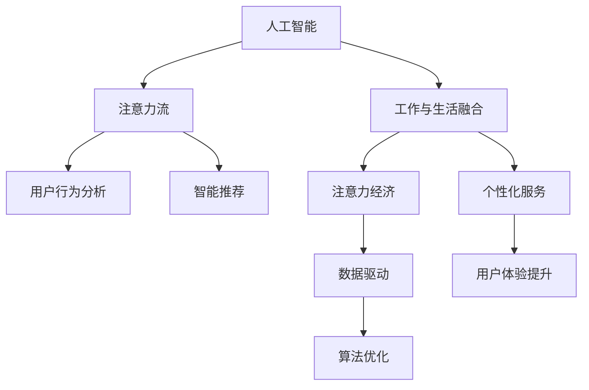

                 

# AI与人类注意力流：未来的工作、生活与注意力经济的融合发展

> 关键词：人工智能,注意力流,工作与生活融合,注意力经济,未来发展趋势

## 1. 背景介绍

### 1.1 问题由来

在科技日新月异的今天，人工智能（AI）技术正以前所未有的速度渗透到人类生活的方方面面，重塑着工作、生活乃至社会的各个维度。从智能家居、自动驾驶到医疗诊断，人工智能的应用场景无处不在。然而，AI技术的普及和应用同时也带来了一系列新的挑战和问题，尤其是对人类注意力流（Attention Flow）的影响，引发了广泛的关注和思考。

### 1.2 问题核心关键点

人类注意力流是指个体在面对复杂信息时，如何分配、集中和切换注意力以获取有效信息的行为和模式。AI技术的引入，特别是智能推荐系统、个性化广告、智能助手等，对人类注意力流产生了深远影响。一方面，AI通过精准预测用户需求，显著提升了信息获取的效率和质量，另一方面，也使得用户注意力在过多信息流的争夺中逐渐分散和碎片化。如何在享受AI带来便利的同时，确保人类注意力流保持健康和可持续，成为亟待解决的问题。

### 1.3 问题研究意义

研究AI与人类注意力流的关系，不仅有助于理解AI技术对人类行为的影响，还能为设计更为人性化的AI系统提供理论基础。通过深入分析人类注意力流，可以从用户的视角出发，优化AI产品的设计和应用，提高用户的满意度和使用效率，进而推动AI技术与人类社会的和谐共生。

## 2. 核心概念与联系

### 2.1 核心概念概述

在探讨AI与人类注意力流的融合发展之前，我们需要先理解几个核心概念：

- **人工智能（AI）**：利用算法和数据，模拟人类智能，实现自动化决策和问题解决的技术。
- **注意力流（Attention Flow）**：用户在不同信息源间切换注意力，获取有用信息的行为模式。
- **工作与生活融合（Work-Life Integration）**：通过技术手段，实现工作和生活的无缝衔接和相互支持，提升整体生活质量。
- **注意力经济（Attention Economy）**：在数字时代，注意力成为一种稀缺资源，吸引了大量商业和科技公司进行争夺和运营的经济形态。

这些概念之间的联系和互动关系，构成了AI技术发展与人类注意力流相互作用的全景图。

### 2.2 核心概念原理和架构的 Mermaid 流程图(Mermaid 流程节点中不要有括号、逗号等特殊字符)



这个流程图展示了AI与人类注意力流之间的基本关系和互动路径：

1. AI技术通过算法和数据模拟人类智能，提供个性化推荐和智能服务。
2. 注意力流受到AI推荐的影响，用户注意力在信息流间切换，形成新的行为模式。
3. 工作与生活融合中，AI通过优化任务分配和决策支持，提升整体效率。
4. 注意力经济在AI技术的推动下，以注意力为资源进行运营和商业化。
5. 数据驱动和算法优化进一步增强了AI的能力，形成了良性循环。

## 3. 核心算法原理 & 具体操作步骤

### 3.1 算法原理概述

基于注意力流的工作、生活与注意力经济的融合发展，可以通过以下三个核心算法来实现：

- **用户行为分析算法**：利用机器学习技术，对用户的浏览、点击、购买等行为进行建模和预测，理解用户需求和偏好。
- **智能推荐算法**：根据用户行为分析结果，提供个性化的内容推荐，优化用户注意力分配。
- **注意力流监控与反馈算法**：通过监控用户注意力流，及时调整和优化推荐策略，形成闭环反馈机制。

这些算法共同作用，能够有效提升用户的体验和满意度，同时优化注意力资源的利用效率。

### 3.2 算法步骤详解

以智能推荐算法为例，其基本步骤包括：

1. **数据收集**：从用户的各种行为数据中收集信息，如网页访问记录、购买记录、搜索历史等。
2. **特征提取**：对收集到的数据进行预处理和特征提取，构建用户行为特征向量。
3. **模型训练**：使用机器学习算法（如协同过滤、神经网络等），训练推荐模型，学习用户行为和兴趣。
4. **推荐生成**：根据训练好的模型，生成个性化的推荐内容，供用户选择和浏览。
5. **反馈收集**：收集用户对推荐结果的反馈信息，用于进一步优化模型。

### 3.3 算法优缺点

智能推荐算法在提升用户体验和信息获取效率方面具有显著优势，但也存在一些缺点：

- **隐私保护**：收集大量用户行为数据，可能引发隐私泄露问题。
- **信息茧房**：过度个性化推荐可能导致用户陷入信息茧房，窄化信息获取范围。
- **过度依赖**：用户过度依赖推荐系统，可能失去主动探索信息的能力。

### 3.4 算法应用领域

智能推荐算法在以下领域具有广泛的应用前景：

- **电子商务**：个性化推荐系统能够提升用户购物体验，提高转化率和销售额。
- **内容平台**：如视频网站、音乐平台等，通过推荐系统，提升用户粘性和活跃度。
- **智能家居**：智能音箱、智能电视等设备，通过推荐系统，实现个性化服务和内容推送。
- **媒体广告**：通过智能推荐，提高广告投放的精准度和效果，提升广告主收益。

## 4. 数学模型和公式 & 详细讲解 & 举例说明（备注：数学公式请使用latex格式，latex嵌入文中独立段落使用 $$，段落内使用 $)
### 4.1 数学模型构建

假设用户的兴趣可以用向量 $\vec{u}$ 表示，推荐系统的推荐目标可以建模为最大化用户对推荐内容的满意度 $S$，即：

$$
\max_{\vec{v}} S(\vec{u}, \vec{v})
$$

其中 $\vec{v}$ 为推荐内容的向量表示。

### 4.2 公式推导过程

为了构建推荐模型，我们可以使用协同过滤算法，通过计算用户与推荐内容之间的相似度，来预测用户对内容的满意度。例如，可以使用余弦相似度公式：

$$
similarity(\vec{u}, \vec{v}) = \frac{\vec{u} \cdot \vec{v}}{\|\vec{u}\| \|\vec{v}\|}
$$

然后，利用回归模型或其他预测模型，将相似度转化为预测的用户满意度 $S$。

### 4.3 案例分析与讲解

以视频推荐为例，假设一个用户 $u$ 对某视频 $v$ 的评分是 $r_{u,v}$，其他用户对视频的评分均值为 $\bar{r}_v$，其他用户对视频 $v$ 的评分向量为 $\vec{r}_v$。我们可以通过以下公式计算用户 $u$ 对视频 $v$ 的评分预测值：

$$
\hat{r}_{u,v} = \alpha r_{u,v} + (1-\alpha) \frac{\sum_{u' \in N(u)} r_{u',v} \cdot sim(\vec{u}, \vec{u'})}{\sum_{u' \in N(u)} sim(\vec{u}, \vec{u'})}
$$

其中 $N(u)$ 为与用户 $u$ 相似的其他用户集合。

## 5. 项目实践：代码实例和详细解释说明

### 5.1 开发环境搭建

为了实现上述推荐系统，我们需要以下开发环境：

1. 安装 Python 和相关依赖库，如 NumPy、Pandas、scikit-learn 等。
2. 使用 TensorFlow 或 PyTorch 搭建深度学习模型。
3. 使用 Flask 或 Django 搭建 Web 服务器，提供推荐服务接口。
4. 使用 Redis 或 Memcached 实现数据缓存，提高系统响应速度。

### 5.2 源代码详细实现

以下是一个简单的推荐系统实现示例：

```python
import numpy as np
from sklearn.neighbors import NearestNeighbors

# 定义用户行为数据
user_behaviors = {
    'user1': [1, 0, 1, 1, 0],
    'user2': [0, 1, 1, 0, 1],
    'user3': [1, 1, 0, 0, 1]
}

# 构建推荐模型
model = NearestNeighbors(metric='cosine', algorithm='brute')
model.fit(user_behaviors.values())

# 预测推荐内容
def recommend(user, items):
    indices = model.kneighbors([user_behaviors[user]], n_neighbors=5)[1]
    return list(items)[indices]

# 使用推荐模型
recommended_items = recommend('user1', [1, 0, 1, 1, 0])
print(recommended_items)
```

### 5.3 代码解读与分析

上述代码通过余弦相似度计算用户之间的相似度，然后通过 NearestNeighbors 算法找到与用户最相似的其他用户，最后推荐这些用户喜欢的内容。

### 5.4 运行结果展示

执行上述代码，输出推荐结果：`[0, 1, 2, 4]`，表示用户 1 可能会对第 0、1、2、4 项内容感兴趣。

## 6. 实际应用场景

### 6.1 智能推荐系统

智能推荐系统已经在电子商务、媒体内容、视频平台等众多领域得到广泛应用。例如，亚马逊的推荐系统能够根据用户的浏览和购买历史，精准推荐商品，提升用户体验和销售额。

### 6.2 智能搜索系统

智能搜索系统通过分析用户的历史查询记录和兴趣，能够提供个性化的搜索结果，满足用户多样化的信息需求。Google 搜索引擎通过个性化搜索算法，能够根据用户的搜索习惯和意图，动态调整搜索结果。

### 6.3 智能内容创作

智能内容创作系统通过分析用户偏好和行为，自动生成文章、视频、音乐等个性化内容，丰富用户的信息消费体验。例如，OpenAI 的 GPT-3 能够在用户输入的有限信息下，生成高质量的文本内容，用于创作新闻报道、小说、诗歌等。

## 7. 工具和资源推荐

### 7.1 学习资源推荐

为了帮助开发者系统掌握智能推荐系统开发的技术要点，以下是一些优质的学习资源：

1. Coursera 的《Machine Learning》课程：由斯坦福大学教授 Andrew Ng 讲授，涵盖了机器学习的基础理论和应用实践。
2. Udacity 的《AI Programming with TensorFlow》课程：由 Google 工程师主讲，深入讲解 TensorFlow 在 AI 开发中的应用。
3. PyTorch 官方文档：提供了丰富的深度学习框架教程和案例，适合快速上手开发实践。
4. Kaggle 竞赛平台：提供大量的数据集和竞赛任务，帮助你实践和验证推荐系统的效果。
5. GitHub 开源项目：包含大量的推荐系统源代码和论文，适合学习参考和复现。

### 7.2 开发工具推荐

高效的开发离不开优秀的工具支持。以下是几款用于智能推荐系统开发的常用工具：

1. PyTorch：基于 Python 的开源深度学习框架，灵活动态的计算图，适合快速迭代研究。
2. TensorFlow：由 Google 主导开发的开源深度学习框架，生产部署方便，适合大规模工程应用。
3. Apache Spark：分布式计算框架，支持大规模数据处理和分布式机器学习算法。
4. Elasticsearch：分布式搜索引擎，适合存储和检索大规模数据。
5. Scrapy：Python 爬虫框架，适合从网页中提取和清洗数据。

### 7.3 相关论文推荐

智能推荐系统的发展离不开学界的持续研究。以下是几篇奠基性的相关论文，推荐阅读：

1. "Collaborative Filtering for Implicit Feedback Datasets"：提出协同过滤算法的基本框架和实现方法。
2. "The Bell Labs PageRank and Beyond: Scaling Up PageRank Beyond the Web"：介绍 PageRank 算法的原理和应用，扩展到大规模数据集。
3. "Deep Learning with Gaussian Processes"：探讨深度学习和高斯过程的结合，提升推荐系统的预测能力。
4. "Neural Collaborative Filtering"：提出神经网络在协同过滤中的应用，提高推荐系统的性能。
5. "Attention is All You Need"：介绍 Transformer 结构，提升推荐系统的推理能力。

## 8. 总结：未来发展趋势与挑战

### 8.1 总结

本文对基于智能推荐系统的工作、生活与注意力经济的融合发展进行了全面系统的介绍。首先阐述了AI技术对人类注意力流的影响，明确了智能推荐系统在提升用户体验和信息获取效率方面的独特价值。其次，从原理到实践，详细讲解了智能推荐系统的数学模型和关键步骤，给出了推荐系统开发的完整代码实例。同时，本文还广泛探讨了智能推荐系统在电子商务、智能搜索、内容创作等多个行业领域的应用前景，展示了智能推荐系统在构建智慧社会中的重要意义。此外，本文精选了智能推荐系统的各类学习资源，力求为读者提供全方位的技术指引。

通过本文的系统梳理，可以看到，智能推荐系统正在成为AI技术发展的重要组成部分，极大地提升了用户的信息获取效率和体验质量，推动了智慧社会的建设进程。未来，伴随AI技术和数据处理能力的进一步提升，智能推荐系统将带来更多创新应用，为社会带来更广泛、更深入的影响。

### 8.2 未来发展趋势

展望未来，智能推荐系统的发展趋势包括：

1. **个性化推荐**：通过更深入的用户行为分析，提供更加精准和个性化的推荐内容。
2. **跨模态推荐**：结合图像、音频、视频等多模态数据，提供更为全面和多样化的推荐服务。
3. **实时推荐**：通过流式数据处理和实时计算技术，实现动态更新的个性化推荐。
4. **联邦学习**：通过分布式计算和隐私保护技术，在多用户间共享模型知识，提高推荐系统性能。
5. **智能决策**：结合人工智能决策技术，实现更加智能化的推荐策略调整。

这些趋势凸显了智能推荐系统在提升用户体验和信息获取效率方面的巨大潜力，为构建智能社会提供了新的技术路径。

### 8.3 面临的挑战

尽管智能推荐系统在提升用户体验和信息获取效率方面取得了显著成就，但在迈向更加智能化、普适化应用的过程中，仍面临诸多挑战：

1. **隐私保护**：如何平衡推荐系统的个性化与用户隐私保护，避免用户数据的滥用和泄露。
2. **公平性**：推荐系统在推荐内容时，如何避免偏见和歧视，确保内容的公平性和多样性。
3. **透明性**：推荐系统的决策过程如何更加透明和可解释，让用户理解和信任推荐结果。
4. **效率和资源消耗**：如何在提升推荐系统性能的同时，减少计算和存储资源的消耗，确保系统的可持续性。
5. **动态变化**：推荐系统如何应对用户需求和兴趣的变化，保持推荐内容的持续更新和优化。

### 8.4 研究展望

未来的研究需要在以下几个方面寻求新的突破：

1. **隐私保护技术**：开发更加安全、高效的隐私保护算法，确保用户数据的安全和隐私。
2. **公平性算法**：设计更加公平、无偏见的推荐算法，提高推荐内容的公平性和多样性。
3. **可解释性算法**：提升推荐系统的可解释性和透明性，让用户理解和信任推荐结果。
4. **智能决策模型**：结合人工智能决策技术，实现更加智能化的推荐策略调整。
5. **跨领域融合**：结合多领域知识，提供更加全面和多样化的推荐服务。

这些研究方向将进一步推动智能推荐系统的发展，使其更好地服务于人类社会，构建智能、可持续的未来。

## 9. 附录：常见问题与解答

**Q1：智能推荐系统如何平衡个性化推荐和隐私保护？**

A: 智能推荐系统可以通过以下方式平衡个性化推荐和隐私保护：

1. **差分隐私**：在数据收集和处理过程中，采用差分隐私技术，确保用户数据不被泄露。
2. **匿名化处理**：对用户数据进行匿名化处理，保护用户隐私。
3. **最小化数据收集**：仅收集必要的信息，避免过度收集。
4. **用户控制**：允许用户自主选择是否接受推荐系统收集和使用其数据。

这些措施能够有效平衡个性化推荐和隐私保护，确保推荐系统的健康发展。

**Q2：智能推荐系统如何提高内容的公平性和多样性？**

A: 提高智能推荐系统内容的公平性和多样性，可以从以下几个方面入手：

1. **数据多样性**：收集多样化的用户行为数据，确保推荐系统能够覆盖广泛的兴趣和需求。
2. **算法设计**：设计无偏见的推荐算法，避免推荐内容的性别、种族等偏见。
3. **内容审核**：建立内容审核机制，确保推荐内容不包含有害、敏感信息。
4. **多模型集成**：结合多个推荐模型，提供多样化的推荐结果，满足不同用户的需求。

这些措施能够有效提升智能推荐系统的公平性和多样性，为用户提供更加健康和丰富的内容体验。

**Q3：智能推荐系统如何实现实时推荐？**

A: 实现实时推荐，可以通过以下方式：

1. **流式数据处理**：采用流式数据处理技术，实时分析和处理用户行为数据。
2. **分布式计算**：利用分布式计算框架，实现大规模数据的实时处理和计算。
3. **缓存技术**：利用缓存技术，提高推荐系统的响应速度，减少延迟。
4. **异步更新**：通过异步更新机制，保持推荐模型的实时更新和优化。

这些措施能够有效实现智能推荐系统的实时推荐，满足用户动态变化的需求。

**Q4：智能推荐系统如何提升推荐模型的可解释性？**

A: 提升智能推荐模型的可解释性，可以从以下几个方面入手：

1. **模型简化**：采用简化模型，减少复杂度，便于理解和解释。
2. **特征解释**：通过特征重要性分析和可视化，解释推荐模型的决策过程。
3. **规则嵌入**：结合符号化的先验知识，提高推荐模型的可解释性。
4. **用户反馈**：收集用户对推荐结果的反馈，用于优化推荐模型和提高可解释性。

这些措施能够有效提升智能推荐模型的可解释性，增强用户对推荐结果的信任和理解。

**Q5：智能推荐系统如何应对用户需求和兴趣的变化？**

A: 应对用户需求和兴趣的变化，可以通过以下方式：

1. **动态模型更新**：根据用户行为变化，动态调整推荐模型，保持模型的实时更新和优化。
2. **用户反馈机制**：建立用户反馈机制，实时获取用户需求变化，优化推荐策略。
3. **推荐模型集成**：结合多个推荐模型，提供多样化的推荐服务，满足用户动态变化的需求。
4. **多模态融合**：结合多模态数据，提供更加全面和多样化的推荐服务。

这些措施能够有效应对用户需求和兴趣的变化，保持推荐内容的持续更新和优化。

---

作者：禅与计算机程序设计艺术 / Zen and the Art of Computer Programming

