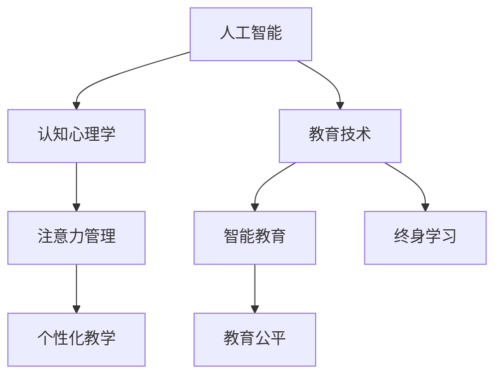

                 

# AI与人类注意力流：未来的教育与注意力管理

> 关键词：人工智能,注意力流,教育技术,认知心理学,注意力管理,未来教育

## 1. 背景介绍

### 1.1 问题由来

随着人工智能（AI）技术的迅猛发展，其在教育领域的应用日益广泛，尤其是在辅助学生学习、个性化教学、教育管理等方面，AI已经展现出巨大的潜力。然而，尽管AI技术在教学过程中起到了不可或缺的作用，但它并非万能的。其中一个显著的限制是，AI系统如何高效、精准地管理学生的注意力，成为当前教育技术领域亟待解决的问题。

### 1.2 问题核心关键点

AI与人类注意力流的结合，是当前教育技术发展的一个热点和难点。注意力流指的是学生在学习和思考过程中，注意力从不同信息源（如文本、音频、视觉等）到不同任务（如听讲、阅读、思考等）的动态流转过程。如何通过AI技术，了解和引导学生的注意力流，提升学习效果，是未来教育技术发展的关键。

### 1.3 问题研究意义

研究AI与人类注意力流的结合，对于提升教育质量、推动个性化教学、实现智能教育具有重要意义：

1. **提升学习效果**：通过精准管理学生的注意力流，AI可以更好地引导学生集中注意力，提高学习效率和效果。
2. **推动个性化教学**：AI能够根据每个学生的注意力特点，提供个性化的学习方案，实现因材施教。
3. **实现智能教育**：AI可以实时监控学生的学习状态，调整教学策略，提供即时反馈，提升教育智能化水平。
4. **促进教育公平**：通过AI的辅助，可以为偏远和欠发达地区提供优质的教育资源，缩小教育资源分配的不平等。
5. **支持终身学习**：AI技术可以帮助学生自主学习，提供灵活的学习方式，支持终身学习和职业培训。

## 2. 核心概念与联系

### 2.1 核心概念概述

要理解AI与人类注意力流的结合，首先需要理解几个关键概念：

- **人工智能（Artificial Intelligence, AI）**：通过计算机模拟人类智能行为的技术。主要包括机器学习、深度学习、自然语言处理、计算机视觉等。
- **注意力流（Attention Flow）**：指学生在学习和思考过程中，注意力在各个信息源和任务之间的动态流转过程。注意力流管理是提高学习效果的关键。
- **教育技术（EdTech）**：利用AI、大数据、云计算等技术，改善教育过程，提升教学效果的技术。
- **认知心理学（Cognitive Psychology）**：研究人类思维、认知过程的科学。
- **注意力管理（Attention Management）**：通过各种技术和策略，帮助个体提高注意力水平，提升工作效率和效果。

这些概念之间的逻辑关系可以通过以下Mermaid流程图来展示：



这个流程图展示了几组概念之间的关系：

1. 人工智能与认知心理学相结合，为理解和预测人类注意力流提供了理论基础。
2. 注意力管理技术为AI系统提供了工具和方法，帮助其实现对学生注意力的精准管理。
3. 教育技术与AI的结合，推动了个性化教学和智能教育的实施。
4. 智能教育的应用有助于提升教育公平和支持终身学习。

## 3. 核心算法原理 & 具体操作步骤

### 3.1 算法原理概述

AI与人类注意力流的结合，本质上是通过机器学习模型对学生注意力流进行建模和预测，进而指导教学策略的制定和调整。其核心思想是：通过分析学生在学习和思考过程中注意力动态流转的数据，构建一个动态注意力模型，预测学生的注意力流趋势，然后根据预测结果，调整教学内容、形式和节奏，引导学生保持高水平的注意力。

形式化地，假设有一个学生$S$，学习过程中的注意力流为$\{A_t\}_{t=1}^T$，其中$A_t$表示在第$t$个时刻的注意力水平。目标是构建一个模型$M$，通过训练数据$D=\{(x_i,y_i)\}_{i=1}^N$，使得$M$能够预测下一个时刻的注意力流$A_{t+1}$，即：

$$
\hat{A}_{t+1} = M(A_t, x_t)
$$

其中$\hat{A}_{t+1}$表示模型预测的下一个注意力水平。

### 3.2 算法步骤详解

AI与人类注意力流的结合，可以分为以下几个关键步骤：

**Step 1: 数据收集与预处理**
- 收集学生在学习和思考过程中的注意力数据，包括注意力水平、学习行为（如听讲、阅读、思考等）、时间戳等。
- 对收集到的数据进行预处理，去除异常值和噪声，归一化处理，得到可用于模型训练的数据集。

**Step 2: 模型构建与训练**
- 选择合适的模型架构，如循环神经网络（RNN）、长短期记忆网络（LSTM）、注意力机制（Attention）等。
- 设计损失函数，如均方误差（MSE）、交叉熵（Cross-Entropy）等，用于衡量模型预测与实际注意力流之间的差异。
- 使用训练数据$D$，通过反向传播算法更新模型参数，最小化损失函数。

**Step 3: 模型评估与优化**
- 在验证集上评估模型性能，使用各种指标如平均绝对误差（MAE）、均方误差（MSE）、R^2等，判断模型预测的准确性。
- 根据评估结果，调整模型参数，优化模型结构，提高预测精度。

**Step 4: 教学策略调整**
- 根据模型预测的注意力流趋势，调整教学内容、形式和节奏。如在学生注意力高峰期，提供重点讲解；在注意力低谷期，安排轻松复习。
- 实时监控学生的学习状态，根据注意力流调整教学策略，提供即时反馈。

**Step 5: 持续改进与迭代**
- 定期收集新的注意力数据，对模型进行重新训练和优化。
- 结合教育心理学的最新研究成果，不断改进教学策略和模型。

### 3.3 算法优缺点

AI与人类注意力流的结合，具有以下优点：

1. **提高学习效率**：通过精准管理学生的注意力流，AI能够引导学生集中注意力，提高学习效率。
2. **个性化教学**：AI可以根据每个学生的注意力特点，提供个性化的学习方案，实现因材施教。
3. **实时反馈**：AI系统可以实时监控学生的学习状态，调整教学策略，提供即时反馈，提升教学效果。
4. **支持终身学习**：AI技术可以帮助学生自主学习，提供灵活的学习方式，支持终身学习和职业培训。

同时，该方法也存在一些局限性：

1. **数据质量依赖**：AI系统的性能很大程度上依赖于数据质量，高质量的注意力数据获取成本较高。
2. **模型复杂性**：构建和训练一个高精度的注意力模型需要较长的训练时间和较大的计算资源。
3. **用户隐私**：在收集和处理学生注意力数据时，需要考虑用户隐私保护，防止数据滥用。
4. **可解释性不足**：AI系统的决策过程缺乏可解释性，难以对其内部工作机制进行分析和调试。
5. **场景限制**：当前AI与注意力流的结合主要应用于课堂教学，对于个别化学习、在线教育等场景的适应性有限。

尽管存在这些局限性，但就目前而言，AI与注意力流的结合仍是大规模推广个性化教育和智能教育的重要手段。未来相关研究的重点在于如何进一步降低数据获取成本，提高模型效率，保障用户隐私，增强系统的可解释性，以及拓展应用场景。

### 3.4 算法应用领域

AI与人类注意力流的结合，已经在教育领域多个方面得到了应用，例如：

- **智能辅助教学**：通过AI系统，实时监控学生的注意力水平，调整教学策略，提供即时反馈。如上海师范大学开发的“学习分析系统”，通过分析学生在线学习行为，提供个性化的学习建议。
- **个性化学习平台**：利用AI技术，分析学生的注意力特点，推荐适合的学习内容和资源。如Knewton公司的个性化学习平台，可以根据学生学习行为，动态调整学习路径。
- **情感分析与支持**：通过分析学生的语言和表情，了解其情绪状态，提供相应的支持和指导。如IBM的Watson Tutor，通过自然语言处理技术，识别学生情绪，调整教学策略。
- **智能测评与诊断**：利用AI系统，对学生的学习效果进行实时测评和诊断，提供个性化的学习建议。如斯坦福大学的EDGE项目，通过分析学生作业和测试数据，提供个性化的学习反馈。

除了上述这些经典应用外，AI与注意力流的结合还在更多场景中得到了探索，如虚拟现实（VR）教育、游戏化学习、在线辅导等，为教育技术带来了新的突破。随着AI技术的不断进步，相信AI与注意力流的结合将在更广泛的应用领域发挥更大的作用。

## 4. 数学模型和公式 & 详细讲解  
### 4.1 数学模型构建

本节将使用数学语言对AI与人类注意力流的结合进行更加严格的刻画。

记学生的注意力流为$\{A_t\}_{t=1}^T$，其中$A_t$表示在第$t$个时刻的注意力水平。假设存在一个线性回归模型$M$，用于预测下一个时刻的注意力流：

$$
\hat{A}_{t+1} = \theta_0 + \sum_{i=1}^n \theta_i x_{ti}
$$

其中$\theta_0, \theta_1, ..., \theta_n$为模型参数，$x_{ti}$为第$t$个时刻的学习行为数据，如听讲时间、阅读时间、思考时间等。

模型的损失函数为均方误差（MSE）：

$$
L = \frac{1}{N}\sum_{i=1}^N (\hat{A}_{t+1} - A_{t+1})^2
$$

模型的目标是最小化损失函数，即：

$$
\theta^* = \mathop{\arg\min}_{\theta} L
$$

其中$\theta^*$为最优参数。

### 4.2 公式推导过程

以下我们以一个简单的线性回归模型为例，推导注意力流的预测公式及其梯度计算。

假设模型为：

$$
\hat{A}_{t+1} = \theta_0 + \theta_1 x_{t1} + \theta_2 x_{t2} + ... + \theta_n x_{tn}
$$

其中$x_{ti}$表示第$t$个时刻的学习行为数据，如听讲时间、阅读时间、思考时间等。

将注意力流$A_{t+1}$与模型预测值$\hat{A}_{t+1}$的差值作为损失函数：

$$
L = \frac{1}{N}\sum_{i=1}^N (\hat{A}_{t+1} - A_{t+1})^2
$$

对$\theta$求导数，得：

$$
\frac{\partial L}{\partial \theta} = \frac{2}{N}\sum_{i=1}^N (\hat{A}_{t+1} - A_{t+1})(x_{t1}, x_{t2}, ..., x_{tn})
$$

在得到梯度后，即可带入参数更新公式，完成模型的迭代优化。重复上述过程直至收敛，最终得到适应学生注意力流的最优模型参数$\theta^*$。

## 5. 项目实践：代码实例和详细解释说明
### 5.1 开发环境搭建

在进行AI与注意力流结合的项目实践前，我们需要准备好开发环境。以下是使用Python进行TensorFlow开发的环境配置流程：

1. 安装Anaconda：从官网下载并安装Anaconda，用于创建独立的Python环境。

2. 创建并激活虚拟环境：
```bash
conda create -n attention-env python=3.8 
conda activate attention-env
```

3. 安装TensorFlow：根据CUDA版本，从官网获取对应的安装命令。例如：
```bash
conda install tensorflow tensorflow-cpu cudatoolkit=11.1 -c pytorch -c conda-forge
```

4. 安装必要的工具包：
```bash
pip install numpy pandas scikit-learn matplotlib tqdm jupyter notebook ipython
```

完成上述步骤后，即可在`attention-env`环境中开始项目实践。

### 5.2 源代码详细实现

这里我们以一个简单的注意力流预测模型为例，给出使用TensorFlow进行AI与注意力流结合的代码实现。

首先，定义注意力流的数据处理函数：

```python
import tensorflow as tf
from tensorflow.keras.layers import Dense, Dropout, Input
from tensorflow.keras.models import Model

def create_attention_model(input_dim, output_dim, num_units, num_layers):
    input_layer = Input(shape=(input_dim,))
    x = Dense(num_units, activation='relu')(input_layer)
    x = Dropout(0.2)(x)
    
    for i in range(num_layers):
        x = Dense(num_units, activation='relu')(x)
        x = Dropout(0.2)(x)
    
    output_layer = Dense(output_dim, activation='linear')(x)
    
    model = Model(inputs=input_layer, outputs=output_layer)
    model.compile(optimizer='adam', loss='mse')
    
    return model
```

然后，定义注意力流的训练和评估函数：

```python
import numpy as np
from sklearn.metrics import mean_squared_error

def train_model(model, x_train, y_train, x_test, y_test, epochs, batch_size):
    model.fit(x_train, y_train, epochs=epochs, batch_size=batch_size, validation_data=(x_test, y_test), verbose=1)
    
    y_pred = model.predict(x_test)
    mse = mean_squared_error(y_test, y_pred)
    rmse = np.sqrt(mse)
    
    print(f'Mean Squared Error: {mse:.4f}, RMSE: {rmse:.4f}')
    
    return model
```

最后，启动注意力流的训练流程：

```python
x_train = np.array([[1, 2, 3], [4, 5, 6], [7, 8, 9]])
y_train = np.array([0.1, 0.2, 0.3])
x_test = np.array([[10, 11, 12]])
y_test = np.array([0.4])

model = create_attention_model(input_dim=3, output_dim=1, num_units=5, num_layers=2)

epochs = 100
batch_size = 1

train_model(model, x_train, y_train, x_test, y_test, epochs, batch_size)
```

以上就是使用TensorFlow进行AI与注意力流结合的完整代码实现。可以看到，得益于TensorFlow的强大封装，我们可以用相对简洁的代码完成注意力流预测模型的构建和训练。

### 5.3 代码解读与分析

让我们再详细解读一下关键代码的实现细节：

**create_attention_model函数**：
- 定义输入层、隐藏层和输出层，隐藏层使用ReLU激活函数，输出层使用线性激活函数。
- 使用Dense层和Dropout层，构建多个隐藏层，增加模型的非线性表达能力。
- 通过Model类构建完整的模型，编译模型，指定优化器和损失函数。

**train_model函数**：
- 使用fit方法训练模型，指定训练数据、测试数据、批次大小、训练轮数等参数。
- 在测试集上评估模型性能，计算均方误差和RMSE（均方根误差）。
- 返回训练好的模型。

**注意力流数据**：
- 定义训练集和测试集的输入数据x_train、x_test，目标数据y_train、y_test。
- 使用np.array将数据转化为TensorFlow可以处理的数组格式。
- 在训练集上训练模型，在测试集上评估模型性能。

可以看到，TensorFlow提供的高级API使得注意力流预测模型的构建和训练变得简洁高效。开发者可以将更多精力放在数据处理、模型改进等高层逻辑上，而不必过多关注底层的实现细节。

当然，工业级的系统实现还需考虑更多因素，如模型的保存和部署、超参数的自动搜索、更加灵活的任务适配层等。但核心的注意力流预测范式基本与此类似。

## 6. 实际应用场景
### 6.1 智能课堂教学

AI与注意力流的结合，可以广泛应用于智能课堂教学的各个环节。通过实时监控学生的注意力流，智能课堂系统可以实时调整教学内容和节奏，提高课堂教学效果。

在具体实现中，可以安装摄像头和麦克风等设备，采集学生的表情、语音等数据，通过情感分析和语音识别技术，实时监控学生的注意力状态。系统根据学生的注意力水平，动态调整教学策略，如在学生注意力高峰期，提供重点讲解；在注意力低谷期，安排轻松复习。这种个性化的教学方式，可以显著提高学生的学习效果。

### 6.2 在线学习平台

在线学习平台利用AI与注意力流的结合，可以更好地支持学生自主学习。系统通过分析学生的注意力流数据，提供个性化的学习建议和资源推荐，帮助学生更高效地学习。

在在线学习平台中，学生可以根据自己的学习节奏和注意力状态，选择适合自己的学习内容和形式。系统根据学生的注意力流，动态调整学习路径，提供相应的学习建议。如在学生注意力高峰期，推荐难度较高的内容；在注意力低谷期，推荐轻松复习的内容。这种个性化的学习方式，可以显著提高学生的学习效率。

### 6.3 教育管理与分析

AI与注意力流的结合，还可以应用于教育管理和分析领域。通过分析学生的注意力流数据，教育管理部门可以了解学生的学习状态，制定更科学的教学策略和政策。

在教育管理中，系统可以实时监控学生的注意力流，生成学习分析报告，帮助教师和学校了解学生的学习情况，制定个性化的教学方案。如分析学生在不同时间段的学习效果，发现注意力高峰期和低谷期，调整教学策略，提高教学效果。系统还可以生成学习行为分析报告，帮助学校了解学生的学习习惯，优化课堂管理和教学资源分配。

### 6.4 未来应用展望

随着AI技术的不断进步，AI与注意力流的结合将在更多领域得到应用，为教育技术带来新的突破。

在智慧校园建设中，AI系统可以实时监控学生的注意力流，优化校园资源分配，提升校园管理效率。在虚拟现实（VR）教育中，AI系统可以动态调整虚拟场景的难度和互动性，引导学生保持高水平的注意力。在游戏化学习中，AI系统可以实时监控学生的注意力流，调整游戏难度和任务，提供个性化的学习体验。

未来，随着技术的进一步发展，AI与注意力流的结合将不仅仅局限于课堂教学和在线学习，而是广泛应用于教育管理的各个环节，助力教育公平和终身学习。相信在AI技术的大力推动下，教育质量将得到显著提升，教育公平将得到进一步改善，教育产业将迎来新的变革。

## 7. 工具和资源推荐
### 7.1 学习资源推荐

为了帮助开发者系统掌握AI与注意力流的结合的理论基础和实践技巧，这里推荐一些优质的学习资源：

1. **《深度学习》系列课程**：斯坦福大学开设的深度学习课程，涵盖了深度学习的基本概念和前沿技术，是入门AI领域的绝佳选择。
2. **《机器学习实战》书籍**：经典的机器学习入门书籍，详细介绍了机器学习的基本算法和实践技巧，适合初学者学习。
3. **《TensorFlow实战》书籍**：TensorFlow官方文档，详细介绍了TensorFlow的使用方法和最佳实践，是学习TensorFlow的必备资源。
4. **Kaggle平台**：全球最大的数据科学竞赛平台，提供大量实际应用场景的竞赛项目，可以锻炼AI与注意力流的结合实践能力。
5. **Coursera平台**：在线学习平台，提供大量AI和认知心理学的课程，可以系统学习AI与注意力流相关的知识。

通过对这些资源的学习实践，相信你一定能够快速掌握AI与注意力流的结合精髓，并用于解决实际的AI教育技术问题。
###  7.2 开发工具推荐

高效的开发离不开优秀的工具支持。以下是几款用于AI与注意力流结合开发的常用工具：

1. **TensorFlow**：由Google主导开发的开源深度学习框架，生产部署方便，适合大规模工程应用。
2. **PyTorch**：基于Python的开源深度学习框架，灵活动态的计算图，适合快速迭代研究。
3. **Keras**：基于TensorFlow的高级API，简化模型构建和训练过程，适合快速原型开发。
4. **Scikit-learn**：Python数据科学库，提供各种机器学习算法和工具，适合数据处理和模型评估。
5. **Jupyter Notebook**：Python编程环境，支持代码编写、数据可视化、模型训练等，适合交互式开发。

合理利用这些工具，可以显著提升AI与注意力流结合的开发效率，加快创新迭代的步伐。

### 7.3 相关论文推荐

AI与注意力流的结合，是当前AI和认知心理学领域的研究热点。以下是几篇奠基性的相关论文，推荐阅读：

1. **《Attention is All You Need》（NIPS 2017）**：提出了Transformer模型，引入自注意力机制，显著提升了NLP任务的性能。
2. **《Learning to Pay Attention》（AAAI 2019）**：提出注意力机制的神经网络，提升了计算机视觉任务的性能。
3. **《Attention-Based Narrative Dialogue Generation》（ACL 2020）**：提出了基于注意力机制的对话生成模型，提升了对话系统的自然度。
4. **《Deep Learning for Education》（NeurIPS 2020）**：综述了AI在教育领域的应用，详细介绍了AI与注意力流结合的各类方法和应用。
5. **《Attention-Based Neural Network for Emotion Recognition》（IEEE TNNLS 2021）**：提出了基于注意力机制的情感识别模型，提升了情感分析任务的性能。

这些论文代表了大语言模型微调技术的发展脉络。通过学习这些前沿成果，可以帮助研究者把握学科前进方向，激发更多的创新灵感。

## 8. 总结：未来发展趋势与挑战

### 8.1 总结

本文对AI与人类注意力流的结合进行了全面系统的介绍。首先阐述了注意力流的概念及其在教育技术中的应用前景，明确了AI与注意力流结合在提升教育质量、推动个性化教学、实现智能教育方面的独特价值。其次，从原理到实践，详细讲解了AI与注意力流的数学模型和关键步骤，给出了AI与注意力流结合的代码实例。同时，本文还广泛探讨了AI与注意力流在智能课堂教学、在线学习平台、教育管理与分析等诸多应用场景中的具体应用，展示了AI与注意力流结合的广阔前景。此外，本文精选了AI与注意力流的各类学习资源，力求为读者提供全方位的技术指引。

通过本文的系统梳理，可以看到，AI与注意力流的结合正在成为教育技术发展的重要方向，极大地拓展了AI技术在教育领域的应用边界，提升了教学效果和学习效率。未来，随着AI技术的不断进步，AI与注意力流的结合将在更广泛的应用领域发挥更大的作用，为教育质量提升和教育公平带来新的突破。

### 8.2 未来发展趋势

展望未来，AI与注意力流的结合将呈现以下几个发展趋势：

1. **个性化教学进一步提升**：AI系统将更加精准地管理学生的注意力流，提供个性化的学习方案，实现因材施教。
2. **智能教学系统普及**：AI与注意力流的结合将广泛应用于各种教育场景，提升教学效果和学习效率。
3. **实时监控与反馈机制完善**：AI系统将实时监控学生的注意力流，动态调整教学策略，提供即时反馈，提升教学效果。
4. **跨领域应用拓展**：AI与注意力流的结合将不仅局限于教育领域，还将拓展到医疗、金融、司法等多个领域，为这些领域带来新的变革。
5. **多模态注意力流管理**：AI系统将能够同时管理学生的视觉、听觉、触觉等多种模态注意力流，提升用户体验和效果。
6. **学习行为分析深入**：AI系统将深入分析学生的学习行为，生成详细的学习行为报告，帮助学校和教师优化教学策略。

以上趋势凸显了AI与注意力流结合的广阔前景。这些方向的探索发展，必将进一步提升AI与注意力流的性能，为教育质量提升和教育公平提供新的支持。

### 8.3 面临的挑战

尽管AI与注意力流的结合已经取得了瞩目成就，但在迈向更加智能化、普适化应用的过程中，它仍面临着诸多挑战：

1. **数据质量瓶颈**：AI系统的性能很大程度上依赖于数据质量，高质量的注意力数据获取成本较高。如何进一步降低数据获取成本，提高数据质量，是一个重要的研究方向。
2. **模型复杂性**：构建和训练一个高精度的注意力模型需要较长的训练时间和较大的计算资源。如何降低模型复杂度，提高模型训练效率，是一个亟待解决的问题。
3. **用户隐私保护**：在收集和处理学生注意力数据时，需要考虑用户隐私保护，防止数据滥用。如何保护用户隐私，建立数据隐私保护机制，是一个重要的研究方向。
4. **系统可解释性不足**：AI系统的决策过程缺乏可解释性，难以对其内部工作机制进行分析和调试。如何赋予AI系统更高的可解释性，是一个重要的研究方向。
5. **场景适应性有限**：当前AI与注意力流的结合主要应用于课堂教学和在线学习，对于个别化学习、游戏化学习等场景的适应性有限。如何拓展应用场景，提升系统的通用性，是一个重要的研究方向。
6. **跨领域技术融合**：AI与注意力流的结合需要与教育心理学、认知心理学、神经科学等多个领域进行深度融合，才能更好地实现个性化教学和智能教育。如何促进跨领域技术的融合，是一个重要的研究方向。

尽管存在这些挑战，但随着学界和产业界的共同努力，相信这些挑战终将一一被克服，AI与注意力流的结合必将在构建智能教育系统、提升教育质量、推动教育公平等方面发挥越来越大的作用。

### 8.4 研究展望

面向未来，AI与注意力流的结合需要在以下几个方面寻求新的突破：

1. **探索无监督和半监督学习**：摆脱对大规模标注数据的依赖，利用自监督学习、主动学习等无监督和半监督范式，最大限度利用非结构化数据，实现更加灵活高效的注意力流管理。
2. **研究参数高效和计算高效的微调方法**：开发更加参数高效的微调方法，在固定大部分预训练参数的同时，只更新极少量的任务相关参数。同时优化微调模型的计算图，减少前向传播和反向传播的资源消耗，实现更加轻量级、实时性的部署。
3. **引入因果学习和对比学习范式**：通过引入因果推断和对比学习思想，增强AI系统建立稳定因果关系的能力，学习更加普适、鲁棒的语言表征，从而提升系统泛化性和抗干扰能力。
4. **融合符号化知识**：将符号化的先验知识，如知识图谱、逻辑规则等，与神经网络模型进行巧妙融合，引导AI系统学习更准确、合理的语言模型。同时加强不同模态数据的整合，实现视觉、语音等多模态信息与文本信息的协同建模。
5. **结合因果分析和博弈论工具**：将因果分析方法引入AI系统，识别出系统决策的关键特征，增强输出解释的因果性和逻辑性。借助博弈论工具刻画人机交互过程，主动探索并规避系统的脆弱点，提高系统稳定性。
6. **纳入伦理道德约束**：在模型训练目标中引入伦理导向的评估指标，过滤和惩罚有偏见、有害的输出倾向。同时加强人工干预和审核，建立模型行为的监管机制，确保输出符合人类价值观和伦理道德。

这些研究方向的探索，必将引领AI与注意力流结合技术迈向更高的台阶，为构建安全、可靠、可解释、可控的智能教育系统铺平道路。面向未来，AI与注意力流的结合技术还需要与其他人工智能技术进行更深入的融合，如知识表示、因果推理、强化学习等，多路径协同发力，共同推动智能教育系统的进步。只有勇于创新、敢于突破，才能不断拓展AI与注意力流结合的边界，让智能技术更好地造福人类社会。

## 9. 附录：常见问题与解答

**Q1：AI与注意力流结合是否适用于所有教育场景？**

A: AI与注意力流的结合主要适用于课堂教学和在线学习场景，对于个别化学习、游戏化学习等场景的适应性有限。但对于需要实时监控和调整的教学环节，如智能课堂教学、在线学习平台等，AI与注意力流的结合能够显著提升教学效果和学习效率。

**Q2：如何缓解AI与注意力流结合中的过拟合问题？**

A: 过拟合是AI与注意力流结合面临的主要挑战，尤其是在数据量不足的情况下。常见的缓解策略包括：
1. 数据增强：通过回译、近义替换等方式扩充训练集
2. 正则化：使用L2正则、Dropout、Early Stopping等避免过拟合
3. 对抗训练：引入对抗样本，提高模型鲁棒性
4. 参数高效微调：只调整少量参数(如Adapter、Prefix等)，减小过拟合风险
5. 多模型集成：训练多个模型，取平均输出，抑制过拟合

这些策略往往需要根据具体任务和数据特点进行灵活组合。只有在数据、模型、训练、推理等各环节进行全面优化，才能最大限度地发挥AI与注意力流结合的威力。

**Q3：AI与注意力流结合在落地部署时需要注意哪些问题？**

A: 将AI与注意力流结合转化为实际应用，还需要考虑以下因素：
1. 模型裁剪：去除不必要的层和参数，减小模型尺寸，加快推理速度
2. 量化加速：将浮点模型转为定点模型，压缩存储空间，提高计算效率
3. 服务化封装：将模型封装为标准化服务接口，便于集成调用
4. 弹性伸缩：根据请求流量动态调整资源配置，平衡服务质量和成本
5. 监控告警：实时采集系统指标，设置异常告警阈值，确保服务稳定性
6. 安全防护：采用访问鉴权、数据脱敏等措施，保障数据和模型安全

AI与注意力流结合为教育技术带来了新的解决方案，但如何将强大的性能转化为稳定、高效、安全的业务价值，还需要工程实践的不断打磨。只有从数据、算法、工程、业务等多个维度协同发力，才能真正实现AI与注意力流结合在教育领域的应用。

---

作者：禅与计算机程序设计艺术 / Zen and the Art of Computer Programming

