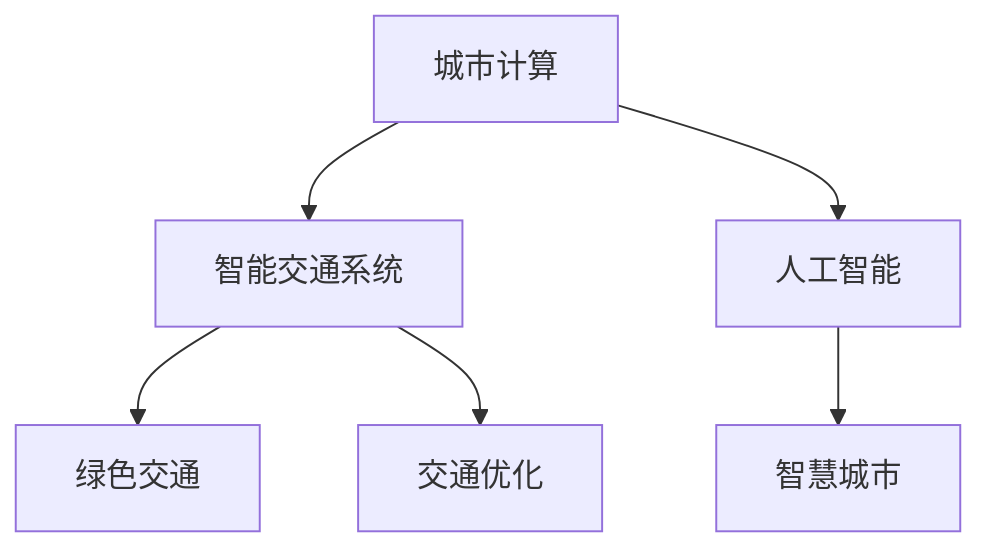

                 

# AI与人类计算：打造可持续发展的城市生活与交通

## 1. 背景介绍

### 1.1 问题由来

随着城市化进程的不断推进，全球各大都市面临交通拥堵、环境污染、资源短缺等一系列严峻问题。过去几十年的传统城市规划和管理方法已经难以应对这些挑战，亟需新的技术手段来打造一个可持续发展的城市生活与交通体系。

人工智能（AI）作为引领未来发展的核心技术，正在深刻影响着城市管理与交通系统的建设。通过对城市海量数据进行分析，AI可以帮助我们更好地理解城市运作规律，实现交通的智能化、绿色化、精细化管理，提升城市治理水平。

### 1.2 问题核心关键点

AI在城市生活与交通中的应用，主要集中在以下几个核心关键点：

- **数据分析与处理**：利用AI进行海量城市数据的收集、清洗、分析，提取有用的信息，为城市管理和决策提供支持。
- **交通流量预测与优化**：通过AI模型预测交通流量，优化交通信号灯控制，提升交通效率。
- **智能交通系统**：实现智能调度、动态定价、自动驾驶等功能的智能化交通系统。
- **绿色交通与能源管理**：AI在能源管理和交通出行优化方面的应用，促进绿色交通、低碳生活。
- **城市运行安全监控**：通过AI进行实时监控、预警，提升城市运行安全。

### 1.3 问题研究意义

AI与人类计算相结合，有助于构建更加智能、可持续的城市生活与交通体系，具体体现在：

1. **效率提升**：AI可以优化城市交通管理和资源分配，提升交通效率，减少拥堵。
2. **节能减排**：通过AI优化能源管理，推动绿色交通，降低城市碳排放。
3. **安全保障**：AI进行实时监控与预警，保障城市运行安全，减少事故发生率。
4. **服务优化**：AI提升城市公共服务水平，满足居民多样化需求。
5. **治理智能化**：AI技术辅助城市决策，提升城市治理水平。

## 2. 核心概念与联系

### 2.1 核心概念概述

为更好地理解AI在城市生活与交通中的应用，本节将介绍几个密切相关的核心概念：

- **城市计算**：利用计算技术对城市数据进行分析、建模和应用，提升城市治理水平。
- **智能交通系统（ITS）**：通过信息技术、通信技术、控制技术、传感技术等手段，实现交通流量的监测、控制、调度和管理。
- **人工智能**：利用机器学习、深度学习等技术，使计算机系统具备类人智能，能执行人类大脑可以完成的任务。
- **绿色交通**：以减少碳排放、提升交通效率为目标，通过技术手段优化交通模式，促进可持续出行。
- **交通优化**：通过算法优化交通信号灯控制、路径规划、公共交通调度等环节，提升交通效率。
- **智慧城市**：通过AI技术将城市基础设施、环境、社会等各要素有机整合，形成智能化的城市生态系统。

这些核心概念之间的逻辑关系可以通过以下Mermaid流程图来展示：



这个流程图展示了几大核心概念之间的关系：

1. 城市计算利用计算技术分析城市数据，为智能交通系统的建设提供数据支持。
2. 智能交通系统通过信息化手段实现交通流量的监测、控制和管理。
3. 人工智能提供智能分析、决策支持等能力，推动智慧城市的建设。
4. 绿色交通通过技术手段优化交通模式，实现可持续发展。
5. 交通优化提升交通效率，支持智能交通系统。

这些概念共同构成了AI在城市生活与交通领域的应用框架，为我们提供了一个全面的技术视角。

## 3. 核心算法原理 & 具体操作步骤

### 3.1 算法原理概述

AI在城市生活与交通中的应用，主要基于以下几个算法原理：

- **机器学习与深度学习**：通过大量数据训练AI模型，使其具备预测、分类、聚类等能力。
- **强化学习**：通过模拟奖励机制，使AI系统不断优化决策策略，提升系统性能。
- **优化算法**：如遗传算法、蚁群算法等，用于交通网络优化、路径规划等问题。
- **大数据分析**：利用分布式计算、数据挖掘等技术，对城市海量数据进行分析和建模。
- **计算机视觉**：通过图像识别、目标检测等技术，提升交通管理和监控能力。

### 3.2 算法步骤详解

AI在城市生活与交通中的应用，通常遵循以下步骤：

**Step 1: 数据收集与预处理**
- 收集城市交通、气象、人口、资源等多维数据。
- 进行数据清洗、去噪、归一化等预处理，确保数据质量。

**Step 2: 模型训练与优化**
- 选择适合的AI模型，如深度神经网络、决策树、随机森林等。
- 利用收集到的数据训练模型，并通过交叉验证、调参等方法优化模型性能。
- 应用正则化、Dropout、数据增强等技术，避免过拟合。

**Step 3: 模型评估与部署**
- 在测试集上评估模型性能，计算准确率、召回率等指标。
- 部署模型到生产环境，实时监测性能指标。
- 定期更新模型参数，保持模型性能。

**Step 4: 应用集成与迭代**
- 将AI模型集成到城市管理系统，进行实时交通调控、安全监控等应用。
- 根据反馈数据，不断迭代优化模型，提升系统性能。

### 3.3 算法优缺点

AI在城市生活与交通中的应用，具有以下优点：

- **高效性**：AI能快速处理海量数据，提升城市管理效率。
- **精准性**：AI具备高精度预测、分类能力，提升决策准确性。
- **可扩展性**：AI系统可动态扩展，适应不同规模的城市需求。
- **自动化**：AI自动化执行复杂任务，减少人力成本。

同时，AI在应用过程中也存在一些局限：

- **数据依赖**：AI模型需要大量高质量标注数据，收集和标注成本较高。
- **模型复杂性**：复杂的模型结构和参数，增加了系统复杂性。
- **解释性不足**：AI模型的决策过程往往缺乏可解释性，难以调试和优化。
- **鲁棒性问题**：AI模型对噪声、异常数据敏感，容易出现误判。

### 3.4 算法应用领域

AI在城市生活与交通中的应用，涉及多个领域，具体如下：

- **交通流量预测**：利用AI模型预测交通流量，优化交通信号灯控制。
- **智能调度系统**：实现公交、出租车、共享单车等智能化调度，提升效率。
- **自动驾驶**：通过AI实现自动驾驶技术，提升交通安全性。
- **绿色出行**：通过AI优化路径规划，推广共享单车、步行等绿色出行方式。
- **应急响应**：通过AI实时监控，快速响应城市紧急事件，提升应急管理能力。
- **城市资源管理**：利用AI进行能源管理、水资源优化等，提升城市资源利用效率。

## 4. 数学模型和公式 & 详细讲解 & 举例说明

### 4.1 数学模型构建

本节将使用数学语言对AI在城市生活与交通中的应用进行更加严格的刻画。

假设城市交通网络由$N$个节点和$M$条边组成，记为$G=(N, M)$。交通流量由$T$表示，为一个$M$维向量。交通网络中的每个节点$i$有一个出流量$V_i$和入流量$I_i$，表示为$V_i$和$I_i$。

定义节点$i$的交通量$T_i$，为$T$中节点$i$的出流量减去入流量，即$T_i = V_i - I_i$。则城市交通网络的总体流量$T$可以表示为：

$$
T = \sum_{i=1}^N T_i
$$

在交通流量预测中，我们通常使用回归模型对交通量$T_i$进行预测，如线性回归模型：

$$
T_i = \alpha_i + \beta_i \cdot S_i + \epsilon_i
$$

其中，$\alpha_i$和$\beta_i$为模型的回归系数，$S_i$为影响交通量的各种因素（如天气、节假日等），$\epsilon_i$为误差项。

### 4.2 公式推导过程

假设我们有$n$个样本数据$(S_i, T_i)$，使用线性回归模型对交通量$T_i$进行预测，最小化预测误差$\epsilon_i$的平方和：

$$
\min_{\alpha, \beta} \frac{1}{n}\sum_{i=1}^n (T_i - (\alpha_i + \beta_i \cdot S_i))^2
$$

根据最小二乘法，求解上述优化问题，得到：

$$
\alpha_i = \frac{\sum_{i=1}^n (T_i - \beta_i \cdot S_i)}{n}
$$
$$
\beta_i = \frac{\sum_{i=1}^n (S_i - \alpha_i) \cdot (T_i - \alpha_i)}{\sum_{i=1}^n (S_i - \alpha_i)^2}
$$

通过以上公式，我们可以得到回归模型中的回归系数$\alpha_i$和$\beta_i$，进而对交通量进行预测。

### 4.3 案例分析与讲解

以一个简单的交通流量预测案例为例，分析AI在交通管理中的应用。

假设我们收集了某城市30天的交通流量数据，包含每天的天气情况、节假日等影响因素。利用这些数据，我们可以建立交通流量预测模型。具体步骤如下：

1. 收集数据：收集30天的交通流量数据，包含每天的天气情况、节假日等影响因素。
2. 数据清洗：进行数据清洗、去噪、归一化等预处理，确保数据质量。
3. 模型训练：选择线性回归模型，利用数据集训练模型，计算回归系数$\alpha_i$和$\beta_i$。
4. 模型评估：在测试集上评估模型性能，计算准确率、召回率等指标。
5. 模型部署：将模型部署到城市交通管理系统，实时监控交通流量。
6. 迭代优化：根据实时监控数据，不断迭代优化模型，提升预测精度。

## 5. 项目实践：代码实例和详细解释说明

### 5.1 开发环境搭建

在进行AI在城市生活与交通中的应用开发前，我们需要准备好开发环境。以下是使用Python进行TensorFlow开发的环境配置流程：

1. 安装Anaconda：从官网下载并安装Anaconda，用于创建独立的Python环境。

2. 创建并激活虚拟环境：
```bash
conda create -n tf-env python=3.8 
conda activate tf-env
```

3. 安装TensorFlow：从官网获取对应的安装命令。例如：
```bash
conda install tensorflow -c conda-forge
```

4. 安装其他相关库：
```bash
pip install numpy pandas matplotlib scikit-learn 
```

完成上述步骤后，即可在`tf-env`环境中开始AI应用开发。

### 5.2 源代码详细实现

下面我们以交通流量预测为例，给出使用TensorFlow进行模型训练和预测的PyTorch代码实现。

```python
import tensorflow as tf
import numpy as np
from sklearn.model_selection import train_test_split
from sklearn.preprocessing import StandardScaler

# 假设收集到30天的交通流量数据
data = np.random.rand(30, 4) # 每天4个影响因素
labels = np.random.rand(30) # 每天交通流量

# 数据预处理
scaler = StandardScaler()
scaled_data = scaler.fit_transform(data)

# 数据集划分
X_train, X_test, y_train, y_test = train_test_split(scaled_data, labels, test_size=0.2)

# 定义模型
model = tf.keras.Sequential([
    tf.keras.layers.Dense(32, activation='relu'),
    tf.keras.layers.Dense(1)
])

# 模型编译
model.compile(optimizer=tf.keras.optimizers.Adam(0.01),
              loss='mean_squared_error')

# 模型训练
model.fit(X_train, y_train, epochs=100, batch_size=32, verbose=0)

# 模型评估
mse = model.evaluate(X_test, y_test)

# 模型预测
predictions = model.predict(X_test)
```

### 5.3 代码解读与分析

让我们再详细解读一下关键代码的实现细节：

- `train_test_split`方法：用于将数据集划分为训练集和测试集，设置测试集占总数据集的20%。
- `StandardScaler`方法：对数据进行归一化处理，提高模型训练效果。
- `Sequential`模型：利用Keras的Sequential模型定义线性回归模型，包含两个全连接层。
- `compile`方法：编译模型，选择Adam优化器和均方误差损失函数。
- `fit`方法：对模型进行训练，设置训练次数为100次，批量大小为32。
- `evaluate`方法：在测试集上评估模型性能，返回均方误差（MSE）。
- `predict`方法：对测试集进行预测，输出预测结果。

以上代码实现了一个简单的交通流量预测模型，涵盖了数据预处理、模型定义、编译、训练、评估、预测等关键步骤。

## 6. 实际应用场景

### 6.1 智能交通系统

智能交通系统（ITS）是AI在城市生活与交通中的应用重点，具体应用场景如下：

- **交通流量监控与预测**：通过摄像头、传感器等设备，实时监控交通流量，利用AI模型预测未来交通流量，优化信号灯控制。
- **智能导航与路径规划**：利用AI优化导航路径，减少拥堵，提高出行效率。
- **公共交通优化**：通过AI优化公交、地铁等公共交通车辆的调度，提升运行效率。
- **自动驾驶与车联网**：利用AI实现自动驾驶与车联网技术，提升交通安全与出行便捷性。

### 6.2 绿色出行与能源管理

绿色出行与能源管理是AI在城市生活与交通中的重要应用方向，具体如下：

- **路径优化与共享单车**：通过AI优化出行路径，推广共享单车、步行等绿色出行方式。
- **绿色交通规划**：利用AI进行交通网络规划，减少碳排放。
- **智能电网管理**：通过AI优化电力分配，提升能源利用效率。

### 6.3 城市运行安全监控

城市运行安全监控是AI在城市生活与交通中的重要应用方向，具体如下：

- **视频监控与行为分析**：通过AI进行视频监控与行为分析，及时发现异常情况。
- **智能警务系统**：利用AI进行实时监控与预警，提升城市警务水平。
- **自然灾害预警**：利用AI进行气象预测，提前预警自然灾害。

### 6.4 未来应用展望

随着AI技术的不断发展，未来在城市生活与交通中的应用将更加广泛，具体如下：

- **自动驾驶与智慧公路**：自动驾驶与智慧公路技术将进一步普及，提升交通安全与出行效率。
- **智慧物流与配送**：利用AI优化物流与配送路线，提升物流效率。
- **智慧旅游**：通过AI优化旅游路线，提升旅游体验。

## 7. 工具和资源推荐

### 7.1 学习资源推荐

为了帮助开发者系统掌握AI在城市生活与交通中的应用，这里推荐一些优质的学习资源：

1. 《深度学习》课程：斯坦福大学开设的深度学习课程，系统介绍了深度学习的基本概念、算法、应用等。
2. 《机器学习实战》书籍：提供丰富的代码示例和实际案例，适合初学者上手学习。
3. TensorFlow官方文档：提供了详细的API文档和开发示例，是学习TensorFlow的重要资源。
4. TensorFlow Dev Summit：谷歌组织的TensorFlow开发者大会，发布最新技术、展示最佳实践。
5. GitHub上的AI项目：大量开源AI项目提供了丰富的代码和数据集，适合学习与实践。

通过对这些资源的学习实践，相信你一定能够快速掌握AI在城市生活与交通中的应用精髓，并用于解决实际的NLP问题。

### 7.2 开发工具推荐

高效的开发离不开优秀的工具支持。以下是几款用于AI开发的工具：

1. PyTorch：基于Python的开源深度学习框架，灵活动态的计算图，适合快速迭代研究。
2. TensorFlow：由Google主导开发的开源深度学习框架，生产部署方便，适合大规模工程应用。
3. TensorBoard：TensorFlow配套的可视化工具，可实时监测模型训练状态，并提供丰富的图表呈现方式。
4. Weights & Biases：模型训练的实验跟踪工具，可以记录和可视化模型训练过程中的各项指标。
5. Jupyter Notebook：交互式的编程环境，方便开发和调试AI模型。

合理利用这些工具，可以显著提升AI在城市生活与交通应用的开发效率，加快创新迭代的步伐。

### 7.3 相关论文推荐

AI在城市生活与交通中的应用源于学界的持续研究。以下是几篇奠基性的相关论文，推荐阅读：

1. Traffic Signal Control with Deep Reinforcement Learning：利用深度强化学习优化交通信号灯控制，提升了交通效率。
2. Smart City Design through Machine Learning：利用机器学习优化城市规划，提升了城市运行效率。
3. Green City Computing：通过计算技术优化城市资源管理，推动绿色交通发展。
4. Data Mining for Smart Cities：利用数据挖掘技术，提升城市管理决策水平。
5. AI for Urban Planning：利用AI技术优化城市规划与交通管理，提升城市治理水平。

这些论文代表了大模型微调技术的发展脉络。通过学习这些前沿成果，可以帮助研究者把握学科前进方向，激发更多的创新灵感。

## 8. 总结：未来发展趋势与挑战

### 8.1 总结

本文对AI在城市生活与交通中的应用进行了全面系统的介绍。首先阐述了AI与城市计算的结合背景和意义，明确了AI在提升城市治理效率、交通效率等方面的重要价值。其次，从原理到实践，详细讲解了交通流量预测等关键应用的数学模型和代码实现。同时，本文还广泛探讨了智能交通系统、绿色出行、城市运行安全监控等实际应用场景，展示了AI在城市生活与交通领域的广泛应用。

通过本文的系统梳理，可以看到，AI与人类计算相结合，正在深刻改变城市生活与交通的方式，提升城市治理水平和居民生活质量。未来，伴随AI技术的不断进步，城市生活与交通将变得更加智能、可持续。

### 8.2 未来发展趋势

展望未来，AI在城市生活与交通中的应用将呈现以下几个发展趋势：

1. **智能化程度提升**：AI技术将进一步融入城市基础设施，提升智能交通、智慧城市建设水平。
2. **跨领域应用拓展**：AI在智慧城市、智能交通、绿色出行等方面的应用将更加广泛，推动跨领域协同发展。
3. **数据融合与共享**：AI系统将更好地融合多源数据，提升数据共享与使用效率。
4. **模型集成与融合**：AI系统将集成更多算法和技术，提升系统性能和鲁棒性。
5. **人性化交互提升**：AI技术将提升城市服务水平，实现更人性化、智能化的城市管理。
6. **安全保障增强**：AI系统将提升城市运行安全保障，减少事故发生率。

### 8.3 面临的挑战

尽管AI在城市生活与交通中的应用已经取得了显著成效，但在迈向更加智能化、普适化应用的过程中，它仍面临着诸多挑战：

1. **数据隐私与安全**：AI系统涉及大量个人隐私数据，如何保障数据安全、隐私保护是重要问题。
2. **模型透明性与可解释性**：AI系统缺乏可解释性，难以解释其决策过程，影响用户信任。
3. **技术伦理与社会责任**：AI系统可能带来新的伦理问题和社会责任，需要慎重考虑。
4. **技术普及与教育**：AI技术复杂性高，如何普及技术知识、提升公众认知水平是重要任务。
5. **系统鲁棒性与可靠性**：AI系统对噪声、异常数据敏感，容易出现误判，需要提升系统鲁棒性。

### 8.4 研究展望

未来，AI在城市生活与交通中的应用需要解决以下几个问题：

1. **数据隐私保护**：开发隐私保护技术，确保数据安全与隐私保护。
2. **模型透明性与可解释性**：开发透明性技术，提升模型可解释性，增强用户信任。
3. **技术伦理与社会责任**：研究AI伦理，制定相关法律法规，确保技术安全与社会责任。
4. **技术普及与教育**：加强技术培训，提升公众对AI技术的认知水平。
5. **系统鲁棒性与可靠性**：提升AI系统的鲁棒性，确保系统稳定可靠。

这些研究方向的探索，必将引领AI在城市生活与交通领域的发展，推动人类智能与城市生态的协同进化。面向未来，AI与人类计算的结合将为我们构建更加智能、可持续的城市生活与交通体系，带来新的发展机遇。

## 9. 附录：常见问题与解答

**Q1: AI在城市生活与交通中的应用是否面临数据隐私和安全问题？**

A: 是的。AI系统涉及大量个人隐私数据，如何保障数据安全与隐私保护是重要问题。建议采用数据匿名化、加密等技术手段，确保数据安全与隐私保护。

**Q2: AI系统缺乏可解释性，如何提升其透明性与可解释性？**

A: 建议采用可解释AI技术，如LIME、SHAP等，解释模型决策过程，增强用户信任。同时，在模型设计阶段，应考虑可解释性，使用简单的模型结构和算法。

**Q3: 如何保障AI系统的鲁棒性与可靠性？**

A: 建议采用正则化、对抗训练、数据增强等技术，提升模型鲁棒性。同时，进行系统的持续监控与维护，及时发现和修复系统漏洞。

**Q4: AI系统如何应对异常数据和噪声？**

A: 建议采用异常检测技术，如孤立森林、LOF等，检测和处理异常数据。同时，采用对抗训练和鲁棒优化技术，提升模型对噪声数据的鲁棒性。

**Q5: 如何提升AI系统的可普及性与教育普及？**

A: 建议加强技术培训和公众教育，提升公众对AI技术的认知水平。同时，开发易于使用的API接口，降低技术门槛，促进AI技术的应用普及。

总之，AI与人类计算的结合正在深刻改变城市生活与交通，带来巨大的发展机遇。未来，通过不断技术创新和理论研究，AI将为我们构建更加智能、可持续的城市生态，推动人类社会向更加智慧的方向发展。

---

作者：禅与计算机程序设计艺术 / Zen and the Art of Computer Programming

