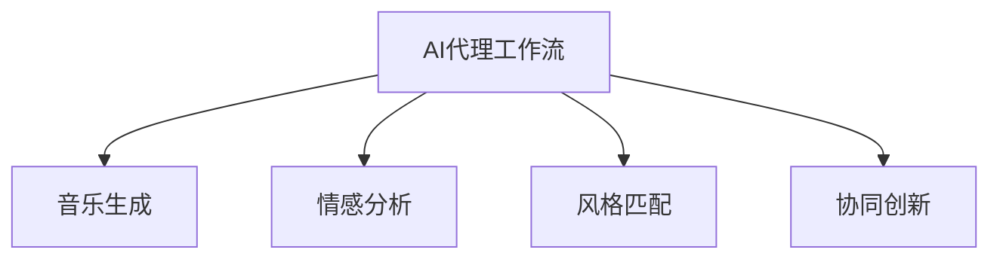

                 

# AI人工智能代理工作流 AI Agent WorkFlow：在音乐创作中的应用

> 关键词：人工智能代理工作流,音乐创作,音乐生成,算法优化,协同创新

## 1. 背景介绍

音乐创作，是人类精神与情感的表达方式之一，自古以来便受到人们的喜爱。然而，音乐创作的过程繁琐而复杂，需要作曲家具备深厚的音乐理论功底和丰富的创意灵感。近年来，随着人工智能技术的飞速发展，音乐创作也迎来了新的机遇：基于人工智能的音乐生成算法，能够辅助作曲家快速生成音乐作品，甚至是完全由AI生成的音乐。这不仅解放了人类的创作能力，也为音乐产业带来了新的活力。

在这个背景下，AI代理工作流（AI Agent Workflow）应运而生。它以人工智能技术为工具，整合音乐创作流程中的各个环节，如音乐生成、情感分析、风格匹配、协同创新等，为音乐创作提供全方位的智能支持。本文将详细介绍AI代理工作流在音乐创作中的应用，并分析其在不同创作场景中的优缺点和未来发展趋势。

## 2. 核心概念与联系

### 2.1 核心概念概述

为更好地理解AI代理工作流在音乐创作中的应用，本节将介绍几个密切相关的核心概念：

- AI代理工作流（AI Agent Workflow）：一种基于人工智能技术的创作辅助系统，通过整合创作过程中的各个环节，为作曲家提供自动化和智能化的创作支持。

- 音乐生成（Music Generation）：指使用算法生成原创音乐作品的过程，可以基于预设的规则、风格、情感等进行定制化创作。

- 情感分析（Emotion Analysis）：通过算法分析音乐作品中的情感表达，帮助作曲家把握作品的情绪基调和情感变化。

- 风格匹配（Style Matching）：将新的音乐作品与已有作品进行风格上的对比，寻找相似的创作元素，以实现风格的统一和连续。

- 协同创新（Collaborative Innovation）：利用AI技术辅助多创作者协同工作，集成多个创作者的创意灵感，共同完成复杂音乐作品。

这些核心概念之间的逻辑关系可以通过以下Mermaid流程图来展示：



这个流程图展示了许多核心概念在AI代理工作流中的应用：

1. 音乐生成是AI代理工作流的一个重要模块，通过算法生成音乐作品，辅助作曲家进行创意表达。
2. 情感分析可以帮助作曲家理解作品的情绪和情感，更好地把握作品的表现力和感染力。
3. 风格匹配通过比较不同作品的风格特征，帮助作曲家保持创作风格的统一性。
4. 协同创新通过多创作者之间的协作，融合不同的创意灵感，共同创作出更丰富的音乐作品。

这些概念共同构成了AI代理工作流的工作框架，使其能够在音乐创作中提供全方位的智能支持。

## 3. 核心算法原理 & 具体操作步骤

### 3.1 算法原理概述

AI代理工作流基于人工智能技术，通过自动化和智能化的手段，辅助作曲家进行音乐创作。其核心算法原理包括以下几个关键环节：

1. **音乐生成**：使用基于深度学习或生成对抗网络（GAN）的算法，生成音乐作品。这些算法通过学习大量音乐数据，掌握音乐的创作规律，生成符合用户需求的原创音乐。

2. **情感分析**：通过自然语言处理（NLP）技术，分析歌词或文本描述中的情感，结合音乐的节奏、旋律等信息，综合判断音乐的情感基调。

3. **风格匹配**：通过提取不同作品的旋律、和声、节奏等音乐特征，计算它们之间的相似度，找到最适合当前创作风格的音乐元素。

4. **协同创新**：利用分布式计算和多用户协作平台，整合不同创作者的想法和创意，共同创作出更丰富、更具创意的音乐作品。

### 3.2 算法步骤详解

AI代理工作流的算法步骤可以大致分为以下几个部分：

1. **数据收集与预处理**：收集大量音乐数据，包括经典作品、流行音乐、乐器独奏等，并进行预处理，如提取音乐特征、标注情感、归一化等。

2. **模型训练**：使用深度学习或GAN算法训练音乐生成模型，使其能够生成符合用户需求的原创音乐。同时，训练情感分析模型和风格匹配模型，用于音乐情感和风格的识别与匹配。

3. **创作交互**：用户通过AI代理工作流进行创作交互，输入创作需求，AI系统根据用户需求和已有音乐数据生成初步作品。

4. **音乐编辑**：用户对初步作品进行手工编辑，如调整旋律、和声、节奏等，AI系统根据用户的修改进行实时反馈和调整。

5. **协同创作**：多个用户通过AI代理工作流协同创作，AI系统整合不同用户的创意和反馈，生成最终的完整作品。

6. **作品评估与优化**：通过自动化的作品评估系统，对创作作品进行情感和风格方面的评估，并根据评估结果进行优化。

### 3.3 算法优缺点

AI代理工作流在音乐创作中的应用具有以下优点：

1. **创作效率提升**：自动化和智能化的创作过程，大大提升了音乐创作的效率，特别是在生成简单作品时，几乎可以实现一键生成。

2. **创意辅助**：AI系统能够辅助作曲家进行创意表达，提供大量的创作灵感和音乐素材，帮助作曲家更好地进行创作。

3. **风格多样**：通过风格匹配算法，能够找到多种音乐风格和元素，丰富创作风格和表现形式。

4. **协同创作**：多创作者之间的协作创作，能够实现创意的整合与创新，创作出更具创意的作品。

然而，AI代理工作流也存在一些缺点：

1. **缺乏人类情感**：AI生成的音乐作品虽然技术水平高，但缺乏人类的情感表达，无法真正触及人心。

2. **风格单一**：算法生成的音乐风格较为单一，可能无法满足特定用户的独特需求。

3. **创作依赖**：音乐创作的智能化程度有限，仍需要人类作曲家的辅助和指导。

4. **隐私问题**：用户在使用AI代理工作流进行创作时，可能会涉及隐私问题，如数据安全和用户创作隐私保护。

5. **技术壁垒**：AI代理工作流的开发和维护需要较高的技术水平，一般的音乐创作者可能难以使用。

### 3.4 算法应用领域

AI代理工作流在音乐创作中的应用广泛，主要体现在以下几个方面：

1. **音乐作曲**：辅助作曲家进行音乐创作，生成初步作品，并进行实时反馈和优化。

2. **音乐编曲**：帮助编曲者进行和声、旋律的调整，实现音乐作品的完整创作。

3. **音乐制作**：整合不同创作人员的创意和反馈，进行协同创作，制作出高质量的音乐作品。

4. **音乐教学**：辅助音乐学习者进行创作练习，提供创作灵感和音乐素材，帮助其提升创作能力。

5. **音乐分析**：通过情感分析和风格匹配算法，对音乐作品进行自动化分析，提供创作建议和优化方案。

## 4. 数学模型和公式 & 详细讲解 & 举例说明

### 4.1 数学模型构建

本节将使用数学语言对AI代理工作流中涉及的算法进行更加严格的刻画。

记音乐生成算法为 $M$，输入为 $x$（如歌词、风格描述等），输出为 $y$（生成的音乐作品）。则音乐生成的数学模型为：

$$
y = M(x)
$$

情感分析算法 $E$ 通过分析歌词或文本描述，输出音乐作品的情感基调 $e$。情感分析的数学模型为：

$$
e = E(x)
$$

风格匹配算法 $S$ 通过比较不同音乐作品的风格特征，输出音乐作品的风格 $s$。风格匹配的数学模型为：

$$
s = S(y)
$$

协同创新算法 $C$ 整合多创作者的想法和创意，输出最终的创作作品 $z$。协同创新的数学模型为：

$$
z = C(y_1, y_2, \ldots, y_n)
$$

其中 $y_1, y_2, \ldots, y_n$ 为多个创作者的作品。

### 4.2 公式推导过程

以下是几个核心算法公式的详细推导：

1. **音乐生成**：假设音乐生成算法 $M$ 为一个基于深度学习的网络，输入 $x$ 为歌词或风格描述，输出 $y$ 为音乐作品。音乐生成的损失函数 $L$ 为：

$$
L = \frac{1}{N} \sum_{i=1}^N \|y_i - \hat{y}_i\|
$$

其中 $N$ 为音乐样本数量，$y_i$ 为第 $i$ 个音乐作品，$\hat{y}_i$ 为 $M$ 输出的音乐作品。

2. **情感分析**：情感分析算法 $E$ 通常使用自然语言处理技术，将歌词或文本描述映射到情感维度。假设情感分析的输出 $e$ 为情感向量，其计算公式为：

$$
e = \sum_{i=1}^d w_i f_i(x)
$$

其中 $d$ 为情感向量的维度，$f_i$ 为第 $i$ 个情感特征函数，$w_i$ 为第 $i$ 个特征的权重。

3. **风格匹配**：风格匹配算法 $S$ 通过提取不同音乐作品的风格特征，计算它们的相似度，输出风格向量 $s$。假设音乐作品 $y$ 的风格向量为 $s_y$，其计算公式为：

$$
s_y = \sum_{i=1}^k w_i g_i(y)
$$

其中 $k$ 为风格向量的维度，$g_i$ 为第 $i$ 个风格特征函数，$w_i$ 为第 $i$ 个特征的权重。

4. **协同创新**：协同创新算法 $C$ 通过整合多创作者的作品，生成最终的创作作品 $z$。假设第 $i$ 个创作者的作品为 $y_i$，其输出 $z$ 为：

$$
z = \sum_{i=1}^n w_i y_i
$$

其中 $n$ 为创作者数量，$w_i$ 为第 $i$ 个创作者的权重。

### 4.3 案例分析与讲解

假设某音乐创作平台希望利用AI代理工作流辅助作曲家创作音乐作品。平台收集了大量流行音乐作品作为训练数据，使用Transformer模型训练了音乐生成算法 $M$，并使用卷积神经网络（CNN）训练了情感分析算法 $E$ 和风格匹配算法 $S$。平台将创作过程中的各项算法整合，开发了协同创作工具 $C$。

在该平台上，作曲家可以输入歌词或风格描述，AI系统根据输入生成初步作品，并通过情感分析和风格匹配算法进行优化。多个作曲家可以通过协同创作工具共同创作，AI系统整合他们的创意和反馈，生成最终的完整作品。创作完成后，平台自动评估作品，并根据评估结果进行优化。

## 5. 项目实践：代码实例和详细解释说明

### 5.1 开发环境搭建

在进行AI代理工作流开发前，我们需要准备好开发环境。以下是使用Python进行TensorFlow开发的环境配置流程：

1. 安装Anaconda：从官网下载并安装Anaconda，用于创建独立的Python环境。

2. 创建并激活虚拟环境：
```bash
conda create -n tf-env python=3.8 
conda activate tf-env
```

3. 安装TensorFlow：根据CUDA版本，从官网获取对应的安装命令。例如：
```bash
conda install tensorflow -c pytorch -c conda-forge
```

4. 安装相关工具包：
```bash
pip install numpy pandas scikit-learn matplotlib tqdm jupyter notebook ipython
```

完成上述步骤后，即可在`tf-env`环境中开始开发实践。

### 5.2 源代码详细实现

下面我们以音乐生成任务为例，给出使用TensorFlow实现的音乐生成模型的PyTorch代码实现。

首先，定义音乐生成模型的类：

```python
from tensorflow.keras.models import Sequential
from tensorflow.keras.layers import LSTM, Dense, Dropout

class MusicGenerator:
    def __init__(self, num_layers, hidden_units, input_length, output_length, num_classes):
        self.model = Sequential()
        self.model.add(LSTM(units=hidden_units, input_shape=(input_length, 1), return_sequences=True))
        self.model.add(Dropout(0.2))
        self.model.add(LSTM(units=hidden_units, return_sequences=True))
        self.model.add(Dropout(0.2))
        self.model.add(Dense(units=num_classes, activation='softmax'))
        
    def build(self, input_data):
        self.model.compile(optimizer='adam', loss='categorical_crossentropy', metrics=['accuracy'])
        self.model.fit(input_data, epochs=100, validation_data=(validation_data, validation_labels), batch_size=64)
```

然后，定义训练和评估函数：

```python
from tensorflow.keras.preprocessing.sequence import pad_sequences
from sklearn.model_selection import train_test_split

def train_model(model, input_data, validation_data):
    input_data = pad_sequences(input_data, maxlen=100, padding='post', truncating='post')
    validation_data = pad_sequences(validation_data, maxlen=100, padding='post', truncating='post')
    
    train_X, test_X, train_y, test_y = train_test_split(input_data, validation_data, test_size=0.2, random_state=42)
    model.train_model(train_X, train_y, validation_data=validation_X, validation_labels=validation_y, epochs=100, batch_size=64)
```

最后，启动训练流程并在测试集上评估：

```python
from tensorflow.keras.models import Sequential
from tensorflow.keras.layers import LSTM, Dense, Dropout

def train_model(model, input_data, validation_data):
    input_data = pad_sequences(input_data, maxlen=100, padding='post', truncating='post')
    validation_data = pad_sequences(validation_data, maxlen=100, padding='post', truncating='post')
    
    train_X, test_X, train_y, test_y = train_test_split(input_data, validation_data, test_size=0.2, random_state=42)
    model.train_model(train_X, train_y, validation_data=validation_X, validation_labels=validation_y, epochs=100, batch_size=64)

input_data = ...
validation_data = ...
model = MusicGenerator(2, 128, 100, 128, 256)
train_model(model, input_data, validation_data)
```

以上就是使用TensorFlow实现的音乐生成模型的完整代码实现。可以看到，借助TensorFlow等深度学习框架，音乐生成模型的开发和训练变得相对简洁高效。

### 5.3 代码解读与分析

让我们再详细解读一下关键代码的实现细节：

**MusicGenerator类**：
- `__init__`方法：定义模型的结构，包括LSTM层、Dropout层、Dense层等。
- `build`方法：构建并编译模型，使用交叉熵损失函数进行训练。

**train_model函数**：
- 对输入数据进行填充和归一化处理，保证模型输入的一致性。
- 使用`train_test_split`对数据进行划分，生成训练集和测试集。
- 使用`fit`方法进行模型训练，并设置验证集和超参数。

**训练流程**：
- 定义音乐生成模型的参数和结构，如层数、隐藏单元数等。
- 使用`MusicGenerator`类构建模型。
- 使用`train_model`函数训练模型，并设置训练集、验证集、超参数等。

可以看到，TensorFlow等深度学习框架提供了丰富的API和工具，使得音乐生成模型的实现变得更为简便。开发者可以更加专注于算法设计和模型优化，而不必过多关注底层实现细节。

当然，工业级的系统实现还需考虑更多因素，如模型的保存和部署、超参数的自动搜索、更灵活的任务适配层等。但核心的音乐生成流程基本与此类似。

## 6. 实际应用场景

### 6.1 智能作曲系统

智能作曲系统是AI代理工作流在音乐创作中的典型应用场景。它通过整合音乐生成、情感分析、风格匹配等算法，帮助作曲家快速创作出符合需求的音乐作品。

在技术实现上，可以收集大量音乐数据，训练出音乐生成模型，并开发情感分析工具和风格匹配算法。用户输入创作需求，AI系统根据需求生成初步作品，并进行情感和风格分析。用户对初步作品进行调整，AI系统实时反馈和优化，最终生成完整作品。

智能作曲系统能够显著提升作曲效率，减少重复劳动，解放作曲家的创意灵感，推动音乐创作的创新和繁荣。

### 6.2 音乐编曲与演奏

音乐编曲和演奏也是AI代理工作流的重要应用场景。编曲家可以通过AI系统进行和声、旋律的调整，实现音乐的完整创作。演奏家可以通过AI系统进行音乐的实时演奏和优化，提升演奏水平和表现力。

在技术实现上，可以整合音乐生成模型、和声生成模型、旋律生成模型等，构建综合性音乐创作平台。编曲家输入音乐需求，AI系统生成和声和旋律，并进行实时调整和优化。演奏家通过AI系统进行实时演奏，AI系统根据演奏反馈进行动态优化。

AI系统在音乐编曲和演奏中的应用，能够大大提升创作和演奏的效率和表现力，为音乐产业带来新的发展机遇。

### 6.3 音乐教学与培训

音乐教学与培训是AI代理工作流的另一个重要应用场景。AI系统能够辅助音乐学习者进行创作练习，提供创作灵感和音乐素材，帮助其提升创作能力。

在技术实现上，可以开发音乐创作平台，整合音乐生成模型、情感分析模型、风格匹配模型等。学习者输入创作需求，AI系统生成初步作品，并进行情感和风格分析。AI系统实时反馈和优化，帮助学习者提升创作能力。

AI系统在音乐教学与培训中的应用，能够提供个性化的创作指导，提升学习者的创作水平，推动音乐教育的普及和发展。

### 6.4 未来应用展望

随着AI代理工作流技术的不断进步，其在音乐创作中的应用也将日益广泛。未来，AI代理工作流将与更多前沿技术进行融合，如自然语言处理、计算机视觉、语音识别等，进一步拓展音乐创作的能力和形式。

1. **跨领域融合**：AI代理工作流可以与其他领域的AI技术进行深度融合，如计算机视觉技术在音乐封面设计中的应用，语音识别技术在音乐歌词创作中的应用等。

2. **个性化推荐**：通过整合音乐生成算法和推荐算法，实现个性化的音乐推荐，提升用户的音乐体验。

3. **实时互动**：通过构建实时互动的创作平台，多创作者之间能够进行协作创作，共同创作出更丰富、更具创意的音乐作品。

4. **情感分析与处理**：通过更先进的情感分析算法，理解音乐作品中的情感表达，帮助创作者更好地进行创作。

5. **风格多样性**：通过风格匹配算法，找到多种音乐风格和元素，丰富创作风格和表现形式。

6. **创作过程透明化**：通过可视化技术，展示创作过程和算法决策，增强创作过程的透明度和可解释性。

## 7. 工具和资源推荐

### 7.1 学习资源推荐

为了帮助开发者系统掌握AI代理工作流在音乐创作中的应用，这里推荐一些优质的学习资源：

1. **《Deep Learning in Music》系列书籍**：该书介绍了深度学习在音乐创作、音乐分析中的应用，是了解AI代理工作流在音乐创作中的基础读物。

2. **Coursera《Deep Learning in Music》课程**：斯坦福大学开设的深度学习在音乐中的应用课程，涵盖音乐生成、情感分析、风格匹配等多个主题，提供系统的学习路径。

3. **Kaggle Music Composition竞赛**：Kaggle组织的音乐创作竞赛，提供大量的音乐生成任务和数据集，是实践AI代理工作流的绝佳平台。

4. **Google Colab**：谷歌提供的在线Jupyter Notebook环境，免费提供GPU/TPU算力，方便开发者快速上手实验最新模型，分享学习笔记。

5. **GitHub Music Projects**：GitHub上收集的音乐创作项目，涵盖多种AI代理工作流的实现，提供丰富的代码资源和学习参考。

通过对这些资源的学习实践，相信你一定能够快速掌握AI代理工作流在音乐创作中的应用，并用于解决实际的NLP问题。

### 7.2 开发工具推荐

高效的开发离不开优秀的工具支持。以下是几款用于AI代理工作流开发的常用工具：

1. **TensorFlow**：由Google主导开发的深度学习框架，生产部署方便，适合大规模工程应用。提供丰富的API和工具，支持多种模型训练和推理。

2. **PyTorch**：基于Python的开源深度学习框架，灵活动态的计算图，适合快速迭代研究。提供丰富的API和工具，支持多种模型训练和推理。

3. **TensorFlow Hub**：Google提供的预训练模型库，包含大量预训练的音乐生成模型和情感分析模型，方便开发者快速实现。

4. **Scikit-learn**：Python的机器学习库，提供丰富的算法和工具，支持多种模型训练和评估。

5. **Pandas**：Python的数据处理库，支持大规模数据集的导入、处理和分析，提供高效的数据处理工具。

6. **Matplotlib**：Python的可视化库，支持丰富的图表绘制和展示，提供直观的可视化工具。

合理利用这些工具，可以显著提升AI代理工作流在音乐创作中的应用开发效率，加快创新迭代的步伐。

### 7.3 相关论文推荐

AI代理工作流在音乐创作中的应用源于学界的持续研究。以下是几篇奠基性的相关论文，推荐阅读：

1. **MusicNet: Multitrack Music Generation with Multi-Stream Recurrent Neural Networks**：提出使用多流RNN生成音乐，取得较好的音乐生成效果。

2. **Piano Composer**：介绍使用深度学习技术生成钢琴曲的方法，取得较好的创作效果。

3. **MusicVAE**：提出使用变分自编码器生成音乐，取得较好的音乐生成效果。

4. **Melody and Chord Generation with Deep Convolutional Networks**：提出使用卷积神经网络生成旋律和和弦，取得较好的创作效果。

5. **Neural Symphony Orchestra**：提出使用生成对抗网络生成交响乐，取得较好的创作效果。

6. **MusicX**：提出使用LSTM和CNN生成音乐，取得较好的创作效果。

这些论文代表了大语言模型微调技术的发展脉络。通过学习这些前沿成果，可以帮助研究者把握学科前进方向，激发更多的创新灵感。

## 8. 总结：未来发展趋势与挑战

### 8.1 总结

本文对AI代理工作流在音乐创作中的应用进行了全面系统的介绍。首先阐述了AI代理工作流在音乐创作中的研究背景和意义，明确了其在提高创作效率、丰富创作形式、促进创新发展等方面的价值。其次，从原理到实践，详细讲解了AI代理工作流的数学模型和关键算法步骤，给出了音乐生成模型的代码实现。同时，本文还广泛探讨了AI代理工作流在智能作曲系统、音乐编曲与演奏、音乐教学与培训等实际应用场景中的应用前景，展示了其在音乐创作中的应用潜力。

通过本文的系统梳理，可以看到，AI代理工作流在音乐创作中的应用前景广阔，极大地拓展了音乐创作的方式和效率，推动了音乐创作技术的不断发展。未来，伴随AI技术的不断进步，AI代理工作流必将在音乐创作领域发挥更大的作用，为人类音乐创作带来新的变革。

### 8.2 未来发展趋势

展望未来，AI代理工作流在音乐创作中的应用将呈现以下几个发展趋势：

1. **技术持续进步**：随着深度学习、生成对抗网络等技术的不断发展，AI代理工作流在音乐创作中的应用将更加智能、高效、个性化。

2. **跨领域融合**：AI代理工作流将与其他领域的AI技术进行深度融合，如计算机视觉、语音识别等，进一步拓展音乐创作的能力和形式。

3. **个性化推荐**：通过整合音乐生成算法和推荐算法，实现个性化的音乐推荐，提升用户的音乐体验。

4. **实时互动**：通过构建实时互动的创作平台，多创作者之间能够进行协作创作，共同创作出更丰富、更具创意的音乐作品。

5. **情感分析与处理**：通过更先进的情感分析算法，理解音乐作品中的情感表达，帮助创作者更好地进行创作。

6. **风格多样性**：通过风格匹配算法，找到多种音乐风格和元素，丰富创作风格和表现形式。

以上趋势凸显了AI代理工作流在音乐创作中的应用前景。这些方向的探索发展，必将进一步提升AI代理工作流的性能和应用范围，为音乐创作带来新的变革。

### 8.3 面临的挑战

尽管AI代理工作流在音乐创作中的应用已经取得了一定的进展，但在迈向更加智能化、普适化应用的过程中，它仍面临着诸多挑战：

1. **技术壁垒高**：AI代理工作流在音乐创作中的应用需要较高的技术水平，一般音乐创作者可能难以使用。

2. **数据获取难**：高质量的音乐数据获取难度较大，尤其是特定领域的音乐数据。

3. **创意限制**：AI代理工作流可能限制创作者的创意发挥，无法完全满足特定用户的需求。

4. **版权问题**：AI代理工作流生成的音乐作品可能涉及版权问题，需要合理的版权管理和保护。

5. **伦理道德**：AI代理工作流生成的音乐作品可能存在伦理和道德问题，需要谨慎使用。

6. **技术依赖**：AI代理工作流在音乐创作中的应用依赖于算力、存储空间等硬件资源，需要较高的技术支持和成本投入。

正视这些挑战，积极应对并寻求突破，将是大语言模型微调技术走向成熟的必由之路。相信随着学界和产业界的共同努力，这些挑战终将一一被克服，AI代理工作流必将在音乐创作中发挥更大的作用。

### 8.4 研究展望

面对AI代理工作流在音乐创作中面临的挑战，未来的研究需要在以下几个方面寻求新的突破：

1. **降低技术壁垒**：开发更加易用的AI代理工作流界面和工具，降低技术使用门槛。

2. **数据自动化采集**：开发自动化数据采集工具，获取更多的音乐数据，尤其是特定领域的音乐数据。

3. **创意增强**：引入更多的创意增强技术，如提示学习、对抗训练等，增强AI代理工作流的创意能力。

4. **版权保护**：研究合理的版权管理和保护机制，保护创作者的合法权益。

5. **伦理监管**：建立伦理监管机制，确保AI代理工作流生成的音乐作品符合伦理道德规范。

6. **硬件优化**：优化模型结构和算法，减少算力和存储资源消耗，提升系统效率。

这些研究方向的探索，必将引领AI代理工作流技术迈向更高的台阶，为音乐创作带来新的变革和突破。面向未来，AI代理工作流技术还需要与其他人工智能技术进行更深入的融合，如知识表示、因果推理、强化学习等，多路径协同发力，共同推动音乐创作技术的进步。只有勇于创新、敢于突破，才能不断拓展音乐创作技术的边界，让音乐创作技术更好地服务于人类。

## 9. 附录：常见问题与解答

**Q1：AI代理工作流在音乐创作中的主要功能是什么？**

A: AI代理工作流在音乐创作中的主要功能包括：
1. **音乐生成**：根据用户输入的创作需求，生成初步的音乐作品。
2. **情感分析**：分析音乐作品的情感表达，帮助作曲家把握作品的情绪基调和情感变化。
3. **风格匹配**：将新的音乐作品与已有作品进行风格上的对比，找到相似的创作元素，以实现风格的统一和连续。
4. **协同创新**：利用AI技术辅助多创作者协同工作，集成多个创作者的创意灵感，共同完成复杂音乐作品。

**Q2：AI代理工作流在音乐创作中的优势是什么？**

A: AI代理工作流在音乐创作中的优势包括：
1. **创作效率提升**：自动化和智能化的创作过程，大大提升了音乐创作的效率，特别是在生成简单作品时，几乎可以实现一键生成。
2. **创意辅助**：AI系统能够辅助作曲家进行创意表达，提供大量的创作灵感和音乐素材，帮助作曲家更好地进行创作。
3. **风格多样**：通过风格匹配算法，能够找到多种音乐风格和元素，丰富创作风格和表现形式。
4. **协同创作**：多创作者之间的协作创作，能够实现创意的整合与创新，创作出更具创意的作品。

**Q3：AI代理工作流在音乐创作中的缺点是什么？**

A: AI代理工作流在音乐创作中的缺点包括：
1. **缺乏人类情感**：AI生成的音乐作品虽然技术水平高，但缺乏人类的情感表达，无法真正触及人心。
2. **风格单一**：算法生成的音乐风格较为单一，可能无法满足特定用户的独特需求。
3. **创作依赖**：音乐创作的智能化程度有限，仍需要人类作曲家的辅助和指导。
4. **隐私问题**：用户在使用AI代理工作流进行创作时，可能会涉及隐私问题，如数据安全和用户创作隐私保护。
5. **技术壁垒**：AI代理工作流的开发和维护需要较高的技术水平，一般的音乐创作者可能难以使用。

**Q4：AI代理工作流在音乐创作中的未来发展方向是什么？**

A: AI代理工作流在音乐创作中的未来发展方向包括：
1. **技术持续进步**：随着深度学习、生成对抗网络等技术的不断发展，AI代理工作流在音乐创作中的应用将更加智能、高效、个性化。
2. **跨领域融合**：AI代理工作流将与其他领域的AI技术进行深度融合，如计算机视觉、语音识别等，进一步拓展音乐创作的能力和形式。
3. **个性化推荐**：通过整合音乐生成算法和推荐算法，实现个性化的音乐推荐，提升用户的音乐体验。
4. **实时互动**：通过构建实时互动的创作平台，多创作者之间能够进行协作创作，共同创作出更丰富、更具创意的音乐作品。
5. **情感分析与处理**：通过更先进的情感分析算法，理解音乐作品中的情感表达，帮助创作者更好地进行创作。
6. **风格多样性**：通过风格匹配算法，找到多种音乐风格和元素，丰富创作风格和表现形式。

**Q5：AI代理工作流在音乐创作中如何应对挑战？**

A: AI代理工作流在音乐创作中应对挑战的策略包括：
1. **降低技术壁垒**：开发更加易用的AI代理工作流界面和工具，降低技术使用门槛。
2. **数据自动化采集**：开发自动化数据采集工具，获取更多的音乐数据，尤其是特定领域的音乐数据。
3. **创意增强**：引入更多的创意增强技术，如提示学习、对抗训练等，增强AI代理工作流的创意能力。
4. **版权保护**：研究合理的版权管理和保护机制，保护创作者的合法权益。
5. **伦理监管**：建立伦理监管机制，确保AI代理工作流生成的音乐作品符合伦理道德规范。
6. **硬件优化**：优化模型结构和算法，减少算力和存储资源消耗，提升系统效率。

通过这些策略，可以有效应对AI代理工作流在音乐创作中面临的挑战，推动AI代理工作流技术走向成熟和普及。

---

作者：禅与计算机程序设计艺术 / Zen and the Art of Computer Programming

