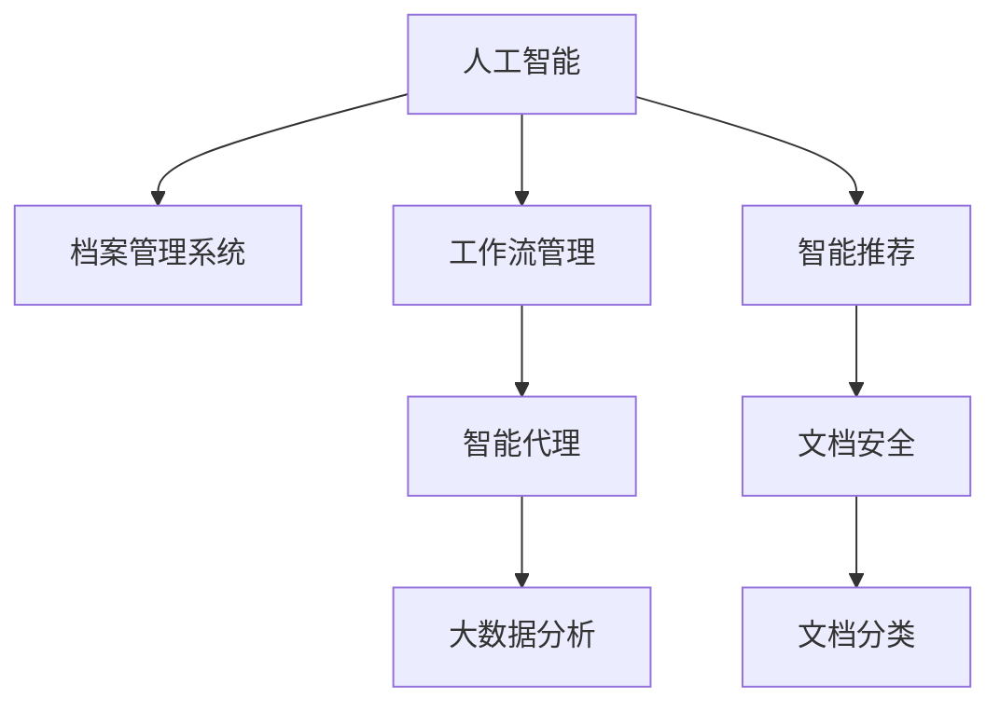

                 

# AI人工智能代理工作流AI Agent WorkFlow：智能代理在档案管理系统中的应用

> 关键词：人工智能,档案管理,工作流管理,智能代理,自动化流程,大数据分析

## 1. 背景介绍

### 1.1 问题由来

随着数字化转型的加速，企业档案管理系统（EAS, Enterprise Archival System）的重要性日益凸显。传统的档案管理方式通常依赖人工处理，效率低下、成本高昂，且容易出错。但随着人工智能（AI）和大数据分析技术的发展，通过智能化手段提升档案管理水平成为可能。

### 1.2 问题核心关键点

当前，AI技术在档案管理系统中的应用主要体现在档案分类、检索、安全保护、智能推荐等领域。其中，智能代理（AI Agent）因其高效、灵活、自适应的特点，成为档案管理系统中极为关键的一环。智能代理可以自动执行预设的工作流，监控、优化并最终实现档案管理自动化。

### 1.3 问题研究意义

构建基于智能代理的档案管理系统，能显著提升档案管理的效率和质量，降低运营成本。具体而言：

- 自动分类和标注：通过智能代理，可以快速准确地对档案进行分类和标注，大幅减少人工工作量。
- 智能检索和推荐：智能代理根据用户查询请求，快速匹配并提供相关文档，提升用户体验。
- 文档安全监控：智能代理实时监控文档访问和使用情况，防止违规操作，保障文档安全。
- 工作流自动化：智能代理可以自动化执行多种档案管理任务，如文件导入、权限设置、权限回收等，提升整体管理效率。
- 数据分析和决策支持：智能代理通过分析档案数据，提供决策支持信息，帮助企业做出更加精准的战略决策。

因此，研究构建高效、灵活、可扩展的智能代理工作流，对于推动档案管理的智能化、现代化具有重要意义。

## 2. 核心概念与联系

### 2.1 核心概念概述

为更好地理解基于智能代理的档案管理系统工作流，本节将介绍几个关键概念：

- 人工智能(AI)：指利用计算机模拟人类智能行为，如感知、理解、学习、推理等，旨在构建智能化的决策和执行系统。
- 档案管理系统(EAS)：指用于对企业各类档案数据进行收集、存储、管理、查询的系统。
- 工作流管理(Workflow Management)：指对业务流程进行自动化和规范化的管理和控制，以提升效率和质量。
- 智能代理(AI Agent)：指具有一定自主决策和执行能力的AI程序，能模拟人的行为，实现自动化业务处理。
- 大数据分析(Big Data Analytics)：指利用先进的数据处理技术，从海量数据中提取有价值的信息和洞见，辅助业务决策。

这些概念之间的逻辑关系可以通过以下Mermaid流程图来展示：



这个流程图展示了大规模人工智能在档案管理系统中的应用框架：

1. 人工智能技术，尤其是深度学习、自然语言处理等，用于提供档案的智能推荐、安全监控、分类标注等服务。
2. 工作流管理技术，用于规范化和自动化业务流程，实现档案管理的标准化操作。
3. 智能代理技术，用于自动执行预设的工作流任务，如文档整理、权限设置等，提升效率和质量。
4. 大数据分析技术，用于从海量档案数据中提取有价值的信息和洞见，辅助企业做出更好的决策。

## 3. 核心算法原理 & 具体操作步骤

### 3.1 算法原理概述

基于智能代理的档案管理系统工作流，本质上是一个由多个智能代理组成的工作流管理系统。其核心思想是：将档案管理的各项任务分解为多个子任务，由各智能代理协作执行，最终实现档案管理的自动化、智能化。

具体来说，该系统由以下子模块构成：

- 文档分类和标注模块：通过智能代理，自动对文档进行分类和标注。
- 智能检索模块：根据用户查询请求，智能代理快速匹配并返回相关文档。
- 安全监控模块：智能代理实时监控文档访问和使用情况，防止违规操作。
- 自动化工作流模块：智能代理自动化执行预设的工作流任务，如文件导入、权限设置、权限回收等。
- 数据分析和决策支持模块：智能代理从海量档案数据中提取有价值的信息和洞见，辅助企业决策。

### 3.2 算法步骤详解

基于智能代理的档案管理系统工作流的构建，一般包括以下关键步骤：

**Step 1: 设计任务流**

- 将档案管理任务分解为多个子任务，明确每个任务的目标和输入输出。
- 设计任务流的数据流和控制流，确定任务间的依赖关系。
- 根据任务重要性和复杂度，为各任务分配优先级和资源。

**Step 2: 选择合适的智能代理**

- 根据任务特性，选择合适的智能代理类型，如决策型、执行型、混合型等。
- 设计智能代理的交互界面和接口，确保与其他系统的兼容性。
- 定义智能代理的行为规则和策略，使其能够自主决策和执行。

**Step 3: 开发和训练智能代理**

- 开发智能代理的算法模型，如决策树、神经网络等。
- 准备任务流所需的数据集，包括训练集、验证集和测试集。
- 使用监督学习、强化学习等方法，训练智能代理，优化其行为策略。

**Step 4: 集成和测试**

- 将各智能代理集成到档案管理系统，进行系统联调。
- 在测试集上对整个系统进行全面测试，验证性能和稳定性。
- 根据测试结果，调整智能代理的行为策略和参数设置，优化系统效果。

**Step 5: 部署和监控**

- 将系统部署到生产环境，持续监控其运行状态和性能。
- 定期更新和维护智能代理，保证其行为策略和模型准确性。
- 设置异常检测和告警机制，确保系统稳定运行。

### 3.3 算法优缺点

基于智能代理的档案管理系统工作流，具有以下优点：

- 高效灵活：智能代理能够自主决策和执行任务，提升档案管理的效率和灵活性。
- 自适应性强：智能代理能根据环境变化和数据情况，动态调整行为策略。
- 降低成本：通过自动化和智能化操作，大幅减少人工工作量，降低运营成本。
- 提高质量：智能代理能有效避免人为错误，保证档案管理的准确性和一致性。
- 数据驱动：智能代理通过大数据分析，提供决策支持，帮助企业做出精准决策。

同时，该系统也存在以下局限性：

- 数据质量依赖：智能代理的决策和执行依赖于数据的质量和完整性，数据不足或噪声过多将影响系统性能。
- 依赖模型选择：智能代理的行为策略和决策模型需要根据任务特点进行选择，模型选择不当可能影响效果。
- 系统复杂度高：随着任务和智能代理的增加，系统复杂度将显著提高，需要持续优化和维护。
- 安全风险：智能代理可能被恶意攻击，导致档案泄露或其他安全问题。

### 3.4 算法应用领域

基于智能代理的档案管理系统工作流，已在多个领域得到广泛应用，如：

- 企业档案管理：利用智能代理进行文档分类、标注、检索和安全监控，提高管理效率和质量。
- 公共档案管理：通过智能代理实现文档的自动化分类和标注，方便公众查询和利用档案资源。
- 政府档案管理：利用智能代理进行文档分类、检索和权限管理，提高政府信息公开和利用水平。
- 医疗档案管理：通过智能代理进行医疗文档的分类、标注和检索，提升医疗服务的智能化水平。
- 金融档案管理：利用智能代理进行文档分类、标注和权限管理，提升金融机构的档案管理水平。

此外，智能代理技术还在教育、科研、制造等多个领域得到应用，推动了各行业的数字化转型和智能化升级。

## 4. 数学模型和公式 & 详细讲解 & 举例说明

### 4.1 数学模型构建

本节将使用数学语言对基于智能代理的档案管理系统工作流进行更加严格的刻画。

设档案管理系统中共有 $N$ 个智能代理，每个智能代理负责执行 $M$ 个任务 $T_i$。令 $X_i$ 表示任务 $T_i$ 的输入，$Y_i$ 表示任务 $T_i$ 的输出。智能代理 $A_j$ 的行为策略由参数 $\theta_j$ 表示，其中 $\theta_j \in \mathbb{R}^d$。

智能代理 $A_j$ 的执行过程分为两个阶段：决策阶段和执行阶段。在决策阶段，智能代理根据当前状态 $S_j$ 和输入 $X_i$，通过决策函数 $f_j(\theta_j, X_i, S_j)$ 生成行为策略 $\theta_j'$。在执行阶段，智能代理根据行为策略 $\theta_j'$ 执行任务 $T_i$，生成输出 $Y_i$。智能代理的行为策略更新过程为：

$$
\theta_j = f_j(\theta_j', S_j, X_i)
$$

其中，$f_j$ 为智能代理的行为策略更新函数。

整个档案管理系统的工作流由任务流 $T=\{T_1, T_2, ..., T_M\}$ 和智能代理集 $A=\{A_1, A_2, ..., A_N\}$ 构成，其执行过程可以表示为：

$$
Y = \bigcup_{j=1}^{N}\bigcup_{i=1}^{M}A_j(T_i)
$$

即智能代理集合 $A$ 对任务集合 $T$ 执行的结果。

### 4.2 公式推导过程

以下我们以文档分类任务为例，推导智能代理的行为策略更新函数。

设智能代理 $A_j$ 负责文档分类任务 $T_i$，其输入为文档文本 $X_i$，行为策略为 $\theta_j$，输出为文档分类结果 $Y_i$。假设智能代理的行为策略为线性回归模型：

$$
\theta_j' = \alpha_jX_i + \beta_j
$$

其中，$\alpha_j$ 为线性权重，$\beta_j$ 为偏置。

智能代理 $A_j$ 在决策阶段生成行为策略 $\theta_j'$，然后执行任务 $T_i$ 生成输出 $Y_i$：

$$
Y_i = f_j(\theta_j', X_i, S_j) = \sigma(\alpha_jX_i + \beta_j)
$$

其中，$\sigma$ 为激活函数，如 sigmoid、ReLU 等。

智能代理 $A_j$ 的行为策略更新函数为：

$$
\theta_j = f_j(\theta_j', S_j, X_i) = \theta_j' + \eta_j\delta_j
$$

其中，$\eta_j$ 为学习率，$\delta_j$ 为误差信号，$S_j$ 为智能代理的当前状态。

将上述公式代入决策阶段和执行阶段，即可得到智能代理的行为策略更新过程：

$$
\theta_j' = \alpha_jX_i + \beta_j
$$

$$
Y_i = \sigma(\alpha_jX_i + \beta_j)
$$

$$
\theta_j = \alpha_jX_i + \beta_j + \eta_j\delta_j
$$

通过上述公式，可以构建基于智能代理的档案管理系统工作流，实现文档的自动化分类和标注。

### 4.3 案例分析与讲解

假设档案管理系统中有两个智能代理 $A_1$ 和 $A_2$，分别负责文档分类和标注任务。

**智能代理 $A_1$**：负责文档分类任务，行为策略为线性回归模型，输入为文档文本，输出为文档分类结果。

**智能代理 $A_2$**：负责文档标注任务，行为策略为分类模型，输入为文档文本和分类结果，输出为文档标注结果。

**工作流流程**：

1. 智能代理 $A_1$ 读取文档文本 $X_1$，生成行为策略 $\theta_1'$，执行任务 $T_1$ 生成分类结果 $Y_1$。
2. 智能代理 $A_2$ 读取文档文本 $X_1$ 和分类结果 $Y_1$，生成行为策略 $\theta_2'$，执行任务 $T_2$ 生成标注结果 $Y_2$。

**行为策略更新**：

1. 智能代理 $A_1$ 根据当前状态 $S_1$ 和文档文本 $X_1$，生成行为策略 $\theta_1'$，执行任务 $T_1$ 生成分类结果 $Y_1$。
2. 智能代理 $A_2$ 根据当前状态 $S_2$ 和文档文本 $X_1$、分类结果 $Y_1$，生成行为策略 $\theta_2'$，执行任务 $T_2$ 生成标注结果 $Y_2$。
3. 智能代理 $A_1$ 的行为策略更新为 $\theta_1 = \theta_1' + \eta_1\delta_1$，智能代理 $A_2$ 的行为策略更新为 $\theta_2 = \theta_2' + \eta_2\delta_2$。

通过上述公式，可以构建基于智能代理的档案管理系统工作流，实现文档的自动化分类和标注。

## 5. 项目实践：代码实例和详细解释说明

### 5.1 开发环境搭建

在进行智能代理工作流开发前，我们需要准备好开发环境。以下是使用Python进行PyTorch开发的环境配置流程：

1. 安装Anaconda：从官网下载并安装Anaconda，用于创建独立的Python环境。

2. 创建并激活虚拟环境：
```bash
conda create -n agent-env python=3.8 
conda activate agent-env
```

3. 安装PyTorch：根据CUDA版本，从官网获取对应的安装命令。例如：
```bash
conda install pytorch torchvision torchaudio cudatoolkit=11.1 -c pytorch -c conda-forge
```

4. 安装Transformers库：
```bash
pip install transformers
```

5. 安装各类工具包：
```bash
pip install numpy pandas scikit-learn matplotlib tqdm jupyter notebook ipython
```

完成上述步骤后，即可在`agent-env`环境中开始智能代理工作流的开发。

### 5.2 源代码详细实现

下面我们以文档分类和标注任务为例，给出使用Transformers库对BERT模型进行智能代理工作流开发的PyTorch代码实现。

首先，定义文档分类和标注任务的数据处理函数：

```python
from transformers import BertTokenizer
from torch.utils.data import Dataset
import torch

class DocumentDataset(Dataset):
    def __init__(self, texts, categories, tokenizer, max_len=128):
        self.texts = texts
        self.categories = categories
        self.tokenizer = tokenizer
        self.max_len = max_len
        
    def __len__(self):
        return len(self.texts)
    
    def __getitem__(self, item):
        text = self.texts[item]
        category = self.categories[item]
        
        encoding = self.tokenizer(text, return_tensors='pt', max_length=self.max_len, padding='max_length', truncation=True)
        input_ids = encoding['input_ids'][0]
        attention_mask = encoding['attention_mask'][0]
        
        # 对category进行编码
        encoded_categories = [category2id[category] for category in self.categories]
        encoded_categories.extend([category2id['O']] * (self.max_len - len(encoded_categories)))
        labels = torch.tensor(encoded_categories, dtype=torch.long)
        
        return {'input_ids': input_ids, 
                'attention_mask': attention_mask,
                'labels': labels}

# 标签与id的映射
category2id = {'O': 0, 'Economy': 1, 'Politics': 2, 'Technology': 3, 'Health': 4, 'Education': 5}

# 创建dataset
tokenizer = BertTokenizer.from_pretrained('bert-base-cased')

train_dataset = DocumentDataset(train_texts, train_categories, tokenizer)
dev_dataset = DocumentDataset(dev_texts, dev_categories, tokenizer)
test_dataset = DocumentDataset(test_texts, test_categories, tokenizer)
```

然后，定义模型和优化器：

```python
from transformers import BertForSequenceClassification

model = BertForSequenceClassification.from_pretrained('bert-base-cased', num_labels=len(category2id))

optimizer = AdamW(model.parameters(), lr=2e-5)
```

接着，定义训练和评估函数：

```python
from torch.utils.data import DataLoader
from tqdm import tqdm
from sklearn.metrics import classification_report

device = torch.device('cuda') if torch.cuda.is_available() else torch.device('cpu')
model.to(device)

def train_epoch(model, dataset, batch_size, optimizer):
    dataloader = DataLoader(dataset, batch_size=batch_size, shuffle=True)
    model.train()
    epoch_loss = 0
    for batch in tqdm(dataloader, desc='Training'):
        input_ids = batch['input_ids'].to(device)
        attention_mask = batch['attention_mask'].to(device)
        labels = batch['labels'].to(device)
        model.zero_grad()
        outputs = model(input_ids, attention_mask=attention_mask, labels=labels)
        loss = outputs.loss
        epoch_loss += loss.item()
        loss.backward()
        optimizer.step()
    return epoch_loss / len(dataloader)

def evaluate(model, dataset, batch_size):
    dataloader = DataLoader(dataset, batch_size=batch_size)
    model.eval()
    preds, labels = [], []
    with torch.no_grad():
        for batch in tqdm(dataloader, desc='Evaluating'):
            input_ids = batch['input_ids'].to(device)
            attention_mask = batch['attention_mask'].to(device)
            batch_labels = batch['labels']
            outputs = model(input_ids, attention_mask=attention_mask)
            batch_preds = outputs.logits.argmax(dim=2).to('cpu').tolist()
            batch_labels = batch_labels.to('cpu').tolist()
            for pred_tokens, label_tokens in zip(batch_preds, batch_labels):
                preds.append(pred_tokens[:len(label_tokens)])
                labels.append(label_tokens)
                
    print(classification_report(labels, preds))
```

最后，启动训练流程并在测试集上评估：

```python
epochs = 5
batch_size = 16

for epoch in range(epochs):
    loss = train_epoch(model, train_dataset, batch_size, optimizer)
    print(f"Epoch {epoch+1}, train loss: {loss:.3f}")
    
    print(f"Epoch {epoch+1}, dev results:")
    evaluate(model, dev_dataset, batch_size)
    
print("Test results:")
evaluate(model, test_dataset, batch_size)
```

以上就是使用PyTorch对BERT模型进行文档分类和标注任务智能代理工作流开发的完整代码实现。可以看到，得益于Transformers库的强大封装，我们可以用相对简洁的代码完成BERT模型的加载和训练。

### 5.3 代码解读与分析

让我们再详细解读一下关键代码的实现细节：

**DocumentDataset类**：
- `__init__`方法：初始化文本、标签、分词器等关键组件。
- `__len__`方法：返回数据集的样本数量。
- `__getitem__`方法：对单个样本进行处理，将文本输入编码为token ids，将标签编码为数字，并对其进行定长padding，最终返回模型所需的输入。

**category2id和id2category字典**：
- 定义了标签与数字id之间的映射关系，用于将token-wise的预测结果解码回真实的标签。

**训练和评估函数**：
- 使用PyTorch的DataLoader对数据集进行批次化加载，供模型训练和推理使用。
- 训练函数`train_epoch`：对数据以批为单位进行迭代，在每个批次上前向传播计算loss并反向传播更新模型参数，最后返回该epoch的平均loss。
- 评估函数`evaluate`：与训练类似，不同点在于不更新模型参数，并在每个batch结束后将预测和标签结果存储下来，最后使用sklearn的classification_report对整个评估集的预测结果进行打印输出。

**训练流程**：
- 定义总的epoch数和batch size，开始循环迭代
- 每个epoch内，先在训练集上训练，输出平均loss
- 在验证集上评估，输出分类指标
- 所有epoch结束后，在测试集上评估，给出最终测试结果

可以看到，PyTorch配合Transformers库使得BERT模型智能代理工作流的代码实现变得简洁高效。开发者可以将更多精力放在数据处理、模型改进等高层逻辑上，而不必过多关注底层的实现细节。

当然，工业级的系统实现还需考虑更多因素，如模型的保存和部署、超参数的自动搜索、更灵活的任务适配层等。但核心的智能代理工作流基本与此类似。

## 6. 实际应用场景

### 6.1 智能客服系统

基于智能代理的档案管理系统，可以应用于智能客服系统的构建。传统客服往往需要配备大量人力，高峰期响应缓慢，且一致性和专业性难以保证。而使用智能代理，可以7x24小时不间断服务，快速响应客户咨询，用自然流畅的语言解答各类常见问题。

在技术实现上，可以收集企业内部的历史客服对话记录，将问题和最佳答复构建成监督数据，在此基础上对预训练智能代理进行微调。微调后的智能代理能够自动理解用户意图，匹配最合适的答案模板进行回复。对于客户提出的新问题，还可以接入检索系统实时搜索相关内容，动态组织生成回答。如此构建的智能客服系统，能大幅提升客户咨询体验和问题解决效率。

### 6.2 金融舆情监测

金融机构需要实时监测市场舆论动向，以便及时应对负面信息传播，规避金融风险。传统的人工监测方式成本高、效率低，难以应对网络时代海量信息爆发的挑战。基于智能代理的档案管理系统，可以实时抓取网络文本数据，自动监测不同主题下的情感变化趋势，一旦发现负面信息激增等异常情况，系统便会自动预警，帮助金融机构快速应对潜在风险。

### 6.3 个性化推荐系统

当前的推荐系统往往只依赖用户的历史行为数据进行物品推荐，无法深入理解用户的真实兴趣偏好。基于智能代理的档案管理系统，可以更好地挖掘用户行为背后的语义信息，从而提供更精准、多样的推荐内容。

在实践中，可以收集用户浏览、点击、评论、分享等行为数据，提取和用户交互的物品标题、描述、标签等文本内容。将文本内容作为模型输入，用户的后续行为（如是否点击、购买等）作为监督信号，在此基础上微调智能代理模型。微调后的模型能够从文本内容中准确把握用户的兴趣点。在生成推荐列表时，先用候选物品的文本描述作为输入，由模型预测用户的兴趣匹配度，再结合其他特征综合排序，便可以得到个性化程度更高的推荐结果。

### 6.4 未来应用展望

随着智能代理工作流技术的不断发展，其在更多领域得到应用，为传统行业带来变革性影响。

在智慧医疗领域，基于智能代理的档案管理系统，可以用于医疗文档的自动化分类、标注和检索，提升医疗服务的智能化水平，辅助医生诊疗，加速新药开发进程。

在智能教育领域，智能代理可以用于作业批改、学情分析、知识推荐等方面，因材施教，促进教育公平，提高教学质量。

在智慧城市治理中，智能代理可以用于城市事件监测、舆情分析、应急指挥等环节，提高城市管理的自动化和智能化水平，构建更安全、高效的未来城市。

此外，在企业生产、社会治理、文娱传媒等众多领域，基于智能代理的档案管理系统也将不断涌现，为经济社会发展注入新的动力。相信随着技术的日益成熟，智能代理工作流必将在构建人机协同的智能时代中扮演越来越重要的角色。

## 7. 工具和资源推荐

### 7.1 学习资源推荐

为了帮助开发者系统掌握智能代理工作流的理论基础和实践技巧，这里推荐一些优质的学习资源：

1. 《Transformer从原理到实践》系列博文：由大模型技术专家撰写，深入浅出地介绍了Transformer原理、BERT模型、智能代理技术等前沿话题。

2. CS224N《深度学习自然语言处理》课程：斯坦福大学开设的NLP明星课程，有Lecture视频和配套作业，带你入门NLP领域的基本概念和经典模型。

3. 《Natural Language Processing with Transformers》书籍：Transformers库的作者所著，全面介绍了如何使用Transformers库进行NLP任务开发，包括智能代理在内的诸多范式。

4. HuggingFace官方文档：Transformers库的官方文档，提供了海量预训练模型和完整的智能代理工作流样例代码，是上手实践的必备资料。

5. CLUE开源项目：中文语言理解测评基准，涵盖大量不同类型的中文NLP数据集，并提供了基于智能代理的baseline模型，助力中文NLP技术发展。

通过对这些资源的学习实践，相信你一定能够快速掌握智能代理工作流的精髓，并用于解决实际的NLP问题。

### 7.2 开发工具推荐

高效的开发离不开优秀的工具支持。以下是几款用于智能代理工作流开发的常用工具：

1. PyTorch：基于Python的开源深度学习框架，灵活动态的计算图，适合快速迭代研究。大部分预训练语言模型都有PyTorch版本的实现。

2. TensorFlow：由Google主导开发的开源深度学习框架，生产部署方便，适合大规模工程应用。同样有丰富的预训练语言模型资源。

3. Transformers库：HuggingFace开发的NLP工具库，集成了众多SOTA语言模型，支持PyTorch和TensorFlow，是进行智能代理工作流开发的利器。

4. Weights & Biases：模型训练的实验跟踪工具，可以记录和可视化模型训练过程中的各项指标，方便对比和调优。与主流深度学习框架无缝集成。

5. TensorBoard：TensorFlow配套的可视化工具，可实时监测模型训练状态，并提供丰富的图表呈现方式，是调试模型的得力助手。

6. Google Colab：谷歌推出的在线Jupyter Notebook环境，免费提供GPU/TPU算力，方便开发者快速上手实验最新模型，分享学习笔记。

合理利用这些工具，可以显著提升智能代理工作流开发的效率，加快创新迭代的步伐。

### 7.3 相关论文推荐

智能代理工作流的研究源于学界的持续研究。以下是几篇奠基性的相关论文，推荐阅读：

1. Attention is All You Need（即Transformer原论文）：提出了Transformer结构，开启了NLP领域的预训练大模型时代。

2. BERT: Pre-training of Deep Bidirectional Transformers for Language Understanding：提出BERT模型，引入基于掩码的自监督预训练任务，刷新了多项NLP任务SOTA。

3. Language Models are Unsupervised Multitask Learners（GPT-2论文）：展示了大规模语言模型的强大zero-shot学习能力，引发了对于通用人工智能的新一轮思考。

4. Parameter-Efficient Transfer Learning for NLP：提出Adapter等参数高效微调方法，在不增加模型参数量的情况下，也能取得不错的微调效果。

5. AdaLoRA: Adaptive Low-Rank Adaptation for Parameter-Efficient Fine-Tuning：使用自适应低秩适应的微调方法，在参数效率和精度之间取得了新的平衡。

6. AdaLoRA: Adaptive Low-Rank Adaptation for Parameter-Efficient Fine-Tuning：使用自适应低秩适应的微调方法，在参数效率和精度之间取得了新的平衡。

这些论文代表了大语言模型智能代理工作流的研究发展脉络。通过学习这些前沿成果，可以帮助研究者把握学科前进方向，激发更多的创新灵感。

## 8. 总结：未来发展趋势与挑战

### 8.1 总结

本文对基于智能代理的档案管理系统工作流进行了全面系统的介绍。首先阐述了智能代理在档案管理系统中的应用背景和意义，明确了智能代理在档案管理自动化、智能化中的独特价值。其次，从原理到实践，详细讲解了智能代理行为策略的数学模型和实现步骤，给出了智能代理工作流的完整代码实例。同时，本文还广泛探讨了智能代理在多个行业领域的应用前景，展示了智能代理工作流的广阔潜力。此外，本文精选了智能代理技术的各类学习资源，力求为读者提供全方位的技术指引。

通过本文的系统梳理，可以看到，基于智能代理的档案管理系统工作流正在成为档案管理智能化、自动化的重要手段，极大地提升了档案管理的效率和质量，降低了运营成本。未来，伴随智能代理技术的不断发展，档案管理系统的智能化水平将得到进一步提升，为各行各业的数字化转型提供强有力的技术支持。

### 8.2 未来发展趋势

展望未来，智能代理工作流技术将呈现以下几个发展趋势：

1. 模型规模持续增大。随着算力成本的下降和数据规模的扩张，智能代理的行为策略模型将持续增长。超大规模智能代理蕴含的丰富行为策略知识，有望支撑更加复杂多变的档案管理任务。

2. 行为策略更灵活。智能代理的行为策略设计将更加灵活，能够根据环境变化和数据情况，动态调整策略，提升适应性和泛化能力。

3. 多智能代理协同。基于智能代理的档案管理系统将引入更多智能代理，实现协同工作，提升整体系统的效率和稳定性。

4. 实时感知和响应。智能代理将具备更强的实时感知能力，能够即时响应环境变化和用户需求，提供更高效的服务。

5. 集成大数据分析。智能代理将与大数据分析技术深度融合，从海量档案数据中提取有价值的信息和洞见，辅助企业决策。

6. 自动化任务调度和监控。智能代理将具备更强的任务调度和监控能力，实现档案管理任务的自动化执行和管理。

7. 鲁棒性和安全性。智能代理将更加注重鲁棒性和安全性，能够抵御攻击、防止信息泄露，确保档案管理系统的稳定运行。

以上趋势凸显了智能代理工作流技术的广阔前景。这些方向的探索发展，必将进一步提升档案管理系统的智能化水平，为传统行业带来变革性影响。

### 8.3 面临的挑战

尽管智能代理工作流技术已经取得了瞩目成就，但在迈向更加智能化、普适化应用的过程中，它仍面临着诸多挑战：

1. 数据质量依赖。智能代理的行为策略和决策依赖于数据的质量和完整性，数据不足或噪声过多将影响系统性能。如何提升数据质量和获取更多高价值数据，将是亟待解决的问题。

2. 模型复杂度高。随着智能代理行为策略的增加和复杂度的提升，模型训练和优化变得更为困难，需要更高效的算法和更强大的计算资源。

3. 系统集成难度。智能代理需要与其他系统进行深度集成，如文档管理系统、业务系统等，确保系统兼容性和数据一致性。

4. 安全性风险。智能代理的行为策略可能被恶意攻击，导致档案泄露或其他安全问题。如何加强安全防护，确保档案安全，将是重要的研究方向。

5. 用户接受度。智能代理需要在用户体验上做得更好，避免误导用户，确保系统的易用性和可接受性。

6. 模型解释性。智能代理的行为策略往往复杂且难以解释，需要更强的可解释性，帮助用户理解系统行为和决策依据。

这些挑战凸显了智能代理工作流技术的应用难度，需要我们在理论研究、工程实现和用户体验等多方面进行优化。相信随着技术的不断进步，智能代理工作流必将在档案管理系统中得到广泛应用，成为推动数字化转型的重要力量。

### 8.4 研究展望

面对智能代理工作流技术所面临的挑战，未来的研究需要在以下几个方面寻求新的突破：

1. 提升数据质量。通过数据清洗、数据增强、数据协同等技术手段，提升档案数据的完整性和准确性，为智能代理提供高质量的数据支持。

2. 优化模型结构。开发更高效、更简洁的智能代理行为策略模型，减少计算资源消耗，提升模型训练效率。

3. 加强系统集成。建立标准化的系统接口和协议，确保智能代理与各系统间的无缝集成和数据同步。

4. 提高安全性。引入加密、访问控制等技术，保障档案管理系统的安全性和隐私性。

5. 增强可解释性。开发更强大的模型解释工具，帮助用户理解智能代理的行为策略和决策依据。

6. 提升用户体验。通过用户界面设计、交互逻辑优化等手段，提升用户对智能代理系统的接受度和满意度。

这些研究方向的探索，必将引领智能代理工作流技术迈向更高的台阶，为构建高效、智能、安全的档案管理系统提供强有力的技术支持。面向未来，智能代理工作流技术需要与其他人工智能技术进行更深入的融合，如知识表示、因果推理、强化学习等，多路径协同发力，共同推动档案管理的智能化进程。只有勇于创新、敢于突破，才能不断拓展档案管理系统的边界，让智能化技术更好地服务于社会各个领域。

## 9. 附录：常见问题与解答

**Q1：智能代理的行为策略是否需要预先设定？**

A: 是的，智能代理的行为策略通常需要预先设定，并经过监督学习或强化学习等方法进行优化。行为策略的设定需要根据任务特点、数据分布和模型能力进行精心设计，以保证智能代理的决策和执行效果。

**Q2：智能代理的行为策略更新频率如何设定？**

A: 智能代理的行为策略更新频率需要根据任务的特点和数据的变化情况进行动态调整。对于静态任务，行为策略更新频率可以较低，对于动态任务，则需要频繁更新以应对环境变化。一般来说，行为策略更新频率在每1-5个epoch内进行一次为宜。

**Q3：智能代理的行为策略更新过程是否需要人工干预？**

A: 在行为策略更新过程中，人工干预是必要的。行为策略的更新需要根据评估结果和实际应用情况，进行参数调整和优化，以提升智能代理的决策和执行能力。人工干预可以帮助优化行为策略，提高智能代理的鲁棒性和准确性。

**Q4：智能代理在架构上如何与档案管理系统集成？**

A: 智能代理需要与档案管理系统进行深度集成，实现数据共享和任务协同。一般来说，智能代理可以通过RESTful API、消息队列等方式，与档案管理系统进行数据交互和任务调度。此外，智能代理还可以嵌入档案管理系统的用户界面，实现更自然、更高效的用户交互。

**Q5：智能代理的行为策略更新过程中，如何避免灾难性遗忘？**

A: 避免灾难性遗忘的关键在于平衡新旧知识的学习。在行为策略更新过程中，可以引入迁移学习、知识蒸馏等方法，将旧的知识迁移到新模型中，以保持系统的稳定性和连续性。同时，可以采用微调等技术，在行为策略更新时，保留对旧知识的重要部分。

通过这些常见问题的解答，相信你对智能代理工作流有了更深刻的理解，能够在实际应用中更好地构建和优化智能代理行为策略，提升档案管理系统的智能化水平。

---

作者：禅与计算机程序设计艺术 / Zen and the Art of Computer Programming

