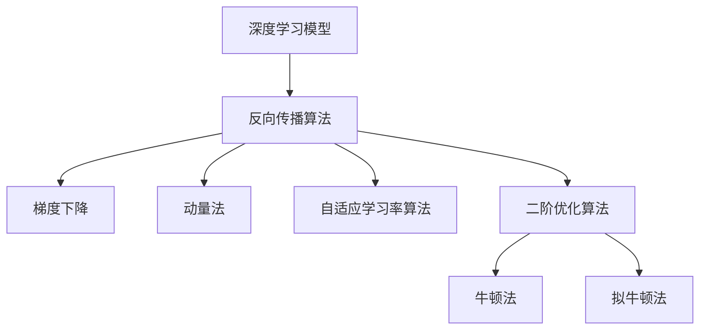

                 

# AI人工智能深度学习算法：反向传播与优化方法

> 关键词：深度学习,反向传播,梯度下降,优化算法,神经网络,机器学习,损失函数

## 1. 背景介绍

### 1.1 问题由来
深度学习作为一种强大的机器学习方法，近年来在各个领域都取得了显著的突破。其中，反向传播算法作为深度学习模型的核心，使得神经网络能够高效地进行训练和优化，从而在图像识别、自然语言处理、语音识别等诸多领域取得了领先的成果。然而，随着模型规模和复杂度的不断增加，反向传播算法以及其优化方法的挑战也随之而来。如何在保证模型性能的同时，提高训练效率和优化效果，成为深度学习领域的一个重要课题。

### 1.2 问题核心关键点
本节将详细介绍反向传播算法和深度学习模型的优化方法，包括梯度下降、动量法、自适应学习率、二阶优化等。我们将从基础理论出发，逐步深入，以期读者能够全面理解深度学习模型训练和优化的方法，并掌握其实际应用技巧。

## 2. 核心概念与联系

### 2.1 核心概念概述

为更好地理解深度学习模型中的反向传播算法和优化方法，本节将介绍几个关键概念：

- **深度学习模型**：以神经网络为代表，由多个层级构成的非线性函数映射模型。通过多个非线性变换，可以从输入数据中学习出复杂的特征表示，从而实现高效的特征提取和模式识别。

- **反向传播算法**：一种基于梯度下降优化的算法，用于计算神经网络中各参数的梯度。通过反向传播，模型可以不断调整权重和偏置，从而逼近理想的目标函数。

- **梯度下降**：一种常用的优化算法，通过计算目标函数对各参数的梯度，并沿着梯度的反方向逐步调整参数值，使目标函数值不断减小。

- **动量法**：一种改进的梯度下降算法，通过引入动量项，加速梯度下降的收敛速度，避免局部最优。

- **自适应学习率算法**：如Adagrad、Adadelta、Adam等，通过动态调整学习率，使模型在不同的参数位置和梯度方向上采取不同的学习策略，提高训练效率。

- **二阶优化算法**：如牛顿法、拟牛顿法等，通过使用二阶导数信息，进行更精确的参数更新，提高收敛速度和精度。

这些概念之间紧密相关，共同构成了深度学习模型的训练和优化理论框架。通过理解这些核心概念，我们可以更好地把握深度学习模型训练和优化的关键要素。

### 2.2 核心概念原理和架构的 Mermaid 流程图


## 3. 核心算法原理 & 具体操作步骤

### 3.1 算法原理概述
深度学习模型的优化主要通过反向传播算法实现。反向传播算法基于梯度下降的原理，通过链式法则计算损失函数对模型参数的梯度，并沿着梯度的反方向逐步调整参数，使模型逐渐逼近最优解。

深度学习模型的训练过程通常分为前向传播和反向传播两个步骤。在前向传播中，模型将输入数据经过多个非线性变换，得到模型的预测输出。在反向传播中，模型通过计算预测输出与真实标签之间的差异（即损失函数），并反向传播计算每个参数的梯度，最后根据梯度下降的原理调整模型参数，实现模型的优化。

### 3.2 算法步骤详解

以下是深度学习模型训练过程中的详细算法步骤：

**Step 1: 准备数据和模型**
- 准备训练集 $D=\{(x_i, y_i)\}_{i=1}^N$，其中 $x_i$ 为输入数据，$y_i$ 为标签。
- 准备模型 $M_\theta$，其中 $\theta$ 为模型参数。

**Step 2: 前向传播**
- 将输入数据 $x$ 输入模型，计算模型输出 $M_\theta(x)$。

**Step 3: 计算损失函数**
- 计算模型输出 $M_\theta(x)$ 与真实标签 $y$ 之间的差异，即损失函数 $L(\theta)$。

**Step 4: 反向传播**
- 从输出层开始，反向计算每个参数的梯度，直到输入层。

**Step 5: 更新模型参数**
- 根据梯度下降算法，更新模型参数 $\theta$。

**Step 6: 重复迭代**
- 重复上述步骤，直至模型收敛。

### 3.3 算法优缺点

深度学习模型的优化算法主要包括以下几种：

**优点：**
- **效率高**：通过反向传播算法，可以高效地计算梯度，实现模型的优化。
- **自适应性强**：自适应学习率算法和二阶优化算法可以根据模型的实际情况，动态调整学习率和更新策略，提高训练效率和效果。
- **泛化能力强**：通过优化算法，模型可以在大量训练样本的基础上，学习到更加丰富的特征表示，提升模型的泛化能力。

**缺点：**
- **计算量大**：随着模型规模的增大，反向传播算法的计算量也会随之增加。
- **易陷入局部最优**：由于梯度下降算法的局部性，模型可能陷入局部最优，无法找到全局最优解。
- **敏感性高**：模型对初始化参数和超参数的敏感性较高，需要精心设计才能取得好的训练效果。

### 3.4 算法应用领域

深度学习模型的优化算法在多个领域得到了广泛应用，例如：

- **计算机视觉**：用于图像分类、目标检测、语义分割等任务。
- **自然语言处理**：用于语言模型、机器翻译、情感分析等任务。
- **语音识别**：用于语音转换、语音识别等任务。
- **推荐系统**：用于协同过滤、基于内容的推荐等任务。
- **医疗诊断**：用于医学影像分析、病理诊断等任务。

这些应用场景中，深度学习模型的优化算法均发挥了重要作用，使得模型能够高效地进行训练和优化，从而取得优异的效果。

## 4. 数学模型和公式 & 详细讲解 & 举例说明

### 4.1 数学模型构建

假设深度学习模型的损失函数为 $L(\theta)$，其中 $\theta$ 为模型参数。在每次迭代中，模型的损失函数为 $L(\theta_t)$，其中 $t$ 表示迭代次数。深度学习模型的优化目标是最小化损失函数，即求解 $\theta$ 使得 $L(\theta)$ 最小。

**公式推导过程：**

1. **梯度下降算法**：
   $$
   \theta_{t+1} = \theta_t - \eta \nabla_{\theta}L(\theta_t)
   $$
   其中 $\eta$ 为学习率，$\nabla_{\theta}L(\theta_t)$ 为损失函数对 $\theta$ 的梯度。

2. **动量法**：
   $$
   v_t = \beta v_{t-1} + (1-\beta) \nabla_{\theta}L(\theta_t)
   $$
   $$
   \theta_{t+1} = \theta_t - \eta \frac{v_t}{\sqrt{1-\beta^t}}
   $$
   其中 $\beta$ 为动量系数，$v_t$ 为动量项。

3. **自适应学习率算法**：
   - **Adagrad**：
     $$
     \theta_{t+1} = \theta_t - \eta_t \nabla_{\theta}L(\theta_t)
     $$
     其中 $\eta_t = \frac{\eta}{\sqrt{\sum_{i=1}^t \nabla_{\theta}L(\theta_i)^2}}$
   - **Adam**：
     $$
     \theta_{t+1} = \theta_t - \eta \frac{m_t}{\sqrt{v_t} + \epsilon}
     $$
     其中 $m_t = \beta_1 m_{t-1} + (1-\beta_1) \nabla_{\theta}L(\theta_t)$，$v_t = \beta_2 v_{t-1} + (1-\beta_2) \nabla_{\theta}L(\theta_t)^2$，$\beta_1$ 和 $\beta_2$ 为动量和二阶矩的衰减率，$\epsilon$ 为数值稳定因子。

4. **二阶优化算法**：
   - **牛顿法**：
     $$
     \theta_{t+1} = \theta_t - \nabla_{\theta}L(\theta_t)^{-1} \nabla_{\theta}^2L(\theta_t)
     $$
   - **拟牛顿法**：如BFGS算法，使用二次近似方法更新参数。

### 4.3 案例分析与讲解

以简单的线性回归模型为例，来说明梯度下降和动量法的原理和效果。

**梯度下降算法：**
- 假设模型为 $y = wx + b$，其中 $w$ 和 $b$ 为模型参数，$x$ 为输入数据，$y$ 为标签。
- 损失函数为均方误差 $L(w,b) = \frac{1}{N}\sum_{i=1}^N (y_i - wx_i - b)^2$。
- 使用梯度下降算法更新参数：
  $$
  w_{t+1} = w_t - \eta \frac{\sum_{i=1}^N (y_i - wx_i - b)}{N}
  $$
  $$
  b_{t+1} = b_t - \eta \frac{\sum_{i=1}^N (y_i - wx_i - b)}{N}
  $$

**动量法：**
- 假设初始动量项为 $v_0 = 0$。
- 更新公式为：
  $$
  v_t = \beta v_{t-1} + (1-\beta) \frac{\sum_{i=1}^N (y_i - wx_i - b)}{N}
  $$
  $$
  w_{t+1} = w_t - \eta \frac{v_t}{\sqrt{1-\beta^t}}
  $$
  $$
  b_{t+1} = b_t - \eta \frac{v_t}{\sqrt{1-\beta^t}}
  $$

通过对比梯度下降和动量法的收敛效果，可以看出动量法能够加速梯度下降的收敛速度，避免在局部最优点震荡。

## 5. 项目实践：代码实例和详细解释说明

### 5.1 开发环境搭建

在进行深度学习模型优化实践前，我们需要准备好开发环境。以下是使用Python进行TensorFlow开发的设备环境配置流程：

1. 安装Anaconda：从官网下载并安装Anaconda，用于创建独立的Python环境。

2. 创建并激活虚拟环境：
```bash
conda create -n tf-env python=3.8 
conda activate tf-env
```

3. 安装TensorFlow：根据CUDA版本，从官网获取对应的安装命令。例如：
```bash
conda install tensorflow -c conda-forge -c pytorch -c pytorch-feedstock
```

4. 安装各类工具包：
```bash
pip install numpy pandas scikit-learn matplotlib tqdm jupyter notebook ipython
```

完成上述步骤后，即可在`tf-env`环境中开始深度学习模型优化的实践。

### 5.2 源代码详细实现

这里我们以TensorFlow实现一个简单的线性回归模型为例，演示梯度下降和动量法的实现。

首先，定义线性回归模型：

```python
import tensorflow as tf
import numpy as np

class LinearRegression(tf.keras.Model):
    def __init__(self, input_dim):
        super(LinearRegression, self).__init__()
        self.w = tf.Variable(tf.random.normal([input_dim, 1]))
        self.b = tf.Variable(tf.zeros([1]))
    
    def call(self, x):
        return tf.matmul(x, self.w) + self.b
```

然后，定义损失函数和优化器：

```python
def mse_loss(y_true, y_pred):
    return tf.reduce_mean(tf.square(y_true - y_pred))

optimizer = tf.keras.optimizers.Adam(learning_rate=0.01)
```

接着，定义训练和评估函数：

```python
@tf.function
def train_step(inputs, labels):
    with tf.GradientTape() as tape:
        outputs = model(inputs)
        loss = mse_loss(labels, outputs)
    grads = tape.gradient(loss, [model.w, model.b])
    optimizer.apply_gradients(zip(grads, [model.w, model.b]))
    return loss

@tf.function
def evaluate(inputs, labels):
    outputs = model(inputs)
    loss = mse_loss(labels, outputs)
    return loss
```

最后，启动训练流程并在测试集上评估：

```python
epochs = 100
batch_size = 32

model = LinearRegression(input_dim=2)
optimizer = tf.keras.optimizers.Adam(learning_rate=0.01)

inputs = np.random.rand(100, input_dim).astype(np.float32)
labels = np.random.rand(100, 1).astype(np.float32)

for epoch in range(epochs):
    for i in range(0, inputs.shape[0], batch_size):
        batch_inputs = inputs[i:i+batch_size]
        batch_labels = labels[i:i+batch_size]
        loss = train_step(batch_inputs, batch_labels)
    print(f"Epoch {epoch+1}, loss: {loss.numpy()}")
    
    test_inputs = np.random.rand(100, input_dim).astype(np.float32)
    test_labels = np.random.rand(100, 1).astype(np.float32)
    print(f"Test loss: {evaluate(test_inputs, test_labels).numpy()}")
```

以上就是使用TensorFlow实现线性回归模型的梯度下降和动量法的代码实现。可以看到，TensorFlow提供了完整的优化器、梯度计算和模型训练功能，使得模型优化变得简洁高效。

### 5.3 代码解读与分析

让我们再详细解读一下关键代码的实现细节：

**LinearRegression类**：
- 定义模型的输入维度和参数。
- 在前向传播中，计算线性回归模型的输出。

**mse_loss函数**：
- 定义均方误差损失函数，用于计算模型预测输出与真实标签之间的差异。

**train_step和evaluate函数**：
- 使用TensorFlow的GradientTape自动求导，计算损失函数对模型参数的梯度。
- 使用Adam优化器，根据梯度更新模型参数。
- 在训练和评估函数中，使用@tf.function装饰器，将函数编译为TensorFlow图，提升计算效率。

**训练流程**：
- 定义总的epoch数和batch size，开始循环迭代。
- 在每个epoch内，对数据以批为单位进行迭代训练。
- 在测试集上评估模型，输出测试损失。

可以看到，TensorFlow提供了强大的深度学习模型优化工具，使得梯度下降和动量法的实现变得简单高效。开发者可以将更多精力放在数据处理、模型改进等高层逻辑上，而不必过多关注底层的实现细节。

## 6. 实际应用场景

### 6.1 计算机视觉

在计算机视觉领域，深度学习模型的优化算法被广泛应用于图像分类、目标检测、语义分割等任务。通过反向传播算法和优化方法，模型可以高效地进行训练和优化，从而在CIFAR-10、ImageNet等大规模数据集上取得优异的性能。

### 6.2 自然语言处理

在自然语言处理领域，深度学习模型的优化算法被广泛应用于语言模型、机器翻译、情感分析等任务。通过反向传播算法和优化方法，模型可以高效地进行训练和优化，从而在GLUE、CoNLL等数据集上取得优异的性能。

### 6.3 语音识别

在语音识别领域，深度学习模型的优化算法被广泛应用于语音转换、语音识别等任务。通过反向传播算法和优化方法，模型可以高效地进行训练和优化，从而在LibriSpeech、AISHELL-1等大规模数据集上取得优异的性能。

### 6.4 推荐系统

在推荐系统领域，深度学习模型的优化算法被广泛应用于协同过滤、基于内容的推荐等任务。通过反向传播算法和优化方法，模型可以高效地进行训练和优化，从而在Amazon Reviews、Last.fm等数据集上取得优异的性能。

### 6.5 医疗诊断

在医疗诊断领域，深度学习模型的优化算法被广泛应用于医学影像分析、病理诊断等任务。通过反向传播算法和优化方法，模型可以高效地进行训练和优化，从而在CheXNet、RADNet等数据集上取得优异的性能。

## 7. 工具和资源推荐

### 7.1 学习资源推荐

为了帮助开发者系统掌握深度学习模型优化理论基础和实践技巧，这里推荐一些优质的学习资源：

1. **《深度学习》系列书籍**：由Ian Goodfellow等人合著，全面介绍了深度学习的基础理论和实践方法。
2. **Deep Learning Specialization课程**：由Andrew Ng教授在Coursera开设，涵盖了深度学习模型的基础理论和实际应用。
3. **《Python深度学习》书籍**：由Francois Chollet合著，详细介绍了使用TensorFlow进行深度学习模型训练和优化的方法。
4. **TensorFlow官方文档**：提供了完整的使用指南和代码示例，帮助开发者快速上手。
5. **PyTorch官方文档**：提供了完整的使用指南和代码示例，帮助开发者快速上手。

通过对这些资源的学习实践，相信你一定能够快速掌握深度学习模型优化的精髓，并用于解决实际的深度学习问题。

### 7.2 开发工具推荐

高效的开发离不开优秀的工具支持。以下是几款用于深度学习模型优化的常用工具：

1. **TensorFlow**：由Google主导开发的开源深度学习框架，生产部署方便，适合大规模工程应用。提供了丰富的优化器和梯度计算函数。
2. **PyTorch**：Facebook开源的深度学习框架，动态计算图，适合快速迭代研究。提供了丰富的优化器和梯度计算函数。
3. **Keras**：高层次的深度学习框架，提供了丰富的模型构建和优化方法，适合初学者入门。
4. **JAX**：基于XLA的深度学习框架，提供了自动求导、加速计算等功能，适合高性能计算。
5. **MXNet**：由Apache开源的深度学习框架，支持分布式计算和自动混合精度计算，适合大规模工程应用。

合理利用这些工具，可以显著提升深度学习模型优化的开发效率，加快创新迭代的步伐。

### 7.3 相关论文推荐

深度学习模型的优化方法在学术界和工业界都得到了广泛研究。以下是几篇奠基性的相关论文，推荐阅读：

1. **《AdaGrad: An Adaptive Learning Rate Method》**：Adagrad算法，动态调整学习率，适应不同参数的更新速度。
2. **《On the Importance of Initialization and Momentum in Deep Learning》**：讨论了学习率和动量对深度学习模型训练的影响。
3. **《RMSprop: Divide the Gradient by a Running Average of Its Recent Magnitudes》**：RMSprop算法，自适应调整学习率，适用于非凸函数优化。
4. **《Adam: A Method for Stochastic Optimization》**：Adam算法，结合动量和二阶矩估计，适用于大规模数据集优化。
5. **《A Survey of Gradient Descent Optimization Algorithms for Deep Learning》**：综述了各种优化算法，包括梯度下降、动量法、自适应学习率算法等。

这些论文代表了大深度学习模型优化方法的发展脉络。通过学习这些前沿成果，可以帮助研究者把握学科前进方向，激发更多的创新灵感。

## 8. 总结：未来发展趋势与挑战

### 8.1 总结

本文对深度学习模型的反向传播算法和优化方法进行了全面系统的介绍。首先阐述了深度学习模型的训练和优化原理，明确了梯度下降和优化算法在模型训练中的核心作用。其次，从基础理论到实际应用，详细讲解了深度学习模型的优化方法，给出了完整的代码实现示例。同时，本文还探讨了优化方法在计算机视觉、自然语言处理、语音识别等领域的广泛应用，展示了优化算法在深度学习中的重要价值。

通过本文的系统梳理，可以看到，深度学习模型的反向传播算法和优化方法正在成为深度学习领域的重要范式，极大地拓展了深度学习模型的应用边界，催生了更多的落地场景。得益于反向传播算法和优化方法的持续演进，深度学习技术将在更广阔的应用领域大放异彩。

### 8.2 未来发展趋势

展望未来，深度学习模型的优化方法将呈现以下几个发展趋势：

1. **自适应学习率算法的进一步改进**：未来的优化算法将更加注重自适应学习率，动态调整学习率，适应不同参数的更新速度，提高训练效率和效果。
2. **二阶优化算法的广泛应用**：随着计算资源和硬件设备的不断提升，二阶优化算法如牛顿法、拟牛顿法等将得到更广泛的应用，提高模型的训练精度和收敛速度。
3. **异构计算和多模态优化**：未来的优化算法将更加注重异构计算和多模态数据的优化，通过分布式计算和跨模态融合，提高模型的训练效率和效果。
4. **模型压缩和量化**：未来的优化算法将更加注重模型压缩和量化，通过减少模型参数量，降低计算和存储成本，提高模型的实时性和可扩展性。
5. **鲁棒性和鲁棒性增强**：未来的优化算法将更加注重鲁棒性和鲁棒性增强，通过加入对抗训练、正则化等技术，提高模型的鲁棒性和泛化能力。

这些趋势凸显了深度学习模型优化技术的广阔前景。这些方向的探索发展，必将进一步提升深度学习模型的性能和应用范围，为人工智能技术的发展提供更强大的支持。

### 8.3 面临的挑战

尽管深度学习模型的优化方法已经取得了显著的成果，但在迈向更加智能化、普适化应用的过程中，仍面临诸多挑战：

1. **计算资源和硬件设备的限制**：随着模型规模和复杂度的不断增加，深度学习模型的训练和优化需要大量的计算资源和硬件设备，如何在有限的计算资源下进行高效的模型训练和优化，是一大挑战。
2. **模型泛化能力和鲁棒性不足**：深度学习模型在训练数据集上的表现往往较好，但在测试数据集上泛化能力不足，模型对输入数据的微小变化敏感，导致模型的鲁棒性不足。
3. **模型训练的效率和速度**：深度学习模型训练过程中，通常需要大量的迭代次数和计算资源，如何在保证模型效果的同时，提高训练效率和速度，是另一个重要的挑战。
4. **模型解释性和透明性**：深度学习模型通常被视为"黑盒"，难以解释其内部工作机制和决策逻辑，如何在保证模型效果的同时，提高模型的可解释性和透明性，是未来研究的一个重要方向。
5. **模型安全和隐私保护**：深度学习模型在训练和应用过程中，可能会涉及大量敏感数据，如何保障数据安全和隐私保护，是另一个重要的挑战。

这些挑战需要学界和产业界共同努力，通过理论创新和技术进步，逐步克服这些难题，推动深度学习模型的发展。

### 8.4 研究展望

面对深度学习模型优化所面临的挑战，未来的研究需要在以下几个方面寻求新的突破：

1. **自适应学习率算法的改进**：开发更加高效的自适应学习率算法，动态调整学习率，提高训练效率和效果。
2. **异构计算和多模态优化**：开发更加高效的多模态优化算法，通过分布式计算和跨模态融合，提高模型的训练效率和效果。
3. **模型压缩和量化**：开发更加高效的模型压缩和量化算法，减少模型参数量，降低计算和存储成本，提高模型的实时性和可扩展性。
4. **鲁棒性增强**：开发更加鲁棒的优化算法，通过加入对抗训练、正则化等技术，提高模型的鲁棒性和泛化能力。
5. **模型解释性和透明性**：开发更加可解释和透明的模型，通过可解释性技术，提高模型的可解释性和透明性。
6. **模型安全和隐私保护**：开发更加安全的深度学习模型，通过隐私保护技术，保障数据安全和隐私保护。

这些研究方向的探索，必将引领深度学习模型优化技术迈向更高的台阶，为构建安全、可靠、可解释、可控的智能系统铺平道路。面向未来，深度学习模型优化技术还需要与其他人工智能技术进行更深入的融合，如知识表示、因果推理、强化学习等，多路径协同发力，共同推动人工智能技术的进步。

## 9. 附录：常见问题与解答

**Q1: 什么是反向传播算法？**

A: 反向传播算法是一种基于梯度下降优化的算法，用于计算神经网络中各参数的梯度。通过反向传播，模型可以不断调整权重和偏置，从而逼近理想的目标函数。

**Q2: 什么是梯度下降算法？**

A: 梯度下降算法是一种常用的优化算法，通过计算目标函数对各参数的梯度，并沿着梯度的反方向逐步调整参数值，使目标函数值不断减小。

**Q3: 什么是动量法？**

A: 动量法是一种改进的梯度下降算法，通过引入动量项，加速梯度下降的收敛速度，避免局部最优。

**Q4: 什么是自适应学习率算法？**

A: 自适应学习率算法如Adagrad、Adadelta、Adam等，通过动态调整学习率，使模型在不同的参数位置和梯度方向上采取不同的学习策略，提高训练效率和效果。

**Q5: 什么是二阶优化算法？**

A: 二阶优化算法如牛顿法、拟牛顿法等，通过使用二阶导数信息，进行更精确的参数更新，提高收敛速度和精度。

通过以上问题的详细解答，相信读者对深度学习模型的反向传播算法和优化方法有了更深入的理解。在未来的学习和实践中，这些概念和算法将发挥重要作用，推动深度学习技术的发展和应用。

