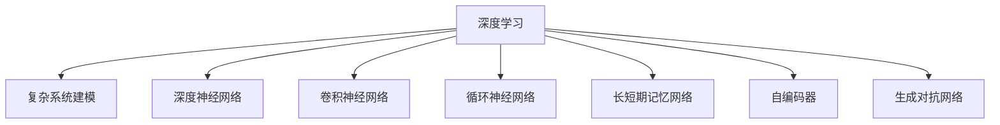

                 

## 1. 背景介绍

### 1.1 问题由来
近年来，深度学习在复杂系统建模领域的应用取得了显著进展。深度神经网络能够捕捉复杂数据中的高阶非线性关系，自动提取特征，为各类系统建模提供了新的视角和方法。这些模型在诸如交通流量预测、电力负荷分析、金融市场预测等复杂系统建模中展现出了强大的潜力。

然而，复杂系统建模面临着数据维度高、噪声干扰大、动态演化等特点，给模型的训练和泛化带来了巨大挑战。传统的统计和符号计算方法往往难以处理这些问题，而深度学习算法在处理大规模非结构化数据时显示出独特的优势。但随着模型规模的扩大，如何高效地训练深度神经网络，优化模型参数，以确保模型的泛化能力和鲁棒性，成为当务之急。

### 1.2 问题核心关键点
复杂系统建模的核心关键点包括：

1. **模型选择与构建**：选择合适的深度学习模型架构，并通过大量数据进行训练，以捕捉复杂系统中的动态特性和交互作用。
2. **参数优化**：在大量数据中，高效地训练模型，通过优化算法调节模型参数，以提高模型的泛化能力和鲁棒性。
3. **模型解释**：揭示模型内部的工作原理和决策逻辑，增强模型的可解释性和可信度。
4. **模型评估与优化**：利用评估指标和优化技术，确保模型性能满足实际应用需求。
5. **计算资源管理**：在高效利用计算资源的同时，优化模型训练和推理效率，适应不同应用场景。

### 1.3 问题研究意义
深度学习算法在复杂系统建模中的应用，为解决系统动态演化、数据噪声、高维度数据等问题提供了新的思路和方法。深度学习模型能够自动学习数据的分布特征，捕捉复杂系统中的非线性关系，从而在许多领域展现出强大的应用潜力。然而，复杂的系统建模问题对深度学习提出了更高的要求，需要不断进行模型优化和参数调节，以确保模型性能的稳定性和鲁棒性。

研究深度学习算法在复杂系统建模中的应用，不仅有助于提升系统建模的精度和效率，还能为复杂系统的动态行为预测和干预措施设计提供支持。这对于提升社会管理水平、促进科技进步、保障国家安全等方面具有重要意义。

## 2. 核心概念与联系

### 2.1 核心概念概述

为了更好地理解深度学习算法在复杂系统建模中的应用，本节将介绍几个关键核心概念：

- **深度学习(Deep Learning)**：通过多层神经网络对非线性关系进行建模，从数据中自动提取高级特征的机器学习方法。
- **复杂系统建模(Complex System Modeling)**：使用数学和计算方法对复杂系统行为进行描述和预测，涵盖诸如系统动力学、控制理论、统计学习方法等领域。
- **深度神经网络(Deep Neural Networks, DNNs)**：由多层神经元组成的非线性模型，能够捕捉数据中的高阶交互和复杂关系。
- **卷积神经网络(Convolutional Neural Networks, CNNs)**：适用于处理图像、视频等高维数据的深度学习模型。
- **循环神经网络(Recurrent Neural Networks, RNNs)**：适用于处理序列数据，能够捕捉时间序列上的动态变化。
- **长短期记忆网络(Long Short-Term Memory, LSTM)**：一种特殊的RNN结构，能够更好地处理长序列数据。
- **自编码器(Autoencoder)**：一种无监督学习算法，通过学习数据的低维表示进行数据压缩和重构。
- **生成对抗网络(Generative Adversarial Networks, GANs)**：通过两个对抗性网络的竞争，生成逼真的数据生成模型。

这些核心概念之间的逻辑关系可以通过以下Mermaid流程图来展示：



这个流程图展示了一个典型的深度学习应用框架：通过选择合适的深度神经网络结构，应用在复杂系统建模中，以解决实际问题。

## 3. 核心算法原理 & 具体操作步骤
### 3.1 算法原理概述

深度学习算法在复杂系统建模中的应用，基于对系统数据的分布特征进行建模，通过优化模型参数以适应系统动态变化。深度神经网络通过多层的非线性变换，捕捉数据的复杂特征和关系，从而在复杂系统建模中展现出优势。

形式化地，假设复杂系统中的观测数据为 $X=\{x_1, x_2, ..., x_n\}$，系统动态行为可由一个输出向量 $Y=\{y_1, y_2, ..., y_n\}$ 来表示。深度神经网络 $M_{\theta}$ 通过输入数据 $X$，经过多层非线性变换，输出系统行为 $Y$。模型的参数 $\theta$ 由大量的数据集 $D$ 进行训练，以最小化预测误差 $\epsilon$：

$$
\min_{\theta} \sum_{i=1}^n \epsilon(y_i, \hat{y_i})
$$

其中 $\epsilon$ 为损失函数，$\hat{y_i}$ 为模型预测输出。常用的损失函数包括均方误差、交叉熵等。

### 3.2 算法步骤详解

深度学习算法在复杂系统建模中的应用，通常包括以下关键步骤：

**Step 1: 数据预处理与特征提取**

- 收集复杂系统的大量观测数据 $X=\{x_1, x_2, ..., x_n\}$。
- 对数据进行清洗、归一化等预处理，去除噪声干扰。
- 设计合适的特征提取器，将原始数据转换为神经网络的输入形式，如将图像数据转换为像素值向量，将时间序列数据转换为矩阵等。

**Step 2: 构建深度神经网络模型**

- 选择合适的深度神经网络结构，如卷积神经网络、循环神经网络等。
- 定义神经网络的输入和输出维度，设置各层神经元的数量和激活函数。
- 设计合适的损失函数和优化器，如交叉熵损失、Adam优化器等。

**Step 3: 模型训练**

- 将预处理后的数据集 $D$ 划分为训练集、验证集和测试集。
- 在训练集上，利用优化器 $\nabla_{\theta}J$ 对模型参数 $\theta$ 进行梯度下降优化，以最小化损失函数 $J$。
- 在验证集上，评估模型的泛化能力，防止过拟合。
- 在测试集上，评估模型的预测精度，确保模型性能满足实际应用需求。

**Step 4: 模型优化与评估**

- 对模型结构进行调整，如增加或减少层数、调整神经元数量等。
- 使用正则化技术，如L2正则、Dropout等，避免过拟合。
- 引入集成学习技术，如Bagging、Boosting等，提升模型性能。
- 利用交叉验证等方法，评估模型的泛化能力和稳定性。

**Step 5: 应用部署与监控**

- 将训练好的模型部署到实际应用环境中，进行系统预测和动态行为监控。
- 实时采集系统数据，进行在线预测和模型更新。
- 监控模型性能和资源使用情况，及时调整模型参数和资源配置。

### 3.3 算法优缺点

深度学习算法在复杂系统建模中具有以下优点：

1. 自适应性强：能够自动学习数据的分布特征，捕捉复杂系统中的非线性关系。
2. 泛化能力强：在大规模数据上训练的模型，通常具有较强的泛化能力，能够适应未知数据的预测。
3. 处理高维数据能力强：适用于高维数据的建模和预测，如图像、文本等。
4. 并行计算性能好：利用GPU等加速设备，能够大幅提高模型的训练和推理效率。

同时，深度学习算法也存在以下缺点：

1. 需要大量数据：在大规模数据集上训练模型，需要大量的计算资源和时间。
2. 模型复杂度高：深度神经网络结构复杂，难以解释和调试。
3. 训练过程易过拟合：模型容易在训练集上过拟合，泛化能力下降。
4. 计算资源要求高：需要高性能计算设备和大量的内存和存储资源。

尽管存在这些局限性，但深度学习算法在复杂系统建模中的应用仍然展现出巨大的潜力，成为解决复杂系统问题的重要工具。未来相关研究的方向之一是提高模型的可解释性，优化模型的训练过程，以克服这些缺点。

### 3.4 算法应用领域

深度学习算法在复杂系统建模中的应用，涵盖了多个领域，包括但不限于：

1. **电力系统预测**：通过分析历史电力负荷数据，预测未来电力需求和系统状态，优化能源调度。
2. **交通流量预测**：基于历史交通数据，预测未来交通流量，优化交通控制和调度。
3. **金融市场预测**：分析历史金融数据，预测市场走势和风险，辅助投资决策。
4. **自然灾害预测**：通过气象数据和历史灾情数据，预测自然灾害发生概率和影响范围。
5. **工业生产预测**：分析生产数据，预测设备故障和生产效率，优化生产计划和资源配置。
6. **医疗健康监测**：利用患者数据，预测疾病发展和治疗效果，优化医疗决策和资源配置。
7. **城市环境监测**：分析城市环境数据，预测污染变化和资源分布，优化城市管理和规划。

这些应用领域涵盖了能源、交通、金融、医疗等多个关键领域，深度学习算法的应用，极大地提升了系统建模的精度和效率，为复杂系统管理和决策提供了重要支持。

## 4. 数学模型和公式 & 详细讲解  
### 4.1 数学模型构建

本节将使用数学语言对深度学习算法在复杂系统建模中的应用进行更加严格的刻画。

假设深度神经网络 $M_{\theta}$ 包含 $L$ 层，每层包含 $n_i$ 个神经元，其中输入层 $n_1$ 维，输出层 $n_L$ 维。神经元之间的连接权重为 $\theta_{ij} \in \mathbb{R}$，激活函数为 $f$。模型通过多层非线性变换，对输入数据 $X=\{x_1, x_2, ..., x_n\}$ 进行建模，输出系统行为 $Y=\{y_1, y_2, ..., y_n\}$。模型训练过程如下：

1. 定义损失函数 $J(\theta)$：衡量模型预测输出与真实标签之间的差异，如均方误差、交叉熵等。
2. 利用反向传播算法计算梯度 $\nabla_{\theta}J$。
3. 通过优化器 $\nabla_{\theta}J$ 更新模型参数 $\theta$。

以多层感知器为例，其数学模型如下：

$$
\begin{aligned}
\text{隐藏层 } h_i &= f(\sum_{j=1}^{n_{i-1}} \theta_{ij} x_j) \\
\text{输出层 } y_i &= f(\sum_{j=1}^{n_{i-1}} \theta_{ij} h_j)
\end{aligned}
$$

其中 $x_i$ 为输入数据，$y_i$ 为模型输出，$f$ 为激活函数，$\theta_{ij}$ 为连接权重。

### 4.2 公式推导过程

以多层感知器为例，其数学模型推导如下：

假设输入数据 $X=\{x_1, x_2, ..., x_n\}$，隐藏层神经元数为 $n_h$，输出层神经元数为 $n_y$。定义模型输出 $Y=\{y_1, y_2, ..., y_n\}$。

隐藏层的输出公式为：

$$
h_i = f(\sum_{j=1}^{n_x} \theta_{ij} x_j + b_i)
$$

其中 $f$ 为激活函数，$b_i$ 为偏置项。

输出层的输出公式为：

$$
y_i = f(\sum_{j=1}^{n_h} \theta_{ij} h_j + b_i)
$$

定义均方误差损失函数 $J$：

$$
J = \frac{1}{2n} \sum_{i=1}^n (y_i - \hat{y_i})^2
$$

其中 $\hat{y_i}$ 为模型预测输出。

利用反向传播算法计算梯度 $\nabla_{\theta}J$：

$$
\begin{aligned}
\frac{\partial J}{\partial \theta_{ij}} &= \frac{\partial J}{\partial y_i} \frac{\partial y_i}{\partial h_j} \frac{\partial h_j}{\partial \theta_{ij}} \\
&= (\hat{y_i} - y_i) \frac{\partial y_i}{\partial h_j} f'(h_j) \delta_{ij}
\end{aligned}
$$

其中 $f'$ 为激活函数的导数，$\delta_{ij}$ 为误差项。

通过梯度下降算法更新模型参数 $\theta$：

$$
\theta \leftarrow \theta - \eta \nabla_{\theta}J
$$

其中 $\eta$ 为学习率，$\nabla_{\theta}J$ 为损失函数对参数的梯度。

通过上述公式，可以完成深度神经网络在复杂系统建模中的训练过程。

### 4.3 案例分析与讲解

以交通流量预测为例，其数据通常包括时间、地点、车辆类型、道路状况等。通过深度神经网络模型，可以从历史数据中学习交通流量的动态特性和交互作用，预测未来的流量变化。

假设数据集 $D=\{(x_i, y_i)\}_{i=1}^N$，其中 $x_i$ 为输入数据（如时间、地点、车辆类型等），$y_i$ 为输出数据（如流量、速度等）。定义深度神经网络模型 $M_{\theta}$，其中 $L$ 为层数，$n_i$ 为每层神经元数量，$n_x$ 为输入层维度，$n_y$ 为输出层维度。

定义均方误差损失函数 $J$：

$$
J = \frac{1}{2N} \sum_{i=1}^N (y_i - \hat{y_i})^2
$$

利用反向传播算法计算梯度 $\nabla_{\theta}J$：

$$
\frac{\partial J}{\partial \theta_{ij}} = (\hat{y_i} - y_i) \frac{\partial y_i}{\partial h_j} f'(h_j) \delta_{ij}
$$

通过梯度下降算法更新模型参数 $\theta$：

$$
\theta \leftarrow \theta - \eta \nabla_{\theta}J
$$

通过训练好的模型 $M_{\theta}$，可以实时输入新数据进行预测，预测未来交通流量变化，辅助交通管理决策。

## 5. 项目实践：代码实例和详细解释说明
### 5.1 开发环境搭建

在进行深度学习算法应用开发前，需要准备好开发环境。以下是使用Python进行PyTorch开发的环境配置流程：

1. 安装Anaconda：从官网下载并安装Anaconda，用于创建独立的Python环境。

2. 创建并激活虚拟环境：
```bash
conda create -n pytorch-env python=3.8 
conda activate pytorch-env
```

3. 安装PyTorch：根据CUDA版本，从官网获取对应的安装命令。例如：
```bash
conda install pytorch torchvision torchaudio cudatoolkit=11.1 -c pytorch -c conda-forge
```

4. 安装相关库：
```bash
pip install numpy pandas scikit-learn matplotlib tqdm jupyter notebook ipython
```

完成上述步骤后，即可在`pytorch-env`环境中开始深度学习应用开发。

### 5.2 源代码详细实现

下面我们以电力负荷预测为例，给出使用PyTorch进行深度神经网络模型构建和训练的完整代码实现。

首先，定义电力负荷预测的数据处理函数：

```python
import pandas as pd
import numpy as np
from sklearn.preprocessing import MinMaxScaler
from torch.utils.data import Dataset
import torch

class LoadForecastDataset(Dataset):
    def __init__(self, data, seq_length):
        self.data = data
        self.scaler = MinMaxScaler()
        self.seq_length = seq_length
        
    def __len__(self):
        return len(self.data) - self.seq_length
    
    def __getitem__(self, item):
        x = self.data[item:item+self.seq_length]
        y = self.data[item+self.seq_length]
        
        x = np.array(x).reshape(-1, 1)
        y = np.array(y).reshape(-1, 1)
        x = self.scaler.fit_transform(x)
        y = self.scaler.fit_transform(y)
        
        x_tensor = torch.tensor(x, dtype=torch.float32)
        y_tensor = torch.tensor(y, dtype=torch.float32)
        return x_tensor, y_tensor

# 数据集划分
train_data = data[:train_end]
val_data = data[train_end:val_end]
test_data = data[val_end:]

# 定义数据集
train_dataset = LoadForecastDataset(train_data, seq_length)
val_dataset = LoadForecastDataset(val_data, seq_length)
test_dataset = LoadForecastDataset(test_data, seq_length)

# 定义模型参数
input_dim = 1
hidden_dim = 32
output_dim = 1
learning_rate = 0.001

# 定义神经网络模型
class LoadForecastNet(nn.Module):
    def __init__(self):
        super(LoadForecastNet, self).__init__()
        self.rnn = nn.LSTM(input_dim, hidden_dim)
        self.fc = nn.Linear(hidden_dim, output_dim)
        
    def forward(self, x):
        x = x.view(len(x), 1, -1)
        out, _ = self.rnn(x)
        out = self.fc(out)
        return out

# 定义优化器
optimizer = optim.Adam(model.parameters(), lr=learning_rate)

# 定义训练函数
def train(model, train_loader, optimizer, loss_fn):
    model.train()
    total_loss = 0
    for x, y in train_loader:
        optimizer.zero_grad()
        output = model(x)
        loss = loss_fn(output, y)
        loss.backward()
        optimizer.step()
        total_loss += loss.item()
    return total_loss / len(train_loader)

# 定义评估函数
def evaluate(model, val_loader, loss_fn):
    model.eval()
    total_loss = 0
    with torch.no_grad():
        for x, y in val_loader:
            output = model(x)
            loss = loss_fn(output, y)
            total_loss += loss.item()
    return total_loss / len(val_loader)

# 定义训练过程
epochs = 50
seq_length = 24

for epoch in range(epochs):
    train_loss = train(model, train_loader, optimizer, loss_fn)
    print(f"Epoch {epoch+1}, train loss: {train_loss:.4f}")
    
    val_loss = evaluate(model, val_loader, loss_fn)
    print(f"Epoch {epoch+1}, val loss: {val_loss:.4f}")
    
print("Test results:")
test_loss = evaluate(model, test_loader, loss_fn)
print(f"Test loss: {test_loss:.4f}")
```

在上述代码中，我们定义了数据预处理函数 `LoadForecastDataset`，用于将原始数据转换为神经网络的输入形式。

然后，我们定义了神经网络模型 `LoadForecastNet`，使用长短期记忆网络 (LSTM) 来捕捉时间序列数据的动态变化。

接着，我们定义了训练函数 `train` 和评估函数 `evaluate`，分别用于训练模型和评估模型在验证集上的性能。

最后，我们通过循环迭代训练模型，并在测试集上评估模型性能。

### 5.3 代码解读与分析

让我们再详细解读一下关键代码的实现细节：

**LoadForecastDataset类**：
- `__init__`方法：初始化数据集、数据缩放器、序列长度等关键组件。
- `__len__`方法：返回数据集的长度。
- `__getitem__`方法：对单个数据进行预处理，并将其转换为模型所需的输入形式。

**神经网络模型定义**：
- `LoadForecastNet`类：定义了神经网络模型结构，包括输入层、LSTM层和输出层。
- `forward`方法：定义模型的前向传播过程。

**训练和评估函数**：
- `train`函数：定义模型训练过程，利用优化器更新模型参数，并在训练集上计算损失。
- `evaluate`函数：定义模型评估过程，在验证集上计算损失，评估模型性能。

**训练流程**：
- 定义总的epoch数和序列长度，开始循环迭代
- 每个epoch内，在训练集上训练，输出训练集上的平均损失
- 在验证集上评估，输出验证集上的平均损失
- 所有epoch结束后，在测试集上评估，输出测试集上的平均损失

可以看到，PyTorch配合深度学习算法，使得模型构建和训练的代码实现变得简洁高效。开发者可以将更多精力放在数据处理、模型改进等高层逻辑上，而不必过多关注底层的实现细节。

当然，工业级的系统实现还需考虑更多因素，如模型的保存和部署、超参数的自动搜索、更灵活的任务适配层等。但核心的深度学习算法应用流程基本与此类似。

## 6. 实际应用场景
### 6.1 智能电网

基于深度学习算法在复杂系统建模中的应用，智能电网能够实现对电力负荷的动态预测和优化调度，提高电网的可靠性和效率。

深度神经网络可以分析历史电力负荷数据，预测未来的负荷变化，辅助电力调度。通过优化调度和资源配置，智能电网能够更好地应对负荷波动和突发事件，提升供电可靠性和稳定性。

### 6.2 智慧城市

深度学习算法在智慧城市中的应用，可以实现对城市环境的动态监测和优化管理。

通过深度神经网络，城市管理者可以分析交通流量、空气质量、公共安全等数据，预测城市环境的动态变化，优化资源配置和应急响应。例如，深度学习算法可以预测交通拥堵、优化交通信号灯控制，实现智能交通管理。

### 6.3 智能制造

深度学习算法在智能制造中的应用，可以实现对生产数据的动态分析和管理，提升生产效率和质量。

通过深度神经网络，智能制造系统可以分析设备状态、生产数据等，预测设备故障和生产效率变化，优化生产计划和资源配置。例如，深度学习算法可以预测设备故障、优化生产调度，实现智能生产管理。

### 6.4 金融风险控制

深度学习算法在金融领域的应用，可以实现对市场动态的预测和风险控制。

通过深度神经网络，金融系统可以分析历史交易数据，预测市场走势和风险，优化投资策略和风险管理。例如，深度学习算法可以预测股票价格、控制投资风险，实现智能投资管理。

## 7. 工具和资源推荐
### 7.1 学习资源推荐

为了帮助开发者系统掌握深度学习算法在复杂系统建模中的应用，这里推荐一些优质的学习资源：

1. 《深度学习》书籍：Ian Goodfellow等著，全面介绍了深度学习的基础理论和方法。
2. 《神经网络与深度学习》书籍：Michael Nielsen著，介绍了神经网络的基本原理和应用。
3. 《Deep Learning with PyTorch》书籍：Zhao Jun等著，详细介绍了PyTorch的使用方法和深度学习算法。
4. Coursera《深度学习专项课程》：由斯坦福大学Andrew Ng教授主讲，涵盖深度学习的基础理论和实际应用。
5. Udacity《深度学习纳米学位》：涵盖了深度学习的各个方面，包括基础理论、算法实现和应用案例。
6. PyTorch官方文档：详细介绍了PyTorch的使用方法和深度学习算法。

通过对这些资源的学习实践，相信你一定能够快速掌握深度学习算法在复杂系统建模中的应用，并用于解决实际的系统问题。
###  7.2 开发工具推荐

高效的开发离不开优秀的工具支持。以下是几款用于深度学习算法应用开发的常用工具：

1. PyTorch：基于Python的开源深度学习框架，灵活动态的计算图，适合快速迭代研究。大部分深度学习模型都有PyTorch版本的实现。
2. TensorFlow：由Google主导开发的开源深度学习框架，生产部署方便，适合大规模工程应用。同样有丰富的深度学习模型资源。
3. Keras：基于TensorFlow和Theano的高级神经网络API，易于使用，适合快速原型开发。
4. JAX：基于XLA的自动微分库，提供了高效的向量化计算和并行计算功能。
5. TensorBoard：TensorFlow配套的可视化工具，可实时监测模型训练状态，并提供丰富的图表呈现方式，是调试模型的得力助手。
6. Weights & Biases：模型训练的实验跟踪工具，可以记录和可视化模型训练过程中的各项指标，方便对比和调优。

合理利用这些工具，可以显著提升深度学习算法在复杂系统建模中的开发效率，加快创新迭代的步伐。

### 7.3 相关论文推荐

深度学习算法在复杂系统建模中的应用，源于学界的持续研究。以下是几篇奠基性的相关论文，推荐阅读：

1. AlexNet: ImageNet Classification with Deep Convolutional Neural Networks：提出卷积神经网络，用于图像分类任务。
2. LSTM: A Search Space Odyssey through Time Series Applications of Recurrent Neural Networks：提出长短期记忆网络，用于时间序列数据分析和预测。
3. VAE: Variational Autoencoder：提出变分自编码器，用于数据压缩和生成。
4. GANs: Generative Adversarial Nets：提出生成对抗网络，用于生成逼真的数据。
5. ResNet: Deep Residual Learning for Image Recognition：提出残差网络，解决深度网络训练中的梯度消失问题。
6. Transformer: Attention is All You Need：提出Transformer结构，用于自然语言处理任务。

这些论文代表了大规模深度学习算法的发展脉络。通过学习这些前沿成果，可以帮助研究者把握学科前进方向，激发更多的创新灵感。

## 8. 总结：未来发展趋势与挑战
### 8.1 总结

本文对深度学习算法在复杂系统建模中的应用进行了全面系统的介绍。首先阐述了深度学习算法在复杂系统建模中的研究背景和意义，明确了深度学习在处理复杂系统数据中的独特优势。其次，从原理到实践，详细讲解了深度神经网络模型的构建和训练过程，给出了深度学习算法在实际应用中的完整代码实现。同时，本文还探讨了深度学习算法在智能电网、智慧城市、智能制造、金融风险控制等领域的广泛应用，展示了深度学习算法的巨大潜力。

通过本文的系统梳理，可以看到，深度学习算法在复杂系统建模中的应用，已经取得了显著的进展，并在多个领域展现出广泛的应用前景。未来，随着深度学习技术的不断演进，其在复杂系统建模中的应用也将更加广泛和深入。

### 8.2 未来发展趋势

展望未来，深度学习算法在复杂系统建模中的应用将呈现以下几个发展趋势：

1. **多模态数据融合**：深度学习算法将能够处理更多模态的数据，如图像、语音、文本等，实现跨模态信息的协同建模。
2. **迁移学习和自监督学习**：深度学习算法将能够更好地利用无监督数据进行预训练和微调，提升模型的泛化能力和鲁棒性。
3. **模型压缩和加速**：深度学习算法将能够更好地压缩模型参数和优化计算图，实现高效推理和实时计算。
4. **可解释性增强**：深度学习算法将能够更好地解释模型的决策过程，增强系统的可解释性和可信度。
5. **联邦学习**：深度学习算法将能够实现分布式训练，保护数据隐私和安全。
6. **个性化学习**：深度学习算法将能够更好地实现个性化学习，提升用户体验和满意度。

以上趋势凸显了深度学习算法在复杂系统建模中的巨大潜力。这些方向的探索发展，必将进一步提升系统建模的精度和效率，为复杂系统管理和决策提供更加可靠的技术支持。

### 8.3 面临的挑战

尽管深度学习算法在复杂系统建模中取得了显著进展，但仍面临诸多挑战：

1. **数据获取与标注**：深度学习算法需要大量高质量的数据进行训练，数据获取和标注成本较高。
2. **模型复杂度**：深度神经网络结构复杂，难以解释和调试。
3. **计算资源要求高**：深度学习算法需要高性能计算设备和大量的内存和存储资源。
4. **过拟合问题**：深度学习算法容易在训练集上过拟合，泛化能力下降。
5. **数据隐私和安全**：深度学习算法需要处理敏感数据，数据隐私和安全问题需高度重视。

尽管存在这些挑战，但深度学习算法在复杂系统建模中的广泛应用已初步证明其有效性。未来研究应聚焦于如何优化深度学习算法，克服这些挑战，实现更加高效、可解释、安全的复杂系统建模。

### 8.4 研究展望

面对深度学习算法在复杂系统建模中面临的挑战，未来的研究需要在以下几个方面寻求新的突破：

1. **数据增强与预处理**：优化数据增强技术，提高数据获取和标注的效率，提升数据质量。
2. **模型压缩与加速**：开发更加高效的深度学习算法，压缩模型参数和优化计算图，实现高效推理和实时计算。
3. **可解释性与鲁棒性**：增强深度学习算法的可解释性和鲁棒性，提升系统的可信度和安全性。
4. **分布式与联邦学习**：实现分布式深度学习算法，保护数据隐私和安全，提升系统可扩展性。
5. **跨模态与个性化学习**：探索跨模态深度学习算法，实现不同模态数据的协同建模，提升系统的个性化学习能力。

这些研究方向的发展，必将进一步提升深度学习算法在复杂系统建模中的应用效果，为解决复杂的系统问题提供更加高效、可解释、安全的解决方案。未来，深度学习算法必将在复杂系统建模中发挥更大的作用，推动人工智能技术在各个领域的深入应用和发展。

## 9. 附录：常见问题与解答
**Q1：深度学习算法在复杂系统建模中需要处理哪些数据类型？**

A: 深度学习算法在复杂系统建模中需要处理多种数据类型，包括但不限于：

1. **时间序列数据**：如电力负荷、交通流量、气温变化等。
2. **图像和视频数据**：如监控摄像头采集的视频、卫星图像等。
3. **文本数据**：如社交媒体评论、新闻文章、技术文档等。
4. **传感器数据**：如物联网设备采集的传感器数据。

这些数据类型在复杂系统建模中有着广泛的应用，深度学习算法能够有效地处理和分析这些数据，提取高阶特征和动态关系。

**Q2：深度学习算法在复杂系统建模中常用的神经网络结构有哪些？**

A: 深度学习算法在复杂系统建模中常用的神经网络结构包括但不限于：

1. **卷积神经网络(CNNs)**：适用于处理图像、视频等高维数据的深度学习模型。
2. **循环神经网络(RNNs)**：适用于处理序列数据，能够捕捉时间序列上的动态变化。
3. **长短期记忆网络(LSTM)**：一种特殊的RNN结构，能够更好地处理长序列数据。
4. **自编码器(Autoencoder)**：一种无监督学习算法，通过学习数据的低维表示进行数据压缩和重构。
5. **生成对抗网络(GANs)**：通过两个对抗性网络的竞争，生成逼真的数据生成模型。
6. **Transformer**：用于自然语言处理任务，能够捕捉长距离依赖关系。

这些神经网络结构在复杂系统建模中有着广泛的应用，能够适应不同的数据类型和任务需求。

**Q3：深度学习算法在复杂系统建模中常用的优化算法有哪些？**

A: 深度学习算法在复杂系统建模中常用的优化算法包括但不限于：

1. **梯度下降法(Gradient Descent)**：最基本的优化算法，通过计算损失函数的梯度更新模型参数。
2. **随机梯度下降法(Stochastic Gradient Descent, SGD)**：在每个训练样本上计算梯度，更新模型参数。
3. **Adam优化器**：结合了动量优化和自适应学习率调整，适用于大规模深度学习模型的优化。
4. **Adagrad优化器**：自适应调整每个参数的学习率，适用于稀疏梯度数据的优化。
5. **Adadelta优化器**：自适应调整学习率，适用于动态数据流的优化。

这些优化算法在深度学习模型的训练过程中起到关键作用，能够提高模型的训练效率和收敛速度。

**Q4：深度学习算法在复杂系统建模中如何处理过拟合问题？**

A: 深度学习算法在复杂系统建模中处理过拟合问题的方法包括但不限于：

1. **数据增强**：通过回译、旋转、裁剪等方法扩充训练集，提高模型的泛化能力。
2. **正则化技术**：使用L2正则、Dropout等方法，防止模型过度拟合训练集。
3. **提前停止**：监控验证集的性能，当验证集性能不再提升时，提前停止训练。
4. **集成学习**：通过多个模型的集成，减少单个模型的过拟合风险。
5. **模型简化**：减少模型的层数、神经元数量等，降低模型的复杂度。

这些方法能够有效减少过拟合风险，提升深度学习算法的泛化能力和鲁棒性。

**Q5：深度学习算法在复杂系统建模中的计算资源管理有哪些策略？**

A: 深度学习算法在复杂系统建模中的计算资源管理策略包括但不限于：

1. **模型裁剪**：去除不必要的层和参数，减小模型尺寸，加快推理速度。
2. **量化加速**：将浮点模型转为定点模型，压缩存储空间，提高计算效率。
3. **模型并行**：将模型划分为多个子模型，并行计算，提高计算速度。
4. **混合精度训练**：使用混合精度技术，加速模型训练。
5. **GPU和TPU优化**：利用高性能计算设备，加速模型训练和推理。

这些策略能够有效提高深度学习算法的计算效率和资源利用率，适应不同的计算环境。

---

作者：禅与计算机程序设计艺术 / Zen and the Art of Computer Programming

