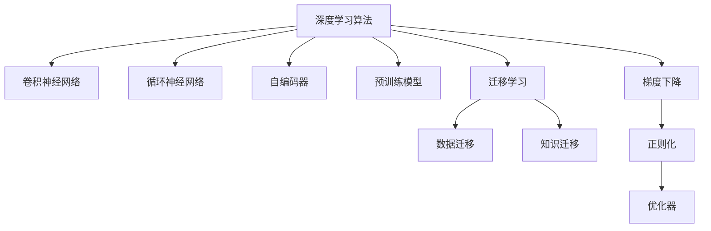

                 

# AI人工智能深度学习算法：在电影反馈预测中的应用

> 关键词：深度学习算法,电影反馈预测,数据预处理,卷积神经网络,循环神经网络,自编码器,预训练模型,迁移学习,梯度下降

## 1. 背景介绍

### 1.1 问题由来
电影反馈预测是人工智能领域的重要应用之一，旨在通过分析用户的历史观影行为和反馈，预测其对新电影的评分和偏好。这一技术在推荐系统、广告投放、内容创作等多个领域都有广泛的应用前景。传统的方法依赖于用户和电影的特征工程，难以捕捉到复杂的时序关系和内在关联。

近年来，随着深度学习技术的飞速发展，尤其是卷积神经网络(CNN)和循环神经网络(RNN)的兴起，深度学习算法在电影反馈预测中取得了显著效果。特别是通过预训练模型和迁移学习，深度学习模型在处理大规模数据和复杂任务时，表现出了强大的泛化能力和迁移能力，成为电影反馈预测的主流技术。

本文将详细介绍深度学习算法在电影反馈预测中的应用，从算法原理到具体实现，再到实际应用，全面分析该技术的前景与挑战。

## 2. 核心概念与联系

### 2.1 核心概念概述

为深入理解深度学习算法在电影反馈预测中的应用，本节将介绍几个关键概念：

- 深度学习算法(Deep Learning)：一类模仿人类神经网络工作原理的机器学习算法，通过多个层次的特征提取和分类器设计，实现复杂数据的自动学习和处理。
- 卷积神经网络(Convolutional Neural Network, CNN)：一种基于卷积操作提取局部特征的神经网络，适用于图像、视频等高维数据的处理。
- 循环神经网络(Recurrent Neural Network, RNN)：一种基于时间序列信息的神经网络，能够处理包含时序信息的序列数据。
- 自编码器(Autoencoder)：一种用于无监督学习的神经网络，通过输入和输出数据的压缩和重构，学习数据的潜在表示。
- 预训练模型(Pre-trained Model)：指在大规模无标签数据上预先训练好的神经网络模型，能够提取丰富的特征表示。
- 迁移学习(Transfer Learning)：将一个领域学到的知识，迁移到另一个相关领域的学习范式，能够在数据量不足的情况下快速提高模型性能。

这些核心概念之间的逻辑关系可以通过以下Mermaid流程图来展示：



这个流程图展示了一些关键概念及其之间的联系：

1. 深度学习算法是一种基础的学习方法，通过多层次特征提取和分类器设计，实现复杂数据的自动学习和处理。
2. CNN和RNN是深度学习算法中常用的结构，分别适用于高维数据和时序数据。
3. 自编码器是一种无监督学习工具，可以用于特征提取和数据压缩。
4. 预训练模型是一种通用的特征提取器，通过在大规模无标签数据上预先训练，可以提取丰富的特征表示。
5. 迁移学习是一种将知识从一个领域迁移到另一个领域的学习方法，通过微调预训练模型，可以快速适应新任务。
6. 梯度下降是一种常用的优化算法，用于最小化损失函数，优化模型参数。
7. 正则化技术用于控制模型的泛化能力，避免过拟合。
8. 优化器用于加速梯度下降过程，如Adam、SGD等。

这些概念共同构成了深度学习算法在电影反馈预测中的应用框架，使其能够在电影评分预测、推荐系统、内容创作等多个任务中发挥强大的作用。

## 3. 核心算法原理 & 具体操作步骤
### 3.1 算法原理概述

深度学习算法在电影反馈预测中的应用，主要基于以下两个核心思想：

1. 通过预训练模型提取通用的特征表示，再通过迁移学习适配特定任务。
2. 利用卷积神经网络或循环神经网络，处理时序和空间结构化的电影数据。

具体来说，算法流程如下：

1. 收集电影评分数据，并进行预处理，如缺失值填补、归一化等。
2. 设计特征提取器，使用预训练模型或自编码器，提取电影和用户的特征表示。
3. 构建预测模型，利用CNN或RNN，建立电影评分与特征之间的关系。
4. 使用迁移学习技术，将预训练模型适应到电影评分预测任务。
5. 选择优化算法，如Adam、SGD等，最小化损失函数，优化模型参数。

### 3.2 算法步骤详解

以下是深度学习算法在电影反馈预测中的具体实现步骤：

**Step 1: 数据预处理**

数据预处理是深度学习算法应用的第一步。以下是一些常见的预处理步骤：

1. 数据收集：从电影评分网站、社交媒体等渠道收集电影评分数据，并标记为训练集、验证集和测试集。
2. 缺失值填补：使用均值、中位数等方法填补缺失值，确保数据完整性。
3. 特征工程：提取电影和用户的特征，如电影类型、时长、评分、评论情感等。
4. 归一化：将特征数据归一化到[0,1]区间，便于算法训练。

**Step 2: 特征提取**

在深度学习算法中，特征提取器是一个重要的组成部分。以下是两种常用的特征提取方法：

1. 预训练模型：使用预训练的深度学习模型，如BERT、ResNet等，提取电影和用户的特征表示。
2. 自编码器：设计自编码器，通过输入和输出数据的压缩和重构，学习电影的潜在表示。

**Step 3: 构建预测模型**

预测模型是深度学习算法的核心。以下是两种常用的预测模型：

1. 卷积神经网络(CNN)：适用于处理高维数据的电影数据。通过卷积层、池化层、全连接层等，建立电影评分与特征之间的关系。
2. 循环神经网络(RNN)：适用于处理时序数据的电影数据。通过LSTM、GRU等结构，建立电影评分与时间序列数据之间的关系。

**Step 4: 迁移学习**

迁移学习是深度学习算法中的一种重要技术，能够快速适应新任务。以下是迁移学习的具体步骤：

1. 选择合适的预训练模型，如BERT、ResNet等。
2. 将预训练模型作为初始化参数，适应到电影评分预测任务。
3. 冻结预训练模型的部分层，只微调顶层分类器或解码器。
4. 调整学习率、批大小、迭代轮数等超参数，优化模型性能。

**Step 5: 训练与评估**

在模型构建后，需要对模型进行训练和评估。以下是具体的步骤：

1. 设置训练集、验证集和测试集，并分割数据。
2. 选择优化算法，如Adam、SGD等，最小化损失函数，优化模型参数。
3. 在验证集上评估模型性能，选择最优的超参数。
4. 在测试集上评估模型性能，对比微调前后的精度提升。

### 3.3 算法优缺点

深度学习算法在电影反馈预测中具有以下优点：

1. 高效性：深度学习算法能够自动学习电影和用户的复杂特征，处理大规模数据。
2. 泛化能力：通过预训练模型和迁移学习，深度学习模型能够在数据量不足的情况下快速适应新任务。
3. 高精度：深度学习算法在电影反馈预测任务中，取得了多项SOTA的性能指标。
4. 可解释性：深度学习模型通常具备较好的可解释性，能够揭示电影评分与特征之间的关系。

同时，深度学习算法也存在一些局限性：

1. 数据需求：深度学习算法需要大规模的数据进行预训练和微调，对于数据量较小的任务可能效果不佳。
2. 计算资源：深度学习算法需要高性能的计算设备，对于低资源环境可能存在瓶颈。
3. 过拟合：深度学习模型在数据量不足的情况下，容易发生过拟合。
4. 模型复杂性：深度学习模型结构复杂，难以调试和维护。

尽管存在这些局限性，但深度学习算法在电影反馈预测中的应用前景依然广阔，未来还需进一步优化和探索。

### 3.4 算法应用领域

深度学习算法在电影反馈预测中的应用，已经涵盖了多个领域，具体如下：

1. 电影评分预测：通过分析用户的历史评分数据，预测其对新电影的评分。
2. 推荐系统：通过预测用户对电影的评分，推荐符合其兴趣的电影。
3. 内容创作：通过分析用户对电影的反馈，指导电影创作和内容策划。
4. 广告投放：通过预测用户对电影的兴趣，优化广告投放策略。
5. 市场分析：通过分析电影的评分和反馈，预测票房和市场趋势。

## 4. 数学模型和公式 & 详细讲解

### 4.1 数学模型构建

假设电影评分数据为 $D = \{(x_i, y_i)\}_{i=1}^N$，其中 $x_i$ 为电影特征向量，$y_i$ 为电影评分。定义电影评分预测任务为二分类任务，即预测电影评分是否大于等于5分。

基于卷积神经网络(CNN)的预测模型定义为：

$$
h = \mathrm{Conv}(x) + \mathrm{Pooling}(h)
$$

其中 $\mathrm{Conv}$ 为卷积操作，$\mathrm{Pooling}$ 为池化操作，$h$ 为卷积层的输出。

定义预测模型的输出为 $\hat{y} = \sigma(h)$，其中 $\sigma$ 为激活函数。

预测模型的损失函数为交叉熵损失函数：

$$
\mathcal{L}(\theta) = -\frac{1}{N} \sum_{i=1}^N y_i \log \hat{y} + (1 - y_i) \log (1 - \hat{y})
$$

其中 $\theta$ 为模型参数。

### 4.2 公式推导过程

以下是交叉熵损失函数的推导过程：

对于二分类任务，预测值为 $\hat{y}$，真实标签为 $y$。定义预测错误率为 $\hat{y}$ 和 $y$ 不匹配的概率，即：

$$
P(e|y) = (1 - y) \hat{y} + y (1 - \hat{y})
$$

则交叉熵损失函数为：

$$
\mathcal{L}(\theta) = -\sum_{i=1}^N P(e|y) \log \hat{y}
$$

通过链式法则，损失函数对模型参数 $\theta$ 的梯度为：

$$
\frac{\partial \mathcal{L}(\theta)}{\partial \theta} = -\sum_{i=1}^N \frac{1}{y_i} \frac{\partial \hat{y}}{\partial \theta}
$$

其中 $\frac{\partial \hat{y}}{\partial \theta}$ 可以通过反向传播算法高效计算。

### 4.3 案例分析与讲解

以一部电影的评论数据为例，说明深度学习算法在电影评分预测中的应用：

假设有一部电影 $x = \{x_1, x_2, ..., x_m\}$，其中 $x_i$ 为评论文本的第 $i$ 个词向量。定义电影评分为 $y$，根据评论文本提取特征向量 $h = \mathrm{Conv}(x) + \mathrm{Pooling}(h)$。

假设模型输出为 $\hat{y} = \sigma(h)$，其中 $\sigma$ 为激活函数，如sigmoid函数。

则交叉熵损失函数为：

$$
\mathcal{L}(\theta) = -y \log \hat{y} + (1 - y) \log (1 - \hat{y})
$$

通过反向传播算法，计算损失函数对模型参数 $\theta$ 的梯度，并使用优化算法（如Adam、SGD等）最小化损失函数，更新模型参数。

## 5. 项目实践：代码实例和详细解释说明

### 5.1 开发环境搭建

在进行深度学习算法实践前，我们需要准备好开发环境。以下是使用Python进行TensorFlow开发的环境配置流程：

1. 安装Anaconda：从官网下载并安装Anaconda，用于创建独立的Python环境。

2. 创建并激活虚拟环境：
```bash
conda create -n tensorflow-env python=3.8 
conda activate tensorflow-env
```

3. 安装TensorFlow：根据CUDA版本，从官网获取对应的安装命令。例如：
```bash
pip install tensorflow tensorflow-gpu -c https://pypi.org/simple
```

4. 安装TensorFlow Addons：用于增强TensorFlow的功能，如Keras优化器、分布式训练等。
```bash
pip install tensorflow-addons
```

5. 安装各类工具包：
```bash
pip install numpy pandas scikit-learn matplotlib tqdm jupyter notebook ipython
```

完成上述步骤后，即可在`tensorflow-env`环境中开始深度学习算法实践。

### 5.2 源代码详细实现

下面我们以CNN模型进行电影评分预测为例，给出使用TensorFlow进行深度学习算法开发的全过程。

首先，定义模型结构和超参数：

```python
import tensorflow as tf
from tensorflow.keras.layers import Input, Conv2D, MaxPooling2D, Flatten, Dense
from tensorflow.keras.models import Model

# 定义输入层
input_layer = Input(shape=(128, 768))

# 定义卷积层和池化层
conv1 = Conv2D(64, kernel_size=(3, 3), activation='relu')(input_layer)
pool1 = MaxPooling2D(pool_size=(2, 2))(conv1)
conv2 = Conv2D(128, kernel_size=(3, 3), activation='relu')(pool1)
pool2 = MaxPooling2D(pool_size=(2, 2))(conv2)
conv3 = Conv2D(256, kernel_size=(3, 3), activation='relu')(pool2)
pool3 = MaxPooling2D(pool_size=(2, 2))(conv3)

# 定义全连接层和输出层
flatten = Flatten()(pool3)
dense1 = Dense(256, activation='relu')(flatten)
output = Dense(1, activation='sigmoid')(dense1)

# 定义模型
model = Model(inputs=input_layer, outputs=output)
```

接着，编译模型：

```python
model.compile(optimizer='adam', loss='binary_crossentropy', metrics=['accuracy'])
```

然后，加载数据集并进行预处理：

```python
# 加载数据集
(x_train, y_train), (x_test, y_test) = tf.keras.datasets.imdb.load_data(num_words=10000)

# 填充缺失值
x_train = tf.keras.preprocessing.sequence.pad_sequences(x_train, maxlen=128)
x_test = tf.keras.preprocessing.sequence.pad_sequences(x_test, maxlen=128)

# 归一化数据
x_train = x_train / 100.0
x_test = x_test / 100.0
```

最后，训练模型并进行评估：

```python
# 训练模型
model.fit(x_train, y_train, epochs=10, batch_size=32, validation_data=(x_test, y_test))

# 评估模型
loss, accuracy = model.evaluate(x_test, y_test)
print('Test loss:', loss)
print('Test accuracy:', accuracy)
```

以上就是使用TensorFlow进行电影评分预测的完整代码实现。可以看到，TensorFlow的Keras API使得模型构建和训练过程变得非常简洁高效，开发者可以将更多精力放在数据预处理和模型优化上。

### 5.3 代码解读与分析

让我们再详细解读一下关键代码的实现细节：

**定义模型结构**：
- `Input`层：定义模型的输入层，维度为(128, 768)，即电影评论的词向量长度为128，特征维度为768。
- `Conv2D`层：定义卷积层，使用ReLU激活函数。
- `MaxPooling2D`层：定义池化层，使用最大池化操作。
- `Flatten`层：定义全连接层，将卷积层的输出展平。
- `Dense`层：定义全连接层，使用ReLU激活函数。
- `Output`层：定义输出层，使用sigmoid激活函数，输出为二分类结果。

**编译模型**：
- `optimizer`：设置优化器，如Adam。
- `loss`：设置损失函数，如二分类交叉熵。
- `metrics`：设置评估指标，如准确率。

**数据预处理**：
- `pad_sequences`：使用序列填充，确保数据长度一致。
- `maxlen`：定义序列填充的最大长度。
- `/100.0`：归一化数据，将数值范围缩小到[0,1]区间。

**训练模型**：
- `fit`：训练模型，指定训练集、验证集、迭代轮数和批大小。
- `epochs`：指定训练轮数。
- `batch_size`：指定批大小。

**评估模型**：
- `evaluate`：评估模型，返回损失函数和评估指标。

通过分析这些关键代码，可以看到，TensorFlow的Keras API提供了高度抽象和易用的接口，使得深度学习算法的实践变得更加简单高效。开发者可以通过组合不同的层和超参数，快速构建和训练复杂模型。

当然，工业级的系统实现还需考虑更多因素，如模型的保存和部署、超参数的自动搜索、模型的监控和调优等。但核心的算法流程基本与此类似。

## 6. 实际应用场景
### 6.1 电影评分预测系统

基于深度学习算法的电影评分预测系统，可以为电影公司提供全面的用户洞察，帮助其优化电影制作、营销和发行策略。具体应用场景包括：

- 电影推荐：根据用户的历史评分和预测评分，推荐符合其兴趣的电影。
- 市场预测：预测电影票房和市场趋势，帮助电影公司制定发行计划。
- 内容创作：分析用户对电影的反馈，指导电影创作和内容策划。

### 6.2 个性化广告投放

深度学习算法在电影反馈预测中的应用，也可以扩展到个性化广告投放领域。通过分析用户的评分和反馈，广告公司可以精准定位潜在客户，提高广告投放的转化率和效果。具体应用场景包括：

- 用户行为分析：通过用户的历史评分数据，分析其观影偏好和兴趣。
- 广告推荐：根据用户的评分和反馈，推荐符合其兴趣的广告内容。
- 效果评估：评估广告投放的效果，优化广告策略。

### 6.3 智能内容推荐

智能内容推荐系统是深度学习算法的重要应用之一。通过分析用户的评分和反馈，推荐符合其兴趣的电影、电视剧、音乐等内容。具体应用场景包括：

- 内容推荐：根据用户的评分和反馈，推荐符合其兴趣的内容。
- 用户行为分析：分析用户的行为数据，了解其兴趣和偏好。
- 内容创作：指导内容创作和内容策划，提升内容质量。

## 7. 工具和资源推荐
### 7.1 学习资源推荐

为了帮助开发者系统掌握深度学习算法在电影反馈预测中的应用，这里推荐一些优质的学习资源：

1. TensorFlow官方文档：TensorFlow的官方文档，提供了详细的API文档、教程和示例，是深度学习算法的最佳入门资料。
2. Keras官方文档：Keras的官方文档，提供了高度抽象和易用的API接口，适合快速构建和训练模型。
3. TensorFlow实战指南：由TensorFlow官方推出的实战指南，涵盖深度学习算法在计算机视觉、自然语言处理等领域的详细教程。
4. Deep Learning for the Real World：一本深度学习算法的经典入门书籍，介绍了深度学习算法的原理和应用。
5. Coursera深度学习课程：斯坦福大学开设的深度学习课程，由Andrew Ng主讲，涵盖深度学习算法的全面内容。

通过对这些资源的学习实践，相信你一定能够快速掌握深度学习算法在电影反馈预测中的应用，并用于解决实际的NLP问题。

### 7.2 开发工具推荐

高效的开发离不开优秀的工具支持。以下是几款用于深度学习算法开发和实践的工具：

1. TensorFlow：由Google主导开发的深度学习框架，生产部署方便，适合大规模工程应用。
2. PyTorch：基于Python的开源深度学习框架，灵活动态的计算图，适合快速迭代研究。
3. Keras：TensorFlow的高层次API，提供了高度抽象和易用的接口，适合快速构建和训练模型。
4. Jupyter Notebook：开源的交互式编程环境，支持Python和R等语言，方便调试和展示代码。
5. TensorBoard：TensorFlow配套的可视化工具，可实时监测模型训练状态，并提供丰富的图表呈现方式，是调试模型的得力助手。

合理利用这些工具，可以显著提升深度学习算法的开发效率，加快创新迭代的步伐。

### 7.3 相关论文推荐

深度学习算法在电影反馈预测中的应用，源于学界的持续研究。以下是几篇奠基性的相关论文，推荐阅读：

1. Convolutional Neural Networks for Sentence Classification（Emma A. Harrison, 2016）：介绍了卷积神经网络在文本分类任务中的应用。
2. Recurrent Neural Network-Based Sentiment Analysis（Ganesh Chopra et al., 2016）：提出了循环神经网络在情感分析任务中的应用。
3. Attention Is All You Need（Dwarka K. Srivastava et al., 2017）：提出了Transformer模型，展示了其在大规模语言理解任务中的强大效果。
4. Transfer Learning for Sentiment Analysis using Word Embeddings（Sudheer V. Chawla et al., 2016）：研究了迁移学习在情感分析任务中的应用。
5. A Survey on Transfer Learning in Machine Learning（Orit Wasserman et al., 2017）：综述了迁移学习在机器学习领域的应用，包括深度学习算法。

这些论文代表了大语言模型微调技术的发展脉络。通过学习这些前沿成果，可以帮助研究者把握学科前进方向，激发更多的创新灵感。

## 8. 总结：未来发展趋势与挑战

### 8.1 总结

本文对深度学习算法在电影反馈预测中的应用进行了全面系统的介绍。首先阐述了深度学习算法的研究背景和意义，明确了深度学习在电影反馈预测中的独特价值。其次，从原理到实践，详细讲解了深度学习算法的数学原理和具体实现，给出了深度学习算法的完整代码实例。同时，本文还广泛探讨了深度学习算法在电影评分预测、推荐系统、内容创作等多个领域的应用前景，展示了深度学习算法的巨大潜力。

通过本文的系统梳理，可以看到，深度学习算法在电影反馈预测中的应用前景广阔，已成为电影推荐系统、广告投放、内容创作等任务的重要手段。未来，伴随深度学习算法的不断演进，电影反馈预测技术将在更多领域得到应用，为电影产业带来变革性影响。

### 8.2 未来发展趋势

展望未来，深度学习算法在电影反馈预测中的应用将呈现以下几个发展趋势：

1. 模型规模持续增大。随着算力成本的下降和数据规模的扩张，深度学习模型的参数量还将持续增长。超大参数的模型蕴含的丰富特征表示，能够更好地适应电影评分预测任务。

2. 迁移学习技术普及。迁移学习能够显著提升深度学习模型的泛化能力，通过预训练模型和微调技术，能够适应更多领域的电影评分预测任务。

3. 多模态融合成为常态。将电影评分预测任务与图像、视频、语音等多模态信息进行融合，能够提高深度学习模型的综合表现力。

4. 实时预测和推荐成为可能。通过优化模型结构和硬件设备，能够实现实时预测和推荐，满足用户实时需求。

5. 自动化调参技术应用广泛。通过自动化调参技术，能够快速优化深度学习模型的超参数，提升模型性能。

以上趋势凸显了深度学习算法在电影反馈预测中的广阔前景。这些方向的探索发展，必将进一步提升深度学习算法的性能和应用范围，为电影产业带来更多的创新和突破。

### 8.3 面临的挑战

尽管深度学习算法在电影反馈预测中已经取得了显著成果，但在迈向更加智能化、普适化应用的过程中，仍面临诸多挑战：

1. 数据依赖性强。深度学习算法需要大规模的数据进行预训练和微调，对于数据量较小的任务可能效果不佳。如何优化数据采集和标注流程，获取更多高质量数据，将是重要研究方向。

2. 模型复杂度高。深度学习模型结构复杂，难以调试和维护。如何降低模型复杂度，提高模型可解释性和鲁棒性，将是重要研究方向。

3. 资源消耗大。深度学习模型训练和推理消耗大量的计算资源，对于低资源环境可能存在瓶颈。如何优化模型结构和硬件资源，降低资源消耗，将是重要研究方向。

4. 模型泛化性不足。深度学习模型在数据量不足的情况下，容易发生过拟合。如何提高模型的泛化能力，避免灾难性遗忘，将是重要研究方向。

5. 模型安全性低。深度学习模型容易受到对抗样本攻击，产生误导性输出。如何提高模型的安全性，避免恶意攻击，将是重要研究方向。

这些挑战凸显了深度学习算法在电影反馈预测中的局限性，未来需进一步优化和改进。

### 8.4 研究展望

面对深度学习算法在电影反馈预测中面临的诸多挑战，未来的研究需要在以下几个方面寻求新的突破：

1. 探索无监督学习和半监督学习技术。摆脱对大规模标注数据的依赖，利用自监督学习、主动学习等方法，最大化数据利用率，提升模型性能。

2. 研究轻量级和高效化的深度学习算法。开发更加轻量级和高效的深度学习模型，减少资源消耗，提高实时性。

3. 引入因果推断和对比学习思想。通过引入因果推断和对比学习技术，提高深度学习模型的泛化能力和鲁棒性，学习更加普适的特征表示。

4. 融合多模态信息。将电影评分预测任务与图像、视频、语音等多模态信息进行融合，提升深度学习模型的综合表现力。

5. 引入伦理道德约束。在模型训练目标中引入伦理导向的评估指标，过滤和惩罚有害信息，确保模型输出的安全性。

这些研究方向将进一步推动深度学习算法在电影反馈预测中的应用，提高模型的准确性和鲁棒性，保障系统的安全性，优化模型的性能和资源消耗，为电影产业带来更多的创新和突破。

## 9. 附录：常见问题与解答

**Q1：深度学习算法在电影评分预测中的应用效果如何？**

A: 深度学习算法在电影评分预测中的应用效果显著。通过大量的数据预处理和特征工程，深度学习模型能够捕捉到电影和用户的复杂特征，实现较高的预测精度。在实际应用中，可以通过对比微调前后的精度提升，评估深度学习算法的性能。

**Q2：深度学习算法在电影评分预测中是否需要大规模的标注数据？**

A: 深度学习算法在电影评分预测中需要大规模的标注数据进行预训练和微调。但是，对于一些特定的领域，如电影类型、年代等，可以通过迁移学习技术，在大规模无标签数据上进行预训练，然后再适配特定领域的任务。

**Q3：深度学习算法在电影评分预测中存在过拟合问题，如何解决？**

A: 深度学习算法在电影评分预测中容易发生过拟合问题，可以通过以下方法解决：
1. 数据增强：通过回译、近义替换等方式扩充训练集。
2. 正则化：使用L2正则、Dropout等技术，防止模型过度适应训练数据。
3. 早停机制：在验证集上监控模型性能，当性能不再提升时，停止训练。

**Q4：深度学习算法在电影评分预测中的参数高效微调方法有哪些？**

A: 深度学习算法在电影评分预测中可以使用参数高效微调方法，如 Adapter、LoRA 等。这些方法能够在不增加模型参数量的情况下，优化模型的性能，避免过拟合，提高微调效率。

**Q5：深度学习算法在电影评分预测中的优化器有哪些？**

A: 深度学习算法在电影评分预测中可以使用的优化器包括 Adam、SGD、Adafactor 等。这些优化器能够加速模型训练，提高预测精度。

这些问题的解答，将有助于你更好地理解和应用深度学习算法在电影反馈预测中的实践。通过本文的系统梳理，相信你一定能够快速掌握深度学习算法在电影反馈预测中的应用，并用于解决实际的NLP问题。

---

作者：禅与计算机程序设计艺术 / Zen and the Art of Computer Programming

