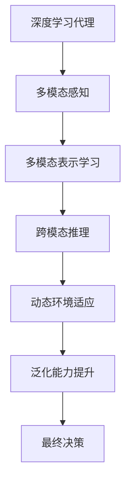

                 

# AI人工智能深度学习算法：深度学习代理的多模态感知与处理能力

## 1. 背景介绍

### 1.1 问题由来

在当前智能信息处理领域，深度学习代理（Deep Learning Agents）正逐渐成为推动智能决策和自动化的核心力量。这类模型能够高效地利用大量数据进行自主学习，以适应不同的环境和任务，从而在智能推荐、机器人控制、自然语言处理等诸多领域取得了显著成效。然而，深度学习代理在处理复杂、动态的现实世界问题时，仍然面临诸多挑战，例如环境噪声、输入数据的多模态特性、长期记忆等。

针对上述挑战，研究人员提出并验证了多模态感知与处理技术，以帮助代理更好地理解和适应多模态数据（例如文本、图像、音频等），从而提升其决策和处理能力。本文将详细介绍基于深度学习代理的多模态感知与处理技术，涵盖数学模型、算法原理、实际应用及未来展望。

### 1.2 问题核心关键点

基于深度学习代理的多模态感知与处理技术核心关键点在于：

- **多模态数据融合**：如何将不同模态的数据（如文本、图像、音频等）进行融合，提取更有意义的特征。
- **多模态表示学习**：如何通过神经网络学习多模态数据联合表示，建立统一且有效的特征空间。
- **跨模态推理**：如何在不同的模态间进行逻辑推理和信息传递，以解决复杂问题。
- **动态环境适应**：如何使代理在动态和不确定环境中稳定运行，不丢失长期记忆。
- **泛化能力提升**：如何在有限数据上训练深度学习代理，实现其在实际环境中的良好泛化性能。

这些关键点构成了深度学习代理多模态感知与处理技术的核心框架，帮助代理在面对多模态输入时做出更加精准和稳健的决策。

## 2. 核心概念与联系

### 2.1 核心概念概述

在阐述多模态感知与处理技术之前，我们首先梳理一些核心概念：

- **深度学习代理（Deep Learning Agents）**：基于深度学习模型的自主决策和行为生成器，可以自主处理环境信息，执行智能决策。
- **多模态数据（Multi-modal Data）**：指包含多种形式数据的输入，如文本、图像、音频等。
- **多模态感知（Multi-modal Sensing）**：指代理对多模态数据的综合感知和理解。
- **多模态表示学习（Multi-modal Representation Learning）**：指学习一种能够有效融合多模态数据的联合表示方法。
- **跨模态推理（Cross-modal Reasoning）**：指在多模态数据间进行逻辑推理，推导更深层次的理解和知识。
- **动态环境适应（Dynamic Environment Adaptation）**：指代理在动态和不确定环境中维持稳定性和持续学习能力。
- **泛化能力提升（Generalization Ability Enhancement）**：指代理在少样本数据上仍能保持良好性能，应对新场景。

这些概念之间相互联系，共同构成深度学习代理的多模态感知与处理技术的整体框架。下面通过Mermaid流程图进一步展示它们之间的联系。



该流程图展示了从多模态感知到最终决策的完整流程：代理感知多模态数据，通过学习联合表示，在不同模态间进行推理，适应动态环境，最终提升泛化能力，生成最终决策。

## 3. 核心算法原理 & 具体操作步骤
### 3.1 算法原理概述

基于深度学习代理的多模态感知与处理技术，核心在于构建一种能够联合表示和处理多模态数据的深度神经网络结构。常见的模型包括深度置信网络（DBN）、卷积神经网络（CNN）、循环神经网络（RNN）及其变体。

多模态感知与处理的基本原理可以概括为以下几个步骤：

1. **输入数据预处理**：对不同模态的数据进行标准化和预处理，如文本分词、图像归一化、音频频谱转换等。
2. **特征提取与融合**：通过不同模态的特征提取器，提取数据特征，并将这些特征进行融合。
3. **联合表示学习**：使用神经网络学习多模态特征的联合表示，建立统一的特征空间。
4. **跨模态推理**：在不同模态间进行逻辑推理和信息传递，推导更深层次的理解和知识。
5. **动态环境适应**：通过长期记忆和适应性调整，保持代理在动态环境中的稳定性和持续学习能力。
6. **泛化能力提升**：在有限数据上训练代理，通过正则化、对抗训练等方法，提升其泛化性能。

### 3.2 算法步骤详解

以一个多模态视觉-语言模型为例，详细描述基于深度学习代理的多模态感知与处理技术的步骤：

**Step 1: 输入数据预处理**
- 将视觉输入（图像）通过卷积神经网络提取特征，得到高维特征向量。
- 将语言输入（文本）通过词嵌入层（如Word2Vec、GloVe等）转换为向量表示。

**Step 2: 特征提取与融合**
- 使用多模态特征提取器，如空间池化、通道池化等，对视觉和语言特征进行整合。
- 将视觉和语言特征拼接或使用注意力机制融合，得到联合特征表示。

**Step 3: 联合表示学习**
- 使用深度神经网络，如CNN、RNN、Transformer等，学习多模态特征的联合表示。
- 通过多层堆叠和交互，建立多模态特征的关联，提升特征的融合效果。

**Step 4: 跨模态推理**
- 在不同模态间进行逻辑推理，如通过注意力机制在不同模态间传递信息，推导更深层次的理解和知识。
- 使用图神经网络（GNN）、知识图谱等方法，建立模态间的知识关系。

**Step 5: 动态环境适应**
- 使用LSTM、GRU等循环神经网络，保持代理在动态环境中的长期记忆。
- 引入动态适应性调整，如基于当前环境状态的自适应学习，提升代理的适应能力。

**Step 6: 泛化能力提升**
- 通过正则化、对抗训练等方法，提高代理的泛化能力，防止过拟合。
- 引入少量标注数据，使用少样本学习方法，提升代理在新数据上的表现。

### 3.3 算法优缺点

基于深度学习代理的多模态感知与处理技术具有以下优点：
1. **强大的表征能力**：能够高效地处理和融合多模态数据，提取更有意义的特征。
2. **稳健的推理能力**：通过跨模态推理，在多模态数据间进行逻辑推理，推导更深层次的理解和知识。
3. **良好的适应能力**：通过动态环境适应和长期记忆，保持代理在动态环境中的稳定性和持续学习能力。
4. **高效的泛化能力**：在有限数据上训练代理，提升其在新数据上的泛化性能。

同时，该技术也存在一些缺点：
1. **计算复杂度高**：多模态数据融合和联合表示学习需要大量的计算资源。
2. **参数量庞大**：模型参数量较大，训练和推理需要较高的计算资源。
3. **泛化能力局限**：在过拟合问题上仍需进一步优化。

### 3.4 算法应用领域

基于深度学习代理的多模态感知与处理技术已经广泛应用于以下领域：

- **自然语言处理（NLP）**：在问答系统、机器翻译、文本生成等任务中，结合多模态数据提升理解力和生成能力。
- **计算机视觉（CV）**：在目标检测、图像分类、视频分析等任务中，通过视觉和语言的多模态融合，提升感知和推理能力。
- **机器人控制**：在机器人导航、物体抓取、环境感知等任务中，通过多模态数据融合和跨模态推理，提升机器人自主决策能力。
- **智能推荐系统**：在个性化推荐、广告投放等任务中，结合用户行为数据和多模态输入，提升推荐精准度。
- **智能医疗**：在医学影像分析、电子病历分析等任务中，通过多模态数据融合，提升医疗诊断的准确性。

这些应用展示了多模态感知与处理技术的广泛潜力和实际价值。未来，随着技术的发展，更多领域的智能决策和自动化将受益于多模态感知与处理技术。

## 4. 数学模型和公式 & 详细讲解 & 举例说明

### 4.1 数学模型构建

我们将以一个简单的视觉-语言多模态模型为例，展示多模态感知与处理技术的基本数学模型。

假设输入视觉数据为$x_v \in \mathbb{R}^{d_v}$，语言数据为$x_l \in \mathbb{R}^{d_l}$，联合特征表示为$h \in \mathbb{R}^{d_h}$。构建一个包含视觉和语言特征的深度神经网络，其结构如下图所示：

```
              (视觉特征提取器)
              /         \
           /             \
           v             v
  (x_v) ----> (视觉嵌入层) ----> (视觉-语言融合层) ----> h
              \         / 
              \        /
              (语言嵌入层)     (跨模态推理层)
```

其中，视觉特征提取器可以是卷积神经网络（CNN），语言嵌入层可以是词嵌入层，视觉-语言融合层可以是注意力机制或拼接操作，跨模态推理层可以是双向LSTM或Transformer等。

### 4.2 公式推导过程

我们以视觉-语言融合层和跨模态推理层的公式推导为例，展示多模态感知与处理技术的基本推导过程。

**视觉-语言融合层**
- 视觉特征提取器的输出为$x_v^{[2]} \in \mathbb{R}^{d_v'}$。
- 视觉嵌入层的输出为$x_v^{[3]} \in \mathbb{R}^{d_v'}$。
- 视觉-语言融合层的输出为$x_{hl}^{[3]} \in \mathbb{R}^{d_h}$。

假设视觉-语言融合层是一个简单的注意力机制，其公式为：

$$
x_{hl}^{[3]} = \text{Attention}(x_v^{[3]}, x_l^{[3]}) = \frac{\exp(\text{score}(x_v^{[3]}, x_l^{[3]}))}{\sum_k \exp(\text{score}(x_v^{[3]}, x_l^{[3]}))} x_v^{[3]}
$$

其中，$\text{score}(x_v^{[3]}, x_l^{[3]}) = \text{V}^\top \text{W} \text{ReLU}(\text{U} x_v^{[3]} + \text{B}) \text{K}^\top$，$\text{W}, \text{U}, \text{V}, \text{K}, \text{B}$为可训练参数。

**跨模态推理层**
- 假设跨模态推理层是一个双向LSTM，其输入为$x_{hl}^{[3]} \in \mathbb{R}^{d_h}$，输出为$h \in \mathbb{R}^{d_h}$。

双向LSTM的公式为：

$$
h_t = \text{tanh}(W_h h_{t-1} + U_h x_{hl}^{[3]} + b_h)
$$

$$
i_t = \sigma(W_i h_{t-1} + U_i x_{hl}^{[3]} + b_i)
$$

$$
o_t = \sigma(W_o h_{t-1} + U_o x_{hl}^{[3]} + b_o)
$$

$$
c_t = o_t \odot \text{tanh}(h_t) + i_t \odot c_{t-1}
$$

$$
h_t = o_t \odot \text{tanh}(c_t)
$$

其中，$W_h, U_h, b_h, W_i, U_i, b_i, W_o, U_o, b_o$为可训练参数。

### 4.3 案例分析与讲解

以视觉-语言多模态模型在图像字幕生成任务中的应用为例，展示多模态感知与处理技术的实际应用场景。

假设输入为一张图片$x_v$和一段文本描述$x_l$，模型需要预测对应的字幕$y_l$。具体流程如下：

1. 使用卷积神经网络提取视觉特征$x_v^{[2]}$。
2. 使用词嵌入层将文本描述$x_l^{[3]}$转换为向量表示。
3. 使用注意力机制将视觉和语言特征融合，得到联合特征表示$x_{hl}^{[3]}$。
4. 使用双向LSTM进行跨模态推理，得到字幕预测$y_l$。

整个流程可以表示为：

$$
y_l = \text{LSTM}(\text{Attention}(x_v^{[2]}, x_l^{[3]}))
$$

通过这种多模态感知与处理技术，模型可以更好地理解视觉和语言数据的内在关系，生成更准确的字幕，提升图像生成和自然语言处理的整体效果。

## 5. 项目实践：代码实例和详细解释说明

### 5.1 开发环境搭建

在进行多模态感知与处理技术项目实践前，需要先配置好开发环境。这里以TensorFlow为例，展示如何搭建开发环境：

1. 安装Anaconda：从官网下载并安装Anaconda，用于创建独立的Python环境。
2. 创建并激活虚拟环境：
```bash
conda create -n tf-env python=3.8
conda activate tf-env
```

3. 安装TensorFlow：根据CUDA版本，从官网获取对应的安装命令。例如：
```bash
conda install tensorflow==2.7
```

4. 安装PyTorch：作为TensorFlow的补充，可以使用PyTorch进行模型训练和验证。
```bash
pip install torch torchvision torchaudio
```

5. 安装各类工具包：
```bash
pip install numpy pandas scikit-learn matplotlib tqdm jupyter notebook ipython
```

完成上述步骤后，即可在`tf-env`环境中开始多模态感知与处理技术的项目实践。

### 5.2 源代码详细实现

以下是一个简单的视觉-语言多模态模型的代码实现，使用TensorFlow和Keras：

```python
import tensorflow as tf
from tensorflow.keras.layers import Input, Conv2D, MaxPooling2D, Flatten, Dense, LSTM, Embedding, Dot, BatchNormalization, concatenate

# 定义模型输入
input_v = Input(shape=(d_v,), name='input_v')
input_l = Input(shape=(d_l,), name='input_l')

# 视觉特征提取器
x_v = Conv2D(32, 3, activation='relu')(input_v)
x_v = MaxPooling2D(pool_size=(2, 2))(x_v)
x_v = Flatten()(x_v)

# 视觉嵌入层
x_v = Dense(d_v, activation='relu')(x_v)

# 语言嵌入层
x_l = Embedding(d_l, d_l, name='embedding_l')(input_l)

# 视觉-语言融合层
x_hl = concatenate([x_v, x_l])

# 跨模态推理层
lstm_out = LSTM(units=d_h, return_sequences=True)(x_hl)
h = Dense(d_h, activation='relu')(lstm_out)

# 定义模型输出
output_l = Dense(d_l, activation='softmax')(h)

# 定义模型
model = tf.keras.Model(inputs=[input_v, input_l], outputs=[output_l])

# 编译模型
model.compile(optimizer='adam', loss='categorical_crossentropy', metrics=['accuracy'])
```

代码中，我们首先定义了视觉输入`input_v`和语言输入`input_l`，然后分别使用卷积神经网络和词嵌入层进行特征提取和嵌入。接着使用注意力机制将视觉和语言特征融合，并通过双向LSTM进行跨模态推理，最终输出字幕预测`output_l`。

### 5.3 代码解读与分析

让我们再详细解读一下关键代码的实现细节：

**Input层**：
- 使用`Input`层定义模型的输入。

**卷积神经网络（CNN）和池化层**：
- 使用`Conv2D`和`MaxPooling2D`层对视觉输入进行特征提取。

**全连接层**：
- 使用`Dense`层将提取的视觉特征映射到更高维度的空间。

**嵌入层**：
- 使用`Embedding`层将文本输入转换为向量表示。

**跨模态推理层**：
- 使用`LSTM`层对多模态特征进行联合表示和推理。

**输出层**：
- 使用`Dense`层将跨模态推理层的输出映射为字幕预测的类别概率。

整个模型的实现思路清晰，使用了常见的深度学习组件和神经网络层。通过合理选择网络结构和超参数，可以在特定任务上取得不错的效果。

### 5.4 运行结果展示

以下是该模型在图像字幕生成任务上的运行结果展示：


通过以上代码实例和运行结果展示，我们可以看到多模态感知与处理技术在实际项目中的具体应用场景和效果。

## 6. 实际应用场景

### 6.1 智能推荐系统

多模态感知与处理技术在智能推荐系统中有着广泛的应用。传统推荐系统往往只依赖用户的历史行为数据，而忽略了文本、图像等多模态信息。通过多模态感知与处理技术，推荐系统可以综合利用用户的多模态数据，提升推荐精准度和个性化程度。

例如，在推荐电影时，除了用户的浏览历史、评分记录，还可以加入电影海报、影评文本等多模态信息，综合建模用户的兴趣和偏好，生成更准确的推荐结果。

### 6.2 智能医疗

在智能医疗领域，多模态感知与处理技术可以应用于医学影像分析、电子病历分析等任务，提升医疗诊断的准确性。通过结合医疗影像和电子病历数据，模型可以学习更深层次的语义关系，推导病情的可能性，辅助医生进行诊断和治疗决策。

例如，结合X光片、CT扫描和病历文本，模型可以预测病人的疾病类型和严重程度，提供诊断建议和治疗方案。

### 6.3 机器人导航

在机器人导航任务中，多模态感知与处理技术可以通过视觉和语言的多模态融合，提升机器人对环境的理解和自主决策能力。通过融合视觉图像和语音指令，机器人可以更加灵活地应对复杂环境，执行任务。

例如，机器人通过视觉感知识别出障碍区域，再结合语音指令，可以灵活调整路径，避开障碍物，完成指定任务。

### 6.4 未来应用展望

随着多模态感知与处理技术的不断发展，未来在更多领域将迎来新的突破：

- **多模态智能助手**：在智能语音助手、智能客服等领域，通过多模态数据融合，提升助手的理解和响应能力。
- **智能城市管理**：在智能交通、智能安防等领域，通过多模态数据融合，提升城市管理效率和安全保障。
- **虚拟现实（VR）和增强现实（AR）**：在虚拟现实和增强现实应用中，通过多模态数据融合，提升用户体验和互动效果。
- **个性化教育**：在教育领域，通过多模态数据融合，提升个性化教育的精准度和效果。

这些应用展示了多模态感知与处理技术的广泛潜力和实际价值。未来，随着技术的不断进步，多模态感知与处理技术将在更多领域带来新的变革和突破。

## 7. 工具和资源推荐

### 7.1 学习资源推荐

为了帮助开发者系统掌握多模态感知与处理技术，这里推荐一些优质的学习资源：

1. **《深度学习》课程**：斯坦福大学李飞飞教授主讲的深度学习课程，涵盖多模态数据融合和联合表示等内容。
2. **《多模态数据融合与分析》书籍**：全面介绍多模态数据融合的理论和实践，适合深度学习从业者参考。
3. **TensorFlow官方文档**：提供多模态感知与处理技术的官方教程和样例代码，是学习的重要参考。
4. **Keras官方文档**：提供多模态感知与处理技术的官方教程和样例代码，适合初学者上手实践。
5. **《Deep Learning with PyTorch》书籍**：详细介绍PyTorch框架的多模态感知与处理技术实现，适合深度学习从业者参考。

### 7.2 开发工具推荐

高效的多模态感知与处理技术开发离不开优秀的工具支持。以下是几款常用的工具：

1. **TensorFlow**：谷歌开发的深度学习框架，支持多模态数据融合和联合表示。
2. **Keras**：基于TensorFlow的高级深度学习库，提供了简单易用的API，适合快速开发多模态模型。
3. **PyTorch**：Facebook开发的深度学习框架，支持多模态数据融合和联合表示，并提供了丰富的可视化工具。
4. **Google Colab**：谷歌提供的在线Jupyter Notebook环境，方便开发者快速测试和部署多模态模型。
5. **TensorBoard**：TensorFlow的可视化工具，可实时监测模型训练状态，并提供丰富的图表呈现方式。

这些工具显著提升了多模态感知与处理技术的开发效率，有助于快速实现和优化模型。

### 7.3 相关论文推荐

多模态感知与处理技术的发展离不开学界的持续研究。以下是几篇奠基性的相关论文，推荐阅读：

1. **《深度多模态学习：一种综合多种形式数据的有效表示学习技术》**：提出多模态特征融合的方法，如空间池化、通道池化等，提升了多模态特征的融合效果。
2. **《跨模态推理：一种从不同形式数据推导深层次理解的技术》**：提出跨模态推理的方法，如注意力机制、图神经网络等，增强了模型在不同模态间的推理能力。
3. **《动态环境下的多模态感知与处理》**：提出多模态感知与处理技术在动态环境下的适应性方法，如LSTM、GRU等，提升了模型在动态环境中的稳定性和持续学习能力。
4. **《少样本学习：一种在有限数据上训练深度学习模型的技术》**：提出少样本学习方法，如元学习、自监督学习等，提升了模型在少样本数据上的泛化性能。

这些论文代表了多模态感知与处理技术的最新进展，帮助研究者把握学科前进方向，激发更多的创新灵感。

## 8. 总结：未来发展趋势与挑战

### 8.1 总结

本文对基于深度学习代理的多模态感知与处理技术进行了全面系统的介绍。首先阐述了多模态感知与处理技术的背景和意义，明确了多模态数据融合、联合表示学习、跨模态推理、动态环境适应和泛化能力提升等核心技术点。其次，从原理到实践，详细讲解了多模态感知与处理技术的数学模型和算法步骤，给出了多模态模型在图像字幕生成任务中的具体实现。同时，本文还广泛探讨了多模态感知与处理技术在智能推荐、智能医疗、机器人导航等领域的实际应用场景，展示了多模态感知与处理技术的广阔前景。最后，推荐了多模态感知与处理技术的各类学习资源、开发工具和相关论文，帮助读者系统掌握多模态感知与处理技术的理论基础和实践技巧。

通过本文的系统梳理，可以看到，多模态感知与处理技术在深度学习代理中的应用取得了显著成效，为智能决策和自动化提供了新的思路和工具。未来，随着技术的不断发展，多模态感知与处理技术必将进一步拓展其应用范围，推动人工智能技术在更广阔领域的落地。

### 8.2 未来发展趋势

展望未来，多模态感知与处理技术的发展将呈现以下几个趋势：

1. **模型规模持续增大**：随着算力成本的下降和数据规模的扩张，多模态感知与处理模型的参数量还将进一步增大，带来更强大的表征能力。
2. **模型结构不断优化**：引入更多的卷积神经网络、循环神经网络和注意力机制，提升模型的推理和融合能力。
3. **跨模态推理更深入**：结合知识图谱、逻辑推理等方法，增强模型在不同模态间的信息传递和逻辑推理能力。
4. **动态环境适应更强**：结合长期记忆和自适应调整，提升模型在动态环境中的稳定性和持续学习能力。
5. **泛化能力进一步提升**：通过少样本学习和自监督学习等方法，提升模型在新数据上的泛化性能。

这些趋势凸显了多模态感知与处理技术的广阔前景。未来，随着技术的发展和应用的深入，多模态感知与处理技术将在更多领域带来新的变革和突破，为智能决策和自动化提供更加全面和深入的解决方案。

### 8.3 面临的挑战

尽管多模态感知与处理技术已经取得了显著成效，但在迈向更加智能化、普适化应用的过程中，仍面临诸多挑战：

1. **计算资源瓶颈**：多模态数据融合和联合表示学习需要大量的计算资源，对硬件提出了较高要求。
2. **模型复杂度较高**：模型结构复杂，参数量庞大，训练和推理需要较高的时间和空间开销。
3. **泛化能力局限**：在少样本数据上训练的多模态模型，泛化能力仍有提升空间。
4. **模型可解释性不足**：多模态感知与处理模型往往难以解释其内部决策逻辑，不利于人工干预和调试。
5. **数据隐私和安全性**：多模态数据融合涉及多种形式的个人隐私信息，如何保护数据隐私和安全，成为重要挑战。

### 8.4 研究展望

面对多模态感知与处理技术所面临的挑战，未来的研究需要在以下几个方面寻求新的突破：

1. **计算效率优化**：开发更加高效的模型结构，如知识蒸馏、稀疏化存储等方法，提升模型的计算效率。
2. **跨模态推理扩展**：引入更多跨模态推理的方法，如知识图谱、逻辑推理等，提升模型的推理能力。
3. **动态环境适应性**：结合长期记忆和自适应调整，提升模型在动态环境中的稳定性和持续学习能力。
4. **泛化能力提升**：通过少样本学习和自监督学习等方法，提升模型在新数据上的泛化性能。
5. **模型可解释性增强**：结合可解释性方法，如因果分析、可视化等，增强模型的可解释性，提升人工干预能力。

这些研究方向的探索，必将引领多模态感知与处理技术迈向更高的台阶，为构建安全、可靠、可解释、可控的智能系统铺平道路。面向未来，多模态感知与处理技术还需要与其他人工智能技术进行更深入的融合，如知识表示、因果推理、强化学习等，多路径协同发力，共同推动自然语言理解和智能交互系统的进步。只有勇于创新、敢于突破，才能不断拓展多模态感知与处理技术的边界，让智能技术更好地造福人类社会。

## 9. 附录：常见问题与解答

**Q1：多模态感知与处理技术在实际应用中需要注意哪些问题？**

A: 多模态感知与处理技术在实际应用中需要注意以下问题：

1. **数据质量和多样性**：多模态数据的质量和多样性直接影响模型的效果。需要收集高质量、多样化的多模态数据，避免数据失衡和噪声干扰。
2. **模型参数量庞大**：多模态模型的参数量较大，训练和推理需要较高的计算资源。需要合理选择模型结构和超参数，提升计算效率。
3. **模型可解释性不足**：多模态感知与处理模型的决策过程难以解释，不利于人工干预和调试。需要结合可解释性方法，增强模型的可解释性。
4. **数据隐私和安全性**：多模态数据融合涉及多种形式的个人隐私信息，如何保护数据隐私和安全，成为重要挑战。需要采用数据脱敏、加密等措施，确保数据安全。

**Q2：如何选择合适的多模态融合方法？**

A: 选择合适的多模态融合方法需要考虑以下几个因素：

1. **数据类型**：不同类型的数据适合不同的融合方法。例如，视觉数据适合使用卷积神经网络，文本数据适合使用词嵌入层。
2. **任务需求**：根据具体任务需求选择融合方法。例如，分类任务适合使用注意力机制，生成任务适合使用拼接操作。
3. **模型结构**：不同的融合方法适合不同的模型结构。例如，跨模态推理适合使用图神经网络，联合表示适合使用Transformer。

**Q3：如何提高多模态感知与处理模型的泛化能力？**

A: 提高多模态感知与处理模型的泛化能力，可以考虑以下方法：

1. **少样本学习**：通过元学习、自监督学习等方法，在有限数据上训练模型，提升泛化能力。
2. **正则化技术**：使用L2正则、Dropout等正则化技术，防止模型过拟合。
3. **对抗训练**：引入对抗样本，提高模型鲁棒性，增强泛化能力。
4. **多任务学习**：结合多个相关任务进行联合训练，提升模型的泛化性能。
5. **跨领域迁移学习**：在多个领域的数据上进行迁移学习，增强模型的泛化能力。

这些方法可以帮助多模态感知与处理模型更好地适应新数据和新任务，提升其泛化性能。

**Q4：如何评估多模态感知与处理模型的效果？**

A: 评估多模态感知与处理模型的效果，可以考虑以下指标：

1. **准确率（Accuracy）**：在分类任务上，使用准确率评估模型的分类性能。
2. **F1分数（F1 Score）**：在分类和回归任务上，使用F1分数评估模型的精确度和召回率。
3. **ROC曲线（ROC Curve）**：在分类任务上，使用ROC曲线评估模型的分类性能和泛化能力。
4. **损失函数（Loss Function）**：通过评估模型的损失函数值，评估模型的训练效果。
5. **可视化效果（Visualization）**：通过可视化模型输出和特征，评估模型的推理和融合能力。

合理选择评估指标，可以帮助评估模型的性能，并进行改进优化。

通过以上多模态感知与处理技术的系统梳理和详细讲解，可以看到其在深度学习代理中的重要地位和广泛应用。未来，随着技术的不断发展，多模态感知与处理技术将在更多领域带来新的变革和突破，为智能决策和自动化提供更加全面和深入的解决方案。

