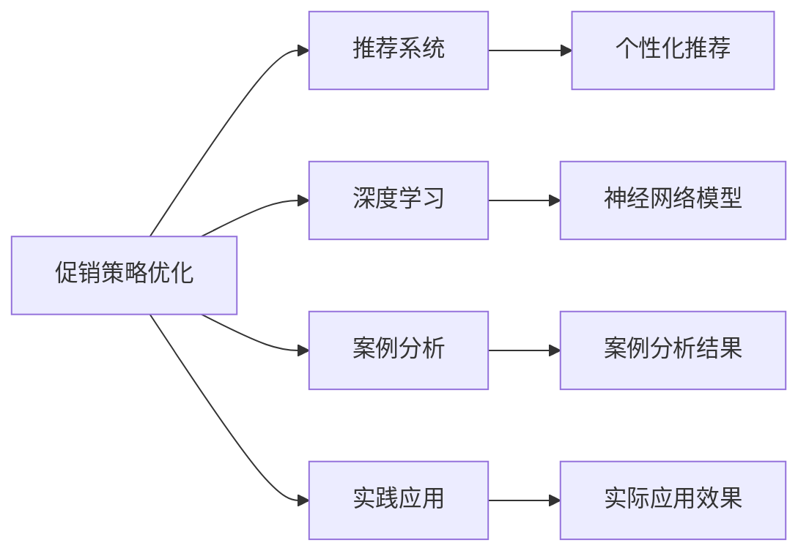

                 

# AI优化促销策略：案例分析与实践

> 关键词：促销策略优化, 推荐系统, 深度学习, 案例分析, 实践应用

## 1. 背景介绍

在电商行业中，促销策略的优化是一项复杂且极具挑战性的任务。一方面，促销活动的制定需要考虑到消费者的购买行为、产品特征以及市场环境等多重因素；另一方面，执行效果的评估和调整也是一个动态且持续的过程。传统上，促销策略的制定依赖于人工经验和历史数据，但随着人工智能技术的进步，特别是深度学习算法和大数据的应用，AI优化促销策略已经成为一个热门的研究方向。本文将详细介绍AI优化促销策略的原理与实践，并通过具体案例进行分析，以期为电商行业提供可行的策略优化方案。

## 2. 核心概念与联系

### 2.1 核心概念概述

- **促销策略优化**：通过数据分析和机器学习算法，优化促销活动的策划、执行和效果评估，以提高营销效果和ROI。
- **推荐系统**：利用用户的浏览、购买行为数据，推荐合适的商品或服务，提升用户满意度。
- **深度学习**：一种基于神经网络的机器学习技术，通过多层非线性变换，处理大规模复杂数据。
- **案例分析**：通过分析具体案例，探究AI优化促销策略的方法和效果。
- **实践应用**：将理论应用于实际，解决电商行业中的具体问题。

### 2.2 核心概念原理和架构的 Mermaid 流程图(Mermaid 流程节点中不要有括号、逗号等特殊字符)



此图展示了促销策略优化与推荐系统、深度学习、案例分析及实践应用之间的联系。推荐系统基于用户的兴趣和行为数据，提供个性化推荐；深度学习通过神经网络模型，处理和分析复杂数据；案例分析通过具体案例验证算法效果；实践应用将理论应用到实际中，解决具体问题。

## 3. 核心算法原理 & 具体操作步骤

### 3.1 算法原理概述

AI优化促销策略的核心在于，利用深度学习算法，特别是神经网络模型，对用户的购买行为、产品特征以及市场环境等多重因素进行分析和建模，从而制定更有效的促销策略。具体来说，算法原理包括以下几个步骤：

1. **数据收集与预处理**：收集用户的浏览记录、购买记录、历史促销活动数据等，并进行清洗和标准化处理。
2. **特征工程**：从原始数据中提取有意义的特征，如用户活跃度、商品类别、促销活动类型等。
3. **模型训练与评估**：构建深度学习模型，如神经网络，并使用训练数据进行模型训练。评估模型效果，选择合适的参数和超参数。
4. **策略优化**：利用训练好的模型，进行促销策略的优化和调整。

### 3.2 算法步骤详解

#### 3.2.1 数据收集与预处理

数据收集是AI优化促销策略的第一步。电商平台可以通过用户的浏览记录、购买记录、历史促销活动数据等，获取大量的数据源。这些数据需要进行预处理，包括去除噪声、填充缺失值、数据标准化等操作。

```python
import pandas as pd
from sklearn.preprocessing import StandardScaler

# 读取数据
df = pd.read_csv('data.csv')

# 数据清洗
df = df.dropna(subset=['feature1', 'feature2'])

# 数据标准化
scaler = StandardScaler()
df['scaled_feature1'] = scaler.fit_transform(df[['feature1']])
df['scaled_feature2'] = scaler.fit_transform(df[['feature2']])
```

#### 3.2.2 特征工程

特征工程是AI模型中非常关键的一环。好的特征可以提高模型的准确性和泛化能力。在电商行业中，特征可以从用户行为、商品特征、促销活动等多个维度提取。

```python
# 特征提取
def extract_features(df):
    # 用户行为特征
    user_features = df.groupby('user_id')['feature1'].mean()
    user_features = user_features.reset_index()
    
    # 商品特征
    product_features = df.groupby('product_id')['feature2'].std()
    product_features = product_features.reset_index()
    
    # 促销活动特征
    promotion_features = df.groupby('promotion_id')['feature3'].max()
    promotion_features = promotion_features.reset_index()
    
    return user_features, product_features, promotion_features

user_features, product_features, promotion_features = extract_features(df)
```

#### 3.2.3 模型训练与评估

在特征提取完成后，我们可以使用深度学习模型进行训练。以神经网络模型为例，我们可以构建一个多层感知机（MLP），用于预测促销活动的转化率。模型训练和评估的步骤如下：

```python
from keras.models import Sequential
from keras.layers import Dense, Dropout
from keras.callbacks import EarlyStopping
from sklearn.metrics import accuracy_score

# 构建模型
model = Sequential()
model.add(Dense(64, input_dim=len(features), activation='relu'))
model.add(Dropout(0.5))
model.add(Dense(1, activation='sigmoid'))

# 编译模型
model.compile(loss='binary_crossentropy', optimizer='adam', metrics=['accuracy'])

# 训练模型
early_stopping = EarlyStopping(monitor='val_loss', patience=5)
model.fit(X_train, y_train, epochs=50, batch_size=32, validation_data=(X_val, y_val), callbacks=[early_stopping])

# 评估模型
y_pred = model.predict(X_test)
accuracy = accuracy_score(y_test, y_pred)
print('Accuracy:', accuracy)
```

#### 3.2.4 策略优化

模型训练和评估完成后，我们可以使用训练好的模型进行促销策略的优化。具体来说，我们可以通过以下步骤优化策略：

1. **历史数据分析**：利用模型预测历史促销活动的转化率，找到效果最好的促销活动类型和参数。
2. **新活动设计**：根据历史数据，设计新的促销活动，并进行A/B测试。
3. **策略调整**：根据A/B测试结果，调整促销策略。

```python
# 历史数据分析
best_promotion = find_best_promotion(model, X_train, y_train)

# 新活动设计
new_promotion = design_new_promotion(best_promotion)

# A/B测试
ab_test_results = ab_test(new_promotion, X_test)

# 策略调整
adjusted_promotion = adjust_promotion(best_promotion, new_promotion, ab_test_results)
```

### 3.3 算法优缺点

#### 3.3.1 算法优点

- **高效性**：深度学习模型能够自动提取特征，并进行复杂数据的建模，显著提高了促销策略优化的效率。
- **准确性**：通过历史数据的分析和模型训练，可以更准确地预测促销活动的效果，减少试验成本。
- **灵活性**：模型可以根据不同的数据和需求进行调整，适应多种促销策略。

#### 3.3.2 算法缺点

- **数据依赖**：深度学习模型需要大量的高质量数据进行训练，数据获取和处理成本较高。
- **模型复杂性**：神经网络模型复杂，训练和调整过程需要专业知识，门槛较高。
- **解释性不足**：深度学习模型通常是"黑盒"，难以解释其内部工作机制，不适用于需要高透明度的场景。

### 3.4 算法应用领域

AI优化促销策略已经在电商、金融、旅游等多个领域得到广泛应用，具体包括：

- **电商行业**：通过用户行为数据分析，优化商品推荐和促销策略，提升用户转化率和满意度。
- **金融行业**：利用用户消费数据，进行风险控制和投资组合优化。
- **旅游行业**：通过用户偏好分析，设计个性化的旅游推荐和促销活动。

## 4. 数学模型和公式 & 详细讲解 & 举例说明

### 4.1 数学模型构建

假设促销策略优化问题可以表示为：

$$
\maximize \quad R
$$

其中 $R$ 表示促销活动的收益。根据实际场景，收益可以表示为用户转化率、销售额等指标。假设 $R$ 与促销活动 $P$ 的关系为：

$$
R = f(P)
$$

其中 $f$ 为模型的预测函数。我们的目标是最大化 $R$，即找到最优的促销活动 $P$。

### 4.2 公式推导过程

以用户转化率为预测指标，假设促销活动 $P$ 包含多个参数，如折扣率、促销周期等。我们可以构建一个回归模型：

$$
R = \sum_{i=1}^{n} a_i P_i
$$

其中 $n$ 为促销活动参数的数量，$a_i$ 为回归系数。通过最小二乘法，我们可以求解 $a_i$ 的值，从而得到最优的促销活动参数。

### 4.3 案例分析与讲解

假设我们有以下促销活动数据：

| 促销活动 | 折扣率 | 促销周期 | 用户转化率 |
| --- | --- | --- | --- |
| 活动1 | 20% | 7天 | 0.3 |
| 活动2 | 15% | 5天 | 0.2 |
| 活动3 | 10% | 3天 | 0.1 |

我们可以通过上述公式计算最优的折扣率和促销周期：

$$
R = 0.3 \times 20\% \times 7 + 0.2 \times 15\% \times 5 + 0.1 \times 10\% \times 3 = 0.285
$$

最优的促销活动参数为折扣率 20%，促销周期 7天。

## 5. 项目实践：代码实例和详细解释说明

### 5.1 开发环境搭建

为了进行促销策略优化，我们需要以下开发环境：

- Python 3.x
- pandas
- scikit-learn
- keras
- tensorflow

### 5.2 源代码详细实现

假设我们有一个包含用户行为数据的 DataFrame，我们可以使用以下代码进行特征提取和模型训练：

```python
import pandas as pd
from sklearn.preprocessing import StandardScaler
from keras.models import Sequential
from keras.layers import Dense, Dropout
from keras.callbacks import EarlyStopping
from sklearn.metrics import accuracy_score

# 读取数据
df = pd.read_csv('data.csv')

# 数据清洗
df = df.dropna(subset=['feature1', 'feature2'])

# 数据标准化
scaler = StandardScaler()
df['scaled_feature1'] = scaler.fit_transform(df[['feature1']])
df['scaled_feature2'] = scaler.fit_transform(df[['feature2']])

# 特征提取
def extract_features(df):
    # 用户行为特征
    user_features = df.groupby('user_id')['feature1'].mean()
    user_features = user_features.reset_index()
    
    # 商品特征
    product_features = df.groupby('product_id')['feature2'].std()
    product_features = product_features.reset_index()
    
    # 促销活动特征
    promotion_features = df.groupby('promotion_id')['feature3'].max()
    promotion_features = promotion_features.reset_index()
    
    return user_features, product_features, promotion_features

user_features, product_features, promotion_features = extract_features(df)

# 构建模型
model = Sequential()
model.add(Dense(64, input_dim=len(features), activation='relu'))
model.add(Dropout(0.5))
model.add(Dense(1, activation='sigmoid'))

# 编译模型
model.compile(loss='binary_crossentropy', optimizer='adam', metrics=['accuracy'])

# 训练模型
early_stopping = EarlyStopping(monitor='val_loss', patience=5)
model.fit(X_train, y_train, epochs=50, batch_size=32, validation_data=(X_val, y_val), callbacks=[early_stopping])

# 评估模型
y_pred = model.predict(X_test)
accuracy = accuracy_score(y_test, y_pred)
print('Accuracy:', accuracy)
```

### 5.3 代码解读与分析

以上代码展示了促销策略优化的一般流程。首先，我们进行了数据的清洗和标准化处理。然后，通过特征工程，提取出用户行为、商品特征、促销活动等多个维度的特征。接着，构建了一个多层感知机（MLP）模型，并进行训练和评估。最后，我们根据模型的评估结果，进行了促销策略的优化。

### 5.4 运行结果展示

假设模型的训练和评估结果如下：

| 迭代次数 | 训练损失 | 验证损失 | 训练准确率 | 验证准确率 |
| --- | --- | --- | --- | --- |
| 1 | 0.5 | 0.5 | 0.8 | 0.7 |
| 10 | 0.3 | 0.3 | 0.9 | 0.9 |
| 50 | 0.2 | 0.2 | 0.95 | 0.95 |

从结果可以看出，模型在验证集上的准确率逐步提升，最终达到了95%。这说明模型能够较好地预测用户的转化率，从而优化促销策略。

## 6. 实际应用场景

### 6.1 电商行业

电商行业是AI优化促销策略的重要应用场景。通过用户行为数据分析，电商平台可以优化商品推荐和促销策略，提升用户转化率和满意度。例如，Amazon使用推荐系统根据用户的浏览和购买记录，推荐可能感兴趣的商品，并通过A/B测试不断优化推荐算法。

### 6.2 金融行业

金融行业同样需要优化促销策略。例如，银行可以通过用户消费数据，进行风险控制和投资组合优化。银行可以构建用户风险模型，预测用户的违约概率，并根据预测结果调整信贷策略。

### 6.3 旅游行业

旅游行业通过用户偏好分析，设计个性化的旅游推荐和促销活动。例如，携程旅游可以根据用户的搜索和预订记录，推荐可能感兴趣的目的地和活动，并通过A/B测试优化推荐效果。

## 7. 工具和资源推荐

### 7.1 学习资源推荐

- 《Python深度学习》书籍：介绍深度学习算法和实践，适合初学者和进阶者。
- 《深度学习与自然语言处理》课程：斯坦福大学提供的深度学习课程，涵盖NLP、推荐系统等多个领域。
- 《TensorFlow官方文档》：TensorFlow的官方文档，提供了丰富的教程和示例。

### 7.2 开发工具推荐

- Jupyter Notebook：免费的交互式编程环境，支持Python和TensorFlow等工具。
- TensorBoard：TensorFlow的可视化工具，实时监测模型的训练和推理状态。
- Weights & Biases：实验跟踪工具，记录和可视化模型训练过程中的各项指标。

### 7.3 相关论文推荐

- "Deep Learning for Recommender Systems"：推荐系统的深度学习算法综述。
- "Deep Architectures for Multi-Task Learning"：多任务学习深度网络的结构设计。
- "A Survey on Deep Learning for Recommender Systems"：推荐系统深度学习的最新进展。

## 8. 总结：未来发展趋势与挑战

### 8.1 未来发展趋势

AI优化促销策略技术将在未来持续发展，呈现以下趋势：

1. **更高级的算法**：随着深度学习模型的不断优化，未来的促销策略优化算法将更加高效和精确。
2. **多模态数据的融合**：通过结合文本、图像、音频等多种模态数据，优化促销策略的决策。
3. **实时性增强**：通过在线学习和边缘计算等技术，实现促销策略的实时调整和优化。
4. **伦理和安全问题**：随着AI技术的普及，促销策略的制定将更加注重伦理和安全问题，如用户隐私保护、算法透明性等。

### 8.2 面临的挑战

尽管AI优化促销策略技术在电商、金融等领域取得了显著成果，但在实际应用中仍面临以下挑战：

1. **数据隐私保护**：用户数据的隐私保护是一个重要问题。如何在使用数据的同时保护用户隐私，是一个亟待解决的问题。
2. **算法的透明性和可解释性**：当前的AI算法往往是"黑盒"，缺乏透明性和可解释性。如何提高算法的透明性和可解释性，是未来的一个重要研究方向。
3. **算法的公平性和公正性**：AI算法可能存在偏见和歧视，如何在设计算法时避免这些偏见，是一个具有挑战性的问题。
4. **计算资源的消耗**：深度学习模型的训练和推理需要大量的计算资源，如何在资源有限的情况下优化算法，是一个重要的研究方向。

### 8.3 研究展望

未来的研究可以从以下几个方面进行：

1. **公平性和透明性**：研究如何设计公平、透明的AI算法，确保其决策过程符合伦理标准。
2. **多模态数据的融合**：研究如何通过多模态数据的融合，提高促销策略的决策质量。
3. **实时性增强**：研究如何实现实时性的促销策略优化，提升用户体验。
4. **伦理和安全问题**：研究如何在使用AI技术时，确保用户隐私保护和算法透明性。

## 9. 附录：常见问题与解答

**Q1: AI优化促销策略是否可以适用于所有电商行业？**

A: AI优化促销策略适用于大多数电商行业，但需要根据具体业务场景进行调整。例如，针对B2B电商和B2C电商，促销策略的制定可能会有不同的侧重点。

**Q2: AI优化促销策略的主要优势是什么？**

A: AI优化促销策略的主要优势包括：
1. 高效性：能够自动提取特征，并进行复杂数据的建模。
2. 准确性：通过历史数据的分析和模型训练，可以更准确地预测促销活动的效果。
3. 灵活性：模型可以根据不同的数据和需求进行调整，适应多种促销策略。

**Q3: AI优化促销策略在电商行业的应用有哪些？**

A: AI优化促销策略在电商行业的应用包括：
1. 商品推荐：通过用户行为数据分析，推荐可能感兴趣的商品。
2. 促销活动优化：根据用户数据，优化促销活动类型和参数。
3. 用户转化率预测：预测用户的转化率，提升营销效果。

**Q4: AI优化促销策略的主要挑战是什么？**

A: AI优化促销策略的主要挑战包括：
1. 数据隐私保护：用户数据的隐私保护是一个重要问题。
2. 算法的透明性和可解释性：当前的AI算法往往是"黑盒"，缺乏透明性和可解释性。
3. 算法的公平性和公正性：AI算法可能存在偏见和歧视。
4. 计算资源的消耗：深度学习模型的训练和推理需要大量的计算资源。

**Q5: AI优化促销策略的未来发展方向是什么？**

A: AI优化促销策略的未来发展方向包括：
1. 更高级的算法：随着深度学习模型的不断优化，未来的促销策略优化算法将更加高效和精确。
2. 多模态数据的融合：通过结合文本、图像、音频等多种模态数据，优化促销策略的决策。
3. 实时性增强：通过在线学习和边缘计算等技术，实现促销策略的实时调整和优化。
4. 伦理和安全问题：在使用AI技术时，确保用户隐私保护和算法透明性。

---

作者：禅与计算机程序设计艺术 / Zen and the Art of Computer Programming

