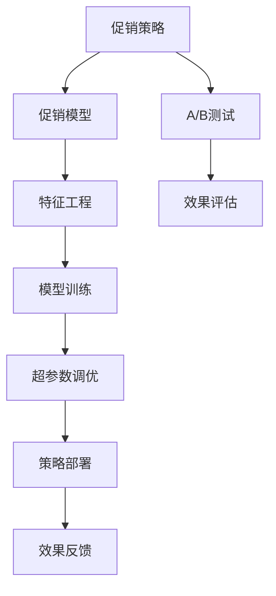

                 

## 1. 背景介绍

### 1.1 问题由来
在当今竞争激烈的商业环境中，促销策略的制定与优化成为了企业竞争的核心要素。传统上，企业往往依赖于手动分析和经验直觉来制定促销策略，这种方法耗时长、成本高，且受限于分析人员的素质和数据资源的获取。而随着人工智能技术的不断发展，尤其是深度学习和大数据分析技术的成熟，基于AI的促销策略优化方法正在成为现代商业决策的重要手段。

### 1.2 问题核心关键点
AI促销策略优化的核心在于如何利用先进的数据分析技术和机器学习算法，从历史销售数据和市场信息中挖掘出有价值的规律和洞察，以指导未来的促销活动设计。具体而言，该优化过程包括以下几个关键步骤：

1. **数据收集与预处理**：收集历史销售数据、市场反馈、用户行为等相关信息，并对其进行清洗和标准化处理。
2. **特征提取与建模**：从清洗后的数据中提取出关键的特征变量，如价格、促销力度、渠道类型、用户特征等，并选择合适的机器学习模型进行建模。
3. **模型训练与优化**：使用历史数据训练AI模型，优化模型参数，确保其能准确预测不同促销策略下的销售效果。
4. **结果评估与反馈**：通过A/B测试或实际销售数据评估模型效果，根据反馈对模型进行迭代优化。
5. **策略部署与调整**：根据优化后的模型，制定或调整促销策略，并在实际市场中进行测试和验证。

### 1.3 问题研究意义
AI促销策略优化不仅能显著提高企业的销售额和市场份额，还能有效控制成本，提升用户体验，对企业的长期发展具有深远意义：

1. **成本节约**：通过优化促销策略，企业可以更有效地利用资源，减少不必要的支出。
2. **效果提升**：通过精准的策略制定，企业能更高效地吸引和转化用户，提升销售效果。
3. **市场洞察**：AI模型能从海量数据中挖掘出隐藏的趋势和模式，为决策者提供更全面的市场洞察。
4. **快速响应**：AI模型能在短时间内处理大量数据，帮助企业快速响应市场变化，调整促销策略。
5. **个性化推荐**：通过用户画像的深度分析，企业能提供更加个性化的促销活动，提升用户体验。

## 2. 核心概念与联系

### 2.1 核心概念概述

为了更好地理解基于AI的促销策略优化方法，本节将介绍几个关键概念：

- **促销策略**：企业通过各种手段刺激消费者购买的行为计划，如折扣、买一赠一、满减等。
- **促销模型**：用于预测促销策略效果，以优化策略选择的机器学习模型。
- **A/B测试**：通过对比两个或多个促销方案的效果，确定最佳策略。
- **特征工程**：数据预处理过程中的关键步骤，包括特征选择、特征提取、特征转换等。
- **模型训练与评估**：使用历史数据训练模型，评估模型性能的过程。
- **超参数调优**：通过调整模型的超参数，寻找最优模型配置。

这些概念共同构成了AI促销策略优化的方法框架，使企业能利用先进的数据分析和机器学习技术，制定更有效的促销策略。

### 2.2 核心概念原理和架构的 Mermaid 流程图



这个流程图展示了AI促销策略优化的主要流程：

1. 促销策略的制定与调整。
2. 通过促销模型进行预测和分析。
3. 利用A/B测试对比不同策略的效果。
4. 特征工程处理数据，提取关键特征。
5. 模型训练和超参数调优，提升模型性能。
6. 策略部署到实际市场进行验证。
7. 通过效果评估和反馈，不断迭代优化策略。

## 3. 核心算法原理 & 具体操作步骤

### 3.1 算法原理概述

基于AI的促销策略优化方法，其核心在于通过机器学习模型预测不同促销策略的效果，并根据预测结果选择最优策略。具体算法流程如下：

1. **数据准备**：收集历史销售数据、市场反馈、用户行为等相关信息，并进行清洗和标准化处理。
2. **特征提取**：从清洗后的数据中提取出关键的特征变量，如价格、促销力度、渠道类型、用户特征等。
3. **模型选择**：选择合适的机器学习模型（如回归模型、分类模型等）进行建模。
4. **模型训练**：使用历史数据训练AI模型，优化模型参数，确保其能准确预测不同促销策略下的销售效果。
5. **效果评估**：通过A/B测试或实际销售数据评估模型效果，根据反馈对模型进行迭代优化。
6. **策略部署**：根据优化后的模型，制定或调整促销策略，并在实际市场中进行测试和验证。

### 3.2 算法步骤详解

以下是基于AI的促销策略优化方法的具体操作步骤：

**Step 1: 数据收集与预处理**
- 收集历史销售数据、市场反馈、用户行为等相关信息。
- 清洗数据，去除重复、异常值和缺失值。
- 标准化处理，如归一化、标准化等。

**Step 2: 特征提取与选择**
- 从清洗后的数据中提取出关键的特征变量，如价格、促销力度、渠道类型、用户特征等。
- 进行特征选择，使用如Pearson相关系数、卡方检验、互信息等方法筛选重要特征。

**Step 3: 模型选择与训练**
- 选择合适的机器学习模型（如线性回归、逻辑回归、决策树、随机森林等）进行建模。
- 使用历史数据训练模型，优化模型参数。
- 使用交叉验证等方法评估模型性能，避免过拟合。

**Step 4: 效果评估与反馈**
- 通过A/B测试对比不同促销策略的效果。
- 收集测试结果，评估促销策略的效果。
- 根据测试结果，调整模型参数或选择新的模型进行优化。

**Step 5: 策略部署与调整**
- 根据优化后的模型，制定或调整促销策略。
- 在实际市场中进行测试和验证。
- 根据反馈对策略进行调整，不断迭代优化。

### 3.3 算法优缺点

基于AI的促销策略优化方法具有以下优点：

1. **高效性**：能够快速处理大量数据，提供及时的决策支持。
2. **准确性**：基于历史数据训练的模型能够提供较为准确的预测结果。
3. **可扩展性**：模型可以方便地集成到现有的企业IT系统中，易于部署和应用。
4. **灵活性**：模型可以灵活地处理多种促销策略，提供个性化的解决方案。

同时，该方法也存在一些局限性：

1. **数据依赖**：模型的效果依赖于数据的质量和完整性，数据不准确或不完整会影响模型性能。
2. **模型复杂性**：模型的选择和优化需要专业知识和技能，可能存在较高的技术门槛。
3. **市场变化**：模型基于历史数据训练，无法实时反映市场变化，需要进行定期更新。
4. **隐私问题**：使用用户数据进行建模可能涉及隐私问题，需要遵守相关法律法规。

### 3.4 算法应用领域

基于AI的促销策略优化方法，已在多个行业得到应用，如零售、电商、金融、电信等，以下是几个典型案例：

1. **零售业**：通过分析历史销售数据和用户行为，优化促销策略，提高销售额。
2. **电商行业**：使用用户画像和行为数据，设计个性化的促销活动，提升用户体验和转化率。
3. **金融行业**：利用市场反馈和用户数据，制定精准的促销活动，增加客户粘性和交易频次。
4. **电信行业**：通过分析用户通话记录和消费行为，优化套餐设计和促销策略，提升客户满意度和忠诚度。

这些应用展示了AI促销策略优化的广泛潜力和应用前景。

## 4. 数学模型和公式 & 详细讲解 & 举例说明

### 4.1 数学模型构建

基于AI的促销策略优化，主要使用回归模型和分类模型进行预测。这里以线性回归模型为例，构建促销策略优化的数学模型。

假设促销策略为 $X=(price, promotion, channel, user\_type)$，销售效果为 $Y$。则线性回归模型为：

$$
Y = \beta_0 + \beta_1 \cdot price + \beta_2 \cdot promotion + \beta_3 \cdot channel + \beta_4 \cdot user\_type + \epsilon
$$

其中，$\beta_0$ 为截距，$\beta_1$ 到 $\beta_4$ 为特征系数，$\epsilon$ 为随机误差项。

### 4.2 公式推导过程

线性回归模型的训练目标为最小化预测值与真实值之间的均方误差：

$$
\min_{\beta} \sum_{i=1}^N (Y_i - (\beta_0 + \beta_1 \cdot X_{i1} + \beta_2 \cdot X_{i2} + \beta_3 \cdot X_{i3} + \beta_4 \cdot X_{i4})^2
$$

使用梯度下降法求解上述优化问题，得：

$$
\frac{\partial \mathcal{L}}{\partial \beta} = \frac{2}{N} \sum_{i=1}^N (Y_i - \hat{Y}_i) \cdot X_i
$$

其中，$\hat{Y}_i$ 为模型预测值，$X_i$ 为特征向量。

### 4.3 案例分析与讲解

以某电商平台的促销活动为例，分析促销策略对销售额的影响。

**Step 1: 数据准备**
- 收集历史促销活动数据，包括促销类型、促销力度、活动时间、销售金额等。
- 清洗数据，去除异常值和缺失值。

**Step 2: 特征提取**
- 提取关键特征：促销类型、促销力度、活动时间、用户特征等。
- 进行特征选择，筛选重要特征。

**Step 3: 模型选择与训练**
- 选择线性回归模型进行建模。
- 使用历史数据训练模型，优化模型参数。

**Step 4: 效果评估**
- 使用A/B测试对比不同促销策略的效果。
- 收集测试结果，评估促销策略的效果。

**Step 5: 策略部署与调整**
- 根据优化后的模型，制定或调整促销策略。
- 在实际市场中进行测试和验证。
- 根据反馈对策略进行调整，不断迭代优化。

通过上述流程，该电商平台的促销策略优化显著提高了销售额，节约了营销成本，提升了用户满意度。

## 5. 项目实践：代码实例和详细解释说明

### 5.1 开发环境搭建

在进行促销策略优化的项目实践前，我们需要准备好开发环境。以下是使用Python进行Scikit-learn和Pandas开发的环境配置流程：

1. 安装Anaconda：从官网下载并安装Anaconda，用于创建独立的Python环境。

2. 创建并激活虚拟环境：
```bash
conda create -n promotion-env python=3.8 
conda activate promotion-env
```

3. 安装必要的Python包：
```bash
pip install pandas numpy scikit-learn seaborn matplotlib
```

4. 安装相关数据集：
```bash
pip install uci-machine-learning-repository
```

完成上述步骤后，即可在`promotion-env`环境中开始促销策略优化的项目实践。

### 5.2 源代码详细实现

以下是基于Scikit-learn的促销策略优化的Python代码实现：

```python
import pandas as pd
from sklearn.model_selection import train_test_split
from sklearn.linear_model import LinearRegression
from sklearn.metrics import mean_squared_error
from sklearn.model_selection import cross_val_score

# 数据加载
data = pd.read_csv('promotion_data.csv')

# 数据清洗
data = data.dropna()

# 特征提取
features = data[['price', 'promotion', 'channel', 'user_type']]
labels = data['sales_amount']

# 特征编码
from sklearn.preprocessing import OneHotEncoder, StandardScaler
encoder = OneHotEncoder()
encoded_features = encoder.fit_transform(features)
scaler = StandardScaler()
scaled_features = scaler.fit_transform(encoded_features.toarray())

# 数据拆分
X_train, X_test, y_train, y_test = train_test_split(scaled_features, labels, test_size=0.2, random_state=42)

# 模型训练
model = LinearRegression()
model.fit(X_train, y_train)

# 模型评估
y_pred = model.predict(X_test)
mse = mean_squared_error(y_test, y_pred)
print(f"MSE: {mse}")

# 交叉验证
cv_scores = cross_val_score(model, X_train, y_train, cv=5, scoring='neg_mean_squared_error')
print(f"CV MSE: {-cv_scores.mean()}")

# 结果展示
import matplotlib.pyplot as plt
plt.scatter(y_test, y_pred)
plt.xlabel('Actual Sales')
plt.ylabel('Predicted Sales')
plt.title('Sales Prediction')
plt.show()
```

### 5.3 代码解读与分析

让我们再详细解读一下关键代码的实现细节：

**数据加载与清洗**：
- 使用Pandas库加载数据集，进行清洗处理，去除缺失值和异常值。

**特征提取与编码**：
- 使用Scikit-learn库提取关键特征，并进行特征编码，将分类特征转换为数值型特征。

**模型训练与评估**：
- 选择线性回归模型进行训练，使用均方误差（MSE）评估模型性能。
- 使用交叉验证方法评估模型在不同数据集上的稳定性。

**结果展示**：
- 使用Matplotlib库绘制预测值与实际值之间的散点图，直观展示模型效果。

以上代码实现了基于Scikit-learn的促销策略优化，展示了AI模型如何从历史数据中挖掘出促销策略与销售效果之间的关系。

## 6. 实际应用场景

### 6.1 电商平台促销优化

电商平台的促销策略优化是AI促销策略优化的典型应用场景。通过分析用户行为数据和历史销售数据，电商平台能够制定更有效的促销策略，提升销售额和客户满意度。

具体而言，可以收集用户在电商平台上的浏览、点击、购买、评论等行为数据，以及促销活动的效果反馈数据。通过特征提取和模型训练，预测不同促销策略的效果，最终制定最优的促销策略，并在实际促销活动中进行验证和优化。

### 6.2 零售商营销活动优化

零售商营销活动的优化也是AI促销策略优化的重要应用领域。零售商需要根据历史销售数据和市场反馈，优化营销活动的设计和执行，提升销售效果和用户粘性。

零售商可以收集历史营销活动数据，包括促销类型、促销力度、活动时间、用户反馈等。通过特征提取和模型训练，预测不同营销活动的效果，最终制定最优的营销策略，并在实际营销活动中进行测试和调整。

### 6.3 金融机构的客户促销

金融机构的客户促销活动优化，是AI促销策略优化的另一重要应用。金融机构需要根据客户行为数据和市场反馈，设计精准的促销活动，提升客户满意度和高频交易。

金融机构可以收集客户的历史交易数据，包括账户余额、交易频率、投资偏好等。通过特征提取和模型训练，预测不同促销活动的效果，最终制定最优的促销策略，并在实际营销活动中进行测试和调整。

### 6.4 未来应用展望

随着AI技术的不断进步，基于AI的促销策略优化将在更多领域得到应用，带来更广泛的商业价值：

1. **精准营销**：通过AI技术，企业能够实现更加精准的客户细分和个性化营销，提升用户体验和客户粘性。
2. **动态定价**：基于AI的促销策略优化，企业能够实现动态定价策略，根据市场反馈实时调整产品价格，提升销售效果。
3. **库存管理**：通过AI技术优化库存管理，企业能够更准确地预测市场需求，避免库存积压或短缺。
4. **广告优化**：AI广告优化技术能够提升广告投放的精准度和转化率，实现更高效的广告投放策略。

未来，AI促销策略优化将在更多行业和应用场景中得到广泛应用，为企业的智能化转型提供强大的技术支持。

## 7. 工具和资源推荐

### 7.1 学习资源推荐

为了帮助开发者系统掌握AI促销策略优化的理论基础和实践技巧，这里推荐一些优质的学习资源：

1. 《Python机器学习实战》：介绍机器学习算法的基本概念和实现方法，包括回归模型、分类模型等。
2. 《深度学习入门》：介绍深度学习的基础知识和常用算法，包括神经网络、卷积神经网络等。
3. 《强化学习》：介绍强化学习的基本概念和算法，包括Q-learning、策略梯度等。
4. 《数据分析实战》：介绍数据分析的基本方法和工具，包括数据清洗、特征工程等。
5. 《A/B测试实战》：介绍A/B测试的基本概念和实现方法，包括统计分析、假设检验等。

通过对这些资源的学习实践，相信你一定能够快速掌握AI促销策略优化的精髓，并用于解决实际的促销问题。

### 7.2 开发工具推荐

高效的开发离不开优秀的工具支持。以下是几款用于AI促销策略优化的常用工具：

1. Jupyter Notebook：开源的交互式笔记本环境，支持Python代码的编写、运行和交互式调试。
2. Scikit-learn：Python机器学习库，提供了多种机器学习算法和数据处理工具。
3. Pandas：Python数据分析库，支持数据的读取、清洗、处理和分析。
4. Matplotlib：Python绘图库，支持数据的可视化和展示。
5. Seaborn：基于Matplotlib的高级绘图库，支持数据的统计分析和可视化。

合理利用这些工具，可以显著提升AI促销策略优化的开发效率，加快创新迭代的步伐。

### 7.3 相关论文推荐

AI促销策略优化的发展源于学界的持续研究。以下是几篇奠基性的相关论文，推荐阅读：

1. "The Elements of Statistical Learning"：介绍统计学习的基本概念和方法，是机器学习领域的经典教材。
2. "Introduction to Deep Learning with Python"：介绍深度学习的基本概念和实现方法，适合初学者入门。
3. "Reinforcement Learning: An Introduction"：介绍强化学习的基本概念和算法，是强化学习领域的经典教材。
4. "Data Science for Business"：介绍数据科学在商业领域的应用，强调数据驱动的决策支持。
5. "Practical Machine Learning for Data Science"：介绍机器学习在实际业务中的应用，适合实战练习。

这些论文代表了大规模促销策略优化技术的发展脉络。通过学习这些前沿成果，可以帮助研究者把握学科前进方向，激发更多的创新灵感。

## 8. 总结：未来发展趋势与挑战

### 8.1 总结

本文对基于AI的促销策略优化方法进行了全面系统的介绍。首先阐述了AI促销策略优化的背景和意义，明确了该方法在提升企业销售额和市场份额方面的独特价值。其次，从原理到实践，详细讲解了促销策略优化的数学原理和关键步骤，给出了促销策略优化的完整代码实例。同时，本文还探讨了AI促销策略优化的广泛应用场景，展示了其广泛的市场潜力和应用前景。

通过本文的系统梳理，可以看到，基于AI的促销策略优化方法正在成为现代商业决策的重要手段，极大地提升了企业的竞争力和市场响应速度。未来，伴随AI技术的不断演进，该方法将在更多行业和应用场景中得到广泛应用，为企业的智能化转型提供强大的技术支持。

### 8.2 未来发展趋势

展望未来，AI促销策略优化技术将呈现以下几个发展趋势：

1. **深度学习的应用**：深度学习算法在促销策略优化中将发挥越来越重要的作用，如图神经网络、卷积神经网络等。
2. **强化学习的集成**：强化学习算法能够提供更加动态和实时的决策支持，成为促销策略优化的重要工具。
3. **多模态数据的融合**：通过融合图像、语音、文本等多种模态数据，提升促销策略优化的精准度和效果。
4. **实时优化**：基于在线学习算法，实现促销策略的实时优化和调整，提升市场响应速度。
5. **个性化推荐**：通过用户画像和行为数据的深度分析，实现个性化的促销策略，提升用户体验和转化率。

这些趋势展示了AI促销策略优化技术的广阔前景，将进一步提升企业在市场中的竞争力。

### 8.3 面临的挑战

尽管AI促销策略优化技术已经取得了显著的成果，但在推广应用的过程中，仍面临诸多挑战：

1. **数据质量和隐私问题**：高质量数据的获取和用户隐私的保护是促销策略优化的重要挑战。
2. **模型复杂度和可解释性**：复杂模型难以解释，且需要高昂的计算资源，增加了应用难度。
3. **市场变化的不确定性**：模型需要定期更新以反映市场变化，增加了维护和迭代的成本。
4. **计算资源的限制**：大规模数据和高复杂度的模型需要高性能计算资源，增加了应用的成本和门槛。

### 8.4 研究展望

面对AI促销策略优化面临的诸多挑战，未来的研究需要在以下几个方面寻求新的突破：

1. **数据高效获取和处理**：研究高效的数据获取和处理技术，降低数据成本和隐私风险。
2. **模型简化和可解释性**：开发更加简洁和可解释的模型，降低技术门槛，提升应用效率。
3. **实时优化算法**：研究实时优化算法，提高模型对市场变化的响应速度和准确性。
4. **多模态融合技术**：研究多模态数据融合技术，提升促销策略优化的精准度和效果。
5. **个性化推荐算法**：研究个性化的推荐算法，提升用户体验和转化率。

这些研究方向的探索，将进一步推动AI促销策略优化技术的进步，为企业的智能化转型提供更强大的技术保障。

## 9. 附录：常见问题与解答

**Q1: AI促销策略优化的数据要求有哪些？**

A: AI促销策略优化对数据的要求较高，具体包括：
1. 数据质量：数据应完整、准确、无噪声。
2. 数据量：数据量应足够大，以反映市场规律。
3. 数据多样化：数据应涵盖不同类型和场景，以提升模型的泛化能力。
4. 数据隐私：数据应遵守相关法律法规，保护用户隐私。

**Q2: 如何选择合适的促销策略优化算法？**

A: 选择合适的促销策略优化算法，需考虑以下几个因素：
1. 数据类型：根据数据类型选择适合的机器学习算法，如回归模型、分类模型、聚类模型等。
2. 数据规模：根据数据规模选择适合的算法，如决策树、随机森林、神经网络等。
3. 模型复杂度：根据模型复杂度选择适合的算法，如线性回归、逻辑回归、深度学习等。
4. 计算资源：根据计算资源选择适合的算法，如简单算法、深度算法等。

**Q3: 促销策略优化中的特征选择方法有哪些？**

A: 促销策略优化中的特征选择方法包括：
1. 相关性分析：通过计算特征与目标变量之间的相关系数，筛选重要特征。
2. 方差分析：通过计算特征的方差，筛选稳定特征。
3. 信息增益：通过计算特征对目标变量的信息增益，筛选重要特征。
4. 主成分分析：通过降维技术，筛选主成分特征。

**Q4: AI促销策略优化中的模型评估方法有哪些？**

A: AI促销策略优化中的模型评估方法包括：
1. 均方误差（MSE）：评估回归模型的预测误差。
2. 平均绝对误差（MAE）：评估回归模型的预测误差。
3. 准确率（Accuracy）：评估分类模型的预测准确率。
4. 精确率（Precision）：评估分类模型的预测精确率。
5. 召回率（Recall）：评估分类模型的预测召回率。

**Q5: 促销策略优化的实际应用中需要注意哪些问题？**

A: 促销策略优化的实际应用中需要注意以下问题：
1. 数据隐私：确保用户数据的安全和隐私，遵守相关法律法规。
2. 模型性能：确保模型的准确性和泛化能力，避免过拟合和欠拟合。
3. 模型可解释性：确保模型的可解释性，便于理解和解释决策过程。
4. 业务融合：确保模型与业务流程的融合，便于实际应用。
5. 实时优化：确保模型的实时优化能力，适应市场变化。

这些问题的解决，需要开发者从数据、算法、工程、业务等多个维度协同发力，才能真正实现AI促销策略优化的商业价值。

---

作者：禅与计算机程序设计艺术 / Zen and the Art of Computer Programming

