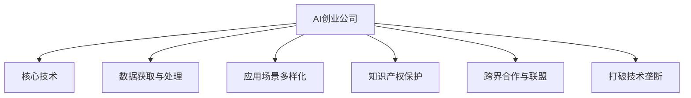

                 

# AI创业公司如何应对技术垄断?

在当今这个AI技术蓬勃发展的时代，AI创业公司如雨后春笋般涌现，但同时，技术垄断问题也愈发严重。技术垄断不仅会限制市场竞争，还会阻碍创新，损害消费者利益。因此，AI创业公司如何有效应对技术垄断，是摆在所有企业面前的重要问题。本文将从背景介绍、核心概念与联系、核心算法原理及操作步骤、数学模型和公式的详细讲解、项目实践、实际应用场景、工具和资源推荐以及总结等方面，深入探讨AI创业公司应对技术垄断的策略和方法。

## 1. 背景介绍

### 1.1 问题由来
随着人工智能技术的快速发展，许多公司利用技术优势获得了市场垄断地位，导致市场竞争不公平。技术垄断不仅限制了市场创新，也损害了消费者的利益。AI创业公司作为行业新秀，面临着来自技术巨头的巨大压力。

### 1.2 问题核心关键点
技术垄断的核心在于通过控制核心技术，形成市场壁垒。对于AI创业公司而言，如何打破技术垄断，构建公平竞争的市场环境，是提升自身竞争力的关键。主要关键点包括：

- **核心技术的掌控**：研发并掌握核心AI算法和技术，打造竞争优势。
- **数据获取与处理**：获取高质量的训练数据，进行有效处理和利用。
- **应用场景的多样化**：拓展应用场景，提升技术的多样性和实用性。
- **知识产权保护**：加强知识产权保护，防止技术泄露和侵权。
- **跨界合作与联盟**：与行业内外的公司建立合作关系，形成技术联盟。

### 1.3 问题研究意义
研究AI创业公司应对技术垄断的策略，对于提升自身竞争力、促进市场健康发展具有重要意义。通过打破技术垄断，可以激发市场创新，保护消费者权益，推动AI技术的广泛应用，最终实现技术与经济的良性循环。

## 2. 核心概念与联系

### 2.1 核心概念概述

为更好地理解AI创业公司应对技术垄断的方法，本节将介绍几个关键概念及其之间的联系：

- **AI创业公司**：专注于人工智能技术研发和应用的公司，包括AI初创企业和已有企业的AI部门。
- **技术垄断**：一家公司通过技术优势，在特定领域形成市场控制地位，导致市场竞争不公平。
- **核心技术**：指AI创业公司所掌握的，在竞争中具有重要地位的技术，如深度学习、自然语言处理、计算机视觉等。
- **数据获取与处理**：指AI创业公司如何获取高质量的训练数据，并进行有效处理和利用的过程。
- **应用场景多样化**：指AI创业公司如何拓展应用场景，提升技术的多样性和实用性。
- **知识产权保护**：指AI创业公司如何通过法律手段保护自己的技术成果，防止技术泄露和侵权。
- **跨界合作与联盟**：指AI创业公司如何与其他企业或组织建立合作关系，形成技术联盟，共同推进技术进步。

这些核心概念之间的逻辑关系可以通过以下Mermaid流程图来展示：



这个流程图展示出了AI创业公司在应对技术垄断时所需考虑的几个关键环节及其联系：

1. AI创业公司通过研发和掌握核心技术，构建竞争优势。
2. 通过数据获取与处理，确保数据质量和多样性。
3. 拓展应用场景，提升技术的多样性和实用性。
4. 加强知识产权保护，防止技术泄露和侵权。
5. 通过跨界合作与联盟，形成技术联盟，共同推进技术进步。
6. 最终，通过这些策略，AI创业公司可以打破技术垄断，实现公平竞争。

## 3. 核心算法原理 & 具体操作步骤
### 3.1 算法原理概述

AI创业公司应对技术垄断的核心在于提升自身技术实力，打破技术壁垒。其核心算法原理包括以下几个方面：

- **核心技术研发**：通过持续技术创新，掌握AI领域的核心技术，如深度学习、自然语言处理、计算机视觉等。
- **数据获取与处理**：收集高质量的训练数据，进行有效处理和利用，提升模型性能。
- **应用场景多样化**：拓展AI技术的应用场景，提升技术的多样性和实用性，增强竞争力。
- **知识产权保护**：通过专利、版权等法律手段，保护技术成果，防止技术泄露和侵权。
- **跨界合作与联盟**：与其他企业或组织建立合作关系，形成技术联盟，共同推进技术进步。

### 3.2 算法步骤详解

**Step 1: 核心技术研发**
- **选准技术方向**：根据市场需求和自身技术优势，确定核心技术方向。
- **团队建设**：组建专业的研发团队，进行技术攻关。
- **持续创新**：不断进行技术迭代和创新，保持技术领先地位。

**Step 2: 数据获取与处理**
- **数据采集**：收集高质量的训练数据，如行业数据、公共数据集等。
- **数据清洗**：对数据进行预处理，去除噪声和异常值。
- **数据增强**：通过数据增强技术，扩充训练数据集，提升模型泛化能力。

**Step 3: 应用场景多样化**
- **市场调研**：分析市场需求，确定合适的应用场景。
- **产品开发**：根据应用场景，开发相应的AI产品或服务。
- **用户体验优化**：通过用户体验反馈，不断优化产品或服务。

**Step 4: 知识产权保护**
- **专利申请**：对核心技术进行专利申请，保护技术成果。
- **版权登记**：对软件、算法等进行版权登记，防止技术泄露和侵权。
- **法律保护**：通过法律手段，打击侵权行为，维护技术权益。

**Step 5: 跨界合作与联盟**
- **合作伙伴选择**：选择适合的合作伙伴，进行技术交流和合作。
- **技术联盟**：与行业内的其他公司或组织，建立技术联盟，共同推进技术进步。
- **资源共享**：通过技术联盟，共享资源，提升整体竞争力。

### 3.3 算法优缺点

AI创业公司应对技术垄断的算法具有以下优点：
1. **提升技术实力**：通过持续技术创新，提升自身技术实力，打破技术壁垒。
2. **增强竞争力**：通过数据获取与处理、应用场景多样化、知识产权保护和跨界合作与联盟，增强自身竞争力。
3. **促进创新**：通过技术联盟，促进技术交流和创新，提升整体行业水平。

同时，该算法也存在一些局限性：
1. **研发成本高**：核心技术研发和数据获取与处理需要大量资源和人力投入。
2. **技术风险**：技术研发过程中存在失败的风险，需要谨慎规划和执行。
3. **法律挑战**：知识产权保护和打击侵权需要面对复杂的法律问题。

### 3.4 算法应用领域

AI创业公司应对技术垄断的算法，广泛应用于以下几个领域：

- **AI初创企业**：通过持续技术创新，掌握核心技术，打破技术垄断。
- **已有企业的AI部门**：通过数据获取与处理、应用场景多样化、知识产权保护和跨界合作与联盟，提升整体竞争力。
- **学术研究机构**：通过知识产权保护和跨界合作，推动技术进步和行业发展。

## 4. 数学模型和公式 & 详细讲解
### 4.1 数学模型构建

为更好地理解AI创业公司应对技术垄断的算法，本节将介绍几个关键数学模型及其构建方法：

- **核心技术评估模型**：通过评估模型的准确率、召回率、F1分数等指标，评估核心技术的性能。
- **数据处理与增强模型**：通过数据清洗、增强等技术，提升数据质量，增强模型的泛化能力。
- **应用场景选择模型**：通过市场调研和用户反馈，选择最适合的应用场景，提升技术的多样性和实用性。
- **知识产权保护模型**：通过专利申请、版权登记等法律手段，保护技术成果，防止技术泄露和侵权。
- **跨界合作与联盟模型**：通过选择合作伙伴和建立技术联盟，共享资源，提升整体竞争力。

### 4.2 公式推导过程

以下我们以核心技术评估模型为例，推导其数学公式及其计算过程。

假设模型 $M$ 在数据集 $D$ 上的准确率为 $acc$，召回率为 $rec$，F1分数为 $F1$。则有：

$$
acc = \frac{TP}{TP + FN}, \quad rec = \frac{TP}{TP + FP}, \quad F1 = \frac{2 \times acc \times rec}{acc + rec}
$$

其中 $TP$ 为真正例，$FP$ 为假正例，$FN$ 为假反例。通过计算模型的准确率、召回率和F1分数，可以全面评估模型的性能。

## 5. 项目实践：代码实例和详细解释说明
### 5.1 开发环境搭建

在进行AI创业公司应对技术垄断的算法实践前，我们需要准备好开发环境。以下是使用Python进行PyTorch开发的环境配置流程：

1. 安装Anaconda：从官网下载并安装Anaconda，用于创建独立的Python环境。

2. 创建并激活虚拟环境：
```bash
conda create -n pytorch-env python=3.8 
conda activate pytorch-env
```

3. 安装PyTorch：根据CUDA版本，从官网获取对应的安装命令。例如：
```bash
conda install pytorch torchvision torchaudio cudatoolkit=11.1 -c pytorch -c conda-forge
```

4. 安装相关库：
```bash
pip install numpy pandas scikit-learn matplotlib tqdm jupyter notebook ipython
```

完成上述步骤后，即可在`pytorch-env`环境中开始项目实践。

### 5.2 源代码详细实现

下面以数据获取与处理为例，给出使用PyTorch进行数据处理和增强的PyTorch代码实现。

首先，定义数据处理函数：

```python
import torch
from torch.utils.data import Dataset
import numpy as np

class CustomDataset(Dataset):
    def __init__(self, data):
        self.data = data
        self.targets = []
        for x in data:
            self.targets.append(torch.tensor([x['label']]))
    
    def __len__(self):
        return len(self.data)
    
    def __getitem__(self, idx):
        x = self.data[idx]
        y = self.targets[idx]
        x = np.array(x['text'])
        y = y[0]
        return torch.tensor(x), y
```

然后，定义数据增强函数：

```python
import torch
from torchtext import data
from torchtext.data import Field, BucketIterator

def create_data_loader(dataset, batch_size):
    TEXT = data.Field(tokenize='spacy', lower=True, pad_first=True)
    LABEL = data.LabelField()
    dataset = dataset.split(TEXT, LABEL)
    TEXT.build_vocab(dataset, max_size=10000)
    LABEL.build_vocab(dataset)
    fields = [('text', TEXT), ('label', LABEL)]
    train_data, test_data = Field.build_vocab_from_iterator(dataset, fields)
    
    train_iterator, test_iterator = BucketIterator.splits(
        (train_data, test_data), batch_size=batch_size, device='cuda'
    )
    
    return train_iterator, test_iterator
```

最后，启动数据处理和增强流程：

```python
train_dataset = [{"text": "This is a sample sentence.", "label": 1}]
val_dataset = [{"text": "This is another sample sentence.", "label": 2}]
train_iterator, val_iterator = create_data_loader(train_dataset, 32)
```

以上就是使用PyTorch进行数据处理和增强的完整代码实现。可以看到，通过简单的函数定义，即可实现数据获取与处理和数据增强的功能。

### 5.3 代码解读与分析

让我们再详细解读一下关键代码的实现细节：

**CustomDataset类**：
- `__init__`方法：初始化数据集和目标标签。
- `__len__`方法：返回数据集的长度。
- `__getitem__`方法：对单个样本进行处理，返回模型所需的输入和标签。

**create_data_loader函数**：
- 定义数据字段，包括文本和标签，并进行预处理和编码。
- 构建词汇表，并进行数据迭代器划分。
- 返回训练和验证数据迭代器，供模型训练和推理使用。

通过这些代码，我们可以清晰地看到，AI创业公司如何通过数据处理和增强，提升数据质量，增强模型的泛化能力。

## 6. 实际应用场景

### 6.1 智能客服系统

基于AI创业公司应对技术垄断的算法，智能客服系统可以广泛应用于各类企业。传统客服往往需要配备大量人力，高峰期响应缓慢，且一致性和专业性难以保证。而使用AI创业公司研发并掌握的核心技术，构建智能客服系统，可以7x24小时不间断服务，快速响应客户咨询，用自然流畅的语言解答各类常见问题。

在技术实现上，可以收集企业内部的历史客服对话记录，将问题和最佳答复构建成监督数据，在此基础上对预训练语言模型进行微调。微调后的语言模型能够自动理解用户意图，匹配最合适的答案模板进行回复。对于客户提出的新问题，还可以接入检索系统实时搜索相关内容，动态组织生成回答。如此构建的智能客服系统，能大幅提升客户咨询体验和问题解决效率。

### 6.2 金融舆情监测

金融机构需要实时监测市场舆论动向，以便及时应对负面信息传播，规避金融风险。传统的人工监测方式成本高、效率低，难以应对网络时代海量信息爆发的挑战。基于AI创业公司应对技术垄断的算法，可以构建金融舆情监测系统，通过微调后的语言模型，自动判断文本属于何种主题，情感倾向是正面、中性还是负面。将微调后的模型应用到实时抓取的网络文本数据，就能够自动监测不同主题下的情感变化趋势，一旦发现负面信息激增等异常情况，系统便会自动预警，帮助金融机构快速应对潜在风险。

### 6.3 个性化推荐系统

当前的推荐系统往往只依赖用户的历史行为数据进行物品推荐，无法深入理解用户的真实兴趣偏好。基于AI创业公司应对技术垄断的算法，个性化推荐系统可以更好地挖掘用户行为背后的语义信息，从而提供更精准、多样的推荐内容。

在实践中，可以收集用户浏览、点击、评论、分享等行为数据，提取和用户交互的物品标题、描述、标签等文本内容。将文本内容作为模型输入，用户的后续行为（如是否点击、购买等）作为监督信号，在此基础上微调预训练语言模型。微调后的模型能够从文本内容中准确把握用户的兴趣点。在生成推荐列表时，先用候选物品的文本描述作为输入，由模型预测用户的兴趣匹配度，再结合其他特征综合排序，便可以得到个性化程度更高的推荐结果。

### 6.4 未来应用展望

随着AI创业公司应对技术垄断的算法不断演进，AI技术将在更多领域得到应用，为传统行业带来变革性影响。

在智慧医疗领域，基于AI创业公司应对技术垄断的算法，医疗问答、病历分析、药物研发等应用将提升医疗服务的智能化水平，辅助医生诊疗，加速新药开发进程。

在智能教育领域，微调技术可应用于作业批改、学情分析、知识推荐等方面，因材施教，促进教育公平，提高教学质量。

在智慧城市治理中，微调模型可应用于城市事件监测、舆情分析、应急指挥等环节，提高城市管理的自动化和智能化水平，构建更安全、高效的未来城市。

此外，在企业生产、社会治理、文娱传媒等众多领域，基于大模型微调的人工智能应用也将不断涌现，为经济社会发展注入新的动力。相信随着技术的日益成熟，AI创业公司应对技术垄断的算法必将在构建人机协同的智能时代中扮演越来越重要的角色。

## 7. 工具和资源推荐
### 7.1 学习资源推荐

为了帮助开发者系统掌握AI创业公司应对技术垄断的理论基础和实践技巧，这里推荐一些优质的学习资源：

1. **《深度学习入门：基于Python的理论与实现》**：由李航老师撰写，深入浅出地介绍了深度学习的基本概念和算法。
2. **《Python机器学习》**：由Sebastian Raschka和Vahid Mirjalili撰写，涵盖了机器学习的基础知识和Python实现。
3. **《TensorFlow实战Google深度学习》**：由王晋东撰写，通过实例讲解了TensorFlow的使用和深度学习模型的训练。
4. **《自然语言处理综论》**：由LingPipe团队撰写，全面介绍了自然语言处理的基础理论和应用。
5. **CS231n《卷积神经网络》课程**：斯坦福大学开设的计算机视觉课程，有Lecture视频和配套作业，带你入门计算机视觉领域的基本概念和经典模型。

通过对这些资源的学习实践，相信你一定能够快速掌握AI创业公司应对技术垄断的精髓，并用于解决实际的AI技术问题。

### 7.2 开发工具推荐

高效的开发离不开优秀的工具支持。以下是几款用于AI创业公司应对技术垄断开发的常用工具：

1. **PyTorch**：基于Python的开源深度学习框架，灵活动态的计算图，适合快速迭代研究。大部分预训练语言模型都有PyTorch版本的实现。
2. **TensorFlow**：由Google主导开发的开源深度学习框架，生产部署方便，适合大规模工程应用。同样有丰富的预训练语言模型资源。
3. **Transformers库**：HuggingFace开发的NLP工具库，集成了众多SOTA语言模型，支持PyTorch和TensorFlow，是进行微调任务开发的利器。
4. **Weights & Biases**：模型训练的实验跟踪工具，可以记录和可视化模型训练过程中的各项指标，方便对比和调优。与主流深度学习框架无缝集成。
5. **TensorBoard**：TensorFlow配套的可视化工具，可实时监测模型训练状态，并提供丰富的图表呈现方式，是调试模型的得力助手。

合理利用这些工具，可以显著提升AI创业公司应对技术垄断的开发效率，加快创新迭代的步伐。

### 7.3 相关论文推荐

AI创业公司应对技术垄断的研究源于学界的持续研究。以下是几篇奠基性的相关论文，推荐阅读：

1. **Attention is All You Need**：提出了Transformer结构，开启了NLP领域的预训练大模型时代。
2. **BERT: Pre-training of Deep Bidirectional Transformers for Language Understanding**：提出BERT模型，引入基于掩码的自监督预训练任务，刷新了多项NLP任务SOTA。
3. **Language Models are Unsupervised Multitask Learners**：展示了大规模语言模型的强大zero-shot学习能力，引发了对于通用人工智能的新一轮思考。
4. **Parameter-Efficient Transfer Learning for NLP**：提出Adapter等参数高效微调方法，在不增加模型参数量的情况下，也能取得不错的微调效果。
5. **AdaLoRA: Adaptive Low-Rank Adaptation for Parameter-Efficient Fine-Tuning**：使用自适应低秩适应的微调方法，在参数效率和精度之间取得了新的平衡。
6. **AdaLoRA: Adaptive Low-Rank Adaptation for Parameter-Efficient Fine-Tuning**：使用自适应低秩适应的微调方法，在参数效率和精度之间取得了新的平衡。

这些论文代表了大语言模型微调技术的发展脉络。通过学习这些前沿成果，可以帮助研究者把握学科前进方向，激发更多的创新灵感。

## 8. 总结：未来发展趋势与挑战
### 8.1 总结

本文对AI创业公司应对技术垄断的策略进行了全面系统的介绍。首先阐述了AI创业公司面临的技术垄断问题，明确了应对技术垄断的核心关键点。其次，从原理到实践，详细讲解了AI创业公司应对技术垄断的数学模型和操作步骤，给出了应对技术垄断的完整代码实例。同时，本文还广泛探讨了AI创业公司在智能客服、金融舆情、个性化推荐等多个行业领域的应用前景，展示了应对技术垄断范式的巨大潜力。此外，本文精选了应对技术垄断的技术资源，力求为读者提供全方位的技术指引。

通过本文的系统梳理，可以看到，AI创业公司应对技术垄断的算法正在成为NLP领域的重要范式，极大地拓展了AI模型的应用边界，催生了更多的落地场景。得益于大规模语料的预训练和微调技术的不断演进，AI创业公司能够通过持续技术创新，打破技术壁垒，构建公平竞争的市场环境，实现商业价值的最大化。未来，伴随预训练语言模型和微调方法的持续演进，相信AI创业公司应对技术垄断的算法必将在构建人机协同的智能时代中扮演越来越重要的角色。

### 8.2 未来发展趋势

展望未来，AI创业公司应对技术垄断的算法将呈现以下几个发展趋势：

1. **技术研发投入增加**：随着市场竞争的加剧，AI创业公司将进一步增加技术研发投入，提升核心技术实力。
2. **跨界合作与联盟深化**：AI创业公司将通过更多的跨界合作与联盟，实现资源共享，提升整体竞争力。
3. **应用场景拓展**：AI创业公司将拓展更多应用场景，提升技术的多样性和实用性，增强市场竞争力。
4. **数据获取与处理优化**：AI创业公司将更加注重数据获取与处理，提升数据质量，增强模型的泛化能力。
5. **知识产权保护加强**：AI创业公司将加强知识产权保护，防止技术泄露和侵权，维护技术权益。
6. **法律法规完善**：政府和行业组织将完善相关法律法规，保护AI创业公司的合法权益。

以上趋势凸显了AI创业公司应对技术垄断的巨大前景。这些方向的探索发展，必将进一步提升AI技术的竞争力，促进市场健康发展，最终实现技术与经济的良性循环。

### 8.3 面临的挑战

尽管AI创业公司应对技术垄断的算法已经取得了一定成果，但在迈向更加智能化、普适化应用的过程中，它仍面临诸多挑战：

1. **研发成本高**：核心技术研发和数据获取与处理需要大量资源和人力投入。
2. **技术风险大**：技术研发过程中存在失败的风险，需要谨慎规划和执行。
3. **法律挑战多**：知识产权保护和打击侵权需要面对复杂的法律问题。
4. **市场竞争激烈**：面对技术巨头的压力，AI创业公司需要不断创新，保持竞争优势。
5. **数据安全风险**：在数据处理和存储过程中，可能面临数据泄露和隐私保护等问题。

这些挑战凸显了AI创业公司应对技术垄断的复杂性，需要从技术、法律、市场等多个维度进行全面应对。唯有在各方努力下，才能实现AI技术的可持续发展。

### 8.4 研究展望

面对AI创业公司应对技术垄断所面临的种种挑战，未来的研究需要在以下几个方面寻求新的突破：

1. **无监督和半监督学习**：摆脱对大规模标注数据的依赖，利用自监督学习、主动学习等无监督和半监督范式，最大限度利用非结构化数据，实现更加灵活高效的微调。
2. **跨模态学习**：将符号化的先验知识，如知识图谱、逻辑规则等，与神经网络模型进行巧妙融合，引导微调过程学习更准确、合理的语言模型。同时加强不同模态数据的整合，实现视觉、语音等多模态信息与文本信息的协同建模。
3. **隐私保护技术**：在数据处理和存储过程中，采用隐私保护技术，如差分隐私、联邦学习等，保护数据隐私和用户权益。
4. **公平性与透明度**：在模型设计和训练过程中，考虑模型的公平性和透明度，避免模型偏见，确保模型的可解释性。

这些研究方向将推动AI创业公司应对技术垄断的算法不断演进，为构建安全、可靠、可解释、可控的智能系统铺平道路。面向未来，AI创业公司应对技术垄断的算法需要与其他人工智能技术进行更深入的融合，如知识表示、因果推理、强化学习等，多路径协同发力，共同推动AI技术的进步。

## 9. 附录：常见问题与解答
**Q1：AI创业公司如何选择合适的技术方向？**

A: AI创业公司应根据市场需求和自身技术优势，选择具有竞争力的技术方向。可以通过市场调研、专家咨询等方式，了解行业发展趋势和技术前沿，结合自身资源和能力，选定技术方向。

**Q2：数据获取与处理过程中需要注意哪些问题？**

A: 数据获取与处理过程中，需要注意以下几个问题：
1. 数据来源的合法性和可靠性，避免侵权和数据泄露。
2. 数据的多样性和代表性，确保数据集的多样性和泛化能力。
3. 数据处理的效率和准确性，避免过度处理导致数据失真。
4. 数据增强的合理性，避免过拟合或欠拟合。

**Q3：如何评估微调模型的性能？**

A: 微调模型的性能评估可以通过以下指标进行：
1. 准确率（Accuracy）：模型正确预测的样本比例。
2. 召回率（Recall）：模型正确预测的正样本比例。
3. F1分数（F1 Score）：准确率和召回率的调和平均数，综合评估模型性能。

**Q4：跨界合作与联盟如何建立？**

A: 建立跨界合作与联盟需要以下几个步骤：
1. 确定合作对象：选择适合的合作伙伴，进行技术交流和合作。
2. 制定合作协议：明确各方的权利和义务，签订合作协议。
3. 技术共享与交流：通过技术交流、项目合作等方式，共享资源，提升整体竞争力。
4. 维护合作关系：通过定期沟通、互访等方式，维护良好的合作关系。

这些问题的答案，为AI创业公司应对技术垄断提供了具体的实践指导，有助于企业制定更加科学合理的技术战略。

---

作者：禅与计算机程序设计艺术 / Zen and the Art of Computer Programming

