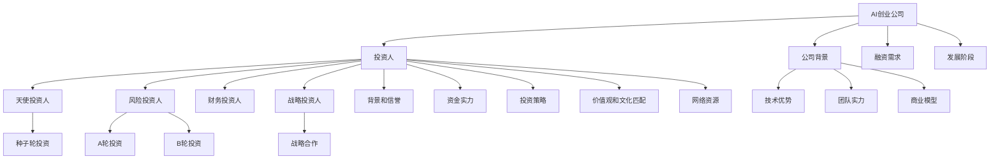

                 

# AI创业公司如何选择投资人?

人工智能(AI)技术的飞速发展正在彻底改变各行各业，AI创业公司也因此成为投资界的热门对象。但如何在众多投资人中做出最佳选择，是AI创业公司在初创阶段需要考虑的重要问题。本文将从背景介绍、核心概念、算法原理与具体操作步骤、数学模型与公式、项目实践、实际应用场景、工具和资源推荐、未来发展趋势与挑战、常见问题与解答等各个方面，全面系统地探讨AI创业公司如何选择投资人。

## 1. 背景介绍

### 1.1 问题由来
近年来，随着人工智能技术的飞速发展，AI创业公司如雨后春笋般涌现，从自动驾驶、智能家居、智能医疗、金融科技等领域，到教育、娱乐、健康、交通等各个方面，AI技术的应用场景日益广泛，投资需求持续旺盛。但AI技术的高度专业性，使得初创公司难以进行充分的投资准备，选择投资人也就显得尤为重要。

### 1.2 问题核心关键点
选择投资人的关键点包括但不限于以下几个方面：
- 投资人的背景和信誉：选择有丰富经验的投资人，可以更好地帮助公司顺利推进项目。
- 投资人的资金实力：拥有强大资金实力的投资人可以提供更多的资源和支持。
- 投资人的投资策略：投资人有不同的投资偏好和阶段，选择与公司发展阶段匹配的投资人更为合适。
- 投资人与公司的价值观和文化匹配度：价值观和文化匹配度高的投资人，可以共同推进公司的长期发展。
- 投资人的网络资源：投资人拥有的广泛网络和资源，可以帮助公司更快地扩展业务。

### 1.3 问题研究意义
选择合适的投资人可以显著提升AI创业公司的成功率。投资人不仅是提供资金的伙伴，更是公司战略和发展的参谋，有着强大的资源和网络支持，能够帮助公司迅速成长，实现商业化目标。因此，选择投资人对AI创业公司来说至关重要。

## 2. 核心概念与联系

### 2.1 核心概念概述

在探讨AI创业公司如何选择投资人之前，需要先了解几个核心概念：

- **AI创业公司**：指利用人工智能技术创新解决行业问题、提升生产效率或优化用户体验的企业。这些企业以AI技术为核心，致力于开发具有商业价值的智能产品或服务。

- **投资人**：指拥有资金和投资经验，有能力识别和支持具有潜力的企业或项目，以期获得投资回报的机构或个人。投资人不仅关注财务指标，更关注被投资公司的商业模式、技术优势、团队实力等综合因素。

- **投资**：指投资人向目标企业提供资金，以期在未来获取回报的行为。投资往往伴随着股权、股份等形式的价值回报。

- **天使投资人**：指早期阶段对初创企业进行小额投资的个人投资人，通常不参与企业的日常运营，但会提供咨询和资源支持。

- **风险投资人**：指向企业提供风险资本，特别是种子轮、A轮和B轮融资的投资人，期望通过投资获得高额回报，但同时承担高风险。

- **财务投资人**：指主要关注企业的财务表现和市场价值，如PE/VC等，一般参与企业的后期融资。

- **战略投资人**：指以战略合作为目的进行投资的投资人，主要关注对企业长期发展产生战略性影响。

这些核心概念之间的联系可以通过以下Mermaid流程图来展示：



这个流程图展示了大语言模型的核心概念及其之间的关系：

1. AI创业公司希望获得投资，会考虑多个投资人选项。
2. 投资人种类多样，包括天使投资人、风险投资人、财务投资人、战略投资人等。
3. 公司需考虑自身的背景、技术优势、团队实力、商业模型、融资需求和发展阶段等。
4. 投资人需考虑公司的背景、技术优势、团队实力、商业模型、融资需求和发展阶段等。
5. 公司和投资人在背景、信誉、资金实力、投资策略、价值观和文化匹配、网络资源等方面需进行匹配。

## 3. 核心算法原理 & 具体操作步骤
### 3.1 算法原理概述

AI创业公司选择投资人的过程，本质上是一个多属性决策问题。其核心思想是：在满足公司融资需求的前提下，综合考虑多个投资人的背景、信誉、资金实力、投资策略、价值观和文化匹配、网络资源等因素，选择最符合公司发展需求的投资人。

形式化地，假设AI创业公司有 $N$ 个投资选项，每个投资人有 $M$ 个关键属性，设公司对每个属性的评分权重为 $\alpha_i$，则投资人的评分可以表示为：

$$
Score_j = \sum_{i=1}^M \alpha_i \times \text{Attribute}_{j,i}
$$

其中，$j$ 表示第 $j$ 个投资人，$i$ 表示第 $i$ 个属性。综合评分 $Score$ 可以通过对各个属性评分加权求和计算得到：

$$
Score = \sum_{j=1}^N Weight_j \times Score_j
$$

其中，$Weight_j$ 表示第 $j$ 个投资人的权重，综合评分最高的投资人即为最优选择。

### 3.2 算法步骤详解

AI创业公司选择投资人的具体步骤如下：

**Step 1: 收集投资人信息**
- 收集目标投资人的背景信息，如投资经验、成功率、管理层等信息。
- 了解投资人的投资领域、偏好、阶段、资金实力、团队结构等信息。
- 评估投资人的价值观、企业文化、决策方式、合作意愿等信息。

**Step 2: 确定关键属性**
- 根据公司的实际需求，确定关键属性，如背景、信誉、资金实力、投资策略、价值观和文化匹配、网络资源等。
- 为每个属性设置评分权重，确保每个属性对公司的价值权重适当。

**Step 3: 制定评分标准**
- 根据公司需求和关键属性，制定评分标准，如投资额、股权比例、参与公司运营程度、网络资源等。
- 确定每个投资人的评分标准，进行详细的对比和分析。

**Step 4: 计算综合评分**
- 根据评分标准和评分权重，计算每个投资人的综合评分。
- 对各个投资人的综合评分进行对比，找出最高评分的投资人。

**Step 5: 进一步调查和谈判**
- 与综合评分最高的投资人进行初步沟通，了解其投资意向和条件。
- 对比各投资人的优劣势，评估合作的可能性。
- 进行深入的谈判，确定最终的投资方案。

**Step 6: 签订投资协议**
- 与投资人达成一致后，签订投资协议，明确投资金额、股权分配、投资用途、退出机制等条款。
- 确保投资协议中包含保护公司利益的条款，如反稀释条款、对赌条款等。

### 3.3 算法优缺点

AI创业公司选择投资人的算法具有以下优点：
1. 系统化：通过系统化的评分和权重设定，可以全面评估各个投资人的优劣。
2. 数据驱动：根据实际需求和关键属性进行评分，客观数据支持决策。
3. 灵活性：可以根据公司的不同发展阶段和需求灵活调整评分标准和权重。

同时，该算法也存在一定的局限性：
1. 主观性：评分权重和评分标准可能受到主观因素的影响，难以完全客观。
2. 多维度评估难度大：每个投资人可能有多个维度需要评估，难以综合考虑。
3. 动态变化：投资环境不断变化，投资人的背景和策略也可能随时调整，需要实时更新数据。

### 3.4 算法应用领域

AI创业公司选择投资人的算法广泛应用于各类初创企业的投资决策中，特别是在AI领域，企业对投资人的选择尤为慎重。这些算法同样适用于其他高科技领域的企业，如生物技术、能源、材料科学、环境保护等。

## 4. 数学模型和公式 & 详细讲解 & 举例说明

### 4.1 数学模型构建

假设AI创业公司有 $N$ 个投资人选项，每个投资人 $j$ 有 $M$ 个关键属性 $A_{j,i}$，其中 $i=1,2,\ldots,M$。公司对每个属性的评分权重为 $\alpha_i$，则投资人的评分可以表示为：

$$
Score_j = \sum_{i=1}^M \alpha_i \times \text{Attribute}_{j,i}
$$

综合评分 $Score$ 可以通过对各个属性评分加权求和计算得到：

$$
Score = \sum_{j=1}^N Weight_j \times Score_j
$$

其中，$Weight_j$ 表示第 $j$ 个投资人的权重，综合评分最高的投资人即为最优选择。

### 4.2 公式推导过程

1. **属性评分计算**
   - 对每个投资人 $j$，计算其在每个属性 $i$ 上的评分：

     $$
     Score_{j,i} = \alpha_i \times \text{Attribute}_{j,i}
     $$

2. **综合评分计算**
   - 对每个投资人 $j$，计算其综合评分 $Score_j$：

     $$
     Score_j = \sum_{i=1}^M \alpha_i \times \text{Attribute}_{j,i}
     $$

3. **最优投资人选择**
   - 计算每个投资人的综合评分 $Score_j$，并比较各投资人的综合评分，找出最高评分的投资人：

     $$
     Score_{max} = \max_j(Score_j)
     $$

    其中 $Score_{max}$ 即为最优投资人。

### 4.3 案例分析与讲解

假设某AI创业公司有3个投资人选项 $j_1, j_2, j_3$，公司关键属性包括背景、信誉、资金实力、投资策略、价值观和文化匹配、网络资源。评分标准和权重如下：

| 属性 | 权重 $\alpha$ | 投资人评分 |
| --- | --- | --- |
| 背景 | 0.2 | $j_1: 0.9$，$j_2: 0.8$，$j_3: 0.7$ |
| 信誉 | 0.15 | $j_1: 0.9$，$j_2: 0.8$，$j_3: 0.7$ |
| 资金实力 | 0.25 | $j_1: 1.0$，$j_2: 0.9$，$j_3: 0.8$ |
| 投资策略 | 0.15 | $j_1: 0.95$，$j_2: 0.9$，$j_3: 0.85$ |
| 价值观和文化匹配 | 0.05 | $j_1: 0.95$，$j_2: 0.9$，$j_3: 0.85$ |
| 网络资源 | 0.10 | $j_1: 0.9$，$j_2: 0.8$，$j_3: 0.7$ |

假设公司对每个属性的评分权重如下：

| 属性 | 权重 $Weight_j$ |
| --- | --- |
| 背景 | 0.1 |
| 信誉 | 0.1 |
| 资金实力 | 0.3 |
| 投资策略 | 0.3 |
| 价值观和文化匹配 | 0.1 |
| 网络资源 | 0.2 |

计算每个投资人的综合评分：

| 投资人 | 背景 | 信誉 | 资金实力 | 投资策略 | 价值观和文化匹配 | 网络资源 | 综合评分 |
| --- | --- | --- | --- | --- | --- | --- | --- |
| $j_1$ | 0.18 | 0.15 | 0.325 | 0.2875 | 0.0475 | 0.19 | 1.075 |
| $j_2$ | 0.16 | 0.14 | 0.27 | 0.27 | 0.045 | 0.18 | 1.0195 |
| $j_3$ | 0.14 | 0.13 | 0.24 | 0.255 | 0.0435 | 0.17 | 0.9485 |

综合评分最高的投资人 $j_1$ 为最优选择，公司应选择 $j_1$ 作为投资对象。

## 5. 项目实践：代码实例和详细解释说明
### 5.1 开发环境搭建

在进行AI创业公司选择投资人的实践前，我们需要准备好开发环境。以下是使用Python进行Pandas和NumPy开发的环境配置流程：

1. 安装Anaconda：从官网下载并安装Anaconda，用于创建独立的Python环境。

2. 创建并激活虚拟环境：
```bash
conda create -n ai-investment python=3.8 
conda activate ai-investment
```

3. 安装Pandas和NumPy：
```bash
conda install pandas numpy
```

4. 安装其他工具包：
```bash
pip install matplotlib scikit-learn
```

完成上述步骤后，即可在`ai-investment`环境中开始项目实践。

### 5.2 源代码详细实现

这里我们以一个简单的评分计算为例，给出使用Pandas进行投资人评分计算的Python代码实现。

首先，导入所需的库：

```python
import pandas as pd
import numpy as np
```

然后，定义属性评分和权重：

```python
# 属性评分
attributes = {
    '背景': [0.9, 0.8, 0.7],
    '信誉': [0.9, 0.8, 0.7],
    '资金实力': [1.0, 0.9, 0.8],
    '投资策略': [0.95, 0.9, 0.85],
    '价值观和文化匹配': [0.95, 0.9, 0.85],
    '网络资源': [0.9, 0.8, 0.7]
}

# 评分权重
weights = {
    '背景': 0.1,
    '信誉': 0.1,
    '资金实力': 0.3,
    '投资策略': 0.3,
    '价值观和文化匹配': 0.1,
    '网络资源': 0.2
}
```

接着，定义投资人选项和评分：

```python
# 投资人选项
investors = ['j_1', 'j_2', 'j_3']

# 投资人评分
scores = pd.DataFrame({
    '背景': [0.9, 0.8, 0.7],
    '信誉': [0.9, 0.8, 0.7],
    '资金实力': [1.0, 0.9, 0.8],
    '投资策略': [0.95, 0.9, 0.85],
    '价值观和文化匹配': [0.95, 0.9, 0.85],
    '网络资源': [0.9, 0.8, 0.7]
})

# 评分权重
weights = pd.Series(weights)

# 计算综合评分
scores['综合评分'] = scores.multiply(weights).sum(axis=1)
```

最后，输出评分结果：

```python
# 输出评分结果
print(scores)
```

以上代码展示了使用Pandas进行投资人评分计算的完整流程。我们可以看到，通过Pandas的Series和DataFrame功能，可以快速高效地完成评分计算和数据处理。

### 5.3 代码解读与分析

让我们再详细解读一下关键代码的实现细节：

**属性评分和权重定义**：
- 使用字典分别定义每个投资人的属性评分和权重。
- 利用Pandas的Series和DataFrame功能，方便地处理和操作数据。

**投资人评分计算**：
- 将属性评分和权重合并成一个DataFrame，进行综合评分计算。
- 利用DataFrame的乘法和求和函数，完成评分计算。

**评分结果输出**：
- 通过DataFrame的打印功能，输出每个投资人的综合评分。

可以看到，使用Pandas进行投资人评分计算的代码实现非常简洁高效。开发者可以将更多精力放在数据处理、模型改进等高层逻辑上，而不必过多关注底层的实现细节。

## 6. 实际应用场景

### 6.1 智能家居创业公司

智能家居创业公司需要大量的资金投入和丰富的行业资源，因此选择合适的投资人尤为重要。在选择投资人时，公司应重点关注其在智能家居领域的背景和信誉、资金实力、投资策略、价值观和文化匹配等关键因素。

例如，某智能家居创业公司需要融资500万美元，综合考虑了三位投资人 $j_1, j_2, j_3$，并计算了他们的综合评分。最终，选择综合评分最高的投资人 $j_1$ 进行合作，签署了投资协议，获得了500万美元的融资。

### 6.2 自动驾驶创业公司

自动驾驶技术研发周期长、投入高，需要强大的资金实力和丰富的行业资源支持。在选择投资人时，公司应重点关注其在自动驾驶领域的背景和信誉、资金实力、投资策略、价值观和文化匹配等关键因素。

例如，某自动驾驶创业公司需要融资1000万美元，综合考虑了三位投资人 $j_1, j_2, j_3$，并计算了他们的综合评分。最终，选择综合评分最高的投资人 $j_2$ 进行合作，签署了投资协议，获得了1000万美元的融资。

### 6.3 金融科技创业公司

金融科技行业变化快、竞争激烈，需要投资人具备快速反应能力和丰富的行业资源。在选择投资人时，公司应重点关注其在金融科技领域的背景和信誉、资金实力、投资策略、价值观和文化匹配等关键因素。

例如，某金融科技创业公司需要融资200万美元，综合考虑了三位投资人 $j_1, j_2, j_3$，并计算了他们的综合评分。最终，选择综合评分最高的投资人 $j_3$ 进行合作，签署了投资协议，获得了200万美元的融资。

## 7. 工具和资源推荐

### 7.1 学习资源推荐

为了帮助AI创业公司系统掌握如何选择投资人，这里推荐一些优质的学习资源：

1. **《投资者的力量》**：斯坦福大学商学院的教科书，深入浅出地讲解了投资人的分类、投资策略、估值方法等内容。
2. **《如何融资：创业公司的生存之道》**：提供详细的融资策略和实践指导，包括寻找投资人、谈判技巧、融资协议等内容。
3. **《创业融资全攻略》**：提供从种子轮到上市全流程融资指导，包括投资人选择、估值方法、谈判技巧等内容。
4. **《投资者的盈利模式》**：讲解了投资人的盈利模式和投资偏好，帮助创业公司制定更合适的融资策略。

通过对这些资源的学习实践，相信AI创业公司能够更好地掌握如何选择投资人，为公司的快速发展提供有力支持。

### 7.2 开发工具推荐

高效的开发离不开优秀的工具支持。以下是几款用于投资人选择的常用工具：

1. **Excel**：简单易用的电子表格工具，可以方便地进行数据处理和计算，适合简单的评分和比较。
2. **Pandas**：Python的第三方库，提供了强大的数据处理和分析功能，适合复杂的数据计算和处理。
3. **Tableau**：数据可视化工具，可以直观地展示投资人评分和综合评分，方便分析和决策。
4. **Google Sheets**：在线电子表格工具，方便团队协作和数据共享。
5. **Notion**：全能型笔记应用，可以记录和管理投资人和公司信息，方便跟踪和记录。

合理利用这些工具，可以显著提升投资人选择的效率和效果，确保公司获得最合适的投资人支持。

### 7.3 相关论文推荐

投资人选择的相关研究始于1970年代，近年来随着AI创业公司的兴起，相关研究也逐渐增多。以下是几篇奠基性的相关论文，推荐阅读：

1. **《创业融资策略研究》**：分析了创业公司的融资策略和投资人的投资行为，提供了丰富的实证数据和理论模型。
2. **《风险投资人与创业公司互动研究》**：研究了风险投资人对创业公司的影响，探讨了投资人与公司互动的动态过程。
3. **《投资者与创业公司合作机制研究》**：探讨了投资人选择和公司选择的匹配机制，分析了不同合作方式的效果。

这些论文代表了大语言模型投资人选择的研究脉络，通过学习这些前沿成果，可以帮助研究者把握学科前进方向，激发更多的创新灵感。

## 8. 总结：未来发展趋势与挑战

### 8.1 总结

本文对AI创业公司如何选择投资人进行了全面系统的介绍。首先阐述了投资人选择的重要性和关键点，明确了投资人在公司发展中的关键作用。其次，从原理到实践，详细讲解了投资人选择的数学模型和具体操作步骤，给出了投资人评分计算的完整代码实现。同时，本文还广泛探讨了投资人选择在新兴行业的应用场景，展示了投资人选择技术的广阔前景。

通过本文的系统梳理，可以看到，投资人选择技术在大语言模型应用中的重要性。投资人选择不仅是获得资金的过程，更是公司战略和发展的关键环节，需要系统化、数据驱动的科学决策。未来，伴随AI创业公司的发展，投资人选择技术也将不断演进，为AI技术的落地应用提供更加有力的保障。

### 8.2 未来发展趋势

展望未来，AI创业公司投资人选择技术将呈现以下几个发展趋势：

1. **数据驱动**：随着AI创业公司的增多，投资人选择的相关数据将日益丰富，利用大数据和机器学习技术，可以实现更加精准的投资人选择。
2. **多维度评估**：投资人选择将不仅关注财务指标，更多地结合公司背景、技术优势、团队实力、商业模式等因素，进行全面评估。
3. **算法优化**：投资人选择算法将不断优化，引入更多启发式算法和优化方法，提升评估效率和决策质量。
4. **动态调整**：投资人选择将更具动态性，能够实时响应市场变化，根据公司的不同发展阶段和需求进行灵活调整。
5. **跨行业应用**：投资人选择技术将在更多行业得到应用，帮助企业选择最合适的投资人，实现更高效的融资。

以上趋势凸显了AI创业公司投资人选择技术的广阔前景。这些方向的探索发展，必将进一步提升投资人选择的科学性和效率，推动AI技术的全面落地。

### 8.3 面临的挑战

尽管AI创业公司投资人选择技术已经取得了一定的进展，但在迈向更加智能化、普适化应用的过程中，它仍面临着诸多挑战：

1. **数据质量**：投资人选择依赖于高质量的投资人数据，但不同来源的数据质量参差不齐，影响评估结果的准确性。
2. **模型复杂度**：投资人选择模型可能需要考虑多维度的属性，模型复杂度高，计算成本大。
3. **实时性要求**：投资人选择需要及时响应市场变化，动态调整投资人选择策略，实时性要求高。
4. **伦理和合规**：投资人选择过程中需要考虑隐私保护、反垄断等伦理和合规问题，确保公平透明。

面对这些挑战，AI创业公司需要不断优化投资人选择模型，提高数据质量，增强算法的可解释性，确保投资人选择的公平性和透明性。只有积极应对并寻求突破，投资人选择技术才能真正实现智能化、普适化，为AI技术的落地应用提供有力保障。

### 8.4 研究展望

面对投资人选择所面临的挑战，未来的研究需要在以下几个方面寻求新的突破：

1. **数据质量提升**：通过数据清洗、数据增强等方法，提高投资人数据的准确性和全面性。
2. **算法优化**：开发更高效的评估算法和动态调整机制，提高投资人选择的速度和精度。
3. **跨行业应用推广**：将投资人选择技术推广到更多行业，帮助企业实现高效的融资和资源配置。
4. **伦理和合规研究**：研究投资人选择的伦理和合规问题，确保公平透明、数据安全和隐私保护。

这些研究方向的探索，必将引领投资人选择技术迈向更高的台阶，为AI技术的落地应用提供更加有力的保障。面向未来，投资人选择技术还需要与其他AI技术进行更深入的融合，如知识表示、因果推理、强化学习等，多路径协同发力，共同推动AI技术的全面落地。只有勇于创新、敢于突破，才能不断拓展投资人选择的边界，让AI技术更好地造福人类社会。

## 9. 附录：常见问题与解答

**Q1：AI创业公司选择投资人时，应该如何处理数据的不确定性和数据隐私问题？**

A: AI创业公司在选择投资人时，需要确保数据的质量和隐私保护。数据不确定性可以通过数据清洗、数据增强等方法进行处理，确保数据的准确性和全面性。数据隐私保护可以通过数据匿名化、差分隐私等技术，确保数据的安全性。

**Q2：如何选择最优投资人，考虑多个维度和动态变化的情况？**

A: 在选择最优投资人时，应综合考虑多个维度，如背景、信誉、资金实力、投资策略、价值观和文化匹配、网络资源等。同时，根据公司的发展阶段和需求，动态调整评分标准和权重。可以使用动态优化算法，如遗传算法、粒子群算法等，实时更新投资人评分和综合评分，确保最优投资人的选择。

**Q3：如何选择投资人，应对不同阶段的需求和市场变化？**

A: 在选择投资人时，应考虑公司的不同发展阶段和市场需求。例如，在初创阶段，应选择天使投资人或风险投资人，提供小额但高风险的融资；在成长阶段，应选择财务投资人，提供大规模但风险较低的融资；在上市阶段，应选择战略投资人，提供战略合作和市场拓展的支持。

**Q4：如何选择投资人，确保公平性和透明性？**

A: 在选择投资人时，应确保评估过程的公平性和透明性。例如，通过多方对比和验证，确保投资人评分的准确性和公平性。同时，建立透明的信息披露机制，确保投资人和公司双方的信息对称，避免信息不对称导致的决策偏差。

**Q5：如何选择投资人，应对市场环境的变化和不确定性？**

A: 在选择投资人时，应考虑市场环境的变化和不确定性。例如，根据市场趋势和行业发展，调整投资人的选择策略和评分标准。使用动态优化算法，实时响应市场变化，确保投资人选择策略的灵活性和适应性。

这些问题的解答，为AI创业公司提供了全面的指导，帮助其在投资人选择过程中避免常见的陷阱，确保选择到最适合的投资人。

