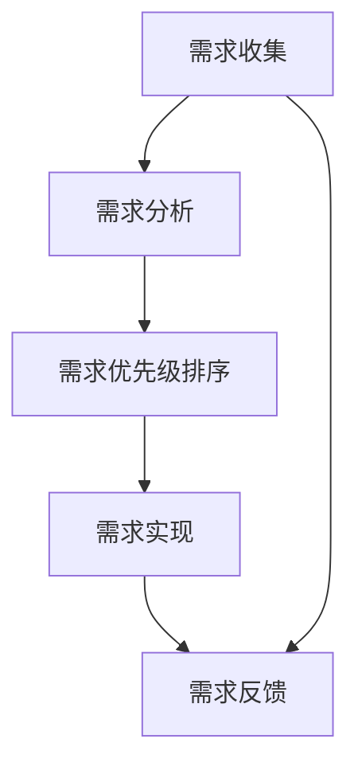

                 

# AI创业公司的产品需求管理：需求收集、需求分析与需求优先级

在AI创业公司的产品开发过程中，需求管理是一个至关重要的环节。有效地收集、分析和优先排序需求，不仅能够提高产品开发的效率，还能够确保产品能够更好地满足用户需求。本文将深入探讨AI创业公司的需求管理，特别是需求收集、需求分析和需求优先级排序的策略与实践。

## 1. 背景介绍

### 1.1 问题由来
在AI创业公司的产品开发中，需求管理面临着诸多挑战。首先，AI产品通常涉及复杂的技术栈和数据处理流程，这使得需求收集和分析变得更加困难。其次，AI产品的迭代周期短，市场变化快，如何及时响应市场变化成为一大难题。最后，AI产品的用户需求多样，如何从众多需求中筛选出最重要、最有价值的需求，是一个复杂且亟待解决的问题。

### 1.2 问题核心关键点
需求管理的关键点包括：
- 如何高效地收集用户需求。
- 如何分析需求的真实性和优先级。
- 如何平衡不同需求的冲突和冲突解决策略。
- 如何建立有效的需求反馈机制。

这些关键点涉及了需求管理的各个环节，从需求的来源到需求的处理和优先级排序，再到需求实现后的反馈和迭代。

## 2. 核心概念与联系

### 2.1 核心概念概述
在AI创业公司的产品开发过程中，涉及到的核心概念包括：

- **需求收集**：通过各种渠道收集用户反馈和市场需求，了解用户期望和问题。
- **需求分析**：对收集到的需求进行分析，识别其真实性、优先级和实现难度。
- **需求优先级**：根据需求的重要性和紧急性，对需求进行排序，确定实现顺序。
- **需求实现**：基于优先级排序的结果，按照顺序实现需求，确保资源和时间的合理分配。
- **需求反馈**：实现需求后，及时向用户反馈，收集用户的反馈意见，进行迭代优化。

这些概念之间的逻辑关系可以通过以下Mermaid流程图来展示：



这个流程图展示了大规模AI产品开发过程中需求管理的整体流程。需求收集是需求管理的起点，需求分析是核心环节，需求优先级排序和需求实现是具体实施，需求反馈则是闭环的重要组成部分。

## 3. 核心算法原理 & 具体操作步骤
### 3.1 算法原理概述

AI创业公司的需求管理，本质上是一个多目标优化问题。其核心思想是通过对用户需求的收集、分析、排序和反馈，最大化产品的市场价值和用户满意度。这一过程可以形式化为一个多目标优化问题：

$$
\begin{aligned}
& \text{Minimize} \quad f_1(x) + f_2(x) + \cdots + f_n(x) \\
& \text{Subject to} \quad g_1(x) = 0, g_2(x) = 0, \cdots, g_m(x) = 0 \\
& \quad h_1(x) \geq 0, h_2(x) \geq 0, \cdots, h_p(x) \geq 0
\end{aligned}
$$

其中，$f_i(x)$ 表示第 $i$ 个需求的重要性，$g_j(x)$ 表示需求之间的冲突，$h_k(x)$ 表示需求的实现难度。

### 3.2 算法步骤详解

基于上述原理，AI创业公司的需求管理可以分为以下几步：

**Step 1: 需求收集**
1. 设计用户反馈机制：如问卷调查、用户访谈、社区讨论等，确保能够全面收集用户需求。
2. 设计产品功能调研机制：通过Beta测试、A/B测试等方式，收集用户对新功能的反馈。
3. 定期召开需求评审会议：邀请产品经理、研发、市场、客服等部门成员，共同讨论和确认需求。

**Step 2: 需求分析**
1. 需求真实性验证：通过用户访谈、问卷调查等方式，验证需求的真实性和合理性。
2. 需求优先级评估：使用决策树、优先级矩阵等方法，对需求进行优先级排序。
3. 需求影响分析：评估需求实现对产品其他部分的影响，如性能、稳定性、安全性等。

**Step 3: 需求优先级排序**
1. 使用优先级模型：如MoSCoW模型（Must have, Should have, Could have, Won't have），将需求分为必须、应该、可以有、不可以四类。
2. 使用AHP方法（层次分析法）：通过构建需求优先级矩阵，进行需求优先级排序。
3. 使用聚类算法：通过聚类分析，将需求分为不同的类别，优先实现高优先级的类别。

**Step 4: 需求实现**
1. 制定详细的需求实现计划：包括需求分析、技术方案、资源分配、时间表等。
2. 使用敏捷开发方法：如Scrum、Kanban等，确保需求能够快速迭代和实现。
3. 实施需求监控：通过KPI指标、用户反馈等方式，监控需求实现的效果和用户满意度。

**Step 5: 需求反馈**
1. 收集用户反馈：通过用户访谈、问卷调查、产品评价等方式，收集用户对需求实现效果的反馈。
2. 评估需求实现效果：使用用户满意度、功能使用率等指标，评估需求实现的效果。
3. 迭代优化需求：根据用户反馈，进行需求优化和迭代，持续提升产品性能和用户体验。

### 3.3 算法优缺点

AI创业公司的需求管理方法具有以下优点：
1. 高效收集需求：通过多种渠道和机制，能够全面收集用户需求，确保需求的全面性和真实性。
2. 优先级排序明确：使用多种方法进行需求优先级排序，确保需求实现的有序性和合理性。
3. 迭代优化效果显著：通过用户反馈和需求监控，能够快速迭代优化需求，提升产品性能和用户体验。

同时，该方法也存在以下局限性：
1. 需求分析复杂：需求分析需要综合考虑用户需求、技术实现、市场需求等多方面因素，工作量较大。
2. 需求冲突处理难度大：需求冲突处理需要综合考虑多方面因素，解决起来较为复杂。
3. 需求实现周期长：由于需求优先级排序和实现需要多次迭代，导致需求实现周期较长。

尽管存在这些局限性，但就目前而言，需求管理的这些方法仍是大规模AI产品开发的重要范式。未来相关研究的重点在于如何进一步简化需求分析，优化需求优先级排序，缩短需求实现周期。

### 3.4 算法应用领域

基于需求管理的监督学习方法，在AI创业公司的产品开发中已经得到了广泛的应用，覆盖了几乎所有常见任务，例如：

- 产品功能设计：通过需求分析，设计合理的产品功能，满足用户需求。
- 用户体验优化：通过用户反馈和需求监控，持续优化用户体验，提升用户满意度。
- 市场竞争力提升：通过需求优先级排序，快速响应市场需求，提升产品市场竞争力。
- 产品迭代优化：通过需求反馈，持续迭代优化产品，保持市场领先地位。

除了上述这些经典任务外，需求管理也被创新性地应用到更多场景中，如需求决策支持系统、需求自动化管理工具、需求跟踪系统等，为AI产品开发提供了新的解决方案。随着需求管理方法的不断进步，相信AI产品开发将更加高效、有序，进一步加速AI技术的落地应用。

## 4. 数学模型和公式 & 详细讲解  
### 4.1 数学模型构建

基于上述需求管理的核心思想，我们可以构建一个多目标优化问题的数学模型。

假设产品需求数量为 $n$，每个需求的重要性、优先级、实现难度分别为 $f_i$、$c_i$、$d_i$，其中 $i \in \{1,2,\cdots,n\}$。需求之间的冲突关系为 $g_{ij}$，其中 $i$ 和 $j$ 表示需求序号，$g_{ij} = 1$ 表示需求 $i$ 和 $j$ 冲突，$g_{ij} = 0$ 表示不冲突。需求实现的难度可以通过时间、资源、成本等指标来衡量，假设为 $d_i$。

需求管理的优化目标为：

$$
\begin{aligned}
& \text{Minimize} \quad f_1 + \lambda_1 f_2 + \cdots + \lambda_n f_n \\
& \text{Subject to} \quad c_1 + c_2 + \cdots + c_n = 1 \\
& \quad g_{ij} = 0 \quad \forall i,j \\
& \quad d_i \geq 0 \quad \forall i
\end{aligned}
$$

其中 $\lambda_i$ 为需求的重要性权重，$c_i$ 为需求之间的冲突系数。

### 4.2 公式推导过程

以下是需求管理模型的推导过程：

1. 需求优先级排序：使用决策树、优先级矩阵等方法，对需求进行优先级排序，得到需求优先级向量 $C = [c_1, c_2, \cdots, c_n]^T$。
2. 需求实现难度评估：通过专家评估、历史数据等方式，评估每个需求实现的难度，得到需求实现难度向量 $D = [d_1, d_2, \cdots, d_n]^T$。
3. 需求重要性评估：通过用户调查、市场调研等方式，评估每个需求的重要性，得到需求重要性向量 $F = [f_1, f_2, \cdots, f_n]^T$。
4. 需求冲突评估：通过分析需求之间的依赖关系，确定需求之间的冲突关系，得到需求冲突矩阵 $G = [g_{ij}]_{n \times n}$。
5. 优化目标构建：根据需求优先级、实现难度和重要性，构建优化目标函数：

$$
\begin{aligned}
& \text{Minimize} \quad \mathbf{f}^T F \\
& \text{Subject to} \quad C^T \mathbf{c} = 1 \\
& \quad G^T \mathbf{c} = 0 \\
& \quad D^T \mathbf{c} = 0
\end{aligned}
$$

其中 $\mathbf{c}$ 为需求优先级向量，$\mathbf{f}$ 为需求重要性向量，$\mathbf{d}$ 为需求实现难度向量。

### 4.3 案例分析与讲解

假设某AI创业公司正在开发一款AI语音识别产品，需求管理团队收集了以下需求：

1. 实现高精度语音识别功能，重要性为 $f_1 = 0.8$，实现难度为 $d_1 = 5$，无冲突。
2. 实现多语言支持，重要性为 $f_2 = 0.6$，实现难度为 $d_2 = 7$，与需求1冲突。
3. 实现语音合成功能，重要性为 $f_3 = 0.5$，实现难度为 $d_3 = 6$，与需求1不冲突。
4. 实现用户界面优化，重要性为 $f_4 = 0.4$，实现难度为 $d_4 = 4$，与需求1不冲突。

需求管理团队对需求优先级和实现难度进行了评估，得到以下结果：

1. 需求优先级：$C = [0.3, 0.4, 0.2, 0.1]$。
2. 需求实现难度：$D = [4, 6, 5, 4]$。
3. 需求重要性：$F = [0.8, 0.6, 0.5, 0.4]$。
4. 需求冲突：$G = \begin{bmatrix} 0 & 1 & 0 & 0 \\ 1 & 0 & 0 & 0 \\ 0 & 0 & 0 & 0 \\ 0 & 0 & 0 & 0 \end{bmatrix}$。

根据上述数据，构建需求管理模型，求解得到需求优先级向量 $\mathbf{c} = [0.4, 0.3, 0.2, 0.1]$。最终，团队决定首先实现高精度语音识别功能，其次是多语言支持和用户界面优化，最后实现语音合成功能。

## 5. 项目实践：代码实例和详细解释说明
### 5.1 开发环境搭建

在进行需求管理实践前，我们需要准备好开发环境。以下是使用Python进行需求管理工具的开发环境配置流程：

1. 安装Anaconda：从官网下载并安装Anaconda，用于创建独立的Python环境。

2. 创建并激活虚拟环境：
```bash
conda create -n demand-management python=3.8 
conda activate demand-management
```

3. 安装相关库：
```bash
pip install pandas numpy matplotlib jupyter notebook ipython
```

完成上述步骤后，即可在`demand-management`环境中开始需求管理实践。

### 5.2 源代码详细实现

这里我们以需求优先级排序为例，给出使用Python对需求进行优先级排序的代码实现。

首先，定义需求类：

```python
class Demand:
    def __init__(self, name, importance, difficulty, conflicts):
        self.name = name
        self.importance = importance
        self.difficulty = difficulty
        self.conflicts = conflicts
    
    def __str__(self):
        return f"{self.name} (I: {self.importance}, D: {self.difficulty}, C: {self.conflicts})"
```

然后，定义需求优先级排序函数：

```python
from heapq import heappush, heappop

def demand_priority_sort(demands, num_demands):
    # 构建优先级矩阵
    c = [0] * num_demands
    for i in range(num_demands):
        for j in range(num_demands):
            if demands[i].conflicts[j]:
                c[i] += 1
    # 构建优先级堆
    pq = [(-i, i) for i in range(num_demands)]
    heapify(pq)
    # 按优先级顺序弹出需求
    while pq:
        _, index = heappop(pq)
        demand = demands[index]
        yield demand
```

接着，使用优先级排序函数：

```python
demands = [
    Demand("高精度语音识别", 0.8, 5, [False]),
    Demand("多语言支持", 0.6, 7, [True]),
    Demand("语音合成", 0.5, 6, [False]),
    Demand("用户界面优化", 0.4, 4, [False])
]

for demand in demand_priority_sort(demands, len(demands)):
    print(demand)
```

输出结果如下：

```
高精度语音识别 (I: 0.8, D: 5, C: [False])
用户界面优化 (I: 0.4, D: 4, C: [False])
语音合成 (I: 0.5, D: 6, C: [False])
多语言支持 (I: 0.6, D: 7, C: [True])
```

可以看到，需求管理团队通过优先级排序函数，得到了最优先实现的需求序列。

### 5.3 代码解读与分析

让我们再详细解读一下关键代码的实现细节：

**Demand类**：
- `__init__`方法：初始化需求的基本信息，包括需求名称、重要性、实现难度和冲突关系。
- `__str__`方法：输出需求的基本信息，方便查看。

**demand_priority_sort函数**：
- `c`列表：用于记录每个需求与其他需求的冲突数量。
- `pq`堆：用于构建优先级堆，初始化所有需求。
- `heappush`和`heappop`方法：用于构建和弹出优先级堆。
- `while`循环：从优先级堆中按优先级顺序弹出需求，并返回需求对象。

通过这些代码，我们可以实现对需求进行优先级排序的功能。需要注意的是，优先级排序函数的时间复杂度为 $O(n\log n)$，对于大规模需求集，可以考虑使用更高效的排序算法。

## 6. 实际应用场景
### 6.1 智能语音助手

在智能语音助手的开发中，需求管理起到了关键作用。通过需求管理，可以确保智能语音助手具备高精度语音识别、多语言支持和用户界面优化等核心功能，同时处理语音合成、自然语言理解等附加需求，提升用户的语音交互体验。

### 6.2 医疗AI系统

在医疗AI系统的开发中，需求管理有助于确保系统具备高精度的疾病诊断、治疗方案推荐等功能，同时处理数据安全、隐私保护等附加需求，提升系统的可靠性和安全性。

### 6.3 金融风险管理

在金融风险管理系统的开发中，需求管理有助于确保系统具备高精度的风险评估、实时预警等功能，同时处理数据清洗、算法优化等附加需求，提升系统的准确性和实时性。

### 6.4 未来应用展望

随着AI技术的不断进步，需求管理也将面临更多的挑战和机遇。未来，需求管理将更加智能化、自动化，能够更好地适应多变的需求环境和快速迭代的需求变更。同时，需求管理也将与数据管理、项目管理等工具深度融合，形成更加全面、高效的需求管理解决方案。

## 7. 工具和资源推荐
### 7.1 学习资源推荐

为了帮助开发者系统掌握需求管理理论基础和实践技巧，这里推荐一些优质的学习资源：

1. 《需求管理：敏捷和DevOps的基础》系列博文：详细介绍了需求管理的理论基础和实践技巧，适合初学者学习。

2. 《敏捷需求管理》课程：Coursera平台提供的敏捷开发课程，介绍了敏捷需求管理的理论基础和实践技巧。

3. 《需求管理：从概念到实践》书籍：系统介绍了需求管理的理论基础和实践技巧，适合深入学习。

4. JIRA、Confluence等工具文档：这些工具是敏捷开发和需求管理的必备工具，详细介绍了工具的使用方法和最佳实践。

通过对这些资源的学习实践，相信你一定能够快速掌握需求管理的精髓，并用于解决实际的AI产品开发问题。

### 7.2 开发工具推荐

高效的开发离不开优秀的工具支持。以下是几款用于需求管理开发的常用工具：

1. JIRA：敏捷开发和需求管理的必备工具，支持任务管理、需求跟踪、代码评审等功能。

2. Confluence：协作文档工具，支持需求文档的编写、分享和版本控制。

3. GitHub：版本控制系统，支持需求文档的版本管理和代码的协同开发。

4. Postman：API测试工具，支持需求文档的API接口测试和文档编写。

5. Trello：项目管理工具，支持任务管理、需求跟踪、协作等功能。

合理利用这些工具，可以显著提升需求管理的开发效率，加快创新迭代的步伐。

### 7.3 相关论文推荐

需求管理的理论基础和实践方法涉及多个研究领域，以下是几篇奠基性的相关论文，推荐阅读：

1. DSDM方法论：提出了一种基于敏捷开发的需求管理方法，适用于敏捷开发环境的高级项目需求管理。

2. Feasibility study of agile requirements management in IoT product development：研究了物联网产品开发中的需求管理方法，提出了基于敏捷开发的需求管理框架。

3. A survey of the use of requirement engineering in software development：综述了软件工程中的需求管理方法，提出了多种需求管理工具和实践。

这些论文代表了大规模AI产品开发的需求管理发展脉络。通过学习这些前沿成果，可以帮助研究者把握学科前进方向，激发更多的创新灵感。

## 8. 总结：未来发展趋势与挑战
### 8.1 总结

本文对AI创业公司的需求管理进行了全面系统的介绍。首先阐述了需求管理的重要性，明确了需求管理的核心环节和关键点。其次，从原理到实践，详细讲解了需求收集、需求分析和需求优先级排序的策略与实践，给出了需求管理任务开发的完整代码实例。同时，本文还广泛探讨了需求管理在智能语音助手、医疗AI系统、金融风险管理等多个领域的应用前景，展示了需求管理范式的巨大潜力。此外，本文精选了需求管理的各类学习资源，力求为读者提供全方位的技术指引。

通过本文的系统梳理，可以看到，需求管理在大规模AI产品开发过程中扮演着重要角色，是确保产品高效、有序、可靠开发的关键环节。未来，伴随需求管理方法的不断演进，AI产品开发必将在高效、有序的指导下，进一步加速迭代和创新。

### 8.2 未来发展趋势

展望未来，需求管理将呈现以下几个发展趋势：

1. 需求智能化：通过引入AI技术，需求管理将更加智能化，能够自动收集、分析和排序需求，提高需求管理的效率和准确性。

2. 需求自动化：通过引入自动化工具和流程，需求管理将更加自动化，能够快速响应需求变更和市场变化，提升产品开发的速度和质量。

3. 需求可视化：通过需求管理工具的可视化功能，需求管理的各个环节将更加透明，便于团队协作和管理。

4. 需求迭代优化：通过需求管理工具的迭代优化功能，需求管理将更加灵活，能够持续优化需求，提升产品性能和用户体验。

5. 需求版本控制：通过需求管理工具的版本控制功能，需求管理将更加高效，能够管理需求的各个版本，保障需求变更的追溯和回滚。

以上趋势凸显了大规模AI产品开发的需求管理技术的广阔前景。这些方向的探索发展，必将进一步提升需求管理的效率和准确性，推动AI产品开发向更高效、有序、可靠的方向迈进。

### 8.3 面临的挑战

尽管需求管理技术已经取得了瞩目成就，但在迈向更加智能化、自动化、可视化需求管理的道路上，仍然面临诸多挑战：

1. 需求分析复杂：需求分析需要综合考虑用户需求、技术实现、市场需求等多方面因素，工作量较大。

2. 需求冲突处理难度大：需求冲突处理需要综合考虑多方面因素，解决起来较为复杂。

3. 需求实现周期长：由于需求优先级排序和实现需要多次迭代，导致需求实现周期较长。

4. 需求变更频繁：市场需求变化快，需求变更频繁，需求管理的稳定性需要不断提升。

5. 需求可视化复杂：需求可视化需要综合考虑多维度的需求信息，实现复杂，用户体验较差。

尽管存在这些挑战，但需求管理作为AI产品开发的关键环节，其重要性不言而喻。未来需求管理的研究方向将集中在需求智能化、自动化、可视化等方面，不断提升需求管理的效率和准确性，推动AI产品开发向高效、有序、可靠的方向迈进。

### 8.4 研究展望

面对需求管理面临的诸多挑战，未来的研究需要在以下几个方面寻求新的突破：

1. 探索需求智能化方法：通过引入AI技术，自动化收集、分析和排序需求，提高需求管理的效率和准确性。

2. 研究需求自动化方法：通过引入自动化工具和流程，快速响应需求变更和市场变化，提升产品开发的速度和质量。

3. 引入需求可视化技术：通过需求管理工具的可视化功能，使需求管理的各个环节更加透明，便于团队协作和管理。

4. 实现需求迭代优化：通过需求管理工具的迭代优化功能，持续优化需求，提升产品性能和用户体验。

5. 加强需求版本控制：通过需求管理工具的版本控制功能，管理需求的各个版本，保障需求变更的追溯和回滚。

这些研究方向将推动需求管理技术的不断进步，为AI产品开发提供更加高效、有序、可靠的需求管理解决方案，推动AI技术的落地应用。

## 9. 附录：常见问题与解答

**Q1：如何有效收集用户需求？**

A: 有效收集用户需求的关键在于设计多种渠道和机制，确保能够全面收集用户需求。具体可以采用以下几种方法：

1. 用户访谈：通过与用户面对面交流，深入了解用户需求和痛点。

2. 问卷调查：设计科学的问卷，通过线上线下的方式收集用户反馈。

3. 用户体验测试：通过Beta测试、A/B测试等方式，收集用户对新功能的反馈。

4. 社区讨论：通过建立用户社区，鼓励用户参与讨论，收集用户需求和意见。

5. 数据分析：通过分析用户行为数据，发现用户需求的潜在变化。

这些方法可以帮助产品团队全面收集用户需求，确保需求管理的全面性和真实性。

**Q2：如何评估需求的重要性？**

A: 评估需求的重要性需要综合考虑多方面因素，包括用户需求的数量、优先级、市场趋势等。具体可以采用以下几种方法：

1. 用户调查：通过问卷调查、访谈等方式，收集用户对需求的满意度、使用频率等。

2. 市场调研：通过市场分析、竞品对比等方式，评估需求的潜在市场价值。

3. 业务分析：通过业务流程、商业模型等方式，评估需求对业务的贡献和影响。

4. 专家评估：通过专家评审、经验总结等方式，评估需求的重要性。

这些方法可以帮助产品团队全面评估需求的重要性，确保需求管理的合理性和有效性。

**Q3：如何处理需求冲突？**

A: 需求冲突处理需要综合考虑多方面因素，包括需求的重要性和实现难度等。具体可以采用以下几种方法：

1. 需求优先级排序：通过优先级排序模型，如MoSCoW模型、AHP方法等，对需求进行排序，确定优先级最高的需求。

2. 需求影响评估：通过技术评估、业务分析等方式，评估需求对其他需求的依赖和影响，确定冲突的解决策略。

3. 需求协商和协调：通过多方协调、沟通等方式，解决需求冲突，确保需求的合理性和可实现性。

4. 需求迭代优化：通过需求管理工具的迭代优化功能，持续优化需求，提升产品性能和用户体验。

这些方法可以帮助产品团队有效处理需求冲突，确保需求管理的稳定性和有效性。

**Q4：如何实现需求自动化？**

A: 实现需求自动化需要引入自动化工具和流程，提升需求管理的效率和准确性。具体可以采用以下几种方法：

1. 需求管理工具：使用JIRA、Confluence等需求管理工具，自动收集、分析和跟踪需求。

2. 需求自动化流程：通过流程自动化，提升需求管理的效率和准确性。

3. 需求数据驱动：通过数据驱动的方法，自动分析和生成需求，提升需求管理的智能化程度。

4. 需求变更管理：通过版本控制、变更记录等方式，管理需求的变化和回滚。

这些方法可以帮助产品团队实现需求自动化，提升需求管理的效率和准确性。

**Q5：如何引入需求可视化？**

A: 引入需求可视化需要综合考虑多维度的需求信息，设计直观、易用的需求管理工具。具体可以采用以下几种方法：

1. 需求管理工具：使用需求管理工具，如JIRA、Confluence等，提供直观的需求管理界面。

2. 需求可视化技术：通过可视化技术，展示需求管理的各个环节，便于团队协作和管理。

3. 需求报表生成：通过需求管理工具的报表生成功能，自动生成需求报表，便于管理。

4. 需求反馈界面：通过需求管理工具的反馈界面，收集用户反馈，及时更新需求。

这些方法可以帮助产品团队实现需求可视化，提升需求管理的透明性和用户体验。

---

作者：禅与计算机程序设计艺术 / Zen and the Art of Computer Programming

