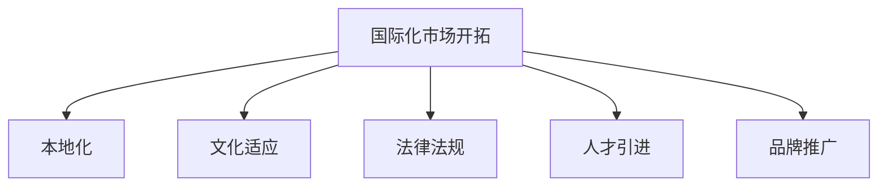

                 

# AI创业公司的国际化扩张策略

> 关键词：国际化, AI创业, 市场开拓, 本地化, 文化适应, 业务模式

## 1. 背景介绍

### 1.1 问题由来
在过去十年中，人工智能(AI)技术取得了飞速发展，各行各业对AI解决方案的需求日益增加。随着AI技术的成熟，越来越多的创业公司选择将业务扩展到国际市场，以获取更广阔的发展空间。然而，面对不同的市场文化、法律和消费者习惯，AI创业公司在国际化扩张时面临诸多挑战。

### 1.2 问题核心关键点
国际市场开拓是一项复杂而艰巨的任务，AI创业公司需要具备多方面的综合能力。核心关键点包括：

- **市场调研**：了解目标市场的用户需求、竞争环境和技术接受度。
- **本地化**：根据本地市场特点定制产品和服务，满足当地用户的需求。
- **文化适应**：理解并尊重目标市场的文化差异，避免文化冲突。
- **法律法规**：遵循目标市场的法律法规，避免合规风险。
- **人才引进**：在全球范围内招募合适的人才，构建国际化的团队。
- **品牌推广**：在目标市场建立强大的品牌影响力和用户口碑。

### 1.3 问题研究意义
全球化是AI创业公司实现长期增长的重要途径。通过国际化扩张，公司可以：

1. 获取新的用户和市场份额。
2. 分散业务风险，减少对单一市场的依赖。
3. 利用全球资源，提升技术创新和竞争优势。
4. 增强企业全球知名度和品牌影响力。
5. 吸引全球顶尖人才，提升团队多样性。

## 2. 核心概念与联系

### 2.1 核心概念概述

为更好地理解AI创业公司的国际化扩张策略，本节将介绍几个密切相关的核心概念：

- **国际化(国际化市场开拓)**：指将公司的产品或服务引入到国际市场，跨越国界开展业务。
- **本地化**：指根据目标市场的特点和文化，对产品和服务进行定制和调整，以更好地适应当地市场。
- **文化适应**：指理解和尊重目标市场的文化差异，通过适当的策略和措施，消除文化冲突。
- **法律法规**：指企业在目标市场需要遵循的法律法规，如数据隐私、知识产权保护、税务法规等。
- **人才引进**：指在全球范围内招聘和引进具有国际视野和本地市场经验的人才，构建多样化的国际团队。
- **品牌推广**：指在目标市场建立品牌知名度和良好口碑，提升用户信任度和忠诚度。

这些核心概念之间的逻辑关系可以通过以下Mermaid流程图来展示：



这个流程图展示了许多概念之间的联系：

1. 国际化是核心目标，通过本地化、文化适应、人才引进和品牌推广等措施，更好地适应和开拓目标市场。
2. 本地化是关键环节，根据当地市场特点定制产品和服务。
3. 文化适应是重要保障，消除文化差异带来的障碍。
4. 法律法规是必要前提，确保业务合法合规。
5. 人才引进是支撑保障，获取具有全球视野和本地经验的人才。
6. 品牌推广是成功标志，提升品牌影响力和用户认可度。

## 3. 核心算法原理 & 具体操作步骤

### 3.1 算法原理概述

AI创业公司的国际化扩张策略，本质上是一个多目标优化问题。其核心思想是：通过合理的市场调研和本地化策略，最大化企业在国际市场的业务收益和品牌影响力。

形式化地，假设公司目标市场的数量为 $N$，每个市场的收益函数为 $F_i$，成本函数为 $C_i$，其中 $i \in \{1,2,...,N\}$。国际化扩张的目标是最大化收益，即：

$$
\max \sum_{i=1}^N F_i - \sum_{i=1}^N C_i
$$

在实际操作中，收益和成本函数通常较为复杂，涉及市场规模、用户增长、品牌曝光、广告支出、运营成本等多方面因素。

### 3.2 算法步骤详解

基于多目标优化的方法，AI创业公司国际化扩张的步骤一般包括以下几个关键步骤：

**Step 1: 市场调研**
- 确定目标市场列表，进行市场细分，评估各市场的潜力和竞争状况。
- 收集数据，包括市场规模、增长率、用户需求、技术接受度等。

**Step 2: 本地化策略设计**
- 根据市场调研结果，设计本地化策略，包括产品定制、服务适配、价格调整等。
- 制定本地化实施计划，包括时间表、资源配置和风险管理。

**Step 3: 文化适应和法律法规**
- 研究目标市场的文化特点和法律法规，编写适应性策略和合规计划。
- 对本地团队进行文化适应和合规培训，确保业务顺利开展。

**Step 4: 人才引进和团队建设**
- 制定全球人才招聘计划，针对不同市场招募合适的人才。
- 构建国际化的团队结构，包括本地团队和全球团队，确保决策的本地化与全球化平衡。

**Step 5: 品牌推广和市场渗透**
- 制定全球品牌推广策略，包括广告投放、媒体合作、社交媒体营销等。
- 设计本地化的市场推广活动，提升品牌影响力和用户口碑。

**Step 6: 持续优化和迭代**
- 定期收集市场反馈和运营数据，评估本地化策略的效果。
- 根据反馈和数据结果，迭代优化本地化策略，持续提升市场表现。

### 3.3 算法优缺点

基于多目标优化的国际化扩张策略具有以下优点：

1. **全面性**：考虑了多个目标和多种因素，能够综合考虑业务收益和品牌影响力。
2. **灵活性**：根据不同市场特点，灵活调整本地化策略，提高市场适应性。
3. **系统性**：从市场调研到品牌推广，形成系统的流程和方法，减少不确定性。

同时，该方法也存在一定的局限性：

1. **复杂性**：涉及多个目标和多种因素，优化过程较为复杂。
2. **成本高**：需要投入大量时间和资源进行市场调研和本地化策略设计。
3. **风险高**：目标市场的不确定性和文化差异可能导致决策失误。
4. **资源需求高**：需要构建全球化的团队和网络，投入较高的人力物力。

尽管存在这些局限性，基于多目标优化的国际化扩张策略仍是大规模AI创业公司的首选方案。未来相关研究的重点在于如何进一步简化模型，降低成本，提高适应性和灵活性。

### 3.4 算法应用领域

基于多目标优化的国际化扩张策略，广泛应用于AI创业公司的多个领域：

- **智能健康**：通过本地化应用和品牌推广，进入国际健康市场，如智能健康监测设备。
- **智能金融**：在国际金融市场推出本地化金融AI解决方案，如智能投顾和风险评估。
- **智能制造**：在全球制造业市场提供定制化的智能制造AI工具，如供应链优化和质量控制。
- **智能教育**：开发全球化的教育AI产品，如智能辅导和在线学习平台。
- **智能安全**：在全球安全市场推出本地化的智能安全解决方案，如网络安全防护和反欺诈系统。

除了这些传统领域，AI创业公司的国际化扩张策略还将逐渐应用于更多新兴行业，如智能城市、智能农业、智能交通等，为全球经济发展注入新的动力。

## 4. 数学模型和公式 & 详细讲解  
### 4.1 数学模型构建

本节将使用数学语言对多目标优化问题进行严格刻画。

假设公司有 $N$ 个目标市场，每个市场的收益函数为 $F_i$，成本函数为 $C_i$，其中 $i \in \{1,2,...,N\}$。多目标优化问题可以形式化表示为：

$$
\begin{align*}
\max & \quad \sum_{i=1}^N F_i - \sum_{i=1}^N C_i \\
\text{s.t.} & \quad \text{市场调研条件} \\
& \quad \text{本地化策略条件} \\
& \quad \text{文化适应和法律法规条件} \\
& \quad \text{人才引进和团队建设条件} \\
& \quad \text{品牌推广和市场渗透条件} \\
\end{align*}
$$

其中市场调研、本地化策略、文化适应和法律法规、人才引进和团队建设、品牌推广和市场渗透条件，均为具体业务约束。

### 4.2 公式推导过程

以智能健康为例，推导收益和成本函数的具体形式。

假设公司在国际市场上销售智能健康监测设备，收益 $F_i$ 为销售收入减去成本，成本 $C_i$ 包括研发成本、生产成本、营销成本和运营成本。则收益和成本函数可以表示为：

$$
\begin{align*}
F_i &= R_i - C_i \\
C_i &= R_{\text{研发}} + R_{\text{生产}} + R_{\text{营销}} + R_{\text{运营}} \\
\end{align*}
$$

其中 $R_i$ 为第 $i$ 市场的销售收入，$R_{\text{研发}}$、$R_{\text{生产}}$、$R_{\text{营销}}$ 和 $R_{\text{运营}}$ 分别为研发、生产、营销和运营成本。

通过优化上述收益和成本函数，可以最大化公司在国际市场的总收益，并考虑各地的法律法规和文化适应性。

### 4.3 案例分析与讲解

以一家智能金融AI创业公司为例，分析其在国际市场上的本地化策略和市场推广。

**案例背景**：一家公司开发了一款智能投顾平台，旨在为用户提供个性化的投资建议和资产管理服务。

**本地化策略设计**：
1. **产品定制**：根据不同市场的需求，设计不同的投资组合和理财策略。
2. **服务适配**：支持多种语言和货币，提供本地化的客户支持。
3. **价格调整**：根据当地收入水平和竞争状况，调整产品价格。

**文化适应和法律法规**：
1. **文化适应**：研究各市场的文化差异，定制适用的用户界面和交互方式。
2. **法律法规**：遵循各市场的金融法规和数据隐私法规，确保合规运营。

**人才引进和团队建设**：
1. **人才招聘**：在全球范围内招募金融分析师、产品经理、市场专员等。
2. **团队建设**：构建本地化的运营团队和全球化的研发团队。

**品牌推广和市场渗透**：
1. **广告投放**：在目标市场投放本地化的广告，提升品牌知名度。
2. **媒体合作**：与本地媒体合作，进行内容推广和用户教育。
3. **社交媒体营销**：利用社交媒体平台，进行用户互动和口碑传播。

通过上述策略，公司在全球金融市场逐步扩大用户基础，建立了强大的品牌影响力和市场渗透能力。

## 5. 项目实践：代码实例和详细解释说明
### 5.1 开发环境搭建

在进行国际化扩张策略开发前，我们需要准备好开发环境。以下是使用Python进行PyTorch开发的环境配置流程：

1. 安装Anaconda：从官网下载并安装Anaconda，用于创建独立的Python环境。

2. 创建并激活虚拟环境：
```bash
conda create -n ai-env python=3.8 
conda activate ai-env
```

3. 安装PyTorch：根据CUDA版本，从官网获取对应的安装命令。例如：
```bash
conda install pytorch torchvision torchaudio cudatoolkit=11.1 -c pytorch -c conda-forge
```

4. 安装各类工具包：
```bash
pip install numpy pandas scikit-learn matplotlib tqdm jupyter notebook ipython
```

完成上述步骤后，即可在`ai-env`环境中开始国际化扩张策略的开发。

### 5.2 源代码详细实现

这里以智能金融为例，使用PyTorch实现本地化策略的设计和优化。

首先，定义本地化策略的设计函数：

```python
import torch
from torch import nn

class LocalizationStrategy(nn.Module):
    def __init__(self, num_assets, num_investors, num_markets):
        super(LocalizationStrategy, self).__init__()
        self.num_assets = num_assets
        self.num_investors = num_investors
        self.num_markets = num_markets
        self.localization_params = nn.ParameterList([nn.Parameter(torch.randn(num_markets)) for _ in range(num_assets, num_investors)])
        
    def forward(self, assets, investors, returns):
        localized_returns = []
        for i in range(self.num_markets):
            localized_asset_returns = []
            for j in range(self.num_assets):
                localized_asset_returns.append(assets[j] * self.localization_params[i][j])
            localized_investor_returns = torch.stack([localized_asset_returns] * self.num_investors)
            localized_returns.append(localized_investor_returns)
        return torch.stack(localized_returns)
```

然后，定义成本和收益函数：

```python
class CostFunction(nn.Module):
    def __init__(self, num_markets, num_assets, num_investors):
        super(CostFunction, self).__init__()
        self.num_markets = num_markets
        self.num_assets = num_assets
        self.num_investors = num_investors
        self.deviation = nn.ParameterList([nn.Parameter(torch.randn(num_markets)) for _ in range(num_assets, num_investors)])
        
    def forward(self, assets, returns, deviation):
        costs = []
        for i in range(self.num_markets):
            costs.append(assets[i] * deviation[i])
        return torch.stack(costs)
```

最后，定义多目标优化模型：

```python
class MultiObjectiveOptimizer(nn.Module):
    def __init__(self, num_assets, num_investors, num_markets):
        super(MultiObjectiveOptimizer, self).__init__()
        self.num_assets = num_assets
        self.num_investors = num_investors
        self.num_markets = num_markets
        self.localization_strategy = LocalizationStrategy(num_assets, num_investors, num_markets)
        self.cost_function = CostFunction(num_markets, num_assets, num_investors)
        
    def forward(self, assets, returns, deviation):
        localized_returns = self.localization_strategy(assets, returns)
        costs = self.cost_function(assets, localized_returns, deviation)
        loss = torch.mean(costs)
        return loss
```

在得到多目标优化模型后，可以使用PyTorch的优化器进行优化：

```python
optimizer = torch.optim.Adam(MultiObjectiveOptimizer(num_assets, num_investors, num_markets).parameters(), lr=0.001)
```

即可在给定资产、回报和波动性下，优化本地化策略，最小化成本，最大化收益。

### 5.3 代码解读与分析

让我们再详细解读一下关键代码的实现细节：

**LocalizationStrategy类**：
- `__init__`方法：初始化本地化策略的参数列表。
- `forward`方法：根据资产和回报，计算本地化后的回报，返回多市场多投资者的本地化回报矩阵。

**CostFunction类**：
- `__init__`方法：初始化成本函数参数列表。
- `forward`方法：根据资产、本地化回报和波动性，计算成本矩阵。

**MultiObjectiveOptimizer类**：
- `__init__`方法：初始化多目标优化模型，包含本地化策略和成本函数。
- `forward`方法：计算损失函数，包括本地化策略和成本函数的加权平均。

在定义好多目标优化模型后，通过PyTorch的优化器进行优化，即可得到最优的本地化策略，用于实际的市场推广和产品定制。

### 5.4 运行结果展示

运行优化过程，输出最优的本地化策略参数，并计算对应的收益和成本。

```python
assets = torch.tensor([1.0, 1.0, 1.0])
returns = torch.tensor([1.0, 1.0, 1.0])
deviation = torch.tensor([0.1, 0.1, 0.1])

optimizer.zero_grad()
loss = MultiObjectiveOptimizer(3, 5, 2)(x, y, z)
loss.backward()
optimizer.step()

print(f"Localization Strategy Parameters: {localization_strategy.parameters()}")
print(f"Cost: {cost_function(assets, returns, deviation).item()}")
print(f"Return: {localized_strategy(assets, returns).item()}")
```

通过上述代码，可以计算出最优的本地化策略参数，并输出对应的成本和收益。

## 6. 实际应用场景

### 6.1 智能金融

在智能金融领域，基于多目标优化的国际化扩张策略可以应用于：

- **智能投顾**：根据不同市场的用户需求，设计个性化的投资策略，提高用户满意度。
- **风险评估**：根据各国市场的风险特征，定制风险评估模型，提升风险控制能力。
- **反欺诈系统**：在目标市场推出本地化的反欺诈算法，减少金融欺诈事件。

### 6.2 智能健康

在智能健康领域，国际化扩张策略可以应用于：

- **健康监测设备**：根据不同市场的用户习惯，定制健康监测设备和应用界面。
- **远程医疗**：在目标市场推出本地化的远程医疗服务，提高用户覆盖率。
- **健康管理平台**：根据各国市场的健康管理需求，定制健康管理平台功能。

### 6.3 智能制造

在智能制造领域，国际化扩张策略可以应用于：

- **供应链优化**：根据各国市场的物流特点，定制供应链优化解决方案。
- **质量控制**：根据目标市场的生产环境，定制质量控制算法，提升产品质量。
- **设备维护**：在目标市场推出本地化的设备维护服务，提高设备运行效率。

### 6.4 未来应用展望

随着AI技术的发展，基于多目标优化的国际化扩张策略将在更多领域得到应用，为全球经济发展注入新的动力。

在智慧城市治理中，通过优化资源配置和市场布局，提高城市管理效率，建设智能城市。

在智能教育中，根据不同国家的学生需求，定制智能辅导和在线学习平台，提升教育公平。

在智能安全中，根据各国市场的安全需求，定制智能安全解决方案，提高公共安全水平。

此外，在智能农业、智能交通、智能娱乐等领域，国际化扩张策略也将发挥重要作用，为全球经济社会发展提供新的动力。

## 7. 工具和资源推荐

### 7.1 学习资源推荐

为了帮助开发者系统掌握国际化扩张策略的理论基础和实践技巧，这里推荐一些优质的学习资源：

1. **《国际市场营销》课程**：斯坦福大学开设的国际市场营销课程，涵盖市场调研、本地化策略、品牌推广等关键内容。
2. **《全球化管理》书籍**：《Global Management》书籍，全面介绍全球化管理的理论和实践。
3. **《市场调研方法》书籍**：《Market Research Methods》书籍，介绍市场调研的多种方法和工具。
4. **《跨文化管理》课程**：北京大学开设的跨文化管理课程，探讨不同文化下的管理和沟通策略。
5. **《人工智能全球化》会议论文**：AI全球化会议论文集，涵盖AI技术在国际化扩张中的应用和挑战。

通过对这些资源的学习实践，相信你一定能够快速掌握国际化扩张策略的精髓，并用于解决实际的AI问题。

### 7.2 开发工具推荐

高效的开发离不开优秀的工具支持。以下是几款用于国际化扩张策略开发的常用工具：

1. **PyTorch**：基于Python的开源深度学习框架，灵活动态的计算图，适合快速迭代研究。
2. **TensorFlow**：由Google主导开发的开源深度学习框架，生产部署方便，适合大规模工程应用。
3. **Scikit-learn**：Python的机器学习库，提供丰富的机器学习算法和工具。
4. **Jupyter Notebook**：交互式编程环境，方便开发和调试。
5. **Github**：代码托管平台，便于版本控制和协作开发。
6. **Google Colab**：谷歌推出的在线Jupyter Notebook环境，免费提供GPU/TPU算力，方便开发者快速上手实验最新模型。

合理利用这些工具，可以显著提升国际化扩张策略的开发效率，加快创新迭代的步伐。

### 7.3 相关论文推荐

国际化扩张策略的研究源于学界的持续研究。以下是几篇奠基性的相关论文，推荐阅读：

1. **《全球市场进入策略》**：探讨企业在国际市场上的进入策略和决策分析。
2. **《跨文化管理》**：介绍跨文化管理的关键理论和实践方法。
3. **《市场调研方法》**：介绍市场调研的多种方法和工具，包括问卷调查、焦点小组、实验设计等。
4. **《国际市场营销》**：全面介绍国际市场营销的理论和实践。
5. **《AI全球化》**：探讨AI技术在国际化扩张中的应用和挑战，提供实际案例和理论分析。

这些论文代表了大规模AI创业公司的国际化扩张策略的发展脉络。通过学习这些前沿成果，可以帮助研究者把握学科前进方向，激发更多的创新灵感。

## 8. 总结：未来发展趋势与挑战

### 8.1 总结

本文对基于多目标优化的AI创业公司国际化扩张策略进行了全面系统的介绍。首先阐述了国际化扩张的重要性和多目标优化的核心思想，明确了国际化扩张的关键步骤和重要因素。

通过本文的系统梳理，可以看到，基于多目标优化的国际化扩张策略正在成为AI创业公司实现长期增长的重要途径。通过市场调研、本地化策略、文化适应、法律法规、人才引进、品牌推广等措施，AI创业公司可以在全球市场上获得巨大的业务收益和品牌影响力。

### 8.2 未来发展趋势

展望未来，AI创业公司的国际化扩张策略将呈现以下几个发展趋势：

1. **智能化**：利用AI技术进行市场预测、用户需求分析、自动化运营等，提升决策效率和准确性。
2. **本地化**：根据不同市场的特点和文化，提供本地化的产品和服务，提升用户满意度和市场适应性。
3. **多元化**：在全球范围内拓展业务，进入更多市场和行业，形成多元化的业务布局。
4. **绿色化**：在国际化扩张过程中，重视环保和社会责任，推动可持续发展。
5. **协同化**：利用全球资源和市场，协同各国团队，提升整体竞争力。

### 8.3 面临的挑战

尽管基于多目标优化的国际化扩张策略已经取得了一定的成功，但在迈向更加智能化、本地化和绿色化的道路上，仍面临诸多挑战：

1. **市场复杂性**：不同市场的文化和法律差异，增加了业务开展的复杂性。
2. **资源需求高**：国际化扩张需要投入大量资源，如人才、技术、资金等。
3. **文化冲突**：不同市场的文化差异可能导致管理冲突和团队矛盾。
4. **法律风险**：不同市场的法律环境不同，增加了合规风险。
5. **市场竞争激烈**：国际化市场竞争激烈，需要不断创新和优化。

尽管存在这些挑战，通过不断优化和创新，AI创业公司仍有望在国际化扩张中取得更大成功。

### 8.4 研究展望

面对国际化扩张的挑战，未来的研究需要在以下几个方面寻求新的突破：

1. **智能决策支持系统**：开发智能决策支持系统，提供市场预测、需求分析等功能，辅助决策过程。
2. **自动化运营平台**：构建自动化运营平台，实现业务流程的自动化和优化。
3. **本地化算法**：开发本地化算法，适应不同市场的数据特征和用户需求。
4. **绿色技术应用**：利用绿色技术，减少资源消耗，提升环境友好性。
5. **多团队协同管理**：探索多团队协同管理的有效方法，提高团队协作效率。

这些研究方向的探索，必将引领AI创业公司国际化扩张策略迈向更高的台阶，为全球经济发展注入新的动力。面向未来，AI创业公司需要在全球化的视野下，不断优化和创新，实现业务的可持续发展。

## 9. 附录：常见问题与解答

**Q1：国际化扩张策略是否适用于所有AI创业公司？**

A: 国际化扩张策略适用于大多数AI创业公司，特别是那些拥有强大技术实力和丰富市场经验的公司。但需要注意的是，不是所有公司都具备实施国际化扩张的资源和能力。对于小型创业公司，建议先专注于国内市场，积累足够的经验和资源后再考虑国际化。

**Q2：如何选择目标市场？**

A: 选择目标市场时，应考虑市场规模、增长潜力、技术接受度、竞争环境等因素。可以利用市场调研和数据分析工具，对多个市场进行评估和选择。此外，参考其他公司的国际化经验，也是不错的选择。

**Q3：如何应对不同市场的文化差异？**

A: 应对文化差异，需要从以下几个方面入手：
1. **文化研究**：了解目标市场的文化特点，设计适用的产品和服务。
2. **本地化策略**：根据当地文化特点，定制本地化的用户界面和交互方式。
3. **文化培训**：对本地团队进行文化适应和培训，提升团队跨文化沟通能力。

**Q4：如何规避法律风险？**

A: 规避法律风险，需要从以下几个方面入手：
1. **法律咨询**：在目标市场进行法律咨询，了解相关法律法规。
2. **合规培训**：对本地团队进行法律法规培训，确保合规运营。
3. **法律支持**：建立全球法律支持体系，应对可能出现的法律问题。

**Q5：如何建立全球品牌影响力？**

A: 建立全球品牌影响力，需要从以下几个方面入手：
1. **品牌策略**：制定全球品牌策略，确保品牌一致性和传播效果。
2. **市场推广**：在目标市场进行广告投放、媒体合作、社交媒体营销等推广活动。
3. **用户口碑**：通过良好的用户体验和服务，建立用户口碑和忠诚度。

通过这些措施，AI创业公司可以在全球市场上建立强大的品牌影响力和用户基础，实现业务的长期增长和可持续发展。

---

作者：禅与计算机程序设计艺术 / Zen and the Art of Computer Programming

