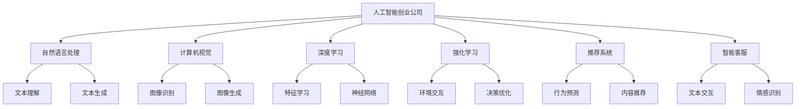

                 

# AI创业公司的市场前景

在过去十年里，人工智能(AI)技术以惊人的速度发展，并迅速渗透到各行各业，改变了我们的工作方式、生产模式和日常生活。随着AI技术的成熟和普及，越来越多的创业公司开始涌现，将AI技术应用到各种垂直领域，为企业和消费者创造价值。本文将探讨AI创业公司的市场前景，分析其在当前和未来可能的发展趋势和面临的挑战。

## 1. 背景介绍

### 1.1 人工智能的崛起

人工智能技术的崛起得益于算力的提升和数据的积累。大数据、云计算、深度学习等技术的发展，使得AI算法可以处理更复杂的任务，而越来越多的数据集为AI模型的训练提供了可能。AI技术的进步，尤其是深度学习算法的突破，使机器在视觉、语音、自然语言处理等领域的表现，接近甚至超越人类，推动了人工智能的全面应用。

### 1.2 AI创业公司的兴起

随着AI技术的日渐成熟和落地应用的需求增长，创业公司如雨后春笋般涌现，专注于AI技术的创新和应用。这些公司涵盖计算机视觉、自然语言处理、智能推荐、智能客服、智能安防等各个领域，将AI技术与具体业务场景相结合，解决实际问题，提供创新服务。

## 2. 核心概念与联系

### 2.1 核心概念概述

- **人工智能创业公司(AI Startups)**：指专门从事AI技术研发和应用的创业公司，致力于将AI技术应用于各行各业，提供智能解决方案。
- **人工智能(AI)**：基于计算机科学和认知科学的原理，使机器能够模仿人类智能行为的技术。
- **自然语言处理(NLP)**：研究计算机如何处理和理解人类语言的技术。
- **计算机视觉(CV)**：研究如何让计算机理解、解析和解释图像和视频数据的科学和技术。
- **深度学习(Deep Learning)**：一种模拟人类神经网络的机器学习技术，通过多层神经网络模型，从大量数据中自动学习和提取特征。
- **强化学习(Reinforcement Learning)**：一种通过试错学习最优决策的机器学习方法。
- **推荐系统(Recommendation Systems)**：利用用户行为数据，为用户提供个性化推荐的系统。
- **智能客服(Chatbot)**：使用AI技术自动处理客户咨询的智能对话系统。

### 2.2 核心概念原理和架构的 Mermaid 流程图



这个流程图展示了AI创业公司如何通过不同的AI技术解决具体问题，提供智能服务：

1. 利用自然语言处理技术理解文本数据。
2. 通过计算机视觉技术解析图像数据。
3. 应用深度学习技术自动学习数据特征和模式。
4. 借助强化学习技术优化决策策略。
5. 利用推荐系统提供个性化内容和服务。
6. 使用智能客服系统进行自动化客户服务。

## 3. 核心算法原理 & 具体操作步骤

### 3.1 算法原理概述

AI创业公司的核心算法原理主要围绕着机器学习和深度学习展开。这些技术能够使机器从大量数据中学习，并提取特征和模式，以执行特定的任务。以下是几个关键算法及其原理：

- **神经网络**：通过模拟人类大脑的神经元结构，神经网络能够处理和学习数据。深度学习中的多层神经网络模型，进一步提升了特征提取和模式识别的能力。
- **卷积神经网络(CNN)**：专门用于处理图像数据的神经网络，通过卷积和池化操作，能够自动提取图像特征。
- **循环神经网络(RNN)**：适用于处理序列数据的神经网络，能够捕捉时间依赖关系，用于自然语言处理和语音识别等任务。
- **长短期记忆网络(LSTM)**：一种特殊的RNN，能够更好地处理长期依赖关系，适用于机器翻译和文本生成等任务。
- **生成对抗网络(GAN)**：由生成器和判别器组成的网络，通过对抗训练，能够生成逼真的新数据。

### 3.2 算法步骤详解

AI创业公司的算法开发通常遵循以下步骤：

1. **数据收集与预处理**：收集相关的数据集，并进行清洗、归一化和标注等预处理。
2. **模型选择与构建**：选择合适的深度学习模型，并进行模型构建和初始化。
3. **模型训练与调优**：利用训练数据对模型进行训练，调整超参数和模型结构，以提升性能。
4. **模型评估与部署**：在测试数据集上评估模型性能，部署模型并集成到业务系统中。
5. **持续改进与迭代**：根据业务反馈和最新数据，不断优化模型，并进行迭代升级。

### 3.3 算法优缺点

AI创业公司的算法具有以下优点：

- **高效率**：AI算法能够在短时间内处理和分析大量数据，提供快速响应。
- **高精度**：深度学习算法在许多领域已达到或接近人类水平的表现。
- **可扩展性**：AI模型可以通过不断训练和优化，提升性能和应用范围。

同时，AI算法也存在一些缺点：

- **数据依赖**：AI算法的性能高度依赖于训练数据的质量和数量。
- **黑盒问题**：许多AI模型缺乏可解释性，难以理解其内部决策逻辑。
- **计算资源要求高**：AI模型往往需要高性能的计算资源进行训练和推理。

### 3.4 算法应用领域

AI创业公司涉及的算法应用领域广泛，包括但不限于：

- **计算机视觉**：智能监控、医学影像分析、自动驾驶等。
- **自然语言处理**：智能客服、文本分类、情感分析等。
- **推荐系统**：电商推荐、新闻推荐、社交网络推荐等。
- **智能机器人**：工业机器人、服务机器人、家庭机器人等。
- **智能安防**：视频监控、入侵检测、身份识别等。

## 4. 数学模型和公式 & 详细讲解 & 举例说明

### 4.1 数学模型构建

在AI创业公司的算法开发中，数学模型和公式起到了至关重要的作用。以下是一些常见的数学模型和公式：

- **线性回归模型**：用于建立输入和输出之间的关系，公式为 $y=\theta^Tx+b$，其中 $\theta$ 为权重，$b$ 为偏置。
- **逻辑回归模型**：用于二分类任务，公式为 $P(y=1|x)=\sigma(\theta^Tx+b)$，其中 $\sigma$ 为Sigmoid函数。
- **神经网络模型**：通过多层神经元之间的连接和激活函数，构建复杂的非线性模型，公式为 $y=\sigma(W_nx+b_n)$，其中 $W_n$ 为权重矩阵，$b_n$ 为偏置向量。
- **卷积神经网络(CNN)**：通过卷积操作提取图像特征，公式为 $y=f(\mathcal{F}(x;\theta))$，其中 $\mathcal{F}$ 为卷积操作。
- **循环神经网络(RNN)**：通过循环连接处理序列数据，公式为 $y_t=f(W_hh_t+W_xx_t+b_h)$，其中 $y_t$ 为当前时间步的输出，$h_t$ 为隐藏状态，$x_t$ 为输入数据。

### 4.2 公式推导过程

以卷积神经网络(CNN)为例，介绍其公式推导过程：

- **卷积操作**：假设输入数据为 $x_{i,j}$，卷积核为 $w_{k,l}$，卷积操作公式为 $y_{m,n}=\sum_{i=0}^{d_h-1}\sum_{j=0}^{d_w-1}x_{i,j}\ast w_{i+j,m+n-k,l}$，其中 $d_h$ 和 $d_w$ 分别为卷积核的高度和宽度，$k$ 和 $l$ 分别为卷积核的步长和填充量。
- **激活函数**：通过激活函数 $f$ 将卷积后的结果进行非线性变换，常用的激活函数包括ReLU、Sigmoid等。
- **池化操作**：通过池化操作降低特征图的维度，常用池化方式包括最大池化和平均池化，公式为 $y_{i,j}=\max_{k,l}f(x_{k,l})$ 或 $y_{i,j}=\frac{1}{d_hd_w}\sum_{k,l}f(x_{k,l})$，其中 $f$ 为激活函数，$d_h$ 和 $d_w$ 分别为池化核的高度和宽度。

### 4.3 案例分析与讲解

以图像分类为例，介绍CNN模型的应用：

- **数据准备**：收集和标注大量的图像数据集，如ImageNet。
- **模型构建**：构建多层的卷积神经网络，包括卷积层、池化层、全连接层等。
- **训练与调优**：利用训练集对模型进行训练，调整学习率和正则化参数，以提升模型性能。
- **测试与评估**：在测试集上评估模型性能，调整模型参数，直至达到理想的分类准确率。

## 5. 项目实践：代码实例和详细解释说明

### 5.1 开发环境搭建

要开发AI创业公司的算法，首先需要搭建相应的开发环境。以下是一些常用的开发环境搭建步骤：

1. **安装Python**：Python是AI开发的主要语言，可以从官网下载并安装最新版本。
2. **安装深度学习框架**：常用的深度学习框架包括TensorFlow、PyTorch、Keras等，需要根据项目需求选择合适的框架。
3. **安装工具库**：安装常用的工具库，如NumPy、Pandas、Matplotlib等。
4. **安装GPU驱动**：如果需要进行GPU加速，需要安装相应的GPU驱动和CUDA工具包。
5. **安装Docker**：Docker是一个容器化工具，可以帮助开发者更方便地进行模型部署和测试。

### 5.2 源代码详细实现

以图像分类为例，介绍CNN模型的代码实现：

```python
import tensorflow as tf
from tensorflow.keras import layers, models

# 定义卷积神经网络模型
model = models.Sequential()
model.add(layers.Conv2D(32, (3, 3), activation='relu', input_shape=(28, 28, 1)))
model.add(layers.MaxPooling2D((2, 2)))
model.add(layers.Conv2D(64, (3, 3), activation='relu'))
model.add(layers.MaxPooling2D((2, 2)))
model.add(layers.Conv2D(64, (3, 3), activation='relu'))
model.add(layers.Flatten())
model.add(layers.Dense(64, activation='relu'))
model.add(layers.Dense(10, activation='softmax'))

# 编译模型
model.compile(optimizer='adam',
              loss='categorical_crossentropy',
              metrics=['accuracy'])

# 训练模型
model.fit(train_images, train_labels, epochs=10, batch_size=32)

# 评估模型
test_loss, test_acc = model.evaluate(test_images, test_labels)
print('Test accuracy:', test_acc)
```

### 5.3 代码解读与分析

上述代码展示了如何使用TensorFlow构建一个简单的CNN模型。具体分析如下：

- **定义模型结构**：使用Sequential模型，依次添加卷积层、池化层、全连接层等。
- **编译模型**：设置优化器、损失函数和评估指标。
- **训练模型**：在训练集上使用fit方法进行模型训练。
- **评估模型**：在测试集上使用evaluate方法评估模型性能。

## 6. 实际应用场景

### 6.1 智能监控

AI创业公司可以利用计算机视觉技术，开发智能监控系统。该系统通过摄像头实时采集视频数据，使用AI算法进行人脸识别、行为分析和异常检测，从而提高安全性和效率。智能监控系统可以用于公共场所、工业园区、银行等高安全性需求的地方。

### 6.2 医学影像分析

AI创业公司可以开发医学影像分析系统，帮助医生快速、准确地分析X光片、CT等影像数据。系统利用深度学习模型，自动识别和标注病灶区域，辅助医生进行诊断和治疗决策。医学影像分析系统可以广泛应用于医院、诊所等医疗机构。

### 6.3 自动驾驶

AI创业公司可以开发自动驾驶系统，利用计算机视觉和深度学习技术，实现车辆的自主驾驶和避障。该系统通过摄像头、雷达等传感器，实时获取道路环境信息，并使用AI算法进行决策和控制，从而实现安全、高效的自动驾驶。自动驾驶系统可以应用于汽车、无人机等移动设备。

### 6.4 未来应用展望

未来，AI创业公司将在更多领域发挥重要作用。以下列举一些可能的应用方向：

- **智能家居**：利用智能语音助手和计算机视觉技术，提升家居生活的便利性和智能化水平。
- **个性化推荐**：利用推荐系统，为用户提供个性化内容和服务，如电商推荐、新闻推荐等。
- **智能客服**：利用智能客服系统，自动处理客户咨询，提升服务质量和效率。
- **智能安防**：利用智能安防系统，实时监测和分析视频数据，提升安全防护能力。
- **智能医疗**：利用医学影像分析和自然语言处理技术，辅助医生进行诊断和治疗。

## 7. 工具和资源推荐

### 7.1 学习资源推荐

为了帮助开发者系统掌握AI创业公司的核心技术，以下是一些优质的学习资源：

1. **深度学习入门**：深入浅出地介绍了深度学习的基本概念和常用算法。
2. **计算机视觉实战**：通过实践项目，帮助开发者掌握计算机视觉技术的应用。
3. **自然语言处理基础**：详细讲解自然语言处理的基本技术和常用算法。
4. **推荐系统算法**：介绍推荐系统的算法原理和应用场景。
5. **智能客服开发**：讲解智能客服系统的开发流程和实现方法。

### 7.2 开发工具推荐

以下是一些常用的AI创业公司开发工具：

1. **TensorFlow**：由Google开发的深度学习框架，支持多种平台和设备。
2. **PyTorch**：由Facebook开发的深度学习框架，以其易用性和灵活性著称。
3. **Keras**：基于TensorFlow和Theano的高级深度学习框架，简单易用，适合初学者。
4. **Jupyter Notebook**：一个交互式的开发环境，支持Python代码的实时运行和展示。
5. **GitHub**：全球最大的代码托管平台，提供丰富的开源项目和协作工具。

### 7.3 相关论文推荐

以下是几篇具有代表性的AI创业公司相关论文：

1. **ImageNet Large Scale Visual Recognition Challenge**：介绍ImageNet大规模视觉识别挑战赛，展示了深度学习在图像分类上的突破。
2. **Google AI Blog**：谷歌人工智能博客，提供最新的AI研究成果和应用案例。
3. **Kaggle**：全球最大的数据科学竞赛平台，提供丰富的数据集和竞赛项目。

## 8. 总结：未来发展趋势与挑战

### 8.1 研究成果总结

AI创业公司在过去十年中取得了显著的进展，广泛应用于计算机视觉、自然语言处理、智能推荐等领域。这些技术的应用不仅提升了企业的效率和竞争力，也极大地改善了人们的生活质量。

### 8.2 未来发展趋势

未来，AI创业公司将继续快速发展，呈现以下几个趋势：

- **技术融合**：AI技术与物联网、云计算、大数据等技术的深度融合，将推动AI应用向更多领域扩展。
- **模型压缩**：随着硬件资源和算力的提升，AI模型的压缩和优化将成为新的研究热点。
- **自监督学习**：无监督学习和半监督学习技术的崛起，将减少对标注数据的依赖，提升AI模型的泛化能力。
- **跨领域应用**：AI技术将在更多垂直领域发挥作用，如金融、教育、农业等。
- **伦理和可解释性**：AI模型的伦理问题和可解释性将成为重要研究方向。

### 8.3 面临的挑战

尽管AI创业公司取得了显著进展，但在实际应用中仍面临一些挑战：

- **数据隐私和安全**：AI系统对数据的依赖导致隐私泄露和数据安全问题。
- **算法偏见**：AI算法可能会学习到偏见，影响公平性。
- **模型鲁棒性**：AI模型面对新数据和对抗样本时，泛化性能不足。
- **计算资源**：大规模AI模型的训练和推理需要高性能计算资源，成本较高。
- **人才短缺**：高质量AI人才的培养和储备不足，成为行业发展的瓶颈。

### 8.4 研究展望

未来，AI创业公司需要在以下几个方面进行深入研究：

- **隐私保护技术**：研究如何保护用户数据隐私，同时提升AI模型的性能。
- **公平和透明算法**：开发公平和透明的AI算法，避免偏见和歧视。
- **鲁棒性增强**：提升AI模型的鲁棒性和泛化能力，应对复杂场景。
- **高效计算资源**：探索高效的计算资源优化和模型压缩技术。
- **人才培养**：加强AI人才的培养和储备，推动AI技术的发展。

## 9. 附录：常见问题与解答

**Q1：AI创业公司如何选择合适的技术栈？**

A: 选择合适的技术栈需要考虑多个因素，如项目的复杂度、团队的技术背景、算法的性能需求等。一般来说，TensorFlow、PyTorch、Keras等深度学习框架在AI开发中应用广泛，开发者可以根据自己的需求进行选择。

**Q2：如何评估AI创业公司的算法效果？**

A: 评估AI创业公司的算法效果主要通过准确率、召回率、F1分数等指标。同时，需要考虑模型的泛化能力和鲁棒性，确保在不同数据集和场景下表现稳定。

**Q3：AI创业公司如何应对数据隐私和安全问题？**

A: 应对数据隐私和安全问题，需要采取数据加密、去标识化、访问控制等措施，确保用户数据的安全和隐私。同时，需要遵守相关法律法规，如GDPR、CCPA等，保护用户权益。

**Q4：AI创业公司如何提升算法的公平性和透明性？**

A: 提升算法的公平性和透明性，需要在算法设计和开发过程中引入公平性约束，并对算法决策过程进行透明化处理，确保算法的公平性和可信度。

**Q5：AI创业公司如何应对计算资源不足的问题？**

A: 应对计算资源不足的问题，可以通过模型压缩、量化加速、分布式训练等技术手段，优化模型性能和资源占用，实现高效计算。

**Q6：AI创业公司如何培养和储备AI人才？**

A: 培养和储备AI人才，需要建立完善的培训体系，提供有竞争力的薪酬和福利，吸引和留住高质量人才。同时，加强与高校、研究机构的合作，获取最新的科研成果和技术支持。

---

作者：禅与计算机程序设计艺术 / Zen and the Art of Computer Programming

