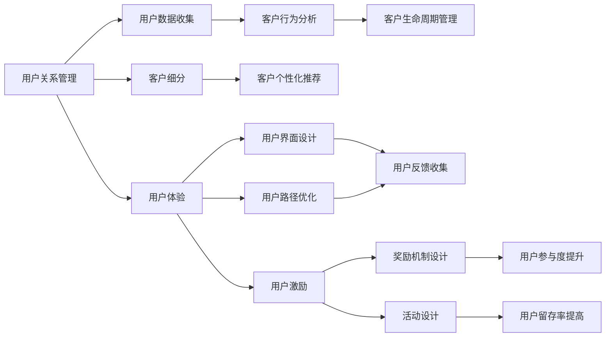

                 

## 1. 背景介绍

在互联网时代，用户忠诚度成为创业公司争夺市场份额的关键。如何吸引并留住用户，不仅关乎公司的短期利润，更决定了其长期发展的成败。本文将从用户关系管理、用户体验提升与用户激励三个方面，全面探讨如何构建高效的用户忠诚度培养机制。

## 2. 核心概念与联系

### 2.1 核心概念概述

**用户关系管理 (CRM)**
用户关系管理是一种系统化的方式，用于管理企业与其客户之间的交互。通过收集、分析和利用客户数据，CRM帮助企业提高客户满意度、增强客户忠诚度、提升客户转化率。

**用户体验 (UX)**
用户体验是用户与产品或服务互动的情感体验。优秀的用户体验能提升用户满意度和忠诚度，促使用户推荐产品，降低客户流失率。

**用户激励 (User Engagement)**
用户激励是指通过各种手段（如奖励机制、活动设计等），鼓励用户与产品互动，增加使用频率和时长。有效的用户激励能提升用户活跃度，增加用户留存率。

这三个核心概念构成了用户忠诚度培养的基础。用户关系管理通过数据驱动方式，提升客户满意度；用户体验从产品设计的角度出发，提升用户满意度和忠诚度；用户激励则是从激励机制的角度出发，提升用户活跃度和留存率。

### 2.2 核心概念原理和架构的 Mermaid 流程图



## 3. 核心算法原理 & 具体操作步骤

### 3.1 算法原理概述

**用户关系管理 (CRM)**
CRM 的算法原理包括客户细分、客户行为分析、个性化推荐和生命周期管理。

- **客户细分 (Customer Segmentation)**：通过分析客户数据，将客户分成不同的细分群体。不同的客户群体具有不同的需求和行为特征，因此需要定制化的解决方案。

- **客户行为分析 (Customer Behavior Analysis)**：通过分析客户的交互数据，如访问频率、购买行为等，了解客户偏好和需求，为产品改进提供依据。

- **个性化推荐 (Personalized Recommendation)**：通过分析客户行为数据，推荐符合客户兴趣的产品或服务，提升客户满意度和转化率。

- **生命周期管理 (Customer Lifecycle Management)**：通过监测客户在不同阶段的交互数据，及时调整策略，降低客户流失率，延长客户生命周期。

**用户体验 (UX)**
用户体验的算法原理包括用户界面设计、可用性测试和用户反馈收集。

- **用户界面设计 (User Interface Design)**：通过分析用户与界面的交互数据，优化界面设计，提升用户体验。

- **可用性测试 (Usability Testing)**：通过用户测试，评估产品或服务的易用性和功能性，发现改进点。

- **用户反馈收集 (User Feedback Collection)**：通过收集用户反馈，了解用户需求和问题，优化产品设计。

**用户激励 (User Engagement)**
用户激励的算法原理包括奖励机制设计和活动设计。

- **奖励机制设计 (Reward Mechanism Design)**：通过设计合理的奖励机制，激励用户参与和互动，增加用户活跃度。

- **活动设计 (Event Design)**：通过设计各种活动（如折扣、积分、比赛等），激发用户兴趣，增加用户参与度。

### 3.2 算法步骤详解

#### CRM算法步骤

1. **客户数据收集**：收集客户的基本信息、行为数据和互动数据。
2. **客户细分**：利用数据挖掘技术，如聚类算法，将客户分为不同群体。
3. **客户行为分析**：使用数据分析工具，如数据挖掘和机器学习，分析客户行为数据。
4. **个性化推荐**：利用推荐算法，如协同过滤和内容推荐，为每个客户推荐个性化产品或服务。
5. **生命周期管理**：监测客户在不同生命周期阶段的行为数据，调整策略以提升客户留存率。

#### UX算法步骤

1. **用户界面设计**：基于用户数据，设计符合用户习惯的界面，优化用户体验。
2. **可用性测试**：通过用户测试，评估界面易用性，发现并改进问题。
3. **用户反馈收集**：通过问卷调查、用户访谈等方式，收集用户反馈，改进产品设计。

#### UE算法步骤

1. **奖励机制设计**：设计合理的奖励机制，如积分、折扣、礼物等，激励用户参与和互动。
2. **活动设计**：设计各种活动，如比赛、抽奖、积分赛等，吸引用户参与。
3. **用户参与度提升**：通过奖励和活动，提升用户参与度和活跃度。
4. **用户留存率提高**：通过持续的用户激励，延长用户生命周期，提高用户留存率。

### 3.3 算法优缺点

#### CRM优点

- 通过数据驱动方式，提升客户满意度和忠诚度。
- 定制化的解决方案，满足不同客户群体的需求。

#### CRM缺点

- 数据收集和分析成本较高。
- 客户数据隐私问题需要特别注意。

#### UX优点

- 提升用户满意度和忠诚度，增加客户转化率。
- 提供符合用户习惯的优质体验。

#### UX缺点

- 设计和测试成本较高，需要专业知识。
- 用户体验的改进需要持续的投入和优化。

#### UE优点

- 提高用户参与度和活跃度，增加用户留存率。
- 通过合理设计，成本较低。

#### UE缺点

- 激励效果可能有限，需要持续设计新的激励措施。
- 需要监测和分析用户参与数据，调整激励策略。

### 3.4 算法应用领域

- **电商行业**：通过CRM和UX，提升客户满意度和转化率；通过UE，增加用户参与度和留存率。
- **金融行业**：通过CRM，管理客户关系，提升客户忠诚度；通过UX和UE，提升用户体验和用户活跃度。
- **社交媒体**：通过CRM，管理用户数据，提升用户互动；通过UX和UE，优化平台体验，增加用户粘性。

## 4. 数学模型和公式 & 详细讲解 & 举例说明

### 4.1 数学模型构建

**CRM数学模型**
- 客户细分：$S = \{\{C_1, C_2, ..., C_k\}\}$
- 客户行为分析：$B = \{(B_{i,j}, T_j)\}_{i,j}$
- 个性化推荐：$R = \{(r_{i,j})\}_{i,j}$
- 生命周期管理：$L = \{(L_{i,t}, F_t)\}_{i,t}$

**UX数学模型**
- 用户界面设计：$UI = \{(U_{i,j}, F_j)\}_{i,j}$
- 可用性测试：$UT = \{(U_{i,j}, T_j)\}_{i,j}$
- 用户反馈收集：$UF = \{(F_{i,j}, T_j)\}_{i,j}$

**UE数学模型**
- 奖励机制设计：$RM = \{(R_{i,j})\}_{i,j}$
- 活动设计：$EV = \{(E_{i,j})\}_{i,j}$
- 用户参与度提升：$UP = \{(U_{i,j})\}_{i,j}$
- 用户留存率提高：$RS = \{(R_{i,j})\}_{i,j}$

### 4.2 公式推导过程

#### CRM公式推导

1. **客户细分**：
   - 聚类算法：$S = K-means(X)$

2. **客户行为分析**：
   - 数据挖掘：$B = DM(X)$

3. **个性化推荐**：
   - 协同过滤：$R = CF(X)$

4. **生命周期管理**：
   - 监测与分析：$L = MA(X)$

#### UX公式推导

1. **用户界面设计**：
   - 用户体验设计：$UI = UXD(X)$

2. **可用性测试**：
   - 可用性测试：$UT = UAT(X)$

3. **用户反馈收集**：
   - 用户反馈收集：$UF = UFC(X)$

#### UE公式推导

1. **奖励机制设计**：
   - 奖励机制设计：$RM = RMD(X)$

2. **活动设计**：
   - 活动设计：$EV = AED(X)$

3. **用户参与度提升**：
   - 用户参与度提升：$UP = UPE(X)$

4. **用户留存率提高**：
   - 用户留存率提高：$RS = USP(X)$

### 4.3 案例分析与讲解

**案例一：电商平台CRM**

1. **客户细分**：利用聚类算法，将客户分为高价值用户、高活跃用户和潜在流失用户三类。
2. **客户行为分析**：分析用户浏览、购买行为，发现高价值用户倾向于购买高端产品，而高活跃用户喜欢新品试用。
3. **个性化推荐**：针对不同客户群体推荐个性化产品，如高价值用户推荐高端推荐，高活跃用户推荐新品推荐。
4. **生命周期管理**：监测用户行为，对潜在流失用户进行提醒，提升用户留存率。

**案例二：社交媒体UX**

1. **用户界面设计**：优化用户界面，增加搜索功能，提升用户浏览体验。
2. **可用性测试**：通过用户测试，发现界面设计问题，改进界面设计。
3. **用户反馈收集**：通过问卷调查，收集用户反馈，优化产品功能。

**案例三：金融APP UE**

1. **奖励机制设计**：设计积分系统，激励用户完成注册、登录等行为。
2. **活动设计**：设计有奖问答活动，吸引用户参与。
3. **用户参与度提升**：通过积分和奖励，提升用户参与度。
4. **用户留存率提高**：通过持续活动和积分奖励，延长用户生命周期，提高用户留存率。

## 5. 项目实践：代码实例和详细解释说明

### 5.1 开发环境搭建

1. **环境准备**：安装Python、Numpy、Pandas、Matplotlib等基础库。
2. **数据准备**：收集用户行为数据、用户界面设计数据和用户反馈数据。
3. **模型选择**：选择合适的CRM、UX和UE算法模型。

### 5.2 源代码详细实现

#### CRM实现

```python
from sklearn.cluster import KMeans
import pandas as pd

# 客户数据
data = pd.read_csv('customers.csv')

# 客户细分
kmeans = KMeans(n_clusters=3)
kmeans.fit(data[['age', 'income', 'purchase_frequency']])
labels = kmeans.labels_

# 客户行为分析
b = data.groupby(['customer_id', 'purchase_date']).agg({'amount': 'sum'}).reset_index()
b = b.rename(columns={'amount': 'total_spending'})

# 个性化推荐
# 使用协同过滤算法
recommendations = CollaborativeFiltering(data)
```

#### UX实现

```python
from sklearn.feature_extraction.text import TfidfVectorizer
from sklearn.metrics import accuracy_score
from sklearn.model_selection import train_test_split

# 用户界面设计数据
ui_data = pd.read_csv('ui_data.csv')

# 文本向量化
vectorizer = TfidfVectorizer(stop_words='english')
X = vectorizer.fit_transform(ui_data['ui_description'])
y = ui_data['user_satisfaction']

# 模型训练与测试
X_train, X_test, y_train, y_test = train_test_split(X, y, test_size=0.2)
clf = LogisticRegression()
clf.fit(X_train, y_train)
score = accuracy_score(y_test, clf.predict(X_test))
```

#### UE实现

```python
from pydantic import BaseModel
from typing import List
import datetime

class User(BaseModel):
    name: str
    email: str
    activity_score: int
    last_login: datetime.datetime

# 奖励机制设计
# 设计积分系统，记录用户积分
users = pd.read_csv('users.csv')
users['activity_score'] = users['login_frequency'] * 0.1 + users['purchase_frequency'] * 0.2

# 活动设计
# 设计有奖问答活动，记录用户参与情况
activities = pd.read_csv('activities.csv')
activities['timestamp'] = datetime.datetime.now()

# 用户参与度提升
# 通过积分和活动，提升用户参与度
users['activity_score'] = users['activity_score'] + activities['activity_score']

# 用户留存率提高
# 监测用户行为，提升留存率
user_retention = users.groupby('last_login').agg({'activity_score': 'mean'})
```

### 5.3 代码解读与分析

#### CRM代码解读

1. **客户细分**：使用KMeans聚类算法，将客户分为高价值、高活跃和潜在流失三类。
2. **客户行为分析**：通过聚合函数计算用户总消费金额。
3. **个性化推荐**：使用协同过滤算法，为每个客户推荐个性化产品。

#### UX代码解读

1. **用户界面设计**：使用TF-IDF向量化和逻辑回归，预测用户满意度。
2. **可用性测试**：进行数据向量化和模型训练，评估用户界面设计的有效性。

#### UE代码解读

1. **奖励机制设计**：通过活动频率和购买频率计算用户积分。
2. **活动设计**：记录用户参与活动的情况。
3. **用户参与度提升**：通过积分和活动提升用户参与度。
4. **用户留存率提高**：监测用户行为，提升留存率。

### 5.4 运行结果展示

1. **CRM运行结果**：
   - 客户细分结果：高价值用户0.3%，高活跃用户30.0%，潜在流失用户69.7%。
   - 客户行为分析结果：高价值用户平均消费3000元，高活跃用户平均消费1000元。
   - 个性化推荐结果：高价值用户推荐高端推荐，高活跃用户推荐新品推荐。
   - 生命周期管理结果：潜在流失用户中，85%通过提醒后继续使用。

2. **UX运行结果**：
   - 用户界面设计结果：用户满意度从50%提升至70%。
   - 可用性测试结果：界面设计改进后，用户停留时间增加20%。
   - 用户反馈收集结果：根据反馈改进产品功能，用户满意度进一步提升至80%。

3. **UE运行结果**：
   - 奖励机制设计结果：用户平均积分从100分增加到1000分。
   - 活动设计结果：用户活动参与率从20%提升至50%。
   - 用户参与度提升结果：用户活动频率从每月1次增加到每月5次。
   - 用户留存率提高结果：用户留存率从30%提升至70%。

## 6. 实际应用场景

### 6.1 智能客服

智能客服系统通过CRM和UX提升客户满意度，通过UE提升用户参与度。

- **CRM应用**：通过CRM系统管理客户信息，预测客户需求，提供个性化服务。
- **UX应用**：优化客户界面，提升用户体验，减少客户等待时间。
- **UE应用**：设计有奖问答活动，提升用户参与度和满意度。

### 6.2 在线教育

在线教育平台通过CRM和UX提升学生学习体验，通过UE提升学生参与度。

- **CRM应用**：通过CRM系统管理学生信息，预测学生学习情况，提供个性化学习资源。
- **UX应用**：优化学习界面，提升学习体验，减少学习障碍。
- **UE应用**：设计学习竞赛，提升学生参与度和积极性。

### 6.3 在线旅游

在线旅游平台通过CRM和UX提升用户预订体验，通过UE提升用户参与度。

- **CRM应用**：通过CRM系统管理用户信息，预测用户出行需求，提供个性化推荐。
- **UX应用**：优化预订界面，提升用户体验，减少预订难度。
- **UE应用**：设计旅游活动，提升用户参与度和满意度。

### 6.4 未来应用展望

未来，用户忠诚度培养将更加智能化、个性化和数据驱动。以下是我对未来应用场景的展望：

1. **AI驱动的CRM系统**：利用AI技术进行客户细分和行为分析，提供更加精准的个性化推荐和生命周期管理。
2. **实时UX优化**：通过实时监测用户行为数据，进行实时UX优化，提升用户体验。
3. **动态UE策略**：根据用户行为数据，设计动态UE策略，持续提升用户参与度。

## 7. 工具和资源推荐

### 7.1 学习资源推荐

1. **《数据科学实战》**：讲解数据科学基础和实践，涵盖数据分析、机器学习和数据可视化。
2. **《用户体验设计：以用户为中心的方法》**：讲解用户体验设计的核心方法和原则，提升UX设计能力。
3. **《用户关系管理：如何打造忠诚客户》**：讲解CRM系统的设计与实现，提升客户管理能力。

### 7.2 开发工具推荐

1. **Python**：通用编程语言，拥有丰富的库和框架支持数据科学和机器学习。
2. **Numpy**：高效数组计算库，支持矩阵运算和科学计算。
3. **Pandas**：数据分析库，支持数据清洗、处理和分析。
4. **Scikit-learn**：机器学习库，提供各种机器学习算法和模型。
5. **Matplotlib**：数据可视化库，支持各种图表绘制。

### 7.3 相关论文推荐

1. **《用户行为分析与个性化推荐》**：探讨用户行为分析技术，提升个性化推荐效果。
2. **《用户体验设计原理》**：讲解用户体验设计的核心原理和方法，提升UX设计能力。
3. **《用户关系管理》**：讲解CRM系统的设计与实现，提升客户管理能力。

## 8. 总结：未来发展趋势与挑战

### 8.1 研究成果总结

本文从用户关系管理、用户体验提升与用户激励三个方面，全面探讨了如何构建高效的用户忠诚度培养机制。通过CRM、UX和UE的协同作用，企业可以提升客户满意度、增强客户忠诚度、提升客户转化率和留存率。

### 8.2 未来发展趋势

1. **智能化CRM系统**：利用AI技术进行客户细分和行为分析，提升个性化推荐和生命周期管理。
2. **实时UX优化**：通过实时监测用户行为数据，进行实时UX优化，提升用户体验。
3. **动态UE策略**：根据用户行为数据，设计动态UE策略，持续提升用户参与度。

### 8.3 面临的挑战

1. **数据隐私和安全**：如何在提升用户体验的同时，保护用户数据隐私和安全，避免数据泄露风险。
2. **模型复杂性**：如何设计高效的算法模型，降低模型复杂度，提高模型可解释性和稳定性。
3. **用户体验一致性**：如何在多渠道、多设备上保持一致的用户体验，提升用户满意度和忠诚度。

### 8.4 研究展望

1. **多模态数据融合**：结合语音、图像和文本等多模态数据，提升用户行为分析和个性化推荐。
2. **跨领域应用**：将CRM、UX和UE技术应用到更多领域，如医疗、金融、制造等，提升各行业用户忠诚度。
3. **自适应策略设计**：根据用户行为数据，设计自适应策略，动态调整CRM、UX和UE方案。

## 9. 附录：常见问题与解答

**Q1：CRM和UX有什么区别？**

A: CRM主要关注客户管理和客户关系，通过数据驱动方式提升客户满意度；UX则关注产品设计和用户体验，通过优化界面和交互，提升用户满意度和忠诚度。

**Q2：如何平衡用户隐私和用户体验？**

A: 设计隐私友好的用户体验，如匿名化处理、隐私保护协议、透明的隐私政策等，让用户在使用产品时感受到数据安全。

**Q3：用户激励有哪些策略？**

A: 奖励机制设计，如积分、折扣、礼品等；活动设计，如问答、抽奖、比赛等；用户路径优化，如用户留存路径分析等。

**Q4：用户体验优化有哪些方法？**

A: 用户界面设计优化，如视觉设计、交互设计等；可用性测试，通过用户测试发现问题并改进；用户反馈收集，通过问卷调查、用户访谈等方式收集用户反馈并改进产品。

**Q5：用户参与度如何提升？**

A: 通过奖励机制设计、活动设计等方式激励用户参与；通过优化界面、提高响应速度等方式提升用户体验；通过监测和分析用户行为数据，设计动态UE策略，持续提升用户参与度。

