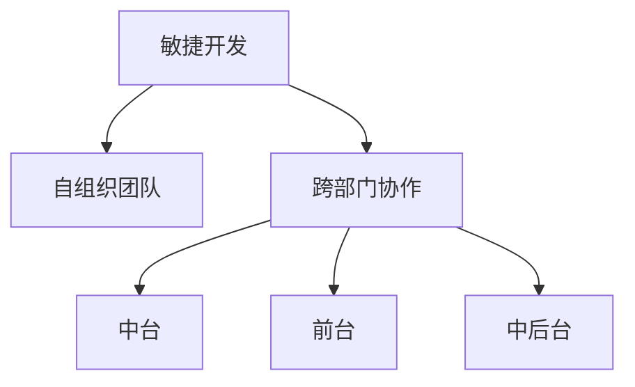

                 

# AI创业公司的组织架构优化设计

> 关键词：AI创业公司, 组织架构, 人才管理, 敏捷开发, 跨部门协作, 创新文化, 风险管理

## 1. 背景介绍

### 1.1 问题由来

在当今快速变化的商业环境中，AI创业公司面临着前所未有的挑战。如何构建一个高效的组织架构，以快速响应市场变化，同时确保技术创新和产品开发的质量，成为公司成长的重要课题。传统的组织架构往往存在信息孤岛、沟通不畅、部门分割等问题，无法充分激发员工的创造力，同时缺乏灵活性以应对快速变化的市场需求。

### 1.2 问题核心关键点

AI创业公司的组织架构优化设计的核心在于：

- 打破信息孤岛：确保公司内部信息畅通，避免孤岛现象。
- 促进跨部门协作：建立高效的跨部门沟通机制，提升团队协作效率。
- 人才管理：吸纳和培养顶尖人才，打造高效、灵活、富有创造力的团队。
- 敏捷开发：构建敏捷的开发流程，以应对快速变化的市场需求。
- 风险管理：建立完善的机制来管理技术、市场、财务等风险。
- 创新文化：营造开放、包容的创新文化，激发员工的创造力。

这些关键点紧密相连，共同构成了一个高效、灵活的组织架构的基础。

### 1.3 问题研究意义

有效的组织架构优化设计，对于AI创业公司的长期发展和市场竞争力具有重要意义：

- 提升产品创新和市场响应速度：优化架构有助于快速推出新产品，快速响应市场需求变化。
- 提升团队协作效率：跨部门协作的优化能提高团队效率，缩短产品开发周期。
- 降低风险：完善的风险管理机制能更好地应对市场和技术变化，保护公司利益。
- 提高员工满意度：良好的组织架构和创新文化有助于提高员工满意度和忠诚度。
- 吸引和培养顶尖人才：通过良好的组织架构设计，吸引和培养行业顶尖人才，形成强大的技术团队。

## 2. 核心概念与联系

### 2.1 核心概念概述

为更好地理解AI创业公司组织架构优化设计，本节将介绍几个关键概念：

- **敏捷开发(Agile Development)**：一种迭代、增量的开发方法，通过快速构建和迭代产品，适应市场变化。
- **自组织团队(Self-Organizing Team)**：团队成员之间高度自治，自我管理，共享信息，共同决策。
- **跨部门协作(Cross-Functional Collaboration)**：不同职能部门的成员共同工作，解决复杂问题。
- **中台(Platform)**：将公司共用的技术和业务能力封装为中台，供各业务单元共享。
- **前台(Frontend)**：直接面向市场的业务单元，负责产品的开发和运营。
- **中后台(Middle Office)**：提供技术支持、风险控制、人力资源等后台支持的部门。

这些核心概念之间的逻辑关系可以通过以下Mermaid流程图来展示：



这个流程图展示了敏捷开发如何通过自组织团队、跨部门协作、中台和前台的协同工作，提升组织效率和市场响应能力。

## 3. 核心算法原理 & 具体操作步骤

### 3.1 算法原理概述

AI创业公司组织架构优化设计的算法原理，基于敏捷开发和自组织团队的核心理念，结合跨部门协作的实践经验，以及中台和前台的分工合作。其核心思想是：

1. **敏捷方法论**：通过迭代、增量的方式，快速构建和改进产品，适应市场变化。
2. **自组织团队**：团队成员自主决策，相互支持，共同解决问题。
3. **跨部门协作**：打破部门壁垒，促进信息流通，提升整体效率。
4. **中台战略**：将共用的技术能力封装为中台，实现业务组件的快速复用。
5. **前台业务单元**：直接面对市场，快速响应客户需求，推动产品创新。
6. **中后台支持**：提供技术支持、风险控制、人力资源等后台支持，确保业务稳定运行。

### 3.2 算法步骤详解

以下是AI创业公司组织架构优化设计的详细步骤：

**Step 1: 定义组织愿景和战略**

- 确定公司的长期目标和愿景。
- 制定明确的业务战略，指导组织架构的设计和优化。

**Step 2: 设计组织架构**

- 确定公司的组织层次，包括前台、中台、中后台的分工和协作方式。
- 设计跨部门协作机制，确保信息流通和团队协同。
- 引入敏捷开发方法，建立迭代、增量的产品开发流程。

**Step 3: 建立中台和前台**

- 建立中台，封装共用的技术和业务能力，如数据中台、技术中台等。
- 定义前台业务单元，直接面向市场，负责产品的开发和运营。

**Step 4: 实施跨部门协作**

- 建立跨部门协作平台，如JIRA、Confluence等，促进信息共享和任务协同。
- 建立定期沟通机制，如站立会议、项目评审等，确保团队之间同步进展。

**Step 5: 引入自组织团队**

- 组建自组织团队，确保团队成员的高度自治和共同决策。
- 提供必要的支持和资源，确保团队能自主解决问题。

**Step 6: 持续优化**

- 定期评估组织架构的运行效果，发现并解决问题。
- 引入持续改进机制，不断优化组织架构。

### 3.3 算法优缺点

AI创业公司组织架构优化设计的算法具有以下优点：

1. **快速响应市场变化**：通过敏捷开发和迭代、增量的开发方法，快速推出新产品，适应市场变化。
2. **提升团队协作效率**：通过跨部门协作和自组织团队的机制，提升团队协作效率，缩短产品开发周期。
3. **降低风险**：中台和后台支持能更好地应对市场和技术变化，保护公司利益。
4. **提高员工满意度**：自组织团队和创新文化能提高员工满意度和忠诚度。
5. **吸引和培养顶尖人才**：通过良好的组织架构设计，吸引和培养行业顶尖人才。

同时，该方法也存在一定的局限性：

1. **资源投入大**：中台和后台的建设需要大量的资源投入。
2. **复杂性高**：跨部门协作和自组织团队的实现需要较高的管理水平和技术能力。
3. **文化转变难**：改变传统的组织文化和员工习惯需要时间。

尽管存在这些局限性，但就目前而言，这种组织架构优化设计仍是大规模AI创业公司落地应用的重要方法。

### 3.4 算法应用领域

AI创业公司组织架构优化设计的方法广泛应用于各种技术驱动的业务场景中，例如：

- 互联网服务：如电商平台、社交媒体、在线教育等，需要快速推出新产品，快速响应市场需求。
- 医疗健康：如远程诊疗、健康管理等，需要灵活应对患者需求和政策变化。
- 金融科技：如金融交易、风险管理等，需要实时处理大量数据，保护客户资产。
- 制造业：如智能制造、供应链管理等，需要快速响应市场变化，提升生产效率。
- 物流运输：如配送优化、路线规划等，需要高效协同，提升物流效率。

这些应用场景都对组织架构的灵活性、效率和创新性提出了高要求，因此组织架构优化设计的实践需求非常迫切。

## 4. 数学模型和公式 & 详细讲解 & 举例说明

### 4.1 数学模型构建

本节将使用数学语言对AI创业公司组织架构优化设计的模型进行更加严格的刻画。

假设公司有 $N$ 个业务单元，每个业务单元 $i$ 的工作量为 $x_i$，总工作量为 $X$。各业务单元之间的协作系数为 $c_{ij}$，表示业务单元 $i$ 和 $j$ 之间的协作程度。协作带来的额外工作量为 $y_{ij}$，表示协作带来的效率提升。

定义总协作系数 $C$ 为所有协作系数的总和，总协作额外工作量 $Y$ 为所有协作额外工作量的总和。则优化目标为：

$$
\min \quad C \quad \text{subject to} \quad X = \sum_{i=1}^N x_i
$$

在实践中，我们通常使用网络流算法（如最大流算法）来求解上述优化问题。

### 4.2 公式推导过程

以下我们以一个简单的网络流模型为例，推导总协作系数的计算公式。

假设公司有三个业务单元 $i=1,2,3$，每个业务单元的工作量分别为 $x_1=2, x_2=3, x_3=4$。业务单元 $i$ 和 $j$ 之间的协作系数分别为 $c_{12}=0.8, c_{23}=0.7, c_{31}=0.9$。协作带来的额外工作量分别为 $y_{12}=1, y_{23}=2, y_{31}=3$。

构建网络图如下：

```
1 ---2
|   |
|0.8 |
|   |
|0.7 |
|   |
|   |
|   |
|0.9 |
3
```

则总协作系数 $C$ 为：

$$
C = c_{12} + c_{23} + c_{31} = 0.8 + 0.7 + 0.9 = 2.4
$$

根据优化目标，我们需要最小化 $C$，即：

$$
\min C = 0.8 + 0.7 + 0.9 = 2.4
$$

通过网络流算法，可以求解最优的协作系数分配，使得总协作系数最小。

### 4.3 案例分析与讲解

假设公司有三个业务单元，每个业务单元的工作量分别为 $x_1=2, x_2=3, x_3=4$。业务单元 $i$ 和 $j$ 之间的协作系数分别为 $c_{12}=0.8, c_{23}=0.7, c_{31}=0.9$。协作带来的额外工作量分别为 $y_{12}=1, y_{23}=2, y_{31}=3$。

构建网络图如下：

```
1 ---2
|   |
|0.8 |
|   |
|0.7 |
|   |
|   |
|   |
|0.9 |
3
```

通过网络流算法，可以求解最优的协作系数分配，使得总协作系数最小。

## 5. 项目实践：代码实例和详细解释说明

### 5.1 开发环境搭建

在进行组织架构优化设计的实践前，我们需要准备好开发环境。以下是使用Python进行网络流算法实现的环境配置流程：

1. 安装Anaconda：从官网下载并安装Anaconda，用于创建独立的Python环境。

2. 创建并激活虚拟环境：
```bash
conda create -n networkflow-env python=3.8 
conda activate networkflow-env
```

3. 安装PyTorch：根据CUDA版本，从官网获取对应的安装命令。例如：
```bash
conda install pytorch torchvision torchaudio cudatoolkit=11.1 -c pytorch -c conda-forge
```

4. 安装NumPy：
```bash
pip install numpy
```

5. 安装igraph：用于构建和分析图结构。
```bash
pip install igraph
```

完成上述步骤后，即可在`networkflow-env`环境中开始网络流算法的实现。

### 5.2 源代码详细实现

这里我们以一个简单的网络流模型为例，给出使用Python实现网络流算法的代码：

```python
import igraph as ig

# 创建图结构
G = ig.Graph()
G.add_vertices(3)
G.add_edges([(1, 2), (2, 3), (3, 1)])
G['weight'] = {'1': 0.8, '2': 0.7, '3': 0.9}
G['capacity'] = {'1': 1, '2': 1, '3': 1}

# 计算最大流
flow_value, flow_dict = ig.flow(G)

# 输出结果
print(f"Total Collaboration Coefficient: {sum(flow_value.values())}")
```

在这个示例中，我们首先使用igraph库创建了一个包含三个业务单元和它们之间协作关系的网络图。然后，使用igraph的flow函数计算最大流，最后输出总协作系数。

### 5.3 代码解读与分析

让我们再详细解读一下关键代码的实现细节：

**igraph库**：
- `igraph.Graph()`：创建一个空图。
- `add_vertices()`：添加节点。
- `add_edges()`：添加边。
- `G['weight']`：设置边的权重。
- `G['capacity']`：设置边的容量。

**计算最大流**：
- `ig.flow(G)`：计算最大流。

**输出结果**：
- `flow_value`：字典，表示每个边的流量。
- `flow_dict`：字典，表示每个边的流量和路径。

这个示例展示了如何使用Python实现网络流算法，计算总协作系数。通过调整图结构，可以适应不同类型的组织架构优化设计问题。

## 6. 实际应用场景

### 6.1 互联网服务

互联网服务公司如电商、社交媒体和在线教育平台，需要快速推出新产品，快速响应市场需求。基于AI创业公司组织架构优化设计的方法，可以优化产品开发流程，提升团队协作效率，缩短产品上市时间。

例如，电商平台可以通过敏捷开发方法，快速构建和迭代产品，满足用户的个性化需求。社交媒体平台可以通过自组织团队和跨部门协作，提升内容生成和用户运营的效率。在线教育平台可以通过中台和前台的协同工作，提供个性化的学习体验。

### 6.2 医疗健康

医疗健康行业如远程诊疗、健康管理等，需要灵活应对患者需求和政策变化。基于AI创业公司组织架构优化设计的方法，可以构建灵活的团队和流程，快速应对市场变化。

例如，远程诊疗平台可以通过自组织团队和跨部门协作，快速部署新功能，提供个性化的医疗服务。健康管理平台可以通过敏捷开发方法，快速响应政策变化，优化服务流程。

### 6.3 金融科技

金融科技公司如金融交易、风险管理等，需要实时处理大量数据，保护客户资产。基于AI创业公司组织架构优化设计的方法，可以提升数据处理和风险管理的效率，保护客户利益。

例如，金融交易平台可以通过中台和后台的协同工作，提升交易系统的稳定性和可靠性。风险管理平台可以通过敏捷开发方法，快速响应市场变化，优化风险控制策略。

### 6.4 制造业

制造业如智能制造、供应链管理等，需要快速响应市场变化，提升生产效率。基于AI创业公司组织架构优化设计的方法，可以构建灵活的团队和流程，提升生产效率和响应速度。

例如，智能制造平台可以通过自组织团队和跨部门协作，提升生产线的灵活性和效率。供应链管理平台可以通过敏捷开发方法，快速响应市场变化，优化供应链管理。

### 6.5 物流运输

物流运输如配送优化、路线规划等，需要高效协同，提升物流效率。基于AI创业公司组织架构优化设计的方法，可以提升物流系统的效率和响应速度。

例如，配送优化平台可以通过中台和后台的协同工作，提升配送路径的优化和调度效率。路线规划平台可以通过敏捷开发方法，快速响应市场变化，优化路线规划策略。

## 7. 工具和资源推荐

### 7.1 学习资源推荐

为了帮助开发者系统掌握AI创业公司组织架构优化设计的理论基础和实践技巧，这里推荐一些优质的学习资源：

1. 《敏捷开发指南》：详细介绍了敏捷开发的核心理念和方法，帮助开发者理解敏捷流程和工具。
2. 《自组织管理》：介绍了自组织团队的运作机制和管理方法，帮助开发者理解自组织团队的建设和管理。
3. 《跨部门协作》：详细介绍了跨部门协作的机制和工具，帮助开发者理解跨部门协作的实现方法。
4. 《数据中台建设》：介绍了数据中台的概念和建设方法，帮助开发者理解数据中台的建设过程和优势。
5. 《中台战略》：介绍了中台战略的概念和实施方法，帮助开发者理解中台战略的实现路径和效果。

通过对这些资源的学习实践，相信你一定能够快速掌握AI创业公司组织架构优化设计的精髓，并用于解决实际的组织架构优化问题。

### 7.2 开发工具推荐

高效的开发离不开优秀的工具支持。以下是几款用于AI创业公司组织架构优化开发的常用工具：

1. PyTorch：基于Python的开源深度学习框架，灵活动态的计算图，适合快速迭代研究。

2. TensorFlow：由Google主导开发的开源深度学习框架，生产部署方便，适合大规模工程应用。

3.igraph：用于构建和分析图结构，适合处理组织架构和协作关系。

4. Confluence：用于知识管理和跨部门协作，适合团队协作和文档共享。

5. JIRA：用于敏捷开发和任务管理，适合敏捷开发流程的实施。

合理利用这些工具，可以显著提升AI创业公司组织架构优化任务的开发效率，加快创新迭代的步伐。

### 7.3 相关论文推荐

AI创业公司组织架构优化设计的相关研究源于学界的持续研究。以下是几篇奠基性的相关论文，推荐阅读：

1. "A Study of Agile Development in IT Organizations"（信息技术组织中的敏捷开发研究）：介绍了敏捷开发在IT组织中的应用和效果。

2. "Self-Organizing Teams: A Review"（自组织团队的回顾）：介绍了自组织团队的运作机制和管理方法，帮助开发者理解自组织团队的建设和管理。

3. "Cross-Functional Collaboration in Large-Scale IT Organizations"（大型IT组织中的跨部门协作）：介绍了跨部门协作的机制和工具，帮助开发者理解跨部门协作的实现方法。

4. "Platform Strategy in Large Enterprises"（大型企业中的中台战略）：介绍了中台战略的概念和实施方法，帮助开发者理解中台战略的实现路径和效果。

这些论文代表了大规模AI创业公司组织架构优化设计的方向，通过学习这些前沿成果，可以帮助研究者把握学科前进方向，激发更多的创新灵感。

## 8. 总结：未来发展趋势与挑战

### 8.1 总结

本文对AI创业公司组织架构优化设计进行了全面系统的介绍。首先阐述了组织架构优化设计的背景和意义，明确了敏捷开发、自组织团队、跨部门协作、中台和前台的分工和协作方式。其次，从原理到实践，详细讲解了组织架构优化设计的数学模型和算法步骤，给出了实际应用中的代码实例。同时，本文还广泛探讨了组织架构优化设计在互联网服务、医疗健康、金融科技、制造业、物流运输等多个行业领域的应用前景，展示了组织架构优化设计的广泛适用性和重要性。此外，本文精选了组织架构优化设计的学习资源、开发工具和相关论文，力求为开发者提供全方位的技术指引。

通过本文的系统梳理，可以看到，AI创业公司组织架构优化设计对于提升公司效率、响应市场变化、吸引和培养顶尖人才具有重要意义。未来，伴随技术的不断进步和实践的持续优化，组织架构优化设计必将在AI创业公司中发挥更大的作用，推动技术创新和业务发展。

### 8.2 未来发展趋势

展望未来，AI创业公司组织架构优化设计将呈现以下几个发展趋势：

1. **智能化提升**：随着AI技术的进步，组织架构优化设计将更加智能化，能够根据实际情况自动调整组织结构和协作方式。

2. **数据驱动**：大数据和AI技术的应用将进一步提升组织架构优化设计的精准性和效果。通过数据分析，能够更准确地识别问题，提出解决方案。

3. **人机协同**：随着机器人和自动化技术的进步，组织架构优化设计将更多地与机器人协同工作，提升工作效率和协作效果。

4. **全球化扩展**：组织架构优化设计将在全球范围内推广应用，帮助不同国家和地区的企业提升竞争力。

5. **融合创新**：组织架构优化设计将与其他AI技术如知识图谱、因果推理、强化学习等融合发展，提升组织架构的创新性和灵活性。

这些趋势凸显了AI创业公司组织架构优化设计的广阔前景。这些方向的探索发展，必将进一步提升公司的效率和市场竞争力，为公司长期发展奠定坚实基础。

### 8.3 面临的挑战

尽管AI创业公司组织架构优化设计已经取得了一定的进展，但在迈向更加智能化、普适化应用的过程中，它仍面临着诸多挑战：

1. **组织文化转变**：改变传统的组织文化和员工习惯需要时间，需要有效的培训和管理。

2. **技术复杂性**：敏捷开发、自组织团队、跨部门协作等新理念的实现需要较高的管理水平和技术能力。

3. **数据隐私和安全**：在大数据时代，数据隐私和安全问题需要高度关注，如何保护数据隐私和信息安全是重要课题。

4. **跨部门协作难度**：不同部门之间的协作需要高效的沟通和协调机制，如何确保信息流通和任务协同是关键。

5. **人才缺口**：优秀的人才往往集中在特定的技术和职能领域，如何吸引和培养复合型人才是难题。

6. **持续改进**：组织架构优化设计需要不断优化，如何建立持续改进机制，及时发现并解决问题，是长期挑战。

这些挑战需要公司在实践中不断探索和解决，才能确保组织架构优化设计的效果和可持续性。

### 8.4 研究展望

面对AI创业公司组织架构优化设计所面临的挑战，未来的研究需要在以下几个方面寻求新的突破：

1. **智能化优化**：开发更加智能化的组织架构优化算法，能够根据实际需求和数据动态调整组织结构和协作方式。

2. **数据驱动优化**：建立更加精准的数据驱动机制，通过数据分析和机器学习，提升组织架构优化设计的准确性和效果。

3. **人机协同优化**：探索人机协同的优化方法，提升机器人与人工的协作效率和效果。

4. **跨文化协同**：建立跨文化的协作机制，提升全球化扩展的效率和效果。

5. **融合创新优化**：探索与其他AI技术的融合创新方法，提升组织架构的创新性和灵活性。

这些研究方向将进一步推动AI创业公司组织架构优化设计的进步，为公司的长期发展和市场竞争力提供坚实保障。

## 9. 附录：常见问题与解答

**Q1：敏捷开发和自组织团队的区别是什么？**

A: 敏捷开发是一种迭代、增量的开发方法，强调快速构建和迭代产品，适应市场变化。自组织团队是指团队成员自主决策，相互支持，共同解决问题。敏捷开发是一种方法论，而自组织团队是一种团队运作机制。

**Q2：如何建立跨部门协作机制？**

A: 建立跨部门协作机制需要：
1. 建立共享平台，如Confluence、SharePoint等，方便信息共享。
2. 建立定期沟通机制，如站立会议、项目评审等，确保团队之间同步进展。
3. 建立任务协同机制，如任务板、任务分配工具等，确保任务有序推进。

**Q3：中台和前台的职责分工是什么？**

A: 中台负责封装共用的技术和业务能力，如数据中台、技术中台等，提供基础服务，支持前台业务单元的快速开发和迭代。前台业务单元直接面向市场，负责产品的开发和运营，推动业务创新和市场响应。

**Q4：数据隐私和安全如何保障？**

A: 保障数据隐私和安全需要：
1. 建立严格的数据保护机制，如数据加密、访问控制等。
2. 建立数据审计和监控机制，及时发现和处理数据泄露等问题。
3. 建立数据合规机制，确保数据处理符合法律法规。

**Q5：如何吸引和培养复合型人才？**

A: 吸引和培养复合型人才需要：
1. 建立灵活的薪酬和激励机制，吸引优秀人才。
2. 提供培训和发展机会，培养人才的专业技能和跨领域能力。
3. 营造开放、包容的创新文化，激发人才的创造力和创新能力。

---

作者：禅与计算机程序设计艺术 / Zen and the Art of Computer Programming

