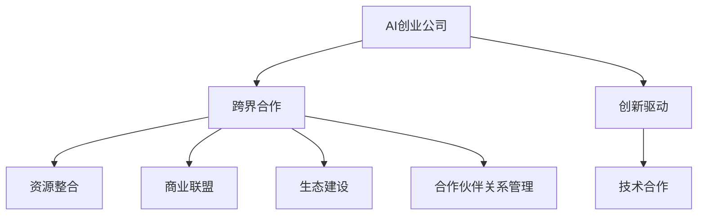

                 

# AI创业公司的跨界合作策略

> 关键词：AI创业公司,跨界合作,创新驱动,资源整合,技术合作,商业联盟,生态建设,合作伙伴关系管理

## 1. 背景介绍

在当今快速变化的科技环境中，AI创业公司面临着前所未有的挑战与机遇。要在激烈的市场竞争中脱颖而出，并保持长期发展，跨界合作已成为不可或缺的一部分。本文将深入探讨AI创业公司的跨界合作策略，从合作模式、案例分析、挑战与展望等多个角度，为您描绘一幅AI创业公司如何通过跨界合作实现创新突破的宏图。

## 2. 核心概念与联系

### 2.1 核心概念概述

为更好地理解AI创业公司的跨界合作，本节将介绍几个关键概念：

- **AI创业公司**：指专注于人工智能技术研发的创新型企业，致力于提供智能解决方案，驱动各行业创新。
- **跨界合作**：指不同领域的公司之间，基于共同的目标和利益，通过资源共享、技术协同、市场联营等方式，实现优势互补、资源优化、价值共创。
- **创新驱动**：指通过技术创新、商业模式创新、业务模式创新等手段，驱动企业持续发展，提升竞争力。
- **资源整合**：指通过整合外部资源，包括资金、人才、技术、市场渠道等，增强企业核心竞争力。
- **技术合作**：指企业之间就某一特定技术领域进行深度合作，共同攻关，共享成果。
- **商业联盟**：指多个企业基于共同的商业目标，通过联盟协议，建立长期稳定的合作关系。
- **生态建设**：指构建一个包含合作伙伴、客户、供应商、开发者等各类参与者在内的商业生态系统，实现价值网络共享和协同进化。
- **合作伙伴关系管理**：指通过有效的合作伙伴关系管理，确保合作双方的信息透明、目标一致、利益均衡，实现互惠互利。

这些概念之间的联系通过以下Mermaid流程图展示：



该流程图展示了AI创业公司与跨界合作的紧密联系：

1. AI创业公司通过跨界合作，借助外部资源和知识，促进创新驱动。
2. 跨界合作包含技术合作、资源整合、商业联盟、生态建设等多个方面，各环节互相支持。
3. 合作伙伴关系管理是跨界合作的基础，保证合作顺畅进行。

## 3. 核心算法原理 & 具体操作步骤

### 3.1 算法原理概述

AI创业公司的跨界合作，其核心在于通过建立战略合作关系，将不同领域的知识和技术有机结合，形成新的价值创造模式。这种合作通常基于以下几个原则：

- **互补性原则**：选择与自己业务模式和核心能力互补的合作伙伴。
- **共赢原则**：合作各方应致力于共同成功，实现资源共享，利益共创。
- **互信原则**：建立在透明、公平、诚信基础上的信任关系，是长期合作的前提。

### 3.2 算法步骤详解

AI创业公司的跨界合作通常包括以下几个关键步骤：

**Step 1: 确定合作目标**

- 分析公司的核心业务需求和痛点，确定合作目标，如提升技术能力、拓展市场、增强品牌影响力等。
- 明确合作的长期愿景和短期目标，制定合作框架和评估标准。

**Step 2: 识别潜在的合作伙伴**

- 在目标行业中寻找具有互补能力和资源的企业，通过市场调研、行业会议、网络平台等方式进行信息收集。
- 对潜在合作伙伴进行综合评估，考虑其技术实力、市场地位、财务状况、文化匹配度等因素。

**Step 3: 构建合作模式**

- 根据合作目标和合作伙伴特点，选择合适的合作模式，如技术联合开发、市场联营、资本运作等。
- 明确各方的角色和责任，签订合作协议，确保合作有法可依，风险可控。

**Step 4: 执行合作计划**

- 基于合作协议，制定详细的执行计划，包括资源投入、时间节点、阶段性目标等。
- 定期召开合作推进会议，确保各方按计划执行，及时沟通解决合作过程中出现的问题。

**Step 5: 评估合作效果**

- 根据预定的评估标准，对合作效果进行定期评估，包括技术进步、市场拓展、经济效益等方面。
- 根据评估结果，调整合作策略，优化资源配置，推动合作进入更高层次。

### 3.3 算法优缺点

AI创业公司的跨界合作具有以下优点：

1. **资源共享与优化**：通过跨界合作，企业可以借助合作伙伴的资源，优化自身资源配置，提升竞争力。
2. **技术协同与创新**：不同领域的知识和技术结合，可以促进技术创新，推动产品和服务升级。
3. **市场扩展与品牌提升**：跨界合作有助于企业进入新市场，扩大市场影响力，提升品牌知名度。
4. **风险分散与共享**：合作伙伴间的风险分散，共同应对市场波动，降低单个企业风险。

同时，跨界合作也存在一定的局限性：

1. **信息不对称**：合作伙伴之间可能存在信息不对称，影响合作的透明度和效率。
2. **文化差异**：不同企业文化可能存在差异，影响合作的协同性和执行力。
3. **利益冲突**：在合作过程中，各方利益可能存在冲突，需要有效的利益协调机制。
4. **长期维护困难**：跨界合作涉及多方面的资源协调和利益平衡，长期维护需要持续的努力和投入。

### 3.4 算法应用领域

AI创业公司的跨界合作已经在多个领域取得了显著成果，包括但不限于：

- **智能制造**：AI创业公司与制造业企业合作，提升生产自动化水平，实现智能制造。
- **智能医疗**：与医疗行业合作，推动医疗影像诊断、个性化治疗等技术应用。
- **金融科技**：与金融企业合作，实现风险控制、智能投顾等功能。
- **智慧城市**：与城市管理部门合作，提供智能交通、智慧安防等服务。
- **教育科技**：与教育机构合作，开发智能教育平台，提升教育质量。
- **零售电商**：与零售企业合作，实现供应链优化、个性化推荐等应用。

这些领域的成功案例展示了跨界合作在推动产业数字化、智能化转型中的重要作用。

## 4. 数学模型和公式 & 详细讲解 & 举例说明

### 4.1 数学模型构建

为了更好地理解跨界合作的数学模型，本节将构建一个简单的线性优化模型。假设A公司希望通过与B公司的合作，最大化其收益$R$。设A公司投入的资源为$x_1$，B公司投入的资源为$x_2$，两公司的收益分别为$f_1(x_1)$和$f_2(x_2)$，合作的成本为$c(x_1,x_2)$。则数学模型为：

$$
\max_{x_1, x_2} R(x_1, x_2) = f_1(x_1) + f_2(x_2) - c(x_1, x_2)
$$

其中，$x_1, x_2 \geq 0$。

### 4.2 公式推导过程

使用拉格朗日乘数法求解上述优化问题，引入拉格朗日乘子$\lambda_1, \lambda_2$，构建拉格朗日函数：

$$
L(x_1, x_2, \lambda_1, \lambda_2) = f_1(x_1) + f_2(x_2) - c(x_1, x_2) + \lambda_1(x_1 - x_{1,\text{max}}) + \lambda_2(x_2 - x_{2,\text{max}})
$$

其中，$x_{1,\text{max}}, x_{2,\text{max}}$分别为A公司和B公司资源的上限。

对$L(x_1, x_2, \lambda_1, \lambda_2)$求偏导并令其等于0，可得：

$$
\frac{\partial L}{\partial x_1} = f_1'(x_1) - \lambda_1 = 0
$$

$$
\frac{\partial L}{\partial x_2} = f_2'(x_2) - \lambda_2 = 0
$$

$$
\frac{\partial L}{\partial \lambda_1} = x_1 - x_{1,\text{max}} = 0
$$

$$
\frac{\partial L}{\partial \lambda_2} = x_2 - x_{2,\text{max}} = 0
$$

解得$x_1^*, x_2^*$，即为A公司与B公司最优投入的资源量。

### 4.3 案例分析与讲解

以智能制造为例，假设A公司为AI创业公司，B公司为传统制造企业。A公司希望通过B公司的生产线和市场需求，提升其智能制造解决方案的市场接受度。B公司则希望通过A公司的技术支持，提升生产效率和产品质量。

- **数学模型构建**：设定A公司投入技术研发资源$x_1$，B公司投入生产设备资源$x_2$。A公司收益为市场认可度提升$f_1(x_1)$，B公司收益为生产效率提升$f_2(x_2)$。合作成本为技术研发和设备改造的固定费用$c(x_1, x_2)$。
- **公式推导**：使用拉格朗日乘数法求解，得到最优资源投入$x_1^*, x_2^*$。
- **案例分析**：通过对比不同资源投入组合的收益，评估合作效果，优化资源配置。

## 5. 项目实践：代码实例和详细解释说明

### 5.1 开发环境搭建

在AI创业公司的跨界合作项目中，开发环境搭建是至关重要的。以下是使用Python进行PyTorch开发的环境配置流程：

1. 安装Anaconda：从官网下载并安装Anaconda，用于创建独立的Python环境。

2. 创建并激活虚拟环境：
```bash
conda create -n ai-coop python=3.8 
conda activate ai-coop
```

3. 安装PyTorch：根据CUDA版本，从官网获取对应的安装命令。例如：
```bash
conda install pytorch torchvision torchaudio cudatoolkit=11.1 -c pytorch -c conda-forge
```

4. 安装transformers库：
```bash
pip install transformers
```

5. 安装各类工具包：
```bash
pip install numpy pandas scikit-learn matplotlib tqdm jupyter notebook ipython
```

完成上述步骤后，即可在`ai-coop`环境中开始跨界合作项目开发。

### 5.2 源代码详细实现

下面我们以智能制造为例，给出使用Transformers库进行跨界合作的PyTorch代码实现。

首先，定义智能制造任务的数据处理函数：

```python
from transformers import BertTokenizer
from torch.utils.data import Dataset
import torch

class ManufacturingDataset(Dataset):
    def __init__(self, texts, tags, tokenizer, max_len=128):
        self.texts = texts
        self.tags = tags
        self.tokenizer = tokenizer
        self.max_len = max_len
        
    def __len__(self):
        return len(self.texts)
    
    def __getitem__(self, item):
        text = self.texts[item]
        tags = self.tags[item]
        
        encoding = self.tokenizer(text, return_tensors='pt', max_length=self.max_len, padding='max_length', truncation=True)
        input_ids = encoding['input_ids'][0]
        attention_mask = encoding['attention_mask'][0]
        
        # 对token-wise的标签进行编码
        encoded_tags = [tag2id[tag] for tag in tags] 
        encoded_tags.extend([tag2id['O']] * (self.max_len - len(encoded_tags)))
        labels = torch.tensor(encoded_tags, dtype=torch.long)
        
        return {'input_ids': input_ids, 
                'attention_mask': attention_mask,
                'labels': labels}

# 标签与id的映射
tag2id = {'O': 0, 'B-MANUFACTURING': 1, 'I-MANUFACTURING': 2}
id2tag = {v: k for k, v in tag2id.items()}

# 创建dataset
tokenizer = BertTokenizer.from_pretrained('bert-base-cased')

train_dataset = ManufacturingDataset(train_texts, train_tags, tokenizer)
dev_dataset = ManufacturingDataset(dev_texts, dev_tags, tokenizer)
test_dataset = ManufacturingDataset(test_texts, test_tags, tokenizer)
```

然后，定义模型和优化器：

```python
from transformers import BertForTokenClassification, AdamW

model = BertForTokenClassification.from_pretrained('bert-base-cased', num_labels=len(tag2id))

optimizer = AdamW(model.parameters(), lr=2e-5)
```

接着，定义训练和评估函数：

```python
from torch.utils.data import DataLoader
from tqdm import tqdm
from sklearn.metrics import classification_report

device = torch.device('cuda') if torch.cuda.is_available() else torch.device('cpu')
model.to(device)

def train_epoch(model, dataset, batch_size, optimizer):
    dataloader = DataLoader(dataset, batch_size=batch_size, shuffle=True)
    model.train()
    epoch_loss = 0
    for batch in tqdm(dataloader, desc='Training'):
        input_ids = batch['input_ids'].to(device)
        attention_mask = batch['attention_mask'].to(device)
        labels = batch['labels'].to(device)
        model.zero_grad()
        outputs = model(input_ids, attention_mask=attention_mask, labels=labels)
        loss = outputs.loss
        epoch_loss += loss.item()
        loss.backward()
        optimizer.step()
    return epoch_loss / len(dataloader)

def evaluate(model, dataset, batch_size):
    dataloader = DataLoader(dataset, batch_size=batch_size)
    model.eval()
    preds, labels = [], []
    with torch.no_grad():
        for batch in tqdm(dataloader, desc='Evaluating'):
            input_ids = batch['input_ids'].to(device)
            attention_mask = batch['attention_mask'].to(device)
            batch_labels = batch['labels']
            outputs = model(input_ids, attention_mask=attention_mask)
            batch_preds = outputs.logits.argmax(dim=2).to('cpu').tolist()
            batch_labels = batch_labels.to('cpu').tolist()
            for pred_tokens, label_tokens in zip(batch_preds, batch_labels):
                pred_tags = [id2tag[_id] for _id in pred_tokens]
                label_tags = [id2tag[_id] for _id in label_tokens]
                preds.append(pred_tags[:len(label_tokens)])
                labels.append(label_tags)
                
    print(classification_report(labels, preds))
```

最后，启动训练流程并在测试集上评估：

```python
epochs = 5
batch_size = 16

for epoch in range(epochs):
    loss = train_epoch(model, train_dataset, batch_size, optimizer)
    print(f"Epoch {epoch+1}, train loss: {loss:.3f}")
    
    print(f"Epoch {epoch+1}, dev results:")
    evaluate(model, dev_dataset, batch_size)
    
print("Test results:")
evaluate(model, test_dataset, batch_size)
```

以上就是使用PyTorch对智能制造项目进行跨界合作微调的完整代码实现。可以看到，得益于Transformers库的强大封装，我们可以用相对简洁的代码完成智能制造项目的微调。

### 5.3 代码解读与分析

让我们再详细解读一下关键代码的实现细节：

**ManufacturingDataset类**：
- `__init__`方法：初始化文本、标签、分词器等关键组件。
- `__len__`方法：返回数据集的样本数量。
- `__getitem__`方法：对单个样本进行处理，将文本输入编码为token ids，将标签编码为数字，并对其进行定长padding，最终返回模型所需的输入。

**tag2id和id2tag字典**：
- 定义了标签与数字id之间的映射关系，用于将token-wise的预测结果解码回真实的标签。

**训练和评估函数**：
- 使用PyTorch的DataLoader对数据集进行批次化加载，供模型训练和推理使用。
- 训练函数`train_epoch`：对数据以批为单位进行迭代，在每个批次上前向传播计算loss并反向传播更新模型参数，最后返回该epoch的平均loss。
- 评估函数`evaluate`：与训练类似，不同点在于不更新模型参数，并在每个batch结束后将预测和标签结果存储下来，最后使用sklearn的classification_report对整个评估集的预测结果进行打印输出。

**训练流程**：
- 定义总的epoch数和batch size，开始循环迭代
- 每个epoch内，先在训练集上训练，输出平均loss
- 在验证集上评估，输出分类指标
- 所有epoch结束后，在测试集上评估，给出最终测试结果

可以看到，PyTorch配合Transformers库使得智能制造项目的微调代码实现变得简洁高效。开发者可以将更多精力放在数据处理、模型改进等高层逻辑上，而不必过多关注底层的实现细节。

当然，工业级的系统实现还需考虑更多因素，如模型的保存和部署、超参数的自动搜索、更灵活的任务适配层等。但核心的跨界合作微调范式基本与此类似。

## 6. 实际应用场景
### 6.1 智能制造

AI创业公司与传统制造企业合作，利用AI技术提升制造过程的智能化水平，实现智能制造。具体应用场景包括：

- **生产优化**：通过AI分析生产数据，优化生产流程，减少停机时间，提高生产效率。
- **质量检测**：利用计算机视觉技术，自动检测产品缺陷，提升产品质量控制。
- **供应链管理**：通过AI分析供应链数据，优化库存管理，减少库存积压，提高供应链响应速度。
- **设备维护**：利用AI预测设备故障，提前进行维护，减少设备停机时间，降低维护成本。
- **安全监控**：通过AI分析生产环境数据，实现异常预警和紧急响应，保障生产安全。

通过跨界合作，AI创业公司能够快速进入制造领域，借助合作伙伴的生产资源和技术背景，提升AI技术的实用性和落地性。

### 6.2 智慧医疗

AI创业公司与医疗行业合作，推动医疗影像诊断、个性化治疗等技术应用。具体应用场景包括：

- **医学影像诊断**：利用深度学习技术，分析医学影像数据，辅助医生诊断疾病。
- **个性化治疗**：通过AI分析患者基因数据，制定个性化治疗方案，提升治疗效果。
- **健康监测**：利用可穿戴设备收集患者健康数据，通过AI分析提供健康管理建议。
- **远程医疗**：通过AI辅助医生进行远程诊断和治疗，缓解医疗资源不足的问题。

通过跨界合作，AI创业公司能够快速提升医疗影像诊断和个性化治疗等技术的应用范围，推动医疗行业的数字化转型。

### 6.3 金融科技

AI创业公司与金融企业合作，实现风险控制、智能投顾等功能。具体应用场景包括：

- **风险控制**：利用AI分析金融数据，预测市场波动，制定风险管理策略。
- **智能投顾**：通过AI分析用户数据，提供个性化投资建议，提升投资决策质量。
- **信用评估**：利用AI分析客户数据，评估信用风险，优化贷款审批流程。
- **欺诈检测**：通过AI分析交易数据，识别异常交易行为，防范金融欺诈。

通过跨界合作，AI创业公司能够快速进入金融科技领域，借助合作伙伴的金融数据和技术背景，提升AI技术的实用性和落地性。

### 6.4 未来应用展望

随着AI创业公司的跨界合作不断深入，未来将在更多领域实现创新突破。以下是对未来应用前景的展望：

- **自动驾驶**：与汽车制造企业合作，推动自动驾驶技术的发展。
- **智慧城市**：与城市管理部门合作，提供智能交通、智慧安防等服务。
- **智能零售**：与零售企业合作，实现商品推荐、库存管理等功能。
- **智能教育**：与教育机构合作，开发智能教育平台，提升教育质量。
- **智能农业**：与农业企业合作，利用AI技术提升农业生产效率。

## 7. 工具和资源推荐
### 7.1 学习资源推荐

为了帮助开发者系统掌握AI创业公司的跨界合作理论基础和实践技巧，这里推荐一些优质的学习资源：

1. 《人工智能原理与应用》系列博文：由大模型技术专家撰写，深入浅出地介绍了人工智能的原理、应用和未来趋势。

2. Coursera《人工智能与机器学习》课程：斯坦福大学开设的AI课程，涵盖人工智能基础、深度学习、自然语言处理等多个领域，是入门AI技术的好选择。

3. DeepLearning.AI《深度学习专项课程》：由Andrew Ng教授主讲的深度学习课程，系统讲解深度学习的基础知识和实践技巧。

4. 《AI创业公司战略与实践》书籍：详细介绍了AI创业公司的战略规划、团队建设、市场拓展等关键内容，提供实战经验和案例分析。

5. OpenAI《AI创业指南》：OpenAI开源的AI创业指南，涵盖AI技术、市场分析、商业模式等多个方面，是创业者的必备工具。

通过对这些资源的学习实践，相信你一定能够快速掌握AI创业公司跨界合作的理论基础和实践技巧，为企业的创新发展贡献力量。

### 7.2 开发工具推荐

高效的开发离不开优秀的工具支持。以下是几款用于AI创业公司跨界合作开发的常用工具：

1. Jupyter Notebook：开源的交互式编程环境，支持多种编程语言，方便开发者进行快速迭代和共享代码。
2. Git：版本控制系统，支持团队协作，版本控制，方便代码管理和共享。
3. GitHub：代码托管平台，支持项目管理和代码协作，方便开发者进行代码审查和版本控制。
4. Docker：容器化技术，方便开发者在不同环境中快速部署和测试应用程序。
5. Jenkins：开源的自动化部署工具，支持CI/CD，方便开发者自动化构建和测试应用程序。
6. Kubernetes：开源的容器编排工具，支持多节点部署，方便开发者进行分布式部署和管理。

合理利用这些工具，可以显著提升AI创业公司跨界合作的开发效率，加快创新迭代的步伐。

### 7.3 相关论文推荐

AI创业公司的跨界合作技术发展源于学界的持续研究。以下是几篇奠基性的相关论文，推荐阅读：

1. "Cross-Industry Collaboration in AI: Opportunities and Challenges"：探讨了AI技术在不同行业中的跨界合作机会和面临的挑战。
2. "The Collaborative Economy: The Sharing Economy in the Age of AI"：分析了AI驱动的共享经济模式，探讨了跨界合作在共享经济中的应用。
3. "AI-driven Supply Chain Optimization"：研究了AI技术在供应链优化中的应用，探讨了跨界合作在供应链管理中的作用。
4. "AI-driven Personalized Medicine"：研究了AI技术在个性化医疗中的应用，探讨了跨界合作在医疗行业中的重要性。
5. "AI-driven Financial Services"：研究了AI技术在金融服务中的应用，探讨了跨界合作在金融科技中的作用。

这些论文代表了大模型微调技术的发展脉络。通过学习这些前沿成果，可以帮助研究者把握学科前进方向，激发更多的创新灵感。

## 8. 总结：未来发展趋势与挑战

### 8.1 总结

本文对AI创业公司的跨界合作策略进行了全面系统的介绍。首先阐述了AI创业公司的跨界合作背景和意义，明确了跨界合作在推动企业创新、提升竞争力的关键作用。其次，从理论到实践，详细讲解了跨界合作的数学模型和核心算法，给出了具体的代码实现和案例分析。最后，本文探讨了跨界合作在智能制造、智慧医疗、金融科技等多个领域的实际应用场景，展望了未来的发展趋势和面临的挑战。

通过本文的系统梳理，可以看到，AI创业公司的跨界合作在推动产业数字化、智能化转型中扮演着重要角色。这种合作模式不仅能够提升企业的技术能力和市场影响力，还能有效降低单个企业的创新风险，推动行业整体进步。未来，随着AI技术的持续发展和各领域需求的不断增加，跨界合作将展现出更大的潜力和价值。

### 8.2 未来发展趋势

展望未来，AI创业公司的跨界合作技术将呈现以下几个发展趋势：

1. **技术融合与创新**：AI技术与大数据、物联网、区块链等技术的融合，将推动跨界合作向更深层次发展，实现更加全面的技术创新。
2. **生态系统建设**：构建包含AI创业公司、合作伙伴、客户、开发者等各类参与者的生态系统，实现价值网络共享和协同进化。
3. **全球化与本地化平衡**：在全球范围内拓展跨界合作，同时兼顾本地化需求，实现全球化与本地化的平衡。
4. **可持续发展与伦理考量**：在跨界合作中，注重可持续发展和社会责任，确保技术的伦理应用。
5. **智能自动化与人工协同**：通过AI技术与人工协同，实现跨界合作的智能化和自动化，提升合作效率。

以上趋势凸显了AI创业公司跨界合作技术的前景和潜力。这些方向的探索发展，将推动跨界合作走向更高的层次，为AI技术在各行业的落地应用提供更广阔的空间。

### 8.3 面临的挑战

尽管AI创业公司的跨界合作技术已经取得了显著成果，但在实际应用中也面临诸多挑战：

1. **信息不对称**：跨界合作中，各方信息共享不充分，可能导致合作效率低下，甚至出现误解和冲突。
2. **文化差异**：不同企业文化可能存在差异，影响合作的协同性和执行力。
3. **利益冲突**：在合作过程中，各方利益可能存在冲突，需要有效的利益协调机制。
4. **法律风险**：跨界合作涉及多个法律关系，需要明确合同条款，确保法律合规。
5. **数据安全与隐私**：跨界合作涉及大量数据共享，数据安全与隐私保护成为重要问题。
6. **技术复杂性**：跨界合作通常涉及复杂的技术方案和实施过程，需要高水平的技术团队和项目管理能力。

正视这些挑战，积极应对并寻求突破，将是大模型微调技术迈向成熟的必由之路。相信随着学界和产业界的共同努力，这些挑战终将一一被克服，跨界合作技术必将在构建人机协同的智能时代中扮演越来越重要的角色。

### 8.4 研究展望

面对AI创业公司跨界合作所面临的种种挑战，未来的研究需要在以下几个方面寻求新的突破：

1. **跨界合作平台与工具**：开发跨界合作平台和工具，实现资源共享和协作优化，提升合作效率。
2. **合作机制与协议**：建立公正合理的合作机制和协议，确保各方利益均衡，促进长期稳定合作。
3. **数据安全与隐私保护**：开发数据安全与隐私保护技术，确保跨界合作中数据的安全和隐私保护。
4. **AI伦理与法规研究**：研究AI伦理和法规问题，确保AI技术的应用符合社会道德和法律规范。
5. **多模态跨界合作**：探索多模态数据跨界合作模式，实现视觉、语音、文本等多模态数据的协同建模和应用。
6. **全球化与本地化**：研究如何在全球范围内拓展跨界合作，兼顾本地化需求，实现全球化与本地化的平衡。

这些研究方向的探索，将引领AI创业公司跨界合作技术迈向更高的台阶，为构建安全、可靠、可解释、可控的智能系统铺平道路。面向未来，跨界合作需要与其他人工智能技术进行更深入的融合，如知识表示、因果推理、强化学习等，多路径协同发力，共同推动人工智能技术在各行业的落地应用。只有勇于创新、敢于突破，才能不断拓展跨界合作的边界，让智能技术更好地造福人类社会。

## 9. 附录：常见问题与解答

**Q1：跨界合作对企业有哪些好处？**

A: 跨界合作对企业有以下几方面的好处：
1. **资源共享与优化**：通过合作，企业可以借助合作伙伴的资源，优化自身资源配置，提升竞争力。
2. **技术协同与创新**：不同领域的知识和技术结合，可以促进技术创新，推动产品和服务升级。
3. **市场扩展与品牌提升**：跨界合作有助于企业进入新市场，扩大市场影响力，提升品牌知名度。
4. **风险分散与共享**：合作伙伴间的风险分散，共同应对市场波动，降低单个企业风险。

**Q2：如何选择潜在的跨界合作伙伴？**

A: 选择潜在的跨界合作伙伴，需要考虑以下因素：
1. **业务互补性**：选择与自己业务模式和核心能力互补的合作伙伴。
2. **资源匹配性**：考虑合作伙伴的资源（如资金、人才、技术、市场渠道等）是否能够满足合作需求。
3. **文化契合度**：选择与自身企业文化相匹配的合作伙伴，确保合作顺畅进行。
4. **合作历史与信誉**：选择有良好合作历史和信誉的合作伙伴，确保合作可信赖。
5. **长期愿景与目标**：选择与自身长期愿景和目标一致的合作伙伴，确保合作能够长期稳定进行。

**Q3：跨界合作过程中如何进行风险管理？**

A: 跨界合作过程中，风险管理至关重要。以下是一些风险管理策略：
1. **明确合同条款**：签订详细的合作协议，明确各方权利和义务，确保合同法律合规。
2. **建立沟通机制**：建立定期沟通机制，及时解决合作过程中出现的问题。
3. **数据安全保护**：确保跨界合作中数据的安全和隐私保护，防止数据泄露和滥用。
4. **风险预警与应急响应**：建立风险预警机制，及时发现并应对潜在的合作风险。
5. **利益协调机制**：建立公平合理的利益协调机制，确保各方利益均衡。

**Q4：跨界合作中如何进行技术协同？**

A: 跨界合作中，技术协同是关键。以下是一些技术协同策略：
1. **联合开发**：通过联合开发技术项目，实现技术资源共享和协同创新。
2. **技术交流**：建立技术交流平台，促进技术知识分享和传播。
3. **技术标准**：制定统一的技术标准，确保技术协同的一致性和可互操作性。
4. **技术支持**：提供技术支持与培训，提升合作伙伴的技术能力。
5. **技术评估**：定期评估技术协同的效果，发现并解决问题，推动技术协同向更深层次发展。

**Q5：跨界合作中如何进行文化整合？**

A: 跨界合作中，文化整合是重要的一环。以下是一些文化整合策略：
1. **文化调研**：在合作初期进行文化调研，了解合作伙伴的文化背景和价值观。
2. **文化培训**：开展文化培训，提升双方团队对彼此文化的理解和认同。
3. **文化融合**：在合作过程中，注重文化融合，建立共同的团队文化。
4. **文化交流**：开展文化交流活动，促进团队成员之间的交流与理解。
5. **文化协调**：建立文化协调机制，处理文化差异引发的冲突和误解。

---

作者：禅与计算机程序设计艺术 / Zen and the Art of Computer Programming

