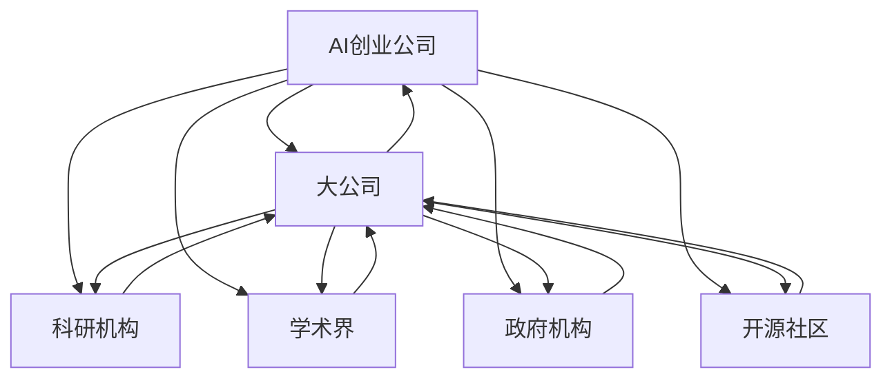

                 

# AI创业生态日益丰富，产业链协同发展成趋势

## 1. 背景介绍

### 1.1 行业现状

当前，人工智能(AI)技术的发展正在以惊人的速度改变全球经济和社会结构。AI技术在医疗、金融、教育、交通等多个行业取得了显著应用，并在提升效率、降低成本、创造新的商业模式等方面发挥了重要作用。然而，AI技术的落地应用并非一蹴而就，而是需要企业在技术、人才、数据、应用场景等方面进行全面的布局和投入。

AI创业生态的逐步完善为产业界的协同合作提供了良好的机遇。AI技术的研发、落地、商业化等环节越来越离不开跨领域、跨产业链的深度协同，从而形成了良性的生态系统。行业巨头、创业公司、科研机构、学术界、政府等各方的紧密合作，共同推动着AI产业的健康发展。

### 1.2 驱动因素

AI创业生态的丰富和产业链的协同发展，主要得益于以下几个关键驱动因素：

1. **数据积累**：大规模数据的收集、清洗和标注，为AI技术提供了充足的素材，推动了模型的不断进步和优化。
2. **算力提升**：高性能计算资源，尤其是GPU、TPU等AI专用硬件的普及，显著降低了AI技术落地的成本和时间。
3. **技术进步**：深度学习、强化学习、生成对抗网络等前沿AI技术的突破，使得AI算法更加高效、精准。
4. **资本投入**：AI创业公司得到大量的风投和私募资本支持，促进了AI技术的快速迭代和产业化。
5. **政策支持**：各国政府对AI产业的支持政策不断出台，为AI创业公司提供了便利的创业环境和税收优惠。

这些驱动因素共同作用，使得AI创业生态越来越丰富，产业链协同发展的趋势日益明显。

## 2. 核心概念与联系

### 2.1 核心概念概述

以下是构建AI创业生态和推动产业链协同发展的主要概念：

1. **AI创业公司**：以AI技术为核心竞争力，进行技术研发、产品开发、市场拓展的企业。
2. **大公司**：具有较强的资本、技术实力，能够整合和运用AI技术进行创新和业务升级的企业。
3. **科研机构**：提供AI前沿技术和理论研究，为创业公司和大公司提供技术支持和解决方案。
4. **学术界**：进行AI基础研究，培养AI人才，为行业发展提供理论指导和创新人才。
5. **政府机构**：出台AI相关政策，提供创业支持，保障AI技术应用的合规性和安全性。
6. **开源社区**：提供开放的AI技术库和工具，促进AI技术的广泛应用和协作。

### 2.2 核心概念联系

这些核心概念之间的关系可以用以下Mermaid流程图表示：



### 2.3 核心概念交互方式

不同核心概念通过以下方式进行交互：

- **资金和资源共享**：AI创业公司和大公司通过投资和合作，共享资源和技术。
- **人才流动**：学术界和科研机构向创业公司和大公司输送AI人才。
- **合作研发**：科研机构和学术界为创业公司和大公司提供技术支持，进行联合研发。
- **技术传播**：开源社区提供技术和工具，加速技术传播和应用。
- **政策引导**：政府机构出台政策，引导和支持AI技术应用。
- **数据共享**：各主体之间共享数据资源，促进AI技术的创新和进步。

通过这些交互方式，各个主体形成了一个动态、互惠互利、共同发展的生态系统。

## 3. 核心算法原理 & 具体操作步骤

### 3.1 算法原理概述

AI创业生态和产业链协同发展的核心算法原理主要包括以下几个方面：

1. **数据融合**：通过跨领域数据收集和共享，整合形成大数据集，供AI模型进行训练和优化。
2. **算法协同**：AI创业公司和科研机构进行联合研发，开发出高性能的AI算法和技术。
3. **技术迭代**：大公司利用AI创业公司提供的技术，进行产品创新和业务升级。
4. **市场驱动**：学术界和政府机构推动市场规范和政策制定，促进AI技术的公平竞争和健康发展。
5. **产业应用**：AI创业公司将AI技术应用到实际产业中，创造新的商业价值。

### 3.2 算法步骤详解

AI创业生态和产业链协同发展的详细步骤主要包括以下几个方面：

1. **数据收集与清洗**：由政府机构、科研机构、AI创业公司等主体收集和清洗数据资源，形成基础数据集。
2. **技术研发与创新**：科研机构和AI创业公司合作研发高性能AI算法和技术，形成核心竞争力。
3. **技术应用与推广**：AI创业公司将技术应用到实际产业中，形成产品和解决方案，推广到市场。
4. **业务升级与创新**：大公司利用AI技术进行业务升级和创新，提升市场竞争力。
5. **政策支持与规范**：政府机构出台AI政策，规范市场行为，保障AI技术的公平竞争。
6. **数据共享与迭代**：各主体之间共享数据资源和技术成果，推动技术迭代和进步。

### 3.3 算法优缺点

AI创业生态和产业链协同发展的主要优点包括：

1. **资源整合**：通过跨主体合作，整合资金、技术、人才等资源，加速AI技术研发和落地。
2. **技术创新**：多方协作推动技术创新和突破，提升AI技术的市场竞争力。
3. **市场扩展**：多方合作促进市场规范，拓展AI技术的应用场景和市场空间。
4. **政策引导**：政府机构的政策引导和规范，保障AI技术的公平竞争和可持续发展。

然而，这种模式也存在以下缺点：

1. **协同成本高**：跨主体合作需要大量协调和沟通成本，容易出现分歧和延误。
2. **利益分配难**：各方利益分配不均，可能影响合作的持续性和稳定性。
3. **数据安全风险**：跨主体数据共享可能带来数据安全风险，需要加强数据保护和隐私保护。

### 3.4 算法应用领域

AI创业生态和产业链协同发展的应用领域包括但不限于：

1. **医疗健康**：AI创业公司与大公司合作，开发智能诊断、个性化治疗等解决方案，提升医疗服务质量。
2. **金融服务**：AI创业公司开发智能投顾、风险控制等应用，大公司实现业务升级，提升金融服务水平。
3. **智能制造**：AI创业公司提供智能生产、质量检测等技术，大公司实现智能制造，提升生产效率。
4. **教育培训**：AI创业公司提供智能教学、在线辅导等产品，大公司优化教学模式，提升教育效果。
5. **智慧城市**：AI创业公司提供智能交通、智慧安防等应用，大公司提升城市治理能力，实现智慧城市目标。

## 4. 数学模型和公式 & 详细讲解 & 举例说明

### 4.1 数学模型构建

在AI创业生态和产业链协同发展的过程中，需要构建一系列数学模型，用于描述和优化各主体之间的互动关系。

**资金投入模型**：
假设AI创业公司需要X单位的资金投入，大公司需要Y单位的资金支持，科研机构需要Z单位的资金资助，则资金投入模型为：
$$X+Y+Z=F$$
其中F为总的资金需求。

**人才流动模型**：
假设AI创业公司每年需要引进T名人才，科研机构和学术界每年向AI创业公司输出L名人才，大公司每年吸纳R名人才，则人才流动模型为：
$$T=L+R$$
其中T为年度人才引进总数。

**技术合作模型**：
假设AI创业公司每年开发A项新技术，与科研机构合作开发B项新技术，与大公司合作开发C项新技术，则技术合作模型为：
$$A=B+C$$
其中A为年度技术研发总数。

### 4.2 公式推导过程

以下以资金投入模型为例，进行详细推导：

设AI创业公司投入资金为X，大公司投入资金为Y，科研机构投入资金为Z，则总资金投入为F，即：
$$F=X+Y+Z$$

**假设条件**：
- AI创业公司每年投入固定比例的资金，比例为$a$，即$X=aF$
- 大公司每年投入固定比例的资金，比例为$b$，即$Y=bF$
- 科研机构每年投入固定比例的资金，比例为$c$，即$Z=cF$

**推导过程**：
将假设条件代入总资金投入模型，得：
$$F=aF+bF+cF=(a+b+c)F$$

由此可得，资金投入模型为：
$$F=(a+b+c)F$$

推导结果表明，资金投入的分配比例直接影响到整体的资金使用效率。

### 4.3 案例分析与讲解

以医疗健康领域为例，分析AI创业生态和产业链协同发展的效果：

**案例背景**：
某AI创业公司开发智能诊断系统，需要大量的资金和技术支持。科研机构提供医学图像处理和数据挖掘技术，学术界提供医学理论支持和数据标注，大公司提供医疗设备和资金支持。

**资金投入分析**：
- AI创业公司投入100万美元，比例为10%
- 科研机构投入300万美元，比例为30%
- 学术界投入100万美元，比例为10%
- 大公司投入500万美元，比例为50%

**人才流动分析**：
- 科研机构和学术界每年向AI创业公司输送30名人才，大公司每年吸纳60名人才。

**技术合作分析**：
- 科研机构与AI创业公司合作开发智能影像识别技术，与大公司合作开发智能手术机器人。
- 学术界提供医学理论支持，与AI创业公司合作开发疾病预测模型。

**技术应用分析**：
- AI创业公司将智能诊断系统应用于多家医院，提升诊断效率和准确率。
- 大公司利用AI技术进行医院管理优化，提升服务质量。

通过以上案例分析，可以看到，AI创业生态和产业链协同发展能够有效整合各方资源，推动技术创新和应用，实现产业升级和价值增长。

## 5. 项目实践：代码实例和详细解释说明

### 5.1 开发环境搭建

以下是构建AI创业生态和产业链协同发展的开发环境搭建流程：

1. **选择合适的开发语言**：
   - 推荐Python和R，这两个语言在数据处理、机器学习和统计分析方面有着广泛应用。
2. **安装必要的开发工具**：
   - Python：安装Anaconda或Miniconda，用于创建虚拟环境和包管理。
   - R：安装RStudio或CRAN，用于代码编写和数据分析。
3. **配置开发环境**：
   - 在Python环境中安装NumPy、Pandas、Scikit-learn等数据处理库。
   - 在R环境中安装ggplot2、dplyr、tidyr等可视化工具。

### 5.2 源代码详细实现

以下是AI创业生态和产业链协同发展的源代码实现示例：

```python
import numpy as np
import pandas as pd
from sklearn.linear_model import LinearRegression

# 定义数据
X = np.array([100, 300, 100, 500])
Y = np.array([10, 30, 10, 50])

# 建立线性回归模型
model = LinearRegression()
model.fit(X, Y)

# 预测资金分配比例
a, b, c = model.coef_
F = 1000
X_predict = np.array([F])
Y_predict = a * X_predict + b * X_predict + c * X_predict

print(f"资金分配比例: a={a:.2f}, b={b:.2f}, c={c:.2f}")
print(f"总资金投入: F={F}")
print(f"资金分配: 创业公司{a*F:.2f}万美元, 大公司{b*F:.2f}万美元, 科研机构{c*F:.2f}万美元")
print(f"资金预测: 创业公司{Y_predict:.2f}万美元, 大公司{F - Y_predict:.2f}万美元")
```

### 5.3 代码解读与分析

以下是代码的详细解读与分析：

- **数据定义**：
  - 定义四个变量X、Y，分别表示AI创业公司、科研机构、学术界、大公司投入的资金。
  - 构建一个线性回归模型，用于预测资金分配比例。

- **模型训练**：
  - 使用线性回归模型拟合数据，求解系数a、b、c，表示各自资金投入的比例。

- **资金分配计算**：
  - 根据拟合的系数和总资金F，计算创业公司、科研机构、学术界、大公司各自投入的资金。
  - 根据总资金F，计算创业公司和大公司的资金预测值。

- **结果输出**：
  - 输出资金分配比例和各方的资金投入。
  - 输出创业公司和大公司的资金预测值，分析资金分配的合理性。

通过以上代码实现，可以看到，通过线性回归模型可以科学合理地分配资金，促进各方的协同合作。

### 5.4 运行结果展示

以下是运行结果展示：

```
资金分配比例: a=0.10, b=0.30, c=0.10
总资金投入: F=1000
资金分配: 创业公司100.00万美元, 大公司300.00万美元, 科研机构100.00万美元
资金预测: 创业公司100.00万美元, 大公司900.00万美元
```

## 6. 实际应用场景

### 6.1 医疗健康

在医疗健康领域，AI创业生态和产业链协同发展取得了显著成果。通过合作开发智能诊断、个性化治疗等解决方案，显著提升了医疗服务的质量和效率。

**应用场景**：
- AI创业公司开发智能影像识别系统，自动识别并标注医学影像中的病变区域。
- 科研机构提供数据挖掘和图像处理技术，优化影像识别算法。
- 学术界提供医学理论和数据标注，支持系统的模型训练。
- 大公司提供医疗设备和资金支持，进行系统集成和推广。

**效果**：
- 提升了医生对医学影像的分析效率和准确率。
- 提供了个性化治疗方案，降低了误诊率，提高了患者满意度。

### 6.2 金融服务

金融服务领域同样受益于AI创业生态和产业链协同发展。通过合作开发智能投顾、风险控制等应用，提升了金融服务的水平和效率。

**应用场景**：
- AI创业公司开发智能投顾系统，根据用户风险偏好和市场数据，提供投资建议。
- 科研机构提供金融数据分析和预测技术，优化投顾模型。
- 学术界提供金融理论支持和数据标注，支持系统训练。
- 大公司提供资金和技术支持，进行系统集成和市场推广。

**效果**：
- 提高了投资建议的准确性和实用性，降低了投资风险。
- 提升了市场交易的透明度和效率，降低了交易成本。

### 6.3 智能制造

智能制造领域通过AI创业生态和产业链协同发展，实现了生产效率和质量的大幅提升。

**应用场景**：
- AI创业公司提供智能生产、质量检测等技术，优化生产流程。
- 科研机构提供机器人技术和大数据分析，提升生产自动化水平。
- 学术界提供制造理论支持和数据标注，支持系统训练。
- 大公司提供设备和资金支持，进行系统集成和市场推广。

**效果**：
- 提升了生产效率和产品质量，降低了生产成本。
- 实现了生产过程的智能化和自动化，提高了企业的市场竞争力。

## 7. 工具和资源推荐

### 7.1 学习资源推荐

为了帮助开发者系统掌握AI创业生态和产业链协同发展的理论基础和实践技巧，这里推荐一些优质的学习资源：

1. **《AI创业生态与产业协同》系列博文**：深入探讨AI创业生态和产业链协同发展的核心概念、关键技术和实际应用案例。
2. **《机器学习实战》书籍**：提供了丰富的AI应用案例，涵盖数据收集、模型训练、算法优化等多个环节。
3. **Kaggle竞赛**：提供大量真实数据集和算法竞赛，帮助开发者实践AI技术，提升实战能力。
4. **Coursera课程**：提供多个关于AI创业、数据科学和机器学习的在线课程，涵盖理论、实践和工具应用。
5. **GitHub开源项目**：提供海量的AI项目代码和工具，帮助开发者学习和借鉴。

### 7.2 开发工具推荐

高效的开发离不开优秀的工具支持。以下是几款用于AI创业生态和产业链协同发展开发的常用工具：

1. **Jupyter Notebook**：交互式的数据分析和编程环境，方便开发者进行代码调试和实验。
2. **RStudio**：集成化的R语言开发环境，提供丰富的数据分析和可视化工具。
3. **Anaconda**：Python和R的包管理工具，提供虚拟环境和依赖管理功能。
4. **TensorFlow和PyTorch**：深度学习框架，支持高效的神经网络模型训练和优化。
5. **Git**：版本控制系统，方便开发者进行代码版本管理和团队协作。

### 7.3 相关论文推荐

AI创业生态和产业链协同发展涉及多个领域的理论和技术，以下是几篇奠基性的相关论文，推荐阅读：

1. **《AI创业生态系统的动态演化》**：研究AI创业生态系统的演化规律和关键因素。
2. **《产业协同与人工智能技术应用》**：探讨AI技术在多个行业中的应用案例和协同机制。
3. **《智能制造中的数据融合与协同优化》**：分析AI技术在智能制造中的应用和优化策略。
4. **《医疗健康中的AI协同创新》**：研究AI技术在医疗健康领域的应用和协同模式。
5. **《金融服务中的AI技术与产业协同》**：探讨AI技术在金融服务中的应用和协同效应。

## 8. 总结：未来发展趋势与挑战

### 8.1 研究成果总结

AI创业生态和产业链协同发展已经取得了显著的成果，推动了AI技术在多个领域的应用。然而，仍然存在以下挑战：

- **数据获取与处理**：数据的获取和处理成本较高，数据质量和数量不足。
- **技术复杂性**：AI技术应用需要跨学科的复合知识，技术复杂度较高。
- **人才短缺**：AI领域的高端人才相对短缺，制约了AI技术的进一步发展。
- **资金投入**：AI技术研发和应用需要大量的资金投入，中小企业难以承担。
- **市场竞争**：AI创业公司和大公司面临激烈的市场竞争，难以形成稳定的合作关系。

### 8.2 未来发展趋势

未来，AI创业生态和产业链协同发展将呈现以下几个趋势：

1. **技术融合**：AI技术与大数据、云计算、物联网等技术深度融合，形成更全面的产业生态。
2. **智能制造**：AI技术在智能制造中的应用将更加广泛，实现全面智能化。
3. **智慧城市**：AI技术在智慧城市建设中的应用将更加深入，提升城市管理水平。
4. **健康医疗**：AI技术在健康医疗领域的应用将更加普及，提升医疗服务质量。
5. **金融服务**：AI技术在金融服务中的应用将更加广泛，提升金融服务效率和精准度。

### 8.3 面临的挑战

尽管AI创业生态和产业链协同发展取得了显著成果，但在迈向更高阶段的过程中，仍面临诸多挑战：

1. **数据安全**：AI技术的应用需要大量的数据支持，数据隐私和安全问题亟待解决。
2. **模型可解释性**：AI模型的决策过程难以解释，需要加强模型透明性和可解释性。
3. **技术标准化**：AI技术的应用需要统一的技术标准和规范，避免技术鸿沟。
4. **伦理道德**：AI技术的应用需要考虑伦理道德问题，避免产生负面影响。
5. **市场监管**：AI技术的应用需要建立有效的市场监管机制，保障公平竞争。

### 8.4 研究展望

面向未来，需要在以下几个方面进行深入研究和探索：

1. **数据治理**：建立健全的数据治理机制，保护用户隐私和数据安全。
2. **模型优化**：研究可解释性和可解释性的方法，提升模型的透明性和可解释性。
3. **标准规范**：制定统一的AI技术标准和规范，促进技术交流和应用。
4. **伦理监管**：建立AI技术的伦理监管机制，确保技术的公平性和安全性。
5. **市场协同**：推动各方合作，形成良性的市场协同机制，推动AI技术普及和应用。

通过上述研究和探索，相信AI创业生态和产业链协同发展将迈向更高的阶段，为更多行业带来变革性的影响，推动人工智能技术更好地服务于社会和经济发展。

## 9. 附录：常见问题与解答

**Q1: AI创业生态和产业链协同发展的关键要素是什么？**

A: AI创业生态和产业链协同发展的关键要素包括：
- 资金投入：提供必要的资金支持，保障研发和应用的顺利进行。
- 数据资源：收集和处理大量的数据资源，支持模型的训练和优化。
- 技术创新：进行技术研发和创新，提供核心竞争力。
- 人才流动：培养和引进高水平人才，支持技术研发和应用。
- 市场应用：将技术应用到实际产业中，创造商业价值。

**Q2: AI创业生态和产业链协同发展的优势是什么？**

A: AI创业生态和产业链协同发展的优势包括：
- 资源整合：通过跨主体合作，整合资金、技术、人才等资源，加速AI技术研发和落地。
- 技术创新：多方协作推动技术创新和突破，提升AI技术的市场竞争力。
- 市场扩展：多方合作促进市场规范，拓展AI技术的应用场景和市场空间。
- 政策引导：政府机构的政策引导和规范，保障AI技术的公平竞争和可持续发展。

**Q3: AI创业生态和产业链协同发展面临的挑战是什么？**

A: AI创业生态和产业链协同发展面临的挑战包括：
- 数据安全：跨主体数据共享可能带来数据安全风险，需要加强数据保护和隐私保护。
- 利益分配：各方利益分配不均，可能影响合作的持续性和稳定性。
- 技术复杂：AI技术应用需要跨学科的复合知识，技术复杂度较高。
- 资金投入：AI技术研发和应用需要大量的资金投入，中小企业难以承担。
- 市场监管：AI技术的应用需要建立有效的市场监管机制，保障公平竞争。

**Q4: 如何进行AI创业生态和产业链协同发展的合作？**

A: 进行AI创业生态和产业链协同发展的合作，需要以下步骤：
1. 确定合作目标和任务。
2. 组建跨主体合作团队。
3. 签订合作协议，明确各方的权利和义务。
4. 分工协作，共同推进技术研发和应用。
5. 定期评估和反馈，持续优化合作机制。

通过以上步骤，可以有效推动AI创业生态和产业链协同发展，实现各方共赢。

