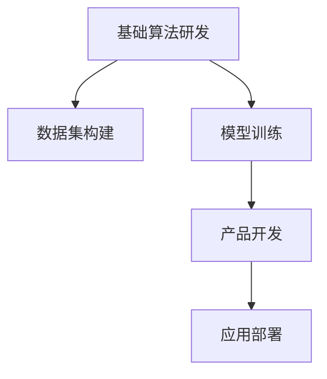

                 

# AI创业生态日益丰富，产业链协同发展成趋势

## 1. 背景介绍

### 1.1 问题由来
近年来，随着人工智能(AI)技术的快速发展，越来越多的AI初创公司涌现出来，涵盖了从基础算法研发到应用落地的各个环节。AI创业生态的丰富度不断提升，推动了整个产业的健康发展。同时，产业链上各环节的协同效应逐步显现，加速了技术的迭代和产品的落地。本文将从背景、核心概念、算法原理、应用场景等方面，全面探讨AI创业生态的演变及其产业链协同发展的趋势。

### 1.2 问题核心关键点
当前AI创业生态和产业链协同发展的核心关键点在于：

- **生态多样性**：从基础算法研发到应用落地的各个环节，都涌现出了众多创新型企业，形成了多元化的生态系统。
- **产业链协同**：AI技术从数据采集、模型训练、推理部署到产品落地，形成了完整的产业链，各个环节之间的协同效应日益显著。
- **应用场景拓展**：AI技术在医疗、教育、金融、制造等众多领域得到了广泛应用，推动了各行各业的数字化转型。
- **政策支持**：各国政府纷纷出台政策，支持AI产业的发展，为创新型企业提供了良好的政策环境。
- **投资热潮**：资本对AI创业的关注度不断提升，提供了丰厚的资金支持，加速了技术进步和应用推广。

### 1.3 问题研究意义
研究AI创业生态和产业链协同发展的趋势，对于理解AI技术的演进方向，把握产业发展脉络，推动产业协同创新具有重要意义：

- **技术演进**：了解AI技术在基础算法、应用落地等方面的发展趋势，为技术创新提供方向。
- **产业协同**：分析产业链上各环节的协同效应，推动产业资源整合，提升技术应用效率。
- **应用推广**：深入研究AI技术在不同领域的应用场景，探索创新应用模式，促进技术普及。
- **政策导向**：把握政府对AI产业的支持政策，抓住发展机遇，实现产业转型升级。
- **资本动态**：关注AI领域的投资趋势，优化资源配置，加速技术商业化进程。

## 2. 核心概念与联系

### 2.1 核心概念概述

为更好地理解AI创业生态和产业链协同发展的趋势，本节将介绍几个密切相关的核心概念：

- **AI创业生态**：由基础算法研发、数据集构建、模型训练、产品开发、应用部署等环节组成的完整闭环系统。
- **产业链协同**：指AI技术从基础研发到实际应用，形成的一条完整价值链，各个环节之间的协调和合作。
- **应用落地**：将AI技术转化为具体产品或服务，解决实际问题，实现商业价值的过程。
- **数据集构建**：AI算法训练的基础，需要大量的高质量数据进行支持。
- **模型训练**：基于数据集，通过机器学习或深度学习算法训练AI模型。
- **产品开发**：将训练好的模型嵌入到具体的应用场景中，开发出可用的产品或服务。
- **应用部署**：将产品或服务部署到实际环境中，进行大规模落地应用。

这些核心概念之间的逻辑关系可以通过以下Mermaid流程图来展示：



这个流程图展示了大规模AI应用落地的基本流程：

1. 基础算法研发：在大规模数据集上，进行算法设计和模型训练。
2. 数据集构建：收集、标注、清洗数据，形成可用的训练集。
3. 模型训练：在数据集上训练AI模型，优化模型参数。
4. 产品开发：将训练好的模型嵌入到具体的应用场景中，开发出可用的产品或服务。
5. 应用部署：将产品或服务部署到实际环境中，进行大规模落地应用。

## 3. 核心算法原理 & 具体操作步骤
### 3.1 算法原理概述

AI创业生态和产业链协同发展，本质上是将AI技术从基础研发到实际应用的过程，通过协同合作实现技术迭代和产品落地。其核心思想是：将AI技术的各个环节打通，形成完整的价值链，每个环节都在前一个环节的基础上进行优化和创新，最终实现技术的高效转化和应用。

形式化地，假设AI技术的某个应用场景为 $A$，其基础算法为 $F$，数据集为 $D$，训练出的模型为 $M$，产品为 $P$，部署在实际环境中的应用为 $A'$。AI技术的开发流程可以表示为：

$$
A' = P(F(D), M)
$$

其中 $P$ 表示产品开发过程，$F$ 表示基础算法研发，$D$ 表示数据集构建，$M$ 表示模型训练。

### 3.2 算法步骤详解

AI创业生态和产业链协同发展的开发流程一般包括以下几个关键步骤：

**Step 1: 基础算法研发**
- 收集和标注数据集，确保数据的质量和多样性。
- 选择合适的算法模型，设计并训练模型。
- 对算法进行优化和调参，提升模型性能。

**Step 2: 数据集构建**
- 收集和清洗数据，构建大规模、高质量的数据集。
- 标注数据，确保标注的一致性和准确性。
- 对数据进行预处理和特征工程，提高模型训练效果。

**Step 3: 模型训练**
- 选择合适的优化器和损失函数，设计模型训练流程。
- 对模型进行多次训练和验证，防止过拟合和欠拟合。
- 使用正则化技术，提高模型的泛化能力。

**Step 4: 产品开发**
- 将训练好的模型嵌入到具体的应用场景中，开发出可用的产品或服务。
- 对产品进行测试和优化，确保其在实际环境中的稳定性。
- 进行产品部署，实现规模化应用。

**Step 5: 应用部署**
- 将产品部署到实际环境中，进行大规模落地应用。
- 实时监控产品性能，根据用户反馈进行调整和优化。
- 持续收集数据，更新模型和算法，实现持续优化。

### 3.3 算法优缺点

AI创业生态和产业链协同发展的方法具有以下优点：

1. **高效协作**：各个环节之间的协同合作，可以显著提高技术迭代速度，缩短产品开发周期。
2. **资源共享**：共享数据、算法和工具，可以降低研发成本，提升资源利用效率。
3. **创新驱动**：各环节的协同创新，可以推动技术的不断进步，产生更多具有创新价值的产品。
4. **市场响应快**：快速迭代和优化，可以更快地响应市场需求，抢占市场先机。

同时，该方法也存在一定的局限性：

1. **数据依赖**：各环节的数据质量和多样性直接影响最终产品的性能。
2. **算法复杂度**：复杂的算法和模型训练需要大量计算资源，可能面临资源瓶颈。
3. **协同难度**：各环节的协同合作需要良好的沟通和协作机制，存在一定管理难度。
4. **技术风险**：各环节的技术协同存在一定风险，一个环节出现问题可能导致整体失败。

### 3.4 算法应用领域

AI创业生态和产业链协同发展的方法在众多领域得到了广泛应用，例如：

- **医疗健康**：通过AI技术优化诊断、治疗、药物研发等流程，提高医疗服务效率。
- **金融科技**：利用AI技术进行风险控制、反欺诈、智能投顾等，提升金融服务水平。
- **智慧城市**：利用AI技术进行智能交通、环保监控、公共安全等，提升城市管理水平。
- **制造业**：利用AI技术进行智能制造、质量控制、供应链管理等，提高生产效率。
- **教育**：通过AI技术进行个性化教学、智能评估、作业批改等，提升教育质量。

此外，AI技术在农业、旅游、物流、零售等多个领域也有广泛应用，推动了各行业的数字化转型和智能化升级。

## 4. 数学模型和公式 & 详细讲解
### 4.1 数学模型构建

本节将使用数学语言对AI创业生态和产业链协同发展的开发流程进行更加严格的刻画。

假设某个AI应用场景为 $A$，其基础算法为 $F$，数据集为 $D$，训练出的模型为 $M$，产品为 $P$，部署在实际环境中的应用为 $A'$。则AI技术的开发流程可以表示为：

$$
A' = P(F(D), M)
$$

其中 $P$ 表示产品开发过程，$F$ 表示基础算法研发，$D$ 表示数据集构建，$M$ 表示模型训练。

### 4.2 公式推导过程

以医疗领域的AI应用为例，推导其开发流程的数学模型。

假设医疗场景为 $A$，其基础算法为 $F$，数据集为 $D$，训练出的模型为 $M$，产品为 $P$，部署在实际环境中的应用为 $A'$。则其开发流程可以表示为：

$$
A' = P(F(D), M)
$$

其中 $P$ 表示产品开发过程，$F$ 表示基础算法研发，$D$ 表示数据集构建，$M$ 表示模型训练。

以诊断系统为例，其开发流程如下：

1. 数据集构建：收集病人的历史病历、影像、生化指标等数据，标注为正常或异常。
2. 基础算法研发：设计算法模型，使用大量数据进行训练和优化。
3. 模型训练：对训练好的模型进行多次验证，确保其准确性和鲁棒性。
4. 产品开发：将训练好的模型嵌入到诊断系统中，实现智能诊断。
5. 应用部署：将系统部署到医院，进行实际应用。

### 4.3 案例分析与讲解

以医疗诊断系统为例，分析其开发流程中的关键步骤。

1. 数据集构建：医疗数据量大且复杂，需要收集、清洗和标注大量数据。数据集质量直接影响模型的性能。

2. 基础算法研发：选择适当的算法模型，如卷积神经网络(CNN)、循环神经网络(RNN)、深度学习模型等，进行训练和优化。算法选择和调参是关键步骤。

3. 模型训练：使用大规模医疗数据集进行模型训练，选择适当的优化器和损失函数，避免过拟合和欠拟合。

4. 产品开发：将训练好的模型嵌入到诊断系统中，开发出可用的智能诊断工具。

5. 应用部署：将系统部署到医院，进行实际应用，收集反馈进行持续优化。

## 5. 项目实践：代码实例和详细解释说明
### 5.1 开发环境搭建

在进行AI创业生态和产业链协同发展的实践前，我们需要准备好开发环境。以下是使用Python进行TensorFlow开发的环境配置流程：

1. 安装Anaconda：从官网下载并安装Anaconda，用于创建独立的Python环境。

2. 创建并激活虚拟环境：
```bash
conda create -n tf-env python=3.8 
conda activate tf-env
```

3. 安装TensorFlow：根据CUDA版本，从官网获取对应的安装命令。例如：
```bash
conda install tensorflow -c pytorch -c conda-forge
```

4. 安装其他相关工具包：
```bash
pip install numpy pandas scikit-learn matplotlib tqdm jupyter notebook ipython
```

完成上述步骤后，即可在`tf-env`环境中开始AI创业生态和产业链协同发展的实践。

### 5.2 源代码详细实现

下面我以医疗诊断系统的开发为例，给出使用TensorFlow进行模型训练和产品开发的PyTorch代码实现。

首先，定义数据集预处理函数：

```python
import numpy as np
import pandas as pd
from sklearn.model_selection import train_test_split

def preprocess_data(data_path):
    # 读取数据集
    df = pd.read_csv(data_path)
    
    # 数据清洗和预处理
    df.dropna(inplace=True)
    df = df.drop(['id'], axis=1)
    
    # 特征工程
    X = df.drop(['label'], axis=1)
    y = df['label']
    
    # 数据分割
    X_train, X_test, y_train, y_test = train_test_split(X, y, test_size=0.2, random_state=42)
    
    return X_train, X_test, y_train, y_test
```

然后，定义模型训练函数：

```python
from tensorflow.keras.models import Sequential
from tensorflow.keras.layers import Dense, Dropout
from tensorflow.keras.optimizers import Adam

def train_model(X_train, y_train, X_test, y_test, batch_size=32, epochs=10):
    # 定义模型
    model = Sequential()
    model.add(Dense(64, activation='relu', input_dim=X_train.shape[1]))
    model.add(Dropout(0.5))
    model.add(Dense(32, activation='relu'))
    model.add(Dropout(0.5))
    model.add(Dense(1, activation='sigmoid'))
    
    # 编译模型
    model.compile(loss='binary_crossentropy', optimizer=Adam(learning_rate=0.001), metrics=['accuracy'])
    
    # 训练模型
    model.fit(X_train, y_train, batch_size=batch_size, epochs=epochs, validation_data=(X_test, y_test))
    
    # 评估模型
    loss, accuracy = model.evaluate(X_test, y_test)
    print(f'Test loss: {loss:.4f}')
    print(f'Test accuracy: {accuracy:.4f}')
    
    return model
```

最后，定义产品开发函数：

```python
from flask import Flask, request

app = Flask(__name__)

def load_model(model_path):
    model = tf.keras.models.load_model(model_path)
    return model

def predict(model, X):
    y_pred = model.predict(X)
    return y_pred > 0.5

@app.route('/predict', methods=['POST'])
def predict_server():
    X = request.json['data']
    y_pred = predict(model, X)
    return {'prediction': y_pred}
```

启动Flask服务器，进行API调用：

```python
if __name__ == '__main__':
    app.run(debug=True)
```

以上就是使用TensorFlow进行医疗诊断系统开发的完整代码实现。可以看到，TensorFlow提供了丰富的API和工具，可以方便地进行模型训练和产品开发。

### 5.3 代码解读与分析

让我们再详细解读一下关键代码的实现细节：

**preprocess_data函数**：
- 定义了数据预处理函数，包括数据读取、清洗、分割和特征工程。
- 数据清洗：删除缺失值，并删除不必要的列。
- 特征工程：将数据集分为输入特征(X)和目标标签(y)，并进行数据分割。

**train_model函数**：
- 定义了一个简单的神经网络模型，包含输入层、隐藏层和输出层。
- 模型训练：使用二分类交叉熵损失函数和Adam优化器，进行多次训练和验证。
- 模型评估：使用测试集评估模型性能，输出损失和准确率。

**predict函数**：
- 定义了一个预测函数，用于对新的输入数据进行预测。
- 将模型加载到服务器，设置API路由，接收JSON格式的数据，进行预测，并返回预测结果。

## 6. 实际应用场景
### 6.1 智能制造

在智能制造领域，AI技术可以应用于生产线优化、质量控制、设备维护等环节，大幅提升生产效率和产品质量。通过AI创业生态和产业链协同发展，可以高效推动智能制造的落地应用。

具体而言，可以收集生产线的历史数据、设备状态、工人操作等数据，标注为正常或异常。在此基础上，对预训练的模型进行微调，使其能够自动识别异常情况，并及时进行预警和处理。同时，利用数据分析和模型优化，进行生产流程的优化和设备维护的自动化，实现智能化生产。

### 6.2 智慧农业

智慧农业是AI技术在农业领域的重要应用之一。通过AI技术，可以实现农业生产的自动化、精准化和智能化。AI创业生态和产业链协同发展，可以推动智慧农业的快速落地。

具体而言，可以收集土壤、气候、作物等数据，进行分析和预测。利用机器学习和深度学习算法，训练智能预测模型，实现精准施肥、灌溉、病虫害预警等功能。同时，利用数据驱动的决策支持系统，帮助农民做出更科学的农业决策，提升农业生产效率和资源利用率。

### 6.3 智能交通

智能交通系统是AI技术在交通领域的重要应用之一。通过AI技术，可以实现交通流量的预测、路网优化、交通信号控制等功能。AI创业生态和产业链协同发展，可以加速智能交通的落地应用。

具体而言，可以收集交通流量、道路状况、车辆位置等数据，进行分析和预测。利用机器学习和深度学习算法，训练智能交通预测模型，实现交通流量预测、路网优化、交通信号控制等功能。同时，利用数据分析和模型优化，进行交通系统的优化和应急处理，提升交通系统的运行效率和安全性。

## 7. 工具和资源推荐
### 7.1 学习资源推荐

为了帮助开发者系统掌握AI创业生态和产业链协同发展的理论基础和实践技巧，这里推荐一些优质的学习资源：

1. 《深度学习》系列课程：由斯坦福大学开设的深度学习课程，涵盖机器学习、深度学习、强化学习等基础知识。
2. 《机器学习实战》书籍：介绍机器学习和深度学习的实战项目，帮助读者理解实际应用。
3. 《TensorFlow官方文档》：TensorFlow的官方文档，包含丰富的API和工具，适合快速上手实践。
4. 《Keras官方文档》：Keras的官方文档，提供了简单易用的API和工具，适合快速迭代研究。
5. 《PyTorch官方文档》：PyTorch的官方文档，包含丰富的API和工具，适合快速上手实践。

通过对这些资源的学习实践，相信你一定能够快速掌握AI创业生态和产业链协同发展的精髓，并用于解决实际的AI应用问题。

### 7.2 开发工具推荐

高效的开发离不开优秀的工具支持。以下是几款用于AI创业生态和产业链协同开发常用的工具：

1. TensorFlow：由Google主导开发的开源深度学习框架，生产部署方便，适合大规模工程应用。
2. Keras：Keras提供简单易用的API和工具，适合快速迭代研究。
3. PyTorch：由Facebook主导开发的开源深度学习框架，灵活动态的计算图，适合快速迭代研究。
4. Jupyter Notebook：交互式编程工具，适合快速实验和数据可视化。
5. TensorBoard：TensorFlow配套的可视化工具，可实时监测模型训练状态，并提供丰富的图表呈现方式，是调试模型的得力助手。

合理利用这些工具，可以显著提升AI创业生态和产业链协同开发的开发效率，加快创新迭代的步伐。

### 7.3 相关论文推荐

AI创业生态和产业链协同发展的研究源于学界的持续研究。以下是几篇奠基性的相关论文，推荐阅读：

1. "Deep Learning" by Ian Goodfellow, Yoshua Bengio, and Aaron Courville：介绍深度学习的理论和实践，是深度学习领域的经典教材。
2. "TensorFlow: A System for Large-Scale Machine Learning" by M. Abadi et al.：介绍TensorFlow的架构和应用，是TensorFlow的官方论文。
3. "Keras: Deep Learning for Humans" by François Chollet：介绍Keras的API和工具，是Keras的官方文档。
4. "PyTorch: An open source machine learning library" by Pérez et al.：介绍PyTorch的架构和应用，是PyTorch的官方文档。

这些论文代表了大规模AI应用落地的发展脉络。通过学习这些前沿成果，可以帮助研究者把握学科前进方向，激发更多的创新灵感。

## 8. 总结：未来发展趋势与挑战
### 8.1 总结

本文对AI创业生态和产业链协同发展的趋势进行了全面系统的介绍。首先阐述了AI技术在基础算法、数据集构建、模型训练、产品开发、应用部署等环节的应用，明确了产业链协同的重要性。其次，从原理到实践，详细讲解了AI创业生态和产业链协同发展的数学模型和关键步骤，给出了完整的代码实现。同时，本文还广泛探讨了AI技术在智能制造、智慧农业、智能交通等多个行业领域的应用前景，展示了AI技术的广泛影响。

通过本文的系统梳理，可以看到，AI创业生态和产业链协同发展的方法正在成为AI技术的重要范式，极大地拓展了AI技术的应用边界，推动了各行业的数字化转型和智能化升级。未来，伴随AI技术的不断进步，产业链协同将更加高效，AI技术的应用场景也将更加丰富和多样化。

### 8.2 未来发展趋势

展望未来，AI创业生态和产业链协同发展将呈现以下几个发展趋势：

1. **技术演进**：AI基础算法和模型将不断进步，推动AI技术的深度和广度不断提升。
2. **数据驱动**：AI创业生态和产业链协同将更加依赖数据驱动，通过数据采集和分析，实现更智能的决策和优化。
3. **应用多样化**：AI技术将在更多领域得到应用，如智慧交通、智慧农业、智慧制造等，推动各行各业的数字化转型。
4. **协同创新**：AI创业生态和产业链各环节的协同创新将更加紧密，形成更加高效的生态系统。
5. **技术融合**：AI技术将与其他技术，如区块链、物联网、大数据等进行更深入的融合，推动AI技术的广泛应用。

以上趋势凸显了AI创业生态和产业链协同发展的广阔前景。这些方向的探索发展，必将进一步提升AI技术的性能和应用范围，为各行各业带来更深入的变革。

### 8.3 面临的挑战

尽管AI创业生态和产业链协同发展取得了显著成就，但在迈向更加智能化、普适化应用的过程中，仍然面临诸多挑战：

1. **数据隐私**：大规模数据采集和分析可能涉及隐私问题，如何保护用户隐私，防止数据滥用，需要进一步加强。
2. **算法透明性**：AI模型的决策过程缺乏可解释性，难以对其推理逻辑进行分析和调试。如何提高算法的透明性和可解释性，是亟待解决的问题。
3. **技术伦理**：AI技术的广泛应用可能带来伦理和道德问题，如歧视、偏见等。如何制定AI技术的伦理标准，确保技术应用符合人类价值观，是一个重要课题。
4. **资源管理**：AI技术的应用需要大量计算资源，如何高效管理资源，优化资源配置，是一个重要挑战。
5. **法规政策**：AI技术的应用受到各国法律法规的约束，如何在不同法律环境下进行合规应用，是一个重要挑战。

面对这些挑战，未来的研究需要在数据隐私、算法透明性、技术伦理、资源管理、法规政策等方面寻求新的突破，以实现AI技术的可持续发展和广泛应用。

### 8.4 研究展望

面对AI创业生态和产业链协同发展所面临的种种挑战，未来的研究需要在以下几个方面寻求新的突破：

1. **隐私保护技术**：研究数据隐私保护技术，如差分隐私、联邦学习等，确保数据安全性和隐私保护。
2. **透明性和可解释性**：研究AI算法的透明性和可解释性，提高模型决策的透明性，增强用户信任。
3. **伦理和道德框架**：研究AI技术的伦理和道德框架，制定AI技术的伦理标准，确保技术应用符合人类价值观。
4. **资源优化技术**：研究资源优化技术，如模型压缩、分布式训练等，提高AI技术的资源利用效率。
5. **合规技术**：研究合规技术，如合规性检测、合规性证明等，确保AI技术在不同法律环境下的合规应用。

这些研究方向的探索，必将引领AI创业生态和产业链协同发展技术迈向更高的台阶，为构建安全、可靠、可解释、可控的智能系统铺平道路。面向未来，AI创业生态和产业链协同发展技术还需要与其他AI技术进行更深入的融合，如知识表示、因果推理、强化学习等，多路径协同发力，共同推动AI技术的进步。

## 9. 附录：常见问题与解答

**Q1：AI创业生态和产业链协同发展是否适用于所有行业？**

A: AI创业生态和产业链协同发展的方法在众多领域得到了广泛应用，如医疗、金融、制造、交通等，但并不适用于所有行业。对于数据量较小、数据质量较低或数据隐私要求严格的行业，可能需要更加定制化的解决方案。

**Q2：如何选择合适的AI创业生态和产业链协同发展方案？**

A: 选择适合的AI创业生态和产业链协同发展方案需要考虑多个因素，包括数据量、数据质量、应用场景、技术要求等。一般建议：
1. 明确需求和目标：分析应用场景，确定需要解决的问题。
2. 选择合适的技术栈：根据需求选择合适的技术栈，如TensorFlow、Keras、PyTorch等。
3. 进行原型开发：进行小规模的原型开发，验证方案的可行性。
4. 进行大规模部署：根据原型开发的结果，进行大规模部署和优化。

**Q3：AI创业生态和产业链协同发展中存在哪些协同难点？**

A: AI创业生态和产业链协同发展中的协同难点主要体现在以下几个方面：
1. 数据共享：数据隐私和安全问题，如何确保数据共享的安全性。
2. 技术融合：不同技术之间的协同难度，如模型、算法、工具等。
3. 人才协作：不同企业和团队的协同合作，如何提高沟通和协作效率。
4. 成本控制：大规模AI应用的开销较大，如何有效控制成本。

以上协同难点需要各环节的协同努力，通过建立合适的合作机制和资源共享平台，提高协同效率，实现共赢。

**Q4：AI创业生态和产业链协同发展在实际应用中需要注意哪些问题？**

A: 在实际应用中，AI创业生态和产业链协同发展需要注意以下问题：
1. 数据质量：数据的质量直接影响模型的性能，需要进行严格的数据清洗和预处理。
2. 模型选择：选择合适的模型和算法，进行适当的训练和优化。
3. 产品开发：将模型嵌入到具体的应用场景中，开发出可用的产品或服务。
4. 应用部署：将产品部署到实际环境中，进行大规模落地应用。
5. 持续优化：持续收集数据，更新模型和算法，实现持续优化。

通过严格的数据管理和模型优化，才能保证AI创业生态和产业链协同发展的成功落地。

---

作者：禅与计算机程序设计艺术 / Zen and the Art of Computer Programming

