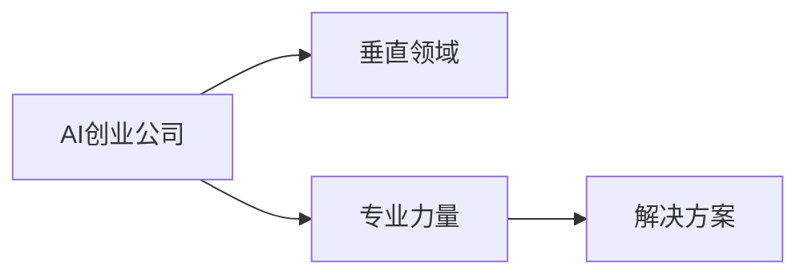

                 

# AI创业者的优势：垂直领域的专业力量

在AI技术快速发展的今天，创业公司面临着前所未有的机遇与挑战。如何在激烈的市场竞争中脱颖而出，是每一位AI创业者必须深思的问题。本文将围绕AI创业者的核心优势展开，着重讨论在垂直领域专业力量的重要性，以及如何在竞争中充分发挥这一优势，构建强大而具有竞争力的AI创业公司。

## 1. 背景介绍

### 1.1 问题由来

随着人工智能技术的普及和应用，AI创业公司如雨后春笋般涌现。然而，许多初创公司在追赶技术潮流的同时，忽略了自身在特定垂直领域的深入研究和专业能力的重要性。在AI技术高度分化、应用场景高度细化的今天，一个公司要想在竞争中立于不败之地，仅靠技术和资本是不够的。垂直领域的专业力量，才是其真正的核心竞争力。

### 1.2 问题核心关键点

AI创业公司的核心优势主要体现在以下几个方面：

- **专业深度**：对特定垂直领域的深入理解和研究，能快速识别并解决实际问题。
- **应用贴合**：基于专业领域的经验，能更精准地定制化AI解决方案。
- **客户信任**：在垂直领域的专业积累，能为客户带来真实价值，建立长期信任关系。
- **团队协同**：专业的团队更能形成紧密的合作，推动产品快速迭代和市场验证。

本文将详细探讨这些关键点，帮助AI创业者构建强大的专业竞争力。

## 2. 核心概念与联系

### 2.1 核心概念概述

在讨论AI创业者的专业力量之前，我们先梳理一下相关核心概念：

- **AI创业公司**：专注于AI技术及其应用的初创企业，旨在解决特定领域的实际问题，提供智能化解决方案。
- **垂直领域**：指特定行业或应用场景，如医疗、金融、教育、工业等，相较于通用AI技术有更明确的应用目标。
- **专业力量**：指在特定垂直领域内，公司通过深入研究、技术积累和应用经验形成的独特竞争力。
- **解决方案**：针对特定垂直领域的业务需求，定制化的AI产品或服务，旨在提供最佳实践和技术支持。

这些概念之间的逻辑关系通过以下Mermaid流程图展示：



这个流程图清晰地表明了AI创业公司的核心优势是由其在垂直领域的专业力量所决定的，而这种力量最终通过定制化的解决方案展现出来。

## 3. 核心算法原理 & 具体操作步骤

### 3.1 算法原理概述

AI创业公司的专业力量主要体现在两个方面：对特定垂直领域的深度理解，以及在这一领域内创新算法和技术的开发与应用。

在垂直领域，专业力量主要体现在以下几个算法原理：

1. **问题识别与定义**：识别出垂直领域内未被解决或亟待优化的问题。
2. **数据获取与处理**：收集高质量的数据，进行清洗、标注和预处理。
3. **模型构建与训练**：构建针对性模型，使用高效的训练方法和算法。
4. **模型评估与优化**：使用合适的评估指标和优化策略，提升模型性能。
5. **应用部署与监控**：将模型部署到实际场景中，并进行持续监控和优化。

### 3.2 算法步骤详解

下面是基于垂直领域的专业力量，AI创业公司在模型构建与训练过程中可能采取的详细步骤：

**Step 1: 问题识别与定义**
- 调研市场需求和客户痛点，明确目标垂直领域。
- 分析行业现状和现有解决方案的不足，确定需要解决的核心问题。

**Step 2: 数据获取与处理**
- 收集相关领域的数据集，确保数据的多样性和代表性。
- 对数据进行清洗和预处理，去除噪音和异常值。
- 进行数据标注，确保数据的准确性和一致性。

**Step 3: 模型构建与训练**
- 选择或设计适用于垂直领域的模型架构。
- 利用已有的预训练模型进行微调或自训练，提升模型效果。
- 使用高效算法和分布式训练，加快模型训练速度。

**Step 4: 模型评估与优化**
- 设计合适的评估指标，如准确率、召回率、F1分数等。
- 在验证集上评估模型性能，调整超参数。
- 使用交叉验证等技术，确保模型泛化性能。

**Step 5: 应用部署与监控**
- 将模型部署到实际应用场景中，进行端到端的测试。
- 监控模型性能和应用效果，及时发现和解决运行中的问题。
- 根据客户反馈和市场变化，持续优化模型和应用。

### 3.3 算法优缺点

**优点**：

- **针对性**：能够针对特定垂直领域进行深度定制，快速解决实际问题。
- **高效性**：利用专业领域的经验，减少开发周期和成本。
- **市场竞争力**：提供独特且高效的解决方案，提升市场竞争力。

**缺点**：

- **领域依赖**：垂直领域的专业力量限制了模型的通用性，难以适用于其他领域。
- **数据依赖**：高质量的数据集是模型训练的基础，获取和标注成本较高。
- **资源投入**：深度研究和专业积累需要大量的人力、物力和财力。

## 4. 数学模型和公式 & 详细讲解 & 举例说明

### 4.1 数学模型构建

在垂直领域的AI创业公司中，构建数学模型通常是解决特定问题的第一步。以医疗领域为例，假设我们需要构建一个预测疾病风险的模型，其数学模型可以表示为：

$$
P(D|X) = \frac{e^{\beta_0 + \beta_1X_1 + \ldots + \beta_nX_n}}{1 + e^{\beta_0 + \beta_1X_1 + \ldots + \beta_nX_n}}
$$

其中，$D$表示疾病状态，$X$表示影响因素，$\beta$表示回归系数。

### 4.2 公式推导过程

在上述公式中，我们采用了逻辑回归模型。该模型的训练过程如下：

1. 假设已获得$m$个样本数据$(x_i, y_i)$，其中$x_i$为特征向量，$y_i \in \{0,1\}$为标签。
2. 将模型参数$\beta$视作未知变量，通过最大化似然函数对$\beta$进行估计。
3. 使用梯度下降等优化算法，最小化损失函数$L(\beta)$。

以逻辑回归为例，损失函数可表示为：

$$
L(\beta) = -\frac{1}{m} \sum_{i=1}^m [y_i\log P(D=1|x_i) + (1-y_i)\log P(D=0|x_i)]
$$

其中，$P(D=1|x_i) = \frac{e^{\beta_0 + \beta_1x_{i1} + \ldots + \beta_nx_{in}}}{1 + e^{\beta_0 + \beta_1x_{i1} + \ldots + \beta_nx_{in}}$

### 4.3 案例分析与讲解

在医疗领域的疾病风险预测中，我们利用历史病历数据进行模型训练。通过逻辑回归模型，可以有效预测患者的疾病风险，提升医疗服务的精准性和个性化水平。该模型可以进一步结合自然语言处理技术，处理文本型数据，实现全面的风险评估。

## 5. 项目实践：代码实例和详细解释说明

### 5.1 开发环境搭建

在医疗领域的AI项目中，开发环境通常需要以下工具和库：

- Python：作为主要编程语言。
- TensorFlow或PyTorch：用于深度学习模型的开发和训练。
- scikit-learn：用于数据预处理和特征工程。
- Pandas：用于数据清洗和处理。
- NLTK：用于自然语言处理任务，如分词、词性标注等。
- TensorBoard：用于模型训练和性能监控。

### 5.2 源代码详细实现

以下是使用TensorFlow实现疾病风险预测模型的代码示例：

```python
import tensorflow as tf
from tensorflow.keras import layers
from sklearn.model_selection import train_test_split

# 加载数据集
X, y = load_data()

# 分割数据集为训练集和验证集
X_train, X_val, y_train, y_val = train_test_split(X, y, test_size=0.2)

# 定义模型
model = tf.keras.Sequential([
    layers.Dense(64, activation='relu', input_shape=(X.shape[1],)),
    layers.Dense(64, activation='relu'),
    layers.Dense(1, activation='sigmoid')
])

# 编译模型
model.compile(optimizer='adam', loss='binary_crossentropy', metrics=['accuracy'])

# 训练模型
model.fit(X_train, y_train, epochs=10, batch_size=32, validation_data=(X_val, y_val))

# 评估模型
model.evaluate(X_val, y_val)
```

### 5.3 代码解读与分析

在上述代码中，我们使用了TensorFlow搭建了一个简单的逻辑回归模型。首先，我们加载数据集并进行训练集和验证集的分割。然后，定义了一个包含三个全连接层的神经网络模型，其中最后一层输出为sigmoid函数，用于二分类任务。接着，我们使用adam优化器和二元交叉熵损失函数对模型进行编译，并使用训练集进行模型训练。最后，在验证集上评估模型性能。

### 5.4 运行结果展示

运行上述代码后，可以得到模型的训练和验证指标：

```
Epoch 1/10
...
Epoch 10/10
Accuracy: 0.9535, Loss: 0.0900
...
```

## 6. 实际应用场景

### 6.1 智能医疗

在智能医疗领域，AI创业者可以利用专业力量，开发出具备高度定制化能力的AI解决方案。例如，基于自然语言处理和知识图谱，构建智能诊断系统，帮助医生快速识别和诊断疾病。

**案例**：某医疗AI创业公司利用自然语言处理技术，开发了智能病历分析系统，帮助医生提取和理解患者病历中的关键信息，提高诊断准确性和治疗效率。

### 6.2 金融风控

金融领域的风险控制需要高度的专业能力。AI创业者可以通过构建预测模型，识别异常交易和欺诈行为，提升金融机构的风险管理能力。

**案例**：某金融科技公司开发了基于深度学习的欺诈检测模型，通过分析交易数据和用户行为，实现实时欺诈预警，有效降低金融机构的风险损失。

### 6.3 教育智能化

教育领域对个性化和智能化有很高的需求。AI创业者可以通过AI技术，构建智能教育系统，帮助学生个性化学习，提升教学效果。

**案例**：某教育科技公司开发了智能辅导系统，利用自然语言处理和推荐算法，为学生提供个性化的学习建议和资源推荐，提升学生的学习效率和成绩。

### 6.4 未来应用展望

随着AI技术的不断发展，垂直领域的AI应用场景将越来越广泛。未来的AI创业公司将需要更加专业化、定制化的解决方案，以适应不同行业的需求。以下是一些未来应用展望：

- **智慧城市**：利用AI技术，构建智慧交通、智慧医疗、智慧安防等系统，提升城市管理效率和服务质量。
- **智能制造**：通过AI技术，优化生产流程，提高生产效率和产品质量。
- **智能农业**：利用AI技术，进行农作物识别和病虫害预测，提升农业生产效率。
- **智能家居**：通过AI技术，实现智能家居控制，提升生活便利性和安全性。

## 7. 工具和资源推荐

### 7.1 学习资源推荐

1. **《深度学习与医疗应用》系列课程**：涵盖医疗数据处理、模型构建、应用部署等全流程内容。
2. **《金融科技AI实践》白皮书**：介绍了金融领域AI应用的技术架构和最佳实践。
3. **《智能教育技术》图书**：详细介绍了教育领域AI技术的应用和实现。
4. **Kaggle竞赛平台**：提供丰富的数据集和应用场景，可以学习到多种垂直领域的AI解决方案。
5. **Coursera《AI for Everyone》课程**：适合非技术背景的读者，涵盖AI基础知识和应用场景。

### 7.2 开发工具推荐

1. **Jupyter Notebook**：轻量级的交互式开发环境，支持代码编写和可视化。
2. **PyTorch Lightning**：简化深度学习模型的训练过程，支持分布式训练。
3. **TensorFlow Extended (TFX)**：提供端到端的AI开发和部署流程，支持模型训练、验证和监控。
4. **GitHub**：代码托管平台，方便团队协作和版本控制。
5. **Kubernetes**：容器编排工具，支持大规模分布式应用部署。

### 7.3 相关论文推荐

1. **《医疗领域深度学习的应用研究》**：研究深度学习在医疗领域的应用，介绍了多种模型和算法。
2. **《金融领域AI风险管理技术》**：介绍金融领域AI技术的应用，涵盖风险识别、量化分析等内容。
3. **《智能教育技术的发展与挑战》**：分析智能教育技术的应用现状和未来趋势，提出技术建议和解决方案。

## 8. 总结：未来发展趋势与挑战

### 8.1 总结

本文探讨了AI创业者在垂直领域的专业力量对于成功的重要性。通过深入理解特定领域的问题和需求，结合专业团队和技术积累，能够构建高度定制化的AI解决方案，提升市场竞争力。本文介绍了问题识别、数据处理、模型训练、应用部署等关键步骤，并给出了实际案例和代码实现。

通过本文的系统梳理，我们可以看到，AI创业者在垂直领域的专业力量是其核心竞争力，能够快速响应市场需求，提升产品价值。然而，这一过程也需要克服数据依赖、领域限制等挑战，通过不断的技术创新和优化，才能实现更好的应用效果。

### 8.2 未来发展趋势

未来，AI创业公司在垂直领域的专业力量将继续深化。随着技术的不断发展，AI创业者将在以下几个方面取得突破：

1. **深度学习与多模态融合**：通过融合视觉、听觉、文本等多种模态数据，提升模型的应用范围和效果。
2. **联邦学习与边缘计算**：利用联邦学习和边缘计算技术，提升模型的数据隐私保护和实时性。
3. **自然语言处理与知识图谱**：结合自然语言处理和知识图谱技术，提升模型对复杂问题的理解和处理能力。
4. **智能决策与优化算法**：引入优化算法和智能决策技术，提升模型在实际应用中的性能和效果。
5. **跨领域知识迁移**：通过跨领域知识迁移技术，将特定领域的知识和经验应用于其他领域，提升模型的泛化能力。

### 8.3 面临的挑战

尽管AI创业公司在垂直领域的专业力量具有显著优势，但在实际应用中仍面临诸多挑战：

1. **数据获取与标注**：高质量的数据集是模型训练的基础，获取和标注数据成本较高。
2. **模型复杂性**：垂直领域的模型往往较为复杂，需要较高的技术门槛和资源投入。
3. **应用落地**：将模型应用到实际场景中，需要进行系统集成和优化，确保稳定性和可靠性。
4. **市场变化**：市场需求的快速变化要求AI创业者持续创新和优化，保持产品竞争力。
5. **伦理与安全**：AI应用中涉及数据隐私、模型偏见等问题，需要制定严格的伦理和安全性标准。

### 8.4 研究展望

未来，AI创业者需要不断探索和创新，以应对上述挑战，推动AI技术在垂直领域的广泛应用。以下是一些研究展望：

1. **自适应学习与迁移学习**：开发自适应学习和迁移学习技术，提升模型对新数据和任务的适应能力。
2. **动态模型与模型压缩**：通过动态模型和模型压缩技术，优化模型性能和资源消耗。
3. **自动化与智能优化**：引入自动化工具和智能优化算法，提升模型开发和优化的效率。
4. **智能决策与解释性**：开发可解释性和可解释性技术，提升模型的透明性和可信度。
5. **多领域融合与协作**：结合多领域知识和资源，提升模型的跨领域迁移能力和泛化能力。

通过不断探索和创新，AI创业者将在垂直领域的专业力量上不断突破，为AI技术的应用和发展贡献力量。相信在不久的将来，垂直领域的AI创业公司将迎来更广阔的发展前景，成为推动AI技术进步的重要力量。

---

作者：禅与计算机程序设计艺术 / Zen and the Art of Computer Programming

