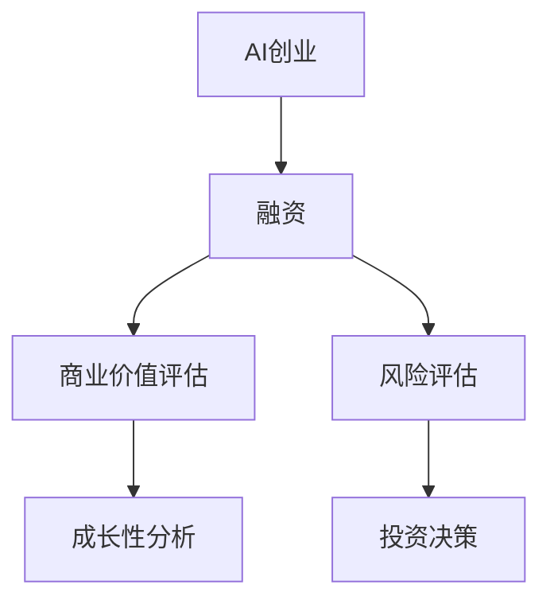

                 

# AI创业融资新趋势：关注项目商业价值与成长性

在人工智能(AI)领域，创业融资一直是一个热门话题。随着技术的不断进步和应用场景的日益丰富，AI创业公司也逐渐从科技前沿转向实际应用，越来越多地关注项目的商业价值与成长性。本文将从AI创业融资的新趋势、项目商业价值的评估、以及成长性分析等多个角度，深入探讨如何更好地吸引投资并推动AI项目成功落地。

## 1. 背景介绍

### 1.1 问题由来

近年来，人工智能技术取得了显著进展，从深度学习到自然语言处理，再到计算机视觉，AI技术在各行各业的应用日趋成熟。然而，尽管技术层面取得了突破，AI创业公司在融资时依然面临诸多挑战。传统VC对AI项目的要求更加严格，关注点从技术创新转向商业模式和业务落地。

### 1.2 问题核心关键点

AI创业融资的核心关键点在于：
1. 技术领先性：公司的核心竞争力，即在AI算法、模型等方面的创新和优势。
2. 商业化潜力：产品的市场需求、市场空间、竞争优势及盈利模式。
3. 业务落地能力：产品的实际应用效果、客户反馈、市场推广及拓展策略。
4. 团队实力：创业团队的经验、背景、技术能力及行业影响力。
5. 数据与资源：项目的可用数据资源、算力支持及外部合作资源。

## 2. 核心概念与联系

### 2.1 核心概念概述

为更好地理解AI创业融资的趋势，本节将介绍几个密切相关的核心概念：

- **AI创业**：指通过利用AI技术，开发具有创新性的产品或服务，并在市场上获得商业成功的创业行为。
- **融资**：指企业通过出让一定比例的股权或债权，获得资金用于公司运营和发展。
- **商业价值**：指项目在市场上的商业意义，包括市场规模、利润空间、竞争优势等。
- **成长性**：指项目在商业化过程中的增长潜力和发展速度。
- **风险评估**：指对项目的技术、市场、竞争、运营等风险进行全面评估。

这些核心概念之间的逻辑关系可以通过以下Mermaid流程图来展示：



这个流程图展示了点到点的逻辑关系：AI创业从融资开始，先进行商业价值和成长性的分析，然后综合考虑风险，做出投资决策。

## 3. 核心算法原理 & 具体操作步骤
### 3.1 算法原理概述

AI创业融资的核心算法原理主要围绕商业价值和成长性展开。通过构建相应的数学模型，分析项目的商业潜力和发展速度，从而指导投资决策。

### 3.2 算法步骤详解

**Step 1: 收集数据**

- **商业数据**：包括市场规模、用户增长率、市场占有率、营收和利润预测等。
- **技术数据**：涉及算法的创新性、数据集的大小、计算资源的可用性等。
- **团队数据**：包括创业团队的经验、背景、技术能力及行业影响力等。

**Step 2: 数据预处理**

- **清洗与标注**：去除异常值，标注数据集的类别，准备输入模型。
- **标准化与归一化**：将不同类型的数据转化为模型所需的数值型特征，提高模型的泛化能力。
- **特征工程**：构造和选择模型输入的特征，以提高预测的准确性。

**Step 3: 构建模型**

- **商业价值模型**：使用回归或分类算法，评估项目在市场上的商业价值。
- **成长性模型**：使用时间序列分析、机器学习等方法，预测项目的增长速度和市场潜力。
- **风险评估模型**：使用统计模型或神经网络，分析项目的技术、市场、竞争、运营等方面的风险。

**Step 4: 模型训练与验证**

- **训练**：使用历史数据对模型进行训练，调整参数以优化预测性能。
- **验证**：使用交叉验证等方法，评估模型的泛化能力和稳定性。
- **优化**：根据验证结果，调整模型结构和参数，提高预测精度。

**Step 5: 投资决策**

- **综合评估**：将商业价值、成长性和风险评估结果综合考量，生成投资决策报告。
- **策略制定**：根据评估结果，制定投资策略和路径，包括估值、投资比例、时间表等。
- **风险控制**：设计风险管理方案，如退出机制、止损策略等，降低投资风险。

### 3.3 算法优缺点

**优点：**
- **数据驱动**：通过模型分析，提供客观的评估依据，减少主观判断。
- **预测准确**：利用统计和机器学习算法，提高预测的准确性。
- **全面性**：综合考虑商业价值、成长性和风险，提供全面的投资参考。

**缺点：**
- **模型依赖**：模型的准确性受数据质量和算法选择的影响，需要持续迭代优化。
- **计算成本**：构建和训练模型需要较高的计算资源和时间。
- **假设条件**：模型往往基于一定的假设和简化，可能与实际情况存在差异。

### 3.4 算法应用领域

AI创业融资的算法在多个领域都有广泛应用，包括但不限于：

- **AI创业公司评估**：帮助VC快速评估AI项目的技术领先性、商业价值和成长潜力。
- **投资组合管理**：利用成长性模型和风险评估模型，优化投资组合的分布和风险控制。
- **创业团队筛选**：通过团队数据的分析，筛选出具有潜在商业价值和技术能力的创业团队。
- **市场分析**：预测市场的发展趋势和变化，辅助制定市场推广策略和定价策略。
- **业务拓展**：评估新市场的潜力和价值，制定有效的业务拓展计划。

## 4. 数学模型和公式 & 详细讲解  
### 4.1 数学模型构建

在AI创业融资中，常见的数学模型包括回归模型、分类模型、时间序列模型等。这里以回归模型为例，构建商业价值的预测模型。

假设商业价值 $V$ 与市场规模 $M$、用户增长率 $G$、技术创新性 $I$、团队实力 $T$ 等因素有关，可以构建如下回归模型：

$$
V = \alpha_0 + \alpha_1M + \alpha_2G + \alpha_3I + \alpha_4T + \epsilon
$$

其中，$\alpha_0$ 为截距，$\alpha_1, \alpha_2, \alpha_3, \alpha_4$ 为模型系数，$\epsilon$ 为误差项。

### 4.2 公式推导过程

以回归模型为例，其训练和预测过程可以归纳如下：

1. **训练**：
   - 使用历史数据 $(x_i, y_i)$ 训练模型，最小化均方误差 $E(V_i, \hat{V}_i) = \frac{1}{N} \sum_{i=1}^N (V_i - \hat{V}_i)^2$。
   - 通过求解损失函数 $\min_{\alpha} E(V_i, \hat{V}_i)$，得到模型参数 $\alpha = (\alpha_0, \alpha_1, \alpha_2, \alpha_3, \alpha_4)$。

2. **预测**：
   - 对于新的数据 $x$，通过模型 $\hat{V} = \alpha_0 + \alpha_1x_1 + \alpha_2x_2 + \alpha_3x_3 + \alpha_4x_4$ 进行预测。

### 4.3 案例分析与讲解

假设某AI创业公司专注于医疗影像诊断，收集了以下数据：

- 市场规模 $M=1000$ 亿元。
- 用户增长率 $G=30\%$。
- 技术创新性 $I=0.8$。
- 团队实力 $T=8$。

使用上述回归模型，可以计算出该公司的商业价值 $V$ 为：

$$
V = \alpha_0 + \alpha_1 \times 1000 + \alpha_2 \times 0.3 + \alpha_3 \times 0.8 + \alpha_4 \times 8
$$

如果模型参数已知，可直接计算 $V$ 的值。如果模型参数需要通过历史数据训练，则需要进行数据预处理、模型训练、验证等步骤，最终得到 $\alpha$ 的值，代入计算 $V$。

## 5. 项目实践：代码实例和详细解释说明
### 5.1 开发环境搭建

在进行AI创业融资的模型构建和实践前，我们需要准备好开发环境。以下是使用Python进行Scikit-learn开发的环境配置流程：

1. 安装Anaconda：从官网下载并安装Anaconda，用于创建独立的Python环境。

2. 创建并激活虚拟环境：
```bash
conda create -n ai-funding-env python=3.8 
conda activate ai-funding-env
```

3. 安装相关库：
```bash
pip install pandas numpy matplotlib seaborn scikit-learn jupyter notebook ipython
```

4. 配置Jupyter Notebook：
```bash
jupyter notebook --notebook-dir=./notebooks
```

完成上述步骤后，即可在`ai-funding-env`环境中开始AI创业融资的模型构建与实践。

### 5.2 源代码详细实现

下面我们以AI创业公司的商业价值评估为例，给出使用Scikit-learn进行模型构建的Python代码实现。

首先，定义商业价值模型的数据预处理函数：

```python
from sklearn.model_selection import train_test_split
from sklearn.preprocessing import StandardScaler

def preprocess_data(X, y):
    X_train, X_test, y_train, y_test = train_test_split(X, y, test_size=0.2, random_state=42)
    scaler = StandardScaler()
    X_train = scaler.fit_transform(X_train)
    X_test = scaler.transform(X_test)
    return X_train, X_test, y_train, y_test
```

然后，定义商业价值模型的训练函数：

```python
from sklearn.linear_model import LinearRegression

def train_model(X, y):
    model = LinearRegression()
    model.fit(X, y)
    return model
```

接着，定义商业价值模型的预测函数：

```python
def predict_value(model, X):
    return model.predict(X)
```

最后，启动模型训练流程：

```python
# 假设数据集为X, y，其中X为输入特征，y为商业价值
X_train, X_test, y_train, y_test = preprocess_data(X, y)

# 训练模型
model = train_model(X_train, y_train)

# 预测
y_pred = predict_value(model, X_test)

# 输出结果
print(y_pred)
```

以上就是使用Scikit-learn构建商业价值预测模型的完整代码实现。可以看到，Scikit-learn提供了简单易用的接口，可以方便地进行数据预处理、模型训练和预测。

### 5.3 代码解读与分析

让我们再详细解读一下关键代码的实现细节：

**preprocess_data函数**：
- 使用train_test_split将数据集划分为训练集和测试集。
- 使用StandardScaler对训练集进行标准化处理，以便模型更好地拟合。
- 对测试集进行标准化，以保证预测结果的一致性。

**train_model函数**：
- 定义线性回归模型，使用fit方法训练模型，并返回训练好的模型。

**predict_value函数**：
- 使用训练好的模型对测试集进行预测，并返回预测结果。

**训练流程**：
- 首先进行数据预处理，将数据集划分为训练集和测试集，并进行标准化处理。
- 然后训练模型，使用历史数据对模型进行训练，得到最优参数。
- 最后进行预测，使用训练好的模型对测试集进行预测，并输出预测结果。

可以看到，Scikit-learn提供了丰富的机器学习算法和工具，可以快速实现商业价值预测模型的构建与实践。

## 6. 实际应用场景
### 6.1 智能医疗

在智能医疗领域，AI创业融资主要集中在医学影像诊断、个性化治疗、药物研发等方面。通过构建商业价值和成长性模型，可以评估AI项目的市场潜力、盈利能力和成长速度。

在医学影像诊断领域，AI模型可以自动分析X光片、CT影像等，提供快速准确的诊断结果。通过收集大量的医学影像数据，并标注相应的诊断结果，可以构建AI模型的训练集。同时，利用商业价值模型和成长性模型，评估该AI项目在医疗市场的竞争优势、盈利潜力和发展速度。

### 6.2 金融科技

金融科技领域是AI创业融资的热点之一。通过构建商业价值和成长性模型，可以评估AI项目在金融风险控制、智能投顾、量化交易等方面的商业潜力和市场空间。

在智能投顾领域，AI模型可以基于用户的历史交易数据和市场行情，提供个性化的投资建议。通过收集用户的交易数据和市场数据，并标注相应的投资结果，可以构建AI模型的训练集。同时，利用商业价值模型和成长性模型，评估该AI项目在智能投顾市场的竞争优势、盈利潜力和发展速度。

### 6.3 智能制造

智能制造领域也备受AI创业融资的关注。通过构建商业价值和成长性模型，可以评估AI项目在生产自动化、质量控制、供应链管理等方面的商业潜力和市场空间。

在生产自动化领域，AI模型可以实现设备的自主维护和生产调度。通过收集生产设备的运行数据，并标注相应的维护结果，可以构建AI模型的训练集。同时，利用商业价值模型和成长性模型，评估该AI项目在生产自动化市场的竞争优势、盈利潜力和发展速度。

## 7. 工具和资源推荐
### 7.1 学习资源推荐

为了帮助开发者系统掌握AI创业融资的理论基础和实践技巧，这里推荐一些优质的学习资源：

1. **《人工智能创业指南》**：全面介绍AI创业融资的理论基础和实践技巧，涵盖商业价值评估、市场分析、团队筛选等多个方面。

2. **《AI创业投资全攻略》**：系统讲解AI创业融资的流程和方法，从项目筛选到投资决策，每个环节都有详细指导。

3. **《AI创业公司生存手册》**：提供实用的AI创业融资策略和案例分析，帮助创业者应对融资过程中的各种挑战。

4. **《AI创业融资实战》**：分享AI创业融资的实际案例和经验，介绍成功融资的技巧和方法。

5. **在线课程**：如Coursera、Udemy等平台上的AI创业融资课程，深入讲解AI创业融资的各个环节。

通过对这些资源的学习实践，相信你一定能够全面掌握AI创业融资的理论和实践技能，从而更好地推动AI项目的商业化和落地。

### 7.2 开发工具推荐

高效的开发离不开优秀的工具支持。以下是几款用于AI创业融资开发的常用工具：

1. **Jupyter Notebook**：交互式编程环境，适合数据探索、模型训练和结果展示。
2. **Python**：开源编程语言，拥有丰富的机器学习库和数据处理工具。
3. **Scikit-learn**：开源机器学习库，提供简单易用的接口，支持多种算法。
4. **TensorFlow**：开源深度学习框架，支持分布式计算和模型优化。
5. **Weights & Biases**：模型训练的实验跟踪工具，记录和可视化模型训练过程中的各项指标。
6. **TensorBoard**：TensorFlow配套的可视化工具，实时监测模型训练状态，提供丰富的图表呈现方式。

合理利用这些工具，可以显著提升AI创业融资的开发效率，加快创新迭代的步伐。

### 7.3 相关论文推荐

AI创业融资的发展离不开学界的持续研究。以下是几篇奠基性的相关论文，推荐阅读：

1. **《AI创业融资的理论与实践》**：介绍AI创业融资的理论基础和实践方法，提供系统的分析框架。
2. **《智能制造中的AI创业融资》**：探讨智能制造领域AI创业融资的方法和策略，提供实际案例和经验总结。
3. **《金融科技中的AI创业融资》**：分析金融科技领域AI创业融资的特点和挑战，提出优化建议。
4. **《医疗影像诊断中的AI创业融资》**：讨论医疗影像诊断领域AI创业融资的方法和挑战，提供优化建议。
5. **《智能投顾中的AI创业融资》**：分析智能投顾领域AI创业融资的方法和策略，提供实际案例和经验总结。

这些论文代表了大语言模型微调技术的发展脉络。通过学习这些前沿成果，可以帮助研究者把握学科前进方向，激发更多的创新灵感。

## 8. 总结：未来发展趋势与挑战
### 8.1 研究成果总结

本文对AI创业融资的理论与实践进行了全面系统的介绍。首先阐述了AI创业融资的新趋势、项目商业价值的评估方法、以及成长性分析。其次，从原理到实践，详细讲解了AI创业融资的数学模型和具体操作步骤。最后，结合实际应用场景，分析了AI创业融资在不同领域的应用前景。

通过本文的系统梳理，可以看到，AI创业融资需要综合考虑技术、市场、团队等多方面的因素，进行全面的评估和决策。未来，随着AI技术的不断发展，AI创业融资也将面临更多的挑战和机遇。

### 8.2 未来发展趋势

展望未来，AI创业融资技术将呈现以下几个发展趋势：

1. **数据驱动**：随着大数据和云计算技术的发展，AI创业融资将越来越依赖于数据驱动的决策支持，利用AI技术对大量数据进行深度挖掘和分析。
2. **模型智能化**：AI创业融资模型将结合深度学习、自然语言处理等技术，提高预测的准确性和模型的自适应能力。
3. **系统集成化**：AI创业融资系统将更加集成化，整合多种模型和工具，提供综合化的评估和决策支持。
4. **自动化**：利用AI技术自动化地进行数据处理、模型训练和结果评估，提高效率和准确性。
5. **可视化**：AI创业融资系统将更加注重结果的可视化展示，帮助决策者直观地理解模型评估结果。
6. **实时化**：AI创业融资系统将实时监测市场变化和项目进展，提供动态的评估和决策支持。

以上趋势凸显了AI创业融资技术的先进性和应用前景。这些方向的探索发展，必将进一步提升AI创业融资的效率和准确性，为AI创业项目的成功落地提供坚实保障。

### 8.3 面临的挑战

尽管AI创业融资技术已经取得了显著进展，但在迈向更加智能化、普适化应用的过程中，仍面临诸多挑战：

1. **数据获取难度**：高质量的数据获取和标注往往需要投入大量人力物力，且数据质量直接影响模型的评估结果。
2. **模型复杂度**：AI创业融资模型涉及多个领域、多个维度，构建和优化复杂模型需要更高的技术门槛。
3. **决策透明性**：AI创业融资模型的决策过程需要具备高度透明性，以便决策者理解和信任模型的结果。
4. **风险控制**：AI创业融资模型需要综合考虑多种风险因素，制定有效的风险控制策略。
5. **市场变化**：市场需求和技术趋势不断变化，AI创业融资模型需要具备较强的自适应能力，及时调整策略。

这些挑战需要学界和业界共同努力，不断优化模型和算法，才能推动AI创业融资技术的发展和应用。

### 8.4 研究展望

面向未来，AI创业融资技术需要在以下几个方面进行探索和突破：

1. **数据自动化采集**：利用数据爬虫、API接口等技术，实现数据的自动化采集和标注。
2. **模型自动化优化**：开发自动化的模型优化算法，提高模型的训练效率和优化效果。
3. **决策透明化**：引入可解释AI技术，提高AI创业融资模型的透明性和可理解性。
4. **风险智能预警**：利用AI技术实时监测市场变化和项目风险，提供动态预警和建议。
5. **多模态融合**：结合多种数据类型和模型，实现多模态数据的融合和协同建模。
6. **隐私保护**：在数据采集和处理过程中，确保数据隐私和安全性，遵守相关法律法规。

这些研究方向将进一步推动AI创业融资技术的进步，为AI创业项目提供更加精准、高效的融资支持。

## 9. 附录：常见问题与解答
----------------------------------------------------------------
**Q1：AI创业融资中如何选择合适的模型和算法？**

A: 选择合适的模型和算法需要考虑以下因素：
1. 数据的类型和特征：不同类型的数据适合不同的模型，如回归模型适合连续型数据，分类模型适合离散型数据。
2. 模型的复杂度和可解释性：复杂模型可能提供更高的准确性，但难以解释；简单的模型可能易于理解，但精度有限。
3. 数据的规模和分布：大规模数据适合复杂的模型，小规模数据适合简单的模型。
4. 业务需求和目标：模型的目标是为融资决策提供支持，需要考虑预测的准确性和决策的透明性。

综合考虑这些因素，可以选择合适的模型和算法，构建满足业务需求的AI创业融资模型。

**Q2：AI创业融资中如何评估模型的准确性？**

A: 评估模型的准确性需要考虑以下指标：
1. 均方误差（MSE）：用于回归模型，衡量预测值与真实值之间的差距。
2. 平均绝对误差（MAE）：也用于回归模型，衡量预测值与真实值之间的平均差距。
3. 精确率和召回率（Precision and Recall）：用于分类模型，衡量模型的分类效果。
4. F1分数（F1 Score）：综合考虑精确率和召回率，提供更全面的评估指标。
5. ROC曲线和AUC（Area Under Curve）：用于评估二分类模型的性能，ROC曲线越接近左上角，模型性能越好。

在实际应用中，需要根据具体任务和数据类型，选择合适的评估指标。同时，结合交叉验证等方法，对模型进行多轮测试，以确保其准确性和泛化能力。

**Q3：AI创业融资中如何处理数据缺失问题？**

A: 数据缺失是AI创业融资中常见的问题，需要采取以下措施进行处理：
1. 数据补全：使用插值、均值填充、回归预测等方法，补全缺失数据。
2. 数据插值：使用线性插值、样条插值等方法，插值缺失数据。
3. 数据删除：删除缺失数据过多的样本，避免对模型产生负面影响。
4. 数据生成：利用生成模型，如GAN、VAE等，生成缺失数据。
5. 数据标记：利用已知数据，对缺失数据进行标记，减少对模型的影响。

在实际应用中，需要根据具体情况，选择合适的处理方式，以确保数据的完整性和模型评估的准确性。

**Q4：AI创业融资中如何优化模型性能？**

A: 优化模型性能需要考虑以下方法：
1. 参数调优：通过网格搜索、随机搜索等方法，优化模型的超参数。
2. 特征工程：通过特征选择、特征提取等方法，提高模型的输入质量。
3. 模型融合：通过集成多个模型，提高模型的泛化能力和稳定性。
4. 模型正则化：通过L1正则、L2正则、Dropout等方法，避免过拟合。
5. 数据增强：通过数据扩充、数据增强等方法，增加训练数据的多样性。
6. 模型简化：通过剪枝、降维等方法，简化模型结构，提高计算效率。

在实际应用中，需要根据具体情况，选择合适的优化方法，以提高模型的准确性和泛化能力。

**Q5：AI创业融资中如何降低模型风险？**

A: 降低模型风险需要考虑以下方法：
1. 风险评估：通过构建风险评估模型，分析项目的市场风险、技术风险、运营风险等。
2. 风险控制：制定风险控制策略，如止损机制、风险分散等，减少风险对模型的影响。
3. 风险预警：利用AI技术实时监测项目进展和市场变化，提供动态预警和建议。
4. 风险管理：建立风险管理机制，制定风险管理流程，确保风险的可控和可控。
5. 风险教育：对投资者进行风险教育，提高其风险意识和应对能力。

在实际应用中，需要综合考虑多种风险因素，制定全面的风险管理策略，确保AI创业融资项目的稳健发展。

---

作者：禅与计算机程序设计艺术 / Zen and the Art of Computer Programming

