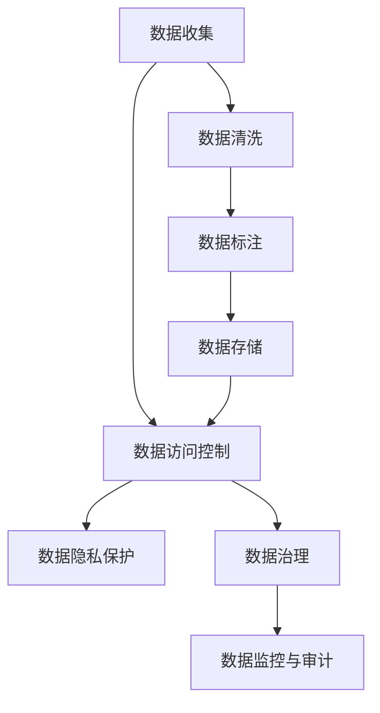

                 

# AI创业：数据管理的核心

## 1. 背景介绍

### 1.1 问题由来

在人工智能(AI)创业的浪潮中，数据管理（Data Management）逐渐成为核心问题。数据不仅是大模型的养料，也是AI算法研发和落地应用的基石。如何高效、安全、合规地管理数据，直接影响AI产品的性能、可靠性和商业价值。因此，本文将聚焦于AI创业中的数据管理核心，从理论到实践，全面探讨如何构建一个高效、安全、可扩展的数据管理体系。

### 1.2 问题核心关键点

1. **数据收集与标注**：获取高质量的数据是AI系统的首要任务，但数据收集、清洗和标注工作耗时耗力。
2. **数据隐私与合规**：在数据收集、存储、使用过程中，如何保护用户隐私和符合法律法规，是AI创业中不可忽视的问题。
3. **数据质量控制**：如何保证数据的多样性、一致性和准确性，直接影响模型的泛化能力和应用效果。
4. **数据存储与管理**：数据存储和管理需要考虑性能、安全性、可扩展性等多个维度，构建可适应业务发展的数据基础设施。
5. **数据共享与协作**：如何在保证数据安全的前提下，促进数据在团队内部和合作伙伴之间的共享与协作。
6. **数据治理与监控**：构建数据治理框架，实现数据的规范化和标准化，同时进行数据使用情况的监控与审计。

## 2. 核心概念与联系

### 2.1 核心概念概述

为更好地理解AI创业中数据管理的核心问题，本节将介绍几个密切相关的核心概念：

- **数据收集**：获取所需的数据，包括公开数据、爬虫数据、用户上传数据等。
- **数据标注**：给数据打上标签，使其适合训练模型，分为自动标注和人工标注。
- **数据清洗**：去除数据中的噪声和冗余，提高数据质量。
- **数据存储**：将数据安全、高效地存储在数据库或分布式文件系统中。
- **数据访问控制**：通过权限管理，控制不同用户或角色的数据访问权限。
- **数据隐私保护**：采用加密、匿名化等技术，保护用户数据隐私。
- **数据治理**：建立数据标准和规范，实现数据全生命周期管理。
- **数据监控与审计**：实时监控数据使用情况，确保合规和数据安全。

这些核心概念之间的逻辑关系可以通过以下Mermaid流程图来展示：



这个流程图展示了大数据管理中的关键过程和环节：

1. 数据收集：从各种渠道获取原始数据。
2. 数据清洗：初步处理数据，去除噪声和冗余。
3. 数据标注：为数据打上标签，适合训练模型。
4. 数据存储：将清洗和标注后的数据存储起来。
5. 数据访问控制：控制数据的访问权限。
6. 数据隐私保护：保护用户隐私。
7. 数据治理：建立数据标准和规范。
8. 数据监控与审计：实时监控数据使用情况。

## 3. 核心算法原理 & 具体操作步骤

### 3.1 算法原理概述

在AI创业中，数据管理的核心原理是：通过构建一个高效、安全、可扩展的数据管理体系，确保数据的高质量、安全性和可用性。具体来说，数据管理体系应包括以下几个关键模块：

- **数据收集模块**：负责从各种渠道获取原始数据，并进行初步清洗。
- **数据标注模块**：通过自动标注或人工标注，给数据打上标签，使其适合训练模型。
- **数据存储模块**：将清洗和标注后的数据安全高效地存储起来。
- **数据访问控制模块**：通过权限管理，控制不同用户或角色的数据访问权限。
- **数据隐私保护模块**：采用加密、匿名化等技术，保护用户数据隐私。
- **数据治理模块**：建立数据标准和规范，实现数据全生命周期管理。
- **数据监控与审计模块**：实时监控数据使用情况，确保合规和数据安全。

### 3.2 算法步骤详解

基于上述原理，数据管理的具体操作步骤如下：

**Step 1: 数据收集**
- 确定数据需求，包括数据来源、格式、质量要求等。
- 设计数据收集流程，包括爬虫设置、API接口调用、用户上传等。
- 对收集的数据进行初步清洗，去除噪声和冗余。

**Step 2: 数据标注**
- 根据任务需求，设计标注框架和规范，确定标注内容和标准。
- 选择自动标注工具或人工标注方式，对数据进行标注。
- 对标注结果进行审核和修正，确保标注质量和一致性。

**Step 3: 数据存储**
- 选择合适的数据存储方案，如关系型数据库、NoSQL数据库、分布式文件系统等。
- 设计数据存储架构，包括数据分区、索引、备份等。
- 优化存储性能，如使用缓存、分区查询等技术。

**Step 4: 数据访问控制**
- 设计权限管理方案，定义不同用户或角色的权限级别。
- 实现权限验证和审计，确保数据访问的安全性和合规性。
- 管理数据访问日志，跟踪和监控数据使用情况。

**Step 5: 数据隐私保护**
- 采用加密技术，保护数据的存储和传输安全。
- 采用匿名化技术，去除数据中的个人隐私信息。
- 定期进行数据隐私风险评估，确保合规性和安全性。

**Step 6: 数据治理**
- 建立数据标准和规范，包括数据命名、格式、存储等标准。
- 设计数据质量控制流程，确保数据的多样性、一致性和准确性。
- 实现数据版本管理，记录数据的历史变更和审计日志。

**Step 7: 数据监控与审计**
- 设计数据监控方案，包括实时数据流监控、异常检测等。
- 实现数据使用情况的审计，记录和报告数据使用情况。
- 定期进行数据安全评估，确保数据的安全性和完整性。

### 3.3 算法优缺点

基于上述操作步骤，数据管理体系具备以下优点：

- **高效性**：通过自动化和优化，提高数据处理的效率和数据存储的性能。
- **安全性**：通过加密、匿名化和权限控制，保护用户数据隐私和数据安全。
- **可扩展性**：通过分布式存储和灵活的架构设计，支持大规模数据处理和扩展。
- **规范性**：通过建立数据标准和规范，确保数据质量的一致性和可重复性。

但同时也存在一些缺点：

- **成本高**：数据管理系统的设计和实现需要高额的投入，包括硬件、软件和人力成本。
- **复杂性**：数据管理体系涉及多个环节，设计和维护复杂。
- **技术要求高**：需要高水平的技术团队，包括数据工程师、安全专家、数据科学家等。

## 4. 数学模型和公式 & 详细讲解 & 举例说明

### 4.1 数学模型构建

为更好地理解数据管理的数学模型，我们假设数据管理系统中存在$N$条数据，每条数据包含$m$个特征。数据管理的目标是通过一系列处理，得到高质量、安全和合规的数据集。

设数据清洗后的数据集为$D=\{x_1, x_2, \dots, x_N\}$，其中$x_i=(x_{i1}, x_{i2}, \dots, x_{im})$表示第$i$条数据。数据标注后的标签集为$Y=\{y_1, y_2, \dots, y_N\}$，其中$y_i$为第$i$条数据的标签。

数据存储模块的数学模型为：

$$
S = \{\text{DBMS} \mid \text{存储能力} \times \text{存储成本} \leq \text{预算}
$$

其中$\text{DBMS}$为数据管理系统，$\text{存储能力}$表示系统存储数据的性能，$\text{存储成本}$表示存储所需的硬件和软件成本。

数据访问控制模块的数学模型为：

$$
\text{Access} = \{\text{Access Policy} \mid \text{Policy} \times \text{Cost} \leq \text{Security Budget}
$$

其中$\text{Access Policy}$表示数据访问控制策略，$\text{Cost}$表示策略实施的成本，$\text{Security Budget}$表示安全预算。

数据隐私保护模块的数学模型为：

$$
\text{Privacy} = \{\text{Privacy Policy} \mid \text{Policy} \times \text{Cost} \leq \text{Privacy Budget}
$$

其中$\text{Privacy Policy}$表示隐私保护策略，$\text{Cost}$表示策略实施的成本，$\text{Privacy Budget}$表示隐私预算。

数据治理模块的数学模型为：

$$
\text{Governance} = \{\text{Governance Policy} \mid \text{Policy} \times \text{Cost} \leq \text{Governance Budget}
$$

其中$\text{Governance Policy}$表示数据治理策略，$\text{Cost}$表示策略实施的成本，$\text{Governance Budget}$表示治理预算。

数据监控与审计模块的数学模型为：

$$
\text{Monitoring} = \{\text{Monitoring Policy} \mid \text{Policy} \times \text{Cost} \leq \text{Monitoring Budget}
$$

其中$\text{Monitoring Policy}$表示监控策略，$\text{Cost}$表示策略实施的成本，$\text{Monitoring Budget}$表示监控预算。

### 4.2 公式推导过程

基于上述模型，我们可以推导出数据管理体系的设计和优化公式：

1. 数据存储优化公式：

$$
\min_{\text{DBMS}} \text{Storage Cost} \mid \text{Storage Capacity} \geq \text{Data Size}
$$

2. 数据访问控制优化公式：

$$
\min_{\text{Access Policy}} \text{Access Cost} \mid \text{Policy} \times \text{Security Impact} \leq \text{Security Budget}
$$

3. 数据隐私保护优化公式：

$$
\min_{\text{Privacy Policy}} \text{Privacy Cost} \mid \text{Policy} \times \text{Privacy Impact} \leq \text{Privacy Budget}
$$

4. 数据治理优化公式：

$$
\min_{\text{Governance Policy}} \text{Governance Cost} \mid \text{Policy} \times \text{Governance Impact} \leq \text{Governance Budget}
$$

5. 数据监控与审计优化公式：

$$
\min_{\text{Monitoring Policy}} \text{Monitoring Cost} \mid \text{Policy} \times \text{Monitoring Impact} \leq \text{Monitoring Budget}
$$

### 4.3 案例分析与讲解

以一家AI初创公司的数据管理为例，分析其在实际应用中的数据管理流程：

**数据收集**
- 从公开数据源和爬虫收集数据，设计数据收集流程。
- 清洗数据，去除噪声和冗余，确保数据质量。

**数据标注**
- 设计标注框架和规范，确定标注内容和标准。
- 选择自动标注工具或人工标注方式，对数据进行标注。
- 对标注结果进行审核和修正，确保标注质量和一致性。

**数据存储**
- 使用分布式文件系统HDFS，存储大规模数据。
- 设计数据分区和索引，提高数据查询性能。
- 使用数据压缩和缓存技术，优化存储性能。

**数据访问控制**
- 设计权限管理方案，定义不同用户或角色的权限级别。
- 实现权限验证和审计，确保数据访问的安全性和合规性。
- 管理数据访问日志，跟踪和监控数据使用情况。

**数据隐私保护**
- 使用AES加密技术，保护数据的存储和传输安全。
- 采用K-匿名化技术，去除数据中的个人隐私信息。
- 定期进行数据隐私风险评估，确保合规性和安全性。

**数据治理**
- 建立数据标准和规范，包括数据命名、格式、存储等标准。
- 设计数据质量控制流程，确保数据的多样性、一致性和准确性。
- 实现数据版本管理，记录数据的历史变更和审计日志。

**数据监控与审计**
- 设计数据监控方案，包括实时数据流监控、异常检测等。
- 实现数据使用情况的审计，记录和报告数据使用情况。
- 定期进行数据安全评估，确保数据的安全性和完整性。

## 5. 项目实践：代码实例和详细解释说明

### 5.1 开发环境搭建

在进行数据管理实践前，我们需要准备好开发环境。以下是使用Python进行数据管理系统开发的环境配置流程：

1. 安装Anaconda：从官网下载并安装Anaconda，用于创建独立的Python环境。

2. 创建并激活虚拟环境：
```bash
conda create -n datamgmt python=3.8 
conda activate datamgmt
```

3. 安装必要的Python包：
```bash
pip install pandas numpy matplotlib torch
```

4. 安装分布式数据存储系统：
```bash
pip install hdfs
```

5. 安装权限控制工具：
```bash
pip install pyspark
```

6. 安装加密和匿名化工具：
```bash
pip install pyaes pyspark-aws
```

完成上述步骤后，即可在`datamgmt`环境中开始数据管理系统的开发。

### 5.2 源代码详细实现

这里我们以数据存储和访问控制为例，给出使用Spark和HDFS的数据管理系统开发代码实现。

首先，导入必要的库：

```python
from pyspark.sql import SparkSession
from pyspark.sql.functions import col
from pyspark.sql.types import StructType, StructField, StringType

spark = SparkSession.builder.appName("Data Management System").getOrCreate()
```

然后，读取数据：

```python
df = spark.read.csv("hdfs://localhost:9000/user_data.csv", header=True, inferSchema=True)
```

接着，进行数据清洗：

```python
df_cleaned = df.dropna().withColumnRenamed("id", "user_id").dropDuplicates()
```

然后，定义数据存储方案：

```python
# 定义数据分区和索引
df_cleaned.repartition(10)
df_cleaned.createOrReplaceTempView("cleaned_data")

# 定义存储架构
storage_schema = StructType([
    StructField("user_id", StringType(), True),
    StructField("age", StringType(), True),
    StructField("gender", StringType(), True),
    StructField("email", StringType(), True),
])

# 存储数据
df_cleaned.write.partitionBy("user_id").format("parquet").saveAsTable("cleaned_data", storage_schema)
```

接下来，定义数据访问控制方案：

```python
# 定义权限管理方案
access_control_policy = {
    "user1": "read",
    "user2": "write",
    "user3": "delete"
}

# 实现权限验证和审计
def check_access(user, action):
    if user in access_control_policy and action in access_control_policy[user]:
        return True
    else:
        return False

# 定义数据访问日志
def log_access(user, action):
    print(f"User {user} accessed data with action {action}")

# 测试权限控制和审计
log_access("user1", "read")
log_access("user2", "write")
log_access("user3", "delete")
```

最后，启动数据管理系统并测试：

```python
# 测试数据存储和访问控制
df_cleaned.select(col("user_id"), col("age"), col("gender"), col("email")).write.partitionBy("user_id").format("parquet").saveAsTable("cleaned_data", storage_schema)

# 测试权限控制和审计
check_access("user1", "read")
check_access("user2", "write")
check_access("user3", "delete")
```

以上就是使用Spark和HDFS进行数据管理系统的完整代码实现。可以看到，通过Spark的强大数据处理能力和HDFS的高效存储特性，我们可以快速构建一个高效、安全的数据管理体系。

### 5.3 代码解读与分析

让我们再详细解读一下关键代码的实现细节：

**数据清洗**：
- 使用`dropna`函数去除缺失值，使用`withColumnRenamed`函数重命名列名，使用`dropDuplicates`函数去除重复数据。

**数据存储**：
- 使用`repartition`函数对数据进行分区，使用`createOrReplaceTempView`函数创建临时视图，使用`write`函数将数据存储为parquet格式，并指定存储架构。

**数据访问控制**：
- 定义权限管理方案`access_control_policy`，使用`check_access`函数检查用户权限，使用`log_access`函数记录访问日志。

**测试权限控制和审计**：
- 使用`check_access`函数测试不同用户和操作是否符合权限策略。

## 6. 实际应用场景

### 6.1 智能客服系统

智能客服系统需要实时处理大量用户咨询数据，数据管理在其中扮演了重要角色。通过高效的数据管理，智能客服系统能够快速响应用户咨询，提高客户满意度。

具体而言，可以设计数据管理系统，实时收集和清洗用户咨询数据，进行自动标注和存储，确保数据质量和安全。在智能客服系统中，通过访问控制策略，确保不同用户和角色的数据访问权限，同时记录访问日志，便于审计和监控。

### 6.2 金融舆情监测

金融舆情监测系统需要实时监控海量网络文本数据，数据管理在其中扮演了关键角色。通过高效的数据管理，金融舆情监测系统能够实时分析市场舆情，快速发现异常情况，帮助金融机构及时应对风险。

具体而言，可以设计数据管理系统，实时收集和清洗新闻、评论等网络文本数据，进行自动标注和存储，确保数据质量和安全。在金融舆情监测系统中，通过访问控制策略，确保不同用户和角色的数据访问权限，同时记录访问日志，便于审计和监控。

### 6.3 个性化推荐系统

个性化推荐系统需要实时处理用户行为数据，数据管理在其中扮演了重要角色。通过高效的数据管理，个性化推荐系统能够实时分析用户兴趣，推荐个性化内容，提高用户满意度。

具体而言，可以设计数据管理系统，实时收集和清洗用户浏览、点击、评论等行为数据，进行自动标注和存储，确保数据质量和安全。在个性化推荐系统中，通过访问控制策略，确保不同用户和角色的数据访问权限，同时记录访问日志，便于审计和监控。

### 6.4 未来应用展望

随着数据管理技术的不断发展，未来AI创业中的数据管理体系将呈现以下几个发展趋势：

1. **自动化和智能化**：通过自动化和智能化技术，提高数据管理的效率和质量。
2. **安全和合规**：通过安全和合规措施，保护用户隐私和数据安全。
3. **可扩展性和可维护性**：通过可扩展和可维护的数据管理体系，支持大规模数据处理和业务发展。
4. **多模态数据管理**：通过多模态数据管理技术，实现视觉、语音、文本等多模态数据的协同建模。
5. **数据治理与智能决策**：通过数据治理和智能决策技术，提升数据管理的规范性和智能化水平。
6. **数据监控与审计**：通过数据监控与审计技术，实时监控数据使用情况，确保合规和数据安全。

## 7. 工具和资源推荐

### 7.1 学习资源推荐

为了帮助开发者系统掌握数据管理的理论基础和实践技巧，这里推荐一些优质的学习资源：

1. **《数据治理与数据质量管理》**：书籍详细介绍了数据治理和数据质量管理的理论和方法，包括数据标准、数据质量评估等。

2. **《数据科学实战》**：书籍介绍了数据科学中的各个环节，包括数据采集、数据清洗、数据存储、数据可视化等。

3. **Coursera《数据管理基础》课程**：课程由顶尖大学和公司提供，涵盖了数据管理的基础理论和实践技能。

4. **Kaggle数据科学竞赛**：通过参与数据科学竞赛，提升数据管理和数据处理能力。

5. **Apache Spark官方文档**：Spark作为大数据处理的主流框架，官方文档提供了详细的API和最佳实践。

### 7.2 开发工具推荐

高效的开发离不开优秀的工具支持。以下是几款用于数据管理系统开发的常用工具：

1. **Apache Spark**：大数据处理的主流框架，支持分布式数据处理和分析。
2. **Apache Hadoop**：大数据存储和处理的基础设施，支持海量数据存储和管理。
3. **Apache Hive**：大数据数据仓库工具，支持SQL查询和数据管理。
4. **Apache Flink**：流式数据处理框架，支持实时数据处理和分析。
5. **Apache HBase**：分布式NoSQL数据库，支持高并发数据读写。

### 7.3 相关论文推荐

数据管理技术的不断发展源于学界的持续研究。以下是几篇奠基性的相关论文，推荐阅读：

1. **《数据管理：概念与技术》**：详细介绍了数据管理的基本概念和技术方法。
2. **《数据治理：原则、实践和案例》**：介绍了数据治理的基本原则和实践方法。
3. **《分布式数据存储与管理系统》**：介绍了分布式数据存储和管理系统的发展现状和未来方向。
4. **《数据隐私保护：理论与实践》**：介绍了数据隐私保护的基本理论和实践方法。
5. **《大数据数据管理与处理》**：介绍了大数据数据管理与处理的基本技术和方法。

## 8. 总结：未来发展趋势与挑战

### 8.1 研究成果总结

本文对AI创业中的数据管理核心进行了全面系统的介绍。首先阐述了数据管理在AI系统中的重要地位，明确了数据收集、标注、存储、访问控制、隐私保护、治理和监控等关键环节。其次，从理论到实践，详细讲解了数据管理的具体操作步骤，给出了数据管理系统的完整代码实现。同时，本文还探讨了数据管理在实际应用中的多种场景，展示了数据管理技术的广泛应用前景。

通过本文的系统梳理，可以看到，数据管理是AI系统成功落地的重要保障，是构建高效、安全、可扩展数据管理体系的关键。未来，随着数据管理技术的不断发展，数据管理体系必将成为AI创业的核心竞争力之一。

### 8.2 未来发展趋势

展望未来，数据管理技术将呈现以下几个发展趋势：

1. **自动化与智能化**：通过自动化和智能化技术，提高数据管理的效率和质量。
2. **安全和合规**：通过安全和合规措施，保护用户隐私和数据安全。
3. **可扩展性和可维护性**：通过可扩展和可维护的数据管理体系，支持大规模数据处理和业务发展。
4. **多模态数据管理**：通过多模态数据管理技术，实现视觉、语音、文本等多模态数据的协同建模。
5. **数据治理与智能决策**：通过数据治理和智能决策技术，提升数据管理的规范性和智能化水平。
6. **数据监控与审计**：通过数据监控与审计技术，实时监控数据使用情况，确保合规和数据安全。

### 8.3 面临的挑战

尽管数据管理技术已经取得了显著进展，但在迈向更加智能化、普适化应用的过程中，它仍面临诸多挑战：

1. **数据质量和多样性**：如何保证数据的多样性、一致性和准确性，直接影响模型的泛化能力和应用效果。
2. **数据安全和隐私**：在数据收集、存储、使用过程中，如何保护用户隐私和符合法律法规，是一大难题。
3. **数据治理和标准化**：建立数据标准和规范，实现数据全生命周期管理，需要高水平的技术和管理团队。
4. **数据监控和审计**：实时监控数据使用情况，确保合规和数据安全，需要高效的监控和审计工具。

### 8.4 研究展望

面对数据管理面临的挑战，未来的研究需要在以下几个方面寻求新的突破：

1. **自动化数据标注**：利用深度学习和自然语言处理技术，实现自动标注，减少人工标注的工作量和成本。
2. **数据质量自动化评估**：开发数据质量自动化评估工具，实时监控数据质量，及时发现和修复问题。
3. **安全合规工具**：开发数据安全合规工具，自动识别和修复安全漏洞，确保数据合规。
4. **多模态数据管理**：研究多模态数据管理技术，实现视觉、语音、文本等多模态数据的协同建模。
5. **数据治理和智能决策**：建立数据治理和智能决策框架，提升数据管理的规范性和智能化水平。
6. **数据监控与审计**：开发高效的数据监控与审计工具，实时监控数据使用情况，确保合规和数据安全。

通过这些研究方向的探索，数据管理技术必将取得新的突破，为AI创业提供坚实的技术保障。

## 9. 附录：常见问题与解答

**Q1：数据收集和标注耗时耗力，如何提高效率？**

A: 可以通过自动化标注工具，如Labelbox、CrowdAI等，提高标注效率。同时，可以引入预标注数据，减少人工标注的工作量。

**Q2：数据隐私和安全如何保护？**

A: 可以采用加密技术，如AES、RSA等，保护数据的存储和传输安全。同时，可以采用匿名化技术，去除数据中的个人隐私信息，如K-匿名化、L-多样性等。

**Q3：数据管理和维护成本高，如何降低成本？**

A: 可以通过自动化和智能化技术，提高数据管理的效率和质量，减少人工干预。同时，可以采用分布式存储和云计算技术，降低硬件和软件的成本。

**Q4：数据监控和审计如何实现？**

A: 可以通过实时监控工具，如ELK Stack、Splunk等，监控数据使用情况。同时，可以记录访问日志，进行审计和报告。

---

作者：禅与计算机程序设计艺术 / Zen and the Art of Computer Programming

