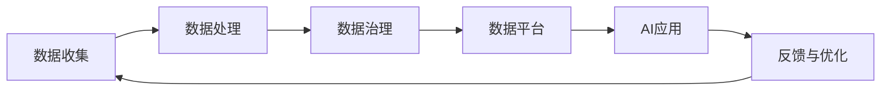

                 

# AI创业：数据管理的核心做法

> 关键词：人工智能,数据管理,数据处理,数据治理,数据平台,数据质量

## 1. 背景介绍

在AI创业的浪潮中，数据管理无疑是核心之一。无论是传统的机器学习项目，还是新兴的深度学习应用，数据的质量和有效性都是项目成功与否的关键。然而，许多AI创业者往往忽略了数据管理的复杂性和重要性，导致在数据收集、处理和治理过程中出现诸多问题。本文将系统探讨AI创业中数据管理的核心做法，涵盖数据收集、数据处理、数据治理和数据平台搭建等方面，帮助创业者在数据管理的道路上规避常见陷阱，把握成功要素。

## 2. 核心概念与联系

### 2.1 核心概念概述

在探讨数据管理之前，我们先简要回顾几个关键概念：

- **数据管理**：是指对数据的获取、存储、处理、分析、治理和共享等环节进行系统的规划和管理，以确保数据的质量、安全性和可用性。
- **数据处理**：涉及数据的清洗、转换、整合、聚合和抽取等操作，是数据管理的重要组成部分。
- **数据治理**：包括数据的所有权、权限、安全、质量和共享等方面，旨在提升数据管理效率，保障数据安全。
- **数据平台**：基于云计算技术，提供数据收集、存储、处理、分析和共享的平台，支持AI应用的快速开发和部署。

这些概念之间存在紧密联系，共同构成了数据管理的整体框架。如下图所示，数据管理从数据收集开始，通过数据处理和治理，最终构建起数据平台，支持AI应用的各个环节。



## 3. 核心算法原理 & 具体操作步骤

### 3.1 算法原理概述

数据管理的核心在于通过有效的数据处理和治理，提升数据质量，保障数据安全，构建高效的数据平台，为AI应用提供坚实的基础。以下是数据管理的主要算法原理：

- **数据清洗**：识别并去除数据中的噪声、错误和不一致性，提升数据质量。
- **数据转换**：将原始数据转换成可用于分析的格式，如标准化、归一化等。
- **数据聚合**：通过聚合操作将多个数据源的数据进行合并，提升数据一致性。
- **数据抽取**：从源数据中抽取有用的信息，用于分析和建模。
- **数据治理**：通过数据标准化、权限管理、数据加密和安全监控等手段，保障数据安全。
- **数据平台构建**：构建基于云计算的数据处理和存储平台，支持大规模数据管理。

### 3.2 算法步骤详解

数据管理的实施可以分为以下几个关键步骤：

**Step 1: 数据收集**
- 明确数据需求：了解项目需要哪些数据，收集的渠道和格式。
- 制定数据收集计划：设计数据收集流程，确定数据来源、采集频率和采集工具。

**Step 2: 数据处理**
- 数据清洗：使用Python的pandas库进行数据清洗，识别并处理缺失值、异常值和重复值。
- 数据转换：使用数据转换函数将数据格式标准化，便于后续分析和建模。
- 数据聚合：使用SQL或数据处理框架如Spark进行数据聚合，提升数据一致性。
- 数据抽取：使用ETL工具将数据从源系统抽取到目标系统，提取有用的信息。

**Step 3: 数据治理**
- 数据标准化：定义数据标准和规范，确保数据格式一致。
- 权限管理：设置数据访问权限，保障数据安全。
- 安全监控：部署数据安全策略，监控数据访问行为。

**Step 4: 数据平台搭建**
- 选择数据平台：根据项目需求，选择合适的云数据平台如AWS Redshift、Google BigQuery等。
- 数据导入和存储：使用数据导入工具将清洗后的数据导入数据平台，进行存储和备份。
- 数据分析和可视化：利用数据平台提供的分析工具进行数据探索和可视化，辅助决策。

### 3.3 算法优缺点

数据管理在AI项目中具有以下优点：

- **提升数据质量**：通过数据清洗和转换，提升数据的一致性和准确性。
- **保障数据安全**：通过数据治理措施，确保数据的安全性和合规性。
- **提升数据利用效率**：通过高效的数据平台，支持大规模数据处理和存储。

同时，数据管理也存在一些缺点：

- **成本较高**：数据收集、处理和治理需要投入大量人力和资源。
- **技术复杂**：数据平台搭建和数据管理需要较高的技术门槛。
- **实施难度大**：不同数据源的数据格式和质量差异较大，整合难度大。

### 3.4 算法应用领域

数据管理在AI创业中具有广泛的应用领域，涵盖以下几个方面：

- **推荐系统**：通过对用户行为数据的处理和分析，推荐个性化产品或服务。
- **金融风控**：通过大数据分析和数据治理，构建实时风险评估系统。
- **医疗健康**：对患者数据进行清洗和分析，支持精准医疗和健康管理。
- **智能客服**：通过对话数据的处理和分析，提升客服系统的智能化水平。
- **营销分析**：对市场数据进行清洗和分析，支持精准营销和客户洞察。

## 4. 数学模型和公式 & 详细讲解 & 举例说明

### 4.1 数学模型构建

数据管理中的数学模型主要集中在数据处理和治理方面，以下是几个常见的数学模型：

- **数据清洗模型**：用于识别和去除数据中的噪声、错误和不一致性。
- **数据转换模型**：用于将原始数据转换成可用于分析的格式。
- **数据聚合模型**：用于对多个数据源的数据进行合并和统计。
- **数据治理模型**：用于保障数据的安全性和合规性。

### 4.2 公式推导过程

以数据清洗模型为例，推导其核心公式：

- **去重公式**：$D_{unique} = D - D_{duplicate}$，其中$D_{duplicate}$为重复数据集，$D_{unique}$为去重后的数据集。
- **异常值检测公式**：$D_{normalized} = (D - D_{mean}) / D_{std}$，其中$D_{mean}$为数据均值，$D_{std}$为数据标准差，$D_{normalized}$为标准化后的数据集。
- **缺失值填补公式**：$D_{fill} = D_{original} \cup D_{missing}$，其中$D_{missing}$为缺失值填补后的数据集，$D_{original}$为原始数据集。

### 4.3 案例分析与讲解

假设我们有一个用户行为数据集，其中包含了用户的购买记录、浏览记录和搜索记录。以下是数据清洗和转换的具体步骤：

1. 去重：使用Python的pandas库，通过`drop_duplicates()`函数去重，保留唯一的用户行为记录。

```python
import pandas as pd
data = pd.read_csv('user_behavior.csv')
unique_data = data.drop_duplicates()
```

2. 异常值检测：对用户行为数据进行标准化处理，使用均值和标准差检测异常值。

```python
normalized_data = (data - data.mean()) / data.std()
```

3. 缺失值填补：对缺失数据进行填补，使用均值填补或插值填补等方法。

```python
filled_data = data.fillna(data.mean())
```

这些步骤确保了数据集的一致性和准确性，为后续的分析和建模提供了坚实的基础。

## 5. 项目实践：代码实例和详细解释说明

### 5.1 开发环境搭建

项目实践的第一步是搭建开发环境。以下是详细的步骤：

1. 安装Python：从官网下载并安装Python，建议使用3.6及以上版本。
2. 安装pandas库：使用pip安装pandas库，`pip install pandas`。
3. 安装Spark：安装Apache Spark，并配置好环境变量。
4. 安装ETL工具：如Alooma或Apache NiFi，用于数据抽取和整合。

### 5.2 源代码详细实现

以下是一个基于pandas库进行数据清洗的Python代码示例：

```python
import pandas as pd

# 读取数据
data = pd.read_csv('user_behavior.csv')

# 去重
unique_data = data.drop_duplicates()

# 标准化
normalized_data = (data - data.mean()) / data.std()

# 填补缺失值
filled_data = data.fillna(data.mean())

# 数据保存
unique_data.to_csv('unique_data.csv', index=False)
normalized_data.to_csv('normalized_data.csv', index=False)
filled_data.to_csv('filled_data.csv', index=False)
```

### 5.3 代码解读与分析

上述代码展示了数据清洗的基本流程，具体步骤如下：

1. 读取原始数据：使用`pd.read_csv()`函数读取用户行为数据集。
2. 去重：使用`drop_duplicates()`函数去重，保留唯一的用户行为记录。
3. 标准化：对数据进行标准化处理，使用均值和标准差检测异常值。
4. 填补缺失值：对缺失数据进行填补，使用均值填补或插值填补等方法。
5. 数据保存：使用`to_csv()`函数将处理后的数据保存到本地。

### 5.4 运行结果展示

运行上述代码，可以得到去重后的数据集`unique_data.csv`、标准化后的数据集`normalized_data.csv`和填补缺失值后的数据集`filled_data.csv`。

## 6. 实际应用场景

### 6.1 推荐系统

推荐系统是数据管理的典型应用之一。通过对用户行为数据的处理和分析，推荐个性化产品或服务。以电商平台为例，电商平台通过收集用户的浏览、购买和评价数据，进行数据清洗和分析，构建用户画像和物品特征库，从而实现个性化推荐。

### 6.2 金融风控

金融风控系统需要处理和分析海量交易数据，识别和防范欺诈行为。通过对交易数据的清洗和标准化，构建实时风险评估系统，提升金融风控的准确性和时效性。

### 6.3 医疗健康

医疗健康领域的数据管理主要集中在患者数据的收集、处理和分析上。通过对患者数据的清洗和标准化，支持精准医疗和健康管理。例如，利用电子健康记录(EHR)数据，构建患者健康画像，进行疾病预测和诊断。

### 6.4 智能客服

智能客服系统需要处理和分析用户对话数据，提升客服系统的智能化水平。通过对对话数据的处理和分析，构建自然语言理解和生成模型，实现智能客服功能。

### 6.5 营销分析

营销分析需要处理和分析市场数据，支持精准营销和客户洞察。通过对客户数据的清洗和分析，构建客户画像，进行市场细分和营销策略优化。

## 7. 工具和资源推荐

### 7.1 学习资源推荐

以下是一些推荐的学习资源，帮助开发者系统掌握数据管理的核心做法：

1. 《数据科学实战：Python+R》：系统介绍了数据科学的核心概念和实践方法，涵盖数据收集、处理、分析和可视化等方面。
2. 《数据治理：企业数据管理全攻略》：介绍了数据治理的理论和实践，涵盖数据标准化、数据质量管理、数据安全等方面。
3. 《Hadoop数据处理技术》：介绍了Hadoop生态系统下的数据处理技术，包括数据清洗、数据转换、数据聚合等方面。
4. 《机器学习实战》：介绍了机器学习的基本概念和实践方法，涵盖数据预处理、特征工程、模型训练等方面。

### 7.2 开发工具推荐

以下是一些推荐的数据管理开发工具，帮助开发者高效地进行数据处理和管理：

1. Apache Spark：用于大数据处理和分析的分布式计算框架，支持数据清洗、数据转换、数据聚合等操作。
2. Pandas：Python中的数据处理库，支持数据清洗、数据转换、数据聚合等操作。
3. Apache NiFi：基于流处理的数据集成和管理系统，支持数据抽取、数据转换、数据聚合等操作。
4. Alooma：基于云的数据集成和管理系统，支持数据抽取、数据转换、数据聚合等操作。

### 7.3 相关论文推荐

以下是几篇推荐的相关论文，深入探讨了数据管理的理论和实践：

1. 《大数据时代的数据治理》：深入探讨了大数据时代的数据治理理论和方法。
2. 《数据清洗技术研究综述》：对数据清洗的技术和方法进行了系统的综述。
3. 《数据平台设计与实现》：介绍了数据平台的设计和实现方法，涵盖数据存储、数据处理、数据分析等方面。

## 8. 总结：未来发展趋势与挑战

### 8.1 研究成果总结

本文系统介绍了数据管理在AI创业中的核心做法，涵盖数据收集、数据处理、数据治理和数据平台搭建等方面。通过实例和代码展示了数据清洗和转换的具体实现，帮助创业者在数据管理的道路上规避常见陷阱，把握成功要素。

### 8.2 未来发展趋势

未来，数据管理在AI创业中将呈现以下几个发展趋势：

1. **数据质量提升**：随着数据采集和处理技术的进步，数据质量将逐步提升，有助于构建更加准确和可靠的分析模型。
2. **数据治理自动化**：通过AI和自动化技术，提升数据治理的效率和效果，减少人工干预。
3. **跨领域数据融合**：实现不同领域数据的融合和互操作，提升数据的多样性和丰富性。
4. **数据安全和隐私保护**：随着数据规模的扩大和隐私保护意识的提升，数据安全和隐私保护将成为数据管理的重要方向。
5. **数据平台生态化**：构建开源数据平台生态系统，支持跨平台的数据共享和协作。

### 8.3 面临的挑战

尽管数据管理在AI创业中具有重要价值，但在实践中仍面临诸多挑战：

1. **数据质量控制**：数据质量难以保证，数据收集、处理和治理过程中容易出现错误和偏差。
2. **技术门槛高**：数据平台搭建和数据管理需要较高的技术门槛，开发人员需具备较强的技术背景。
3. **资源投入大**：数据管理需要大量人力、物力和财力投入，对创业公司的资源配置提出较高要求。
4. **数据安全和隐私保护**：数据安全和隐私保护问题日益突出，需要加强技术和管理措施。

### 8.4 研究展望

未来，数据管理的研究需要在以下几个方面进行深入探索：

1. **自动化数据清洗**：通过AI技术提升数据清洗的自动化水平，减少人工干预。
2. **跨领域数据融合**：实现不同领域数据的融合和互操作，提升数据的多样性和丰富性。
3. **数据安全和隐私保护**：通过技术和管理手段，提升数据安全和隐私保护的效率和效果。
4. **数据平台生态化**：构建开源数据平台生态系统，支持跨平台的数据共享和协作。

## 9. 附录：常见问题与解答

### Q1：数据清洗的重要性体现在哪些方面？

A: 数据清洗在数据管理中具有重要作用，体现在以下几个方面：
1. **提升数据质量**：通过去除噪声、错误和不一致性，提升数据的一致性和准确性。
2. **减少数据处理成本**：清洗后的数据更易于处理和分析，减少数据处理的时间和成本。
3. **提升模型性能**：干净、高质量的数据有助于构建更加准确和可靠的模型。

### Q2：数据标准化和数据治理的区别是什么？

A: 数据标准化和数据治理是数据管理的两个重要环节，区别如下：
1. **数据标准化**：指的是将数据格式转换为标准化的格式，确保数据的一致性和兼容性。例如，将日期格式转换为标准化的日期格式，将货币格式转换为标准化的货币格式。
2. **数据治理**：指的是对数据的所有权、权限、安全、质量和共享等方面进行管理，确保数据的合法性和安全性。例如，设置数据访问权限，监控数据访问行为，保障数据安全。

### Q3：如何选择合适的数据清洗方法？

A: 选择合适的数据清洗方法需要考虑以下几个因素：
1. **数据类型**：不同类型的数据需要选择不同的清洗方法。例如，文本数据需要使用去除停用词、分词等方法，数值数据需要使用去重、填补缺失值等方法。
2. **数据规模**：数据规模较大时，需要选择高效的清洗方法，如并行清洗、分布式清洗等。
3. **数据质量要求**：数据质量要求较高时，需要选择精确的清洗方法，如基于规则的清洗、机器学习清洗等。

### Q4：数据平台搭建需要注意哪些问题？

A: 数据平台搭建需要注意以下几个问题：
1. **选择合适的云平台**：根据项目需求和预算，选择合适的云平台，如AWS、Google Cloud、阿里云等。
2. **数据安全**：设置数据访问权限，保障数据的安全性。
3. **数据备份和恢复**：定期备份数据，确保数据的可用性和完整性。
4. **性能优化**：优化数据平台性能，确保数据处理和分析的效率。
5. **监控和告警**：实时监控数据平台运行状态，设置告警阈值，确保系统稳定性。

### Q5：数据治理中如何保障数据安全？

A: 数据治理中保障数据安全需要采取以下措施：
1. **访问控制**：设置数据访问权限，确保只有授权用户可以访问数据。
2. **数据加密**：对数据进行加密处理，防止数据泄露和篡改。
3. **审计日志**：记录数据访问行为，设置审计日志，便于跟踪和审计数据操作。
4. **安全监控**：部署安全监控系统，实时监控数据访问行为，检测异常操作。
5. **定期审查**：定期审查数据安全策略和措施，及时发现和修复安全漏洞。

---

作者：禅与计算机程序设计艺术 / Zen and the Art of Computer Programming

