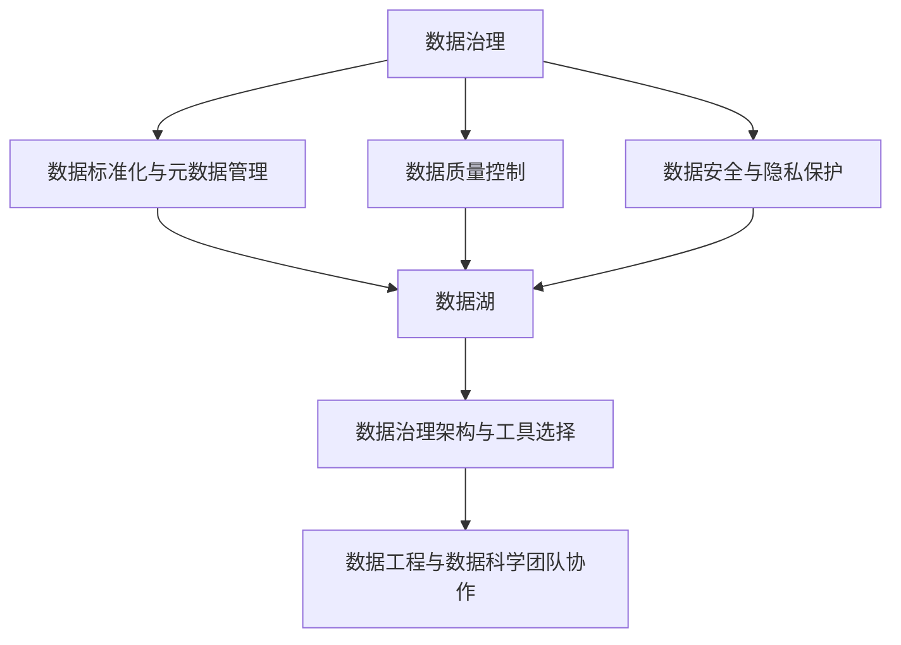

                 

# AI创业：数据管理的策略与实施分析探讨

> 关键词：AI创业,数据管理,数据策略,数据安全,数据治理,数据隐私,数据标准化,数据存储,数据治理工具

## 1. 背景介绍

### 1.1 问题由来
随着人工智能技术的不断成熟和普及，越来越多的创业者和企业意识到，数据作为AI系统的重要资产，其管理和治理是推动AI项目成功的重要因素。然而，数据管理的复杂性及其对企业战略和技术架构的深远影响，使得这一问题变得尤为关键。如何在保证数据安全、隐私的前提下，高效地管理和利用数据，成为了摆在AI创业者面前的巨大挑战。本文将围绕数据管理的策略与实施，探讨其在AI创业项目中的重要性、主要挑战和实施方法。

### 1.2 问题核心关键点
数据管理贯穿AI项目从需求提出、数据采集、数据存储、数据治理到数据应用的整个生命周期。其核心关键点包括：
- 数据质量控制
- 数据安全与隐私保护
- 数据标准化与元数据管理
- 数据治理架构与工具选择
- 数据工程与数据科学团队协作

### 1.3 问题研究意义
数据管理策略的制定和实施对AI创业项目具有深远的战略意义：
1. 确保数据质量：高质量的数据是AI模型有效训练的基础，数据管理有助于提升模型性能。
2. 保障数据安全：数据泄露和滥用会严重影响企业信誉，数据管理能降低风险。
3. 促进数据创新：高效的数据管理可加速数据资产的迭代和应用，激发更多数据驱动的商业机会。
4. 强化合规性：符合数据隐私法规和行业标准，降低法律风险。
5. 优化数据驱动的决策：通过系统化数据管理，增强企业决策的科学性和数据驱动性。

## 2. 核心概念与联系

### 2.1 核心概念概述

为了更好地理解数据管理的策略与实施，本节将介绍几个密切相关的核心概念：

- **数据治理**：指对数据的创建、维护、使用、共享和退役进行管理和控制的实践。
- **数据质量**：指数据的完整性、准确性、一致性、时效性、唯一性和有效性，是数据治理的重要基础。
- **数据安全**：涉及保护数据免受未授权访问、修改、破坏或泄露的技术和管理措施。
- **数据隐私**：指保护个人或组织的个人信息不被未经授权的访问和使用的权利。
- **元数据**：描述数据的数据，包括数据源、格式、生命周期、质量等信息，有助于数据管理和应用。
- **数据标准化**：确保数据格式、命名规范、存储位置等一致，便于数据共享和协作。
- **数据湖**：指存储和处理海量、多源数据的集中式系统，提供强大的数据探索和分析能力。
- **数据管理平台**：提供数据生命周期管理的软件工具和平台，支持数据治理、质量和数据科学的日常工作。

这些核心概念之间的逻辑关系可以通过以下Mermaid流程图来展示：



这个流程图展示了一些关键概念及其之间的关系：

1. 数据治理是整个数据管理的核心，包括质量控制、安全与隐私保护、标准化与元数据管理。
2. 数据湖作为数据存储和处理的基础设施，支持数据治理架构和工具的选择。
3. 数据工程与数据科学团队的协作，离不开高效的数据管理和治理平台。

## 3. 核心算法原理 & 具体操作步骤
### 3.1 算法原理概述

在AI创业项目中，数据管理的具体策略和实施步骤通常包括以下几个关键环节：

1. **需求分析与设计**：确定数据管理的目标、范围、关键指标和具体措施。
2. **数据采集与清洗**：从多个数据源采集数据，并进行清洗和预处理，保证数据质量。
3. **数据存储与访问**：选择合适的数据存储技术，确保数据可被高效访问和处理。
4. **数据治理与监控**：建立数据治理框架，监控数据质量和安全状态，确保数据一致性和完整性。
5. **数据标准化与互操作性**：确保数据标准化，支持数据共享和跨部门协作。
6. **数据安全与隐私保护**：采用技术和管理措施，保护数据的机密性、完整性和可用性。
7. **数据审计与评估**：定期审计数据管理策略和实施效果，进行持续改进。

### 3.2 算法步骤详解

以下是一个详细的AI创业项目中数据管理实施步骤：

**Step 1: 需求分析和策略设计**
- 确定项目目标和范围，包括数据类型、质量要求、存储需求和安全策略。
- 识别关键业务流程和数据接口，设计数据治理架构。
- 选择合适的数据治理工具和平台。

**Step 2: 数据采集与清洗**
- 从不同数据源（如企业内部系统、第三方API、开放数据集等）采集数据。
- 使用ETL工具进行数据清洗和预处理，包括去重、补全、格式转换等操作。
- 进行数据质量评估，确保数据满足预设的质量标准。

**Step 3: 数据存储与访问**
- 选择合适的数据库系统（如关系型数据库、NoSQL数据库、数据湖）。
- 设计高效的数据模型，支持快速查询和分析。
- 采用数据访问控制策略，确保数据访问权限合理。

**Step 4: 数据治理与监控**
- 建立数据治理框架，定义数据生命周期管理流程。
- 使用数据治理工具进行数据治理，包括元数据管理、数据质量控制、数据备份和恢复。
- 设置数据监控指标，实时跟踪数据状态和性能。

**Step 5: 数据标准化与互操作性**
- 制定数据标准化规范，确保数据格式、命名和编码一致。
- 使用数据集成工具实现跨系统、跨部门的数据共享和协作。
- 建立数据字典和元数据管理库，支持数据元数据的共享和查询。

**Step 6: 数据安全与隐私保护**
- 采用数据加密、访问控制、审计日志等技术手段，保护数据安全。
- 制定数据隐私政策，符合GDPR等数据隐私法规要求。
- 定期进行数据安全审计和风险评估，确保数据安全措施的有效性。

**Step 7: 数据审计与评估**
- 定期审计数据管理策略和实施效果，进行持续改进。
- 分析数据治理和数据质量指标，评估数据管理的效率和效果。
- 收集用户反馈和业务需求，进行数据管理策略调整和优化。

### 3.3 算法优缺点

数据管理策略的制定和实施有以下优点：
1. 提升数据质量：通过系统化管理，确保数据准确、完整、一致。
2. 增强数据安全：采用严格的数据访问控制和加密措施，保护数据免受泄露和滥用。
3. 促进数据共享：通过数据标准化和元数据管理，实现数据共享和协作。
4. 优化数据工程：提供数据工程和数据科学团队协作的平台，提升数据处理效率。

同时，数据管理也存在一些挑战：
1. 复杂度高：数据管理涉及多个环节，实施难度大。
2. 数据量大：随着数据量的增加，管理成本和复杂性也会增加。
3. 动态变化：数据管理需要动态适应业务需求的变化。
4. 技术选型：选择合适的数据治理工具和平台，需要综合考虑技术成熟度和适用性。

### 3.4 算法应用领域

数据管理策略和实施方法在多个领域得到广泛应用，例如：

- **金融科技**：数据管理是金融科技项目的重要组成部分，保障数据安全、合规和隐私，支持风控、反欺诈等应用。
- **医疗健康**：数据管理在医疗健康领域用于支持临床决策、精准医疗和健康数据分析。
- **智慧城市**：数据管理是智慧城市项目的基础设施，提供城市数据的综合管理和分析服务。
- **电子商务**：数据管理支持电商平台的交易数据分析、客户行为分析和个性化推荐。
- **智能制造**：数据管理在智能制造领域用于支持生产数据分析、设备健康管理和质量控制。
- **环境保护**：数据管理用于环境监测数据的管理和分析，支持环境政策和措施的制定和实施。

这些应用场景展示了数据管理策略和实施方法在推动AI创业项目中的重要性。

## 4. 数学模型和公式 & 详细讲解 & 举例说明

### 4.1 数学模型构建

在本节中，我们将通过数学模型来更严格地定义数据管理策略和实施过程。

假设AI创业项目的目标是利用数据驱动决策，提升业务绩效。数据管理策略可以表示为一个多目标优化问题：

$$
\maximize \{\text{业务绩效}，\text{数据质量}，\text{数据安全}，\text{数据标准化}，\text{数据治理效果}\}
$$

其中，业务绩效可以通过ROI（投资回报率）、用户满意度等指标来衡量，数据质量可以通过数据完整性、准确性等指标来衡量，数据安全可以通过数据泄露次数、数据访问控制等指标来衡量，数据标准化可以通过数据一致性、标准化率等指标来衡量，数据治理效果可以通过数据治理工具的使用效率、数据监控指标的准确性等指标来衡量。

### 4.2 公式推导过程

为了更好地理解数据管理策略的多目标优化问题，我们可以将其分解为单目标优化问题。例如，对于数据质量管理，可以设计如下的优化目标函数：

$$
\maximize \{\text{数据完整性}，\text{数据准确性}，\text{数据一致性}\}
$$

假设数据完整性可以通过数据检查规则和错误率来衡量，数据准确性可以通过数据校验和验证结果来衡量，数据一致性可以通过数据一致性检查来衡量。优化目标函数可以进一步表示为：

$$
\maximize \sum_{i=1}^n \alpha_i (\text{完整性}_i + \text{准确性}_i + \text{一致性}_i)
$$

其中，$\alpha_i$ 表示每个指标的权重，$i$ 表示不同的数据项。为了求解该优化问题，可以使用多目标优化算法（如NSGA-II、MOEA等），找到一组Pareto最优解，即在各个指标之间进行平衡。

### 4.3 案例分析与讲解

以金融科技项目为例，探讨数据管理策略的实施：

**背景**：一家金融科技创业公司，旨在利用AI技术提供智能投资顾问服务。公司从多个数据源采集数据，包括用户行为数据、市场数据、交易数据等，用于投资建议生成和风险评估。

**数据管理策略**：
1. **需求分析**：确定数据质量要求、存储需求和安全策略。
2. **数据采集**：使用API和ETL工具从不同数据源采集数据。
3. **数据清洗**：使用数据清洗工具进行去重、补全、格式转换等操作。
4. **数据存储**：选择NoSQL数据库，设计高效的数据模型，支持快速查询和分析。
5. **数据治理**：建立数据治理框架，使用数据治理工具进行元数据管理和数据质量控制。
6. **数据安全**：采用数据加密和访问控制措施，保护数据安全。
7. **数据审计**：定期审计数据管理策略和实施效果，进行持续改进。

**效果**：通过系统化的数据管理策略和实施，公司能够提高数据质量、增强数据安全，支持智能投资顾问服务的稳定运行。

## 5. 项目实践：代码实例和详细解释说明

### 5.1 开发环境搭建

在进行数据管理实践前，我们需要准备好开发环境。以下是使用Python进行PyTorch开发的环境配置流程：

1. 安装Anaconda：从官网下载并安装Anaconda，用于创建独立的Python环境。

2. 创建并激活虚拟环境：
```bash
conda create -n data-management-env python=3.8 
conda activate data-management-env
```

3. 安装PyTorch：根据CUDA版本，从官网获取对应的安装命令。例如：
```bash
conda install pytorch torchvision torchaudio cudatoolkit=11.1 -c pytorch -c conda-forge
```

4. 安装数据管理工具包：
```bash
pip install pandas numpy scikit-learn matplotlib jupyter notebook
```

完成上述步骤后，即可在`data-management-env`环境中开始数据管理实践。

### 5.2 源代码详细实现

下面我们以金融科技项目为例，给出使用Python进行数据管理的PyTorch代码实现。

首先，定义数据处理函数：

```python
import pandas as pd
from sklearn.preprocessing import MinMaxScaler

def load_and_clean_data(file_path):
    data = pd.read_csv(file_path)
    data = data.drop_duplicates()  # 去重
    data.fillna(method='ffill')  # 填充缺失值
    data = data.dropna()  # 再次去除含有缺失值的行
    data = pd.get_dummies(data)  # 创建虚拟变量
    scaler = MinMaxScaler(feature_range=(0, 1))
    data_scaled = scaler.fit_transform(data)
    return data_scaled

def save_data(data, file_path):
    pd.DataFrame(data).to_csv(file_path, index=False)
```

然后，定义数据存储和访问函数：

```python
from sqlalchemy import create_engine

def connect_to_database(db_config):
    engine = create_engine(f'mysql+pymysql://{db_config["username"]}:{db_config["password"]}@{db_config["host"]}/{db_config["database"]}')
    return engine

def insert_data(data, table_name, engine):
    with engine.connect() as conn:
        conn.execute(f'CREATE TABLE IF NOT EXISTS {table_name} (id INT PRIMARY KEY, feature FLOAT);')
        conn.execute(f'INSERT INTO {table_name} VALUES ({",".join([f"({data[i]}, {i+1})" for i in range(len(data))]});')

def query_data(table_name, engine):
    with engine.connect() as conn:
        result = pd.read_sql(f'SELECT * FROM {table_name}', con=conn)
        return result
```

接着，定义数据治理和监控函数：

```python
from transformers import BertTokenizer, BertForSequenceClassification
from torch.utils.data import DataLoader, TensorDataset
from sklearn.metrics import accuracy_score, precision_recall_fscore_support

def train_model(model, train_data, test_data, optimizer, device, epochs):
    model.train()
    for epoch in range(epochs):
        losses = []
        for batch in train_data:
            inputs, labels = batch
            inputs, labels = inputs.to(device), labels.to(device)
            outputs = model(inputs)
            loss = outputs.loss
            losses.append(loss.item())
            optimizer.zero_grad()
            loss.backward()
            optimizer.step()
        avg_train_loss = sum(losses) / len(losses)
        model.eval()
        correct = 0
        total = 0
        with torch.no_grad():
            for batch in test_data:
                inputs, labels = batch
                inputs, labels = inputs.to(device), labels.to(device)
                outputs = model(inputs)
                _, preds = torch.max(outputs, dim=1)
                total += labels.size(0)
                correct += (preds == labels).sum().item()
        test_accuracy = correct / total
        return avg_train_loss, test_accuracy

def evaluate_model(model, test_data, device):
    model.eval()
    correct = 0
    total = 0
    with torch.no_grad():
        for batch in test_data:
            inputs, labels = batch
            inputs, labels = inputs.to(device), labels.to(device)
            outputs = model(inputs)
            _, preds = torch.max(outputs, dim=1)
            total += labels.size(0)
            correct += (preds == labels).sum().item()
    test_accuracy = correct / total
    return test_accuracy
```

最后，启动数据管理流程并在测试集上评估：

```python
# 假设已准备好数据集
train_data = load_and_clean_data('train_data.csv')
test_data = load_and_clean_data('test_data.csv')

# 假设已准备好数据库
db_config = {'username': 'root', 'password': 'password', 'host': 'localhost', 'database': 'mydatabase'}
engine = connect_to_database(db_config)

# 假设已准备好模型和优化器
model = BertForSequenceClassification.from_pretrained('bert-base-cased', num_labels=2)
optimizer = AdamW(model.parameters(), lr=2e-5)

# 假设已准备好训练参数
device = 'cuda'
epochs = 5
batch_size = 16

# 数据存储
table_name = 'my_table'
insert_data(train_data, table_name, engine)

# 数据查询
train_query = query_data(table_name, engine)

# 训练模型
avg_train_loss, test_accuracy = train_model(model, train_query, test_data, optimizer, device, epochs)

# 评估模型
test_accuracy = evaluate_model(model, test_data, device)

print(f"Train loss: {avg_train_loss:.3f}")
print(f"Test accuracy: {test_accuracy:.3f}")
```

以上就是使用PyTorch进行数据管理实践的完整代码实现。可以看到，通过系统化的数据管理流程，从数据采集、清洗、存储到模型训练和评估，能够高效地完成数据管理的各个环节。

### 5.3 代码解读与分析

让我们再详细解读一下关键代码的实现细节：

**load_and_clean_data函数**：
- 使用pandas加载数据，并进行去重、填充缺失值、去除含有缺失值行、创建虚拟变量、数据标准化等操作。

**connect_to_database函数**：
- 使用SQLAlchemy连接MySQL数据库，支持数据库的创建、数据表查询和数据插入。

**insert_data函数**：
- 将数据插入数据库，创建数据表结构，支持批量插入操作。

**query_data函数**：
- 从数据库中查询数据，支持数据表查询和结果的pandas DataFrame转换。

**train_model函数**：
- 定义模型训练函数，使用PyTorch进行模型训练，并返回平均训练损失和测试准确率。

**evaluate_model函数**：
- 定义模型评估函数，使用PyTorch进行模型评估，并返回测试准确率。

**主程序**：
- 通过上述函数实现数据管理流程，从数据加载、存储到模型训练和评估，完成了数据管理的全流程。

可以看到，通过系统化的数据管理流程，结合Python和PyTorch等工具，可以高效地完成数据管理的各个环节。这些代码实现可以作为数据管理实践的基础，开发者可以根据具体需求进行优化和扩展。

## 6. 实际应用场景
### 6.1 智能投顾系统

在金融科技领域，智能投顾系统是数据管理的典型应用场景。智能投顾系统通过数据分析和机器学习，为用户提供个性化的投资建议。其数据管理策略包括：

1. **数据采集**：从多个数据源采集用户行为数据、市场数据、交易数据等，为模型训练提供数据支持。
2. **数据清洗**：清洗和预处理数据，去除重复、缺失和异常值，确保数据质量。
3. **数据存储**：使用NoSQL数据库存储历史交易数据和用户行为数据，支持高效查询和分析。
4. **数据治理**：建立数据治理框架，使用数据治理工具进行元数据管理和数据质量控制。
5. **数据安全**：采用数据加密和访问控制措施，保护用户隐私和数据安全。
6. **数据审计**：定期审计数据管理策略和实施效果，进行持续改进。

通过系统化的数据管理，智能投顾系统能够提高数据质量、增强数据安全，确保智能投资建议的准确性和可信度。

### 6.2 智慧城市数据中心

在智慧城市建设中，数据中心是数据管理的核心环节。数据中心负责收集、存储、分析和应用城市各类数据，支持城市管理和决策。其数据管理策略包括：

1. **数据采集**：从城市各个部门采集交通、环保、能源等数据，为智慧城市应用提供数据支持。
2. **数据清洗**：清洗和预处理数据，去除重复、缺失和异常值，确保数据质量。
3. **数据存储**：使用数据湖存储城市各类数据，支持高效查询和分析。
4. **数据治理**：建立数据治理框架，使用数据治理工具进行元数据管理和数据质量控制。
5. **数据安全**：采用数据加密和访问控制措施，保护城市数据和隐私。
6. **数据审计**：定期审计数据管理策略和实施效果，进行持续改进。

通过系统化的数据管理，智慧城市数据中心能够提高数据质量、增强数据安全，支持城市管理和决策，推动智慧城市建设。

### 6.3 医疗健康大数据平台

在医疗健康领域，大数据平台是数据管理的典型应用场景。大数据平台通过数据分析和机器学习，支持临床决策、精准医疗和健康数据分析。其数据管理策略包括：

1. **数据采集**：从医院、研究机构等数据源采集电子病历、基因数据、健康数据等，为模型训练提供数据支持。
2. **数据清洗**：清洗和预处理数据，去除重复、缺失和异常值，确保数据质量。
3. **数据存储**：使用数据湖存储健康数据，支持高效查询和分析。
4. **数据治理**：建立数据治理框架，使用数据治理工具进行元数据管理和数据质量控制。
5. **数据安全**：采用数据加密和访问控制措施，保护患者隐私和数据安全。
6. **数据审计**：定期审计数据管理策略和实施效果，进行持续改进。

通过系统化的数据管理，医疗健康大数据平台能够提高数据质量、增强数据安全，支持临床决策、精准医疗和健康数据分析，推动医疗健康事业发展。

## 7. 工具和资源推荐
### 7.1 学习资源推荐

为了帮助开发者系统掌握数据管理的策略与实施，这里推荐一些优质的学习资源：

1. **《数据治理：原则、实践和工具》**：详细介绍数据治理的原理和实践，适合数据管理领域的入门学习。
2. **《数据科学与机器学习》**：斯坦福大学的在线课程，涵盖数据科学、机器学习和大数据技术的全面介绍。
3. **《数据质量管理》**：讲解数据质量管理的基本概念、方法和工具，适合数据管理从业者学习。
4. **《数据安全与隐私》**：讲解数据安全与隐私保护的基本概念、方法和工具，适合数据管理从业人员学习。
5. **《大数据技术与系统》**：讲解大数据技术的基础知识和系统架构，适合数据管理工程师学习。

通过这些资源的学习，相信你能够全面掌握数据管理的策略与实施方法，并在实际应用中取得优异的效果。

### 7.2 开发工具推荐

高效的数据管理离不开优秀的工具支持。以下是几款用于数据管理的常用工具：

1. **Pandas**：Python数据处理库，支持数据清洗、预处理和分析。
2. **SQLAlchemy**：Python SQL工具包，支持数据库连接、数据查询和数据存储。
3. **Apache Hive**：大数据处理工具，支持分布式数据存储和分析。
4. **Apache Spark**：大数据处理引擎，支持分布式数据处理和分析。
5. **Apache Kafka**：分布式流处理系统，支持数据实时采集和传输。
6. **Apache Cassandra**：NoSQL数据库，支持大规模数据存储和查询。

合理利用这些工具，可以显著提升数据管理的效率和质量，加快数据驱动项目的开发进度。

### 7.3 相关论文推荐

数据管理领域的研究涵盖了多个方面，以下是几篇有代表性的论文，推荐阅读：

1. **《数据治理：原则与实践》**：概述了数据治理的基本概念、方法和工具，适合数据管理从业人员学习。
2. **《数据质量管理：模型、技术和应用》**：详细讲解了数据质量管理的技术和方法，适合数据管理工程师学习。
3. **《大数据系统设计与实现》**：介绍了大数据系统的设计和实现方法，适合大数据工程师学习。
4. **《数据安全和隐私保护》**：讲解了数据安全和隐私保护的基本概念、技术和方法，适合数据安全从业人员学习。
5. **《智慧城市数据治理框架》**：详细探讨了智慧城市数据治理的框架和策略，适合智慧城市项目从业人员学习。

这些论文代表了大数据管理领域的研究进展，通过学习这些前沿成果，可以帮助研究者把握学科前进方向，激发更多的创新灵感。

## 8. 总结：未来发展趋势与挑战

### 8.1 研究成果总结
本文对数据管理的策略与实施进行了全面系统的介绍。首先阐述了数据管理在AI创业项目中的重要性，明确了数据管理的核心目标和实施步骤。其次，通过数学模型和公式，深入讲解了数据管理的多目标优化问题，并给出了实际案例的详细分析。最后，讨论了数据管理工具和资源，为实际应用提供了全面的技术指引。

### 8.2 未来发展趋势
展望未来，数据管理策略和实施方法将呈现以下几个发展趋势：

1. **智能化数据管理**：利用AI技术进行数据清洗、分析和治理，提升数据管理效率和质量。
2. **自动化数据管理**：通过自动化工具和流程，降低人工干预，提高数据管理的可扩展性和一致性。
3. **跨部门数据协作**：建立跨部门数据共享和协作机制，推动数据治理的协同管理。
4. **大数据与AI融合**：将大数据技术和AI技术深度融合，实现数据的全面感知和分析。
5. **数据隐私保护**：加强数据隐私保护，制定数据隐私政策，确保合规性。
6. **数据治理平台化**：引入数据治理平台，支持数据管理策略和实施效果的持续改进。

### 8.3 面临的挑战
尽管数据管理策略和实施方法在AI创业项目中具有重要意义，但也面临着诸多挑战：

1. **数据多样性**：数据来自多个来源，数据格式、数据质量差异较大，统一管理难度大。
2. **数据安全**：数据泄露和滥用风险高，数据安全管理复杂。
3. **数据质量**：数据清洗和预处理工作量大，数据质量控制难度高。
4. **数据治理**：数据治理框架和工具的选择和实施需要综合考虑技术和管理因素。
5. **数据审计**：数据治理效果的持续评估和改进需要高投入和长期跟踪。

### 8.4 研究展望
未来的研究需要在以下几个方面寻求新的突破：

1. **数据清洗和预处理自动化**：利用AI技术自动化数据清洗和预处理，提升数据管理效率。
2. **数据治理策略优化**：结合业务需求和数据特点，优化数据治理策略，提高数据管理效果。
3. **数据隐私保护技术**：开发新的数据隐私保护技术，确保数据合规性和安全性。
4. **数据治理平台建设**：构建数据治理平台，支持数据管理策略和实施效果的持续改进。
5. **跨部门数据协作机制**：建立跨部门数据共享和协作机制，推动数据治理的协同管理。

这些研究方向将引领数据管理策略和实施方法迈向更高的台阶，为数据驱动的AI创业项目提供更坚实的基础。

## 9. 附录：常见问题与解答

**Q1：数据管理对AI创业项目的重要性体现在哪些方面？**

A: 数据管理对AI创业项目的重要性主要体现在以下几个方面：
1. 数据质量：高质量的数据是AI模型有效训练的基础，数据管理有助于提升模型性能。
2. 数据安全：数据泄露和滥用会严重影响企业信誉，数据管理能降低风险。
3. 数据共享：数据标准化和元数据管理，有助于实现数据共享和协作，推动AI项目的创新和应用。
4. 数据治理：建立数据治理框架，确保数据生命周期管理的一致性和可控性。
5. 数据审计：定期审计数据管理策略和实施效果，确保数据管理的持续改进。

**Q2：如何选择合适的数据治理工具和平台？**

A: 选择合适的数据治理工具和平台需要考虑以下因素：
1. 数据类型和规模：根据数据类型和规模选择适合的存储和处理技术。
2. 数据管理需求：根据数据管理需求选择支持数据质量控制、数据安全和数据审计的工具。
3. 技术成熟度和兼容性：选择成熟度高、兼容性好的工具和平台，确保数据管理的稳定性和可靠性。
4. 成本和可扩展性：考虑工具和平台的成本和可扩展性，确保数据管理的经济性和可扩展性。
5. 用户体验和支持：选择用户体验好、技术支持好的工具和平台，确保数据管理的易用性和可维护性。

**Q3：数据管理过程中有哪些常见的挑战和应对策略？**

A: 数据管理过程中常见的挑战包括：
1. 数据多样性：数据来自多个来源，数据格式、数据质量差异较大，统一管理难度大。应对策略是采用标准化和元数据管理，确保数据一致性。
2. 数据安全：数据泄露和滥用风险高，数据安全管理复杂。应对策略是采用数据加密和访问控制措施，保护数据安全。
3. 数据质量：数据清洗和预处理工作量大，数据质量控制难度高。应对策略是利用AI技术自动化数据清洗和预处理，提升数据管理效率。
4. 数据治理：数据治理框架和工具的选择和实施需要综合考虑技术和管理因素。应对策略是结合业务需求和数据特点，优化数据治理策略。
5. 数据审计：数据治理效果的持续评估和改进需要高投入和长期跟踪。应对策略是定期审计数据管理策略和实施效果，进行持续改进。

通过系统化的应对策略，可以更好地应对数据管理过程中遇到的挑战，提高数据管理的效果和效率。

---

作者：禅与计算机程序设计艺术 / Zen and the Art of Computer Programming

