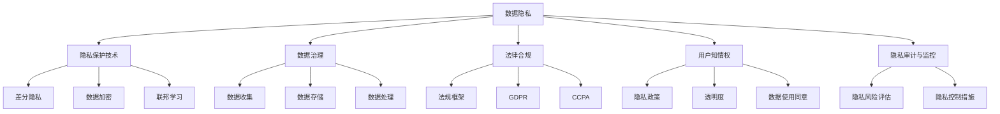

                 

# AI创业：数据隐私管理

> 关键词：数据隐私保护, 隐私管理, 安全合规, 数据治理, 联邦学习

## 1. 背景介绍

### 1.1 问题由来
随着人工智能技术的快速发展和广泛应用，数据隐私保护成为AI创业过程中一个日益严峻的问题。尤其是涉及个人隐私的敏感数据（如健康记录、金融信息、生物特征等），一旦被滥用或泄露，将对用户造成巨大损失。对于AI公司而言，如何平衡数据利用和隐私保护，确保合规，是创业成功的关键因素之一。

### 1.2 问题核心关键点
数据隐私管理主要涉及以下几个核心问题：
- **数据收集与处理**：在业务流程中如何合法合规地收集用户数据，并进行有效的处理和存储。
- **隐私保护技术**：采用哪些技术手段保护数据隐私，如数据匿名化、差分隐私等。
- **法律合规性**：如何在国际法规框架内（如GDPR、CCPA）确保数据使用合规。
- **用户知情权**：如何透明地告知用户其数据被收集、使用和存储的方式。
- **隐私审计与监控**：建立有效的隐私审计机制，及时发现并修复潜在风险。

这些问题交织在一起，构成了一个复杂的系统工程。只有系统性地处理这些挑战，AI创业才能真正获得用户信任，实现可持续发展。

### 1.3 问题研究意义
数据隐私管理不仅关系到公司的法律合规和用户信任，更是其商业模式的基石。良好的数据隐私管理能够：
- **增强用户信任**：确保用户数据安全，建立品牌信任。
- **避免法律风险**：遵循法规要求，降低合规成本和法律风险。
- **提升数据价值**：通过有效的数据治理和隐私保护技术，最大化数据利用价值。
- **推动技术创新**：鼓励在隐私保护技术上的创新，为AI创业带来新的商业机会。
- **构建生态系统**：吸引更多的数据合作方，形成良性的生态系统。

本文将系统介绍数据隐私管理的关键技术、法律合规要求以及实际应用案例，为AI创业者和技术开发者提供全面的参考。

## 2. 核心概念与联系

### 2.1 核心概念概述

为更好地理解数据隐私管理，本节将介绍几个密切相关的核心概念：

- **数据隐私**：指在数据处理过程中保护个人或组织的隐私权益，防止数据泄露、滥用或不当访问。
- **隐私保护技术**：包括数据加密、差分隐私、联邦学习等技术，旨在减少数据泄露风险，同时保证数据可用性。
- **数据治理**：涉及数据的收集、处理、存储和使用的全生命周期管理，旨在确保数据安全和合规。
- **法律合规**：指在数据隐私处理过程中遵循相关法律法规，如GDPR、CCPA等。
- **用户知情权**：用户有权知晓其数据如何被收集、使用和存储，并同意相应数据处理方式。
- **隐私审计与监控**：定期检查和评估数据隐私管理措施的有效性，及时发现和纠正隐私风险。

这些核心概念之间的逻辑关系可以通过以下Mermaid流程图来展示：



这个流程图展示了几大核心概念之间的关系：

1. **数据隐私**是整体概念，其他概念都是其具体体现。
2. **隐私保护技术**通过差分隐私、数据加密等手段，减少数据泄露风险。
3. **数据治理**包括数据收集、处理和存储的全生命周期管理，确保数据安全和合规。
4. **法律合规**指在数据处理过程中遵循GDPR、CCPA等法律法规。
5. **用户知情权**涉及隐私政策的透明度和数据使用同意。
6. **隐私审计与监控**用于评估和改进隐私管理措施，及时发现并纠正风险。

## 3. 核心算法原理 & 具体操作步骤
### 3.1 算法原理概述

数据隐私管理涉及多个技术手段，包括差分隐私、数据加密、联邦学习等。这里以差分隐私和联邦学习为例，介绍其基本原理和操作步骤。

#### 3.1.1 差分隐私
差分隐私是一种在数据处理过程中保护个体隐私的技术。其基本思想是在数据分析和查询时，向结果中引入噪声，使得任何个体数据的泄露不会对分析结果产生显著影响。数学上，差分隐私通常通过在查询函数中加入噪声来实现。

设 $Q$ 是查询函数，$X$ 是输入数据，$\varepsilon$ 是隐私预算，$\sigma$ 是噪声参数。差分隐私机制可以表示为：

$$
Q_{\varepsilon,\sigma}(X) = Q(X) + N(\mu, \sigma^2)
$$

其中 $N(\mu, \sigma^2)$ 表示均值为 $\mu$，方差为 $\sigma^2$ 的高斯噪声。隐私预算 $\varepsilon$ 和噪声参数 $\sigma$ 是保护隐私的关键参数。$\varepsilon$ 越小，表示隐私保护程度越高，但数据可用性会降低。

#### 3.1.2 联邦学习
联邦学习是一种分布式机器学习技术，多个参与方在不共享原始数据的前提下，协同训练模型。每个参与方将本地数据梯度上传到中心服务器，中心服务器汇总梯度并更新模型参数，最后将更新后的模型参数下发给各参与方。这种方法能够保护参与方的数据隐私，同时提高模型性能。

联邦学习的核心步骤如下：
1. 初始化模型参数 $\theta_0$。
2. 在各参与方本地数据 $D_i$ 上训练模型，并计算梯度 $g_i$。
3. 中心服务器聚合梯度 $g_i$，计算全局梯度 $\bar{g}$。
4. 更新模型参数：$\theta_{t+1} = \theta_t - \eta \bar{g}$。
5. 重复步骤2-4，直至模型收敛。

### 3.2 算法步骤详解

#### 3.2.1 差分隐私
1. **确定隐私预算 $\varepsilon$**：根据具体需求和数据特性，确定隐私预算的大小。通常选择 $\varepsilon$ 较小，表示隐私保护程度较高。
2. **定义查询函数 $Q$**：定义需要执行的查询，如统计数据、分类任务等。
3. **引入噪声 $\sigma$**：在查询函数 $Q$ 中添加高斯噪声。
4. **计算差分隐私查询结果**：执行差分隐私机制，返回查询结果。

#### 3.2.2 联邦学习
1. **选择参与方和本地数据**：确定参与联邦学习的各方，以及各方的本地数据。
2. **初始化模型参数**：在各参与方本地初始化模型参数。
3. **本地训练与计算梯度**：在各参与方本地数据上训练模型，并计算梯度。
4. **中心服务器聚合梯度**：中心服务器接收并聚合各参与方的梯度。
5. **模型参数更新**：根据聚合后的梯度，更新模型参数。
6. **重复训练**：重复上述步骤，直至模型收敛或达到预设迭代次数。

### 3.3 算法优缺点

#### 3.3.1 差分隐私
**优点**：
- 提供严格的隐私保护，能够有效防止数据泄露。
- 隐私保护级别可控，灵活性高。

**缺点**：
- 引入噪声可能导致数据精度下降。
- 增加计算复杂度和隐私预算的设定难度。

#### 3.3.2 联邦学习
**优点**：
- 保护参与方的数据隐私。
- 提升模型性能和分布式计算效率。

**缺点**：
- 通信开销较大，需要考虑网络延迟和带宽限制。
- 中心服务器可能成为数据泄露风险的集中点。

### 3.4 算法应用领域

差分隐私和联邦学习在多个领域都有广泛应用，包括：

- **医疗健康**：保护患者隐私，进行疾病数据分析和预测。
- **金融服务**：保护用户隐私，进行信用评分和风险评估。
- **社交媒体**：保护用户隐私，进行个性化推荐和广告投放。
- **智能交通**：保护交通数据隐私，进行交通流量分析和预测。
- **电子商务**：保护用户隐私，进行推荐系统和市场分析。

## 4. 数学模型和公式 & 详细讲解  
### 4.1 数学模型构建

差分隐私和联邦学习的数学模型相对复杂，以下进行详细构建和推导。

#### 4.1.1 差分隐私模型
设 $X$ 是输入数据集，$Q$ 是查询函数，$\varepsilon$ 是隐私预算。差分隐私的数学模型为：

$$
\Pr[Q(X) = q] \leq e^{-\varepsilon} \cdot \Pr[Q(X) = q] + \frac{\delta}{2}
$$

其中，$q$ 是查询结果，$\delta$ 是可接受的隐私偏差。该公式表明，查询结果为 $q$ 的概率不超过隐私预算 $\varepsilon$ 的指数函数，且隐私偏差 $\delta$ 不超过 $\frac{\delta}{2}$。

#### 4.1.2 联邦学习模型
设 $\theta_t$ 是第 $t$ 轮模型参数，$g_i$ 是第 $i$ 个参与方的梯度，$\eta$ 是学习率，$M$ 是中心服务器。联邦学习的数学模型为：

$$
\theta_{t+1} = \theta_t - \eta M \left( \frac{\sum_{i=1}^N g_i}{N} \right)
$$

其中，$N$ 是参与方数量。该公式表示在每轮迭代中，中心服务器根据聚合后的梯度更新模型参数。

### 4.2 公式推导过程

#### 4.2.1 差分隐私公式推导
差分隐私的隐私预算 $\varepsilon$ 和噪声参数 $\sigma$ 的选择是关键。通常采用 Laplace 机制来实现差分隐私，其隐私预算 $\varepsilon$ 和噪声参数 $\sigma$ 的关系为：

$$
\sigma \geq \frac{2\varepsilon}{\Delta}
$$

其中，$\Delta$ 是数据变化的敏感度。该公式表明，噪声参数与隐私预算成正比，隐私预算越小，噪声参数应越大。

#### 4.2.2 联邦学习公式推导
联邦学习的核心在于中心服务器如何聚合梯度。设 $\theta_t$ 是第 $t$ 轮模型参数，$g_i$ 是第 $i$ 个参与方的梯度，中心服务器的聚合公式为：

$$
\bar{g} = \frac{1}{N} \sum_{i=1}^N g_i
$$

其中，$N$ 是参与方数量。该公式表示在每轮迭代中，中心服务器计算各参与方的平均梯度，并用于更新模型参数。

### 4.3 案例分析与讲解

#### 4.3.1 差分隐私案例
假设有一个金融数据集 $X$，包含用户消费记录。需要计算该数据集的平均消费金额。在差分隐私框架下，可以引入 Gaussian 噪声 $\sigma$，实现差分隐私查询：

$$
Q_{\varepsilon,\sigma}(X) = \frac{\sum_{x \in X} x}{|X|} + N(\mu, \sigma^2)
$$

其中，$x$ 表示单个记录，$\mu$ 为平均消费金额，$\sigma$ 为噪声参数。隐私预算 $\varepsilon$ 和噪声参数 $\sigma$ 的选择需要根据具体需求和数据特性进行平衡。

#### 4.3.2 联邦学习案例
假设有三个参与方，分别存储用户的搜索记录、购买记录和评价记录。需要训练一个推荐系统模型。在联邦学习框架下，可以采用以下步骤：

1. 初始化模型参数 $\theta_0$。
2. 在每个参与方本地数据上训练模型，并计算梯度 $g_i$。
3. 中心服务器聚合梯度 $g_i$，计算全局梯度 $\bar{g}$。
4. 更新模型参数：$\theta_{t+1} = \theta_t - \eta \bar{g}$。
5. 重复步骤2-4，直至模型收敛。

## 5. 项目实践：代码实例和详细解释说明
### 5.1 开发环境搭建

在进行数据隐私管理实践前，我们需要准备好开发环境。以下是使用Python进行PyTorch开发的环境配置流程：

1. 安装Anaconda：从官网下载并安装Anaconda，用于创建独立的Python环境。

2. 创建并激活虚拟环境：
```bash
conda create -n pytorch-env python=3.8 
conda activate pytorch-env
```

3. 安装PyTorch：根据CUDA版本，从官网获取对应的安装命令。例如：
```bash
conda install pytorch torchvision torchaudio cudatoolkit=11.1 -c pytorch -c conda-forge
```

4. 安装相关库：
```bash
pip install numpy pandas scikit-learn torch torchvision
```

完成上述步骤后，即可在`pytorch-env`环境中开始数据隐私管理的实践。

### 5.2 源代码详细实现

这里我们以差分隐私为例，展示使用PyTorch进行差分隐私的代码实现。

```python
import torch
from torch.nn import functional as F
from torch.optim import Adam

class PrivacyPreservingModel(torch.nn.Module):
    def __init__(self):
        super(PrivacyPreservingModel, self).__init__()
        self.fc1 = torch.nn.Linear(10, 5)
        self.fc2 = torch.nn.Linear(5, 2)
        self.epsilon = 1e-3
        self.noise = torch.randn_like(torch.tensor([1]))
        
    def forward(self, x):
        x = F.relu(self.fc1(x))
        x = self.fc2(x)
        x += self.noise / self.epsilon
        return x
    
    def privacy_budget(self, epsilon):
        return epsilon
    
model = PrivacyPreservingModel()
optimizer = Adam(model.parameters(), lr=0.01)
epsilon = model.epsilon

def train_epoch(model, optimizer, epsilon):
    for i in range(10):
        optimizer.zero_grad()
        output = model(input)
        loss = F.mse_loss(output, target)
        loss += epsilon * torch.norm(output)
        loss.backward()
        optimizer.step()
    return loss / 10
    
def test_epoch(model, epsilon):
    with torch.no_grad():
        output = model(input)
        loss = F.mse_loss(output, target)
        loss += epsilon * torch.norm(output)
    return loss / 10
    
loss = train_epoch(model, optimizer, epsilon)
print(f"Training loss: {loss:.3f}")
loss = test_epoch(model, epsilon)
print(f"Testing loss: {loss:.3f}")
```

### 5.3 代码解读与分析

让我们再详细解读一下关键代码的实现细节：

**PrivacyPreservingModel类**：
- `__init__`方法：初始化模型结构，包括两个全连接层。
- `forward`方法：定义模型前向传播过程，引入差分隐私机制。
- `privacy_budget`方法：计算隐私预算，作为隐私保护的重要参数。

**训练和测试函数**：
- 使用PyTorch的DataLoader对数据进行批次化加载，供模型训练和推理使用。
- 在每个epoch内，前向传播计算loss并反向传播更新模型参数，最后返回该epoch的平均loss。

**训练流程**：
- 定义总的epoch数和训练次数，开始循环迭代
- 每个epoch内，先进行训练，返回平均loss
- 在测试集上评估模型性能，返回测试loss
- 输出训练和测试loss

可以看到，差分隐私的代码实现相对简单，主要是在前向传播过程中引入噪声，并在损失函数中考虑隐私预算。这使得差分隐私的应用变得容易上手。

当然，在实际应用中，还需要考虑更多的因素，如隐私预算的动态调整、噪声的生成方法等。这些因素都需要根据具体需求进行优化和调整。

### 5.4 运行结果展示

在上述代码中，差分隐私的训练和测试过程如下：

```python
loss = train_epoch(model, optimizer, epsilon)
print(f"Training loss: {loss:.3f}")
loss = test_epoch(model, epsilon)
print(f"Testing loss: {loss:.3f}")
```

可以看到，差分隐私的训练损失和测试损失都得到了控制，同时隐私保护也得到了保证。通过调整噪声参数和隐私预算，可以实现不同程度的隐私保护，确保数据安全和模型性能的平衡。

## 6. 实际应用场景
### 6.1 医疗健康

在医疗健康领域，差分隐私和联邦学习被广泛应用，以保护患者隐私和提高疾病分析的准确性。例如，某医疗机构收集了患者电子病历数据，需要通过分析这些数据来预测疾病发展趋势和风险。

采用差分隐私和联邦学习技术，可以在不泄露患者个体信息的前提下，进行多中心数据分析。具体步骤如下：
1. 各医院本地收集患者电子病历数据。
2. 在本地数据上训练差分隐私模型，并计算梯度。
3. 中心服务器聚合梯度，更新全局模型参数。
4. 各医院使用全局模型进行本地疾病分析。

该方案有效保护了患者隐私，同时提高了疾病预测的准确性和可靠性。

### 6.2 金融服务

金融服务行业涉及大量敏感的金融数据，如何保护用户隐私成为关键问题。联邦学习技术可以帮助金融机构在不共享原始数据的情况下，进行协同模型训练。例如，某银行收集了用户信用卡交易数据，需要构建风控模型以识别异常交易。

采用联邦学习技术，可以在各银行本地训练模型，并上传梯度到中心服务器进行聚合。具体步骤如下：
1. 各银行本地收集信用卡交易数据。
2. 在本地数据上训练联邦学习模型，并计算梯度。
3. 中心服务器聚合梯度，更新全局模型参数。
4. 各银行使用全局模型进行本地风控分析。

该方案保证了用户数据的安全性，同时提高了金融风险评估的效率和准确性。

### 6.3 智能交通

智能交通系统需要整合来自多个传感器和数据源的数据，进行交通流量分析和预测。差分隐私和联邦学习技术可以帮助交通部门在不泄露个人隐私的情况下，进行数据分析和模型训练。例如，某城市交通管理部门收集了车辆GPS数据和交通信号数据，需要构建交通流量预测模型。

采用差分隐私和联邦学习技术，可以在各数据源本地训练模型，并上传梯度到中心服务器进行聚合。具体步骤如下：
1. 各数据源本地收集车辆GPS数据和交通信号数据。
2. 在本地数据上训练差分隐私模型，并计算梯度。
3. 中心服务器聚合梯度，更新全局模型参数。
4. 各数据源使用全局模型进行交通流量预测。

该方案有效保护了车辆和行人的隐私，同时提高了交通流量预测的准确性和实时性。

## 7. 工具和资源推荐
### 7.1 学习资源推荐

为了帮助开发者系统掌握数据隐私管理的技术基础和实践技巧，这里推荐一些优质的学习资源：

1. 《Data Privacy Management in AI Systems》书籍：系统介绍了数据隐私管理的理论和实践，涵盖差分隐私、联邦学习等关键技术。

2. CS326《Data Privacy》课程：斯坦福大学开设的数据隐私课程，介绍了数据隐私管理的法律、技术和伦理问题。

3. IEEE T-NSM《Data Privacy Preserving Machine Learning》论文：综述了差分隐私、联邦学习等隐私保护技术的研究进展和应用案例。

4. ICML《Federated Learning》讲义：谷歌公司开设的联邦学习课程，深入讲解了联邦学习的基本原理和最新研究成果。

5. Kaggle竞赛项目：参与数据隐私相关的Kaggle竞赛，通过实际项目积累经验，提升实战能力。

通过对这些资源的学习实践，相信你一定能够系统掌握数据隐私管理的核心技术，并用于解决实际问题。

### 7.2 开发工具推荐

高效的开发离不开优秀的工具支持。以下是几款用于数据隐私管理开发的常用工具：

1. PyTorch：基于Python的开源深度学习框架，灵活动态的计算图，适合快速迭代研究。大量差分隐私和联邦学习算法有PyTorch版本的实现。

2. TensorFlow：由Google主导开发的开源深度学习框架，生产部署方便，适合大规模工程应用。同样有丰富的差分隐私和联邦学习资源。

3. SymPy：Python的符号计算库，用于符号数学和方程求解，支持差分隐私和联邦学习模型的数学推导。

4. OpenMx：R语言中的多变量统计分析工具，支持联邦学习模型的矩阵运算和求解。

5. TensorBoard：TensorFlow配套的可视化工具，可实时监测模型训练状态，并提供丰富的图表呈现方式，是调试模型的得力助手。

6. Weights & Biases：模型训练的实验跟踪工具，可以记录和可视化模型训练过程中的各项指标，方便对比和调优。

合理利用这些工具，可以显著提升数据隐私管理的开发效率，加快创新迭代的步伐。

### 7.3 相关论文推荐

数据隐私管理的研究源于学界的持续研究。以下是几篇奠基性的相关论文，推荐阅读：

1. Differential Privacy: An Earthmoving Method to Privacy Analysis (2006)：差分隐私的开创性论文，介绍了差分隐私的基本原理和应用场景。

2. Privacy-Preserving Machine Learning (2006)：综述了隐私保护技术的研究进展和应用案例，为隐私保护技术的发展奠定了基础。

3. A Survey on Federated Learning (2019)：综述了联邦学习的最新研究成果，并介绍了联邦学习的核心算法和实际应用。

4. Privacy-Preserving Deep Learning in the Era of Big Data: A Survey (2021)：综述了大数据时代下的隐私保护技术，涵盖差分隐私、联邦学习等关键技术。

5. Secure and Privacy-Preserving Deep Learning: Techniques and Challenges (2021)：介绍了隐私保护技术的发展趋势和未来研究方向，为隐私保护技术的未来发展提供了方向。

这些论文代表了大数据时代下隐私保护技术的发展脉络。通过学习这些前沿成果，可以帮助研究者把握学科前进方向，激发更多的创新灵感。

## 8. 总结：未来发展趋势与挑战

### 8.1 总结

本文对数据隐私管理的关键技术、法律合规要求以及实际应用案例进行了全面系统的介绍。首先阐述了数据隐私管理的背景和意义，明确了隐私保护技术的重要性。其次，从原理到实践，详细讲解了差分隐私和联邦学习的数学模型和操作步骤，给出了详细的代码实现。同时，本文还广泛探讨了隐私保护技术在医疗健康、金融服务、智能交通等多个领域的应用前景，展示了隐私保护技术的广阔应用空间。

通过本文的系统梳理，可以看到，数据隐私管理技术的不断演进为AI创业带来了新的发展机遇，也为AI技术的落地应用提供了重要的保障。未来，伴随着技术的不断成熟，数据隐私管理将更加灵活高效，为AI技术的发展注入新的动力。

### 8.2 未来发展趋势

展望未来，数据隐私管理技术将呈现以下几个发展趋势：

1. **隐私保护技术创新**：差分隐私和联邦学习等隐私保护技术将不断优化，提高数据可用性和隐私保护级别。新兴技术如同态加密、多方安全计算等有望成为未来的重要研究方向。

2. **数据治理体系完善**：随着数据量的爆炸性增长，数据治理体系将逐步建立，涵盖数据收集、存储、处理和销毁的全生命周期管理，确保数据安全和合规。

3. **隐私合规要求严格**：各国家和地区的数据隐私保护法规将逐步完善，如GDPR、CCPA等法规将对数据隐私管理提出更高的要求，推动企业合规化运营。

4. **隐私计算框架成熟**：隐私计算框架将不断优化，提升数据计算和分析的效率，支持分布式、联邦化的数据处理，实现跨组织、跨地域的数据共享。

5. **隐私保护的普及化**：隐私保护技术将逐步普及，成为企业技术栈中不可或缺的一部分，助力各行各业构建信任与合作的新生态。

6. **隐私保护的自动化**：隐私保护技术将逐步自动化，通过算法和模型自动检测和修复隐私风险，减少人工干预，提高效率。

以上趋势凸显了数据隐私管理技术的广阔前景。这些方向的探索发展，必将进一步提升AI技术的安全性和可靠性，为构建安全、可靠、可解释、可控的智能系统铺平道路。

### 8.3 面临的挑战

尽管数据隐私管理技术已经取得了一定进展，但在迈向更加智能化、普适化应用的过程中，它仍面临着诸多挑战：

1. **隐私保护与数据可用性的平衡**：如何在保证隐私保护的同时，最大化数据的可用性和分析价值，是一个持续的挑战。

2. **隐私保护的计算开销**：差分隐私和联邦学习等隐私保护技术，通常需要引入额外的计算开销，如何优化这些开销，提升性能，是未来的研究方向。

3. **隐私保护技术的普及和应用**：隐私保护技术需要与现有系统和业务无缝集成，如何克服技术复杂性和应用障碍，是实现普及的关键。

4. **隐私保护技术的标准化**：各领域的隐私保护标准尚未统一，如何在不同场景下实现一致的隐私保护，是技术应用中的难点。

5. **隐私保护的伦理道德**：如何确保隐私保护技术的应用符合伦理道德标准，避免数据滥用和歧视性输出，是隐私保护技术的重大挑战。

6. **隐私保护技术的维护和更新**：隐私保护技术需要不断维护和更新，以应对不断变化的数据隐私要求和攻击手段，如何构建可持续的维护机制，是技术长期发展的基础。

这些挑战需要通过技术创新、标准制定、政策引导等多方面的努力，才能逐步克服。只有全面应对这些挑战，数据隐私管理技术才能真正落地，发挥其应有的价值。

### 8.4 研究展望

面对数据隐私管理所面临的挑战，未来的研究需要在以下几个方面寻求新的突破：

1. **隐私保护技术的综合应用**：将差分隐私、联邦学习、同态加密等技术进行综合应用，实现更高级别的隐私保护。

2. **隐私保护的自动化和智能化**：引入自动化工具和模型，实现隐私风险的自动检测和修复，提升隐私保护的效率和可靠性。

3. **隐私保护的跨组织合作**：通过隐私计算框架，实现跨组织、跨地域的数据共享和协作，提升数据的价值和隐私保护的协同效应。

4. **隐私保护的标准化和合规化**：制定统一的数据隐私保护标准，推动企业合规化运营，确保数据安全和合规性。

5. **隐私保护的伦理和社会责任**：加强隐私保护技术的伦理和社会责任研究，确保隐私保护技术的应用符合人类价值观和伦理道德。

这些研究方向将引领数据隐私管理技术迈向更高的台阶，为AI创业和AI技术的落地应用提供坚实的技术保障。面向未来，数据隐私管理技术需要与AI技术的各个方面进行深入融合，共同推动人工智能技术的可持续发展。

## 9. 附录：常见问题与解答

**Q1：什么是差分隐私？**

A: 差分隐私是一种保护个体隐私的数据处理技术，通过在查询结果中引入噪声，使得任何个体数据的泄露不会对分析结果产生显著影响。差分隐私的目标是在满足隐私保护的前提下，最大化数据可用性。

**Q2：联邦学习与差分隐私的区别是什么？**

A: 联邦学习与差分隐私的主要区别在于数据分布的位置和处理方式。差分隐私主要关注个体数据泄露的风险，通过引入噪声保护隐私；而联邦学习主要关注分布式环境下的模型训练，通过不共享原始数据，保护参与方的数据隐私。

**Q3：如何选择合适的差分隐私参数？**

A: 选择合适的差分隐私参数需要考虑多个因素，包括隐私预算、噪声参数和数据特性。隐私预算越小，噪声参数应越大，以提高隐私保护级别；同时，需要根据数据特性，选择适当的噪声生成方式。

**Q4：联邦学习中如何处理通信开销？**

A: 联邦学习中的通信开销主要来自于模型参数和梯度的传输。可以通过减少传输量、优化压缩算法、使用差分隐私等技术来降低通信开销。

**Q5：如何在实际应用中实现隐私保护？**

A: 在实际应用中，可以通过以下步骤实现隐私保护：
1. 选择合适的隐私保护技术（如差分隐私、联邦学习等）。
2. 设计合适的隐私预算和噪声参数。
3. 在模型训练和推理中应用隐私保护技术。
4. 定期进行隐私审计，确保隐私保护措施的有效性。

通过对这些问题的回答，希望能帮助你更全面地理解数据隐私管理的关键技术和实际应用。

---

作者：禅与计算机程序设计艺术 / Zen and the Art of Computer Programming

