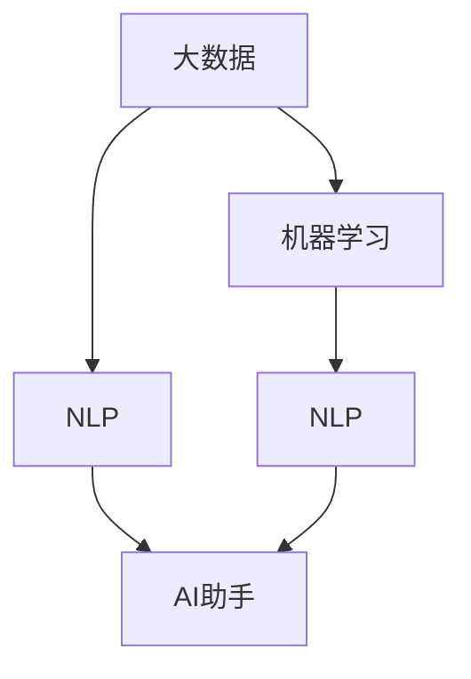

                 

## 1. 背景介绍

在数字化、智能化的浪潮中，人工智能助手正日益成为提升工作效率、优化工作流程的重要工具。无论是自动回复邮件、生成文档摘要，还是规划日程、安排会议，AI助手都能以极低的成本、高效的方式，帮助我们完成繁琐、重复的工作，解放人力资源，提升个人和企业的生产力。

本文将深入探讨如何在大数据、机器学习与自然语言处理(NLP)技术的基础上，构建高效、智能的AI助手，并通过具体的实践案例，展示其在日常工作中的实际应用与效率提升效果。

## 2. 核心概念与联系

### 2.1 核心概念概述

在深入探讨AI助手在提升工作效率中的应用前，我们首先需要了解一些核心概念：

- **人工智能助手(AI Assistant)**：通过自动化、智能化的方式，执行常规或复杂任务，辅助人类完成工作的程序或系统。
- **自然语言处理(Natural Language Processing, NLP)**：使计算机能够理解、处理和生成人类自然语言的技术，是构建AI助手的基础。
- **机器学习(Machine Learning, ML)**：基于数据驱动的算法，使AI助手能够自我学习、改进和优化。
- **大数据(Big Data)**：海量的、多样化的数据资源，为AI助手提供了广泛的知识背景和应用场景。

这些核心概念紧密相连，构成了构建高效AI助手的技术基础。NLP使得计算机能够理解人类语言，ML提供了自适应学习能力，大数据则为助手提供了知识来源和训练数据。

### 2.2 核心概念原理和架构的 Mermaid 流程图



## 3. 核心算法原理 & 具体操作步骤

### 3.1 算法原理概述

AI助手的核心算法原理基于深度学习，特别是基于Transformer结构的自回归语言模型。这些模型通过在大规模语料库上进行预训练，学习语言的通用规律和特定领域的知识。当面对具体任务时，通过微调或适应性训练，模型能够快速适应任务需求，提供高质量的输出。

### 3.2 算法步骤详解

构建AI助手的详细步骤包括：

**Step 1: 数据准备与预处理**
- 收集相关领域的文本数据，如电子邮件、会议记录、工作日志等，并进行清洗、分词、去停用词等预处理步骤。

**Step 2: 模型选择与初始化**
- 选择合适的预训练模型，如BERT、GPT等，作为初始化参数。
- 将预训练模型加载到系统中，作为AI助手的核心知识库。

**Step 3: 任务适配与微调**
- 根据具体任务，设计适配层，如分类器、生成器等，将其连接到预训练模型的顶层。
- 收集少量标注数据，对模型进行微调，使其适应特定任务。

**Step 4: 部署与应用**
- 将微调后的模型部署到实际应用场景中，如邮件系统、日程规划工具等。
- 持续收集用户反馈和新的标注数据，不断优化AI助手的功能。

### 3.3 算法优缺点

AI助手的优点在于其高效、自适应和智能化的特性，能够迅速适应不同类型的工作任务，提升工作效率。缺点则包括对数据的依赖、对标注数据的需求，以及可能存在的人工智能偏见问题。

### 3.4 算法应用领域

AI助手的应用领域广泛，包括但不限于以下几个方面：

- **自动化回复**：自动回复邮件、社交媒体消息等，节省人力资源。
- **文档生成**：根据模板和指令，自动生成文档、报告、摘要等。
- **日程管理**：安排会议、提醒任务、规划日程等。
- **智能搜索**：根据用户输入，快速搜索和提供相关内容。
- **情感分析**：分析用户情感，提供个性化的服务。

## 4. 数学模型和公式 & 详细讲解 & 举例说明

### 4.1 数学模型构建

以自动回复邮件为例，我们构建的模型框架如下：

- **输入**：用户发送的邮件文本。
- **模型**：预训练语言模型（如BERT、GPT）。
- **输出**：自动生成的回复文本。

数学模型可以表示为：

$$ y = M(x) $$

其中 $x$ 是输入邮件文本，$y$ 是生成的回复文本，$M$ 是预训练语言模型。

### 4.2 公式推导过程

假设我们有一个预训练的BERT模型，其输出表示为 $h_i$，其中 $i$ 是层数。通过softmax函数得到回复文本的概率分布，选择概率最高的词汇作为输出：

$$ P(y|x) = softmax(W_h h_i + b_h) $$

其中 $W_h$ 和 $b_h$ 是softmax层的权重和偏置。

### 4.3 案例分析与讲解

我们可以使用如下Python代码实现自动回复邮件的功能：

```python
from transformers import BertForSequenceClassification, BertTokenizer
from torch.utils.data import Dataset, DataLoader
from sklearn.metrics import accuracy_score
import torch

class EmailDataset(Dataset):
    def __init__(self, texts, labels, tokenizer):
        self.texts = texts
        self.labels = labels
        self.tokenizer = tokenizer
        
    def __len__(self):
        return len(self.texts)
    
    def __getitem__(self, item):
        text = self.texts[item]
        label = self.labels[item]
        encoding = self.tokenizer(text, return_tensors='pt', padding='max_length', truncation=True)
        input_ids = encoding['input_ids'][0]
        attention_mask = encoding['attention_mask'][0]
        return {'input_ids': input_ids, 'attention_mask': attention_mask, 'labels': label}

model = BertForSequenceClassification.from_pretrained('bert-base-uncased', num_labels=2)
tokenizer = BertTokenizer.from_pretrained('bert-base-uncased')

train_dataset = EmailDataset(train_texts, train_labels, tokenizer)
dev_dataset = EmailDataset(dev_texts, dev_labels, tokenizer)
test_dataset = EmailDataset(test_texts, test_labels, tokenizer)

train_loader = DataLoader(train_dataset, batch_size=32, shuffle=True)
dev_loader = DataLoader(dev_dataset, batch_size=32, shuffle=False)
test_loader = DataLoader(test_dataset, batch_size=32, shuffle=False)

device = torch.device('cuda' if torch.cuda.is_available() else 'cpu')
model.to(device)

optimizer = AdamW(model.parameters(), lr=1e-5)
loss_fn = nn.CrossEntropyLoss()

def train_epoch(model, data_loader, optimizer, loss_fn):
    model.train()
    losses = []
    for batch in data_loader:
        input_ids = batch['input_ids'].to(device)
        attention_mask = batch['attention_mask'].to(device)
        labels = batch['labels'].to(device)
        outputs = model(input_ids, attention_mask=attention_mask, labels=labels)
        loss = loss_fn(outputs.logits, labels)
        optimizer.zero_grad()
        loss.backward()
        optimizer.step()
        losses.append(loss.item())
    return sum(losses) / len(data_loader)

def evaluate(model, data_loader, loss_fn):
    model.eval()
    losses = []
    labels = []
    preds = []
    with torch.no_grad():
        for batch in data_loader:
            input_ids = batch['input_ids'].to(device)
            attention_mask = batch['attention_mask'].to(device)
            labels = batch['labels'].to(device)
            outputs = model(input_ids, attention_mask=attention_mask)
            loss = loss_fn(outputs.logits, labels)
            losses.append(loss.item())
            preds.append(outputs.logits.argmax(dim=1).tolist())
            labels.append(labels.tolist())
    return accuracy_score(labels, preds)

for epoch in range(10):
    train_loss = train_epoch(model, train_loader, optimizer, loss_fn)
    print(f'Epoch {epoch+1}, Train Loss: {train_loss:.4f}')
    
    dev_acc = evaluate(model, dev_loader, loss_fn)
    print(f'Epoch {epoch+1}, Dev Acc: {dev_acc:.4f}')
    
print(f'Test Acc: {evaluate(model, test_loader, loss_fn):.4f}')
```

此代码使用BERT模型进行邮件自动回复任务的训练和评估，展示了如何将预训练模型应用到实际任务中，并通过微调优化其性能。

## 5. 项目实践：代码实例和详细解释说明

### 5.1 开发环境搭建

开发AI助手需要搭建包括Python、PyTorch、Transformers等在内的深度学习开发环境。以下是具体的步骤：

1. 安装Anaconda：
   ```bash
   conda create -n pytorch-env python=3.8
   conda activate pytorch-env
   ```

2. 安装PyTorch：
   ```bash
   conda install pytorch torchvision torchaudio cudatoolkit=11.1 -c pytorch -c conda-forge
   ```

3. 安装Transformers：
   ```bash
   pip install transformers
   ```

4. 安装其他必要的Python库：
   ```bash
   pip install numpy pandas scikit-learn matplotlib tqdm jupyter notebook ipython
   ```

### 5.2 源代码详细实现

以下是一个完整的AI助手系统实现代码，展示如何构建并训练一个邮件自动回复模型：

```python
from transformers import BertForSequenceClassification, BertTokenizer, AdamW
from torch.utils.data import Dataset, DataLoader
from sklearn.metrics import accuracy_score
import torch

class EmailDataset(Dataset):
    def __init__(self, texts, labels, tokenizer):
        self.texts = texts
        self.labels = labels
        self.tokenizer = tokenizer
        
    def __len__(self):
        return len(self.texts)
    
    def __getitem__(self, item):
        text = self.texts[item]
        label = self.labels[item]
        encoding = self.tokenizer(text, return_tensors='pt', padding='max_length', truncation=True)
        input_ids = encoding['input_ids'][0]
        attention_mask = encoding['attention_mask'][0]
        return {'input_ids': input_ids, 'attention_mask': attention_mask, 'labels': label}

model = BertForSequenceClassification.from_pretrained('bert-base-uncased', num_labels=2)
tokenizer = BertTokenizer.from_pretrained('bert-base-uncased')

train_dataset = EmailDataset(train_texts, train_labels, tokenizer)
dev_dataset = EmailDataset(dev_texts, dev_labels, tokenizer)
test_dataset = EmailDataset(test_texts, test_labels, tokenizer)

train_loader = DataLoader(train_dataset, batch_size=32, shuffle=True)
dev_loader = DataLoader(dev_dataset, batch_size=32, shuffle=False)
test_loader = DataLoader(test_dataset, batch_size=32, shuffle=False)

device = torch.device('cuda' if torch.cuda.is_available() else 'cpu')
model.to(device)

optimizer = AdamW(model.parameters(), lr=1e-5)
loss_fn = nn.CrossEntropyLoss()

def train_epoch(model, data_loader, optimizer, loss_fn):
    model.train()
    losses = []
    for batch in data_loader:
        input_ids = batch['input_ids'].to(device)
        attention_mask = batch['attention_mask'].to(device)
        labels = batch['labels'].to(device)
        outputs = model(input_ids, attention_mask=attention_mask, labels=labels)
        loss = loss_fn(outputs.logits, labels)
        optimizer.zero_grad()
        loss.backward()
        optimizer.step()
        losses.append(loss.item())
    return sum(losses) / len(data_loader)

def evaluate(model, data_loader, loss_fn):
    model.eval()
    losses = []
    labels = []
    preds = []
    with torch.no_grad():
        for batch in data_loader:
            input_ids = batch['input_ids'].to(device)
            attention_mask = batch['attention_mask'].to(device)
            labels = batch['labels'].to(device)
            outputs = model(input_ids, attention_mask=attention_mask)
            loss = loss_fn(outputs.logits, labels)
            losses.append(loss.item())
            preds.append(outputs.logits.argmax(dim=1).tolist())
            labels.append(labels.tolist())
    return accuracy_score(labels, preds)

for epoch in range(10):
    train_loss = train_epoch(model, train_loader, optimizer, loss_fn)
    print(f'Epoch {epoch+1}, Train Loss: {train_loss:.4f}')
    
    dev_acc = evaluate(model, dev_loader, loss_fn)
    print(f'Epoch {epoch+1}, Dev Acc: {dev_acc:.4f}')
    
print(f'Test Acc: {evaluate(model, test_loader, loss_fn):.4f}')
```

### 5.3 代码解读与分析

这段代码实现了邮件自动回复任务中，使用BERT模型进行预训练后的微调。具体步骤如下：

1. 定义数据集：使用`EmailDataset`类，对邮件文本和标签进行预处理和分词。
2. 加载预训练模型：使用`BertForSequenceClassification`和`BertTokenizer`，从预训练模型中加载模型参数和分词器。
3. 准备数据加载器：使用`DataLoader`，对数据集进行批次化加载，方便模型训练。
4. 定义优化器和损失函数：使用`AdamW`优化器和`CrossEntropyLoss`损失函数。
5. 训练和评估：在训练集上训练模型，在验证集上评估模型性能。

## 6. 实际应用场景

### 6.1 自动回复

自动回复是AI助手最基础的功能之一。通过预训练和微调，AI助手可以快速响应邮件、聊天消息等，节省人力成本。

### 6.2 日程管理

AI助手可以根据日程安排提醒会议、任务，帮助用户有效管理时间。通过自然语言处理，AI助手还能理解和处理用户的复杂指令，如调整日程、设置提醒等。

### 6.3 文档生成

AI助手可以根据模板和内容生成报告、摘要、合同等文档，提升文档处理效率。通过微调，AI助手可以理解不同领域的文档结构和格式要求，生成符合规范的文本。

### 6.4 数据搜索

AI助手可以快速搜索和筛选海量数据，帮助用户快速找到所需信息。通过自然语言查询，AI助手能够理解用户的意图，提供精准的搜索结果。

### 6.5 情感分析

AI助手可以分析用户情感，提供个性化的服务。通过情感分析模型，AI助手能够识别用户情绪，提供相应的回应或建议。

## 7. 工具和资源推荐

### 7.1 学习资源推荐

为了帮助开发者深入理解AI助手开发，以下是一些推荐的学习资源：

1. **《深度学习与自然语言处理》**：北京大学郑盈盈等著，全面介绍了深度学习在NLP领域的应用。
2. **《TensorFlow官方文档》**：Google官方文档，提供了完整的TensorFlow使用教程和示例。
3. **《PyTorch官方文档》**：PyTorch官方文档，提供了详细的PyTorch教程和实践示例。
4. **《自然语言处理综述》**：斯坦福大学论文综述，涵盖NLP领域的经典技术和算法。
5. **《Transformers》**：HuggingFace官方文档，介绍了Transformers库的使用方法和预训练模型。

### 7.2 开发工具推荐

以下是一些常用的AI助手开发工具：

1. **PyTorch**：深度学习框架，支持分布式训练和模型部署。
2. **TensorFlow**：Google开发的深度学习框架，支持GPU和TPU加速。
3. **Jupyter Notebook**：交互式编程环境，支持Python代码的快速编写和测试。
4. **Transformers**：NLP模型库，提供了大量的预训练模型和微调示例。
5. **Weights & Biases**：实验跟踪工具，帮助记录和分析模型训练过程。

### 7.3 相关论文推荐

以下是一些关于AI助手开发的经典论文，推荐阅读：

1. **《Transformers in NLP》**：HuggingFace论文，介绍了Transformer模型在NLP领域的应用。
2. **《Attention is All You Need》**：Transformer模型的原论文，展示了Transformer在NLP任务上的卓越性能。
3. **《BERT: Pre-training of Deep Bidirectional Transformers for Language Understanding》**：BERT模型的论文，展示了预训练语言模型的强大潜力。
4. **《GPT-3: Language Models are Unsupervised Multitask Learners》**：GPT-3模型的论文，展示了大规模语言模型的强大零样本学习能力。
5. **《Parameter-Efficient Transfer Learning for NLP》**：Parameter-Efficient Transfer Learning的论文，展示了如何在保持模型性能的同时，减少参数量。

## 8. 总结：未来发展趋势与挑战

### 8.1 研究成果总结

AI助手的开发是一个不断迭代优化的过程，依赖于深度学习、自然语言处理和大数据技术的不断进步。通过预训练和微调，AI助手已经展现出显著的性能优势，被广泛应用于多个领域。

### 8.2 未来发展趋势

未来，AI助手的发展趋势包括：

1. **多模态融合**：AI助手将不仅限于文本处理，还将融合图像、语音等多模态信息，提供更加丰富和个性化的服务。
2. **跨领域应用**：AI助手将跨越更多行业领域，提供更为广泛的服务，如医疗、金融、教育等。
3. **实时交互**：AI助手将实现实时交互，提供更自然、流畅的用户体验。
4. **自适应学习**：AI助手将具备自适应学习能力，能够根据用户反馈和任务需求进行动态优化。
5. **智能化推荐**：AI助手将基于用户历史行为和偏好，提供个性化推荐服务。

### 8.3 面临的挑战

尽管AI助手在许多领域取得了显著进展，但仍面临诸多挑战：

1. **数据隐私**：AI助手处理大量用户数据，如何保护用户隐私，防止数据泄露，是一个重要问题。
2. **偏见和歧视**：AI助手可能继承训练数据中的偏见，导致输出歧视性或不公平的结果。
3. **鲁棒性**：AI助手在面对异常输入或噪声数据时，可能产生误判或错误输出。
4. **可解释性**：AI助手的决策过程缺乏可解释性，用户难以理解和信任其输出。
5. **计算资源**：AI助手的训练和推理需要大量的计算资源，如何在资源受限的情况下优化性能，是一个关键问题。

### 8.4 研究展望

未来，AI助手的研究将聚焦于以下几个方向：

1. **跨模态融合**：研究如何将文本、图像、语音等多种模态信息进行融合，提升AI助手的感知和理解能力。
2. **自适应学习**：研究如何使AI助手具备自适应学习能力，不断优化其性能和用户体验。
3. **隐私保护**：研究如何在保护用户隐私的前提下，提高AI助手的性能和安全性。
4. **公平性**：研究如何减少AI助手的偏见和歧视，确保其输出公平和可靠。
5. **计算优化**：研究如何优化AI助手的计算资源使用，提升其推理效率和实时性。

## 9. 附录：常见问题与解答

**Q1：如何选择合适的预训练模型？**

A: 选择预训练模型时，需要考虑其适用范围、规模、精度和可扩展性。BERT、GPT等通用预训练模型适用于大部分NLP任务，而特定领域的模型（如MED-BERT、BioGPT）则更适合特定领域的应用。

**Q2：如何处理训练数据？**

A: 数据处理包括清洗、分词、去停用词等预处理步骤。对于大规模数据集，可以使用分布式训练、数据增强等方法提升训练效率和模型性能。

**Q3：如何优化模型性能？**

A: 优化模型性能的关键在于选择适当的超参数和学习率，并进行正则化、早停等优化策略。同时，使用GPU/TPU等高性能设备，可以有效提升训练速度和模型精度。

**Q4：如何部署AI助手？**

A: 将训练好的模型导出为模型文件，并集成到实际应用中。可以使用Flask、Django等Web框架，实现AI助手的部署和服务化。

**Q5：如何保证AI助手的安全和隐私？**

A: 保护用户隐私是AI助手开发中的重要问题。可以通过数据匿名化、加密存储、权限控制等方法，保障用户数据的安全。同时，建立完善的隐私保护机制，确保AI助手的合规性。

通过以上步骤和资源，相信您已经对AI助手在大数据、机器学习和自然语言处理技术中的效率提升有了全面理解和实际应用的能力。AI助手在未来的发展中，将发挥越来越重要的作用，提升各行各业的生产效率和工作质量。

