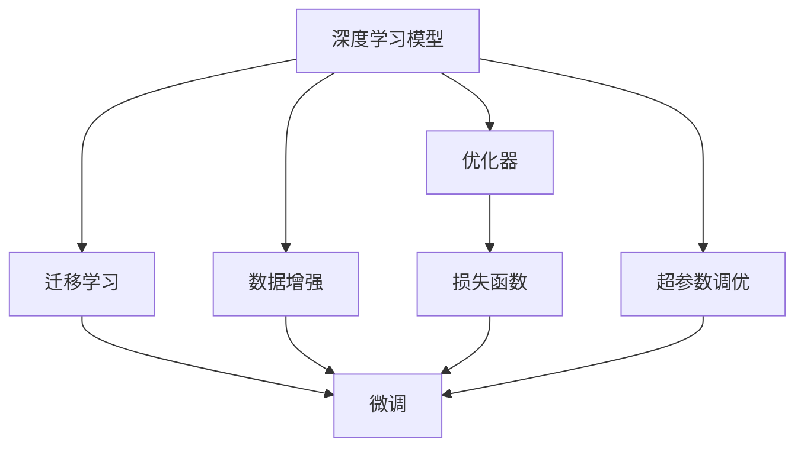

                 

# AI原生应用的创造与妙鸭爆红

> 关键词：AI原生应用,深度学习,妙鸭,数据增强,优化器,超参数调优,迁移学习,微调,自然语言处理(NLP),计算机视觉(CV)

## 1. 背景介绍

### 1.1 问题由来
随着人工智能技术的不断进步，AI原生应用正逐渐成为各行各业数字化转型的核心驱动力。无论是电商、金融、医疗还是教育，AI技术的应用已经从简单的自动化流程演进到深度学习和模型驱动的高级应用。在这个过程中，深度学习模型逐渐成为AI原生应用的核心技术之一，尤其在自然语言处理(NLP)和计算机视觉(CV)领域，其影响尤为显著。

深度学习模型的优势在于其强大的非线性建模能力，能够处理复杂的数据结构，并在大规模数据上自我学习优化。而NLP和CV作为数据驱动的典型应用，深度学习模型在其中发挥了至关重要的作用。

### 1.2 问题核心关键点
AI原生应用的创造，尤其是NLP和CV领域的应用，依赖于深度学习模型的微调和迁移学习。微调（Fine-Tuning）是指在预训练模型的基础上，通过有监督的学习方法，在特定任务上优化模型参数，以获得更好的性能。迁移学习（Transfer Learning）则是在预训练模型的基础上，利用已有的知识来加速新任务的模型训练。

微调和迁移学习的核心在于如何选择合适的模型架构，设计合理的损失函数，并利用数据增强、正则化等技术手段，避免模型过拟合，提升模型的泛化能力。在实际应用中，这些技术手段可以显著提高模型在特定任务上的性能。

### 1.3 问题研究意义
AI原生应用的创造和推广，对于推动各行各业的数字化转型，提升生产力，降低成本，具有重要意义。特别是在医疗、金融、教育等行业，深度学习模型可以显著提升业务决策的准确性和效率，推动行业创新和变革。

然而，深度学习模型的微调和迁移学习，特别是针对大规模数据集和复杂任务，需要大量的计算资源和时间，并且需要精心设计。因此，探索高效的模型训练方法，设计合理的损失函数，进行有效的超参数调优，是当前深度学习研究的一个重要方向。

## 2. 核心概念与联系

### 2.1 核心概念概述

为更好地理解AI原生应用的创造过程，本节将介绍几个核心概念及其间的联系：

- **深度学习模型**：以多层神经网络为代表的深度学习模型，能够自动学习数据的抽象特征，并用于解决复杂任务。
- **数据增强（Data Augmentation）**：通过对原始数据进行一系列变换操作，生成新的训练样本，以扩充训练集，提升模型的泛化能力。
- **优化器（Optimizer）**：用于更新模型参数的算法，通过梯度下降等方法，最小化损失函数，更新模型参数，使模型收敛。
- **损失函数（Loss Function）**：用于衡量模型输出与真实标签之间的差异，优化器通过反向传播更新参数以最小化损失。
- **超参数调优（Hyperparameter Tuning）**：调整模型的超参数（如学习率、批大小、迭代次数等），以获得更好的模型性能。
- **迁移学习（Transfer Learning）**：利用已有模型的知识，加速新任务模型训练。
- **微调（Fine-Tuning）**：在预训练模型的基础上，针对特定任务进行优化。

这些核心概念之间的联系可以通过以下Mermaid流程图来展示：



这个流程图展示了深度学习模型在数据增强、优化器、损失函数、超参数调优和迁移学习的作用下，经过微调过程，最终输出适应特定任务的高效模型。

## 3. 核心算法原理 & 具体操作步骤

### 3.1 算法原理概述

AI原生应用的创造，特别是基于深度学习的NLP和CV应用，通常遵循以下流程：

1. **数据准备**：收集和预处理训练数据，并进行数据增强。
2. **模型选择**：选择合适的预训练模型，如BERT、GPT、ResNet等。
3. **模型微调**：在特定任务上进行有监督的学习，优化模型参数。
4. **模型评估**：使用验证集评估模型性能，调整超参数。
5. **模型应用**：将训练好的模型应用于实际任务。

其中，微调是AI原生应用创造的核心步骤，其原理是通过有监督学习，在特定任务上调整模型参数，使其更贴近实际应用需求。

### 3.2 算法步骤详解

#### 3.2.1 数据准备

数据准备是深度学习模型微调的基础。以下是一个通用的数据准备流程：

1. **数据收集**：收集与目标任务相关的标注数据，确保数据质量和多样性。
2. **数据预处理**：对数据进行清洗、标注、归一化等处理，生成适合模型训练的格式。
3. **数据增强**：通过数据增强技术，生成更多的训练样本，提升模型泛化能力。

例如，在图像分类任务中，可以使用随机裁剪、旋转、缩放等方式生成新的图像数据，以扩充训练集。

#### 3.2.2 模型选择

选择适当的预训练模型是微调成功的关键。通常，选择与目标任务相关的模型，如在NLP任务中选择BERT或GPT模型，在CV任务中选择ResNet或Inception模型。

#### 3.2.3 模型微调

模型微调包括以下步骤：

1. **任务适配**：在预训练模型的基础上，添加或修改任务相关的层，如分类器、回归器等。
2. **损失函数设计**：选择合适的损失函数，如交叉熵、均方误差等，衡量模型输出与真实标签之间的差异。
3. **优化器选择**：选择合适的优化器，如Adam、SGD等，并设置超参数。
4. **超参数调优**：在验证集上调整学习率、批大小等超参数，优化模型性能。
5. **模型训练**：在训练集上迭代训练模型，使用优化器更新模型参数，最小化损失函数。
6. **模型评估**：在验证集和测试集上评估模型性能，使用准确率、精度等指标衡量模型效果。
7. **模型应用**：将训练好的模型应用于实际任务，生成预测结果。

#### 3.2.4 模型应用

模型应用是将微调后的模型部署到实际应用中，生成预测结果的过程。以下是一个示例流程：

1. **模型加载**：将训练好的模型加载到系统中。
2. **数据输入**：将待预测的数据输入模型。
3. **模型推理**：使用微调后的模型进行推理，生成预测结果。
4. **结果输出**：将预测结果输出到用户界面或API接口。

### 3.3 算法优缺点

基于深度学习的AI原生应用创造，具有以下优点：

- **高效泛化**：深度学习模型具备强大的泛化能力，能够在多种数据分布上进行良好的预测。
- **自动化学习**：深度学习模型能够自动学习数据的特征，无需手动设计特征工程。
- **可扩展性**：深度学习模型可以轻松扩展到复杂任务，适应不同的应用场景。

同时，也存在一些缺点：

- **计算资源消耗高**：深度学习模型需要大量的计算资源和时间进行训练。
- **数据依赖性强**：深度学习模型的性能高度依赖于训练数据的质量和数量。
- **模型复杂度大**：深度学习模型通常包含大量参数，增加了模型理解和调试的难度。

### 3.4 算法应用领域

基于深度学习的AI原生应用，在多个领域得到了广泛应用，例如：

- **自然语言处理（NLP）**：包括文本分类、情感分析、机器翻译等任务。深度学习模型可以自动学习语言特征，提升任务性能。
- **计算机视觉（CV）**：包括图像分类、目标检测、图像生成等任务。深度学习模型能够自动学习图像特征，提高视觉任务的准确性。
- **医疗健康**：包括疾病诊断、药物研发等任务。深度学习模型可以从海量医疗数据中学习疾病特征，辅助医疗决策。
- **金融服务**：包括信用评估、市场预测等任务。深度学习模型可以从金融数据中提取特征，辅助金融决策。
- **自动驾驶**：包括目标检测、路径规划等任务。深度学习模型可以从传感器数据中学习道路特征，辅助自动驾驶系统。

这些应用展示了深度学习模型的强大潜力，推动了各行各业的数字化转型。

## 4. 数学模型和公式 & 详细讲解 & 举例说明

### 4.1 数学模型构建

以下是一个典型的深度学习模型构建过程：

1. **输入层**：输入层接收原始数据，如图像像素、文本单词等。
2. **隐藏层**：隐藏层通过一系列的线性变换和激活函数，提取数据的特征。
3. **输出层**：输出层根据任务类型，进行分类、回归等操作。

以图像分类任务为例，可以使用CNN（卷积神经网络）作为模型架构，其数学模型如下：

$$
y=f(Wx+b)
$$

其中，$W$ 和 $b$ 为模型的参数，$x$ 为输入数据，$y$ 为模型的输出。

### 4.2 公式推导过程

深度学习模型的训练过程，通常使用反向传播算法，通过梯度下降更新模型参数。以最简单的线性回归为例，其推导过程如下：

1. **损失函数**：
$$
L=\frac{1}{2}\sum_{i=1}^n(y_i-\hat{y_i})^2
$$

其中，$y_i$ 为真实标签，$\hat{y_i}$ 为模型预测结果。

2. **梯度计算**：
$$
\frac{\partial L}{\partial W}=\frac{\partial L}{\partial y}\frac{\partial y}{\partial W}
$$

其中，$\frac{\partial L}{\partial y}$ 为损失函数对预测结果的梯度，$\frac{\partial y}{\partial W}$ 为预测结果对模型参数的梯度。

3. **参数更新**：
$$
W=W-\eta\frac{\partial L}{\partial W}
$$

其中，$\eta$ 为学习率，控制参数更新的幅度。

### 4.3 案例分析与讲解

以图像分类任务为例，使用深度学习模型进行微调的具体过程如下：

1. **数据准备**：收集并预处理图像数据，并进行数据增强。
2. **模型选择**：选择预训练的ResNet模型。
3. **模型微调**：添加分类器，选择交叉熵损失函数，使用Adam优化器进行训练。
4. **模型评估**：在验证集上评估模型性能，调整学习率和批大小。
5. **模型应用**：将训练好的模型应用于新图像，进行分类预测。

## 5. 项目实践：代码实例和详细解释说明

### 5.1 开发环境搭建

以下是基于PyTorch框架，搭建深度学习模型微调环境的步骤：

1. **安装PyTorch**：
```bash
pip install torch torchvision
```

2. **安装TensorBoard**：
```bash
pip install tensorboard
```

3. **创建虚拟环境**：
```bash
conda create --name pytorch-env python=3.7
conda activate pytorch-env
```

4. **安装相关库**：
```bash
pip install numpy pandas matplotlib
```

### 5.2 源代码详细实现

以下是一个简单的图像分类任务微调示例，使用ResNet模型进行微调：

```python
import torch
import torch.nn as nn
import torch.optim as optim
import torchvision
import torchvision.transforms as transforms
import tensorboard

# 定义数据增强和预处理
transform = transforms.Compose([
    transforms.RandomCrop(224),
    transforms.RandomHorizontalFlip(),
    transforms.ToTensor(),
    transforms.Normalize(mean=[0.485, 0.456, 0.406], std=[0.229, 0.224, 0.225])
])

# 加载数据集
train_dataset = torchvision.datasets.CIFAR10(root='./data', train=True, download=True, transform=transform)
test_dataset = torchvision.datasets.CIFAR10(root='./data', train=False, download=True, transform=transform)

# 划分训练集和验证集
train_loader = torch.utils.data.DataLoader(train_dataset, batch_size=64, shuffle=True, drop_last=True)
val_loader = torch.utils.data.DataLoader(test_dataset, batch_size=64, shuffle=False)

# 加载预训练模型
model = torchvision.models.resnet18(pretrained=True)
num_ftrs = model.fc.in_features

# 定义新的分类器
model.fc = nn.Linear(num_ftrs, 10)

# 定义损失函数和优化器
criterion = nn.CrossEntropyLoss()
optimizer = optim.SGD(model.parameters(), lr=0.001, momentum=0.9)

# 定义模型评估函数
def evaluate(model, loader):
    model.eval()
    with torch.no_grad():
        correct = 0
        total = 0
        for data in loader:
            images, labels = data
            outputs = model(images)
            _, predicted = torch.max(outputs.data, 1)
            total += labels.size(0)
            correct += (predicted == labels).sum().item()
        print('Accuracy of the network on the 10000 test images: %d %%' % (100 * correct / total))

# 训练模型
for epoch in range(10):
    running_loss = 0.0
    for i, data in enumerate(train_loader, 0):
        inputs, labels = data
        optimizer.zero_grad()
        outputs = model(inputs)
        loss = criterion(outputs, labels)
        loss.backward()
        optimizer.step()

        # 记录训练损失
        running_loss += loss.item()
        if i % 2000 == 1999:    # 每2000个batch输出一次loss
            print('[%d, %5d] loss: %.3f' % (epoch + 1, i + 1, running_loss / 2000))
            running_loss = 0.0

    # 在验证集上评估模型
    evaluate(model, val_loader)
```

### 5.3 代码解读与分析

上述代码展示了从数据准备到模型训练的全过程。

1. **数据准备**：定义数据增强和预处理，加载CIFAR-10数据集，并划分训练集和验证集。
2. **模型选择**：加载预训练的ResNet模型，定义新的分类器。
3. **训练过程**：定义损失函数和优化器，训练模型。
4. **模型评估**：定义模型评估函数，在验证集上评估模型性能。

## 6. 实际应用场景

### 6.1 智能客服系统

智能客服系统是AI原生应用的重要应用之一，使用深度学习模型进行微调，可以显著提升客服系统的智能化水平。

例如，可以使用微调后的模型，自动理解用户输入的自然语言，进行意图识别和实体抽取，并根据用户需求生成合适的回复。通过不断训练和优化，智能客服系统可以逐步替代人工客服，提高服务效率和质量。

### 6.2 医疗健康

深度学习模型在医疗健康领域具有广阔的应用前景。例如，可以使用微调后的模型进行疾病诊断、病理分析、药物研发等任务。

在疾病诊断任务中，使用微调后的模型，可以从医学影像中自动提取特征，进行疾病分类和定位。在药物研发任务中，可以使用微调后的模型，预测新药物的疗效和副作用，加速新药研发进程。

### 6.3 自动驾驶

自动驾驶技术是AI原生应用的另一个重要应用场景，使用深度学习模型进行微调，可以显著提升驾驶系统的安全性和稳定性。

例如，可以使用微调后的模型，自动检测道路上的障碍物和行人，进行路径规划和避障。通过不断训练和优化，自动驾驶系统可以逐步实现高级驾驶辅助功能，如自动泊车、自动巡航等。

### 6.4 未来应用展望

未来，AI原生应用将进一步拓展到更多的领域，推动各行各业的数字化转型。以下是一些未来应用展望：

1. **智能制造**：使用深度学习模型进行质量检测、故障预测、生产调度等任务，提升制造效率和质量。
2. **智能农业**：使用深度学习模型进行作物识别、病虫害预测、农资推荐等任务，提升农业生产效率和收益。
3. **智能物流**：使用深度学习模型进行货物识别、路径规划、配送优化等任务，提升物流效率和用户体验。
4. **智能交通**：使用深度学习模型进行交通流量预测、交通信号优化、自动驾驶等任务，提升交通系统效率和安全。

## 7. 工具和资源推荐

### 7.1 学习资源推荐

以下是一些深度学习模型微调的相关学习资源：

1. **《深度学习》课程**：斯坦福大学的在线课程，涵盖深度学习的基础知识和经典模型。
2. **《TensorFlow官方文档》**：提供详细的TensorFlow框架介绍和微调示例。
3. **《PyTorch官方文档》**：提供详细的PyTorch框架介绍和微调示例。
4. **《深度学习入门》书籍**：深入浅出地介绍深度学习的基本原理和实践方法。
5. **《Transformers论文》**：介绍Transformer架构的原理和应用，推动了深度学习模型微调的发展。

### 7.2 开发工具推荐

以下是一些深度学习模型微调常用的开发工具：

1. **PyTorch**：开源深度学习框架，支持动态图，易于模型迭代和调试。
2. **TensorFlow**：开源深度学习框架，支持静态图，适用于大规模工程应用。
3. **Jupyter Notebook**：交互式开发环境，支持代码编写和结果展示。
4. **TensorBoard**：可视化工具，记录和展示模型训练过程。
5. **Weights & Biases**：实验跟踪工具，记录和分析模型训练数据。

### 7.3 相关论文推荐

以下是一些深度学习模型微调的相关论文：

1. **《ImageNet Classification with Deep Convolutional Neural Networks》**：介绍卷积神经网络在图像分类任务中的应用。
2. **《Rethinking the Inception Architecture for Computer Vision》**：介绍Inception网络在图像分类任务中的应用。
3. **《Imagenet Classification with Deep Convolutional Neural Networks》**：介绍深度残差网络在图像分类任务中的应用。
4. **《Natural Language Processing (almost) for Free with Transfer Learning》**：介绍迁移学习在NLP任务中的应用。
5. **《Fine-Tuning BERT for Sequence Classification》**：介绍BERT模型在NLP任务中的微调方法。

## 8. 总结：未来发展趋势与挑战

### 8.1 研究成果总结

深度学习模型微调技术在AI原生应用的创造中发挥了重要作用，推动了各行各业的数字化转型。然而，深度学习模型的训练过程仍然面临诸多挑战，需要进一步研究。

### 8.2 未来发展趋势

未来，深度学习模型的微调和迁移学习将进一步拓展到更多领域，推动人工智能技术的全面应用。以下是一些未来发展趋势：

1. **模型规模增大**：深度学习模型的参数量将进一步增大，能够处理更复杂、更大规模的数据。
2. **迁移学习泛化**：迁移学习将进一步推广到更多领域，加速新任务的模型训练。
3. **多模态融合**：深度学习模型将逐步实现多模态数据的融合，提升跨领域任务的能力。
4. **自动化调参**：自动化的超参数调优方法将逐步普及，提升模型训练效率。
5. **公平性与安全**：深度学习模型将更加注重公平性、安全性和可解释性，确保模型的伦理导向。

### 8.3 面临的挑战

尽管深度学习模型在AI原生应用中取得了很多进展，但仍面临一些挑战：

1. **数据依赖性强**：深度学习模型的性能高度依赖于训练数据的质量和数量。
2. **计算资源消耗高**：深度学习模型需要大量的计算资源和时间进行训练。
3. **模型复杂度大**：深度学习模型通常包含大量参数，增加了模型理解和调试的难度。
4. **公平性与安全**：深度学习模型需要更加注重公平性、安全性和可解释性，确保模型的伦理导向。

### 8.4 研究展望

未来，深度学习模型微调和迁移学习的研究方向将更加多样，涵盖以下方面：

1. **少样本学习**：在大规模无标签数据上，使用迁移学习和小样本学习方法，提升模型的泛化能力。
2. **自监督学习**：在大规模无标签数据上，使用自监督学习方法，提升模型的数据利用效率。
3. **自适应学习**：在使用数据分布变化的情况下，通过自适应学习方法，提升模型的鲁棒性。
4. **联邦学习**：在分布式环境下，通过联邦学习方法，保护用户隐私的同时，提升模型的性能。
5. **解释性学习**：通过可解释性学习方法，提升深度学习模型的透明度和可信度。

## 9. 附录：常见问题与解答

### 9.1 常见问题与解答

**Q1: 深度学习模型的微调和迁移学习有什么区别？**

A: 深度学习模型的微调是指在预训练模型的基础上，针对特定任务进行优化。迁移学习则是在预训练模型的基础上，利用已有知识加速新任务的模型训练。

**Q2: 如何选择合适的深度学习模型？**

A: 选择合适的深度学习模型需要考虑任务类型、数据规模和模型复杂度等因素。一般来说，在NLP任务中选择BERT或GPT模型，在CV任务中选择ResNet或Inception模型。

**Q3: 如何避免深度学习模型的过拟合？**

A: 避免深度学习模型的过拟合可以通过以下方法：
1. 数据增强：通过随机变换生成更多的训练样本。
2. 正则化：使用L2正则、Dropout等方法。
3. 早停：在验证集上监控模型性能，及时停止训练。
4. 模型集成：使用多个模型的集成预测。

**Q4: 深度学习模型的训练时间如何优化？**

A: 深度学习模型的训练时间可以通过以下方法优化：
1. 使用GPU/TPU等高性能设备。
2. 使用混合精度训练。
3. 使用梯度累积。
4. 使用更高效的优化器。

**Q5: 深度学习模型在实际应用中的部署方式有哪些？**

A: 深度学习模型在实际应用中的部署方式有以下几种：
1. 模型保存与加载：将训练好的模型保存到文件中，供后续使用。
2. 模型部署：将模型部署到服务器或云平台，供API调用或直接推理。
3. 模型微调：在新任务上继续微调模型，提高性能。
4. 模型优化：对模型进行量化、剪枝等优化，提高推理效率。

以上问题与解答，涵盖了深度学习模型微调和迁移学习的核心概念和应用问题，希望能够对读者有所帮助。

---

作者：禅与计算机程序设计艺术 / Zen and the Art of Computer Programming

