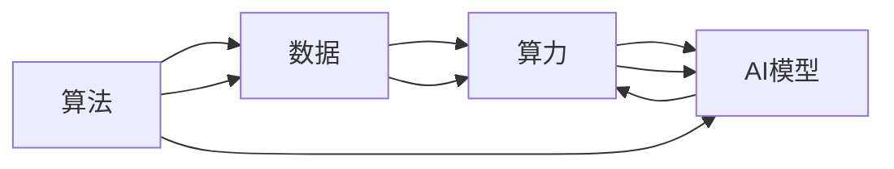

                 

## 1. 背景介绍

人工智能(AI)的快速发展，正在深刻影响社会的方方面面，从医疗、金融、教育，到工业制造、交通运输、城市管理，AI技术无处不在。在AI的演进过程中，有三根支柱至关重要：算法、算力和数据。这三者相辅相成，缺一不可，共同推动AI技术不断突破创新。本文将系统探讨这三者的关系，并深入分析其在实际应用中的具体体现。

## 2. 核心概念与联系

### 2.1 核心概念概述

- **算法(Algorithms)**：指计算机程序中按照特定规则处理数据的方法和步骤。在AI中，算法通常包括机器学习算法、深度学习算法、强化学习算法等，用于从数据中学习规律和模式，进行智能决策。

- **算力(Computing Power)**：指执行计算任务的硬件资源和软件工具。算力不仅包括CPU、GPU等计算硬件，还包括云计算、分布式计算等技术，提供高效、可靠的计算环境。

- **数据(Datasets)**：指AI模型训练和推理所依赖的数据集。数据的质量、多样性和规模，直接决定了AI模型的性能和应用效果。

这三者之间的联系紧密，共同构成了一个完整的AI系统。算法提供智能决策的能力，算力提供执行计算的能力，数据提供智能决策的依据。只有当这三者协同工作，才能实现AI的创新应用。

### 2.2 核心概念原理和架构的 Mermaid 流程图



### 2.3 核心概念的相互作用

- **算法依赖数据**：算法的效果很大程度上取决于数据的数量和质量。只有基于丰富、多样、标注准确的数据，才能训练出高性能的AI模型。
- **算力支撑算法**：算力决定了算法的执行效率和计算能力。在深度学习和强化学习中，大模型的训练和推理需要强大的计算资源支持。
- **数据驱动算法**：数据是算法的输入，也是模型性能评估的标准。在算法设计过程中，需要充分考虑数据的特征和分布，以提高模型的泛化能力和鲁棒性。

## 3. 核心算法原理 & 具体操作步骤

### 3.1 算法原理概述

在AI中，算法是实现智能决策和自主学习的基础。无论是有监督学习、无监督学习还是强化学习，算法都是核心。算法通过处理和分析数据，学习出规律和模式，最终形成决策。

以深度学习为例，算法通常包括以下几个核心组件：

- **神经网络(Neural Networks)**：由多个层构成的计算图，用于处理数据并提取特征。
- **损失函数(Loss Function)**：用于衡量模型预测与真实标签之间的差异，指导模型优化。
- **优化器(Optimizer)**：如Adam、SGD等，用于更新模型参数，最小化损失函数。
- **正则化(Regularization)**：如L1、L2正则、Dropout等，防止模型过拟合。

这些组件共同工作，构成了一个完整的深度学习算法流程。

### 3.2 算法步骤详解

1. **数据预处理**：将原始数据进行清洗、归一化、分词等预处理，以便于算法处理。
2. **模型初始化**：选择适当的神经网络结构，如CNN、RNN、Transformer等，并初始化模型参数。
3. **训练过程**：通过前向传播计算模型输出，反向传播更新模型参数，最小化损失函数。
4. **模型评估**：在验证集或测试集上评估模型性能，调整算法超参数。
5. **模型部署**：将训练好的模型部署到生产环境中，进行实际应用。

### 3.3 算法优缺点

**优点**：
- **高效性**：算法能够自动学习数据中的规律，具有高度的自适应性。
- **可扩展性**：算法可以适应大规模数据和高性能计算环境。
- **鲁棒性**：经过充分训练的算法，对新数据具有较强的泛化能力。

**缺点**：
- **复杂度**：深度学习等算法模型复杂，需要大量标注数据和计算资源。
- **可解释性**：一些复杂算法如深度学习，其决策过程难以解释。
- **数据依赖**：算法效果依赖于数据质量和分布，低质量数据可能导致模型失效。

### 3.4 算法应用领域

算法在AI中的应用非常广泛，涵盖机器视觉、自然语言处理、语音识别、推荐系统等多个领域。以下是一些具体应用：

- **机器视觉**：通过算法处理图像和视频数据，进行目标检测、人脸识别、图像分割等任务。
- **自然语言处理**：使用算法处理文本数据，进行情感分析、文本分类、语言翻译等任务。
- **语音识别**：通过算法处理音频数据，进行语音识别、语音合成、语音情感分析等任务。
- **推荐系统**：使用算法处理用户行为数据，进行个性化推荐、广告投放等任务。

## 4. 数学模型和公式 & 详细讲解 & 举例说明

### 4.1 数学模型构建

以神经网络为例，常见的数学模型构建包括：

- **输入层**：将原始数据映射为向量形式，如图片像素值、文本词向量等。
- **隐藏层**：通过多个线性变换和非线性激活函数，提取数据特征。
- **输出层**：根据任务类型，进行分类、回归等不同形式的输出。

### 4.2 公式推导过程

以深度学习中的反向传播算法为例，其推导过程如下：

$$
\frac{\partial L}{\partial W} = \frac{\partial L}{\partial \hat{y}} \frac{\partial \hat{y}}{\partial z} \frac{\partial z}{\partial W}
$$

其中 $W$ 为权重矩阵，$\hat{y}$ 为预测值，$z$ 为隐藏层输出。公式表示，通过链式法则计算损失函数 $L$ 对权重 $W$ 的梯度。

### 4.3 案例分析与讲解

以TensorFlow中的MNIST手写数字识别为例，其算法流程如下：

1. **数据预处理**：将原始手写数字图像归一化、转换为灰度图像、分词等。
2. **模型构建**：选择卷积神经网络(CNN)作为模型结构，并初始化参数。
3. **训练过程**：使用反向传播算法更新模型参数，最小化损失函数。
4. **模型评估**：在测试集上评估模型性能，调整超参数。
5. **模型部署**：将训练好的模型部署到生产环境中，进行实际应用。

## 5. 项目实践：代码实例和详细解释说明

### 5.1 开发环境搭建

在进行项目实践前，需要先准备好开发环境。以下是使用Python和TensorFlow进行深度学习开发的环境配置流程：

1. 安装Anaconda：从官网下载并安装Anaconda，用于创建独立的Python环境。
2. 创建并激活虚拟环境：
```bash
conda create -n tf-env python=3.8 
conda activate tf-env
```
3. 安装TensorFlow和其他依赖包：
```bash
pip install tensorflow==2.7 
pip install numpy pandas matplotlib
```

完成上述步骤后，即可在`tf-env`环境中开始深度学习开发。

### 5.2 源代码详细实现

以下是使用TensorFlow进行手写数字识别任务（MNIST数据集）的代码实现：

```python
import tensorflow as tf
from tensorflow.keras import datasets, layers, models

# 加载数据集
(train_images, train_labels), (test_images, test_labels) = datasets.mnist.load_data()

# 数据预处理
train_images = train_images / 255.0
test_images = test_images / 255.0

# 构建模型
model = models.Sequential([
    layers.Conv2D(32, (3,3), activation='relu', input_shape=(28, 28, 1)),
    layers.MaxPooling2D((2,2)),
    layers.Flatten(),
    layers.Dense(128, activation='relu'),
    layers.Dense(10, activation='softmax')
])

# 编译模型
model.compile(optimizer='adam',
              loss='sparse_categorical_crossentropy',
              metrics=['accuracy'])

# 训练模型
model.fit(train_images, train_labels, epochs=5, 
          validation_data=(test_images, test_labels))

# 评估模型
test_loss, test_acc = model.evaluate(test_images, test_labels)
print(f"Test accuracy: {test_acc}")
```

### 5.3 代码解读与分析

让我们再详细解读一下关键代码的实现细节：

- **数据预处理**：将原始图像像素值归一化到0到1之间，以提高模型的收敛速度。
- **模型构建**：选择卷积神经网络(CNN)，包含卷积层、池化层、全连接层等，用于处理图像数据。
- **模型编译**：选择Adam优化器，交叉熵损失函数，准确率作为评估指标，进行模型配置。
- **模型训练**：在训练集上迭代5个epoch，每个epoch训练一次后，在验证集上评估一次性能。
- **模型评估**：在测试集上评估模型准确率，输出最终测试结果。

可以看到，TensorFlow提供了一体化的API，方便开发者快速构建和训练深度学习模型。

## 6. 实际应用场景

### 6.1 智能医疗

智能医疗是AI技术的重要应用领域之一。通过算法处理医疗数据，可以辅助医生进行疾病诊断、治疗方案推荐、药物研发等任务。

以图像识别为例，通过深度学习算法处理医学影像数据，进行疾病识别、病变分析等任务。在自然语言处理方面，通过算法处理电子病历、医生笔记等文本数据，进行医疗问答、患者随访等任务。在推荐系统中，通过算法处理用户行为数据，进行个性化治疗方案推荐、医疗广告投放等任务。

### 6.2 金融风控

金融风控是AI技术的另一个重要应用领域。通过算法处理金融数据，可以进行风险评估、欺诈检测、智能投顾等任务。

在风险评估方面，通过算法处理历史贷款数据，进行信用评分、贷款违约预测等任务。在欺诈检测方面，通过算法处理交易数据，进行交易异常检测、反欺诈识别等任务。在智能投顾方面，通过算法处理投资数据，进行投资组合优化、投资策略推荐等任务。

### 6.3 智能制造

智能制造是AI技术在工业领域的重要应用。通过算法处理生产数据，可以进行质量控制、设备维护、生产调度等任务。

在质量控制方面，通过算法处理生产线数据，进行缺陷检测、产品检测等任务。在设备维护方面，通过算法处理设备运行数据，进行故障预测、维护计划生成等任务。在生产调度方面，通过算法处理生产数据，进行生产计划优化、生产过程控制等任务。

## 7. 工具和资源推荐

### 7.1 学习资源推荐

为了帮助开发者系统掌握AI的算法、算力和数据，这里推荐一些优质的学习资源：

1. **深度学习课程**：斯坦福大学、MIT、Coursera等机构的深度学习课程，涵盖了机器学习、深度学习、强化学习等多个领域。
2. **TensorFlow官方文档**：TensorFlow的官方文档，提供了详尽的API参考和案例演示，适合初学者和进阶开发者。
3. **Kaggle竞赛**：Kaggle举办的各类机器学习和深度学习竞赛，提供了丰富的数据集和模型评测标准，适合实战演练。
4. **GitHub项目**：GitHub上开源的AI项目，提供了大量优秀的代码和案例，适合学习和参考。
5. **AI社区**：如AI Stack Exchange、AI Chinese等社区，提供丰富的讨论和资源分享，适合交流和学习。

### 7.2 开发工具推荐

高效的开发离不开优秀的工具支持。以下是几款用于AI开发常用的工具：

1. **TensorFlow**：由Google主导开发的深度学习框架，功能强大，生态丰富，适合大规模工程应用。
2. **PyTorch**：由Facebook主导开发的深度学习框架，灵活性高，社区活跃，适合研究和创新。
3. **Jupyter Notebook**：用于数据科学和机器学习的交互式笔记本环境，方便开发者快速迭代实验。
4. **Scikit-learn**：Python机器学习库，提供了丰富的算法和工具，适合数据预处理和模型评估。
5. **NumPy**：Python数值计算库，提供了高效的数组操作和数学函数，适合大规模数据处理。

### 7.3 相关论文推荐

AI的算法、算力和数据技术的不断发展，得益于学界的持续研究。以下是几篇奠基性的相关论文，推荐阅读：

1. **Deep Learning**：由Ian Goodfellow、Yoshua Bengio和Aaron Courville合著的经典书籍，详细介绍了深度学习的基本原理和应用。
2. **ImageNet Classification with Deep Convolutional Neural Networks**：AlexNet论文，展示了深度卷积神经网络在图像分类任务上的强大能力。
3. **Attention is All You Need**：Transformer论文，展示了自注意力机制在自然语言处理任务上的出色表现。
4. **TensorFlow: A System for Large-Scale Machine Learning**：Google发布的TensorFlow论文，介绍了TensorFlow的设计理念和架构。
5. **BERT: Pre-training of Deep Bidirectional Transformers for Language Understanding**：BERT论文，展示了预训练语言模型在自然语言处理任务上的突破性进展。

## 8. 总结：未来发展趋势与挑战

### 8.1 总结

本文对AI发展的三大支柱：算法、算力和数据进行了系统介绍，明确了它们之间的联系和相互作用。算法提供了智能决策的能力，算力提供了高效执行的能力，数据提供了决策依据的能力。只有当这三者协同工作，才能实现AI的创新应用。

### 8.2 未来发展趋势

展望未来，AI的算法、算力和数据技术将呈现以下几个发展趋势：

1. **算法多样性**：随着AI应用的不断拓展，更多多样化的算法将被开发和应用，如强化学习、因果推理、元学习等。
2. **算力升级**：随着硬件技术的不断进步，算力将得到持续提升，如GPU、TPU、FPGA等计算硬件的发展，将极大提高AI模型的训练和推理效率。
3. **数据普适性**：数据的来源和质量将不断扩展，数据集规模和多样性将进一步提高，如自动标注、数据合成等技术的应用，将提升数据获取的效率和质量。
4. **跨领域融合**：AI将与其他学科领域进行更深入的融合，如生物信息学、天文学、经济学等，解决更多跨领域问题。
5. **伦理与安全**：AI的伦理和安全问题将受到更多关注，如隐私保护、模型偏见、公平性等，将是未来研究的重要课题。

### 8.3 面临的挑战

尽管AI技术已经取得了巨大的进展，但在迈向更加智能化、普适化应用的过程中，仍面临着诸多挑战：

1. **数据隐私**：如何保护数据隐私和用户隐私，避免数据泄露和滥用，是AI应用中亟待解决的问题。
2. **模型偏见**：AI模型可能会学习到数据中的偏见，导致不公平和歧视性的决策。如何消除模型偏见，是AI伦理和安全的重要课题。
3. **可解释性**：AI模型的决策过程难以解释，缺乏透明性。如何提升AI模型的可解释性，增强用户信任和接受度，是未来研究的重要方向。
4. **鲁棒性**：AI模型对噪声和异常数据敏感，可能出现鲁棒性不足的问题。如何提高模型的鲁棒性和泛化能力，是AI应用中的重要挑战。
5. **资源消耗**：AI模型的训练和推理消耗大量计算资源，如何降低资源消耗，提高计算效率，是AI应用中的重要课题。

### 8.4 研究展望

面对AI技术面临的诸多挑战，未来的研究需要在以下几个方面寻求新的突破：

1. **数据隐私保护**：开发数据隐私保护技术，如差分隐私、联邦学习等，保护用户隐私和数据安全。
2. **模型公平性**：研究如何消除模型偏见，提升AI模型的公平性和公正性。
3. **可解释性增强**：开发可解释性AI技术，提升AI模型的透明性和用户信任度。
4. **模型鲁棒性提升**：研究鲁棒性增强技术，如鲁棒性训练、对抗样本生成等，提高AI模型的鲁棒性和泛化能力。
5. **资源优化**：研究高效计算技术和模型压缩技术，降低AI模型的资源消耗，提升计算效率。

这些研究方向的探索，必将引领AI技术迈向更高的台阶，为构建更加智能、普适、安全的人工智能系统铺平道路。面向未来，AI技术的持续创新和突破，将为人类社会带来更多的变革和发展机遇。

## 9. 附录：常见问题与解答

**Q1：如何选择合适的算法？**

A: 选择算法需要考虑任务类型、数据规模和复杂度等因素。对于分类、回归任务，可以选择有监督学习算法；对于序列生成任务，可以选择序列到序列模型；对于无监督学习任务，可以选择自编码、自注意力模型等。

**Q2：如何提高算法的训练效率？**

A: 提高训练效率可以从以下几个方面入手：
1. 使用GPU/TPU等高性能计算硬件。
2. 采用分布式训练和模型并行技术。
3. 使用混合精度训练和梯度积累技术。
4. 优化数据读取和预处理流程，减少IO开销。

**Q3：如何选择适合的算力资源？**

A: 选择算力资源需要考虑任务规模、数据量、计算需求等因素。对于小规模任务，可以使用CPU等普通计算资源；对于大规模任务，需要使用GPU、TPU等高性能计算资源。同时，需要考虑算力资源的性价比和可扩展性，选择合适的云计算平台。

**Q4：如何保护数据隐私？**

A: 数据隐私保护可以通过以下几种方式实现：
1. 数据脱敏和匿名化处理。
2. 差分隐私技术，通过添加噪声保护用户隐私。
3. 联邦学习，在本地数据上训练模型，避免数据集中存储。

**Q5：如何提升AI模型的可解释性？**

A: 提升AI模型的可解释性可以从以下几个方面入手：
1. 使用可解释性算法，如LIME、SHAP等。
2. 引入因果推理和博弈论等工具，解释模型决策过程。
3. 可视化模型输出，如特征重要性图、决策路径图等。

通过本文的系统梳理，可以看到，AI的算法、算力和数据技术在实际应用中具有重要的地位和作用。只有这三者协同工作，才能实现AI的创新应用，带来更多变革性的影响。面向未来，持续关注AI技术的进展，不断探索和突破，将使得AI技术在更多领域实现落地应用，推动人类社会的进步和发展。

---

作者：禅与计算机程序设计艺术 / Zen and the Art of Computer Programming

