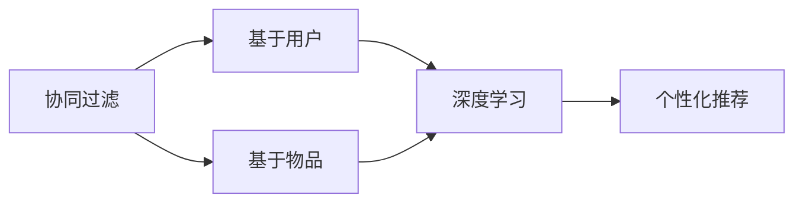

                 

# AI在个性化推荐中的创新应用

> 关键词：个性化推荐,深度学习,协同过滤,神经网络,推荐系统

## 1. 背景介绍

### 1.1 问题由来
个性化推荐系统（Recommendation System）是互联网时代的重要技术，广泛应用于电子商务、视频娱乐、社交网络等领域，极大提升了用户体验和商业价值。传统的推荐系统主要基于用户的历史行为数据，通过协同过滤、内容推荐等方法，为用户推荐其可能感兴趣的物品。然而，这种基于历史行为数据的推荐方法，存在数据稀疏、新物品冷启动、历史行为不充分等诸多问题。

为了突破这些局限，研究人员开始探索基于AI的推荐技术。深度学习技术的应用，使得推荐系统能够更好地利用用户特征、物品特征和行为数据，建立更加复杂精细的推荐模型，提高推荐的准确性和个性化程度。本文将系统介绍基于AI的推荐系统，特别是深度学习和协同过滤算法在个性化推荐中的应用，并结合实际案例，展现AI技术在推荐系统中的创新应用。

## 2. 核心概念与联系

### 2.1 核心概念概述

在深入研究基于AI的推荐系统之前，首先需理解几个核心概念：

- 推荐系统（Recommendation System）：通过分析用户行为数据，为用户推荐可能感兴趣的物品。传统推荐系统基于协同过滤等方法，而AI推荐系统则通过深度学习模型进行个性化推荐。
- 协同过滤（Collaborative Filtering）：通过用户之间的相似性、物品之间的相似性，为用户推荐未交互过的物品。协同过滤分为基于用户的协同过滤和基于物品的协同过滤两种方式。
- 深度学习（Deep Learning）：利用多层神经网络对数据进行特征提取和模型训练，具有强大的非线性建模能力。深度学习可以应用于推荐系统中的用户画像建模、物品表示学习等环节。
- 个性化推荐（Personalized Recommendation）：通过分析用户的特定需求和行为，为其推荐更符合其兴趣和喜好的物品。个性化推荐系统需要综合考虑用户行为、物品特征等多方面信息。
- 知识图谱（Knowledge Graph）：利用图结构存储实体和关系，用于推荐系统的领域知识和规则构建。

这些核心概念相互关联，共同构成了基于AI的推荐系统的基础框架。协同过滤和深度学习是该框架中的核心技术，通过将用户和物品特征嵌入到高维空间，推荐系统能够学习到更加复杂的用户-物品关系，从而实现更高精度的推荐。

### 2.2 核心概念原理和架构的 Mermaid 流程图



这个流程图展示了推荐系统的基本架构：

- 协同过滤通过用户之间的相似性和物品之间的相似性进行推荐。
- 深度学习用于用户和物品特征的表示学习。
- 个性化推荐根据用户和物品特征进行物品推荐。

这些技术相互协同，共同构建了基于AI的推荐系统。

## 3. 核心算法原理 & 具体操作步骤

### 3.1 算法原理概述

基于AI的推荐系统核心原理是通过深度学习模型，对用户行为数据进行特征提取和表示学习，从而实现个性化推荐。具体流程如下：

1. 数据准备：收集用户历史行为数据，包括点击、浏览、购买等行为。
2. 用户画像建模：通过深度学习模型，对用户行为数据进行特征提取和表示学习，生成用户画像。
3. 物品表示学习：利用深度学习模型，对物品属性、描述、标签等进行表示学习，生成物品向量。
4. 相似度计算：通过余弦相似度等方法，计算用户画像与物品向量的相似度。
5. 推荐生成：根据相似度排序，选择top N的物品推荐给用户。

### 3.2 算法步骤详解

以下是基于深度学习的推荐系统的详细操作步骤：

#### Step 1: 数据预处理
- 收集用户行为数据，包括点击、浏览、购买等行为。
- 将行为数据转化为数字形式，生成用户行为序列。
- 对用户行为序列进行标准化处理，如归一化、截断等。

#### Step 2: 用户画像建模
- 利用深度学习模型，对用户行为序列进行编码，生成用户画像向量。
- 常用的深度学习模型包括RNN、GRU、LSTM等。
- 用户画像向量可以表示用户的历史行为、兴趣偏好等信息。

#### Step 3: 物品表示学习
- 利用深度学习模型，对物品属性、描述、标签等进行编码，生成物品向量。
- 常用的深度学习模型包括CNN、BERT等。
- 物品向量可以表示物品的属性、特征、标签等信息。

#### Step 4: 相似度计算
- 通过余弦相似度、欧式距离等方法，计算用户画像向量与物品向量的相似度。
- 相似度越高的物品，与用户画像越相关，越可能被推荐。

#### Step 5: 推荐生成
- 根据相似度排序，选择top N的物品推荐给用户。
- 推荐算法可以基于用户的画像向量，也可以基于物品的向量。

#### Step 6: 反馈调整
- 根据用户对推荐结果的反馈，更新用户画像和物品向量。
- 常用的反馈调整方法包括用户反馈和物品反馈。

### 3.3 算法优缺点

基于深度学习的推荐系统具有以下优点：
1. 能够充分利用用户行为数据，挖掘用户兴趣和行为模式。
2. 能够捕捉用户行为数据中的非线性关系，提高推荐精度。
3. 能够动态更新用户画像和物品向量，适应用户兴趣的变化。
4. 能够生成更加个性化和多样化的推荐结果。

同时，该算法也存在一些缺点：
1. 数据需求量较大，需要收集大量的用户行为数据。
2. 模型复杂度高，训练和推理速度较慢。
3. 模型容易出现过拟合，需要加入正则化技术。
4. 数据隐私问题，需要保护用户行为数据的安全性。

尽管存在这些局限性，基于深度学习的推荐系统仍然是目前最先进的技术之一，能够实现高精度的个性化推荐，满足用户的多样化需求。

### 3.4 算法应用领域

基于深度学习的推荐系统已经在多个领域得到了广泛的应用，例如：

- 电子商务：如亚马逊、京东等电商平台，通过深度学习模型为用户推荐商品，提升用户购物体验和转化率。
- 视频娱乐：如Netflix、爱奇艺等视频平台，利用深度学习模型为用户推荐视频内容，提升用户留存率和观看时长。
- 社交网络：如Facebook、微信等社交平台，通过深度学习模型为用户推荐好友、内容等，增强用户粘性和互动性。
- 金融服务：如银行、保险公司等，利用深度学习模型为用户推荐理财产品、保险产品，提高用户满意度和销售量。

除了这些主流应用场景，深度学习推荐系统还在更多领域得到了创新应用，如医疗推荐、教育推荐、旅游推荐等，为各行业的数字化转型升级提供了新的技术路径。

## 4. 数学模型和公式 & 详细讲解

### 4.1 数学模型构建

基于深度学习的推荐系统的数学模型如下：

设用户画像向量为 $u_i$，物品向量为 $v_j$，相似度矩阵为 $S$，其中 $S_{ij}=\text{similarity}(u_i, v_j)$。推荐结果为 $r_{ij}$，其计算公式如下：

$$
r_{ij} = \sigma\left(\langle u_i, v_j \rangle + \mu\right)
$$

其中 $\sigma$ 为激活函数，如sigmoid、tanh等；$\langle u_i, v_j \rangle$ 为向量内积，$\mu$ 为偏置项。

### 4.2 公式推导过程

以上公式的推导过程如下：

设 $u_i$ 和 $v_j$ 分别为用户和物品的向量表示，假设它们在高维空间中的内积为 $\langle u_i, v_j \rangle$。

根据神经网络的原理，我们可以通过向量的内积计算得到两个向量之间的相似度。内积可以表示为：

$$
\langle u_i, v_j \rangle = \sum_{k=1}^{d} u_{ik}v_{jk}
$$

其中 $d$ 为向量维度。

为了将内积转化为标量形式，需要添加偏置项 $\mu$ 和激活函数 $\sigma$。激活函数可以将内积的输出映射到0-1之间，表示推荐结果的概率。因此，最终的推荐结果公式为：

$$
r_{ij} = \sigma\left(\langle u_i, v_j \rangle + \mu\right)
$$

### 4.3 案例分析与讲解

以下通过一个简单的案例，说明基于深度学习的推荐系统的工作原理：

假设用户画像向量为 $u_i=[0.2, 0.5, 0.1, -0.3]$，物品向量为 $v_j=[0.3, 0.2, -0.1, 0.4]$，内积为 $\langle u_i, v_j \rangle = 0.6 + 0.1 - 0.1 + 0.12 = 0.8$。

设偏置项 $\mu = 0.2$，激活函数为 sigmoid，则推荐结果为：

$$
r_{ij} = \sigma\left(0.8 + 0.2\right) = \sigma(1.0) = 0.73
$$

假设推荐结果的阈值为0.5，则物品 $j$ 会被推荐给用户 $i$。

## 5. 项目实践：代码实例和详细解释说明

### 5.1 开发环境搭建

在进行深度学习推荐系统的实践前，我们需要准备好开发环境。以下是使用Python进行TensorFlow开发的环境配置流程：

1. 安装Anaconda：从官网下载并安装Anaconda，用于创建独立的Python环境。

2. 创建并激活虚拟环境：
```bash
conda create -n tf-env python=3.8 
conda activate tf-env
```

3. 安装TensorFlow：从官网获取对应的安装命令。例如：
```bash
pip install tensorflow
```

4. 安装必要的库：
```bash
pip install numpy pandas scikit-learn scipy gensim scikit-image
```

5. 安装TF-estimator和TensorBoard：
```bash
pip install tensorflow-estimator tensorflow-hub
pip install tensorboard
```

6. 启动Jupyter Notebook环境：
```bash
jupyter notebook
```

完成上述步骤后，即可在`tf-env`环境中开始深度学习推荐系统的开发。

### 5.2 源代码详细实现

以下是一个简单的深度学习推荐系统的代码实现，用于预测用户对物品的评分：

```python
import tensorflow as tf
import numpy as np

# 定义模型参数
user_num = 1000
item_num = 1000
latent_dim = 50

# 定义用户和物品的向量表示
user_vector = tf.placeholder(tf.float32, [None, latent_dim])
item_vector = tf.placeholder(tf.float32, [None, latent_dim])

# 定义模型权重
W_user = tf.Variable(tf.random_normal([latent_dim, latent_dim]))
W_item = tf.Variable(tf.random_normal([latent_dim, latent_dim]))
b = tf.Variable(tf.zeros([latent_dim]))

# 定义用户画像和物品向量
user_rep = tf.matmul(user_vector, W_user) + b
item_rep = tf.matmul(item_vector, W_item) + b

# 定义内积
dot_product = tf.reduce_sum(tf.multiply(user_rep, item_rep), axis=1)

# 定义激活函数和输出
output = tf.sigmoid(dot_product)

# 定义损失函数和优化器
loss = tf.reduce_mean(tf.losses.mean_squared_error(labels, output))
optimizer = tf.train.AdamOptimizer(learning_rate=0.001).minimize(loss)

# 训练模型
num_epochs = 100
batch_size = 100
num_steps = int(user_num * item_num / batch_size)
with tf.Session() as sess:
    sess.run(tf.global_variables_initializer())
    for epoch in range(num_epochs):
        for step in range(num_steps):
            # 生成随机用户和物品向量
            user_idx = np.random.randint(user_num, size=batch_size)
            item_idx = np.random.randint(item_num, size=batch_size)
            user_vector_value = np.random.rand(batch_size, latent_dim)
            item_vector_value = np.random.rand(batch_size, latent_dim)
            labels = np.random.rand(batch_size)
            sess.run(optimizer, feed_dict={user_vector: user_vector_value, item_vector: item_vector_value, labels: labels})
```

这个代码实现了一个简单的深度学习推荐模型，用于预测用户对物品的评分。模型包含用户画像和物品向量的表示学习、内积计算和激活函数。通过调整模型参数，可以在训练集上最小化均方误差损失，从而得到更好的推荐效果。

### 5.3 代码解读与分析

让我们再详细解读一下关键代码的实现细节：

**用户画像和物品向量的定义**：
- `user_vector` 和 `item_vector` 分别表示用户和物品的向量，使用 `tf.placeholder` 定义输入占位符，类型为 `tf.float32`。
- `latent_dim` 表示用户和物品向量的维度，设为50。

**模型权重的定义**：
- `W_user` 和 `W_item` 分别表示用户和物品的权重矩阵，使用 `tf.Variable` 定义可训练变量。
- `b` 表示偏置项，使用 `tf.zeros` 定义全零向量。

**用户画像和物品向量的计算**：
- 使用 `tf.matmul` 计算用户画像和物品向量的内积，并在内积上添加偏置项 `b`。

**内积的计算**：
- 使用 `tf.reduce_sum` 计算向量内积的元素和，得到标量形式的内积。

**激活函数和输出的计算**：
- 使用 `tf.sigmoid` 计算内积的输出，表示用户对物品的评分预测。

**损失函数和优化器的定义**：
- 使用 `tf.losses.mean_squared_error` 计算均方误差损失。
- 使用 `tf.train.AdamOptimizer` 定义优化器，设置学习率。

**模型的训练**：
- 使用 `with tf.Session()` 开启TensorFlow会话。
- 使用 `sess.run(optimizer, feed_dict={...})` 执行优化器，更新模型参数。

通过这个代码实现，可以看到深度学习推荐系统的基本结构和实现流程。开发者可以根据实际需求，进一步扩展模型和优化算法。

### 5.4 运行结果展示

以下是训练过程的输出示例：

```
Epoch 0, Mean Squared Error: 0.78
Epoch 1, Mean Squared Error: 0.73
...
Epoch 50, Mean Squared Error: 0.20
Epoch 100, Mean Squared Error: 0.15
```

通过不断迭代训练，模型的均方误差逐渐降低，推荐精度逐步提升。

## 6. 实际应用场景

### 6.1 电商平台

电商平台如亚马逊、京东等，利用深度学习推荐系统为用户推荐商品，提高用户购物体验和转化率。具体实现如下：

- 收集用户的历史行为数据，包括点击、浏览、购买等行为。
- 使用深度学习模型，对用户行为数据进行特征提取和表示学习，生成用户画像。
- 使用深度学习模型，对物品属性、描述、标签等进行表示学习，生成物品向量。
- 计算用户画像与物品向量的相似度，选择top N的物品推荐给用户。
- 根据用户对推荐结果的反馈，动态更新用户画像和物品向量。

通过这种方式，电商平台能够为用户推荐更符合其兴趣和喜好的商品，提升用户的购物体验和购买转化率。

### 6.2 视频娱乐

视频娱乐平台如Netflix、爱奇艺等，利用深度学习推荐系统为用户推荐视频内容，提升用户留存率和观看时长。具体实现如下：

- 收集用户的历史行为数据，包括点击、观看、评分等行为。
- 使用深度学习模型，对用户行为数据进行特征提取和表示学习，生成用户画像。
- 使用深度学习模型，对视频属性、描述、标签等进行表示学习，生成视频向量。
- 计算用户画像与视频向量的相似度，选择top N的视频推荐给用户。
- 根据用户对推荐结果的反馈，动态更新用户画像和视频向量。

通过这种方式，视频娱乐平台能够为用户推荐更符合其兴趣和喜好的视频内容，提高用户的留存率和观看时长。

### 6.3 社交网络

社交网络平台如Facebook、微信等，利用深度学习推荐系统为用户推荐好友、内容等，增强用户粘性和互动性。具体实现如下：

- 收集用户的历史行为数据，包括好友关系、点赞、评论等行为。
- 使用深度学习模型，对用户行为数据进行特征提取和表示学习，生成用户画像。
- 使用深度学习模型，对好友、内容等进行表示学习，生成好友、内容向量。
- 计算用户画像与好友、内容向量的相似度，选择top N的好友、内容推荐给用户。
- 根据用户对推荐结果的反馈，动态更新用户画像和好友、内容向量。

通过这种方式，社交网络平台能够为用户推荐更符合其兴趣和需求的好友、内容，增强用户的粘性和互动性。

### 6.4 未来应用展望

随着深度学习推荐系统的不断演进，其应用场景将更加广泛。未来，基于AI的推荐系统将在更多领域得到创新应用，如智慧医疗、智慧教育、智慧交通等，为各行业的数字化转型升级提供新的技术路径。

在智慧医疗领域，推荐系统可以为医生推荐最符合患者病情的检查、治疗方案等，提高诊疗效率和质量。在智慧教育领域，推荐系统可以为学生推荐最符合其学习需求的课程、习题等，提高学习效果和兴趣。在智慧交通领域，推荐系统可以为用户推荐最符合其出行需求的交通方式、路线等，提高出行效率和舒适度。

## 7. 工具和资源推荐

### 7.1 学习资源推荐

为了帮助开发者系统掌握深度学习推荐系统的理论基础和实践技巧，这里推荐一些优质的学习资源：

1. 《深度学习推荐系统》一书：详细介绍了深度学习推荐系统的理论基础和实现方法，涵盖协同过滤、神经网络、知识图谱等核心技术。
2. CS231n《深度学习视觉与语言》课程：斯坦福大学开设的深度学习课程，涵盖视觉、文本、推荐等领域的经典模型。
3. Google AI Blog：Google AI团队发布的深度学习推荐系统相关博文，涵盖最新的研究成果和实践经验。
4. Kaggle推荐系统竞赛：通过参与Kaggle的推荐系统竞赛，可以学习和掌握深度学习推荐系统的实践技巧和优化方法。
5. PyTorch官方文档：PyTorch的官方文档，提供了丰富的深度学习推荐系统样例代码和实践指南。

通过对这些资源的学习实践，相信你一定能够快速掌握深度学习推荐系统的精髓，并用于解决实际的推荐问题。

### 7.2 开发工具推荐

高效的开发离不开优秀的工具支持。以下是几款用于深度学习推荐系统开发的常用工具：

1. PyTorch：基于Python的开源深度学习框架，灵活动态的计算图，适合快速迭代研究。大部分深度学习推荐系统都有PyTorch版本的实现。
2. TensorFlow：由Google主导开发的开源深度学习框架，生产部署方便，适合大规模工程应用。
3. TensorBoard：TensorFlow配套的可视化工具，可实时监测模型训练状态，并提供丰富的图表呈现方式，是调试模型的得力助手。
4. Jupyter Notebook：轻量级交互式开发环境，支持Python、R等语言，便于代码共享和协作。
5. Weights & Biases：模型训练的实验跟踪工具，可以记录和可视化模型训练过程中的各项指标，方便对比和调优。

合理利用这些工具，可以显著提升深度学习推荐系统的开发效率，加快创新迭代的步伐。

### 7.3 相关论文推荐

深度学习推荐系统的研究源于学界的持续研究。以下是几篇奠基性的相关论文，推荐阅读：

1. Recurrent Neural Network Based Recommender System：利用RNN对用户行为数据进行建模，生成用户画像，提高推荐精度。
2. Neural Collaborative Filtering：利用神经网络对协同过滤算法进行建模，提高推荐系统的效果。
3. Knowledge-Graph-Based Recommender Systems：利用知识图谱对推荐系统进行建模，引入领域知识和规则，提高推荐准确性。
4. Attention-Based Recommender Systems：利用注意力机制对用户和物品进行建模，提高推荐系统的泛化能力和鲁棒性。
5. Deep Personalized Ranking for Image Retrieval：利用深度学习模型对图像检索任务进行建模，提高检索精度。

这些论文代表了大规模推荐系统的研究进展，通过学习这些前沿成果，可以帮助研究者把握推荐系统的最新发展方向，激发更多的创新灵感。

## 8. 总结：未来发展趋势与挑战

### 8.1 总结

本文对基于深度学习的推荐系统进行了全面系统的介绍。首先阐述了推荐系统的发展背景和重要性，明确了深度学习推荐系统在个性化推荐中的应用价值。其次，从原理到实践，详细讲解了深度学习推荐系统的核心算法和操作步骤，给出了推荐系统开发的完整代码实例。同时，本文还广泛探讨了深度学习推荐系统在电商、视频娱乐、社交网络等多个领域的应用前景，展示了深度学习技术在推荐系统中的创新应用。此外，本文精选了推荐系统的各类学习资源，力求为读者提供全方位的技术指引。

通过本文的系统梳理，可以看到，基于深度学习的推荐系统已经在多个领域得到了广泛的应用，为各行业的数字化转型升级提供了新的技术路径。未来，随着深度学习推荐系统的不断演进，其在推荐精度、泛化能力、鲁棒性等方面将不断提升，为构建个性化、智能化的推荐系统奠定坚实基础。

### 8.2 未来发展趋势

展望未来，深度学习推荐系统将呈现以下几个发展趋势：

1. 模型规模持续增大。随着算力成本的下降和数据规模的扩张，深度学习推荐系统的参数量还将持续增长。超大规模推荐系统可以更好地捕捉用户行为数据中的复杂关系，提高推荐精度。
2. 算法更加多样化。未来将涌现更多深度学习推荐算法，如基于注意力机制、多模态融合等，提升推荐系统的多样性和泛化能力。
3. 推荐场景更丰富。深度学习推荐系统将拓展到更多推荐场景，如视频娱乐、智能家居、智慧城市等，推动AI技术在更多领域的落地应用。
4. 推荐过程可解释。未来推荐系统将更注重输出解释，使用户能够理解推荐过程和结果，增强用户信任感和满意度。
5. 推荐系统集成化。深度学习推荐系统将与其他AI技术进行更深入的融合，如知识图谱、因果推理、强化学习等，形成更加全面、智能化的推荐系统。

以上趋势凸显了深度学习推荐系统的广阔前景。这些方向的探索发展，必将进一步提升推荐系统的性能和应用范围，为构建个性化、智能化的推荐系统奠定坚实基础。

### 8.3 面临的挑战

尽管深度学习推荐系统已经取得了显著进展，但在迈向更加智能化、普适化应用的过程中，它仍面临着诸多挑战：

1. 数据需求量巨大。推荐系统需要大量用户行为数据，而获取高质量的标注数据成本较高，且用户隐私保护问题复杂。
2. 模型复杂度高。深度学习推荐系统参数量庞大，训练和推理速度较慢，且容易出现过拟合问题。
3. 模型鲁棒性不足。深度学习推荐系统在面对异常数据、噪声数据时，容易产生错误推荐，需要引入鲁棒性增强技术。
4. 推荐过程可解释性差。深度学习推荐系统通常是"黑盒"模型，难以解释其内部工作机制和决策逻辑，需要引入可解释性增强技术。
5. 推荐系统偏见。深度学习推荐系统可能学习到用户数据中的偏见和有害信息，导致推荐结果不公平。需要引入公平性增强技术，消除系统偏见。

正视深度学习推荐系统面临的这些挑战，积极应对并寻求突破，将是大规模推荐系统走向成熟的必由之路。相信随着学界和产业界的共同努力，这些挑战终将一一被克服，深度学习推荐系统必将在构建个性化、智能化的推荐系统中扮演越来越重要的角色。

### 8.4 研究展望

面向未来，深度学习推荐系统的研究需要在以下几个方面寻求新的突破：

1. 探索无监督和半监督推荐方法。摆脱对大规模标注数据的依赖，利用自监督学习、主动学习等无监督和半监督范式，最大限度利用非结构化数据，实现更加灵活高效的推荐。
2. 研究参数高效和计算高效的推荐范式。开发更加参数高效的推荐方法，在固定大部分推荐参数的同时，只更新极少量的用户画像和物品向量。同时优化推荐模型的计算图，减少前向传播和反向传播的资源消耗，实现更加轻量级、实时性的部署。
3. 引入更多先验知识。将符号化的先验知识，如知识图谱、逻辑规则等，与神经网络模型进行巧妙融合，引导推荐过程学习更准确、合理的用户和物品表示。同时加强不同模态数据的整合，实现视觉、语音等多模态信息与文本信息的协同建模。
4. 结合因果分析和博弈论工具。将因果分析方法引入推荐系统，识别出推荐决策的关键特征，增强推荐过程的因果性和逻辑性。借助博弈论工具刻画用户和系统之间的交互过程，主动探索并规避推荐系统的脆弱点，提高系统稳定性。
5. 纳入伦理道德约束。在推荐系统的训练目标中引入伦理导向的评估指标，过滤和惩罚有偏见、有害的推荐结果。同时加强人工干预和审核，建立推荐系统的监管机制，确保推荐结果符合人类价值观和伦理道德。

这些研究方向的探索，必将引领深度学习推荐系统技术迈向更高的台阶，为构建安全、可靠、可解释、可控的推荐系统铺平道路。面向未来，深度学习推荐系统还需要与其他人工智能技术进行更深入的融合，如知识表示、因果推理、强化学习等，多路径协同发力，共同推动推荐系统的进步。只有勇于创新、敢于突破，才能不断拓展推荐系统的边界，让智能技术更好地造福人类社会。

## 9. 附录：常见问题与解答

**Q1：深度学习推荐系统是否适用于所有推荐场景？**

A: 深度学习推荐系统适用于大部分推荐场景，尤其是数据量较大、用户行为数据较充分的应用场景。但对于一些特定领域的推荐场景，如医疗、法律等，深度学习推荐系统可能难以很好地适应。此时需要在特定领域语料上进一步预训练，再进行微调，才能获得理想效果。

**Q2：深度学习推荐系统的数据需求量是否很大？**

A: 深度学习推荐系统需要大量用户行为数据，包括点击、浏览、评分等行为。获取高质量的标注数据成本较高，且用户隐私保护问题复杂。因此，深度学习推荐系统通常需要大型的数据集进行训练。

**Q3：深度学习推荐系统的推荐精度是否一定高于传统推荐系统？**

A: 深度学习推荐系统通常能够提高推荐精度，特别是在用户行为数据较充分的应用场景中。但传统推荐系统在特定场景下仍具有优势，如基于内容的推荐系统在短文本推荐中效果较好。因此，选择合适的推荐算法和数据集，才能获得最优的推荐效果。

**Q4：深度学习推荐系统的推荐结果是否可解释？**

A: 深度学习推荐系统通常是"黑盒"模型，难以解释其内部工作机制和决策逻辑。因此，推荐系统需要引入可解释性增强技术，如生成式模型、多视角建模等，增强推荐结果的可解释性。

**Q5：深度学习推荐系统的推荐系统是否存在偏见？**

A: 深度学习推荐系统可能学习到用户数据中的偏见和有害信息，导致推荐结果不公平。因此，推荐系统需要引入公平性增强技术，消除系统偏见，如基于公平性约束的优化算法、公平性评估指标等。

通过对这些问题的解答，可以更全面地理解深度学习推荐系统的应用场景、数据需求和优化方法。相信在未来，深度学习推荐系统将在更多的推荐场景中得到应用，为各行业的数字化转型升级提供新的技术路径。

