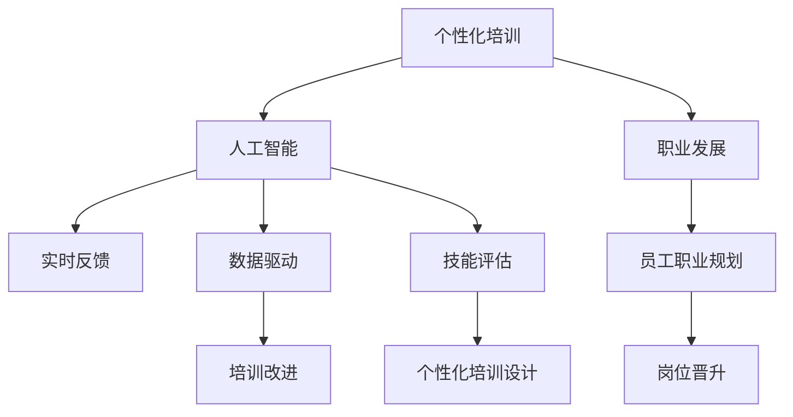

                 

# AI在个性化职场技能培训中的应用：促进职业发展

> 关键词：个性化培训,人工智能,职业发展,技能评估,实时反馈,内容推荐,数据驱动,技能提升

## 1. 背景介绍

### 1.1 问题由来

随着知识经济时代的到来，职业技能的更新换代速度不断加快，企业对员工的综合素质和技能水平提出了更高的要求。传统的大班式培训方法往往缺乏针对性，无法有效提升受训者的个性化技能水平。而人工智能技术的崛起，为解决这一问题提供了新的解决思路。

AI技术可以通过大数据分析、深度学习等手段，精准识别员工的需求和短板，提供个性化的培训建议和内容，从而大幅度提升培训效果。通过实时反馈和持续学习，AI还可以帮助员工跟踪学习进度，及时调整学习策略，最终达到最佳的职业发展效果。

### 1.2 问题核心关键点

AI在个性化职场技能培训中发挥关键作用的核心关键点包括：

- **个性化培训**：通过大数据分析和机器学习算法，为每位员工定制个性化的培训计划，针对性地提升其关键技能。
- **实时反馈**：通过实时监控和分析员工的培训表现，提供及时的反馈和建议，帮助员工快速调整学习策略。
- **数据驱动**：基于大量的培训数据，通过模型预测和分析，精准把握员工的学习需求和效果，指导培训设计和改进。
- **技能提升**：借助AI技术，科学评估员工的技能水平，提供定制化的技能提升方案，使其在职业道路上保持竞争力。

这些关键点共同构成了AI在个性化职场技能培训中的核心框架，使得AI能够更加高效、精准地满足员工的学习需求，促进职业发展。

### 1.3 问题研究意义

AI在个性化职场技能培训中的应用，对于提升员工技能、推动企业发展具有重要意义：

1. **提升员工技能**：通过定制化的培训计划和实时反馈，员工可以更有效地掌握关键技能，适应快速变化的工作环境。
2. **推动企业发展**：高素质的员工队伍能够更好地应对市场竞争，推动企业持续创新和增长。
3. **降低培训成本**：个性化培训避免了资源浪费，提高了培训效率，降低了企业的培训成本。
4. **增强学习效果**：实时反馈和持续学习机制，可以显著提升员工的学习动力和效果。
5. **支持职业规划**：AI可以科学评估员工的发展潜力，指导其进行职业规划，提升职业满意度。

通过深入研究和应用AI技术，个性化职场技能培训将成为推动职业发展和企业成长的重要手段。

## 2. 核心概念与联系

### 2.1 核心概念概述

为更好地理解AI在个性化职场技能培训中的应用，本节将介绍几个密切相关的核心概念：

- **个性化培训**：根据员工的需求和特点，量身定制的培训计划，强调针对性和有效性。
- **人工智能**：通过算法和模型，自动分析和处理数据，提供精准的决策和建议。
- **职业发展**：员工在职业生涯中的成长和进步，包括技能提升、职位晋升等方面。
- **实时反馈**：在培训过程中，及时获取员工的学习反馈和表现，指导其调整学习策略。
- **数据驱动**：基于大量数据和分析模型，提供科学的培训建议和决策依据。
- **技能评估**：通过多种方法，评估员工的技能水平和职业发展潜力，指导个性化培训设计。

这些核心概念之间的逻辑关系可以通过以下Mermaid流程图来展示：



这个流程图展示了个性化培训、AI、职业发展等核心概念之间的联系：

1. 个性化培训基于AI技术，通过数据驱动和技能评估，设计科学合理的培训方案。
2. AI利用实时反馈和数据驱动机制，优化个性化培训设计和过程。
3. 职业发展通过个性化培训和AI技术，持续提升员工技能和职业素质。

这些概念共同构成了AI在个性化职场技能培训中的理论框架，使得培训过程更加科学、高效。

## 3. 核心算法原理 & 具体操作步骤
### 3.1 算法原理概述

AI在个性化职场技能培训中的核心算法原理，可以概括为以下几个步骤：

1. **数据采集与预处理**：收集员工的学习数据、工作绩效、培训反馈等，进行清洗和预处理。
2. **技能评估**：通过模型分析员工的数据，评估其技能水平和职业发展潜力。
3. **个性化培训设计**：基于技能评估结果，设计定制化的培训计划和内容。
4. **实时反馈与监控**：在培训过程中，实时监控员工的学习状态，提供个性化的反馈和建议。
5. **持续学习与改进**：利用员工的学习数据和反馈，不断优化培训方案和改进AI模型。

这些步骤共同构成了AI在个性化职场技能培训中的基本流程，可以显著提升培训效果和职业发展效果。

### 3.2 算法步骤详解

#### 3.2.1 数据采集与预处理

在个性化培训中，首先需要收集大量的员工数据。这些数据包括：

- **学习数据**：员工的培训历史、课程学习进度、测试成绩等。
- **工作绩效数据**：员工的日常工作表现、项目完成情况、考核成绩等。
- **培训反馈数据**：员工对培训内容、讲师、形式的评价和反馈。

数据采集完成后，需要进行预处理，主要包括：

- **数据清洗**：去除噪声和异常值，确保数据的质量和一致性。
- **特征工程**：提取有意义的特征，如技能掌握度、学习倾向等，为后续分析提供支持。
- **数据标准化**：将数据转换为标准格式，便于模型处理和分析。

#### 3.2.2 技能评估

技能评估是AI在个性化培训中的关键步骤，主要通过以下几种方法进行：

- **在线测试**：设计针对性的在线测试题目，评估员工的技能水平和知识掌握情况。
- **自适应学习平台**：利用AI技术，动态调整学习内容和难度，实时评估员工的学习状态。
- **绩效分析**：结合工作绩效数据，评估员工在实际工作中的表现，了解其技能应用能力。
- **多维评估模型**：通过综合多维度的评估结果，科学地评估员工的技能水平和职业发展潜力。

#### 3.2.3 个性化培训设计

基于技能评估结果，设计个性化的培训计划，主要包括：

- **定制化课程**：根据员工的技能短板和职业发展需求，推荐适合的培训课程和学习内容。
- **学习路径规划**：制定科学的培训路径，明确员工的阶段性学习目标和任务。
- **学习资源推荐**：利用AI技术，推荐最适合的学习资源，如在线课程、教学视频等。
- **学习时间管理**：合理安排学习时间，确保员工能够在有限的时间内高效完成培训任务。

#### 3.2.4 实时反馈与监控

实时反馈和监控是AI在个性化培训中的重要环节，主要通过以下几种方式实现：

- **学习进度跟踪**：实时监控员工的学习进度，确保其按计划完成培训任务。
- **学习效果评估**：通过定期的测试和评估，及时了解员工的学习效果和掌握情况。
- **个性化反馈**：根据员工的学习表现和反馈，提供针对性的建议和改进方案。
- **行为分析**：利用AI技术，分析员工的学习行为和习惯，提供科学的改进建议。

#### 3.2.5 持续学习与改进

AI在个性化培训中的另一个重要方面是持续学习与改进，主要通过以下几种方式实现：

- **模型更新**：基于最新的员工数据和学习反馈，不断优化技能评估模型，提升评估准确性。
- **培训改进**：利用实时反馈和评估结果，动态调整培训计划和内容，确保培训效果。
- **技能提升**：结合员工的学习数据和反馈，设计科学的提升方案，指导员工持续提升技能。
- **职业发展指导**：通过技能评估和培训提升，科学指导员工的职业发展，帮助其实现职业目标。

### 3.3 算法优缺点

AI在个性化职场技能培训中的应用，具有以下优点：

- **高效精准**：通过大数据分析和机器学习算法，能够快速、准确地评估员工的技能水平和职业发展潜力。
- **个性化定制**：能够根据员工的需求和特点，量身定制个性化的培训计划，提高培训的针对性和有效性。
- **实时反馈**：通过实时监控和分析，及时调整学习策略，提高学习效果。
- **持续改进**：通过不断的学习与改进，优化培训方案和提升技能水平，确保培训效果。

同时，该方法也存在一定的局限性：

- **数据依赖**：个性化培训的效果很大程度上依赖于数据的质量和完整性，获取高质量数据的成本较高。
- **算法复杂度**：需要构建复杂的模型和算法，对数据处理和模型训练的要求较高。
- **技术门槛**：需要专业的AI开发人员和数据科学家，对技术能力提出了较高要求。
- **隐私保护**：处理员工数据时需要考虑隐私保护问题，确保数据安全。

尽管存在这些局限性，但AI在个性化职场技能培训中的应用前景广阔，将成为推动职业发展和企业成长的重要手段。

### 3.4 算法应用领域

AI在个性化职场技能培训中的应用，已经在诸多领域得到了广泛的应用，例如：

- **人力资源管理**：通过技能评估和培训设计，优化人力资源配置，提升员工素质和组织效能。
- **职业发展规划**：利用AI技术，帮助员工制定科学的职业规划，实现职业生涯的发展目标。
- **新员工入职培训**：基于技能评估和培训设计，为新员工提供个性化的入职培训方案，提升入职体验和适应能力。
- **中层管理培训**：通过个性化培训，提升中层管理者的综合素质和领导能力，推动企业组织变革。
- **员工技能提升**：利用AI技术，科学评估员工技能水平，提供个性化的提升方案，实现员工能力的全面提升。

除了上述这些经典应用外，AI在个性化职场技能培训中的应用还在不断拓展，如知识图谱、智能教学、自适应学习等，为员工职业发展提供了更多可能。

## 4. 数学模型和公式 & 详细讲解 & 举例说明
### 4.1 数学模型构建

本节将使用数学语言对AI在个性化职场技能培训中的应用过程进行更加严格的刻画。

设员工的技能水平为 $x \in [0,1]$，表示其在某项技能上的掌握程度。假设技能评估模型的输入特征向量为 $f \in \mathbb{R}^n$，其中 $n$ 为特征维度。则技能评估模型 $g(x)$ 可以表示为：

$$
g(x) = f^T \theta
$$

其中 $\theta$ 为技能评估模型的权重向量，$^T$ 表示矩阵转置。

在个性化培训中，技能评估模型的输出 $y$ 可以表示为员工的技能水平 $x$，即 $y = g(x)$。利用上述模型，可以科学地评估员工的技能水平，指导个性化培训的设计。

### 4.2 公式推导过程

以下我们以在线测试为例，推导技能评估模型的评估过程。

设在线测试的题目总数为 $m$，员工在每道题上的正确率为 $p_i$，其中 $i$ 表示题目编号。则员工的测试成绩 $s$ 可以表示为：

$$
s = \frac{1}{m} \sum_{i=1}^m p_i
$$

在个性化培训中，可以通过在线测试的方式，评估员工的技能水平。将员工的测试成绩 $s$ 作为技能评估模型的输入，模型输出即为员工的技能水平 $x$。具体公式为：

$$
x = g(s) = f^T \theta
$$

其中 $f = [s_1, s_2, \dots, s_m]^T$，$\theta$ 为模型参数。

### 4.3 案例分析与讲解

**案例：员工技能评估与个性化培训设计**

假设某公司需要对其员工进行编程技能的评估和培训。公司收集了员工过去五年的编程测试成绩，利用上述公式，设计了一个简单的技能评估模型。模型输入特征向量 $f$ 包含员工的测试成绩 $s$ 和其他相关特征，如工作年限、项目经验等。模型输出 $x$ 表示员工在编程技能上的掌握程度。

根据模型评估结果，公司为编程技能较低的员工设计了针对性的培训计划。例如，对于编程技能较低的员工，公司推荐其参加Python编程课程，同时设计了自适应学习平台，根据员工的学习进度和表现，动态调整学习内容和难度。

此外，公司还利用实时反馈机制，监控员工的学习进度，提供个性化的反馈和建议。通过持续学习和改进，模型不断优化，确保培训效果。

## 5. 项目实践：代码实例和详细解释说明
### 5.1 开发环境搭建

在进行AI在个性化职场技能培训中的应用实践前，我们需要准备好开发环境。以下是使用Python进行TensorFlow开发的環境配置流程：

1. 安装Anaconda：从官网下载并安装Anaconda，用于创建独立的Python环境。

2. 创建并激活虚拟环境：
```bash
conda create -n tf-env python=3.8 
conda activate tf-env
```

3. 安装TensorFlow：根据CUDA版本，从官网获取对应的安装命令。例如：
```bash
conda install tensorflow=2.7.0
```

4. 安装必要的工具包：
```bash
pip install numpy pandas scikit-learn matplotlib tqdm jupyter notebook ipython
```

完成上述步骤后，即可在`tf-env`环境中开始项目实践。

### 5.2 源代码详细实现

下面我们以员工技能评估为例，给出使用TensorFlow进行个性化培训的Python代码实现。

首先，定义员工技能评估的数据处理函数：

```python
import tensorflow as tf
from sklearn.model_selection import train_test_split
from sklearn.preprocessing import StandardScaler
from sklearn.metrics import mean_squared_error

def load_data():
    # 加载员工测试成绩数据
    data = pd.read_csv('employee_scores.csv')
    # 标准化数据
    scaler = StandardScaler()
    data['normalized_score'] = scaler.fit_transform(data[['score']])
    # 将数据分为训练集和测试集
    train, test = train_test_split(data, test_size=0.2, random_state=42)
    return train, test

# 加载数据
train_data, test_data = load_data()
```

然后，定义技能评估模型的参数和损失函数：

```python
def build_model(input_dim, output_dim):
    model = tf.keras.Sequential([
        tf.keras.layers.Dense(64, activation='relu', input_shape=(input_dim,)),
        tf.keras.layers.Dense(output_dim, activation='sigmoid')
    ])
    # 定义损失函数
    loss = tf.keras.losses.BinaryCrossentropy()
    return model, loss

# 定义模型
input_dim = train_data['normalized_score'].shape[1]
output_dim = 1
model, loss = build_model(input_dim, output_dim)
```

接着，定义训练和评估函数：

```python
def compile_model(model, loss):
    model.compile(optimizer='adam', loss=loss)

# 编译模型
compile_model(model, loss)

def train_model(model, train_data, epochs=100, batch_size=32):
    history = model.fit(train_data, epochs=epochs, batch_size=batch_size, validation_split=0.2)

# 训练模型
train_model(model, train_data)

def evaluate_model(model, test_data):
    # 计算预测结果与真实值之间的误差
    predictions = model.predict(test_data)
    mse = mean_squared_error(test_data['normalized_score'], predictions)
    return mse
```

最后，启动训练流程并在测试集上评估：

```python
mse = evaluate_model(model, test_data)
print(f'测试集上的MSE为: {mse:.4f}')
```

以上就是使用TensorFlow进行员工技能评估的完整代码实现。可以看到，TensorFlow提供了强大的API和工具，使得AI在个性化职场技能培训中的应用开发变得简洁高效。

### 5.3 代码解读与分析

让我们再详细解读一下关键代码的实现细节：

**load_data函数**：
- 加载员工测试成绩数据
- 标准化数据，确保不同特征具有相同的量级
- 将数据分为训练集和测试集，以便于后续模型的训练和评估

**build_model函数**：
- 定义模型的架构，包括两个全连接层
- 定义损失函数为二元交叉熵，适用于输出为0-1之间值的模型

**compile_model函数**：
- 编译模型，设置优化器和损失函数，准备训练

**train_model函数**：
- 使用模型的fit方法，训练模型，设置训练轮数和批次大小
- 使用验证集进行模型评估，输出训练过程中的损失和精度

**evaluate_model函数**：
- 使用模型的predict方法，计算模型对测试集的预测结果
- 使用sklearn的mean_squared_error函数，计算预测结果与真实值之间的均方误差

**主程序**：
- 调用上述函数，训练模型并在测试集上评估，输出模型的预测效果

可以看到，TensorFlow使得AI在个性化职场技能培训中的应用开发变得简单直观，开发人员可以更多地关注模型的设计和训练过程，而不必过多关注底层实现细节。

当然，工业级的系统实现还需考虑更多因素，如模型的保存和部署、超参数的自动搜索、更加灵活的任务适配层等。但核心的培训过程的实现流程基本与此类似。

## 6. 实际应用场景
### 6.1 人力资源管理

AI在个性化职场技能培训中，可以广泛应用于人力资源管理，具体场景包括：

- **招聘评估**：利用技能评估模型，对求职者的技能水平进行科学评估，筛选出合适的候选人。
- **员工绩效管理**：通过持续的技能评估和培训反馈，监控员工绩效，提升组织效能。
- **员工发展计划**：基于技能评估结果，制定科学的员工发展计划，推动员工职业成长。
- **人才储备与培养**：通过技能评估和培训设计，科学规划人才储备和培养计划，提升企业的核心竞争力。

通过AI技术的应用，人力资源管理可以更加高效、精准地管理人才，提升员工素质和企业绩效。

### 6.2 职业发展规划

AI在个性化职场技能培训中，可以显著提升职业发展规划的效果，具体场景包括：

- **职业路径规划**：利用技能评估模型，分析员工的技能水平和职业倾向，科学规划职业路径。
- **能力提升建议**：通过个性化培训设计，提供定制化的能力提升方案，帮助员工实现职业目标。
- **职业发展跟踪**：利用实时反馈和持续学习机制，跟踪员工职业发展进程，及时调整发展策略。
- **职业转换指导**：结合员工的兴趣和技能评估结果，指导其进行职业转换，实现职业多元化。

通过AI技术的应用，员工可以更加科学地规划自己的职业发展，提升职业满意度和工作动力。

### 6.3 新员工入职培训

AI在个性化职场技能培训中，可以显著提升新员工的入职体验和适应能力，具体场景包括：

- **入职测试**：利用在线测试和技能评估，评估新员工的初始技能水平，制定个性化入职培训计划。
- **入职培训**：基于个性化培训设计，推荐适合的入职培训课程和资源，帮助新员工快速适应新环境。
- **入职反馈**：利用实时反馈机制，监控新员工的学习进度和表现，提供个性化的反馈和建议。
- **入职评估**：通过持续的技能评估和培训反馈，评估新员工的学习效果和适应情况，指导后续培训改进。

通过AI技术的应用，新员工可以更加高效地完成入职培训，快速适应新岗位，提升工作效率。

### 6.4 中层管理培训

AI在个性化职场技能培训中，可以显著提升中层管理者的综合素质和领导能力，具体场景包括：

- **领导力评估**：利用技能评估模型，科学评估中层管理者的领导力水平，指导个性化培训设计。
- **领导力培训**：基于个性化培训设计，推荐适合的领导力培训课程和资源，提升中层管理者的领导能力。
- **领导力反馈**：利用实时反馈机制，监控中层管理者的培训表现，提供个性化的反馈和建议。
- **领导力改进**：通过持续的技能评估和培训反馈，优化领导力培训方案，提升中层管理者的领导效果。

通过AI技术的应用，中层管理者可以更加科学地提升自身的综合素质和领导能力，推动企业的组织变革和创新发展。

### 6.5 员工技能提升

AI在个性化职场技能培训中，可以显著提升员工的技能水平和职业素质，具体场景包括：

- **技能评估**：利用技能评估模型，科学评估员工的技能水平，指导个性化培训设计。
- **技能提升**：基于个性化培训设计，推荐适合的培训课程和资源，提升员工的技能水平。
- **技能反馈**：利用实时反馈机制，监控员工的学习进度和表现，提供个性化的反馈和建议。
- **技能改进**：通过持续的技能评估和培训反馈，优化技能提升方案，提升员工的技能效果。

通过AI技术的应用，员工可以更加高效地提升自身的技能水平，保持职业竞争力，提升工作满意度和职业成就感。

## 7. 工具和资源推荐
### 7.1 学习资源推荐

为了帮助开发者系统掌握AI在个性化职场技能培训中的应用理论基础和实践技巧，这里推荐一些优质的学习资源：

1. TensorFlow官方文档：提供全面的API和工具支持，是TensorFlow应用开发的重要参考。
2. Coursera《深度学习专项课程》：由斯坦福大学教授讲解，系统介绍深度学习理论和实践。
3. Udacity《人工智能基础》课程：涵盖AI基础知识和前沿技术，适合初学者入门。
4. Kaggle机器学习竞赛：参与实际的数据分析和机器学习项目，提升实战能力。
5. GitHub AI项目：浏览和学习开源AI项目，了解最新的技术应用和实践。

通过对这些资源的学习实践，相信你一定能够快速掌握AI在个性化职场技能培训中的应用精髓，并用于解决实际的职业发展问题。

### 7.2 开发工具推荐

高效的开发离不开优秀的工具支持。以下是几款用于AI在个性化职场技能培训中的应用开发的常用工具：

1. TensorFlow：基于Python的开源深度学习框架，灵活动态的计算图，适合快速迭代研究。TensorFlow提供了丰富的预训练模型和工具包，支持个性化培训的开发。

2. PyTorch：基于Python的开源深度学习框架，提供动态计算图和高效开发环境，适用于研究型项目。

3. Jupyter Notebook：轻量级的开发环境，支持Python、R等编程语言，便于快速编写和测试代码。

4. Weights & Biases：模型训练的实验跟踪工具，可以记录和可视化模型训练过程中的各项指标，方便对比和调优。与TensorFlow、PyTorch等主流深度学习框架无缝集成。

5. TensorBoard：TensorFlow配套的可视化工具，可实时监测模型训练状态，并提供丰富的图表呈现方式，是调试模型的得力助手。

6. Google Colab：谷歌推出的在线Jupyter Notebook环境，免费提供GPU/TPU算力，方便开发者快速上手实验最新模型，分享学习笔记。

合理利用这些工具，可以显著提升AI在个性化职场技能培训中的开发效率，加快创新迭代的步伐。

### 7.3 相关论文推荐

AI在个性化职场技能培训中的应用研究源于学界的持续研究。以下是几篇奠基性的相关论文，推荐阅读：

1. Machine Learning for Human Resource Management: A Survey and Taxonomy：概述了机器学习在人力资源管理中的应用，包括技能评估、培训设计等。

2. Personalized Learning Systems: A Review and Roadmap for Future Research：综述了个性化学习系统的发展历程和最新进展，为AI在个性化培训中的应用提供了理论支持。

3. Adaptive Learning in E-Learning Environments：介绍了一种基于自适应学习模型的个性化培训系统，可以自动调整学习内容和难度。

4. A Survey on Online Testing for Personalized Learning：综述了在线测试在个性化培训中的应用，探讨了评估员工技能水平的方法和策略。

5. Deep Learning for Smart Human Resource Management：介绍了深度学习在人力资源管理中的应用，包括技能评估、培训设计等。

这些论文代表了大语言模型微调技术的发展脉络。通过学习这些前沿成果，可以帮助研究者把握学科前进方向，激发更多的创新灵感。

## 8. 总结：未来发展趋势与挑战
### 8.1 总结

本文对AI在个性化职场技能培训中的应用进行了全面系统的介绍。首先阐述了个性化培训、AI和职业发展等核心概念，明确了AI在个性化培训中的关键作用。其次，从原理到实践，详细讲解了个性化培训的数学模型和操作步骤，给出了代码实例和详细解释说明。同时，本文还广泛探讨了AI在人力资源管理、职业发展规划、新员工入职培训等多个领域的应用前景，展示了AI技术在个性化培训中的广阔应用场景。最后，本文精选了AI在个性化培训中的学习资源、开发工具和相关论文，力求为读者提供全方位的技术指引。

通过本文的系统梳理，可以看到，AI在个性化职场技能培训中的应用已经成为推动职业发展和企业成长的重要手段。AI技术通过大数据分析和深度学习算法，能够科学评估员工的技能水平，量身定制个性化的培训计划，显著提升培训效果和职业发展效果。未来，随着AI技术的不断进步，个性化培训将更加智能、高效，推动职场技能培训进入新的发展阶段。

### 8.2 未来发展趋势

展望未来，AI在个性化职场技能培训中的应用将呈现以下几个发展趋势：

1. **模型复杂度提升**：随着深度学习技术的发展，技能评估和培训设计模型将更加复杂和精细，能够更好地捕捉员工的多维特征和动态变化。
2. **多模态融合**：结合视觉、语音、文本等多模态数据，全面评估员工的技能水平和职业发展潜力。
3. **实时性增强**：通过实时反馈和持续学习机制，进一步提升培训的灵活性和实效性。
4. **数据驱动决策**：利用大数据分析和机器学习算法，科学指导培训设计和改进，优化培训效果。
5. **个性化推荐**：利用推荐系统技术，精准推荐培训资源和课程，提高员工的学习效率。

这些趋势将进一步推动AI在个性化职场技能培训中的应用，使其在职场发展中发挥更加重要的作用。

### 8.3 面临的挑战

尽管AI在个性化职场技能培训中的应用前景广阔，但在迈向更加智能化、普适化应用的过程中，它仍面临诸多挑战：

1. **数据隐私保护**：处理员工数据时需要考虑隐私保护问题，确保数据安全。
2. **模型复杂度**：复杂模型需要更多的计算资源和数据支持，可能存在过拟合风险。
3. **技术门槛**：需要专业的AI开发人员和数据科学家，对技术能力提出了较高要求。
4. **模型鲁棒性**：模型在面对未知数据和异常情况时，可能出现泛化能力不足的问题。
5. **用户接受度**：员工对AI技术的接受度和使用意愿，可能影响培训效果。

尽管存在这些挑战，但随着AI技术的不断进步和应用实践的积累，这些问题终将逐步得到解决。AI在个性化职场技能培训中的应用将更加成熟和广泛，为职业发展和企业成长提供强有力的支持。

### 8.4 研究展望

面对AI在个性化职场技能培训中面临的挑战，未来的研究需要在以下几个方面寻求新的突破：

1. **数据隐私保护**：研究如何在数据采集和使用过程中，确保员工的隐私权益，构建安全的培训系统。
2. **模型鲁棒性**：开发更加鲁棒的AI模型，增强其在未知数据和异常情况下的泛化能力。
3. **技术普及**：推广AI技术的普及应用，提升企业和员工的接受度和使用意愿。
4. **模型解释性**：提高AI模型的可解释性，增强员工对培训效果的信任和满意度。
5. **跨领域应用**：将AI技术应用于更多行业和领域，拓展其应用范围和影响深度。

这些研究方向将引领AI在个性化职场技能培训中的应用进入新的发展阶段，为构建高效、智能、安全的职场培训系统提供新的动力。面向未来，AI在个性化培训中的应用将更加广泛和深入，成为推动职业发展和企业成长的重要手段。

## 9. 附录：常见问题与解答

**Q1：AI在个性化培训中的优势和局限性是什么？**

A: AI在个性化培训中的优势主要体现在以下方面：

- **高效精准**：通过大数据分析和深度学习算法，能够快速、准确地评估员工的技能水平和职业发展潜力。
- **个性化定制**：能够根据员工的需求和特点，量身定制个性化的培训计划，提高培训的针对性和有效性。
- **实时反馈**：通过实时监控和分析，及时调整学习策略，提高学习效果。
- **持续改进**：通过不断的学习与改进，优化培训方案和提升技能水平，确保培训效果。

同时，AI在个性化培训中也存在一定的局限性：

- **数据依赖**：个性化培训的效果很大程度上依赖于数据的质量和完整性，获取高质量数据的成本较高。
- **算法复杂度**：需要构建复杂的模型和算法，对数据处理和模型训练的要求较高。
- **技术门槛**：需要专业的AI开发人员和数据科学家，对技术能力提出了较高要求。
- **隐私保护**：处理员工数据时需要考虑隐私保护问题，确保数据安全。

尽管存在这些局限性，但AI在个性化培训中的应用前景广阔，将成为推动职业发展和企业成长的重要手段。

**Q2：如何设计科学的个性化培训方案？**

A: 设计科学的个性化培训方案，需要考虑以下几个关键因素：

1. **技能评估**：通过在线测试、自适应学习平台等方式，科学评估员工的技能水平和职业发展潜力。
2. **个性化课程设计**：根据员工的技能短板和职业发展需求，推荐适合的培训课程和学习内容。
3. **学习路径规划**：制定科学的培训路径，明确员工的阶段性学习目标和任务。
4. **学习资源推荐**：利用AI技术，推荐最适合的学习资源，如在线课程、教学视频等。
5. **学习时间管理**：合理安排学习时间，确保员工能够在有限的时间内高效完成培训任务。

在具体实践中，可以采用数据驱动和机器学习的方法，设计科学的培训方案，提高培训效果和员工满意度。

**Q3：AI在个性化培训中的实际应用效果如何？**

A: AI在个性化培训中的实际应用效果显著，主要体现在以下几个方面：

1. **提升培训效果**：通过个性化培训设计，员工能够更加高效地掌握关键技能，适应快速变化的工作环境。
2. **提高学习效率**：实时反馈和持续学习机制，可以显著提升员工的学习动力和效果。
3. **支持职业发展**：AI可以科学评估员工的技能水平和职业发展潜力，指导其进行职业规划，实现职业目标。
4. **降低培训成本**：个性化培训避免了资源浪费，提高了培训效率，降低了企业的培训成本。

通过实际应用，AI在个性化培训中已经取得了显著的效果，成为推动职业发展和企业成长的重要手段。

**Q4：AI在个性化培训中面临的主要技术挑战有哪些？**

A: AI在个性化培训中面临的主要技术挑战包括：

1. **数据隐私保护**：处理员工数据时需要考虑隐私保护问题，确保数据安全。
2. **模型复杂度**：复杂模型需要更多的计算资源和数据支持，可能存在过拟合风险。
3. **技术门槛**：需要专业的AI开发人员和数据科学家，对技术能力提出了较高要求。
4. **模型鲁棒性**：模型在面对未知数据和异常情况时，可能出现泛化能力不足的问题。
5. **用户接受度**：员工对AI技术的接受度和使用意愿，可能影响培训效果。

尽管存在这些挑战，但随着AI技术的不断进步和应用实践的积累，这些问题终将逐步得到解决。AI在个性化培训中的应用将更加成熟和广泛，为职业发展和企业成长提供强有力的支持。

**Q5：如何评估AI在个性化培训中的效果？**

A: 评估AI在个性化培训中的效果，需要考虑以下几个关键指标：

1. **技能提升**：通过科学的技能评估模型，评估员工在培训前后的技能水平提升情况。
2. **学习效果**：利用实时反馈机制，监控员工的学习进度和表现，评估培训效果。
3. **用户满意度**：通过问卷调查等方式，了解员工对培训内容和形式的满意度。
4. **业务成果**：通过员工绩效数据和项目完成情况，评估培训对业务成果的影响。

在具体实践中，可以采用多维度的评估指标，全面衡量AI在个性化培训中的效果和价值。

---

作者：禅与计算机程序设计艺术 / Zen and the Art of Computer Programming

