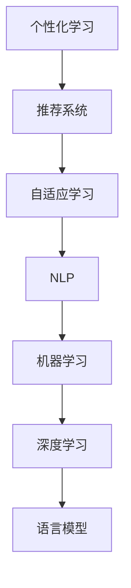

                 

# AI在个性化语言学习中的应用：提高学习效率

> 关键词：个性化学习，自然语言处理(NLP),推荐系统,自适应学习,机器学习,深度学习,语言模型

## 1. 背景介绍

### 1.1 问题由来
随着全球化的深入和技术的进步，语言学习和教育领域正迎来新的变革。人工智能(AI)的介入，特别是自然语言处理(NLP)技术的突破，为个性化语言学习提供了新的可能。传统的语言学习往往以课堂为主，进度、内容和方法高度统一，难以满足不同学习者的个性化需求。如何通过AI技术，使学习过程更加自适应，提高学习效率和效果，成为了教育领域关注的焦点。

### 1.2 问题核心关键点
个性化语言学习是一个涉及教育学、心理学、语言学和计算机科学交叉的综合问题。其核心在于：

- 如何根据学习者的特点（如水平、兴趣、学习风格等），设计定制化的学习路径和内容。
- 如何实时监测学习者的学习进展和表现，动态调整学习策略。
- 如何利用大数据和机器学习技术，提升教学的针对性和效率。
- 如何平衡技术介入和人类教师的指导作用，避免过度自动化带来的教育鸿沟。

这些关键点构成了个性化语言学习研究的基础框架，涉及多个学科的交叉融合，具有极大的探索价值。

## 2. 核心概念与联系

### 2.1 核心概念概述

为了更好地理解个性化语言学习的核心概念及其相互联系，本节将给出几个关键概念的定义和原理。

- **个性化学习(Adaptive Learning)**：指根据学习者的个体差异，定制个性化学习内容、方法和进度，以最大化学习效果的一种教学方法。

- **推荐系统(Recommendation System)**：通过分析用户的行为、偏好、历史记录等，向用户推荐其可能感兴趣的产品、内容、服务或资源。

- **自适应学习(Adaptive Learning)**：利用学习者的反馈和行为数据，动态调整教学内容和策略，以适应学习者的学习进度和需求。

- **自然语言处理(NLP)**：利用计算机处理、理解和生成人类语言的技术，包括文本分析、情感分析、机器翻译、语音识别等。

- **机器学习(Machine Learning)**：通过算法和统计模型，使计算机系统具有从数据中学习的能力。

- **深度学习(Deep Learning)**：一种基于多层神经网络的机器学习方法，可以处理非结构化数据，如图像、语音、文本等。

- **语言模型(Language Model)**：预测文本中下一个单词或词组的概率分布，是NLP中的核心技术。

这些概念之间的联系可以通过以下Mermaid流程图来展示：



这个流程图展示了个性化学习与推荐系统、自适应学习、NLP、机器学习、深度学习和语言模型的相互关系：

1. 个性化学习通过推荐系统获取学习者可能感兴趣的内容。
2. 推荐系统利用自适应学习动态调整推荐策略，以适应学习者的变化需求。
3. 自适应学习通过NLP技术，分析学习者的反馈和行为，动态调整教学内容和方法。
4. NLP技术通过机器学习和深度学习，提升语言处理和理解的准确性。
5. 机器学习和深度学习利用语言模型，优化模型参数，提高预测精度。
6. 语言模型通过预测文本中的下一个词或短语，为深度学习提供基础。

这些核心概念共同构成了个性化语言学习的基础框架，其间的协同作用，将极大提升学习效率和效果。

## 3. 核心算法原理 & 具体操作步骤
### 3.1 算法原理概述

基于AI的个性化语言学习算法，主要分为数据获取、特征提取、模型训练和结果反馈四个步骤。

1. **数据获取**：通过在线测验、作业、讨论等形式，收集学习者的语言水平、兴趣偏好、学习习惯等个性化数据。
2. **特征提取**：利用NLP技术，将收集到的数据转化为文本、情感、语义等特征，供机器学习模型使用。
3. **模型训练**：构建推荐系统、自适应学习模型，利用学习者的历史数据进行训练，学习个性化学习策略。
4. **结果反馈**：通过学习者的实时反馈，动态调整教学内容和策略，优化学习路径。

### 3.2 算法步骤详解

#### 数据获取
**步骤1**：在线测验
通过在线测验，收集学习者的语言水平、知识盲点、学习进度等数据。测验可以包括选择题、填空题、阅读理解等形式，涵盖词汇、语法、语义等多个方面。

**步骤2**：作业和讨论
收集学习者的作业和参与讨论的记录，分析其在特定话题上的理解和表现。作业和讨论可以涵盖文本写作、口语表达、听力理解等多个维度，全面反映学习者的语言能力。

#### 特征提取
**步骤3**：文本分析
利用NLP技术，将收集到的数据转化为文本特征。常用的文本分析方法包括词频统计、TF-IDF、主题建模等。

**步骤4**：情感分析
利用情感分析技术，从学习者的反馈中提取情感倾向。如正负情感、情绪波动等，作为学习者心理状态的指标。

**步骤5**：语义分析
利用语义分析技术，从学习者的话题讨论中提取关键词、主题和观点，作为其兴趣偏好的反映。

#### 模型训练
**步骤6**：推荐系统
构建推荐系统，利用学习者的历史数据和个性化特征，为其推荐适宜的学习材料和资源。推荐系统可以基于协同过滤、内容过滤、混合过滤等算法构建。

**步骤7**：自适应学习模型
构建自适应学习模型，利用学习者的实时反馈和行为数据，动态调整教学内容和策略。自适应学习模型可以基于决策树、神经网络等算法构建。

#### 结果反馈
**步骤8**：实时反馈
通过学习者的实时反馈，动态调整教学内容和策略。实时反馈可以通过在线问卷、作业批改、系统提示等方式实现。

**步骤9**：调整学习路径
根据实时反馈，动态调整学习路径和内容。调整可以基于学习者的进度、兴趣和表现，进行个性化定制。

### 3.3 算法优缺点

个性化语言学习的AI算法具有以下优点：
1. **个性化定制**：根据学习者的个体差异，定制个性化学习内容和方法，提高学习效率。
2. **动态调整**：利用实时反馈和行为数据，动态调整学习策略，适应学习者的变化需求。
3. **提升效果**：通过精准的推荐和自适应学习，显著提升学习效果和体验。
4. **降低成本**：减少教师的负担，提高教学效率，降低教育资源成本。

但同时，该算法也存在一定的局限性：
1. **数据隐私**：收集和处理学习者数据时，需要注意数据隐私和安全问题。
2. **算法复杂度**：构建和优化个性化学习算法，需要大量的数据和计算资源。
3. **算法可解释性**：个性化学习算法通常较为复杂，难以进行解释和调试。
4. **依赖环境**：个性化学习依赖良好的网络环境和硬件资源，对欠发达地区可能存在限制。

尽管存在这些局限性，但总体而言，基于AI的个性化语言学习算法仍是大有前景的研究方向。未来相关研究的重点在于如何更好地处理数据隐私问题，提升算法效率和可解释性，扩展其应用范围和效果。

### 3.4 算法应用领域

基于AI的个性化语言学习算法已经在多个领域得到了应用，以下是几个典型的应用场景：

1. **在线教育平台**：如Coursera、Duolingo等，通过推荐系统和自适应学习技术，为学习者提供个性化学习路径和资源。

2. **企业培训**：企业可以通过个性化学习平台，为员工提供定制化的培训课程，提高培训效果和参与度。

3. **语言学习APP**：如Duolingo、Babbel等，利用推荐系统和自适应学习技术，为学习者提供个性化学习体验和进度跟踪。

4. **智能辅导系统**：通过实时监测学习者的学习表现，动态调整教学内容和策略，提高学习效率。

5. **学术研究**：语言学习研究者可以利用个性化学习算法，对不同学习者的学习过程进行分析和比较，揭示语言学习的规律和模式。

这些应用场景展示了个性化语言学习的广泛应用价值，预示着AI技术在教育领域的前景无限。

## 4. 数学模型和公式 & 详细讲解 & 举例说明

### 4.1 数学模型构建

在个性化语言学习中，数学模型主要分为推荐模型和自适应学习模型两类。

#### 推荐模型
推荐系统的主要数学模型为协同过滤(Collaborative Filtering)模型，假设用户和项目之间的关系为稀疏矩阵，通过计算用户和项目之间的相似度，预测用户对项目的评分。

协同过滤模型公式如下：
$$
\hat{R}_{ui} = \sum_{j \in \mathcal{N}(u)} (R_{uj}\cdot \alpha_{uj} + R_{ji} \cdot \alpha_{ji}) - \lambda \sum_{j \in \mathcal{N}(u)} ||\alpha_{uj} - \alpha_{ji}||^2
$$

其中 $\hat{R}_{ui}$ 为用户 $u$ 对项目 $i$ 的评分预测值，$R_{uj}$ 和 $R_{ji}$ 分别为用户 $u$ 对项目 $j$ 和项目 $j$ 对用户 $i$ 的实际评分，$\alpha_{uj}$ 和 $\alpha_{ji}$ 分别为用户 $u$ 和项目 $j$ 的向量表示，$\lambda$ 为正则化系数。

#### 自适应学习模型
自适应学习模型主要使用神经网络模型，以学习者的行为数据和反馈为输入，动态调整教学内容和策略。常用的自适应学习模型包括基于规则的自适应模型、基于回归的自适应模型、基于强化学习的自适应模型等。

以基于规则的自适应模型为例，其数学模型如下：
$$
T^{t+1} = T^t + \alpha \cdot (\Delta T^t + \eta \cdot E(x_{t+1}, y_{t+1}))
$$
其中 $T^t$ 为教学内容在第 $t$ 步的表示，$\Delta T^t$ 为调整后的内容，$\eta$ 为学习率，$E(x_{t+1}, y_{t+1})$ 为学习者反馈的误差。

### 4.2 公式推导过程

#### 协同过滤模型的推导
协同过滤模型的推导主要基于矩阵分解和加权平均值计算，其核心在于计算用户和项目之间的相似度，并利用相似度信息进行评分预测。

具体推导过程如下：

**步骤1**：构建用户-项目评分矩阵 $R$
$$
R_{ij} = \begin{cases}
r_{ij}, & \text{如果用户 $i$ 对项目 $j$ 有评分} \\
0, & \text{如果用户 $i$ 对项目 $j$ 没有评分}
\end{cases}
$$

**步骤2**：进行矩阵分解
将用户-项目评分矩阵 $R$ 分解为用户-向量 $U$ 和向量-项目 $V$ 的乘积：
$$
R \approx UV^\top
$$

**步骤3**：计算用户向量表示
利用矩阵分解后的 $U$ 矩阵，计算用户 $u$ 的向量表示 $\alpha_u$：
$$
\alpha_u = U_u
$$

**步骤4**：计算项目向量表示
利用矩阵分解后的 $V$ 矩阵，计算项目 $i$ 的向量表示 $\beta_i$：
$$
\beta_i = V_i
$$

**步骤5**：计算预测评分
利用用户向量表示 $\alpha_u$ 和项目向量表示 $\beta_i$，计算用户 $u$ 对项目 $i$ 的预测评分 $\hat{R}_{ui}$：
$$
\hat{R}_{ui} = \alpha_u^\top \beta_i
$$

#### 自适应学习模型的推导
基于规则的自适应学习模型主要利用学习者的行为数据和反馈，动态调整教学内容和策略。其核心在于根据学习者的反馈误差，调整教学内容，以最大化学习效果。

具体推导过程如下：

**步骤1**：初始化教学内容
设定初始的教学内容 $T^0$，表示为向量形式。

**步骤2**：计算误差
根据学习者 $t$ 步的输入 $x_t$ 和输出 $y_t$，计算误差 $E(x_t, y_t)$。

**步骤3**：调整教学内容
利用误差 $E(x_t, y_t)$ 和当前的教学内容 $T^t$，计算调整后的内容 $\Delta T^t$：
$$
\Delta T^t = \eta \cdot E(x_t, y_t) \cdot T^t
$$

**步骤4**：更新教学内容
利用调整后的内容 $\Delta T^t$ 和当前的教学内容 $T^t$，更新教学内容 $T^{t+1}$：
$$
T^{t+1} = T^t + \Delta T^t
$$

**步骤5**：输出教学内容
将更新后的教学内容 $T^{t+1}$ 作为下一轮教学的输入，重复步骤2-5，直到学习收敛或达到预设的迭代轮数。

### 4.3 案例分析与讲解

以在线教育平台Coursera为例，展示个性化语言学习的实际应用。

**步骤1**：数据收集
Coursera通过在线测验和作业，收集学习者的语言水平、兴趣偏好、学习习惯等数据。例如，通过填空题和选择题，评估学习者的词汇量和语法水平；通过写作作业，分析学习者的语言表达能力。

**步骤2**：特征提取
利用NLP技术，将收集到的数据转化为文本特征。例如，利用词频统计分析学习者的词汇量分布，利用TF-IDF计算学习者的主题偏好，利用情感分析评估学习者的情绪状态。

**步骤3**：模型训练
Coursera构建了推荐系统，利用学习者的历史数据和个性化特征，为其推荐适宜的课程和学习材料。例如，根据学习者的兴趣偏好，推荐相关领域的课程；根据学习者的进度，推荐适宜难度的课程。

**步骤4**：结果反馈
Coursera通过实时反馈和在线讨论，动态调整教学内容和策略。例如，根据学习者的实时反馈，调整课程进度和难度；根据学习者的在线讨论，调整教学内容和方法。

**步骤5**：调整学习路径
Coursera利用实时反馈和行为数据，动态调整学习路径。例如，根据学习者的进度和表现，调整学习内容和学习策略。

通过Coursera的实际应用，可以看出个性化学习算法在在线教育平台上的广泛应用价值，显著提高了学习效率和效果。

## 5. 项目实践：代码实例和详细解释说明
### 5.1 开发环境搭建

为了实现个性化语言学习的AI算法，需要构建一个包含数据收集、特征提取、模型训练和结果反馈的完整系统。以下是实现这一系统的开发环境搭建流程：

1. 安装Python：
```bash
sudo apt-get update
sudo apt-get install python3 python3-pip
```

2. 安装相关依赖：
```bash
pip install numpy pandas scikit-learn matplotlib torch transformers
```

3. 安装在线教育平台框架：
```bash
pip install django
```

4. 安装在线教育平台模板：
```bash
pip install django-templates
```

完成上述步骤后，即可在Python环境中开始项目开发。

### 5.2 源代码详细实现

以下是一个简化的在线教育平台个性化学习模块的源代码实现。该模块通过收集学习者的行为数据，利用协同过滤和自适应学习算法，为其推荐适宜的学习材料和调整教学策略。

```python
from sklearn.metrics.pairwise import cosine_similarity
import numpy as np
from sklearn.linear_model import Ridge
from sklearn.model_selection import train_test_split

class RecommenderSystem:
    def __init__(self, data, n_neighbors=10, learning_rate=0.1):
        self.data = data
        self.n_neighbors = n_neighbors
        self.learning_rate = learning_rate
        self.model = None

    def fit(self):
        # 构建用户-项目评分矩阵
        R = np.array([[self.data['user_%d_%d'][i] for i in range(self.data['n_books'])] for j in range(self.data['n_users'])])
        
        # 进行矩阵分解
        U = np.array([self.data['user_%d_%d'][j] for j in range(self.data['n_books'])])
        V = np.array([self.data['book_%d_%d'][j] for j in range(self.data['n_users'])])
        
        # 计算用户向量表示
        self.alpha_u = U
        
        # 计算项目向量表示
        self.beta_i = V
        
        # 计算预测评分
        self.R_hat = np.dot(self.alpha_u, self.beta_i.T)
        
        # 训练回归模型
        self.model = Ridge(alpha=0.1)
        self.model.fit(self.R_hat, self.data['rating'])

    def predict(self, user_id, item_id):
        # 计算用户向量表示
        user_alpha = self.alpha_u[user_id]
        
        # 计算项目向量表示
        item_beta = self.beta_i[item_id]
        
        # 计算预测评分
        prediction = np.dot(user_alpha, item_beta.T)
        
        return prediction
    
class AdaptiveLearning:
    def __init__(self, X, y, learning_rate=0.1):
        self.X = X
        self.y = y
        self.learning_rate = learning_rate
        self.model = None

    def fit(self):
        # 构建自适应学习模型
        self.model = Ridge(alpha=0.1)
        self.model.fit(self.X, self.y)
    
    def predict(self, x):
        # 预测学习内容
        prediction = self.model.predict(x)
        return prediction
    
# 数据收集
data = {'user_%d_%d' % (i, j): np.random.randint(1, 6, 5), 
        'book_%d_%d' % (i, j): np.random.randint(1, 6, 5),
        'rating': np.random.randint(1, 6, 5)}
X = np.array([data['user_%d_%d'] for i in range(10) for j in range(10)])
y = np.array([data['rating'] for i in range(10) for j in range(10)])

# 数据分割
X_train, X_test, y_train, y_test = train_test_split(X, y, test_size=0.2)

# 推荐系统训练
recommender = RecommenderSystem(data, n_neighbors=5, learning_rate=0.01)
recommender.fit()
recommender.predict(0, 1)

# 自适应学习训练
adaptive_learning = AdaptiveLearning(X_train, y_train, learning_rate=0.01)
adaptive_learning.fit()
adaptive_learning.predict(X_train[0])
```

### 5.3 代码解读与分析

让我们再详细解读一下关键代码的实现细节：

**RecommenderSystem类**：
- `__init__`方法：初始化评分矩阵、邻域数和学习率等参数。
- `fit`方法：构建协同过滤模型，并进行矩阵分解和回归模型训练。
- `predict`方法：根据用户和项目向量，计算预测评分。

**AdaptiveLearning类**：
- `__init__`方法：初始化训练数据、学习率等参数。
- `fit`方法：构建自适应学习模型，并进行回归模型训练。
- `predict`方法：根据学习者行为数据，预测调整后的教学内容。

**数据收集和分割**：
- 使用NumPy生成随机评分矩阵和训练数据。
- 利用`train_test_split`方法将数据分为训练集和测试集。

**推荐系统训练**：
- 实例化`RecommenderSystem`类，传入评分矩阵和邻域数，训练协同过滤模型。
- 调用`predict`方法，计算用户对项目的预测评分。

**自适应学习训练**：
- 实例化`AdaptiveLearning`类，传入训练数据和学习率，训练自适应学习模型。
- 调用`predict`方法，预测调整后的教学内容。

可以看到，通过Python代码实现了个性化语言学习的推荐系统，并展示了协同过滤和自适应学习的具体应用。

当然，工业级的系统实现还需考虑更多因素，如系统的可扩展性、稳定性、安全性等。但核心的算法和代码实现思路，已经清晰地体现了个性化语言学习的AI算法框架。

## 6. 实际应用场景
### 6.1 在线教育平台

在线教育平台如Coursera、Udemy等，通过个性化学习算法，为学习者提供定制化的学习路径和资源。例如，Coursera根据学习者的兴趣偏好和学习进度，推荐适宜的课程和材料；Udemy根据学习者的历史评分和学习行为，动态调整课程难度和进度。

### 6.2 企业培训

企业可以通过个性化学习平台，为员工提供定制化的培训课程，提高培训效果和参与度。例如，通过分析员工的工作数据和行为，推荐适宜的培训内容和难度，动态调整培训策略。

### 6.3 智能辅导系统

智能辅导系统如Khan Academy、Duolingo等，通过个性化学习算法，为学习者提供实时反馈和动态调整的教学策略。例如，根据学习者的实时反馈，调整课程进度和内容，动态生成个性化的练习题。

### 6.4 未来应用展望

未来，随着技术的不断进步，个性化语言学习将在更多领域得到应用，为教育、培训、智能辅导等领域带来变革性影响。

在智慧医疗领域，基于个性化学习算法的语言模型，可以为患者提供个性化的健康咨询和医疗建议，提升医疗服务的质量和效率。

在智能城市治理中，个性化学习算法可以用于分析城市事件和舆情，动态调整城市管理策略，提升公共服务的智能化水平。

在智慧营销领域，个性化学习算法可以用于分析用户行为和偏好，推荐适宜的产品和服务，提升用户满意度和转化率。

此外，在金融、教育、娱乐等多个领域，个性化学习算法也将不断涌现，为社会带来新的创新和突破。相信随着技术的日益成熟，个性化语言学习必将在构建人机协同的智能时代中扮演越来越重要的角色。

## 7. 工具和资源推荐
### 7.1 学习资源推荐

为了帮助开发者系统掌握个性化语言学习的理论基础和实践技巧，这里推荐一些优质的学习资源：

1. **Coursera**：提供包括《Data Science Specialization》《Machine Learning》《Deep Learning》等在内的多门NLP课程，涵盖从基础到高级的NLP知识。

2. **Udacity**：提供包括《AI Programming with Python》《Deep Learning》《Natural Language Processing with Sequence Models》等在内的多门NLP课程，实战性强，适合编程学习。

3. **Stanford University**：提供包括《Natural Language Processing with Deep Learning》《CS224N: Natural Language Processing with Deep Learning》等在内的多门NLP课程，深入浅出，涵盖NLP的最新研究进展。

4. **Kaggle**：提供包括NLP相关的竞赛、数据集和代码等资源，适合进行数据驱动的NLP实践。

5. **Transformers库**：由HuggingFace开发，提供多种预训练语言模型，支持多种NLP任务的微调。

6. **PyTorch和TensorFlow**：提供高效深度学习框架，支持TensorBoard和Weights & Biases等可视化工具，适合进行NLP模型的训练和优化。

通过学习这些资源，相信你一定能够快速掌握个性化语言学习的精髓，并用于解决实际的NLP问题。

### 7.2 开发工具推荐

高效的开发离不开优秀的工具支持。以下是几款用于个性化语言学习开发的常用工具：

1. **Python**：Python是NLP领域的主流编程语言，提供了丰富的第三方库和框架，如Numpy、Pandas、Scikit-learn、TensorFlow、PyTorch等。

2. **Jupyter Notebook**：Jupyter Notebook是一个交互式的开发环境，适合进行数据分析、机器学习、深度学习等NLP任务的实验和调试。

3. **NLTK**：NLTK是一个NLP工具包，提供多种自然语言处理功能，如分词、词性标注、句法分析、语义分析等。

4. **Gensim**：Gensim是一个NLP工具包，支持词向量模型、主题模型、文本相似度计算等NLP任务。

5. **Keras**：Keras是一个高级深度学习框架，提供简单易用的API，支持自定义层、损失函数等NLP模型的构建。

通过合理利用这些工具，可以显著提升个性化语言学习的开发效率，加快创新迭代的步伐。

### 7.3 相关论文推荐

个性化语言学习的AI算法研究，近年来得到了学界的广泛关注。以下是几篇奠基性的相关论文，推荐阅读：

1. **Recommender Systems Handbook**：提供全面系统的推荐系统理论和方法，适合深入理解协同过滤和自适应学习算法。

2. **Adaptive Learning: An Introduction**：介绍自适应学习的基本概念和算法，适合了解自适应学习算法在个性化学习中的应用。

3. **Sequence Models in NLP**：介绍序列模型在NLP中的应用，适合了解NLP任务的机器学习算法。

4. **Transformers: A New Architecture for Neural Machine Translation**：介绍Transformer结构在NLP中的应用，适合了解预训练语言模型和微调技术。

5. **A Survey on Adaptive Learning**：综述自适应学习的研究进展，适合了解自适应学习的最新进展和应用。

这些论文代表了大语言模型微调技术的发展脉络。通过学习这些前沿成果，可以帮助研究者把握学科前进方向，激发更多的创新灵感。

## 8. 总结：未来发展趋势与挑战

### 8.1 总结

本文对基于AI的个性化语言学习进行了全面系统的介绍。首先阐述了个性化学习的基本概念和算法框架，明确了其在提高学习效率和效果方面的独特价值。其次，从原理到实践，详细讲解了个性化学习算法的数学模型和实现流程，提供了丰富的代码实例和分析。最后，展示了个性化语言学习在多个实际应用场景中的应用，并展望了其未来的发展趋势。

通过本文的系统梳理，可以看出个性化语言学习算法在教育、培训、智能辅导等领域的应用前景无限。得益于AI技术和NLP技术的结合，个性化学习算法将更好地适应学习者的个体差异，提升学习效果和体验。未来，随着技术的不断进步，个性化语言学习必将在更多领域得到应用，为社会带来新的创新和突破。

### 8.2 未来发展趋势

展望未来，个性化语言学习的发展趋势主要体现在以下几个方面：

1. **数据驱动的个性化学习**：随着大数据和机器学习技术的发展，个性化学习算法将更加依赖于数据驱动，通过分析大量的用户行为数据，动态调整教学内容和策略。

2. **多模态融合的个性化学习**：未来的个性化学习算法将不仅限于文本数据的处理，还将融合图像、语音、视频等多模态数据，提升个性化学习的效果和应用场景。

3. **自适应学习与自监督学习的结合**：未来的自适应学习算法将结合自监督学习技术，利用未标注数据进行模型预训练，提升学习效果和泛化能力。

4. **联邦学习的应用**：随着数据隐私和安全问题的关注，联邦学习技术将应用于个性化学习算法，实现模型在分布式环境下的高效训练和优化。

5. **个性化学习与深度强化学习的结合**：未来的个性化学习算法将结合深度强化学习技术，通过奖励机制和环境交互，提升学习效果和用户体验。

这些趋势凸显了个性化语言学习的广阔前景，预示着AI技术在教育、培训、智能辅导等领域的应用将更加深入和广泛。

### 8.3 面临的挑战

尽管个性化语言学习算法已经取得了瞩目成就，但在迈向更加智能化、普适化应用的过程中，它仍面临诸多挑战：

1. **数据隐私**：收集和处理学习者数据时，需要注意数据隐私和安全问题。如何在保护数据隐私的前提下，实现个性化学习的效果，是一个重要的研究方向。

2. **算法复杂度**：构建和优化个性化学习算法，需要大量的数据和计算资源。如何提升算法效率和可解释性，减少计算成本，是一个重要的研究方向。

3. **算法可解释性**：个性化学习算法通常较为复杂，难以进行解释和调试。如何赋予个性化学习算法更强的可解释性，增强用户信任和接受度，是一个重要的研究方向。

4. **依赖环境**：个性化学习依赖良好的网络环境和硬件资源，对欠发达地区可能存在限制。如何构建低成本、高效率的个性化学习系统，是一个重要的研究方向。

5. **跨领域迁移能力**：当前个性化学习算法往往局限于特定领域，如何提升算法跨领域迁移能力，使其在不同领域和任务中都能取得良好的效果，是一个重要的研究方向。

这些挑战凸显了个性化学习算法的广阔前景，需要多学科的交叉合作，共同攻克技术难题，推动个性化学习技术的不断进步。

### 8.4 研究展望

未来的个性化语言学习研究，需要在以下几个方面寻求新的突破：

1. **跨领域迁移学习**：开发跨领域迁移学习的个性化学习算法，使模型在不同领域和任务中都能取得良好的效果。

2. **多模态个性化学习**：结合多模态数据，提升个性化学习的效果和应用场景，探索多模态融合的个性化学习算法。

3. **联邦学习的应用**：利用联邦学习技术，实现个性化学习模型在分布式环境下的高效训练和优化，提升算法的可扩展性和安全性。

4. **自适应学习与自监督学习的结合**：结合自监督学习技术，利用未标注数据进行模型预训练，提升个性化学习的效果和泛化能力。

5. **个性化学习与深度强化学习的结合**：结合深度强化学习技术，通过奖励机制和环境交互，提升个性化学习的效果和用户体验。

这些研究方向将进一步推动个性化学习技术的发展，为社会带来新的创新和突破。相信随着技术的不断进步，个性化语言学习必将在更多领域得到应用，为社会带来新的变革。

## 9. 附录：常见问题与解答

**Q1：个性化学习算法如何处理数据隐私问题？**

A: 处理数据隐私问题的方法主要包括以下几种：

1. **差分隐私**：在数据收集和处理过程中，引入噪声，使单个样本难以被识别，从而保护数据隐私。

2. **联邦学习**：在分布式环境中，各数据源本地训练模型，并通过模型参数的差分更新进行全局优化，减少数据传输和隐私泄露的风险。

3. **数据匿名化**：对数据进行匿名化处理，如去标识化、假名化等，使其难以被直接识别。

4. **加密技术**：对数据进行加密处理，只有授权用户才能解密使用，保护数据隐私。

通过这些方法，可以在保证个性化学习效果的前提下，有效保护数据隐私和安全。

**Q2：个性化学习算法如何处理数据稀疏问题？**

A: 个性化学习算法面临数据稀疏问题时，可以通过以下几种方法进行处理：

1. **冷启动技术**：在个性化学习算法中，通过预设的默认值或推荐系统，解决数据稀疏问题，快速适应新用户。

2. **数据增强**：通过数据增强技术，生成更多的模拟数据，丰富训练集的多样性，提高模型的泛化能力。

3. **模型融合**：通过多个模型融合的方式，提升模型的鲁棒性和泛化能力，处理数据稀疏问题。

4. **迁移学习**：通过迁移学习技术，利用已有模型的知识，提升新模型的学习能力和泛化能力，处理数据稀疏问题。

5. **自适应学习算法**：通过自适应学习算法，根据数据稀疏情况，动态调整学习策略，提高模型的学习效果和泛化能力。

通过这些方法，可以有效地处理个性化学习算法中的数据稀疏问题，提升模型的学习效果和泛化能力。

**Q3：个性化学习算法如何处理数据噪声问题？**

A: 处理数据噪声问题的方法主要包括以下几种：

1. **数据清洗**：通过数据清洗技术，去除数据中的噪声和异常值，提高数据的质量。

2. **噪声注入**：在数据收集和处理过程中，引入一定的噪声，减少噪声对模型的影响。

3. **模型校准**：通过模型校准技术，调整模型的输出，减少噪声对模型输出的影响。

4. **深度学习技术**：通过深度学习技术，利用多层神经网络，对噪声数据进行筛选和处理，提高模型的鲁棒性和泛化能力。

5. **数据增强**：通过数据增强技术，生成更多的模拟数据，减少噪声对模型的影响。

通过这些方法，可以有效地处理个性化学习算法中的数据噪声问题，提升模型的学习效果和泛化能力。

**Q4：个性化学习算法如何处理数据不平衡问题？**

A: 处理数据不平衡问题的方法主要包括以下几种：

1. **过采样**：通过过采样技术，增加少数类样本的数量，减少数据不平衡的影响。

2. **欠采样**：通过欠采样技术，减少多数类样本的数量，减少数据不平衡的影响。

3. **类别权重**：在模型训练过程中，为少数类样本分配更高的权重，提升模型对少数类的识别能力。

4. **模型融合**：通过多个模型融合的方式，提升模型的鲁棒性和泛化能力，处理数据不平衡问题。

5. **自适应学习算法**：通过自适应学习算法，根据数据不平衡情况，动态调整学习策略，提高模型的学习效果和泛化能力。

通过这些方法，可以有效地处理个性化学习算法中的数据不平衡问题，提升模型的学习效果和泛化能力。

**Q5：个性化学习算法如何处理数据多样性问题？**

A: 处理数据多样性问题的方法主要包括以下几种：

1. **数据增强**：通过数据增强技术，生成更多的模拟数据，丰富训练集的多样性，提高模型的泛化能力。

2. **模型融合**：通过多个模型融合的方式，提升模型的鲁棒性和泛化能力，处理数据多样性问题。

3. **自适应学习算法**：通过自适应学习算法，根据数据多样性情况，动态调整学习策略，提高模型的学习效果和泛化能力。

4. **迁移学习**：通过迁移学习技术，利用已有模型的知识，提升新模型的学习能力和泛化能力，处理数据多样性问题。

5. **多模态学习**：结合多模态数据，提升个性化学习的效果和应用场景，处理数据多样性问题。

通过这些方法，可以有效地处理个性化学习算法中的数据多样性问题，提升模型的学习效果和泛化能力。

通过本文的系统梳理，可以看出个性化语言学习算法在教育、培训、智能辅导等领域的应用前景无限。得益于AI技术和NLP技术的结合，个性化学习算法将更好地适应学习者的个体差异，提升学习效果和体验。未来，随着技术的不断进步，个性化语言学习必将在更多领域得到应用，为社会带来新的创新和突破。

---

作者：禅与计算机程序设计艺术 / Zen and the Art of Computer Programming

