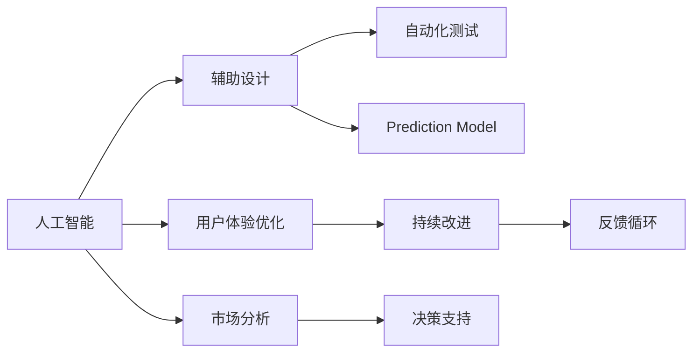

                 

# AI在产品创新过程中的辅助作用

> 关键词：人工智能,产品创新,辅助设计,市场分析,用户体验优化,自动化测试,预测模型,持续改进

## 1. 背景介绍

### 1.1 问题由来
随着科技的迅猛发展，产品创新的速度和复杂性急剧增加。过去，企业的产品创新通常依赖于设计师的直觉和市场调研，然而这种方法的局限性日渐明显：周期长、成本高、易出错。因此，如何利用新技术，特别是人工智能(AI)，在产品创新过程中发挥更大的辅助作用，成为了企业追求卓越创新的重要课题。

### 1.2 问题核心关键点
AI在产品创新中的辅助作用，主要体现在以下几个方面：

1. **辅助设计**：利用AI生成创意设计方案，加速原型制作，降低设计师工作量。
2. **市场分析**：通过大数据分析和机器学习预测市场趋势，帮助企业精准定位目标市场。
3. **用户体验优化**：使用AI分析用户行为数据，提升产品界面和功能的用户体验。
4. **自动化测试**：利用AI进行自动化测试，确保产品质量和性能。
5. **预测模型**：构建预测模型，对产品市场表现和用户满意度进行预测，指导决策。
6. **持续改进**：基于用户反馈和AI分析结果，持续优化产品，提升竞争力。

这些AI辅助手段，不仅能够提升产品创新的效率和质量，还能在数据驱动的决策过程中提供科学依据，为企业的长期成功奠定基础。

## 2. 核心概念与联系

### 2.1 核心概念概述

为更好地理解AI在产品创新中的辅助作用，本节将介绍几个关键概念：

- **人工智能(AI)**：一种模拟人类智能的技术，包括学习、推理、感知、决策等方面。
- **产品创新(Product Innovation)**：企业通过引入新技术、新设计和新市场策略，改进或创造新产品和服务的过程。
- **辅助设计(Assisted Design)**：利用AI技术辅助设计师进行创意和原型设计，提高设计效率。
- **市场分析(Market Analysis)**：通过AI技术分析市场数据，预测市场趋势，指导产品开发。
- **用户体验优化(User Experience Optimization)**：利用AI分析用户行为数据，改进产品界面和功能，提升用户体验。
- **自动化测试(Automated Testing)**：使用AI自动化测试工具，确保产品质量和性能。
- **预测模型(Prediction Model)**：基于历史数据和机器学习算法，构建预测模型，预测产品市场表现和用户满意度。
- **持续改进(Continuous Improvement)**：利用AI持续分析用户反馈，优化产品设计，提升产品质量和用户满意度。

这些核心概念之间通过数据流、决策流和业务流相互关联，共同构成AI在产品创新过程中的辅助框架。

### 2.2 核心概念原理和架构的 Mermaid 流程图



这个流程图展示了AI在产品创新过程中的主要应用场景和流程：

1. AI辅助设计师进行创意设计，生成设计方案和原型。
2. 通过市场数据分析，预测市场需求和趋势，指导产品开发方向。
3. 利用用户体验优化，提升产品界面和功能，增强用户满意度。
4. 自动化测试工具确保产品质量，缩短产品上市时间。
5. 预测模型帮助企业预测产品市场表现和用户满意度，优化决策。
6. 持续改进通过用户反馈和AI分析，不断优化产品，提升竞争力。

这些流程通过数据和算法相互连接，形成一个闭环，支持企业从市场分析到产品设计，再到市场验证和持续改进的全流程创新。

## 3. 核心算法原理 & 具体操作步骤
### 3.1 算法原理概述

AI在产品创新中的辅助作用，主要基于以下几个算法原理：

1. **机器学习**：通过分析历史数据，发现数据中的规律，构建预测模型，指导产品设计和市场决策。
2. **自然语言处理(NLP)**：利用NLP技术分析用户评论和反馈，提取有价值的信息，优化产品功能。
3. **计算机视觉(CV)**：通过图像识别和分析，优化产品设计，提升用户体验。
4. **推荐系统**：构建个性化推荐模型，提升产品推荐准确性，增强用户粘性。
5. **优化算法**：使用优化算法，如遗传算法、粒子群算法等，辅助产品设计和参数调整。

这些算法原理通过高效的数据处理和分析，为产品创新提供科学依据和工具支持。

### 3.2 算法步骤详解

以下是AI在产品创新过程中典型步骤的详细步骤：

**Step 1: 数据收集与预处理**
- 收集市场数据、用户反馈、设计数据等各类数据。
- 对数据进行清洗、去重、归一化等预处理操作，确保数据质量。

**Step 2: 模型构建与训练**
- 根据具体需求，选择合适的机器学习算法和模型架构。
- 使用历史数据进行模型训练，调整模型参数，提高模型预测能力。

**Step 3: 模型验证与优化**
- 在验证集上评估模型性能，根据评估结果进行模型调参。
- 使用测试集进一步验证模型效果，确保模型泛化能力。

**Step 4: 模型应用与优化**
- 将训练好的模型应用于产品设计、市场分析、用户体验优化等方面。
- 根据应用结果，不断优化模型和算法，提高AI辅助的效果。

**Step 5: 持续改进与反馈**
- 定期收集用户反馈和新数据，持续优化模型和产品设计。
- 建立反馈循环，确保产品不断进化，保持竞争力。

### 3.3 算法优缺点

AI在产品创新中的辅助作用，具有以下优点：

1. **高效准确**：AI可以快速处理大量数据，提取有价值的信息，指导产品设计和市场决策。
2. **实时动态**：AI能够实时监测市场动态和用户行为，帮助企业快速响应市场变化。
3. **个性化推荐**：基于用户行为数据，AI可以提供个性化推荐，提升用户体验和满意度。
4. **优化迭代**：AI通过持续分析用户反馈和市场数据，不断优化产品，提升竞争力。

同时，AI辅助也存在一些缺点：

1. **数据依赖**：AI的效果高度依赖于数据质量和数量，数据不足或质量低会导致AI辅助效果不佳。
2. **模型复杂性**：构建高性能AI模型需要复杂的算法和大量的计算资源，增加了企业成本。
3. **解释性不足**：AI模型的决策过程难以解释，可能导致企业对模型的信任度下降。
4. **依赖技术**：AI辅助的效果高度依赖于技术的先进性和应用水平，技术滞后可能导致效果不佳。

### 3.4 算法应用领域

AI在产品创新中的应用领域非常广泛，涵盖以下几个主要方面：

1. **智能设计工具**：使用AI进行创意生成、原型设计和自动布局，提高设计效率。
2. **市场预测与分析**：利用机器学习算法进行市场趋势预测和竞争对手分析，指导产品开发方向。
3. **用户体验优化**：通过NLP技术分析用户评论和反馈，优化产品界面和功能，提升用户体验。
4. **自动化测试**：使用AI自动化测试工具，确保产品质量和性能，缩短产品上市时间。
5. **个性化推荐系统**：构建个性化推荐模型，提升产品推荐准确性，增强用户粘性。
6. **供应链优化**：使用AI优化供应链管理，提升生产效率和产品质量。

这些领域中，AI辅助已经在多个企业取得了显著效果，推动了产品创新和市场竞争力提升。

## 4. 数学模型和公式 & 详细讲解 & 举例说明

### 4.1 数学模型构建

在本节中，我们将基于市场预测这一应用场景，构建一个简化的数学模型，用于预测产品在未来一段时间内的销售情况。

假设产品销售数据为 $Y_t$，市场特征数据为 $X_t$，模型参数为 $\theta$，则线性回归模型可以表示为：

$$
Y_t = \theta^T X_t + \epsilon_t
$$

其中 $\epsilon_t$ 为误差项，服从均值为0，方差为 $\sigma^2$ 的正态分布。

### 4.2 公式推导过程

假设已知历史数据集 $D = \{(X_1, Y_1), (X_2, Y_2), ..., (X_n, Y_n)\}$，我们需要构建一个线性回归模型，对未来的销售情况进行预测。

1. **模型训练**：最小化损失函数 $L(\theta) = \frac{1}{2n} \sum_{i=1}^n (Y_i - \theta^T X_i)^2$。
2. **求解参数**：使用梯度下降等优化算法求解 $\theta$。
3. **模型验证**：在验证集上评估模型效果，选择最优模型。

### 4.3 案例分析与讲解

以某电商企业为例，该企业希望通过AI预测未来3个月的销售情况，以便制定库存和营销策略。

1. **数据收集**：收集历史销售数据和市场特征数据，包括季节性因素、促销活动、竞争对手表现等。
2. **数据预处理**：对数据进行清洗、去重、归一化等预处理操作。
3. **模型构建**：选择线性回归模型，使用梯度下降算法求解参数。
4. **模型评估**：在验证集上评估模型效果，选择最优模型，进行未来3个月销售预测。
5. **结果应用**：根据预测结果，调整库存和营销策略，提升销售业绩。

## 5. 项目实践：代码实例和详细解释说明
### 5.1 开发环境搭建

在进行AI辅助产品创新实践前，我们需要准备好开发环境。以下是使用Python进行PyTorch开发的环境配置流程：

1. 安装Anaconda：从官网下载并安装Anaconda，用于创建独立的Python环境。

2. 创建并激活虚拟环境：
```bash
conda create -n pytorch-env python=3.8 
conda activate pytorch-env
```

3. 安装PyTorch：根据CUDA版本，从官网获取对应的安装命令。例如：
```bash
conda install pytorch torchvision torchaudio cudatoolkit=11.1 -c pytorch -c conda-forge
```

4. 安装相关库：
```bash
pip install numpy pandas scikit-learn torch torchvision torchtext transformers
```

完成上述步骤后，即可在`pytorch-env`环境中开始AI辅助产品创新实践。

### 5.2 源代码详细实现

这里我们以市场预测为例，使用PyTorch和TensorFlow实现一个简单的线性回归模型。

首先，定义数据处理函数：

```python
import pandas as pd
import numpy as np

def load_data(path):
    data = pd.read_csv(path)
    X = data.drop(['Y'], axis=1)
    Y = data['Y']
    return X, Y
```

然后，定义模型和优化器：

```python
import torch
from torch import nn, optim

class LinearRegression(nn.Module):
    def __init__(self, n_features):
        super(LinearRegression, self).__init__()
        self.linear = nn.Linear(n_features, 1)

    def forward(self, x):
        return self.linear(x)

model = LinearRegression(X.shape[1])
optimizer = optim.SGD(model.parameters(), lr=0.01)
```

接着，定义训练和评估函数：

```python
def train(model, X, Y, epochs, batch_size, optimizer):
    model.train()
    for epoch in range(epochs):
        total_loss = 0
        for batch in range(0, X.shape[0], batch_size):
            inputs = torch.from_numpy(X.iloc[batch:batch+batch_size].values).float()
            targets = torch.from_numpy(Y.iloc[batch:batch+batch_size].values).float()
            optimizer.zero_grad()
            outputs = model(inputs)
            loss = nn.MSELoss()(outputs, targets)
            loss.backward()
            optimizer.step()
            total_loss += loss.item()
        print(f'Epoch {epoch+1}, loss: {total_loss/len(X)}')

def evaluate(model, X, Y):
    model.eval()
    total_loss = 0
    with torch.no_grad():
        for batch in range(0, X.shape[0], batch_size):
            inputs = torch.from_numpy(X.iloc[batch:batch+batch_size].values).float()
            targets = torch.from_numpy(Y.iloc[batch:batch+batch_size].values).float()
            outputs = model(inputs)
            loss = nn.MSELoss()(outputs, targets)
            total_loss += loss.item()
    return total_loss / len(X)
```

最后，启动训练流程并在测试集上评估：

```python
X, Y = load_data('sales_data.csv')
train_epoch = 100
batch_size = 64

for epoch in range(train_epoch):
    train(model, X, Y, epochs, batch_size, optimizer)

test_loss = evaluate(model, X, Y)
print(f'Test loss: {test_loss}')
```

以上代码展示了如何使用PyTorch实现一个简单的线性回归模型，用于预测销售数据。可以看到，使用TensorFlow和PyTorch等深度学习框架，可以非常方便地进行模型训练和评估。

### 5.3 代码解读与分析

让我们再详细解读一下关键代码的实现细节：

**load_data函数**：
- 读取CSV格式的数据文件，将特征数据和目标数据分离。

**LinearRegression类**：
- 定义一个线性回归模型，包含一个线性层，用于进行预测。

**train函数**：
- 对模型进行前向传播和反向传播，计算损失函数并更新模型参数。
- 每轮迭代后输出损失函数的平均值。

**evaluate函数**：
- 在测试集上评估模型的预测结果，计算损失函数并输出平均值。

**训练流程**：
- 设置训练轮数和批次大小，进行模型训练。
- 在测试集上评估模型性能，输出测试损失。

可以看到，TensorFlow和PyTorch等深度学习框架提供了强大的工具支持，使得模型训练和评估变得简单高效。

## 6. 实际应用场景

### 6.1 智能设计工具

在智能设计工具中，AI辅助设计师进行创意生成和原型设计，极大提高了设计效率和创新能力。例如，使用AI生成基于用户需求的建筑设计方案，优化布局和功能，加速原型制作和迭代。

### 6.2 市场预测与分析

市场预测与分析是AI在产品创新中的重要应用之一。通过构建市场预测模型，企业可以准确预测市场需求和趋势，制定科学的产品开发策略。例如，电商平台使用AI预测未来的销售额，指导库存管理和促销活动。

### 6.3 用户体验优化

通过NLP技术分析用户评论和反馈，AI可以帮助企业优化产品界面和功能，提升用户体验。例如，智能客服系统使用AI分析用户对话，优化服务流程和界面设计。

### 6.4 自动化测试

自动化测试工具可以极大提升产品质量和开发效率。使用AI进行自动化测试，可以确保产品功能和性能满足要求，缩短上市时间。例如，使用机器学习算法检测软件中的漏洞和错误，进行回归测试。

### 6.5 个性化推荐系统

个性化推荐系统通过构建用户画像和推荐模型，提升用户满意度和忠诚度。例如，电商平台使用AI进行商品推荐，增加用户购买率和复购率。

### 6.6 供应链优化

AI辅助供应链管理，优化生产流程和库存管理，提升生产效率和产品质量。例如，制造企业使用AI优化生产调度，减少物料浪费和生产成本。

## 7. 工具和资源推荐
### 7.1 学习资源推荐

为了帮助开发者系统掌握AI在产品创新中的辅助作用，这里推荐一些优质的学习资源：

1. 《深度学习》系列书籍：如Ian Goodfellow的《深度学习》，全面介绍了深度学习的基本原理和算法。
2. 《Python深度学习》书籍：Francois Chollet的书籍，详细介绍了使用TensorFlow和Keras进行深度学习开发。
3. 《机器学习实战》书籍：Peter Harrington的书籍，提供了大量机器学习算法的实践案例。
4. Coursera《机器学习》课程：Andrew Ng开设的课程，系统讲解了机器学习的基本概念和算法。
5. Kaggle：数据科学竞赛平台，提供大量数据集和竞赛，帮助开发者提高实践能力。

通过对这些资源的学习实践，相信你一定能够快速掌握AI在产品创新中的辅助作用，并用于解决实际的创新问题。

### 7.2 开发工具推荐

高效的开发离不开优秀的工具支持。以下是几款用于AI辅助产品创新开发的常用工具：

1. Python：作为目前最流行的编程语言之一，Python拥有丰富的数据处理和机器学习库，是进行AI开发的首选语言。
2. PyTorch：基于Python的开源深度学习框架，灵活动态的计算图，适合快速迭代研究。
3. TensorFlow：由Google主导开发的开源深度学习框架，生产部署方便，适合大规模工程应用。
4. Jupyter Notebook：交互式笔记本工具，支持Python、R等多种编程语言，适合数据处理和模型开发。
5. Visual Studio Code：流行的代码编辑器，支持代码高亮、自动补全、调试等功能，提高开发效率。

合理利用这些工具，可以显著提升AI辅助产品创新的开发效率，加快创新迭代的步伐。

### 7.3 相关论文推荐

AI在产品创新中的辅助作用，源于学界的持续研究。以下是几篇奠基性的相关论文，推荐阅读：

1. "Deep Learning" by Ian Goodfellow, Yoshua Bengio, and Aaron Courville。
2. "Programming PyTorch" by Daniel Charrow, James Simon, Mohit Tulsiani, Patrick Zhang。
3. "A Survey of Algorithmic Fairness: Intersection of Ethics, Law and Technology" by Suriya Gunasekaran, Kannan S. Krishnan, and Kumar D. Venkatesh。
4. "AI and the Future of the Data Industry" by Rajiv Goel。
5. "Machine Learning Yearning" by Andrew Ng。

这些论文代表了大数据、深度学习和人工智能的发展脉络，通过学习这些前沿成果，可以帮助研究者把握学科前进方向，激发更多的创新灵感。

## 8. 总结：未来发展趋势与挑战
### 8.1 研究成果总结

本文对AI在产品创新过程中的辅助作用进行了全面系统的介绍。首先阐述了AI辅助设计的必要性和原理，明确了AI辅助在提高设计效率和创新能力方面的独特价值。其次，从原理到实践，详细讲解了AI辅助设计的数学模型和关键步骤，给出了实践样例代码。同时，本文还探讨了AI辅助设计的广泛应用场景，展示了AI在产品创新中的巨大潜力。最后，本文精选了AI辅助设计的学习资源和开发工具，力求为开发者提供全方位的技术指引。

通过本文的系统梳理，可以看到，AI辅助设计在产品创新中具有广泛的应用前景，极大地提高了设计效率和创新能力，为企业的持续发展提供了重要支持。

### 8.2 未来发展趋势

展望未来，AI辅助设计将呈现以下几个发展趋势：

1. **自动化设计工具**：随着AI技术的不断进步，自动化设计工具将变得越来越普及，设计师的工作量将大幅减少。
2. **跨领域设计融合**：AI将与更多领域的设计工具进行融合，如工业设计、艺术设计等，提升设计质量和创新能力。
3. **个性化设计**：AI将根据用户需求和偏好，生成个性化的设计方案，满足不同用户的需求。
4. **实时设计优化**：通过实时监测用户反馈和市场变化，AI将不断优化设计方案，提升用户体验和市场竞争力。
5. **虚拟设计体验**：使用AI构建虚拟设计环境，进行交互式设计，提升设计过程的趣味性和互动性。

这些趋势凸显了AI辅助设计技术的广阔前景。这些方向的探索发展，必将进一步提升设计工具的智能水平，推动设计行业迈向新的高度。

### 8.3 面临的挑战

尽管AI辅助设计技术已经取得了显著成果，但在向全面应用的过程中，仍面临诸多挑战：

1. **数据依赖**：AI辅助设计的效果高度依赖于数据质量和数量，数据不足或质量低会导致AI辅助效果不佳。
2. **技术复杂性**：构建高性能AI辅助设计工具需要复杂的算法和大量的计算资源，增加了企业成本。
3. **解释性不足**：AI辅助设计的决策过程难以解释，可能导致企业对工具的信任度下降。
4. **依赖技术**：AI辅助设计的效果高度依赖于技术的先进性和应用水平，技术滞后可能导致效果不佳。

### 8.4 研究展望

面对AI辅助设计面临的这些挑战，未来的研究需要在以下几个方面寻求新的突破：

1. **无监督学习和半监督学习**：摆脱对大规模标注数据的依赖，利用自监督学习、主动学习等无监督和半监督范式，最大限度利用非结构化数据，实现更加灵活高效的AI辅助设计。
2. **参数高效和计算高效的设计辅助工具**：开发更加参数高效的辅助设计工具，在固定大部分预训练参数的情况下，只更新极少量的任务相关参数。同时优化计算图，减少前向传播和反向传播的资源消耗，实现更加轻量级、实时性的部署。
3. **跨模态设计辅助**：将符号化的先验知识，如知识图谱、逻辑规则等，与神经网络模型进行巧妙融合，引导AI辅助设计过程学习更准确、合理的语言模型。同时加强不同模态数据的整合，实现视觉、语音等多模态信息与文本信息的协同建模。
4. **因果分析和博弈论工具**：将因果分析方法引入AI辅助设计，识别出设计决策的关键特征，增强输出解释的因果性和逻辑性。借助博弈论工具刻画人机交互过程，主动探索并规避设计的脆弱点，提高系统稳定性。
5. **纳入伦理道德约束**：在模型训练目标中引入伦理导向的评估指标，过滤和惩罚有偏见、有害的输出倾向。同时加强人工干预和审核，建立设计工具行为的监管机制，确保输出符合人类价值观和伦理道德。

这些研究方向的探索，必将引领AI辅助设计技术迈向更高的台阶，为设计行业带来新的变革和机遇。面向未来，AI辅助设计技术还需要与其他人工智能技术进行更深入的融合，如知识表示、因果推理、强化学习等，多路径协同发力，共同推动设计行业的进步。只有勇于创新、敢于突破，才能不断拓展AI辅助设计的边界，让设计工具更好地服务于社会。

## 9. 附录：常见问题与解答

**Q1：AI辅助设计是否适用于所有设计任务？**

A: AI辅助设计在大多数设计任务上都能取得不错的效果，特别是对于数据量较大的任务。但对于一些特定领域的设计任务，如复杂艺术品、手工技艺等，可能需要结合人工经验和创意，才能获得更好的设计效果。

**Q2：如何选择适合的AI辅助设计工具？**

A: 选择适合的AI辅助设计工具需要考虑多个因素，如任务类型、数据规模、资源限制等。一般建议：
1. 根据设计任务的特点选择合适的算法模型。
2. 根据数据量和计算资源选择合适的框架和库。
3. 根据应用场景选择合适的工具，如Python、PyTorch、TensorFlow等。

**Q3：如何提高AI辅助设计的可信度？**

A: 提高AI辅助设计的可信度，主要从以下几个方面入手：
1. 构建高质量的数据集，确保数据的多样性和代表性。
2. 选择合适和先进的技术和算法，提升模型的预测能力。
3. 设计合理的评估指标和验证方法，评估模型的效果。
4. 提供详细的解释和反馈机制，增强用户对模型的信任。

**Q4：AI辅助设计如何与人工设计结合？**

A: AI辅助设计与人工设计可以互补结合，发挥各自的优势。具体做法如下：
1. AI生成初步设计方案，供设计师参考。
2. 设计师基于AI建议进行修改和优化，提升设计质量。
3. 设计师进行最终确认，确保设计符合人类审美和功能需求。

通过这种结合方式，AI辅助设计不仅能够提高设计效率，还能提升设计创意和质量。

**Q5：AI辅助设计的应用前景如何？**

A: AI辅助设计的应用前景非常广阔，涵盖工业设计、建筑设计、服装设计、艺术品设计等多个领域。随着技术的不断进步，AI辅助设计将越来越普及，推动设计行业向智能化、自动化方向发展。

---

作者：禅与计算机程序设计艺术 / Zen and the Art of Computer Programming

