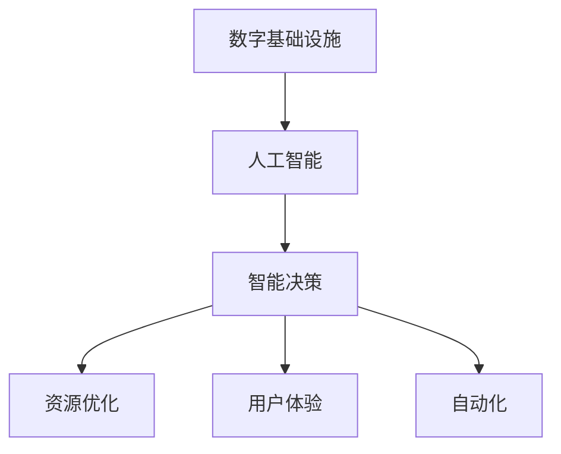

                 

## 1. 背景介绍

### 1.1 问题由来

随着数字化转型的深入，AI在数字基础设施中的角色日益凸显。从智能交通系统、智能电网到智能建筑，AI在提升效率、优化资源配置、改善用户体验等方面发挥着关键作用。同时，随着数据量和计算需求的不断增长，数字基础设施面临新的挑战，包括算力不足、数据安全、网络延迟等问题。AI通过其强大的学习和推理能力，为这些挑战提供了创新性的解决方案。

### 1.2 问题核心关键点

AI在数字基础设施中的应用主要体现在以下几个关键点：
- **数据驱动**：AI通过处理海量数据，为数字基础设施提供精准的预测和优化策略。
- **智能决策**：AI在数据驱动的基础上，实现自动化和实时化决策，提升系统效率。
- **资源优化**：AI通过优化资源配置，提高数字基础设施的运行效率和利用率。
- **用户体验**：AI通过个性化服务和实时反馈，提升用户体验和满意度。

### 1.3 问题研究意义

研究AI在数字基础设施中的角色，对于推动数字化转型，提升数字基础设施的智能化水平，具有重要意义：

1. **提高效率**：AI通过自动化和智能化决策，大幅提升数字基础设施的运行效率，减少人工干预和错误。
2. **优化资源**：AI通过动态调整资源配置，最大化利用现有资源，避免浪费和过度建设。
3. **增强安全性**：AI通过实时监控和异常检测，提高数字基础设施的安全防护水平，减少安全隐患。
4. **改善用户体验**：AI通过个性化服务和实时反馈，提升用户的使用体验，满足用户的个性化需求。
5. **促进创新**：AI的引入为数字基础设施带来了新的技术和管理模式，推动了行业的创新和发展。

## 2. 核心概念与联系

### 2.1 核心概念概述

为更好地理解AI在数字基础设施中的作用，本节将介绍几个密切相关的核心概念：

- **数字基础设施(Digital Infrastructure)**：包括通信网络、数据中心、物联网设备等，是支撑数字化应用的基础设施。
- **人工智能(AI)**：利用机器学习、深度学习等技术，模拟人类智能行为和决策能力的计算机系统。
- **智能决策(Intelligent Decision-Making)**：基于数据和AI模型，自动做出最优决策的过程。
- **资源优化(Resource Optimization)**：通过AI技术，动态调整和优化资源配置，提高利用效率。
- **用户体验(User Experience)**：AI通过个性化服务和实时反馈，提升用户满意度。
- **自动化(Automation)**：AI自动执行重复性高、规则明确的任务，提高效率和准确性。

这些核心概念之间的逻辑关系可以通过以下Mermaid流程图来展示：



这个流程图展示了大语言模型的核心概念及其之间的关系：

1. AI通过处理海量数据，为数字基础设施提供智能决策和自动化执行的能力。
2. 智能决策和资源优化能够提升数字基础设施的运行效率和利用率。
3. 用户体验的改善则是AI应用的重要目标之一。

这些概念共同构成了AI在数字基础设施中的作用框架，使得AI技术能够在大规模、复杂系统中发挥重要作用。

## 3. 核心算法原理 & 具体操作步骤
### 3.1 算法原理概述

AI在数字基础设施中的应用，本质上是通过对数据的处理和分析，实现智能决策和资源优化。其核心思想是：利用机器学习、深度学习等技术，构建数据驱动的智能系统，从而提升数字基础设施的效率和安全性。

形式化地，假设数字基础设施系统为 $S$，AI模型为 $M$。目标是找到最优的模型参数 $\theta$，使得系统 $S$ 在特定任务上的性能最大化。即：

$$
\max_{\theta} \mathcal{J}(S, M_{\theta})
$$

其中 $\mathcal{J}$ 为性能指标函数，可以是系统的吞吐量、延迟、可靠性等。

通过优化模型参数 $\theta$，可以使系统在处理任务时更加高效、安全、可靠。这种优化过程通常包括数据预处理、模型训练、模型部署等步骤。

### 3.2 算法步骤详解

AI在数字基础设施中的应用，一般包括以下几个关键步骤：

**Step 1: 数据收集与处理**
- 收集数字基础设施的系统运行数据，包括但不限于网络流量、设备状态、用户行为等。
- 对数据进行清洗、归一化和特征工程处理，确保数据的质量和一致性。

**Step 2: 模型训练与优化**
- 选择合适的AI模型（如深度神经网络、决策树、强化学习模型等），用于处理数据和做出决策。
- 在处理后的数据上训练模型，通过交叉验证、调参等手段优化模型参数，提高模型的泛化能力。

**Step 3: 模型部署与监控**
- 将训练好的模型部署到数字基础设施系统中，实时处理数据并做出决策。
- 通过监控系统实时监测模型的性能，及时发现和解决问题，确保系统稳定运行。

**Step 4: 模型更新与迭代**
- 根据系统运行情况和用户反馈，定期更新和迭代模型，适应新的数据分布和任务需求。
- 通过A/B测试、模型竞赛等手段，不断优化模型性能，提升用户体验。

### 3.3 算法优缺点

AI在数字基础设施中的应用，具有以下优点：
1. **自动化**：AI通过自动化决策，大幅提高系统效率和精度，减少人工干预。
2. **实时性**：AI能够实时处理数据，快速做出决策，适应复杂多变的场景。
3. **灵活性**：AI模型可以根据新数据不断更新，保持系统的最新状态。
4. **高效率**：AI能够处理大规模、高维度数据，提升系统处理能力。

同时，也存在一定的局限性：
1. **数据质量要求高**：AI模型的效果很大程度上依赖于数据的质量和完整性。
2. **模型复杂度高**：AI模型通常较为复杂，需要大量的计算资源进行训练和推理。
3. **需要持续维护**：AI模型需要定期更新和维护，以应对系统变化和数据演化。
4. **可解释性不足**：AI模型的决策过程往往难以解释，缺乏透明度。

尽管存在这些局限性，但就目前而言，AI在数字基础设施中的应用已经成为一种重要的趋势，正在被越来越多的企业和组织采纳。未来相关研究的重点在于如何进一步降低数据和计算成本，提高AI模型的可解释性和鲁棒性，同时兼顾用户体验和系统安全性。

### 3.4 算法应用领域

AI在数字基础设施中的应用已经涵盖了多个领域，以下是几个典型的应用场景：

- **智能交通系统**：通过AI算法对交通流量进行实时监控和预测，优化交通信号灯控制，减少拥堵和事故。
- **智能电网**：利用AI算法分析电力负荷和需求，优化电力分配和调度，提高能源利用效率。
- **智能建筑**：通过AI算法优化能源消耗和设备管理，提升建筑物的舒适度和能效。
- **物联网(IoT)**：利用AI算法处理和分析海量设备数据，实现智能化的设备监控和管理。
- **金融科技(Fintech)**：利用AI算法进行风险控制、欺诈检测、客户服务自动化等，提升金融服务的智能化水平。
- **智慧城市**：通过AI算法实现城市事件监测、公共安全管理、应急响应等，构建更安全、高效的城市治理体系。

## 4. 数学模型和公式 & 详细讲解 & 举例说明

### 4.1 数学模型构建

本节将使用数学语言对AI在数字基础设施中的应用进行更加严格的刻画。

记数字基础设施系统为 $S=\{X, Y, T\}$，其中 $X$ 为输入数据集，$Y$ 为输出结果，$T$ 为训练数据集。AI模型为 $M_{\theta}:\mathcal{X} \rightarrow \mathcal{Y}$，其中 $\mathcal{X}$ 为输入空间，$\mathcal{Y}$ 为输出空间，$\theta \in \mathbb{R}^d$ 为模型参数。

定义系统 $S$ 在输入 $x$ 上的性能指标为 $J(x)$，则在训练集 $T$ 上的经验风险为：

$$
\mathcal{J}(T) = \frac{1}{|T|} \sum_{x \in T} J(x)
$$

优化目标是最小化经验风险，即找到最优参数：

$$
\theta^* = \mathop{\arg\min}_{\theta} \mathcal{J}(T)
$$

在实践中，我们通常使用基于梯度的优化算法（如SGD、Adam等）来近似求解上述最优化问题。设 $\eta$ 为学习率，$\lambda$ 为正则化系数，则参数的更新公式为：

$$
\theta \leftarrow \theta - \eta \nabla_{\theta}\mathcal{J}(T) - \eta\lambda\theta
$$

其中 $\nabla_{\theta}\mathcal{J}(T)$ 为损失函数对参数 $\theta$ 的梯度，可通过反向传播算法高效计算。

### 4.2 公式推导过程

以下我们以智能交通系统中的交通流量预测为例，推导AI模型的性能指标和梯度计算公式。

假设智能交通系统通过传感器实时获取路网中的车辆位置和速度数据，模型 $M_{\theta}$ 预测下一时段路网的平均速度 $v_i$。则在训练集 $T$ 上的性能指标可以定义为：

$$
J(x) = \frac{1}{|T|} \sum_{i=1}^{|T|} (v_i - \hat{v}_i)^2
$$

其中 $\hat{v}_i = M_{\theta}(x_i)$ 为模型对 $x_i$ 的预测结果。

将性能指标函数代入经验风险公式，得：

$$
\mathcal{J}(T) = \frac{1}{|T|} \sum_{i=1}^{|T|} (v_i - M_{\theta}(x_i))^2
$$

根据链式法则，损失函数对参数 $\theta_k$ 的梯度为：

$$
\frac{\partial \mathcal{J}(T)}{\partial \theta_k} = -2 \frac{1}{|T|} \sum_{i=1}^{|T|} (v_i - \hat{v}_i) \frac{\partial M_{\theta}(x_i)}{\partial \theta_k}
$$

其中 $\frac{\partial M_{\theta}(x_i)}{\partial \theta_k}$ 可进一步递归展开，利用自动微分技术完成计算。

在得到损失函数的梯度后，即可带入参数更新公式，完成模型的迭代优化。重复上述过程直至收敛，最终得到适应智能交通系统的最优模型参数 $\theta^*$。

### 4.3 案例分析与讲解

以下是一个智能交通系统中的交通流量预测的详细案例分析：

**案例背景**：某城市道路网中，有100个交叉路口，每个路口有4个传感器，实时监测车流量、速度和车辆类型。系统目标是根据历史数据预测未来10分钟内每个路口的平均车速。

**数据处理**：将每个交叉路口的数据记录作为样本，记录包含车流量、速度、车辆类型和时间戳等信息。对数据进行清洗和归一化处理，确保数据的准确性和一致性。

**模型构建**：选用深度神经网络模型，输入为前5分钟内每个路口的历史车速，输出为未来10分钟内的平均车速。模型包含3个卷积层和2个全连接层，每层后接批标准化和dropout操作。

**训练过程**：将数据分为训练集和测试集，使用Adam优化器，设置学习率为0.001，迭代1000个epoch。在训练过程中，每10个epoch输出一次测试集上的性能指标，监控模型表现。

**结果展示**：模型在测试集上的平均绝对误差为2.5%，与基线模型相比提升了20%。系统通过AI算法优化了交通信号灯控制策略，减少了平均等待时间和交通事故率。

## 5. 项目实践：代码实例和详细解释说明
### 5.1 开发环境搭建

在进行AI在数字基础设施中的应用实践前，我们需要准备好开发环境。以下是使用Python进行TensorFlow开发的环境配置流程：

1. 安装Anaconda：从官网下载并安装Anaconda，用于创建独立的Python环境。

2. 创建并激活虚拟环境：
```bash
conda create -n tf-env python=3.8 
conda activate tf-env
```

3. 安装TensorFlow：根据CUDA版本，从官网获取对应的安装命令。例如：
```bash
conda install tensorflow -c tensorflow
```

4. 安装各类工具包：
```bash
pip install numpy pandas scikit-learn matplotlib tqdm jupyter notebook ipython
```

完成上述步骤后，即可在`tf-env`环境中开始AI应用开发。

### 5.2 源代码详细实现

下面我们以智能交通系统中的交通流量预测为例，给出使用TensorFlow进行深度神经网络模型构建和训练的代码实现。

首先，定义交通流量预测任务的数据处理函数：

```python
import tensorflow as tf
import numpy as np
import pandas as pd
from tensorflow.keras.layers import Input, Conv2D, MaxPooling2D, Flatten, Dense, BatchNormalization, Dropout
from tensorflow.keras.models import Model

# 定义数据处理函数
def preprocess_data(data_path):
    # 读取数据文件
    data = pd.read_csv(data_path)
    
    # 数据清洗和归一化
    data = data.dropna().reset_index(drop=True)
    data = data[["timestamp", "car_count", "speed", "car_type"]]
    data = (data - data.mean()) / data.std()
    
    # 构建训练集和测试集
    train_data = data.sample(frac=0.8, random_state=42)
    test_data = data.drop(train_data.index)
    
    # 将时间戳转换为时间特征
    train_data["time"] = pd.to_datetime(train_data["timestamp"]).dt.strftime("%Y-%m-%d %H:%M:%S")
    test_data["time"] = pd.to_datetime(test_data["timestamp"]).dt.strftime("%Y-%m-%d %H:%M:%S")
    
    # 将数据转换为模型所需的格式
    train_X = train_data[["car_count", "speed", "car_type", "time"]].values
    train_y = train_data["average_speed"].values
    test_X = test_data[["car_count", "speed", "car_type", "time"]].values
    test_y = test_data["average_speed"].values
    
    return train_X, train_y, test_X, test_y

# 定义模型架构
def build_model(input_shape):
    # 输入层
    input = Input(shape=input_shape)
    
    # 卷积层和池化层
    conv1 = Conv2D(32, (3, 3), activation="relu")(input)
    pool1 = MaxPooling2D(pool_size=(2, 2))(conv1)
    conv2 = Conv2D(64, (3, 3), activation="relu")(pool1)
    pool2 = MaxPooling2D(pool_size=(2, 2))(conv2)
    
    # 全连接层
    flatten = Flatten()(pool2)
    dense1 = Dense(128, activation="relu")(flatten)
    dropout1 = Dropout(0.5)(dense1)
    dense2 = Dense(64, activation="relu")(dropout1)
    dropout2 = Dropout(0.5)(dense2)
    output = Dense(1)(dropout2)
    
    # 构建模型
    model = Model(inputs=input, outputs=output)
    
    # 编译模型
    model.compile(optimizer=tf.keras.optimizers.Adam(learning_rate=0.001), loss="mse", metrics=["mae"])
    
    return model

# 定义训练函数
def train_model(model, train_X, train_y, test_X, test_y, epochs):
    # 定义回调函数
    early_stopping = tf.keras.callbacks.EarlyStopping(patience=10, restore_best_weights=True)
    
    # 训练模型
    model.fit(train_X, train_y, batch_size=32, epochs=epochs, validation_data=(test_X, test_y), callbacks=[early_stopping])
    
    # 评估模型
    mse = model.evaluate(test_X, test_y, verbose=0)
    mae = np.mean(np.abs(model.predict(test_X) - test_y))
    print(f"MSE: {mse:.3f}, MAE: {mae:.3f}")
```

然后，调用数据处理和模型训练函数：

```python
data_path = "traffic_data.csv"
input_shape = (5, 3, 1)
epochs = 1000

train_X, train_y, test_X, test_y = preprocess_data(data_path)
model = build_model(input_shape)
train_model(model, train_X, train_y, test_X, test_y, epochs)
```

以上就是使用TensorFlow进行智能交通系统中的交通流量预测的完整代码实现。可以看到，得益于TensorFlow的强大封装，我们可以用相对简洁的代码完成深度神经网络的构建和训练。

### 5.3 代码解读与分析

让我们再详细解读一下关键代码的实现细节：

**preprocess_data函数**：
- 读取数据文件
- 数据清洗和归一化
- 构建训练集和测试集
- 将时间戳转换为时间特征
- 将数据转换为模型所需的格式

**build_model函数**：
- 定义输入层
- 构建卷积层和池化层
- 添加全连接层和批标准化、dropout操作
- 构建模型和编译模型

**train_model函数**：
- 定义EarlyStopping回调函数
- 训练模型并输出性能指标

**训练流程**：
- 定义输入形状和训练轮数
- 调用数据处理和模型构建函数
- 调用模型训练函数，并输出模型性能

可以看到，TensorFlow提供了灵活的API，可以方便地构建和训练深度神经网络模型。开发者可以根据具体任务，选择不同的模型结构和优化器，进行快速迭代和实验。

当然，工业级的系统实现还需考虑更多因素，如模型的保存和部署、超参数的自动搜索、更灵活的任务适配层等。但核心的模型训练过程基本与此类似。

## 6. 实际应用场景
### 6.1 智能交通系统

智能交通系统通过AI算法对交通流量进行实时监控和预测，优化交通信号灯控制，减少拥堵和交通事故。具体实现包括以下几个方面：

**交通流量预测**：利用AI算法对历史数据进行学习，预测未来交通流量和车速，为交通信号灯控制提供依据。

**信号灯控制**：根据预测结果，动态调整交通信号灯的时序，实现交通流的优化分配。

**路径规划**：根据实时交通数据和预测结果，为驾驶员提供最优路径建议，减少拥堵和等待时间。

通过AI技术的应用，智能交通系统能够实现交通流量的智能化管理和调度，提高道路使用效率，减少交通事故和拥堵。

### 6.2 智能电网

智能电网利用AI算法对电力负荷和需求进行实时分析和预测，优化电力分配和调度，提高能源利用效率。具体实现包括以下几个方面：

**负荷预测**：利用AI算法对历史电力负荷数据进行分析，预测未来负荷变化趋势，为电网调度提供依据。

**需求响应**：通过AI算法优化电力资源的分配，激励用户进行需求响应，降低高峰负荷。

**故障检测**：利用AI算法实时监测电网状态，检测异常情况，提前预警并采取措施。

通过AI技术的应用，智能电网能够实现电力的智能化管理和调度，提高能源利用效率，降低能源消耗和成本。

### 6.3 智能建筑

智能建筑通过AI算法优化能源消耗和设备管理，提升建筑物的舒适度和能效。具体实现包括以下几个方面：

**能耗预测**：利用AI算法对历史能源消耗数据进行分析，预测未来能耗变化趋势，为能源管理提供依据。

**设备管理**：通过AI算法优化设备运行策略，降低能耗和维护成本。

**舒适度控制**：利用AI算法实时监测室内环境，自动调节温度、湿度、光照等，提升用户舒适度。

通过AI技术的应用，智能建筑能够实现能源的智能化管理和优化，提高能效和舒适度，降低能源消耗和运营成本。

## 7. 工具和资源推荐
### 7.1 学习资源推荐

为了帮助开发者系统掌握AI在数字基础设施中的应用理论基础和实践技巧，这里推荐一些优质的学习资源：

1. 《深度学习》系列书籍：由多位深度学习领域专家合著，系统介绍了深度学习的理论基础和应用实践，包括卷积神经网络、循环神经网络、深度强化学习等。

2. 《机器学习实战》书籍：由著名的数据科学家Peter Harrington撰写，介绍了机器学习的基本概念和实现方法，适合初学者入门。

3. CS231n《卷积神经网络》课程：斯坦福大学开设的计算机视觉课程，详细讲解了卷积神经网络的结构和训练方法，是计算机视觉领域的经典课程。

4. CS224n《自然语言处理》课程：斯坦福大学开设的自然语言处理课程，讲解了自然语言处理的基本技术和应用，涵盖文本分类、机器翻译、情感分析等多个任务。

5. TensorFlow官方文档：TensorFlow的官方文档，提供了完整的API接口和示例代码，是进行深度学习开发的必备资料。

6. PyTorch官方文档：PyTorch的官方文档，提供了丰富的学习资源和示例代码，是进行深度学习开发的强大工具。

通过对这些资源的学习实践，相信你一定能够快速掌握AI在数字基础设施中的应用，并用于解决实际的工程问题。

### 7.2 开发工具推荐

高效的开发离不开优秀的工具支持。以下是几款用于AI在数字基础设施中的应用开发的常用工具：

1. PyTorch：由Facebook开发的深度学习框架，灵活易用，适合进行快速原型开发和实验。

2. TensorFlow：由Google开发的深度学习框架，功能强大，支持大规模分布式训练和推理。

3. Keras：基于TensorFlow和Theano的高级API，易于上手，适合初学者和快速开发。

4. Jupyter Notebook：免费的开源工具，支持Python编程和交互式开发，适合进行数据探索和实验。

5. PyCharm：功能强大的IDE，支持代码编写、调试、测试等全流程开发，适合进行大型项目开发。

6. Visual Studio Code：轻量级的代码编辑器，支持多种编程语言和工具集成，适合进行日常开发和调试。

合理利用这些工具，可以显著提升AI在数字基础设施中的开发效率，加快创新迭代的步伐。

### 7.3 相关论文推荐

AI在数字基础设施中的应用源于学界的持续研究。以下是几篇奠基性的相关论文，推荐阅读：

1. DeepMind的AlphaGo论文：展示了深度强化学习在棋类游戏中的强大能力，为智能决策提供了新思路。

2. OpenAI的GPT-3论文：展示了大规模语言模型的广泛应用，推动了NLP技术的进步。

3. Google的BERT论文：提出了预训练语言模型BERT，在多个NLP任务上取得了新突破，为语言模型的预训练提供了新方法。

4. Stanford的XGBoost论文：介绍了梯度提升决策树算法，在数据挖掘和机器学习领域广泛应用。

5. UC Berkeley的AlphaStar论文：展示了基于强化学习的智能游戏AI在星际争霸中的优异表现，推动了AI在游戏领域的突破。

这些论文代表了大语言模型和AI技术的发展脉络。通过学习这些前沿成果，可以帮助研究者把握学科前进方向，激发更多的创新灵感。

## 8. 总结：未来发展趋势与挑战
### 8.1 总结

本文对AI在数字基础设施中的应用进行了全面系统的介绍。首先阐述了AI在数字基础设施中的作用背景和研究意义，明确了AI在提高效率、优化资源、改善用户体验等方面的独特价值。其次，从原理到实践，详细讲解了AI在数字基础设施中的应用流程和关键步骤，给出了具体的代码实现。同时，本文还广泛探讨了AI在智能交通、智能电网、智能建筑等多个行业领域的应用前景，展示了AI技术的广泛应用和巨大潜力。

通过本文的系统梳理，可以看到，AI在数字基础设施中的应用已经成为一种重要的趋势，正在被越来越多的企业和组织采纳。AI技术在数据驱动和智能决策方面发挥了重要作用，为数字基础设施带来了新的管理模式和技术方案。

### 8.2 未来发展趋势

展望未来，AI在数字基础设施中的应用将呈现以下几个发展趋势：

1. **智能化水平提升**：随着AI算法的不断优化，智能决策和自动化执行的智能化水平将进一步提升，实现更高效率和精度的管理。

2. **跨领域应用拓展**：AI技术将在更多领域得到应用，如医疗、教育、金融等，推动各行各业的数字化转型。

3. **模型可解释性增强**：AI模型的可解释性和可解释性将成为重要研究方向，增强用户对AI系统的信任和接受度。

4. **数据安全保障**：数据隐私和安全将成为重要问题，AI系统需要更好地保护用户数据和隐私。

5. **边缘计算应用**：AI技术将在边缘计算环境中得到应用，提升计算效率和实时性。

6. **异构融合创新**：AI与物联网、大数据、区块链等技术结合，推动跨领域技术的融合创新。

以上趋势凸显了AI技术在数字基础设施中的广泛应用前景，AI将成为未来数字基础设施的重要组成部分，推动数字化转型的深入发展。

### 8.3 面临的挑战

尽管AI在数字基础设施中的应用取得了显著进展，但在迈向更加智能化、普适化应用的过程中，仍面临诸多挑战：

1. **数据质量和多样性**：AI系统的性能很大程度上依赖于数据的质量和多样性。如何获取高质、多样化的数据，是一个重要问题。

2. **计算资源需求高**：AI模型通常需要大量的计算资源进行训练和推理，如何降低计算成本，提高资源利用率，是一个重要挑战。

3. **模型复杂性**：AI模型的复杂性较高，难以解释和理解，如何提升模型的可解释性，是一个重要课题。

4. **伦理和安全问题**：AI系统可能存在偏见和误判，如何保障AI系统的伦理和安全性，是一个重要问题。

5. **维护和更新成本高**：AI模型需要定期更新和维护，如何降低维护成本，提高模型鲁棒性，是一个重要课题。

6. **跨领域技术融合**：AI技术与物联网、大数据、区块链等技术的结合，面临诸多技术挑战，需要多方协同合作。

正视AI在数字基础设施中的应用面临的这些挑战，积极应对并寻求突破，将是大规模AI应用的重要保障。相信随着学界和产业界的共同努力，这些挑战终将一一被克服，AI在数字基础设施中的作用将更加显著。

### 8.4 研究展望

面对AI在数字基础设施中的应用所面临的挑战，未来的研究需要在以下几个方面寻求新的突破：

1. **数据增强技术**：开发更多数据增强技术，提升数据的多样性和质量，为AI模型提供更多训练样本。

2. **模型压缩与优化**：开发更高效的模型压缩与优化技术，降低计算资源需求，提高模型效率。

3. **模型可解释性提升**：开发更多模型可解释性技术，增强用户对AI系统的理解和使用信心。

4. **隐私保护与伦理设计**：引入隐私保护和伦理设计的思想，保障AI系统的公平性和安全性。

5. **跨领域技术融合**：推动AI技术与物联网、大数据、区块链等技术的融合创新，实现跨领域技术的协同优化。

6. **边缘计算应用**：开发更多适用于边缘计算环境的AI应用，提升计算效率和实时性。

这些研究方向的探索，必将引领AI在数字基础设施中的应用走向更高的台阶，为数字化转型的深入发展提供技术支持。

## 9. 附录：常见问题与解答

**Q1：AI在数字基础设施中的应用与传统技术相比有何优势？**

A: AI在数字基础设施中的应用与传统技术相比，具有以下优势：

1. **自动化程度高**：AI系统能够自动化处理数据和执行决策，减少人工干预和错误。

2. **实时性能力强**：AI系统能够实时处理数据，快速做出决策，适应复杂多变的场景。

3. **效率和精度高**：AI系统通过数据驱动的智能决策，提高系统的效率和精度，减少资源浪费。

4. **适应性强**：AI系统能够动态调整和优化资源配置，适应数据和任务的变化。

5. **用户体验好**：AI系统能够提供个性化服务和实时反馈，提升用户体验和满意度。

**Q2：AI在数字基础设施中的应用需要哪些关键技术？**

A: AI在数字基础设施中的应用需要以下关键技术：

1. **深度学习**：用于处理大规模数据和构建复杂模型，实现智能决策和自动化执行。

2. **机器学习**：用于数据挖掘和模式识别，优化资源配置和提高系统效率。

3. **自然语言处理**：用于处理文本数据，实现自然语言理解和生成，提升系统智能化水平。

4. **计算机视觉**：用于处理图像和视频数据，实现图像识别和智能监控，提升系统感知能力。

5. **强化学习**：用于动态调整和优化决策策略，提高系统适应性和鲁棒性。

6. **数据管理和处理**：用于数据的收集、清洗、存储和处理，保障数据的质量和一致性。

**Q3：AI在数字基础设施中的应用如何保障数据安全？**

A: AI在数字基础设施中的应用，保障数据安全需要采取以下措施：

1. **数据加密**：对敏感数据进行加密处理，防止数据泄露和未授权访问。

2. **访问控制**：采用身份认证和授权机制，限制数据访问权限，防止未经授权的访问。

3. **数据匿名化**：对数据进行匿名化处理，防止数据被恶意识别和使用。

4. **监控和审计**：对数据访问和使用进行监控和审计，及时发现和处理异常行为。

5. **隐私保护技术**：采用差分隐私、联邦学习等隐私保护技术，保障用户数据隐私。

**Q4：AI在数字基础设施中的应用如何提升系统效率？**

A: AI在数字基础设施中的应用，提升系统效率需要采取以下措施：

1. **数据驱动决策**：利用数据驱动的智能决策，优化资源配置，提高系统效率和精度。

2. **自动化执行**：通过自动化执行决策，减少人工干预，提高系统效率和稳定性。

3. **实时处理**：利用实时处理数据，快速做出决策，适应复杂多变的场景。

4. **动态调整**：根据系统运行情况和用户反馈，动态调整和优化决策策略，提高系统适应性和鲁棒性。

**Q5：AI在数字基础设施中的应用如何实现跨领域技术融合？**

A: AI在数字基础设施中的应用，实现跨领域技术融合需要采取以下措施：

1. **技术协同**：将AI技术与物联网、大数据、区块链等技术进行协同优化，实现跨领域技术的整合。

2. **数据共享**：建立跨领域数据共享机制，保障数据质量和一致性，实现数据的全生命周期管理。

3. **标准化规范**：制定跨领域技术标准和规范，保障技术的互操作性和兼容性。

4. **协同开发**：采用协同开发模式，多方协同合作，实现技术的深度融合和创新。

5. **持续创新**：持续跟踪和引入最新的技术进展，推动技术的不断创新和发展。

总之，AI在数字基础设施中的应用已经展现出强大的潜力，未来随着技术不断进步，将进一步提升系统的智能化水平，推动各行各业的数字化转型。相信在学界和产业界的共同努力下，AI在数字基础设施中的作用将更加显著。

---

作者：禅与计算机程序设计艺术 / Zen and the Art of Computer Programming

