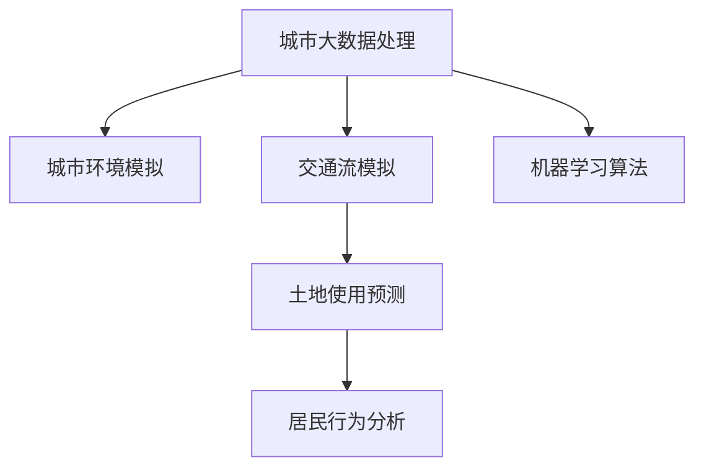

                 

# AI在智能城市规划中的应用：优化土地使用

## 1. 背景介绍

智能城市是21世纪城市发展的新趋势，其旨在通过集成先进的信息技术、物联网技术、大数据和人工智能(AI)，实现城市运营的智能化、高效化，提升居民生活质量和城市管理水平。而土地使用是城市规划中最为核心的内容之一，其合理性直接决定了城市的可持续发展能力。

传统的土地使用规划主要依赖专家经验和统计数据，难以应对快速变化的城市环境和人口需求。随着AI技术的发展，利用大数据、机器学习等技术，对城市土地使用进行智能化规划，成为可能。

本节将介绍如何运用AI技术，特别是机器学习算法，优化智能城市规划中的土地使用。

## 2. 核心概念与联系

### 2.1 核心概念概述

在智能城市规划中，AI的应用可以分为多个层面：

- **城市大数据处理**：通过整合各类数据源，建立城市数据仓库，提取有用的信息。
- **城市环境模拟**：通过三维模型和仿真技术，预测城市环境变化，辅助规划决策。
- **交通流模拟**：利用机器学习算法，分析交通流量和趋势，优化交通布局。
- **土地使用预测**：基于历史和实时数据，运用AI算法预测未来土地使用趋势，优化土地资源分配。
- **居民行为分析**：通过AI技术，分析居民出行模式和需求，提供个性化的城市服务。

这些技术互相协作，共同支撑智能城市的运营和管理。其中，土地使用预测是实现智能规划的关键环节之一，本节将重点探讨AI在土地使用预测中的应用。

### 2.2 核心概念原理和架构的 Mermaid 流程图



该图展示了智能城市规划中各环节的联系，其中，机器学习算法（F）是实现土地使用预测（D）的核心技术。

## 3. 核心算法原理 & 具体操作步骤

### 3.1 算法原理概述

土地使用预测是一个典型的回归问题，其目标是根据历史数据和特征，预测未来某一时间点的土地使用情况。常见的回归算法包括线性回归、随机森林、梯度提升树等，这些算法通过学习数据特征，构建预测模型。

### 3.2 算法步骤详解

土地使用预测的步骤主要包括：

1. **数据收集与预处理**：收集土地使用相关的历史数据，如土地类型、人口密度、商业分布等，并进行清洗和归一化处理。
2. **特征工程**：从收集的数据中提取有用的特征，如土地面积、交通便利度、周边设施等。
3. **模型选择与训练**：选择合适的回归算法，如随机森林、XGBoost等，在训练集上训练模型。
4. **模型评估与调优**：使用验证集评估模型性能，根据评估结果调整模型参数，提高预测准确率。
5. **模型部署与应用**：将训练好的模型部署到生产环境中，用于实时预测土地使用情况。

### 3.3 算法优缺点

土地使用预测的机器学习算法具有以下优点：

- **高效性**：机器学习算法能够自动学习数据特征，识别出对土地使用有重要影响的因素。
- **适应性强**：机器学习模型可以适应不同规模和复杂度的数据，适合多种应用场景。
- **可解释性**：一些常用的算法（如随机森林、梯度提升树）提供了特征重要性等可解释性信息，帮助理解模型的决策过程。

缺点如下：

- **数据依赖**：算法的性能高度依赖于数据的质量和特征的完备性。
- **模型解释性不足**：复杂的机器学习模型（如深度学习）可能缺乏可解释性，难以解释模型的预测结果。
- **过度拟合风险**：在数据量不足的情况下，模型容易过拟合，影响预测准确率。

### 3.4 算法应用领域

土地使用预测的算法应用广泛，包括但不限于以下几个领域：

- **城市规划**：辅助城市规划师进行土地使用分配，优化城市空间结构。
- **房地产投资**：预测土地价值，帮助投资者决策。
- **环境保护**：预测生态用地分布，保护自然资源。
- **应急响应**：预测灾害发生概率，优化救援资源配置。

## 4. 数学模型和公式 & 详细讲解 & 举例说明

### 4.1 数学模型构建

土地使用预测的数学模型可以表示为：

$$ y = f(x) + \epsilon $$

其中，$y$ 表示土地使用情况，$f(x)$ 为回归函数，$x$ 为输入特征，$\epsilon$ 为随机噪声。

常见的回归函数包括线性函数、多项式函数、指数函数等。例如，线性回归模型可以表示为：

$$ y = \beta_0 + \beta_1 x_1 + \beta_2 x_2 + ... + \beta_n x_n + \epsilon $$

### 4.2 公式推导过程

以线性回归模型为例，推导过程如下：

1. 假设数据集 $D = \{(x_i, y_i)\}_{i=1}^N$，其中 $x_i = (x_{i1}, x_{i2}, ..., x_{in})$，$y_i$ 为土地使用情况。
2. 计算各特征的均值 $\bar{x}_i$ 和方差 $s_i^2$。
3. 计算特征与目标变量之间的协方差 $Cov(x,y)$。
4. 根据最小二乘法，求解回归系数 $\beta_i$。
5. 将回归系数代入模型公式，得到回归函数 $f(x)$。
6. 使用测试集验证模型性能。

### 4.3 案例分析与讲解

假设我们收集了某城市过去5年的土地使用数据，包括土地面积、人口密度、交通便利度等特征。利用线性回归模型，预测未来1年的土地使用情况。

首先，我们需要对数据进行清洗和预处理，去除异常值和缺失值，并进行归一化处理。然后，提取特征并计算回归系数，得到线性回归模型。

在训练集上训练模型后，使用验证集评估模型性能，得到MAE（均方误差）、RMSE（均方根误差）等指标。如果模型表现不佳，可以调整特征选择、参数设置等，再次训练和评估，直至满足要求。

最后，将模型部署到生产环境中，用于实时预测土地使用情况。在实际应用中，还需要对模型进行监控和维护，定期更新模型参数，保持预测的准确性。

## 5. 项目实践：代码实例和详细解释说明

### 5.1 开发环境搭建

- **Python环境**：安装Python 3.8及以上版本，使用Anaconda或Miniconda搭建开发环境。
- **数据处理**：使用Pandas库进行数据清洗和预处理。
- **特征工程**：使用Scikit-learn库进行特征选择和转换。
- **模型训练**：使用Scikit-learn和XGBoost库训练模型，选择合适的方法进行回归预测。
- **模型评估**：使用Scikit-learn库进行模型评估和调优。

### 5.2 源代码详细实现

```python
import pandas as pd
from sklearn.model_selection import train_test_split
from sklearn.preprocessing import StandardScaler
from sklearn.linear_model import LinearRegression
from sklearn.metrics import mean_squared_error
from xgboost import XGBRegressor

# 数据加载与预处理
data = pd.read_csv('land_use_data.csv')
data = data.dropna()

# 特征选择
features = ['land_area', 'population_density', 'traffic_accessibility', 'nearby_facilities']
X = data[features]
y = data['land_use']

# 数据标准化
scaler = StandardScaler()
X_scaled = scaler.fit_transform(X)

# 模型训练与评估
X_train, X_test, y_train, y_test = train_test_split(X_scaled, y, test_size=0.2, random_state=42)
lr_model = LinearRegression()
lr_model.fit(X_train, y_train)
lr_pred = lr_model.predict(X_test)
lr_mae = mean_squared_error(y_test, lr_pred)
print(f'Linear Regression MAE: {lr_mae}')

xgb_model = XGBRegressor()
xgb_model.fit(X_train, y_train)
xgb_pred = xgb_model.predict(X_test)
xgb_mae = mean_squared_error(y_test, xgb_pred)
print(f'XGBoost MAE: {xgb_mae}')
```

### 5.3 代码解读与分析

- **数据加载与预处理**：使用Pandas库读取数据，并去除缺失值和异常值，保证数据的质量。
- **特征选择**：选择与土地使用相关的特征，如土地面积、人口密度等，构建输入特征矩阵。
- **数据标准化**：使用StandardScaler对特征进行标准化处理，避免不同特征尺度对模型训练的影响。
- **模型训练与评估**：使用LinearRegression和XGBRegressor对数据进行模型训练，并使用均方误差评估模型性能。
- **模型部署**：将训练好的模型部署到生产环境中，用于实时预测土地使用情况。

## 6. 实际应用场景

### 6.1 智能城市规划

智能城市规划中，土地使用预测可以用于以下几个方面：

- **城市空间布局**：根据土地使用预测结果，优化城市空间布局，提高土地利用效率。
- **基础设施建设**：预测交通、水利等基础设施需求，提前规划建设。
- **资源配置**：预测人口分布，合理配置教育、医疗等公共资源。

### 6.2 房地产投资

房地产投资中，土地使用预测可以用于以下几个方面：

- **市场趋势预测**：预测不同区域的土地价值变化趋势，帮助投资者决策。
- **风险评估**：预测土地使用变化，评估投资风险。
- **价格预测**：预测土地市场价格，制定合理的价格策略。

### 6.3 环境保护

环境保护中，土地使用预测可以用于以下几个方面：

- **生态用地规划**：预测生态用地的分布，保护自然资源。
- **污染控制**：预测工业用地分布，优化污染源治理。
- **绿色发展**：预测绿色用地需求，推动可持续发展。

### 6.4 未来应用展望

随着AI技术的不断进步，土地使用预测将呈现以下几个趋势：

- **深度学习应用**：使用深度学习模型，如神经网络、卷积神经网络等，提升预测准确率。
- **多模态数据融合**：融合卫星遥感、无人机图像等多种数据源，提升预测精度。
- **实时预测与动态调整**：使用在线学习算法，实时更新模型，应对城市环境变化。

## 7. 工具和资源推荐

### 7.1 学习资源推荐

- **书籍**：《机器学习实战》、《Python深度学习》等，系统介绍机器学习算法和实践。
- **在线课程**：Coursera、edX等平台的机器学习课程，提供丰富的学习资源。
- **博客**：Kaggle、Medium等平台的机器学习博客，分享最新的研究进展和应用案例。

### 7.2 开发工具推荐

- **编程语言**：Python，语言简单易用，拥有丰富的机器学习库和工具。
- **机器学习库**：Scikit-learn、TensorFlow、PyTorch等，提供丰富的算法实现和优化工具。
- **可视化工具**：Matplotlib、Seaborn等，用于数据可视化和模型评估。

### 7.3 相关论文推荐

- **深度学习论文**：《Deep Learning》、《Neural Networks and Deep Learning》等，深入介绍深度学习算法。
- **机器学习论文**：《Pattern Recognition and Machine Learning》、《The Elements of Statistical Learning》等，介绍机器学习算法和理论。
- **智能城市论文**：《Smart Cities: Big Data, Artificial Intelligence and the Future of Urban Computing》等，介绍智能城市中的AI应用。

## 8. 总结：未来发展趋势与挑战

### 8.1 研究成果总结

土地使用预测的AI应用在智能城市规划中发挥了重要作用，帮助优化土地资源分配，提升城市管理水平。主要研究成果包括：

- **数据处理技术**：开发高效的数据清洗和预处理算法，保证数据质量。
- **特征工程方法**：提取有用的特征，优化特征选择，提升模型性能。
- **机器学习算法**：应用多种回归算法，提高预测准确率。
- **模型部署与应用**：实现模型的高效部署，提供实时预测服务。

### 8.2 未来发展趋势

土地使用预测的未来发展趋势包括：

- **深度学习应用**：使用深度学习模型，提升预测精度。
- **多模态数据融合**：融合多种数据源，提升预测精度。
- **实时预测与动态调整**：使用在线学习算法，应对城市环境变化。

### 8.3 面临的挑战

土地使用预测面临的挑战包括：

- **数据质量问题**：数据缺失、异常值等会影响预测准确性。
- **模型复杂度问题**：深度学习模型复杂度较高，难以解释模型决策过程。
- **计算资源问题**：深度学习模型计算量大，需要高性能硬件支持。

### 8.4 研究展望

未来的研究方向包括：

- **多模态数据融合**：融合多种数据源，提升预测精度。
- **实时预测与动态调整**：使用在线学习算法，应对城市环境变化。
- **模型解释性增强**：开发可解释性强的模型，提高决策透明度。

## 9. 附录：常见问题与解答

**Q1: 数据收集和预处理的重要性？**

A: 数据收集和预处理是土地使用预测的关键步骤。良好的数据质量是模型性能的基础。数据清洗和预处理可以去除异常值、填补缺失值，标准化数据，减少噪声干扰，提高模型的预测准确性。

**Q2: 特征工程对模型性能的影响？**

A: 特征工程对模型性能有重要影响。选择有意义的特征，并进行合适的特征转换，可以提高模型的泛化能力和预测准确性。例如，使用标准化、归一化等方法，可以使模型更加稳健。

**Q3: 模型选择对预测结果的影响？**

A: 模型选择对预测结果有重要影响。不同的回归模型具有不同的优缺点，选择合适的模型可以提高预测准确性。例如，深度学习模型在复杂数据上表现更好，但需要更多的计算资源。

**Q4: 模型评估与调优的意义？**

A: 模型评估与调优是提高模型性能的重要步骤。通过评估模型性能，可以找到模型的优缺点，并进行优化。例如，调整特征选择、参数设置等，可以提高模型的泛化能力和预测准确性。

**Q5: 模型部署与应用的意义？**

A: 模型部署与应用是将模型转化为实际应用的关键步骤。通过部署模型，可以实现实时预测服务，提升城市管理的智能化水平。例如，将模型集成到城市规划系统中，可以优化土地资源分配。

---

作者：禅与计算机程序设计艺术 / Zen and the Art of Computer Programming

