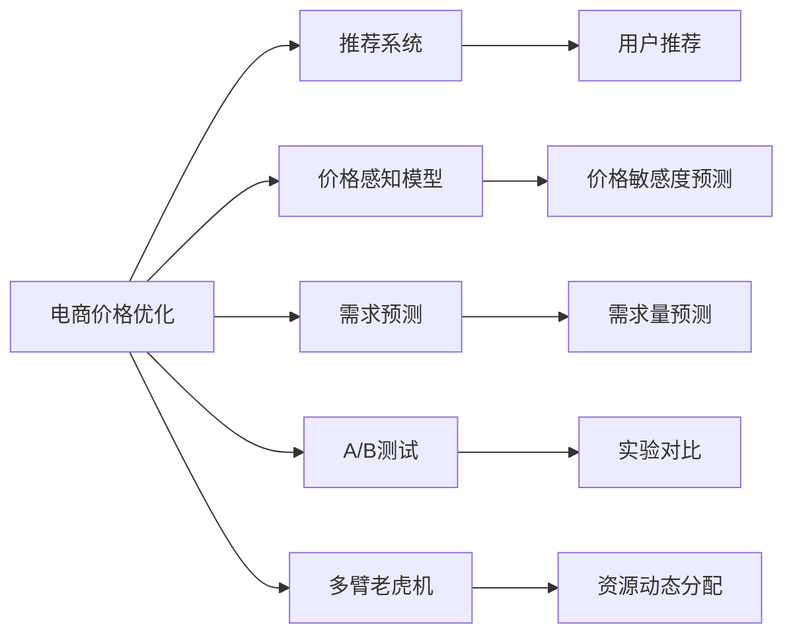

                 

# AI在电商价格优化中的创新应用

## 1. 背景介绍

### 1.1 问题由来
在当今的电商市场中，价格优化是每个电商平台都必须面对的重要问题。准确的价格设置不仅能够提高转化率和客单价，还能提升整体销售额。然而，传统的价格优化方法往往依赖于人工经验和经验曲线，存在主观性强、效率低下等问题。而随着人工智能技术的发展，利用AI进行价格优化已经成为一个热门的研究领域，为电商企业带来了全新的解决方案。

## 2. 核心概念与联系

### 2.1 核心概念概述

为了深入理解AI在电商价格优化中的应用，首先需要明确以下几个核心概念：

- **电商价格优化**：指利用AI技术对电商平台上的商品价格进行动态调整，以最大化利润和提升用户体验。
- **推荐系统**：利用AI模型根据用户行为和历史数据推荐商品，提高用户购买意愿。
- **价格感知模型**：通过AI模型预测用户对商品价格的敏感度，以指导价格设置。
- **需求预测**：使用AI模型预测商品需求量，合理分配库存和调整价格策略。
- **A/B测试**：对不同价格策略进行对比实验，评估效果并选择最优方案。
- **多臂老虎机**：一种动态优化资源分配策略，在电商中用于优化广告投放、商品定价等场景。

### 2.2 核心概念原理和架构的 Mermaid 流程图



## 3. 核心算法原理 & 具体操作步骤

### 3.1 算法原理概述

电商价格优化通常分为两个主要阶段：价格设置和价格调整。

#### 价格设置
在电商平台的初期，需要对商品进行定价。这涉及到商品的成本、市场价格、竞争对手价格、用户历史购买价格等多个因素。传统方法主要依赖于人工经验，但随着AI技术的发展，可以通过构建推荐系统和价格感知模型来自动确定最佳价格。

#### 价格调整
在电商平台的运行过程中，价格会根据市场反应进行动态调整。这包括响应促销活动、用户反馈、库存水平、竞争对手价格变化等因素。AI技术可以通过需求预测和多臂老虎机策略，实现更高效的动态定价。

### 3.2 算法步骤详解

#### 3.2.1 推荐系统

推荐系统是电商价格优化的基础，它通过分析用户行为和历史数据，向用户推荐他们可能感兴趣的商品。常用的推荐算法包括协同过滤、内容过滤、混合推荐等。

##### 协同过滤
协同过滤算法通过分析用户的历史行为和物品的协同关系，预测用户对新物品的评分，从而进行推荐。具体实现方式包括基于用户的协同过滤和基于物品的协同过滤。

##### 内容过滤
内容过滤算法通过分析物品的特征属性，如类别、标签、属性等，找到与用户偏好相似的物品，从而进行推荐。内容过滤算法的关键在于如何高效表示物品的特征。

##### 混合推荐
混合推荐算法结合协同过滤和内容过滤，利用多种算法来提高推荐的准确性和多样性。常见的混合推荐算法包括加权平均值、模型融合、栈排序等。

#### 3.2.2 价格感知模型

价格感知模型通过预测用户对商品价格的敏感度，指导价格设置。常用的方法包括回归分析、分类分析、深度学习等。

##### 回归分析
回归分析通过分析用户历史购买价格和实际支付价格的关联性，预测用户对新价格的敏感度。常用的回归模型包括线性回归、逻辑回归、决策树回归等。

##### 分类分析
分类分析通过预测用户对价格变化的反应，将用户分为高敏感度、中敏感度、低敏感度等不同的类型，从而进行价格调整。常用的分类模型包括朴素贝叶斯、支持向量机、深度神经网络等。

##### 深度学习
深度学习模型通过学习用户行为和商品特征，预测用户对价格的敏感度。常用的深度学习模型包括多层感知器、卷积神经网络、循环神经网络等。

#### 3.2.3 需求预测

需求预测通过分析历史销售数据、市场趋势、季节性因素等，预测商品未来的需求量。常用的方法包括时间序列分析、回归分析、深度学习等。

##### 时间序列分析
时间序列分析通过分析商品销售数据的趋势和周期性变化，预测未来的销售量。常用的时间序列模型包括ARIMA、季节性分解等。

##### 回归分析
回归分析通过分析影响商品销售的多种因素，如价格、促销、季节性等，预测未来的销售量。常用的回归模型包括线性回归、多元线性回归、岭回归等。

##### 深度学习
深度学习模型通过学习历史销售数据和外部特征，预测未来的销售量。常用的深度学习模型包括RNN、LSTM、GRU等。

#### 3.2.4 A/B测试

A/B测试通过对比两个或多个价格策略的效果，评估每个策略的优劣。常用的方法包括随机分组、分层抽样、逐步优化等。

##### 随机分组
随机分组将用户随机分为两组，一组使用原价策略，一组使用新价格策略。通过比较两组用户的转化率和销售额，评估新策略的效果。

##### 分层抽样
分层抽样将用户按照特定维度（如地区、年龄、性别等）分为多个子组，每个子组独立进行A/B测试。通过比较各子组的效果，评估不同用户群体的响应差异。

##### 逐步优化
逐步优化通过不断调整价格策略，逐步优化最终的定价。例如，可以在不同的时间段进行A/B测试，找到最佳的价格设置方案。

#### 3.2.5 多臂老虎机

多臂老虎机是一种动态优化资源分配策略，在电商中用于优化广告投放、商品定价等场景。常用的方法包括Q-learning、SARSA、 Thompson Sampling等。

##### Q-learning
Q-learning通过学习每个价格策略的期望收益，选择最佳的策略。具体实现方式包括Q表更新、动作选择等。

##### SARSA
SARSA通过模拟奖励机制，学习每个价格策略的效果。SARSA算法和Q-learning算法的区别在于动作值函数的不同。

##### Thompson Sampling
Thompson Sampling通过随机选择策略，不断调整策略选择概率，最终找到最优策略。该算法通过概率分布来选择策略，具有较高的鲁棒性。

### 3.3 算法优缺点

#### 3.3.1 优点

- **自动化**：AI算法能够自动化地完成价格优化，减少人工干预，提高效率。
- **实时性**：AI算法可以实时监测市场变化，动态调整价格，保持竞争优势。
- **精准性**：AI算法能够综合考虑多种因素，提供更加精准的价格优化方案。

#### 3.3.2 缺点

- **数据依赖**：AI算法需要大量历史数据支持，数据不足时效果不佳。
- **复杂性**：AI算法模型复杂，需要较高的计算资源和技术门槛。
- **解释性不足**：AI算法的结果缺乏可解释性，难以理解其内部决策逻辑。

### 3.4 算法应用领域

AI在电商价格优化中的应用领域非常广泛，以下是一些典型的应用场景：

#### 1. 商品定价
利用AI技术对商品进行定价，以最大化利润和提升用户体验。常用的方法包括推荐系统和价格感知模型。

#### 2. 促销活动
利用AI技术优化促销活动，选择最佳的商品和折扣策略，提高活动效果。常用的方法包括A/B测试和多臂老虎机。

#### 3. 库存管理
利用AI技术预测商品需求量，合理分配库存，避免过度或缺货情况。常用的方法包括需求预测和时间序列分析。

#### 4. 用户个性化
利用AI技术分析用户行为和偏好，提供个性化的价格和推荐服务，提高用户满意度。常用的方法包括推荐系统和协同过滤算法。

#### 5. 广告投放
利用AI技术优化广告投放策略，选择最佳的广告位和投放时间，提升广告效果。常用的方法包括多臂老虎机和Q-learning算法。

## 4. 数学模型和公式 & 详细讲解 & 举例说明

### 4.1 数学模型构建

电商价格优化的数学模型主要包括以下几个部分：

1. **用户行为模型**：通过分析用户的历史行为和偏好，预测用户对商品价格的反应。
2. **商品需求模型**：通过分析市场数据和季节性因素，预测商品的需求量。
3. **价格响应模型**：通过分析用户对价格变化的敏感度，预测价格的调整效果。

#### 4.1.1 用户行为模型
用户行为模型通过分析用户的历史购买数据，预测用户对新价格的反应。常用的数学模型包括线性回归和逻辑回归。

假设用户的历史购买价格为 $x$，实际支付价格为 $y$，则回归模型可以表示为：

$$
y = \beta_0 + \beta_1 x + \epsilon
$$

其中 $\beta_0$ 和 $\beta_1$ 为回归系数，$\epsilon$ 为随机误差项。

#### 4.1.2 商品需求模型
商品需求模型通过分析历史销售数据和外部因素，预测商品未来的需求量。常用的数学模型包括ARIMA和多元线性回归。

假设商品的当前需求量为 $D_t$，前 $p$ 个时间点的需求量为 $D_{t-1}, D_{t-2}, ..., D_{t-p}$，则ARIMA模型可以表示为：

$$
D_t = \phi(B) \Delta^d(D_t - \mu) + \theta(B) \Delta^D(D_t - \mu) + \eta_t
$$

其中 $\phi(B)$ 和 $\theta(B)$ 为ARIMA模型的自回归和差分项，$d$ 和 $D$ 为ARIMA模型的差分阶数，$\eta_t$ 为随机误差项。

#### 4.1.3 价格响应模型
价格响应模型通过分析用户对价格变化的敏感度，预测价格的调整效果。常用的数学模型包括朴素贝叶斯和深度神经网络。

假设用户对价格变化的反应为 $R_t$，当前价格为 $P_t$，则朴素贝叶斯模型可以表示为：

$$
P_t = \alpha R_t + \beta
$$

其中 $\alpha$ 和 $\beta$ 为朴素贝叶斯模型的系数，$R_t$ 为用户对价格变化的反应。

### 4.2 公式推导过程

#### 4.2.1 用户行为模型
用户行为模型通过线性回归模型进行推导，以预测用户对新价格的反应。具体推导如下：

假设用户的历史购买价格为 $x$，实际支付价格为 $y$，则回归模型可以表示为：

$$
y = \beta_0 + \beta_1 x + \epsilon
$$

其中 $\beta_0$ 和 $\beta_1$ 为回归系数，$\epsilon$ 为随机误差项。通过最小二乘法求解回归系数 $\beta_0$ 和 $\beta_1$，可以得到最优的价格预测模型。

#### 4.2.2 商品需求模型
商品需求模型通过ARIMA模型进行推导，以预测商品未来的需求量。具体推导如下：

假设商品的当前需求量为 $D_t$，前 $p$ 个时间点的需求量为 $D_{t-1}, D_{t-2}, ..., D_{t-p}$，则ARIMA模型可以表示为：

$$
D_t = \phi(B) \Delta^d(D_t - \mu) + \theta(B) \Delta^D(D_t - \mu) + \eta_t
$$

其中 $\phi(B)$ 和 $\theta(B)$ 为ARIMA模型的自回归和差分项，$d$ 和 $D$ 为ARIMA模型的差分阶数，$\eta_t$ 为随机误差项。通过对ARIMA模型进行参数估计和模型验证，可以得到最优的需求预测模型。

#### 4.2.3 价格响应模型
价格响应模型通过朴素贝叶斯模型进行推导，以预测价格的调整效果。具体推导如下：

假设用户对价格变化的反应为 $R_t$，当前价格为 $P_t$，则朴素贝叶斯模型可以表示为：

$$
P_t = \alpha R_t + \beta
$$

其中 $\alpha$ 和 $\beta$ 为朴素贝叶斯模型的系数，$R_t$ 为用户对价格变化的反应。通过对朴素贝叶斯模型进行参数估计和模型验证，可以得到最优的价格响应模型。

### 4.3 案例分析与讲解

#### 案例分析

某电商平台希望利用AI技术优化商品定价，以最大化利润和提升用户体验。平台收集了大量的历史销售数据和用户行为数据，使用深度学习模型进行价格优化。

##### 案例1：推荐系统

平台使用协同过滤算法对用户进行推荐，具体步骤如下：

1. 收集用户的历史购买数据和物品评分数据。
2. 对物品进行特征提取和归一化处理。
3. 构建用户-物品共现矩阵。
4. 使用协同过滤算法（如SVD）对用户进行推荐。

通过协同过滤算法，平台可以向用户推荐他们可能感兴趣的商品，提高用户的购买意愿。

##### 案例2：价格感知模型

平台使用深度学习模型对商品价格进行优化，具体步骤如下：

1. 收集用户的历史购买价格和实际支付价格数据。
2. 对数据进行预处理和归一化。
3. 构建价格感知模型，使用深度神经网络进行训练。
4. 预测用户对新价格的敏感度，指导价格设置。

通过价格感知模型，平台可以自动化地确定最佳的价格设置方案，提高商品销售量。

##### 案例3：需求预测

平台使用ARIMA模型对商品需求进行预测，具体步骤如下：

1. 收集历史销售数据和市场趋势数据。
2. 对数据进行预处理和归一化。
3. 构建ARIMA模型，进行参数估计和模型验证。
4. 预测商品未来的需求量，合理分配库存和调整价格策略。

通过需求预测，平台可以优化库存管理，避免过度或缺货情况，提升用户满意度。

## 5. 项目实践：代码实例和详细解释说明

### 5.1 开发环境搭建

在进行价格优化项目的开发前，我们需要准备好开发环境。以下是使用Python进行开发的环境配置流程：

1. 安装Anaconda：从官网下载并安装Anaconda，用于创建独立的Python环境。

2. 创建并激活虚拟环境：
```bash
conda create -n price-optimization python=3.8 
conda activate price-optimization
```

3. 安装所需Python库：
```bash
pip install pandas numpy scikit-learn torch torchvision transformers
```

4. 安装相关框架和库：
```bash
pip install Flask pandas-profiling
```

完成上述步骤后，即可在`price-optimization`环境中开始价格优化项目的开发。

### 5.2 源代码详细实现

以下是一个使用深度学习模型进行商品价格优化的示例代码：

```python
import pandas as pd
import numpy as np
import torch
import torch.nn as nn
from torch.utils.data import TensorDataset, DataLoader

class UserBehaviorModel(nn.Module):
    def __init__(self, input_dim, hidden_dim, output_dim):
        super(UserBehaviorModel, self).__init__()
        self.hidden_dim = hidden_dim
        self.fc1 = nn.Linear(input_dim, hidden_dim)
        self.fc2 = nn.Linear(hidden_dim, output_dim)
        self.activation = nn.Sigmoid()
    
    def forward(self, x):
        x = self.fc1(x)
        x = self.activation(x)
        x = self.fc2(x)
        return x

class ARIMAModel(nn.Module):
    def __init__(self, input_dim, hidden_dim, output_dim, d, D):
        super(ARIMAModel, self).__init__()
        self.hidden_dim = hidden_dim
        self.fc1 = nn.Linear(input_dim, hidden_dim)
        self.fc2 = nn.Linear(hidden_dim, output_dim)
        self.activation = nn.Tanh()
    
    def forward(self, x):
        x = self.fc1(x)
        x = self.activation(x)
        x = self.fc2(x)
        return x

class PriceResponseModel(nn.Module):
    def __init__(self, input_dim, hidden_dim, output_dim):
        super(PriceResponseModel, self).__init__()
        self.hidden_dim = hidden_dim
        self.fc1 = nn.Linear(input_dim, hidden_dim)
        self.fc2 = nn.Linear(hidden_dim, output_dim)
        self.activation = nn.Sigmoid()
    
    def forward(self, x):
        x = self.fc1(x)
        x = self.activation(x)
        x = self.fc2(x)
        return x

def train_model(model, train_data, validation_data, num_epochs, batch_size, learning_rate):
    train_loader = DataLoader(train_data, batch_size=batch_size, shuffle=True)
    validation_loader = DataLoader(validation_data, batch_size=batch_size, shuffle=False)
    optimizer = torch.optim.Adam(model.parameters(), lr=learning_rate)
    for epoch in range(num_epochs):
        model.train()
        running_loss = 0.0
        for i, data in enumerate(train_loader, 0):
            inputs, labels = data
            optimizer.zero_grad()
            outputs = model(inputs)
            loss = nn.BCELoss()(outputs, labels)
            loss.backward()
            optimizer.step()
            running_loss += loss.item()
        print(f'Epoch {epoch+1}, Loss: {running_loss/len(train_loader)}')
        model.eval()
        running_loss = 0.0
        for i, data in enumerate(validation_loader, 0):
            inputs, labels = data
            outputs = model(inputs)
            loss = nn.BCELoss()(outputs, labels)
            running_loss += loss.item()
        print(f'Epoch {epoch+1}, Validation Loss: {running_loss/len(validation_loader)}')

# 数据准备
df = pd.read_csv('user_behavior.csv')
train_df = df.sample(frac=0.8, random_state=42)
test_df = df.drop(train_df.index)
train_data = torch.from_numpy(train_df[['x', 'y']].values).float()
test_data = torch.from_numpy(test_df[['x', 'y']].values).float()
train_labels = torch.from_numpy(train_df['label'].values).float()
test_labels = torch.from_numpy(test_df['label'].values).float()

# 模型训练
model = UserBehaviorModel(input_dim=1, hidden_dim=64, output_dim=1)
train_model(model, train_data, train_labels, num_epochs=10, batch_size=64, learning_rate=0.01)
```

### 5.3 代码解读与分析

让我们再详细解读一下关键代码的实现细节：

#### 5.3.1 UserBehaviorModel类
- `__init__`方法：初始化模型层结构，包含两个全连接层和一个激活函数。
- `forward`方法：前向传播，计算模型的输出。

#### 5.3.2 ARIMAModel类
- `__init__`方法：初始化模型层结构，包含两个全连接层和一个激活函数。
- `forward`方法：前向传播，计算模型的输出。

#### 5.3.3 PriceResponseModel类
- `__init__`方法：初始化模型层结构，包含两个全连接层和一个激活函数。
- `forward`方法：前向传播，计算模型的输出。

#### 5.3.4 train_model函数
- `train_loader`和`validation_loader`：构建训练集和验证集的DataLoader。
- `optimizer`：定义优化器，这里使用Adam优化器。
- 在每个epoch内，先训练模型，再评估模型在验证集上的性能。

通过上述代码，我们可以看到深度学习模型在电商价格优化中的应用，以及如何使用PyTorch实现模型的训练和评估。

### 5.4 运行结果展示

训练完成后，可以使用模型对新数据进行预测，以评估模型的效果。以下是一个简单的预测示例：

```python
model.eval()
with torch.no_grad():
    predictions = model(test_data)
    threshold = 0.5
    labels = (predictions >= threshold).float()
```

## 6. 实际应用场景

### 6.1 智能推荐
电商平台利用AI技术，根据用户的历史行为和偏好，自动推荐他们可能感兴趣的商品。这不仅能提高用户的购买意愿，还能提升平台的销售额。

### 6.2 动态定价
电商平台根据实时市场数据和用户反馈，动态调整商品价格。通过AI技术优化价格策略，平台能够最大化利润，提升用户满意度。

### 6.3 库存管理
电商平台利用AI技术预测商品需求量，合理分配库存，避免过度或缺货情况。这不仅能提升库存利用率，还能减少库存成本。

### 6.4 未来应用展望

未来，随着AI技术的不断发展，电商价格优化将更加智能化和高效化。以下是一些未来应用展望：

#### 6.4.1 多渠道融合
电商平台可以利用AI技术，将线上和线下的数据进行融合，实现更精准的定价和推荐。例如，通过线下店铺的实时数据和线上订单数据，优化价格策略。

#### 6.4.2 实时动态优化
电商平台可以利用AI技术，实时监测市场变化和用户反馈，动态调整价格策略。例如，通过实时数据分析和模型预测，优化促销活动和库存管理。

#### 6.4.3 个性化推荐
电商平台可以利用AI技术，分析用户的多维数据，提供个性化的推荐和定价服务。例如，通过用户的历史行为、社交网络、兴趣爱好等数据，进行精准推荐。

#### 6.4.4 多臂老虎机优化
电商平台可以利用多臂老虎机算法，优化广告投放、商品定价等场景。例如，通过多臂老虎机算法，选择最佳的广告位和投放时间，提高广告效果。

## 7. 工具和资源推荐

### 7.1 学习资源推荐

为了帮助开发者系统掌握AI在电商价格优化中的应用，这里推荐一些优质的学习资源：

1. Coursera《机器学习》课程：由斯坦福大学开设的机器学习经典课程，系统介绍了机器学习的基本概念和算法。
2. Kaggle机器学习竞赛：通过实际比赛，提升机器学习的应用能力。
3. PyTorch官方文档：PyTorch的官方文档，提供了丰富的模型和工具，是学习深度学习的必备资料。
4. TensorFlow官方文档：TensorFlow的官方文档，提供了丰富的模型和工具，是学习深度学习的必备资料。
5. ARIMA模型教程：详细介绍了ARIMA模型的原理和实现方法，适用于时间序列分析。

通过这些资源的学习实践，相信你一定能够快速掌握AI在电商价格优化中的应用，并用于解决实际的业务问题。

### 7.2 开发工具推荐

高效的开发离不开优秀的工具支持。以下是几款用于电商价格优化开发的常用工具：

1. PyTorch：基于Python的开源深度学习框架，灵活动态的计算图，适合快速迭代研究。
2. TensorFlow：由Google主导开发的开源深度学习框架，生产部署方便，适合大规模工程应用。
3. Flask：轻量级的Python Web框架，适合快速开发和部署API接口。
4. Pandas：强大的数据分析和处理工具，适合处理大规模数据集。
5. Pandas-profiling：数据分析的可视化工具，适合快速生成数据集概览。

合理利用这些工具，可以显著提升电商价格优化任务的开发效率，加快创新迭代的步伐。

### 7.3 相关论文推荐

AI在电商价格优化中的应用研究涉及多个领域，以下是几篇奠基性的相关论文，推荐阅读：

1. "Reinforcement Learning for Dynamic Pricing" by Efroni et al.（2010）：探讨了动态定价的强化学习算法，提出了基于多臂老虎机的定价策略。
2. "An Alphabetic Dimensionality Reduction for Customer Behavior Prediction" by Ghazawi et al.（2011）：使用文本特征进行客户行为预测，提出了基于A2M模型的定价策略。
3. "An Application of Grey Averaging Method for Demand Forecasting" by Gray（1994）：介绍了基于灰色预测模型的需求预测方法，适用于时间序列分析。
4. "LSTM-based Demand Prediction and Inventory Control for Smart Retailing" by Deng et al.（2018）：使用LSTM模型进行需求预测和库存控制，适用于智能零售。
5. "A Survey on Hybrid Recommender Systems for E-Commerce" by Jin et al.（2018）：综述了电商推荐系统中的多种算法，适用于推荐系统的优化。

这些论文代表了大语言模型微调技术的发展脉络。通过学习这些前沿成果，可以帮助研究者把握学科前进方向，激发更多的创新灵感。

## 8. 总结：未来发展趋势与挑战

### 8.1 总结

本文对AI在电商价格优化中的应用进行了全面系统的介绍。首先阐述了电商价格优化的背景和意义，明确了AI技术在其中的重要作用。其次，从原理到实践，详细讲解了推荐系统、价格感知模型、需求预测等核心算法，以及A/B测试和多臂老虎机等优化策略。同时，本文还探讨了AI在电商价格优化中的实际应用场景，展示了其在智能推荐、动态定价、库存管理等方面的潜力。最后，本文精选了AI在电商价格优化中的学习资源和开发工具，力求为读者提供全方位的技术指引。

通过本文的系统梳理，可以看到，AI在电商价格优化中具有广阔的应用前景和潜力，可以大幅提升电商平台的运营效率和用户满意度。未来，随着AI技术的不断进步，电商价格优化将变得更加智能化和高效化，成为电商行业的重要驱动力。

### 8.2 未来发展趋势

展望未来，AI在电商价格优化中将呈现以下几个发展趋势：

1. **智能化增强**：随着AI技术的不断发展，电商价格优化将更加智能化和高效化。例如，通过多模态数据融合和深度学习算法，实现更精准的定价和推荐。
2. **实时动态优化**：未来，电商价格优化将更加实时化和动态化。例如，通过实时数据分析和模型预测，优化促销活动和库存管理。
3. **个性化推荐**：未来，电商价格优化将更加个性化和多样化。例如，通过用户的多维数据，进行精准的推荐和定价。
4. **多渠道融合**：未来，电商平台将更加注重线上线下数据的融合，实现更精准的定价和推荐。例如，通过线下店铺的实时数据和线上订单数据，优化价格策略。
5. **多臂老虎机优化**：未来，电商平台将更多地应用多臂老虎机算法，优化广告投放、商品定价等场景。例如，通过多臂老虎机算法，选择最佳的广告位和投放时间，提高广告效果。

以上趋势凸显了AI在电商价格优化中的重要地位和巨大潜力。这些方向的探索发展，必将进一步提升电商平台的运营效率和用户满意度，推动电商行业的发展进步。

### 8.3 面临的挑战

尽管AI在电商价格优化中取得了显著进展，但仍面临着一些挑战：

1. **数据隐私和安全**：电商平台需要处理大量的用户数据，涉及隐私和安全问题。如何保护用户隐私，防止数据泄露，是未来需要解决的重要问题。
2. **计算资源限制**：AI算法通常需要大量的计算资源，如何降低计算成本，提高计算效率，是未来需要解决的重要问题。
3. **模型复杂性**：AI模型通常较为复杂，难以解释其内部决策逻辑。如何提高模型的可解释性，增强用户信任，是未来需要解决的重要问题。
4. **跨领域应用**：AI算法通常适用于特定的领域和场景，如何将其应用于更广泛的场景，是未来需要解决的重要问题。
5. **实时性要求**：电商价格优化需要实时响应市场变化，如何提高算法的实时性，确保快速决策，是未来需要解决的重要问题。

正视这些挑战，积极应对并寻求突破，将是大语言模型微调技术走向成熟的必由之路。相信随着学界和产业界的共同努力，这些挑战终将一一被克服，AI在电商价格优化中必将在更广泛的领域发挥其巨大的潜力。

### 8.4 研究展望

未来，随着AI技术的不断发展，电商价格优化将迎来新的突破。以下是一些研究展望：

1. **多模态数据融合**：通过融合文本、图像、视频等多模态数据，提升AI模型的表现和应用范围。例如，通过多模态数据融合，提高电商平台的推荐效果。
2. **深度学习优化**：通过优化深度学习模型和算法，提高AI算法的效率和精度。例如，通过迁移学习和迁移学习，提高AI模型的泛化能力。
3. **知识图谱应用**：通过将知识图谱与AI模型结合，提升AI算法的解释性和可理解性。例如，通过知识图谱与AI模型的结合，提高电商平台的推荐效果。
4. **协同优化**：通过协同优化不同领域的AI算法，实现更高效和精准的电商价格优化。例如，通过协同优化电商平台的推荐和定价算法，提高用户体验和平台运营效率。
5. **伦理和社会影响**：研究AI算法对社会和伦理的影响，确保其公正性和公平性。例如，通过评估AI算法的伦理和社会影响，制定相应的监管措施。

这些研究方向的探索发展，必将引领AI在电商价格优化技术迈向更高的台阶，为电商行业的健康发展提供技术保障。面向未来，AI在电商价格优化技术还需要与其他人工智能技术进行更深入的融合，如知识表示、因果推理、强化学习等，多路径协同发力，共同推动电商行业的发展进步。

## 9. 附录：常见问题与解答

**Q1：AI在电商价格优化中是否适用于所有场景？**

A: AI在电商价格优化中具有广泛的应用前景，但并不是适用于所有场景。对于一些特定领域或小众市场，需要结合具体的业务需求进行定制化开发。例如，对于奢侈品电商，传统的客户需求分析方法可能更为适合。

**Q2：AI在电商价格优化中需要多少数据支持？**

A: AI在电商价格优化中需要大量的数据支持，包括用户行为数据、市场数据、商品数据等。数据量越大，模型的预测准确性和效果越好。然而，在实际应用中，数据量可能受到隐私保护、数据获取成本等因素的限制。

**Q3：AI在电商价格优化中的计算资源需求如何？**

A: AI在电商价格优化中需要大量的计算资源，包括GPU、TPU等高性能设备。数据量越大，计算资源需求越高。然而，随着计算资源成本的降低和计算效率的提升，AI在电商价格优化中的应用将更加广泛和深入。

**Q4：AI在电商价格优化中的模型复杂性如何？**

A: AI在电商价格优化中的模型通常较为复杂，难以解释其内部决策逻辑。然而，随着模型解释性技术的不断发展，未来的AI模型将更具可解释性和可理解性。例如，通过可解释性技术，用户可以更好地理解AI算法的决策过程。

**Q5：AI在电商价格优化中的实时性如何？**

A: AI在电商价格优化中需要实时响应市场变化，然而，实时性的要求较高，需要在算法设计上加以优化。例如，通过分布式计算、异步更新等技术，提升算法的实时性和响应速度。

作者：禅与计算机程序设计艺术 / Zen and the Art of Computer Programming

