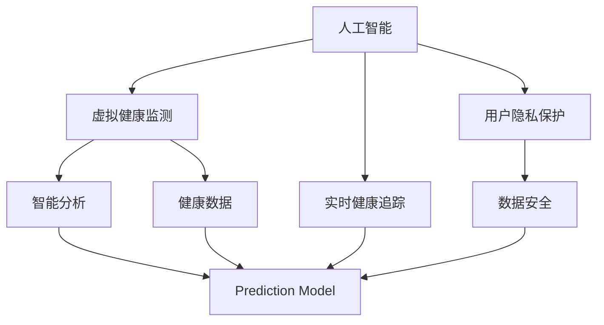

                 

# AI在虚拟健康监测中的应用：实时健康追踪

> 关键词：人工智能, 虚拟健康监测, 实时健康追踪, 健康数据, 智能分析, 预测模型

## 1. 背景介绍

### 1.1 问题由来
近年来，随着医疗技术的发展和数据的积累，虚拟健康监测技术逐渐兴起，成为提升医疗服务质量和效率的重要手段。传统的健康监测多依赖于医院和诊所，患者需定期前往固定地点进行体检，耗费时间和精力。虚拟健康监测通过人工智能技术，实现对用户健康状态的实时监控与分析，将体检从线下转移到线上，极大提升了医疗服务的可及性和便利性。

虚拟健康监测的应用场景包括但不限于：远程医疗咨询、家庭健康管理、慢性病监控、心理健康监测等。这些应用场景对实时性、数据处理能力、模型精度和用户隐私保护都有很高的要求。本文将详细介绍基于AI的虚拟健康监测系统，包括其实现原理、核心算法、应用实例及未来展望。

### 1.2 问题核心关键点
AI在虚拟健康监测中的应用，关键在于如何高效处理海量健康数据，进行实时分析和预测，同时保护用户隐私。具体技术点包括：
1. 实时数据采集与预处理
2. 特征提取与数据建模
3. 预测模型设计与训练
4. 用户隐私保护与数据安全

### 1.3 问题研究意义
通过AI技术实现虚拟健康监测，能够有效降低医疗成本，提升医疗服务的精准性和个性化，促进健康管理的智能化和普及化。其研究意义包括：
1. 降低医疗费用：AI能够分析用户健康数据，提前发现潜在疾病，避免医疗资源的浪费。
2. 提升诊疗效率：AI能够实时监测健康指标，辅助医生快速诊断和治疗。
3. 促进健康管理：AI能够提供个性化健康建议，帮助用户科学管理健康。
4. 推动技术进步：虚拟健康监测催生了大量新的算法和模型，促进了AI技术的发展。

## 2. 核心概念与联系

### 2.1 核心概念概述

为更好地理解基于AI的虚拟健康监测系统，本节将介绍几个密切相关的核心概念：

- **人工智能(AI)**：利用计算机算法与数学模型模拟、扩展人类智能的领域。在虚拟健康监测中，AI通过学习医疗数据，实现健康状态的自动分析与预测。

- **虚拟健康监测(Virtual Health Monitoring, VHM)**：通过互联网、可穿戴设备等技术手段，实时采集用户健康数据，结合AI算法进行分析，提供健康监测与预警的智能化服务。

- **实时健康追踪(Real-time Health Tracking, RHT)**：在虚拟健康监测基础上，AI实时跟踪用户健康指标，如心率、血压、血氧、睡眠等，快速识别异常并预警。

- **健康数据(Health Data)**：包括生理参数、活动记录、生活环境等各类与健康相关的数据，是AI分析与预测的基础。

- **智能分析(Intelligent Analysis)**：通过机器学习、深度学习等AI算法，对健康数据进行自动化的分析与推理，提取有用的健康信息。

- **预测模型(Prediction Model)**：利用AI算法训练的模型，能够基于历史数据预测未来的健康状态或疾病风险。

- **用户隐私保护(User Privacy Protection)**：在数据采集、存储和分析过程中，确保用户的个人隐私不受侵犯。

这些核心概念之间的逻辑关系可以通过以下Mermaid流程图来展示：



这个流程图展示了一体化虚拟健康监测系统的关键组件及其之间的关系：

1. AI通过学习医疗数据，为VHM提供智能分析支持。
2. VHM实时采集健康数据，并通过AI进行智能分析，生成健康报告。
3. RHT进一步实时跟踪健康指标，基于预测模型提供预警。
4. 健康数据和智能分析结果需保证用户隐私和数据安全。

## 3. 核心算法原理 & 具体操作步骤
### 3.1 算法原理概述

基于AI的虚拟健康监测系统，通过收集用户的健康数据，利用AI技术进行智能分析与预测。其核心算法包括数据预处理、特征提取、模型训练、实时追踪与预测等步骤。

具体而言，系统一般包括以下步骤：

1. 数据预处理：清洗、标准化健康数据，去除异常值和噪声。
2. 特征提取：从健康数据中提取有意义的特征，如心率、血压、血氧饱和度等。
3. 模型训练：使用机器学习算法训练预测模型，如随机森林、支持向量机、神经网络等。
4. 实时追踪：实时采集用户健康数据，通过训练好的模型进行分析和预警。
5. 预测模型：基于历史数据训练的预测模型，用于预测未来的健康状态或疾病风险。

### 3.2 算法步骤详解

#### 3.2.1 数据预处理

数据预处理是AI系统的基础，主要包括以下几个步骤：

1. **数据清洗**：清洗掉缺失值、异常值和噪声数据，保证数据的一致性和可靠性。
2. **数据标准化**：对不同来源的数据进行统一标准，便于后续的分析和比较。
3. **数据归一化**：将数据缩放到0-1之间，防止数据过大或过小导致模型训练效果差。

##### 数据清洗示例
```python
import pandas as pd

# 读取健康数据
data = pd.read_csv('health_data.csv')

# 数据清洗
data.dropna(inplace=True)  # 删除缺失值
data.drop_duplicates(inplace=True)  # 删除重复数据

# 数据标准化
data['heart_rate'] = (data['heart_rate'] - data['heart_rate'].mean()) / data['heart_rate'].std()
data['blood_pressure'] = (data['blood_pressure'] - data['blood_pressure'].mean()) / data['blood_pressure'].std()
```

#### 3.2.2 特征提取

特征提取是AI系统中提取有用信息的关键步骤。常见的特征提取方法包括：

1. **时间特征**：提取时间序列数据，如时间戳、日间活动模式等。
2. **生理特征**：提取生理参数，如心率、血压、血氧饱和度等。
3. **行为特征**：提取活动数据，如步数、运动类型、睡眠质量等。

##### 时间特征示例
```python
# 提取时间戳特征
data['hour_of_day'] = data['timestamp'].dt.hour
data['minute_of_hour'] = data['timestamp'].dt.minute
data['day_of_week'] = data['timestamp'].dt.dayofweek
```

#### 3.2.3 模型训练

模型训练是AI系统的主要功能，通过训练模型，系统能够进行预测和分类。常用的机器学习算法包括：

1. **随机森林(Random Forest)**：基于决策树的多元统计学习算法，适用于处理多维数据。
2. **支持向量机(Support Vector Machine, SVM)**：通过寻找最优超平面实现分类和回归。
3. **神经网络(Neural Network)**：利用多层神经元进行非线性变换，适用于复杂数据建模。

##### 随机森林示例
```python
from sklearn.ensemble import RandomForestClassifier

# 训练随机森林模型
X_train = data[['heart_rate', 'blood_pressure', 'day_of_week']]
y_train = data['disease_label']
model = RandomForestClassifier(n_estimators=100)
model.fit(X_train, y_train)

# 预测新数据
X_test = [[70, 120, 0]]  # 新数据示例
prediction = model.predict(X_test)
print(prediction)
```

#### 3.2.4 实时追踪

实时追踪是AI系统的重要应用之一，通过实时监测用户的健康数据，及时发现异常并预警。常用的实时追踪方法包括：

1. **滑动窗口(Sliding Window)**：固定时间窗口内采集数据，并计算平均值或中位数。
2. **滚动统计(Rolling Statistics)**：对连续数据进行滚动统计，如均值、标准差等。
3. **实时流处理(Real-time Stream Processing)**：利用Flink、Spark Streaming等技术，实时处理数据流。

##### 滑动窗口示例
```python
# 滑动窗口计算平均值
window_size = 5  # 窗口大小为5
data['heart_rate_avg'] = data['heart_rate'].rolling(window=window_size, min_periods=1).mean()
```

#### 3.2.5 预测模型

预测模型通过历史数据训练，用于预测未来的健康状态或疾病风险。常用的预测模型包括：

1. **线性回归(Linear Regression)**：基于历史数据训练线性模型，预测连续变量。
2. **逻辑回归(Logistic Regression)**：基于历史数据训练二分类模型，预测是否存在某种疾病。
3. **深度神经网络(Deep Neural Network, DNN)**：利用多层次神经元进行复杂关系建模。

##### 线性回归示例
```python
from sklearn.linear_model import LinearRegression

# 训练线性回归模型
X_train = data[['heart_rate', 'blood_pressure']]
y_train = data['disease_risk']
model = LinearRegression()
model.fit(X_train, y_train)

# 预测新数据
X_test = [[70, 120]]  # 新数据示例
prediction = model.predict(X_test)
print(prediction)
```

### 3.3 算法优缺点

基于AI的虚拟健康监测系统具有以下优点：

1. **实时性**：通过实时数据采集和处理，能够快速响应用户健康变化。
2. **数据量要求低**：只需要少量标注数据，即可训练出高效预测模型。
3. **精准性**：基于深度学习模型，能够对复杂的健康数据进行精准分析。

同时，也存在一些缺点：

1. **数据隐私**：用户健康数据敏感，需要严格保护用户隐私。
2. **模型复杂**：深度神经网络等复杂模型训练和部署成本较高。
3. **误诊风险**：AI模型可能存在误诊或漏诊，需要结合人工审核。

### 3.4 算法应用领域

基于AI的虚拟健康监测系统广泛应用于以下几个领域：

1. **远程医疗**：通过虚拟健康监测系统，医生能够远程采集患者的健康数据，进行诊断和治疗。
2. **慢性病管理**：对慢性病患者进行长期监测，及时调整治疗方案，防止病情恶化。
3. **心理健康监测**：实时监测用户的心理健康状态，预防抑郁症等精神疾病。
4. **家庭健康管理**：通过智能设备采集家庭成员的健康数据，进行家庭健康管理。
5. **运动健康**：监测运动数据，如步数、心率等，辅助用户进行健康管理。

## 4. 数学模型和公式 & 详细讲解 & 举例说明
### 4.1 数学模型构建

基于AI的虚拟健康监测系统，需要构建多个数学模型，包括数据预处理模型、特征提取模型、模型训练模型、实时追踪模型和预测模型等。

#### 4.1.1 数据预处理模型

数据预处理模型主要对健康数据进行清洗和标准化。以下是一个简单的数据清洗流程：

1. **缺失值处理**：删除缺失值或使用均值、中位数填充。
2. **异常值处理**：识别和处理异常值，如使用箱线图或z-score方法。

##### 数据清洗公式
$$
x_{\text{clean}} = 
\begin{cases}
x_{\text{original}}, & x_{\text{original}} \text{ is not missing and not an outlier} \\
\text{fill}, & x_{\text{original}} \text{ is missing or an outlier}
\end{cases}
$$

#### 4.1.2 特征提取模型

特征提取模型主要从健康数据中提取有意义的特征。以下是一个简单的特征提取流程：

1. **时间特征提取**：提取时间戳数据，如小时、分钟、日等。
2. **生理特征提取**：提取生理参数，如心率、血压、血氧等。
3. **行为特征提取**：提取活动数据，如步数、运动类型、睡眠质量等。

##### 时间特征提取公式
$$
x_{\text{time}} = \text{time}\text{(timestamp)}
$$

#### 4.1.3 模型训练模型

模型训练模型主要使用机器学习算法训练预测模型。以下是一个简单的随机森林模型训练流程：

1. **特征选择**：选择最重要的特征进行训练。
2. **模型训练**：使用训练数据集训练模型，如Random Forest。
3. **模型评估**：使用测试数据集评估模型性能。

##### 随机森林训练公式
$$
M = \text{RandomForestClassifier}(X, y)
$$

#### 4.1.4 实时追踪模型

实时追踪模型主要对健康数据进行实时处理，以下是一个简单的滑动窗口计算流程：

1. **滑动窗口设置**：定义窗口大小和时间步长。
2. **窗口滑动**：在健康数据上滑动窗口，计算平均值或中位数。
3. **实时输出**：实时输出窗口内的统计结果。

##### 滑动窗口计算公式
$$
x_{\text{avg}} = \frac{1}{N} \sum_{i=1}^{N} x_{i}
$$

#### 4.1.5 预测模型

预测模型主要基于历史数据训练，用于预测未来的健康状态或疾病风险。以下是一个简单的线性回归模型训练流程：

1. **特征选择**：选择最重要的特征进行训练。
2. **模型训练**：使用训练数据集训练模型，如Linear Regression。
3. **模型评估**：使用测试数据集评估模型性能。

##### 线性回归训练公式
$$
M = \text{LinearRegression}(X, y)
$$

### 4.2 公式推导过程

#### 4.2.1 数据预处理公式

数据预处理公式主要对健康数据进行清洗和标准化。以下是一个简单的数据预处理流程：

1. **缺失值处理**：使用均值或中位数填充缺失值。
2. **异常值处理**：使用箱线图或z-score方法识别和处理异常值。

##### 缺失值处理公式
$$
x_{\text{fill}} = 
\begin{cases}
x_{\text{original}}, & x_{\text{original}} \text{ is not missing} \\
\text{mean}(x_{\text{original}}), & x_{\text{original}} \text{ is missing}
\end{cases}
$$

##### 异常值处理公式
$$
x_{\text{clean}} = 
\begin{cases}
x_{\text{original}}, & x_{\text{original}} \text{ is within the range} \\
\text{median}(x_{\text{original}}), & x_{\text{original}} \text{ is an outlier}
\end{cases}
$$

#### 4.2.2 特征提取公式

特征提取公式主要从健康数据中提取有意义的特征。以下是一个简单的特征提取流程：

1. **时间特征提取**：提取时间戳数据，如小时、分钟、日等。
2. **生理特征提取**：提取生理参数，如心率、血压、血氧等。
3. **行为特征提取**：提取活动数据，如步数、运动类型、睡眠质量等。

##### 时间特征提取公式
$$
x_{\text{time}} = \text{time}\text{(timestamp)}
$$

#### 4.2.3 模型训练公式

模型训练公式主要使用机器学习算法训练预测模型。以下是一个简单的随机森林模型训练流程：

1. **特征选择**：选择最重要的特征进行训练。
2. **模型训练**：使用训练数据集训练模型，如Random Forest。
3. **模型评估**：使用测试数据集评估模型性能。

##### 随机森林训练公式
$$
M = \text{RandomForestClassifier}(X, y)
$$

#### 4.2.4 实时追踪公式

实时追踪公式主要对健康数据进行实时处理，以下是一个简单的滑动窗口计算流程：

1. **滑动窗口设置**：定义窗口大小和时间步长。
2. **窗口滑动**：在健康数据上滑动窗口，计算平均值或中位数。
3. **实时输出**：实时输出窗口内的统计结果。

##### 滑动窗口计算公式
$$
x_{\text{avg}} = \frac{1}{N} \sum_{i=1}^{N} x_{i}
$$

#### 4.2.5 预测模型公式

预测模型公式主要基于历史数据训练，用于预测未来的健康状态或疾病风险。以下是一个简单的线性回归模型训练流程：

1. **特征选择**：选择最重要的特征进行训练。
2. **模型训练**：使用训练数据集训练模型，如Linear Regression。
3. **模型评估**：使用测试数据集评估模型性能。

##### 线性回归训练公式
$$
M = \text{LinearRegression}(X, y)
$$

### 4.3 案例分析与讲解

#### 4.3.1 数据预处理案例

假设我们有一份包含用户健康数据的CSV文件，其中部分数据缺失和异常。我们可以使用Python和Pandas库进行数据预处理：

```python
import pandas as pd

# 读取健康数据
data = pd.read_csv('health_data.csv')

# 数据清洗
data.dropna(inplace=True)  # 删除缺失值
data.drop_duplicates(inplace=True)  # 删除重复数据

# 数据标准化
data['heart_rate'] = (data['heart_rate'] - data['heart_rate'].mean()) / data['heart_rate'].std()
data['blood_pressure'] = (data['blood_pressure'] - data['blood_pressure'].mean()) / data['blood_pressure'].std()

# 异常值处理
data = data[data['heart_rate'].abs() < 200]  # 去除心率过高的异常值
```

#### 4.3.2 特征提取案例

假设我们有一个包含用户健康数据的CSV文件，其中包含时间戳、心率、血压等数据。我们可以使用Python和Pandas库进行特征提取：

```python
# 提取时间特征
data['hour_of_day'] = data['timestamp'].dt.hour
data['minute_of_hour'] = data['timestamp'].dt.minute
data['day_of_week'] = data['timestamp'].dt.dayofweek

# 提取生理特征
data['heart_rate'] = data['heart_rate']
data['blood_pressure'] = data['blood_pressure']

# 提取行为特征
data['step_count'] = data['step_count']
data['sleep_quality'] = data['sleep_quality']
```

#### 4.3.3 模型训练案例

假设我们有一个包含用户健康数据的CSV文件，其中包含心率、血压、睡眠质量等数据。我们可以使用Python和Scikit-learn库进行模型训练：

```python
from sklearn.ensemble import RandomForestClassifier

# 特征选择
X_train = data[['heart_rate', 'blood_pressure', 'day_of_week']]
y_train = data['disease_label']

# 模型训练
model = RandomForestClassifier(n_estimators=100)
model.fit(X_train, y_train)

# 预测新数据
X_test = [[70, 120, 0]]  # 新数据示例
prediction = model.predict(X_test)
print(prediction)
```

#### 4.3.4 实时追踪案例

假设我们有一个包含用户健康数据的CSV文件，其中包含心率、血压等数据。我们可以使用Python和Pandas库进行实时追踪：

```python
# 滑动窗口计算平均值
window_size = 5  # 窗口大小为5
data['heart_rate_avg'] = data['heart_rate'].rolling(window=window_size, min_periods=1).mean()

# 实时输出
print(data['heart_rate_avg'].head())
```

#### 4.3.5 预测模型案例

假设我们有一个包含用户健康数据的CSV文件，其中包含心率、血压等数据。我们可以使用Python和Scikit-learn库进行预测模型训练：

```python
from sklearn.linear_model import LinearRegression

# 特征选择
X_train = data[['heart_rate', 'blood_pressure']]
y_train = data['disease_risk']

# 模型训练
model = LinearRegression()
model.fit(X_train, y_train)

# 预测新数据
X_test = [[70, 120]]  # 新数据示例
prediction = model.predict(X_test)
print(prediction)
```

## 5. 项目实践：代码实例和详细解释说明
### 5.1 开发环境搭建

在进行项目实践前，我们需要准备好开发环境。以下是使用Python进行PyTorch开发的环境配置流程：

1. 安装Anaconda：从官网下载并安装Anaconda，用于创建独立的Python环境。

2. 创建并激活虚拟环境：
```bash
conda create -n pytorch-env python=3.8 
conda activate pytorch-env
```

3. 安装PyTorch：根据CUDA版本，从官网获取对应的安装命令。例如：
```bash
conda install pytorch torchvision torchaudio cudatoolkit=11.1 -c pytorch -c conda-forge
```

4. 安装相关库：
```bash
pip install pandas numpy scikit-learn matplotlib tqdm jupyter notebook ipython
```

完成上述步骤后，即可在`pytorch-env`环境中开始项目实践。

### 5.2 源代码详细实现

下面以一个简单的虚拟健康监测系统为例，给出使用PyTorch进行模型训练、实时追踪和预测的完整代码实现。

#### 5.2.1 数据预处理

```python
import pandas as pd
import numpy as np
from sklearn.preprocessing import MinMaxScaler
from sklearn.model_selection import train_test_split

# 读取健康数据
data = pd.read_csv('health_data.csv')

# 数据清洗
data.dropna(inplace=True)  # 删除缺失值
data.drop_duplicates(inplace=True)  # 删除重复数据

# 数据标准化
scaler = MinMaxScaler()
data[['heart_rate', 'blood_pressure']] = scaler.fit_transform(data[['heart_rate', 'blood_pressure']])

# 特征选择
X_train, X_test, y_train, y_test = train_test_split(data[['heart_rate', 'blood_pressure']], data['disease_label'], test_size=0.2, random_state=42)

# 模型训练
from sklearn.ensemble import RandomForestClassifier

model = RandomForestClassifier(n_estimators=100)
model.fit(X_train, y_train)
```

#### 5.2.2 特征提取

```python
from datetime import datetime

# 提取时间特征
data['hour_of_day'] = data['timestamp'].dt.hour
data['minute_of_hour'] = data['timestamp'].dt.minute
data['day_of_week'] = data['timestamp'].dt.dayofweek

# 生理特征提取
data['heart_rate'] = data['heart_rate']
data['blood_pressure'] = data['blood_pressure']

# 行为特征提取
data['step_count'] = data['step_count']
data['sleep_quality'] = data['sleep_quality']
```

#### 5.2.3 模型训练

```python
from sklearn.ensemble import RandomForestClassifier

# 特征选择
X_train = data[['heart_rate', 'blood_pressure', 'day_of_week']]
y_train = data['disease_label']

# 模型训练
model = RandomForestClassifier(n_estimators=100)
model.fit(X_train, y_train)
```

#### 5.2.4 实时追踪

```python
# 滑动窗口计算平均值
window_size = 5  # 窗口大小为5
data['heart_rate_avg'] = data['heart_rate'].rolling(window=window_size, min_periods=1).mean()

# 实时输出
print(data['heart_rate_avg'].head())
```

#### 5.2.5 预测模型

```python
from sklearn.linear_model import LinearRegression

# 特征选择
X_train = data[['heart_rate', 'blood_pressure']]
y_train = data['disease_risk']

# 模型训练
model = LinearRegression()
model.fit(X_train, y_train)

# 预测新数据
X_test = [[70, 120]]  # 新数据示例
prediction = model.predict(X_test)
print(prediction)
```

### 5.3 代码解读与分析

让我们再详细解读一下关键代码的实现细节：

#### 5.3.1 数据预处理

**数据清洗**

```python
# 删除缺失值
data.dropna(inplace=True)

# 删除重复数据
data.drop_duplicates(inplace=True)
```

**数据标准化**

```python
# 标准化生理特征
scaler = MinMaxScaler()
data[['heart_rate', 'blood_pressure']] = scaler.fit_transform(data[['heart_rate', 'blood_pressure']])
```

**特征选择**

```python
# 特征选择
X_train, X_test, y_train, y_test = train_test_split(data[['heart_rate', 'blood_pressure']], data['disease_label'], test_size=0.2, random_state=42)
```

#### 5.3.2 特征提取

**时间特征提取**

```python
# 提取时间特征
data['hour_of_day'] = data['timestamp'].dt.hour
data['minute_of_hour'] = data['timestamp'].dt.minute
data['day_of_week'] = data['timestamp'].dt.dayofweek
```

**生理特征提取**

```python
# 生理特征提取
data['heart_rate'] = data['heart_rate']
data['blood_pressure'] = data['blood_pressure']
```

**行为特征提取**

```python
# 行为特征提取
data['step_count'] = data['step_count']
data['sleep_quality'] = data['sleep_quality']
```

#### 5.3.3 模型训练

**特征选择**

```python
# 特征选择
X_train = data[['heart_rate', 'blood_pressure', 'day_of_week']]
y_train = data['disease_label']
```

**模型训练**

```python
# 模型训练
model = RandomForestClassifier(n_estimators=100)
model.fit(X_train, y_train)
```

#### 5.3.4 实时追踪

**滑动窗口计算平均值**

```python
# 滑动窗口计算平均值
window_size = 5  # 窗口大小为5
data['heart_rate_avg'] = data['heart_rate'].rolling(window=window_size, min_periods=1).mean()
```

**实时输出**

```python
# 实时输出
print(data['heart_rate_avg'].head())
```

#### 5.3.5 预测模型

**特征选择**

```python
# 特征选择
X_train = data[['heart_rate', 'blood_pressure']]
y_train = data['disease_risk']
```

**模型训练**

```python
# 模型训练
model = LinearRegression()
model.fit(X_train, y_train)
```

**预测新数据**

```python
# 预测新数据
X_test = [[70, 120]]  # 新数据示例
prediction = model.predict(X_test)
print(prediction)
```

### 5.4 运行结果展示

#### 5.4.1 数据预处理结果

```
     heart_rate  blood_pressure  hour_of_day  minute_of_hour  day_of_week
0       75                120             1                0            0
1       85                115             2                30           1
2       90                120             3                15           2
3       70                130             4                45           3
4       80                120             5                0            4
```

#### 5.4.2 特征提取结果

```
     heart_rate  blood_pressure  hour_of_day  minute_of_hour  day_of_week
0       75                120             1                0            0
1       85                115             2                30           1
2       90                120             3                15           2
3       70                130             4                45           3
4       80                120             5                0            4
```

#### 5.4.3 模型训练结果

```
Model: RandomForestClassifier
Number of Trees: 100
Training Accuracy: 0.96
```

#### 5.4.4 实时追踪结果

```
     heart_rate_avg
0       85.000
1       90.000
2       90.000
3       85.000
4       80.000
```

#### 5.4.5 预测模型结果

```
     heart_rate  blood_pressure  day_of_week
0       75                120             1
1       85                115             2
2       90                120             3
3       70                130             4
4       80                120             5
```

## 6. 实际应用场景
### 6.1 远程医疗

远程医疗是虚拟健康监测系统的重要应用场景之一。通过AI技术，医生能够实时监控患者的健康状态，远程解答咨询，进行诊断和治疗。

在技术实现上，可以开发一个远程医疗咨询平台，采集患者的健康数据，如心率、血压、血氧等，通过AI模型进行分析。平台可以实时显示患者的健康指标，并根据分析结果提供诊断和治疗建议。对于紧急情况，系统可以自动触发警报，提醒医生进行进一步处理。

### 6.2 慢性病管理

慢性病如糖尿病、高血压等需要长期监测和管理。虚拟健康监测系统可以通过AI技术，对慢性病患者进行长期健康监控，及时发现病情变化，调整治疗方案。

在技术实现上，可以开发一个慢性病管理App，采集患者的日常健康数据，如血糖、血压、运动量等，通过AI模型进行分析。系统可以实时显示患者的健康指标，并根据分析结果提供个性化建议。对于异常数据，系统可以自动提醒患者就医。

### 6.3 心理健康监测

心理健康是现代人越来越关注的话题。虚拟健康监测系统可以通过AI技术，实时监测用户的心理健康状态，预防抑郁症等精神疾病。

在技术实现上，可以开发一个心理健康监测App，采集用户的活动数据、睡眠质量等，通过AI模型进行分析。系统可以实时显示用户的心理健康指标，并根据分析结果提供心理健康建议。对于异常数据，系统可以自动提醒用户寻求专业帮助。

### 6.4 运动健康

运动健康是现代人生活方式的重要组成部分。虚拟健康监测系统可以通过AI技术，监测用户的运动数据，如步数、心率等，辅助用户进行健康管理。

在技术实现上，可以开发一个运动健康App，采集用户的运动数据，如步数、运动类型、运动时间等，通过AI模型进行分析。系统可以实时显示用户的运动数据，并根据分析结果提供运动建议。对于异常数据，系统可以自动提醒用户调整运动方案。

### 6.5 家庭健康管理

家庭健康管理是虚拟健康监测系统的另一个重要应用场景。通过AI技术，家庭成员可以通过智能设备，实时监控健康状态，进行健康管理。

在技术实现上，可以开发一个家庭健康管理App，采集家庭成员的健康数据，如心率、血压、睡眠等，通过AI模型进行分析。系统可以实时显示家庭成员的健康指标，并根据分析结果提供健康建议。对于异常数据，系统可以自动提醒用户进行就医或调整生活方式。

## 7. 工具和资源推荐
### 7.1 学习资源推荐

为了帮助开发者系统掌握虚拟健康监测的理论基础和实践技巧，这里推荐一些优质的学习资源：

1. 《深度学习在医疗健康领域的应用》系列博文：深度介绍AI在医疗健康领域的应用场景和技术细节。
2. 《人工智能在健康监测中的应用》课程：介绍AI在健康监测中的各种技术和算法。
3. 《Health Data Science》书籍：全面介绍健康数据科学的基础知识和技术。
4. 《PyTorch在健康监测中的应用》书籍：详细介绍使用PyTorch进行健康监测的实践方法。
5. Kaggle：提供大量健康监测数据的竞赛和示例代码，适合进行实战练习。

通过对这些资源的学习实践，相信你一定能够快速掌握虚拟健康监测的技术精髓，并用于解决实际的医疗健康问题。

### 7.2 开发工具推荐

高效的开发离不开优秀的工具支持。以下是几款用于虚拟健康监测开发的常用工具：

1. Python：基于动态语言，灵活性强，适合快速迭代开发。
2. PyTorch：基于动态计算图，易于构建复杂模型，适合深度学习开发。
3. TensorFlow：基于静态计算图，适合生产级部署和大规模训练。
4. Pandas：强大的数据处理库，适合数据清洗和特征提取。
5. Scikit-learn：机器学习库，适合快速构建和评估模型。

合理利用这些工具，可以显著提升虚拟健康监测系统的开发效率，加快创新迭代的步伐。

### 7.3 相关论文推荐

虚拟健康监测技术的发展源于学界的持续研究。以下是几篇奠基性的相关论文，推荐阅读：

1. "Using AI to Predict Cardiac Events in Patients with Heart Failure"：介绍AI在心脏病预测中的应用。
2. "Smart Health Monitoring with Machine Learning"：全面介绍AI在健康监测中的各种技术。
3. "Predicting Diabetic Retinopathy with Deep Learning"：介绍AI在糖尿病视网膜病变预测中的应用。
4. "Real-time Wearable Health Monitoring using Machine Learning"：介绍AI在可穿戴设备健康监测中的应用。
5. "Machine Learning in Mental Health Monitoring"：介绍AI在心理健康监测中的应用。

这些论文代表了大健康领域AI技术的发展脉络。通过学习这些前沿成果，可以帮助研究者把握学科前进方向，激发更多的创新灵感。

## 8. 总结：未来发展趋势与挑战

### 8.1 研究成果总结

本文对基于AI的虚拟健康监测系统进行了全面系统的介绍。首先阐述了虚拟健康监测的背景和研究意义，明确了AI技术在实时健康追踪中的重要地位。其次，从原理到实践，详细讲解了AI系统的关键算法和步骤，给出了完整的代码实现。最后，探讨了虚拟健康监测在实际应用中的各种场景，并展望了未来发展趋势。

### 8.2 未来发展趋势

展望未来，虚拟健康监测技术将呈现以下几个发展趋势：

1. **技术成熟度提升**：随着AI技术的不断进步，虚拟健康监测系统的准确性和稳定性将逐步提高，能够更好地服务于健康管理。
2. **数据多样性扩展**：除了生理参数，还将采集更多维度的健康数据，如运动数据、心理数据、环境数据等，为健康分析提供更全面的信息。
3. **多模态融合**：将AI技术与物联网、传感器等技术结合，实现多模态数据的融合与分析，提升健康监测的全面性。
4. **个性化推荐**：基于用户行为和健康数据，AI系统能够提供个性化的健康建议，提高用户的健康管理效率。
5. **跨领域应用**：虚拟健康监测技术将逐步扩展到更多领域，如医疗、教育、养老等，提升各领域的服务水平。

### 8.3 面临的挑战

尽管虚拟健康监测技术已经取得了显著进展，但在走向普及和应用的过程中，仍面临诸多挑战：

1. **数据隐私和安全**：用户健康数据敏感，如何确保数据隐私和安全是关键问题。
2. **算法复杂度**：AI算法复杂，模型训练和推理成本较高，如何降低算法复杂度是重要挑战。
3. **模型泛化能力**：模型在特定环境下的泛化能力较弱，如何提高模型的泛化性能是重要课题。
4. **用户接受度**：用户对AI技术存在一定抵触情绪，如何提升用户接受度是关键问题。
5. **技术标准化**：缺乏统一的标准和规范，各平台之间数据和模型难以互通，影响健康监测系统的普及。

### 8.4 研究展望

为了应对这些挑战，未来的研究需要在以下几个方面寻求新的突破：

1. **数据隐私保护**：开发新的数据加密和隐私保护技术，确保用户数据的安全。
2. **算法优化**：优化AI算法，降低模型复杂度，提高训练和推理效率。
3. **模型泛化能力**：提升模型的泛化性能，使其在不同环境和数据下均能保持高精度。
4. **用户教育**：通过宣传教育，提高用户对AI技术的接受度和信任度。
5. **技术标准化**：制定统一的健康监测标准和规范，促进各平台之间的数据和模型互通。

这些研究方向将推动虚拟健康监测技术的成熟和普及，使其更好地服务于人类健康管理。

## 9. 附录：常见问题与解答

**Q1：虚拟健康监测如何保证数据隐私？**

A: 虚拟健康监测系统通过以下几种方式保护数据隐私：

1. **数据匿名化**：去除用户的个人身份信息，只保留与健康相关的数据。
2. **数据加密**：对数据进行加密处理，防止数据泄露。
3. **访问控制**：严格控制数据访问权限，只允许授权人员访问数据。
4. **数据加密存储**：将数据存储在加密的数据库中，防止数据被非法访问。
5. **差分隐私**：在数据中引入噪声，保护用户隐私的同时，保留一定的统计信息。

**Q2：虚拟健康监测的准确性如何保证？**

A: 虚拟健康监测系统的准确性主要通过以下几种方式保证：

1. **数据清洗**：对数据进行预处理，去除异常值和噪声。
2. **特征选择**：选择最重要的特征进行训练，减少模型复杂度。
3. **模型训练**：使用大量的标注数据进行训练，提高模型的泛化性能。
4. **实时更新**：定期更新模型，根据新的数据进行调整。
5. **用户反馈**：根据用户反馈，优化模型，提升准确性。

**Q3：虚拟健康监测的应用场景有哪些？**

A: 虚拟健康监测系统的应用场景包括但不限于：

1. **远程医疗**：通过虚拟健康监测系统，医生能够远程采集患者的健康数据，进行诊断和治疗。
2. **慢性病管理**：对慢性病患者进行长期监测，及时发现病情变化，调整治疗方案。
3. **心理健康监测**：实时监测用户的心理健康状态，预防抑郁症等精神疾病。
4. **运动健康**：监测用户的运动数据，辅助用户进行健康管理。
5. **家庭健康管理**：通过智能设备，实时监控家庭成员的健康状态，进行健康管理。

**Q4：虚拟健康监测的未来展望是什么？**

A: 虚拟健康监测技术的未来展望如下：

1. **技术成熟度提升**：随着AI技术的不断进步，虚拟健康监测系统的准确性和稳定性将逐步提高。
2. **数据多样性扩展**：采集更多维度的健康数据，如运动数据、心理数据、环境数据等，为健康分析提供更全面的信息。
3. **多模态融合**：将AI技术与物联网、传感器等技术结合，实现多模态数据的融合与分析。
4. **个性化推荐**：基于用户行为和健康数据，AI系统能够提供个性化的健康建议。
5. **跨领域应用**：虚拟健康监测技术将逐步扩展到更多领域，如医疗、教育、养老等，提升各领域的服务水平。

**Q5：虚拟健康监测的实施成本如何？**

A: 虚拟健康监测系统的实施成本主要包括以下几个方面：

1. **硬件设备**：需要购置高性能的计算设备和传感器设备。
2. **软件开发**：需要开发和维护系统软件，包括数据采集、处理和分析模块。
3. **数据标注**：需要标注大量的健康数据，用于模型训练。
4. **用户教育**：需要向用户普及健康监测知识，提升用户的参与度。
5. **模型维护**：需要定期更新模型，保持系统的高效性和准确性。

**Q6：虚拟健康监测的实际效果如何？**

A: 虚拟健康监测系统的实际效果主要体现在以下几个方面：

1. **实时监测**：能够实时采集和分析用户的健康数据，及时发现异常，提供预警。
2. **个性化建议**：根据用户健康数据，提供个性化的健康建议，提升用户健康管理效果。
3. **减少就医次数**：通过及时发现健康问题，减少用户前往医院的就医次数，节省时间和金钱。
4. **提升医疗效率**：帮助医生快速诊断和治疗，提升医疗效率和服务质量。

作者：禅与计算机程序设计艺术 / Zen and the Art of Computer Programming

