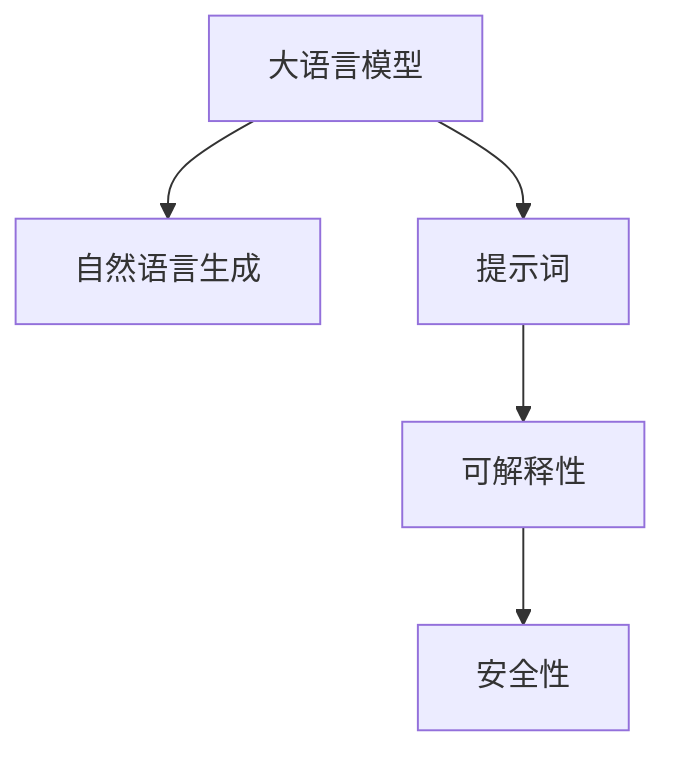

                 

# AI大模型Prompt提示词最佳实践：像人一样自然回答问题

> 关键词：AI大模型, Prompt, 提示词, 自然语言生成, 对话系统, 模型性能, 可解释性, 安全性

## 1. 背景介绍

### 1.1 问题由来

在人工智能(AI)的众多应用中，自然语言处理(NLP)领域的技术进步最为引人瞩目。大模型如BERT、GPT-3、T5等，已经在文本分类、语言翻译、对话系统等任务上取得了突破性进展。但随着大模型在实际应用场景中的推广，人们发现一个重要的问题：模型输出的自然流畅性和可解释性不足，往往难以匹配人类的交流方式和逻辑。

以对话系统为例，传统基于规则或模板的对话方法难以处理复杂多变的用户问题。相比之下，基于深度学习的对话系统具有更强的自适应能力，能够对用户意图进行理解，并生成符合语境的回答。但即便如此，由于大模型往往缺乏足够的语境理解和知识积累，其生成的对话也存在逻辑不清、生硬不自然等问题，难以达到人类水平。

因此，为了提高大语言模型生成对话的流畅性和自然度，提示词(Prompt)技术应运而生。提示词是一种精心设计的输入格式，用于引导模型按照特定方式输出。通过合理设计提示词，大模型可以在生成回答时，融入更多语境信息，生成更加自然、准确、具有逻辑性的文本。

### 1.2 问题核心关键点

提示词技术之所以有效，关键在于能够将先验知识和上下文信息整合进模型的生成过程，提升生成文本的质量和可解释性。以下是提示词技术的关键点：

- **上下文嵌入(Context Embedding)**：提示词通过向模型输入上下文信息，帮助模型理解当前的对话环境，生成更符合语境的回答。
- **知识注入(Knowledge Injection)**：提示词可以引入先验知识库，增强模型对特定领域词汇的理解，生成更加专业化的回答。
- **逻辑引导(Logic Guidance)**：通过结构化提示词，引导模型按照一定的逻辑顺序进行推理，生成逻辑严密的对话。
- **语用规则(Utterance Rule)**：提示词可以引入语言学规则，如时态、语气等，使生成文本符合语言习惯。
- **个性化定制(Customization)**：提示词可以根据不同的用户、应用场景进行个性化设计，提升系统灵活性。

这些关键点共同构成了提示词技术的基础，使得大语言模型能够更自然地与用户进行交流，解决传统对话系统的种种不足。

### 1.3 问题研究意义

提示词技术通过设计合理的输入格式，可以极大提升大语言模型的自然语言生成能力，使其更加贴近人类交流方式。在实际应用中，如智能客服、智能助手、人机对话等场景，提示词技术能够显著提升用户体验，降低人机交互的难度和成本。

提示词技术的研究和应用，对于推动大语言模型技术的发展，构建更加自然、智能的交流系统，具有重要意义：

1. **提升对话流畅性**：通过引入上下文和知识，模型能够生成更自然、更符合语境的回答。
2. **增强系统可解释性**：提示词中的结构和规则，能够帮助用户理解和监督模型的行为。
3. **提高模型鲁棒性**：通过多样化提示词设计，模型能够更好地处理不同的用户输入和应用场景。
4. **支持个性化服务**：提示词可以按照不同的用户需求进行定制，满足个性化服务的需求。
5. **加速技术落地**：提示词技术的应用，使得大语言模型更易于部署和推广，加速技术在实际场景中的落地应用。

总之，提示词技术通过优化模型的输入格式，提升了大语言模型的生成能力和用户体验，成为NLP领域重要的研究课题。

## 2. 核心概念与联系

### 2.1 核心概念概述

为更好地理解提示词技术，本节将介绍几个密切相关的核心概念：

- **大语言模型(Large Language Model, LLM)**：以自回归(如GPT)或自编码(如BERT)模型为代表的大规模预训练语言模型。通过在海量无标签文本数据上进行预训练，学习通用的语言表示，具备强大的语言理解和生成能力。

- **自然语言生成(Natural Language Generation, NLG)**：利用计算机自动生成自然语言文本的技术。大语言模型在自然语言生成任务中具有广泛应用，如对话系统、摘要生成、文本生成等。

- **提示词(Prompt)**：一种用于引导模型输出的输入格式，通常包含上下文、逻辑结构、语法规则等信息。提示词技术通过设计合理的提示词，使得大语言模型能够生成符合期望的自然语言文本。

- **可解释性(Explainability)**：指模型的行为和输出结果可以被人理解和解释，有助于提升模型的信任度和安全性。

- **安全性(Security)**：指模型能够避免有害信息的生成和传播，确保输出内容对用户和社会无害。

这些核心概念之间的逻辑关系可以通过以下Mermaid流程图来展示：



这个流程图展示了大语言模型、自然语言生成、提示词、可解释性和安全性之间的关系：

1. 大语言模型通过预训练获得基础能力。
2. 自然语言生成技术使得模型能够生成自然语言文本。
3. 提示词技术通过优化输入格式，引导模型生成符合期望的回答。
4. 可解释性技术帮助用户理解模型输出的逻辑和依据。
5. 安全性技术确保模型生成的内容无害。

这些概念共同构成了提示词技术的工作原理和优化目标。

## 3. 核心算法原理 & 具体操作步骤
### 3.1 算法原理概述

基于提示词技术的大语言模型生成对话，本质上是一种受控的自然语言生成过程。其核心思想是：通过精心设计的提示词，将模型的输入格式优化，使生成文本更符合语境、逻辑和语言习惯。

形式化地，假设大语言模型为 $M_{\theta}$，其中 $\theta$ 为预训练得到的模型参数。给定提示词 $P$，通过前向传播计算生成文本 $Y$，即 $Y = M_{\theta}(P)$。提示词 $P$ 通常包含上下文、逻辑结构和语法信息，用于引导模型按照特定的方式生成回答。

### 3.2 算法步骤详解

基于提示词技术的大语言模型生成对话一般包括以下几个关键步骤：

**Step 1: 准备提示词和预训练模型**

- 选择合适的预训练语言模型 $M_{\theta}$ 作为初始化参数，如 BERT、GPT 等。
- 根据对话任务设计提示词 $P$，包含上下文信息、逻辑结构、语法规则等。

**Step 2: 设置生成超参数**

- 选择合适的优化算法及其参数，如 AdamW、SGD 等，设置学习率、批大小、迭代轮数等。
- 设置正则化技术及强度，包括权重衰减、Dropout、Early Stopping 等。
- 确定冻结预训练参数的策略，如仅微调顶层，或全部参数都参与微调。

**Step 3: 执行前向传播**

- 将提示词 $P$ 输入模型，进行前向传播计算生成文本 $Y$。
- 根据任务要求，选择合适的损失函数，如交叉熵损失、BLEU分数等。
- 评估生成文本与人工标注的差异，进行必要的反馈调整。

**Step 4: 迭代优化**

- 通过反向传播计算损失函数梯度。
- 使用优化算法和超参数更新模型参数。
- 在验证集上评估模型性能，根据性能指标决定是否触发 Early Stopping。
- 重复上述步骤直至满足预设的迭代轮数或 Early Stopping 条件。

**Step 5: 生成和反馈**

- 使用微调后的模型对新对话样本进行生成。
- 收集用户反馈，调整提示词和模型参数，优化生成效果。
- 根据反馈和性能评估结果，更新提示词和模型，持续迭代改进。

### 3.3 算法优缺点

基于提示词技术的大语言模型生成对话方法具有以下优点：

1. **生成文本自然流畅**：通过上下文和逻辑引导，模型生成的文本更符合自然语言习惯。
2. **提升模型可解释性**：提示词设计中的结构和规则，使得模型输出的逻辑和依据更加明确。
3. **增强系统安全性**：通过精心设计的提示词，模型能够避免有害信息的生成。
4. **支持个性化服务**：提示词可以根据不同用户和场景进行定制，提升系统灵活性。
5. **加快技术落地**：提示词技术的应用，使得大语言模型更易于部署和推广。

同时，该方法也存在一定的局限性：

1. **提示词设计复杂**：提示词的设计需要一定的经验和技巧，对于不同任务和应用场景，需要反复试验和优化。
2. **依赖标注数据**：提示词的设计和优化需要大量的标注数据进行训练，标注数据的质量和数量对生成效果有直接影响。
3. **泛化能力不足**：提示词技术生成的对话可能对新样本泛化能力较弱，需要不断调整和优化提示词。
4. **模型训练成本高**：提示词技术往往需要在模型微调过程中，反复调整提示词和超参数，训练成本较高。

尽管存在这些局限性，但提示词技术已成为大语言模型生成对话的重要手段，通过不断优化提示词设计和模型参数，能够显著提升系统的性能和用户体验。

### 3.4 算法应用领域

基于大语言模型的提示词技术，在NLP领域已经得到了广泛的应用，覆盖了几乎所有常见任务，例如：

- 对话系统：如智能客服、智能助手、智能导购等。通过提示词引导，模型能够生成符合语境的回答。
- 摘要生成：将长文本压缩成简短摘要。通过上下文提示词，模型能够抓取关键信息。
- 翻译系统：将源语言文本翻译成目标语言。通过逻辑引导提示词，模型能够生成语义准确的翻译。
- 情感分析：对用户评论进行情感分类。通过情感关键词提示词，模型能够识别情绪。
- 问答系统：对自然语言问题给出答案。通过问题-答案对提示词，模型能够生成准确的响应。

除了上述这些经典任务外，提示词技术还被创新性地应用到更多场景中，如可控文本生成、语言游戏、文本分类等，为NLP技术带来了全新的突破。随着提示词技术和大语言模型的持续演进，相信NLP技术将在更广阔的应用领域大放异彩。

## 4. 数学模型和公式 & 详细讲解  
### 4.1 数学模型构建

本节将使用数学语言对基于提示词技术的大语言模型生成对话过程进行更加严格的刻画。

记大语言模型为 $M_{\theta}$，其中 $\theta$ 为模型参数。给定上下文 $C$ 和提示词 $P$，模型的输入为 $X = C + P$。模型的输出为 $Y = M_{\theta}(X)$，其中 $Y$ 表示生成的文本序列。

定义模型在输入 $X$ 上的损失函数为 $\ell(M_{\theta}(X),Y)$，则在训练集 $D=\{(X_i,Y_i)\}_{i=1}^N$ 上的经验风险为：

$$
\mathcal{L}(\theta) = \frac{1}{N} \sum_{i=1}^N \ell(M_{\theta}(X_i),Y_i)
$$

通过梯度下降等优化算法，最小化损失函数，使得模型输出逼近真实标签。

### 4.2 公式推导过程

以下我们以二分类任务为例，推导交叉熵损失函数及其梯度的计算公式。

假设模型 $M_{\theta}$ 在输入 $X$ 上的输出为 $\hat{y}=M_{\theta}(X) \in [0,1]$，表示样本属于正类的概率。真实标签 $y \in \{0,1\}$。则二分类交叉熵损失函数定义为：

$$
\ell(M_{\theta}(X),y) = -[y\log \hat{y} + (1-y)\log (1-\hat{y})]
$$

将其代入经验风险公式，得：

$$
\mathcal{L}(\theta) = -\frac{1}{N}\sum_{i=1}^N [y_i\log M_{\theta}(X_i)+(1-y_i)\log(1-M_{\theta}(X_i))]
$$

根据链式法则，损失函数对参数 $\theta_k$ 的梯度为：

$$
\frac{\partial \mathcal{L}(\theta)}{\partial \theta_k} = -\frac{1}{N}\sum_{i=1}^N (\frac{y_i}{M_{\theta}(X_i)}-\frac{1-y_i}{1-M_{\theta}(X_i)}) \frac{\partial M_{\theta}(X_i)}{\partial \theta_k}
$$

其中 $\frac{\partial M_{\theta}(X_i)}{\partial \theta_k}$ 可进一步递归展开，利用自动微分技术完成计算。

在得到损失函数的梯度后，即可带入参数更新公式，完成模型的迭代优化。重复上述过程直至收敛，最终得到适应特定对话任务的优化模型参数 $\theta^*$。

## 5. 项目实践：代码实例和详细解释说明
### 5.1 开发环境搭建

在进行提示词技术实践前，我们需要准备好开发环境。以下是使用Python进行PyTorch开发的环境配置流程：

1. 安装Anaconda：从官网下载并安装Anaconda，用于创建独立的Python环境。

2. 创建并激活虚拟环境：
```bash
conda create -n pytorch-env python=3.8 
conda activate pytorch-env
```

3. 安装PyTorch：根据CUDA版本，从官网获取对应的安装命令。例如：
```bash
conda install pytorch torchvision torchaudio cudatoolkit=11.1 -c pytorch -c conda-forge
```

4. 安装Transformers库：
```bash
pip install transformers
```

5. 安装各类工具包：
```bash
pip install numpy pandas scikit-learn matplotlib tqdm jupyter notebook ipython
```

完成上述步骤后，即可在`pytorch-env`环境中开始提示词技术实践。

### 5.2 源代码详细实现

下面我们以命名实体识别(NER)任务为例，给出使用Transformers库对BERT模型进行提示词技术开发的PyTorch代码实现。

首先，定义NER任务的数据处理函数：

```python
from transformers import BertTokenizer
from torch.utils.data import Dataset
import torch

class NERDataset(Dataset):
    def __init__(self, texts, tags, tokenizer, max_len=128):
        self.texts = texts
        self.tags = tags
        self.tokenizer = tokenizer
        self.max_len = max_len
        
    def __len__(self):
        return len(self.texts)
    
    def __getitem__(self, item):
        text = self.texts[item]
        tags = self.tags[item]
        
        encoding = self.tokenizer(text, return_tensors='pt', max_length=self.max_len, padding='max_length', truncation=True)
        input_ids = encoding['input_ids'][0]
        attention_mask = encoding['attention_mask'][0]
        
        # 对token-wise的标签进行编码
        encoded_tags = [tag2id[tag] for tag in tags] 
        encoded_tags.extend([tag2id['O']] * (self.max_len - len(encoded_tags)))
        labels = torch.tensor(encoded_tags, dtype=torch.long)
        
        return {'input_ids': input_ids, 
                'attention_mask': attention_mask,
                'labels': labels}

# 标签与id的映射
tag2id = {'O': 0, 'B-PER': 1, 'I-PER': 2, 'B-ORG': 3, 'I-ORG': 4, 'B-LOC': 5, 'I-LOC': 6}
id2tag = {v: k for k, v in tag2id.items()}

# 创建dataset
tokenizer = BertTokenizer.from_pretrained('bert-base-cased')

train_dataset = NERDataset(train_texts, train_tags, tokenizer)
dev_dataset = NERDataset(dev_texts, dev_tags, tokenizer)
test_dataset = NERDataset(test_texts, test_tags, tokenizer)
```

然后，定义模型和提示词：

```python
from transformers import BertForTokenClassification, AdamW

model = BertForTokenClassification.from_pretrained('bert-base-cased', num_labels=len(tag2id))

prompt_template = "当您问到 {} 时，我们认为您可能在寻找 {} 相关信息。"  # 示例提示词
```

接着，定义训练和评估函数：

```python
from torch.utils.data import DataLoader
from tqdm import tqdm
from sklearn.metrics import classification_report

device = torch.device('cuda') if torch.cuda.is_available() else torch.device('cpu')
model.to(device)

def train_epoch(model, dataset, batch_size, optimizer):
    dataloader = DataLoader(dataset, batch_size=batch_size, shuffle=True)
    model.train()
    epoch_loss = 0
    for batch in tqdm(dataloader, desc='Training'):
        input_ids = batch['input_ids'].to(device)
        attention_mask = batch['attention_mask'].to(device)
        labels = batch['labels'].to(device)
        model.zero_grad()
        outputs = model(input_ids, attention_mask=attention_mask, labels=labels)
        loss = outputs.loss
        epoch_loss += loss.item()
        loss.backward()
        optimizer.step()
    return epoch_loss / len(dataloader)

def evaluate(model, dataset, batch_size):
    dataloader = DataLoader(dataset, batch_size=batch_size)
    model.eval()
    preds, labels = [], []
    with torch.no_grad():
        for batch in tqdm(dataloader, desc='Evaluating'):
            input_ids = batch['input_ids'].to(device)
            attention_mask = batch['attention_mask'].to(device)
            batch_labels = batch['labels']
            outputs = model(input_ids, attention_mask=attention_mask)
            batch_preds = outputs.logits.argmax(dim=2).to('cpu').tolist()
            batch_labels = batch_labels.to('cpu').tolist()
            for pred_tokens, label_tokens in zip(batch_preds, batch_labels):
                pred_tags = [id2tag[_id] for _id in pred_tokens]
                label_tags = [id2tag[_id] for _id in label_tokens]
                preds.append(pred_tags[:len(label_tags)])
                labels.append(label_tags)
                
    print(classification_report(labels, preds))
```

最后，启动训练流程并在测试集上评估：

```python
epochs = 5
batch_size = 16

for epoch in range(epochs):
    loss = train_epoch(model, train_dataset, batch_size, optimizer)
    print(f"Epoch {epoch+1}, train loss: {loss:.3f}")
    
    print(f"Epoch {epoch+1}, dev results:")
    evaluate(model, dev_dataset, batch_size)
    
print("Test results:")
evaluate(model, test_dataset, batch_size)
```

以上就是使用PyTorch对BERT进行命名实体识别任务的提示词技术开发的完整代码实现。可以看到，得益于Transformers库的强大封装，我们可以用相对简洁的代码完成BERT模型的加载和提示词技术的应用。

### 5.3 代码解读与分析

让我们再详细解读一下关键代码的实现细节：

**NERDataset类**：
- `__init__`方法：初始化文本、标签、分词器等关键组件。
- `__len__`方法：返回数据集的样本数量。
- `__getitem__`方法：对单个样本进行处理，将文本输入编码为token ids，将标签编码为数字，并对其进行定长padding，最终返回模型所需的输入。

**tag2id和id2tag字典**：
- 定义了标签与数字id之间的映射关系，用于将token-wise的预测结果解码回真实的标签。

**训练和评估函数**：
- 使用PyTorch的DataLoader对数据集进行批次化加载，供模型训练和推理使用。
- 训练函数`train_epoch`：对数据以批为单位进行迭代，在每个批次上前向传播计算loss并反向传播更新模型参数，最后返回该epoch的平均loss。
- 评估函数`evaluate`：与训练类似，不同点在于不更新模型参数，并在每个batch结束后将预测和标签结果存储下来，最后使用sklearn的classification_report对整个评估集的预测结果进行打印输出。

**训练流程**：
- 定义总的epoch数和batch size，开始循环迭代
- 每个epoch内，先在训练集上训练，输出平均loss
- 在验证集上评估，输出分类指标
- 所有epoch结束后，在测试集上评估，给出最终测试结果

可以看到，PyTorch配合Transformers库使得BERT提示词技术的代码实现变得简洁高效。开发者可以将更多精力放在数据处理、模型改进等高层逻辑上，而不必过多关注底层的实现细节。

当然，工业级的系统实现还需考虑更多因素，如模型的保存和部署、超参数的自动搜索、更灵活的任务适配层等。但核心的提示词技术基本与此类似。

## 6. 实际应用场景
### 6.1 智能客服系统

基于大语言模型提示词技术的对话系统，可以广泛应用于智能客服系统的构建。传统客服往往需要配备大量人力，高峰期响应缓慢，且一致性和专业性难以保证。而使用提示词技术的对话模型，可以7x24小时不间断服务，快速响应客户咨询，用自然流畅的语言解答各类常见问题。

在技术实现上，可以收集企业内部的历史客服对话记录，将问题和最佳答复构建成监督数据，在此基础上对预训练对话模型进行提示词技术微调。微调后的对话模型能够自动理解用户意图，匹配最合适的答案模板进行回复。对于客户提出的新问题，还可以接入检索系统实时搜索相关内容，动态组织生成回答。如此构建的智能客服系统，能大幅提升客户咨询体验和问题解决效率。

### 6.2 金融舆情监测

金融机构需要实时监测市场舆论动向，以便及时应对负面信息传播，规避金融风险。传统的人工监测方式成本高、效率低，难以应对网络时代海量信息爆发的挑战。基于大语言模型提示词技术的文本分类和情感分析技术，为金融舆情监测提供了新的解决方案。

具体而言，可以收集金融领域相关的新闻、报道、评论等文本数据，并对其进行主题标注和情感标注。在此基础上对预训练语言模型进行提示词技术微调，使其能够自动判断文本属于何种主题，情感倾向是正面、中性还是负面。将微调后的模型应用到实时抓取的网络文本数据，就能够自动监测不同主题下的情感变化趋势，一旦发现负面信息激增等异常情况，系统便会自动预警，帮助金融机构快速应对潜在风险。

### 6.3 个性化推荐系统

当前的推荐系统往往只依赖用户的历史行为数据进行物品推荐，无法深入理解用户的真实兴趣偏好。基于大语言模型提示词技术的个性化推荐系统，可以更好地挖掘用户行为背后的语义信息，从而提供更精准、多样的推荐内容。

在实践中，可以收集用户浏览、点击、评论、分享等行为数据，提取和用户交互的物品标题、描述、标签等文本内容。将文本内容作为模型输入，用户的后续行为（如是否点击、购买等）作为监督信号，在此基础上微调预训练语言模型。微调后的模型能够从文本内容中准确把握用户的兴趣点。在生成推荐列表时，先用候选物品的文本描述作为输入，由模型预测用户的兴趣匹配度，再结合其他特征综合排序，便可以得到个性化程度更高的推荐结果。

### 6.4 未来应用展望

随着大语言模型提示词技术的不断发展，基于微调的方法将在更多领域得到应用，为传统行业带来变革性影响。

在智慧医疗领域，基于提示词技术的医疗问答、病历分析、药物研发等应用将提升医疗服务的智能化水平，辅助医生诊疗，加速新药开发进程。

在智能教育领域，提示词技术可应用于作业批改、学情分析、知识推荐等方面，因材施教，促进教育公平，提高教学质量。

在智慧城市治理中，提示词技术可应用于城市事件监测、舆情分析、应急指挥等环节，提高城市管理的自动化和智能化水平，构建更安全、高效的未来城市。

此外，在企业生产、社会治理、文娱传媒等众多领域，基于大模型提示词技术的人工智能应用也将不断涌现，为经济社会发展注入新的动力。相信随着技术的日益成熟，提示词技术将成为AI落地应用的重要范式，推动人工智能技术在垂直行业的规模化落地。总之，提示词技术的研究和应用，对于推动大语言模型技术的发展，构建更加自然、智能的交流系统，具有重要意义。

## 7. 工具和资源推荐
### 7.1 学习资源推荐

为了帮助开发者系统掌握大语言模型提示词技术的基础知识和实践技巧，这里推荐一些优质的学习资源：

1. 《Transformer从原理到实践》系列博文：由大模型技术专家撰写，深入浅出地介绍了Transformer原理、BERT模型、提示词技术等前沿话题。

2. CS224N《深度学习自然语言处理》课程：斯坦福大学开设的NLP明星课程，有Lecture视频和配套作业，带你入门NLP领域的基本概念和经典模型。

3. 《Natural Language Processing with Transformers》书籍：Transformers库的作者所著，全面介绍了如何使用Transformers库进行NLP任务开发，包括提示词技术在内的诸多范式。

4. HuggingFace官方文档：Transformers库的官方文档，提供了海量预训练模型和完整的提示词技术样例代码，是上手实践的必备资料。

5. CLUE开源项目：中文语言理解测评基准，涵盖大量不同类型的中文NLP数据集，并提供了基于提示词技术的baseline模型，助力中文NLP技术发展。

通过对这些资源的学习实践，相信你一定能够快速掌握大语言模型提示词技术的精髓，并用于解决实际的NLP问题。
###  7.2 开发工具推荐

高效的开发离不开优秀的工具支持。以下是几款用于大语言模型提示词技术开发的常用工具：

1. PyTorch：基于Python的开源深度学习框架，灵活动态的计算图，适合快速迭代研究。大部分预训练语言模型都有PyTorch版本的实现。

2. TensorFlow：由Google主导开发的开源深度学习框架，生产部署方便，适合大规模工程应用。同样有丰富的预训练语言模型资源。

3. Transformers库：HuggingFace开发的NLP工具库，集成了众多SOTA语言模型，支持PyTorch和TensorFlow，是进行提示词技术开发的利器。

4. Weights & Biases：模型训练的实验跟踪工具，可以记录和可视化模型训练过程中的各项指标，方便对比和调优。与主流深度学习框架无缝集成。

5. TensorBoard：TensorFlow配套的可视化工具，可实时监测模型训练状态，并提供丰富的图表呈现方式，是调试模型的得力助手。

6. Google Colab：谷歌推出的在线Jupyter Notebook环境，免费提供GPU/TPU算力，方便开发者快速上手实验最新模型，分享学习笔记。

合理利用这些工具，可以显著提升大语言模型提示词技术的开发效率，加快创新迭代的步伐。

### 7.3 相关论文推荐

大语言模型提示词技术的发展源于学界的持续研究。以下是几篇奠基性的相关论文，推荐阅读：

1. Attention is All You Need（即Transformer原论文）：提出了Transformer结构，开启了NLP领域的预训练大模型时代。

2. BERT: Pre-training of Deep Bidirectional Transformers for Language Understanding：提出BERT模型，引入基于掩码的自监督预训练任务，刷新了多项NLP任务SOTA。

3. Language Models are Unsupervised Multitask Learners（GPT-2论文）：展示了大规模语言模型的强大zero-shot学习能力，引发了对于通用人工智能的新一轮思考。

4. Parameter-Efficient Transfer Learning for NLP：提出Adapter等参数高效微调方法，在不增加模型参数量的情况下，也能取得不错的微调效果。

5. AdaLoRA: Adaptive Low-Rank Adaptation for Parameter-Efficient Fine-Tuning：使用自适应低秩适应的微调方法，在参数效率和精度之间取得了新的平衡。

6. Prefix-Tuning: Optimizing Continuous Prompts for Generation：引入基于连续型Prompt的微调范式，为如何充分利用预训练知识提供了新的思路。

这些论文代表了大语言模型提示词技术的发展脉络。通过学习这些前沿成果，可以帮助研究者把握学科前进方向，激发更多的创新灵感。

## 8. 总结：未来发展趋势与挑战

### 8.1 总结

本文对基于大语言模型提示词技术进行了全面系统的介绍。首先阐述了提示词技术的背景和研究意义，明确了提示词技术在提升大语言模型生成对话自然流畅性和可解释性方面的独特价值。其次，从原理到实践，详细讲解了提示词技术的数学原理和关键步骤，给出了提示词技术任务开发的完整代码实例。同时，本文还广泛探讨了提示词技术在智能客服、金融舆情、个性化推荐等多个行业领域的应用前景，展示了提示词技术的巨大潜力。

通过本文的系统梳理，可以看到，基于大语言模型的提示词技术正在成为NLP领域的重要研究课题，极大地提升了模型的生成能力和用户体验。提示词技术通过优化模型的输入格式，使得大语言模型能够生成更加自然、准确、具有逻辑性的文本。

### 8.2 未来发展趋势

展望未来，大语言模型提示词技术将呈现以下几个发展趋势：

1. **生成文本质量提升**：随着技术不断演进，提示词技术将进一步提升大语言模型生成对话的自然流畅性和可解释性。
2. **多样化应用场景**：提示词技术将在更多行业和领域得到应用，如智能客服、金融舆情、个性化推荐等。
3. **模型鲁棒性增强**：提示词技术将使得模型更加鲁棒，能够应对不同应用场景和数据分布的挑战。
4. **知识注入和语境理解**：提示词技术将引入更多先验知识，提升模型对特定领域词汇的理解能力。
5. **高效计算和资源优化**：提示词技术将与更多硬件技术结合，提升计算效率和资源利用率。

以上趋势凸显了大语言模型提示词技术的广阔前景。这些方向的探索发展，必将进一步提升NLP系统的性能和用户体验，构建更加自然、智能的交流系统。

### 8.3 面临的挑战

尽管大语言模型提示词技术已经取得了瞩目成就，但在迈向更加智能化、普适化应用的过程中，它仍面临着诸多挑战：

1. **提示词设计复杂**：提示词的设计需要一定的经验和技巧，对于不同任务和应用场景，需要反复试验和优化。
2. **依赖标注数据**：提示词的设计和优化需要大量的标注数据进行训练，标注数据的质量和数量对生成效果有直接影响。
3. **泛化能力不足**：提示词技术生成的对话可能对新样本泛化能力较弱，需要不断调整和优化提示词。
4. **模型训练成本高**：提示词技术往往需要在模型微调过程中，反复调整提示词和超参数，训练成本较高。
5. **安全性问题**：提示词技术可能引入有害信息，需不断改进模型和算法，确保输出内容安全无害。

尽管存在这些挑战，但提示词技术已成为大语言模型生成对话的重要手段，通过不断优化提示词设计和模型参数，能够显著提升系统的性能和用户体验。

### 8.4 研究展望

面对提示词技术面临的种种挑战，未来的研究需要在以下几个方面寻求新的突破：

1. **无监督和半监督提示词技术**：摆脱对大规模标注数据的依赖，利用自监督学习、主动学习等无监督和半监督范式，最大限度利用非结构化数据，实现更加灵活高效的提示词技术。
2. **参数高效和计算高效的提示词范式**：开发更加参数高效的提示词方法，在固定大部分预训练参数的同时，只更新极少量的任务相关参数。同时优化提示词技术模型的计算图，减少前向传播和反向传播的资源消耗，实现更加轻量级、实时性的部署。
3. **融合因果和对比学习范式**：通过引入因果推断和对比学习思想，增强提示词技术建立稳定因果关系的能力，学习更加普适、鲁棒的语言表征，从而提升模型泛化性和抗干扰能力。
4. **引入更多先验知识**：将符号化的先验知识，如知识图谱、逻辑规则等，与神经网络模型进行巧妙融合，引导提示词技术过程学习更准确、合理的语言模型。同时加强不同模态数据的整合，实现视觉、语音等多模态信息与文本信息的协同建模。
5. **结合因果分析和博弈论工具**：将因果分析方法引入提示词技术，识别出模型决策的关键特征，增强输出解释的因果性和逻辑性。借助博弈论工具刻画人机交互过程，主动探索并规避模型的脆弱点，提高系统稳定性。
6. **纳入伦理道德约束**：在提示词技术训练目标中引入伦理导向的评估指标，过滤和惩罚有偏见、有害的输出倾向。同时加强人工干预和审核，建立模型行为的监管机制，确保输出符合人类价值观和伦理道德。

这些研究方向的探索，必将引领大语言模型提示词技术迈向更高的台阶，为构建安全、可靠、可解释、可控的智能系统铺平道路。面向未来，大语言模型提示词技术还需要与其他人工智能技术进行更深入的融合，如知识表示、因果推理、强化学习等，多路径协同发力，共同推动自然语言理解和智能交互系统的进步。只有勇于创新、敢于突破，才能不断拓展语言模型的边界，让智能技术更好地造福人类社会。

## 9. 附录：常见问题与解答

**Q1：提示词技术是否可以应用于所有NLP任务？**

A: 提示词技术在大多数NLP任务上都能取得不错的效果，特别是对于数据量较小的任务。但对于一些特定领域的任务，如医学、法律等，仅仅依靠通用语料预训练的模型可能难以很好地适应。此时需要在特定领域语料上进一步预训练，再进行提示词技术微调。此外，对于一些需要时效性、个性化很强的任务，如对话、推荐等，提示词方法也需要针对性的改进优化。

**Q2：提示词技术的设计需要考虑哪些因素？**

A: 提示词技术的设计需要综合考虑以下几个因素：
1. **上下文信息**：引导模型理解当前的对话环境，生成符合语境的回答。
2. **逻辑结构**：包含引导模型推理和生成的逻辑关系，如因果、递进等。
3. **语法规则**：包含引导模型生成符合语言习惯的句子结构。
4. **领域知识**：引入特定领域的词汇和知识，增强模型对特定任务的适应性。
5. **个性化需求**：根据不同的用户和应用场景进行定制，提升系统灵活性。

这些因素共同决定了提示词技术的设计效果和模型性能。

**Q3：提示词技术生成的对话质量如何评价？**

A: 提示词技术生成的对话质量可以从以下几个方面进行评价：
1. **自然流畅性**：对话是否符合自然语言习惯，语言表达是否自然流畅。
2. **逻辑连贯性**：对话是否逻辑清晰，逻辑关系是否连贯。
3. **可解释性**：对话内容是否符合逻辑和语境，是否易于理解和解释。
4. **安全性**：对话是否含有有害信息或错误引导。
5. **准确性**：对话内容是否符合实际情况，是否准确可靠。

通过综合这些指标，可以对提示词技术生成的对话质量进行全面评估。

**Q4：提示词技术在实际应用中如何部署？**

A: 将提示词技术生成的对话模型部署到实际应用中，还需要考虑以下因素：
1. **模型裁剪**：去除不必要的层和参数，减小模型尺寸，加快推理速度。
2. **量化加速**：将浮点模型转为定点模型，压缩存储空间，提高计算效率。
3. **服务化封装**：将模型封装为标准化服务接口，便于集成调用。
4. **弹性伸缩**：根据请求流量动态调整资源配置，平衡服务质量和成本。
5. **监控告警**：实时采集系统指标，设置异常告警阈值，确保服务稳定性。
6. **安全防护**：采用访问鉴权、数据脱敏等措施，保障数据和模型安全。

这些优化措施能够显著提升提示词技术模型的部署效率和应用效果。

**Q5：提示词技术在实际应用中需要注意哪些问题？**

A: 提示词技术在实际应用中需要注意以下几个问题：
1. **用户需求理解**：提示词设计需要充分理解用户需求，避免误解或误导。
2. **数据质量控制**：提示词设计依赖高质量标注数据，需确保数据质量和完整性。
3. **模型鲁棒性**：提示词设计需考虑模型的鲁棒性，避免特定输入导致异常输出。
4. **性能优化**：提示词设计需考虑模型的计算效率和资源占用，避免过拟合或欠拟合。
5. **安全性和隐私保护**：提示词设计需确保模型的安全性和隐私保护，避免敏感信息泄露。

这些问题的处理能够有效提升提示词技术的应用效果和系统可靠性。

总之，提示词技术通过优化模型的输入格式，使得大语言模型能够生成更加自然、准确、具有逻辑性的文本。提示词技术的研究和应用，对于推动大语言模型技术的发展，构建更加自然、智能的交流系统，具有重要意义。

