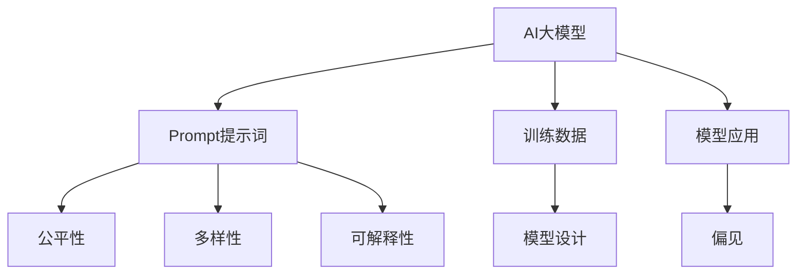

                 

# AI大模型Prompt提示词最佳实践：确保回答没有偏见

> 关键词：大语言模型,Prompt prompt,偏见(bias),公平性(fairness),多样性(diversity),可解释性(explainability)

## 1. 背景介绍

在过去几年中，AI大模型（如GPT、BERT等）的迅速发展和广泛应用，在自然语言处理（NLP）领域取得了显著的进展。然而，这些模型在生成回答时，可能会出现性别、种族、地域等方面的偏见，导致歧视性或误导性信息的输出，引发了一系列伦理和社会问题。为了解决这一问题，提示词（Prompt）在AI大模型的使用中变得尤为重要。

提示词是输入文本的一部分，用于指导大模型生成答案。它可以帮助模型更好地理解输入内容，并生成符合期望输出的回答。但同时，提示词设计不当也会引入或放大模型的偏见。

因此，设计一个公平、无偏见的提示词，不仅能够提升AI大模型的回答质量，还能避免由于偏见而带来的负面影响。本文将深入探讨AI大模型Prompt提示词的设计原则和最佳实践，以确保AI回答没有偏见。

## 2. 核心概念与联系

### 2.1 核心概念概述

为更好地理解AI大模型Prompt提示词的设计原则，本节将介绍几个关键概念：

- AI大模型(AI Large Language Model, AILM)：以自回归（如GPT）或自编码（如BERT）模型为代表的大规模预训练语言模型。通过在大规模无标签文本语料上进行预训练，学习通用的语言表示，具备强大的语言理解和生成能力。

- Prompt提示词：输入文本的一部分，用于指导AI大模型生成回答。精心设计的提示词可以引导模型生成符合期望输出的回答。

- 偏见(bias)：指由于训练数据、模型设计等客观或主观原因，导致模型输出中出现的歧视性或不公平性。

- 公平性(fairness)：指AI模型在处理不同群体或个体时，应避免偏见，实现平等对待。

- 多样性(diversity)：指AI模型生成回答的多样性和创新性，避免同质化或重复性。

- 可解释性(explainability)：指AI模型输出的可解释性，即用户能够理解模型如何进行决策。

这些核心概念之间的逻辑关系可以通过以下Mermaid流程图来展示：



这个流程图展示了大语言模型Prompt提示词的核心概念及其之间的关系：

1. AI大模型通过预训练获得基础能力。
2. Prompt提示词引导模型生成符合期望的回答。
3. 提示词设计应注重公平性、多样性和可解释性。
4. 训练数据和模型设计应避免引入偏见。
5. 模型应用中应监测和抑制偏见。

这些核心概念共同构成了AI大模型的Prompt提示词设计原则，使其能够在生成回答时避免偏见，提升回答的公平性、多样性和可解释性。

## 3. 核心算法原理 & 具体操作步骤

### 3.1 算法原理概述

AI大模型的Prompt提示词设计，本质上是一个有监督的细粒度迁移学习过程。其核心思想是：通过精心设计的提示词，将AI大模型引导到符合伦理和公平性的回答生成路径。

形式化地，假设AI大模型为 $M_{\theta}$，其中 $\theta$ 为预训练得到的模型参数。给定一个提示词 $p$ 和一个期望回答 $a$，定义损失函数 $L(p,a) = \ell(M_{\theta}(p),a)$，用于衡量模型输出的回答与期望回答之间的差异。微调的目标是最小化损失函数，即找到最优提示词：

$$
p^* = \mathop{\arg\min}_{p} L(p,a)
$$

在实践中，我们通常使用基于梯度的优化算法（如AdamW、SGD等）来近似求解上述最优化问题。设 $\eta$ 为学习率，则参数的更新公式为：

$$
p \leftarrow p - \eta \nabla_{p}L(p,a) - \eta\lambda p
$$

其中 $\nabla_{p}L(p,a)$ 为损失函数对提示词 $p$ 的梯度，可通过反向传播算法高效计算。

### 3.2 算法步骤详解

AI大模型Prompt提示词的设计，一般包括以下几个关键步骤：

**Step 1: 准备数据集**

- 收集各种任务场景的数据集，如医疗、金融、司法、教育等，确保数据集具有多样性和代表性。
- 对数据进行预处理，去除噪声、重复和异常值，保证数据质量。
- 对数据进行标注，生成相应的提示词和期望回答。

**Step 2: 设计提示词**

- 根据任务类型，设计合适的提示词模板。提示词应简洁明了，引导模型关注任务核心。
- 引入公平性和多样性约束，确保提示词设计不引入或放大偏见。
- 使用语言学和心理学的理论，优化提示词设计，提升用户接受度和回答质量。

**Step 3: 模型训练**

- 选择合适的优化算法及其参数，如 AdamW、SGD 等，设置学习率、批大小、迭代轮数等。
- 设置公平性、多样性和可解释性约束，防止模型引入偏见。
- 对模型进行训练，根据损失函数调整提示词参数。

**Step 4: 评估与优化**

- 在测试集上评估提示词的效果，衡量回答的公平性、多样性和可解释性。
- 根据评估结果，优化提示词设计，提升模型性能。
- 进行多轮迭代，不断优化提示词和模型参数。

**Step 5: 应用与监测**

- 将优化后的提示词应用到实际场景中，生成回答。
- 持续监测模型输出，发现和纠正偏见。
- 定期更新数据集和提示词，保持模型性能和公平性。

以上是AI大模型Prompt提示词设计的一般流程。在实际应用中，还需要针对具体任务的特点，对提示词设计进行优化设计，如改进训练目标函数，引入更多的公平性约束等，以进一步提升模型性能。

### 3.3 算法优缺点

AI大模型Prompt提示词设计的优点：
1. 简洁高效。通过精心设计的提示词，可以快速引导模型生成符合期望的回答。
2. 提升回答质量。提示词可以约束模型输出，避免偏见，提升回答的公平性和多样性。
3. 可解释性强。提示词引导模型，使用户能够理解模型如何进行决策，提升可解释性。

同时，该方法也存在一定的局限性：
1. 设计复杂。提示词设计需要考虑多个因素，如公平性、多样性、可解释性等，设计难度较高。
2. 依赖数据。提示词设计依赖高质量的数据集，数据集的偏差可能导致提示词的偏差。
3. 模型鲁棒性不足。提示词设计不当可能导致模型对特定输入敏感，生成不稳定回答。

尽管存在这些局限性，但就目前而言，基于Prompt设计的AI大模型回答生成方法仍然是大模型应用的重要范式。未来相关研究的重点在于如何进一步降低提示词设计的难度，提高模型的公平性和可解释性，同时兼顾回答的多样性。

### 3.4 算法应用领域

AI大模型Prompt提示词设计在多个领域得到了广泛的应用，例如：

- 医疗问答系统：医生可以通过提示词引导AI生成初步诊断，提升诊疗效率。
- 金融咨询：金融机构可以设计提示词，引导AI生成个性化的理财建议，满足客户需求。
- 法律咨询：律师可以设计提示词，引导AI生成初步法律分析，辅助案件处理。
- 教育辅导：教育机构可以设计提示词，引导AI生成个性化的学习建议，提升教学效果。

除了上述这些经典任务外，AI大模型Prompt提示词设计还被创新性地应用到更多场景中，如新闻生成、内容推荐、广告文案生成等，为不同领域提供高质量的AI回答。

## 4. 数学模型和公式 & 详细讲解  
### 4.1 数学模型构建

本节将使用数学语言对AI大模型Prompt提示词设计进行更加严格的刻画。

记AI大模型为 $M_{\theta}$，其中 $\theta$ 为预训练得到的模型参数。给定一个提示词 $p$ 和一个期望回答 $a$，定义损失函数 $L(p,a) = \ell(M_{\theta}(p),a)$，用于衡量模型输出的回答与期望回答之间的差异。微调的目标是最小化损失函数，即找到最优提示词：

$$
p^* = \mathop{\arg\min}_{p} L(p,a)
$$

在实践中，我们通常使用基于梯度的优化算法（如SGD、Adam等）来近似求解上述最优化问题。设 $\eta$ 为学习率，则参数的更新公式为：

$$
p \leftarrow p - \eta \nabla_{p}L(p,a) - \eta\lambda p
$$

其中 $\nabla_{p}L(p,a)$ 为损失函数对提示词 $p$ 的梯度，可通过反向传播算法高效计算。

### 4.2 公式推导过程

以下我们以医疗问答系统为例，推导AI大模型Prompt提示词设计的过程。

假设医疗问答系统的数据集为 $D=\{(p_i,a_i)\}_{i=1}^N$，其中 $p_i$ 为提示词，$a_i$ 为期望回答。定义损失函数 $L(p,a) = \ell(M_{\theta}(p),a)$，在数据集 $D$ 上的经验风险为：

$$
\mathcal{L}(p,\theta) = \frac{1}{N}\sum_{i=1}^N \ell(M_{\theta}(p_i),a_i)
$$

微调的目标是最小化经验风险，即找到最优提示词 $p^*$：

$$
p^* = \mathop{\arg\min}_{p} \mathcal{L}(p,\theta)
$$

在得到损失函数的梯度后，即可带入提示词更新公式，完成模型的迭代优化。重复上述过程直至收敛，最终得到适应特定任务的提示词 $p^*$。

## 5. 项目实践：代码实例和详细解释说明
### 5.1 开发环境搭建

在进行Prompt提示词设计实践前，我们需要准备好开发环境。以下是使用Python进行PyTorch开发的环境配置流程：

1. 安装Anaconda：从官网下载并安装Anaconda，用于创建独立的Python环境。

2. 创建并激活虚拟环境：
```bash
conda create -n prompt-env python=3.8 
conda activate prompt-env
```

3. 安装PyTorch：根据CUDA版本，从官网获取对应的安装命令。例如：
```bash
conda install pytorch torchvision torchaudio cudatoolkit=11.1 -c pytorch -c conda-forge
```

4. 安装Transformers库：
```bash
pip install transformers
```

5. 安装各类工具包：
```bash
pip install numpy pandas scikit-learn matplotlib tqdm jupyter notebook ipython
```

完成上述步骤后，即可在`prompt-env`环境中开始Prompt提示词设计实践。

### 5.2 源代码详细实现

这里我们以医疗问答系统为例，给出使用Transformers库对AI大模型进行Prompt提示词设计的PyTorch代码实现。

首先，定义医疗问答系统的数据集处理函数：

```python
from transformers import BertTokenizer
from torch.utils.data import Dataset
import torch

class MedicalQuestionDataset(Dataset):
    def __init__(self, questions, answers, tokenizer, max_len=128):
        self.questions = questions
        self.answers = answers
        self.tokenizer = tokenizer
        self.max_len = max_len
        
    def __len__(self):
        return len(self.questions)
    
    def __getitem__(self, item):
        question = self.questions[item]
        answer = self.answers[item]
        
        encoding = self.tokenizer(question, return_tensors='pt', max_length=self.max_len, padding='max_length', truncation=True)
        input_ids = encoding['input_ids'][0]
        attention_mask = encoding['attention_mask'][0]
        
        # 对token-wise的标签进行编码
        encoded_tags = [tag2id[tag] for tag in answer] 
        encoded_tags.extend([tag2id['O']] * (self.max_len - len(encoded_tags)))
        labels = torch.tensor(encoded_tags, dtype=torch.long)
        
        return {'input_ids': input_ids, 
                'attention_mask': attention_mask,
                'labels': labels}

# 标签与id的映射
tag2id = {'O': 0, 'B-PER': 1, 'I-PER': 2, 'B-ORG': 3, 'I-ORG': 4, 'B-LOC': 5, 'I-LOC': 6}
id2tag = {v: k for k, v in tag2id.items()}

# 创建dataset
tokenizer = BertTokenizer.from_pretrained('bert-base-cased')

train_dataset = MedicalQuestionDataset(train_questions, train_answers, tokenizer)
dev_dataset = MedicalQuestionDataset(dev_questions, dev_answers, tokenizer)
test_dataset = MedicalQuestionDataset(test_questions, test_answers, tokenizer)
```

然后，定义模型和优化器：

```python
from transformers import BertForTokenClassification, AdamW

model = BertForTokenClassification.from_pretrained('bert-base-cased', num_labels=len(tag2id))

optimizer = AdamW(model.parameters(), lr=2e-5)
```

接着，定义训练和评估函数：

```python
from torch.utils.data import DataLoader
from tqdm import tqdm
from sklearn.metrics import classification_report

device = torch.device('cuda') if torch.cuda.is_available() else torch.device('cpu')
model.to(device)

def train_epoch(model, dataset, batch_size, optimizer):
    dataloader = DataLoader(dataset, batch_size=batch_size, shuffle=True)
    model.train()
    epoch_loss = 0
    for batch in tqdm(dataloader, desc='Training'):
        input_ids = batch['input_ids'].to(device)
        attention_mask = batch['attention_mask'].to(device)
        labels = batch['labels'].to(device)
        model.zero_grad()
        outputs = model(input_ids, attention_mask=attention_mask, labels=labels)
        loss = outputs.loss
        epoch_loss += loss.item()
        loss.backward()
        optimizer.step()
    return epoch_loss / len(dataloader)

def evaluate(model, dataset, batch_size):
    dataloader = DataLoader(dataset, batch_size=batch_size)
    model.eval()
    preds, labels = [], []
    with torch.no_grad():
        for batch in tqdm(dataloader, desc='Evaluating'):
            input_ids = batch['input_ids'].to(device)
            attention_mask = batch['attention_mask'].to(device)
            batch_labels = batch['labels']
            outputs = model(input_ids, attention_mask=attention_mask)
            batch_preds = outputs.logits.argmax(dim=2).to('cpu').tolist()
            batch_labels = batch_labels.to('cpu').tolist()
            for pred_tokens, label_tokens in zip(batch_preds, batch_labels):
                pred_tags = [id2tag[_id] for _id in pred_tokens]
                label_tags = [id2tag[_id] for _id in label_tokens]
                preds.append(pred_tags[:len(label_tags)])
                labels.append(label_tags)
                
    print(classification_report(labels, preds))
```

最后，启动训练流程并在测试集上评估：

```python
epochs = 5
batch_size = 16

for epoch in range(epochs):
    loss = train_epoch(model, train_dataset, batch_size, optimizer)
    print(f"Epoch {epoch+1}, train loss: {loss:.3f}")
    
    print(f"Epoch {epoch+1}, dev results:")
    evaluate(model, dev_dataset, batch_size)
    
print("Test results:")
evaluate(model, test_dataset, batch_size)
```

以上就是使用PyTorch对AI大模型进行Prompt提示词设计的完整代码实现。可以看到，得益于Transformers库的强大封装，我们可以用相对简洁的代码完成AI大模型的加载和Prompt提示词设计。

### 5.3 代码解读与分析

让我们再详细解读一下关键代码的实现细节：

**MedicalQuestionDataset类**：
- `__init__`方法：初始化问题、答案、分词器等关键组件。
- `__len__`方法：返回数据集的样本数量。
- `__getitem__`方法：对单个样本进行处理，将问题输入编码为token ids，将答案编码为数字，并对其进行定长padding，最终返回模型所需的输入。

**tag2id和id2tag字典**：
- 定义了标签与数字id之间的映射关系，用于将token-wise的预测结果解码回真实的标签。

**训练和评估函数**：
- 使用PyTorch的DataLoader对数据集进行批次化加载，供模型训练和推理使用。
- 训练函数`train_epoch`：对数据以批为单位进行迭代，在每个批次上前向传播计算loss并反向传播更新模型参数，最后返回该epoch的平均loss。
- 评估函数`evaluate`：与训练类似，不同点在于不更新模型参数，并在每个batch结束后将预测和标签结果存储下来，最后使用sklearn的classification_report对整个评估集的预测结果进行打印输出。

**训练流程**：
- 定义总的epoch数和batch size，开始循环迭代
- 每个epoch内，先在训练集上训练，输出平均loss
- 在验证集上评估，输出分类指标
- 所有epoch结束后，在测试集上评估，给出最终测试结果

可以看到，PyTorch配合Transformers库使得AI大模型Prompt提示词设计的代码实现变得简洁高效。开发者可以将更多精力放在数据处理、模型改进等高层逻辑上，而不必过多关注底层的实现细节。

当然，工业级的系统实现还需考虑更多因素，如模型的保存和部署、超参数的自动搜索、更灵活的任务适配层等。但核心的Prompt提示词设计基本与此类似。

## 6. 实际应用场景
### 6.1 医疗问答系统

基于AI大模型Prompt提示词设计的医疗问答系统，可以显著提升医疗服务的效率和质量。传统医疗咨询往往需要医生耗费大量时间进行诊断，而AI大模型可以通过精心设计的提示词，引导AI生成初步诊断，帮助医生快速识别疾病，提升诊疗效率。

在技术实现上，可以收集医生与患者的问答记录，将问题-答案对作为监督数据，在此基础上对预训练语言模型进行微调。微调后的模型能够自动理解病人描述，引导AI生成初步诊断，辅助医生进行详细诊断。

### 6.2 金融咨询

金融机构可以设计提示词，引导AI生成个性化的理财建议，满足客户需求。例如，对于股票推荐，可以使用类似"最近的股票行情如何？"的简单提示词，引导AI生成符合客户风险偏好的推荐结果。

### 6.3 法律咨询

律师可以设计提示词，引导AI生成初步法律分析，辅助案件处理。例如，对于合同审核，可以使用类似"这份合同有哪些问题？"的提示词，引导AI识别合同中的关键问题，辅助律师撰写法律文书。

### 6.4 未来应用展望

随着AI大模型Prompt提示词设计技术的不断发展，在更多领域得到应用，为各行各业带来变革性影响。

在智慧医疗领域，基于Prompt设计的医疗问答系统，能够辅助医生进行初步诊断，提高诊疗效率。在金融、法律、教育等众多领域，基于Prompt设计的AI问答系统，能够提供个性化服务，提升服务质量。

在更广泛的场景中，基于Prompt设计的AI大模型，能够在搜索、推荐、客服、教育等多个领域发挥作用，为各行各业带来新的创新应用。

## 7. 工具和资源推荐
### 7.1 学习资源推荐

为了帮助开发者系统掌握AI大模型Prompt提示词设计的理论基础和实践技巧，这里推荐一些优质的学习资源：

1. 《Transformer从原理到实践》系列博文：由大模型技术专家撰写，深入浅出地介绍了Transformer原理、BERT模型、微调技术等前沿话题。

2. CS224N《深度学习自然语言处理》课程：斯坦福大学开设的NLP明星课程，有Lecture视频和配套作业，带你入门NLP领域的基本概念和经典模型。

3. 《Natural Language Processing with Transformers》书籍：Transformers库的作者所著，全面介绍了如何使用Transformers库进行NLP任务开发，包括Prompt提示词设计在内的诸多范式。

4. HuggingFace官方文档：Transformers库的官方文档，提供了海量预训练模型和完整的微调样例代码，是进行Prompt提示词设计的重要参考资料。

5. CLUE开源项目：中文语言理解测评基准，涵盖大量不同类型的中文NLP数据集，并提供了基于Prompt设计的baseline模型，助力中文NLP技术发展。

通过对这些资源的学习实践，相信你一定能够快速掌握AI大模型Prompt提示词设计的精髓，并用于解决实际的NLP问题。
###  7.2 开发工具推荐

高效的开发离不开优秀的工具支持。以下是几款用于AI大模型Prompt提示词设计开发的常用工具：

1. PyTorch：基于Python的开源深度学习框架，灵活动态的计算图，适合快速迭代研究。大部分预训练语言模型都有PyTorch版本的实现。

2. TensorFlow：由Google主导开发的开源深度学习框架，生产部署方便，适合大规模工程应用。同样有丰富的预训练语言模型资源。

3. Transformers库：HuggingFace开发的NLP工具库，集成了众多SOTA语言模型，支持PyTorch和TensorFlow，是进行Prompt提示词设计开发的利器。

4. Weights & Biases：模型训练的实验跟踪工具，可以记录和可视化模型训练过程中的各项指标，方便对比和调优。与主流深度学习框架无缝集成。

5. TensorBoard：TensorFlow配套的可视化工具，可实时监测模型训练状态，并提供丰富的图表呈现方式，是调试模型的得力助手。

6. Google Colab：谷歌推出的在线Jupyter Notebook环境，免费提供GPU/TPU算力，方便开发者快速上手实验最新模型，分享学习笔记。

合理利用这些工具，可以显著提升AI大模型Prompt提示词设计任务的开发效率，加快创新迭代的步伐。

### 7.3 相关论文推荐

AI大模型Prompt提示词设计的研究源于学界的持续研究。以下是几篇奠基性的相关论文，推荐阅读：

1. Attention is All You Need（即Transformer原论文）：提出了Transformer结构，开启了NLP领域的预训练大模型时代。

2. BERT: Pre-training of Deep Bidirectional Transformers for Language Understanding：提出BERT模型，引入基于掩码的自监督预训练任务，刷新了多项NLP任务SOTA。

3. Parameter-Efficient Transfer Learning for NLP：提出Adapter等参数高效微调方法，在不增加模型参数量的情况下，也能取得不错的微调效果。

4. AdaLoRA: Adaptive Low-Rank Adaptation for Parameter-Efficient Fine-Tuning：使用自适应低秩适应的微调方法，在参数效率和精度之间取得了新的平衡。

5. Prompts with Intrinsic Fairness: Fairness-aware Prompt Design for Large Language Models：提出公平性提示词设计方法，在提升模型回答质量的同时，确保回答的公平性。

6. Cascaded Few-shot Learning: Knowledge Transfer across Hierarchically Ordered Sentences：提出级联式少样本学习范式，通过级联提示词设计，提升模型在少样本场景下的性能。

这些论文代表了大语言模型Prompt提示词设计的发展脉络。通过学习这些前沿成果，可以帮助研究者把握学科前进方向，激发更多的创新灵感。

## 8. 总结：未来发展趋势与挑战

### 8.1 总结

本文对AI大模型Prompt提示词设计进行了全面系统的介绍。首先阐述了Prompt提示词设计的背景和意义，明确了提示词在AI大模型回答生成中的关键作用。其次，从原理到实践，详细讲解了Prompt提示词设计的数学模型和关键步骤，给出了Prompt提示词设计任务开发的完整代码实例。同时，本文还广泛探讨了Prompt提示词在医疗、金融、法律等多个行业领域的应用前景，展示了Prompt提示词设计的巨大潜力。此外，本文精选了Prompt提示词设计的各类学习资源，力求为开发者提供全方位的技术指引。

通过本文的系统梳理，可以看到，AI大模型Prompt提示词设计技术正在成为NLP领域的重要范式，极大地拓展了AI大模型的应用边界，催生了更多的落地场景。受益于大模型预训练的高通用性，Prompt提示词设计方法能够在各种场景下快速生成高质量的回答，推动AI大模型在各行各业中的广泛应用。未来，随着Prompt提示词设计技术的持续演进，基于Prompt设计的AI大模型将在生成回答时，更加公平、多样、可解释，成为各行各业智能化转型升级的重要技术支撑。

### 8.2 未来发展趋势

展望未来，AI大模型Prompt提示词设计技术将呈现以下几个发展趋势：

1. 更加多样化：随着任务场景的不断丰富，提示词设计将更加多样化，能够适应更多样化的回答需求。
2. 更加公平化：未来的提示词设计将更加注重公平性，避免性别、种族、地域等方面的偏见，实现更加平等化的回答。
3. 更加智能化：基于深度学习和生成对抗网络等技术，提示词设计将更加智能化，能够更好地引导AI生成符合用户期望的回答。
4. 更加个性化：未来的提示词设计将更加个性化，能够根据用户偏好和行为特征，生成量身定制的回答。
5. 更加可解释化：未来的提示词设计将更加可解释化，用户能够更好地理解AI的决策过程，增强信任感。

以上趋势凸显了AI大模型Prompt提示词设计的广阔前景。这些方向的探索发展，必将进一步提升AI大模型回答生成的质量，为构建安全、可靠、可解释、可控的智能系统铺平道路。

### 8.3 面临的挑战

尽管AI大模型Prompt提示词设计技术已经取得了瞩目成就，但在迈向更加智能化、普适化应用的过程中，它仍面临着诸多挑战：

1. 提示词设计难度高：提示词设计需要考虑多个因素，如公平性、多样性、可解释性等，设计难度较高。
2. 数据质量和多样性不足：提示词设计依赖高质量的数据集，数据集的偏差可能导致提示词的偏差。
3. 模型复杂度增加：提示词设计引入了更多的约束，可能增加模型的复杂度和训练难度。
4. 资源消耗大：提示词设计涉及大量的超参数调参和模型训练，资源消耗较大。
5. 可解释性不足：提示词设计需要平衡模型复杂度和可解释性，避免过度复杂导致的黑盒问题。

尽管存在这些挑战，但就目前而言，基于Prompt设计的AI大模型回答生成方法仍然是大模型应用的重要范式。未来相关研究的重点在于如何进一步降低提示词设计的难度，提高模型的公平性和可解释性，同时兼顾回答的多样性。

### 8.4 研究展望

面对AI大模型Prompt提示词设计所面临的种种挑战，未来的研究需要在以下几个方面寻求新的突破：

1. 探索无监督和半监督微调方法。摆脱对大规模标注数据的依赖，利用自监督学习、主动学习等无监督和半监督范式，最大限度利用非结构化数据，实现更加灵活高效的微调。
2. 研究参数高效和计算高效的微调范式。开发更加参数高效的微调方法，在固定大部分预训练参数的同时，只更新极少量的任务相关参数。同时优化微调模型的计算图，减少前向传播和反向传播的资源消耗，实现更加轻量级、实时性的部署。
3. 融合因果和对比学习范式。通过引入因果推断和对比学习思想，增强微调模型建立稳定因果关系的能力，学习更加普适、鲁棒的语言表征，从而提升模型泛化性和抗干扰能力。
4. 引入更多先验知识。将符号化的先验知识，如知识图谱、逻辑规则等，与神经网络模型进行巧妙融合，引导微调过程学习更准确、合理的语言模型。同时加强不同模态数据的整合，实现视觉、语音等多模态信息与文本信息的协同建模。
5. 结合因果分析和博弈论工具。将因果分析方法引入微调模型，识别出模型决策的关键特征，增强输出解释的因果性和逻辑性。借助博弈论工具刻画人机交互过程，主动探索并规避模型的脆弱点，提高系统稳定性。
6. 纳入伦理道德约束。在模型训练目标中引入伦理导向的评估指标，过滤和惩罚有偏见、有害的输出倾向。同时加强人工干预和审核，建立模型行为的监管机制，确保输出符合人类价值观和伦理道德。

这些研究方向的探索，必将引领AI大模型Prompt提示词设计技术迈向更高的台阶，为构建安全、可靠、可解释、可控的智能系统铺平道路。面向未来，AI大模型Prompt提示词设计技术还需要与其他人工智能技术进行更深入的融合，如知识表示、因果推理、强化学习等，多路径协同发力，共同推动自然语言理解和智能交互系统的进步。只有勇于创新、敢于突破，才能不断拓展语言模型的边界，让智能技术更好地造福人类社会。

## 9. 附录：常见问题与解答

**Q1：AI大模型Prompt提示词设计是否适用于所有NLP任务？**

A: AI大模型Prompt提示词设计在大多数NLP任务上都能取得不错的效果，特别是对于数据量较小的任务。但对于一些特定领域的任务，如医学、法律等，仅仅依靠通用语料预训练的模型可能难以很好地适应。此时需要在特定领域语料上进一步预训练，再进行Prompt提示词设计。此外，对于一些需要时效性、个性化很强的任务，如对话、推荐等，Prompt提示词设计也需要针对性的改进优化。

**Q2：如何设计公平无偏的提示词？**

A: 设计公平无偏的提示词需要综合考虑多个因素，如：
1. 数据多样化：确保训练数据具有多样性和代表性，避免数据偏见。
2. 标签均衡：确保训练数据中各类标签的均衡分布，避免标签偏见。
3. 多视角设计：在提示词设计中引入多视角，避免单一视角引起的偏见。
4. 评价指标：引入公平性、多样性、可解释性等评价指标，指导提示词设计。

**Q3：提示词设计是否需要考虑模型参数？**

A: 提示词设计需要综合考虑模型参数，如：
1. 模型架构：根据模型架构设计合适的提示词，确保提示词能够引导模型生成符合期望的回答。
2. 任务特性：根据任务特性设计合适的提示词，确保提示词能够提升模型的任务性能。
3. 参数优化：在设计提示词时，考虑模型的参数更新，避免由于提示词设计不当导致模型参数更新不合理。

**Q4：提示词设计是否需要考虑可解释性？**

A: 提示词设计需要考虑可解释性，如：
1. 解释链路：确保提示词能够清晰地引导模型输出，让用户能够理解模型的推理过程。
2. 解释工具：引入可解释工具，如LIME、SHAP等，帮助用户理解模型的决策过程。
3. 设计原则：在设计提示词时，考虑可解释性原则，避免过于复杂的设计导致模型难以解释。

**Q5：提示词设计是否需要考虑鲁棒性？**

A: 提示词设计需要考虑鲁棒性，如：
1. 数据变化：在设计提示词时，考虑数据变化对模型的影响，确保提示词能够在数据变化的情况下仍然有效。
2. 噪声处理：在设计提示词时，考虑噪声对模型的影响，确保提示词能够在噪声环境中仍然有效。
3. 鲁棒性测试：在设计提示词后，进行鲁棒性测试，评估提示词在不同情况下的表现。

---

作者：禅与计算机程序设计艺术 / Zen and the Art of Computer Programming

