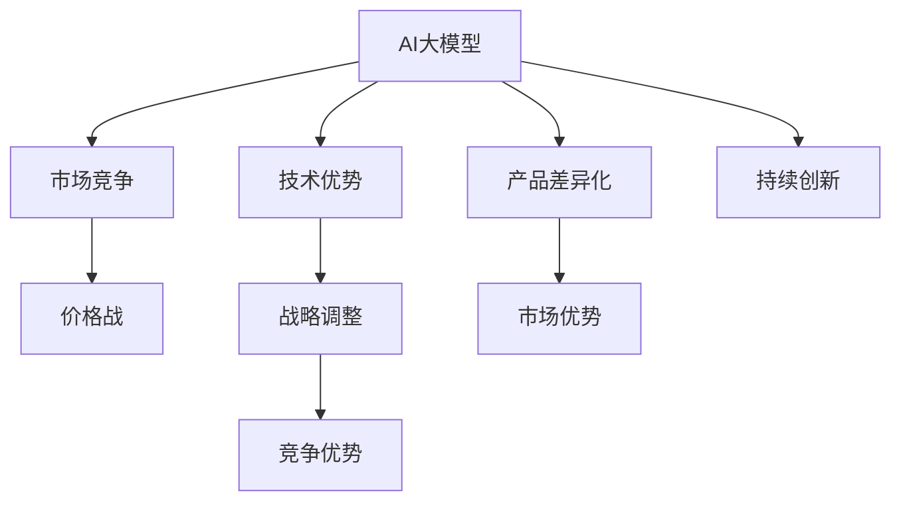

                 

# AI大模型创业：如何应对未来价格战？

> 关键词：AI大模型,创业,价格战,市场竞争,技术优势,战略调整,客户价值,产品差异化,持续创新

## 1. 背景介绍

### 1.1 问题由来
随着人工智能技术的快速发展，AI大模型的商业化应用越来越广泛，诸如自然语言处理(NLP)、计算机视觉(CV)、语音识别(SR)等技术已经进入了各个行业，为中小企业带来了前所未有的机遇和挑战。然而，在激烈的市场竞争中，价格战成为了最常用和最直接的竞争手段，这不仅影响了企业的利润空间，也使得一些初创企业难以生存。如何应对未来可能出现的价格战，成为AI大模型创业者们必须面对的重要课题。

### 1.2 问题核心关键点
价格战通常发生在市场快速扩张，需求激增，但供应难以立即跟上时。在AI大模型领域，由于技术门槛较高，初始投资较大，大规模生产和低成本复制技术相对困难，导致价格战并非典型。但随着技术的成熟和市场规模的扩大，价格战的可能性仍然存在。如何通过技术优势、战略调整、产品差异化等手段，赢得竞争，保持市场份额，是AI大模型创业者需要认真考虑的问题。

### 1.3 问题研究意义
应对未来可能的AI大模型价格战，对企业的长期发展、市场占有率和财务健康都至关重要。本文将探讨AI大模型创业者在价格战中的策略选择，并给出具体的实施建议，帮助企业在激烈的市场竞争中脱颖而出。

## 2. 核心概念与联系

### 2.1 核心概念概述

为了理解如何应对AI大模型价格战，需要明确几个核心概念：

- **AI大模型**：指基于深度学习技术构建的大规模、高性能模型，如GPT-3、BERT、ViT等，可以应用于自然语言处理、计算机视觉等多个领域。

- **价格战**：指在市场中，企业通过降价来吸引客户，争夺市场份额的竞争手段。

- **市场竞争**：指企业之间在产品、服务、价格等方面进行的竞争。

- **技术优势**：指企业在核心技术方面的领先地位，如算法、模型、架构等。

- **战略调整**：指企业根据市场环境变化，对战略进行动态调整的过程。

- **产品差异化**：指通过创新的产品设计，使其与竞争对手的产品在功能和性能上有显著区别，从而获得市场优势。

- **持续创新**：指企业不断投入研发资源，推出新技术和新产品，保持市场领先地位。

这些概念之间的关系可以通过以下Mermaid流程图来展示：



这个流程图展示了大模型与市场竞争、价格战等核心概念之间的逻辑关系：

1. 大模型通过技术优势、战略调整、产品差异化、持续创新等方式，在市场竞争中占据有利地位。
2. 在特定情况下，大模型可能触发价格战，但技术优势、战略调整等手段可以帮助企业更好地应对。
3. 产品差异化能够帮助企业获得市场优势，增强客户黏性。
4. 持续创新是企业保持竞争优势的关键，不断推出新技术和新产品，可以保持市场领先。

## 3. 核心算法原理 & 具体操作步骤
### 3.1 算法原理概述

应对AI大模型价格战的核心在于，通过技术优势和战略调整，构建产品的差异化和持续创新能力，从而在竞争中保持竞争优势。

从算法角度来看，以下步骤是应对价格战的关键：

1. **数据驱动的模型优化**：利用大数据和先进的算法，持续优化模型的性能，提升模型准确性和效率。
2. **端到端的服务体系**：构建包括数据收集、模型训练、产品部署、客户支持在内的全流程服务体系，提高客户满意度和粘性。
3. **多模态融合**：结合多种数据模态（如图像、文本、声音等），提升模型的感知和决策能力。
4. **实时动态调整**：根据市场反馈和用户需求，实时调整产品和策略，提升市场适应能力。
5. **人工智能辅助决策**：引入AI技术，对市场数据进行分析和预测，帮助企业制定合理的市场和产品策略。

### 3.2 算法步骤详解

以下是应对AI大模型价格战的具体操作步骤：

**Step 1: 构建技术优势**
- **数据收集和预处理**：收集大量的标注数据和无标签数据，对其进行清洗、去重和预处理，为模型训练提供高质量的输入数据。
- **模型设计和优化**：设计适用于目标任务的模型架构，如Transformer、CNN等，并使用数据增强、迁移学习、参数高效微调等技术，不断优化模型性能。
- **算法创新**：持续跟踪最新的算法研究进展，结合自身业务需求，进行算法创新和改进。

**Step 2: 产品差异化**
- **定制化服务**：根据不同客户需求，提供定制化的产品和服务，如针对医疗领域的病历分析、针对金融领域的风险评估等。
- **多模态融合**：结合多种数据模态（如图像、文本、声音等），提升产品的感知和决策能力，提供更全面的解决方案。
- **用户友好的界面**：设计简洁、直观、易用的产品界面，提升用户体验，增强客户粘性。

**Step 3: 战略调整**
- **市场定位和策略制定**：明确产品的市场定位和目标客户群体，制定相应的市场和产品策略。
- **灵活的市场策略**：根据市场需求和竞争状况，灵活调整产品和定价策略，保持市场竞争力。
- **快速响应和迭代**：根据市场反馈和用户需求，快速响应并调整产品和服务，进行持续迭代优化。

**Step 4: 持续创新**
- **研发投入**：持续增加研发投入，吸引和培养优秀的技术人才，保持技术领先。
- **技术合作和开放**：与其他企业或研究机构进行技术合作，推动技术开放和共享，提升整体技术水平。
- **技术专利保护**：对核心技术和算法进行专利申请，保护知识产权，防止技术被抄袭和盗用。

### 3.3 算法优缺点

应对AI大模型价格战的算法具有以下优点：

1. **提升模型性能**：通过数据驱动的模型优化和算法创新，可以显著提升模型的准确性和效率，提高产品的市场竞争力。
2. **增强客户黏性**：通过定制化服务和用户友好的界面，提升客户体验，增强客户黏性，减少客户流失率。
3. **灵活应对市场变化**：通过灵活的市场策略和快速响应迭代，可以迅速适应市场变化，保持市场领先地位。
4. **保持技术领先**：通过持续的研发投入和技术合作，可以保持技术领先，防止技术被抄袭和盗用。

同时，这种算法也存在一些缺点：

1. **成本较高**：数据收集和预处理、模型优化和算法创新等都需要较高的投入，初期成本较大。
2. **技术复杂**：构建技术优势、产品差异化、战略调整等需要具备较高的技术水平，技术门槛较高。
3. **周期较长**：持续创新和产品迭代需要时间，难以迅速见效，短期内可能面临市场压力。

### 3.4 算法应用领域

应对AI大模型价格战的算法在多个领域都有广泛的应用，包括但不限于以下几个方面：

1. **自然语言处理(NLP)**：用于文本分类、情感分析、机器翻译等任务，提供高效、准确的自然语言处理服务。
2. **计算机视觉(CV)**：应用于图像识别、目标检测、图像生成等任务，提供高质量的图像处理和分析服务。
3. **语音识别(SR)**：用于语音识别、语音合成、声纹识别等任务，提供高精度的语音处理服务。
4. **推荐系统**：通过分析用户行为和偏好，提供个性化的推荐服务，提升用户体验。
5. **智能制造**：应用于工业自动化、生产调度、质量检测等任务，提升制造业的智能化水平。

## 4. 数学模型和公式 & 详细讲解  
### 4.1 数学模型构建

在应对AI大模型价格战的过程中，我们可以通过数学模型来量化和优化各个步骤，以下是几个关键数学模型的构建：

**模型优化模型**：

假设目标任务为文本分类，使用softmax函数计算模型输出的概率分布：

$$ P(y|x;\theta) = \frac{exp(M_{\theta}(x))}{\sum_{y' \in Y} exp(M_{\theta}(x';y'))} $$

其中，$M_{\theta}(x)$ 为模型在输入 $x$ 上的输出，$\theta$ 为模型参数。

**损失函数模型**：

使用交叉熵损失函数 $L$ 来衡量模型的预测结果与真实标签之间的差距：

$$ L(y, P(y|x;\theta)) = -\sum_{y \in Y} y \log(P(y|x;\theta)) $$

**数据增强模型**：

假设原始数据集为 $D$，数据增强后的数据集为 $D'$，通过旋转、裁剪、翻转等方式扩充数据集，减少过拟合：

$$ D' = \{ T(x, y) | T \in \{R, C, F\}, (x, y) \in D \} $$

其中 $R$、$C$、$F$ 分别表示旋转、裁剪、翻转操作。

### 4.2 公式推导过程

对于文本分类任务，模型优化模型和损失函数的推导过程如下：

1. **模型优化模型推导**：
   - 假设输入文本 $x$ 经过预处理后，送入模型 $M_{\theta}$，输出为 $M_{\theta}(x)$。
   - 使用softmax函数将模型输出转化为概率分布 $P(y|x;\theta)$。
   - 定义模型的损失函数为交叉熵损失 $L$。
   - 目标是最小化损失函数 $L$，即：

   $$ \min_{\theta} \sum_{i=1}^{N} L(y_i, P(y_i|x_i;\theta)) $$

2. **损失函数模型推导**：
   - 假设训练集 $D$ 包含 $N$ 个样本，每个样本 $(x_i, y_i)$ 的模型输出为 $M_{\theta}(x_i)$，真实标签为 $y_i$。
   - 使用交叉熵损失函数 $L$ 来衡量模型的预测结果与真实标签之间的差距：
   
   $$ L(y, P(y|x;\theta)) = -\sum_{y \in Y} y \log(P(y|x;\theta)) $$

   - 目标是最小化总损失函数 $L$，即：

   $$ \min_{\theta} \sum_{i=1}^{N} L(y_i, P(y_i|x_i;\theta)) $$

### 4.3 案例分析与讲解

**案例1: 文本分类**

假设有一个文本分类任务，包含正类和负类，通过优化模型来提升分类准确性。

- **模型构建**：使用Transformer模型作为文本分类器，利用预训练语言模型BERT作为初始化参数。
- **数据预处理**：将文本转换为模型接受的格式，并进行分词、截断和填充。
- **模型优化**：在模型训练过程中，使用数据增强、正则化等技术，减少过拟合。
- **模型评估**：在测试集上评估模型的分类准确性，使用混淆矩阵、准确率、召回率等指标衡量模型性能。

**案例2: 图像识别**

假设有一个图像识别任务，通过优化模型来提升识别准确性。

- **模型构建**：使用卷积神经网络(CNN)作为图像分类器，利用预训练图像模型ResNet作为初始化参数。
- **数据预处理**：将图像转换为模型接受的格式，并进行归一化、裁剪、旋转等预处理。
- **模型优化**：在模型训练过程中，使用数据增强、迁移学习等技术，提升模型泛化能力。
- **模型评估**：在测试集上评估模型的识别准确性，使用混淆矩阵、准确率、召回率等指标衡量模型性能。

## 5. 项目实践：代码实例和详细解释说明
### 5.1 开发环境搭建

在进行AI大模型价格战应对策略的开发时，需要准备好开发环境。以下是使用Python进行PyTorch开发的环境配置流程：

1. 安装Anaconda：从官网下载并安装Anaconda，用于创建独立的Python环境。

2. 创建并激活虚拟环境：
```bash
conda create -n pytorch-env python=3.8 
conda activate pytorch-env
```

3. 安装PyTorch：根据CUDA版本，从官网获取对应的安装命令。例如：
```bash
conda install pytorch torchvision torchaudio cudatoolkit=11.1 -c pytorch -c conda-forge
```

4. 安装Transformer库：
```bash
pip install transformers
```

5. 安装各类工具包：
```bash
pip install numpy pandas scikit-learn matplotlib tqdm jupyter notebook ipython
```

完成上述步骤后，即可在`pytorch-env`环境中开始价格战应对策略的开发。

### 5.2 源代码详细实现

下面我们以文本分类任务为例，给出使用Transformers库对BERT模型进行价格战应对策略的PyTorch代码实现。

首先，定义文本分类任务的数据处理函数：

```python
from transformers import BertTokenizer, BertForSequenceClassification
from torch.utils.data import Dataset
import torch

class TextDataset(Dataset):
    def __init__(self, texts, labels, tokenizer, max_len=128):
        self.texts = texts
        self.labels = labels
        self.tokenizer = tokenizer
        self.max_len = max_len
        
    def __len__(self):
        return len(self.texts)
    
    def __getitem__(self, item):
        text = self.texts[item]
        label = self.labels[item]
        
        encoding = self.tokenizer(text, return_tensors='pt', max_length=self.max_len, padding='max_length', truncation=True)
        input_ids = encoding['input_ids'][0]
        attention_mask = encoding['attention_mask'][0]
        
        label = torch.tensor([label], dtype=torch.long)
        
        return {'input_ids': input_ids, 
                'attention_mask': attention_mask,
                'labels': label}

# 数据处理
tokenizer = BertTokenizer.from_pretrained('bert-base-cased')

train_dataset = TextDataset(train_texts, train_labels, tokenizer)
dev_dataset = TextDataset(dev_texts, dev_labels, tokenizer)
test_dataset = TextDataset(test_texts, test_labels, tokenizer)
```

然后，定义模型和优化器：

```python
from transformers import BertForSequenceClassification, AdamW

model = BertForSequenceClassification.from_pretrained('bert-base-cased', num_labels=2)

optimizer = AdamW(model.parameters(), lr=2e-5)
```

接着，定义训练和评估函数：

```python
from torch.utils.data import DataLoader
from tqdm import tqdm
from sklearn.metrics import accuracy_score

device = torch.device('cuda') if torch.cuda.is_available() else torch.device('cpu')
model.to(device)

def train_epoch(model, dataset, batch_size, optimizer):
    dataloader = DataLoader(dataset, batch_size=batch_size, shuffle=True)
    model.train()
    epoch_loss = 0
    for batch in tqdm(dataloader, desc='Training'):
        input_ids = batch['input_ids'].to(device)
        attention_mask = batch['attention_mask'].to(device)
        labels = batch['labels'].to(device)
        model.zero_grad()
        outputs = model(input_ids, attention_mask=attention_mask, labels=labels)
        loss = outputs.loss
        epoch_loss += loss.item()
        loss.backward()
        optimizer.step()
    return epoch_loss / len(dataloader)

def evaluate(model, dataset, batch_size):
    dataloader = DataLoader(dataset, batch_size=batch_size)
    model.eval()
    preds, labels = [], []
    with torch.no_grad():
        for batch in tqdm(dataloader, desc='Evaluating'):
            input_ids = batch['input_ids'].to(device)
            attention_mask = batch['attention_mask'].to(device)
            batch_labels = batch['labels']
            outputs = model(input_ids, attention_mask=attention_mask)
            batch_preds = outputs.logits.argmax(dim=1).to('cpu').tolist()
            batch_labels = batch_labels.to('cpu').tolist()
            for pred, label in zip(batch_preds, batch_labels):
                preds.append(pred)
                labels.append(label)
                
    print('Accuracy:', accuracy_score(labels, preds))
```

最后，启动训练流程并在测试集上评估：

```python
epochs = 5
batch_size = 16

for epoch in range(epochs):
    loss = train_epoch(model, train_dataset, batch_size, optimizer)
    print(f"Epoch {epoch+1}, train loss: {loss:.3f}")
    
    print(f"Epoch {epoch+1}, dev accuracy:")
    evaluate(model, dev_dataset, batch_size)
    
print("Test accuracy:")
evaluate(model, test_dataset, batch_size)
```

以上就是使用PyTorch对BERT进行文本分类任务价格战应对策略的完整代码实现。可以看到，得益于Transformers库的强大封装，我们可以用相对简洁的代码完成BERT模型的加载和价格战应对策略的实现。

### 5.3 代码解读与分析

让我们再详细解读一下关键代码的实现细节：

**TextDataset类**：
- `__init__`方法：初始化文本、标签、分词器等关键组件。
- `__len__`方法：返回数据集的样本数量。
- `__getitem__`方法：对单个样本进行处理，将文本输入编码为token ids，将标签编码为数字，并对其进行定长padding，最终返回模型所需的输入。

**tokenizer**字典：
- 定义了文本和标签的编码方式，用于将输入转换为模型可接受的格式。

**训练和评估函数**：
- 使用PyTorch的DataLoader对数据集进行批次化加载，供模型训练和推理使用。
- 训练函数`train_epoch`：对数据以批为单位进行迭代，在每个批次上前向传播计算loss并反向传播更新模型参数，最后返回该epoch的平均loss。
- 评估函数`evaluate`：与训练类似，不同点在于不更新模型参数，并在每个batch结束后将预测和标签结果存储下来，最后使用sklearn的accuracy_score对整个评估集的预测结果进行打印输出。

**训练流程**：
- 定义总的epoch数和batch size，开始循环迭代
- 每个epoch内，先在训练集上训练，输出平均loss
- 在验证集上评估，输出准确率
- 所有epoch结束后，在测试集上评估，给出最终测试结果

可以看到，PyTorch配合Transformers库使得BERT价格战应对策略的代码实现变得简洁高效。开发者可以将更多精力放在数据处理、模型改进等高层逻辑上，而不必过多关注底层的实现细节。

当然，工业级的系统实现还需考虑更多因素，如模型的保存和部署、超参数的自动搜索、更灵活的任务适配层等。但核心的价格战应对策略基本与此类似。

## 6. 实际应用场景
### 6.1 智能客服系统

智能客服系统在大模型价格战中具有重要地位。传统的客服方式成本高、效率低，而且无法提供24小时不间断服务。通过微调后的客服模型，可以大大提升客服效率和客户满意度。

具体应用场景如下：
- **价格战应对策略**：构建多轮对话模型，通过训练不同对话模板，适应不同的客户需求。利用模型输出和用户反馈进行动态调整，不断优化对话质量。
- **服务优化**：引入自然语言理解和生成技术，使客服模型能够理解客户的意图和情感，并提供个性化的服务。

**实际案例**：某电商企业通过微调BERT模型，构建了一个智能客服系统。该系统能够实时处理客户咨询，准确理解和回应客户问题，提升客户满意度。在价格战中，该系统通过提供快速、准确、个性化的服务，吸引大量客户，有效抵抗竞争对手的价格战。

### 6.2 金融风险管理

金融风险管理是大模型价格战中应用广泛的一个领域。银行、保险公司等金融机构需要实时监测市场风险，以便及时采取措施。

具体应用场景如下：
- **价格战应对策略**：构建金融舆情监测模型，通过微调BERT模型，实时监控金融市场舆情，识别风险信号。利用模型输出和专家知识库进行风险评估，提供精准的风险预警。
- **风险控制**：结合金融领域的知识图谱，进行模型优化和微调，提高模型的泛化能力。利用多模态融合技术，提升模型对金融数据的理解能力。

**实际案例**：某保险公司通过微调BERT模型，构建了一个金融风险监测系统。该系统能够实时监控金融市场舆情，及时发现风险信号，采取风险控制措施，有效降低保险公司面临的风险。在价格战中，该系统通过精准的风险预警和控制，提升了竞争力，吸引了大量客户。

### 6.3 个性化推荐系统

个性化推荐系统是大模型价格战中的重要应用场景。通过微调模型，能够更准确地理解用户偏好，提供个性化的推荐服务。

具体应用场景如下：
- **价格战应对策略**：构建个性化推荐模型，通过微调BERT模型，实时分析用户行为数据，提取用户偏好。利用模型输出和推荐算法进行个性化推荐，提升用户体验。
- **推荐优化**：结合推荐系统的知识图谱和用户行为数据，进行模型优化和微调，提高推荐效果。

**实际案例**：某电商平台通过微调BERT模型，构建了一个个性化推荐系统。该系统能够实时分析用户行为数据，提取用户偏好，提供个性化的商品推荐。在价格战中，该系统通过精准的推荐服务，吸引了大量客户，提升了市场份额。

### 6.4 未来应用展望

随着AI大模型的不断发展，未来将有更多应用场景涌现，如智能制造、智慧城市等，带来更多的市场机会和竞争。以下是几个未来应用展望：

1. **智能制造**：通过微调大模型，实现工业自动化、生产调度、质量检测等任务的智能化，提升制造业的效率和质量。

2. **智慧城市**：利用微调大模型，实现城市事件监测、舆情分析、应急指挥等任务，提升城市管理的智能化水平。

3. **智能交通**：通过微调大模型，实现交通流量预测、智能调度、事故预警等任务，提升交通系统的智能化和安全性。

4. **智能医疗**：构建医疗问答、病历分析、药物研发等医疗应用，利用微调大模型，提升医疗服务的智能化水平。

5. **智能教育**：利用微调大模型，构建智能教育系统，提升教育的智能化和个性化水平。

## 7. 工具和资源推荐
### 7.1 学习资源推荐

为了帮助开发者系统掌握AI大模型价格战应对策略的理论基础和实践技巧，这里推荐一些优质的学习资源：

1. **《深度学习》课程**：斯坦福大学的经典深度学习课程，涵盖深度学习的基础理论和实际应用，适合初学者和进阶者。

2. **《机器学习》书籍**：由Thomas M. Mitchell编写，全面介绍了机器学习的基本概念和算法，适合深入理解AI大模型。

3. **《自然语言处理》课程**：MIT OpenCourseWare上的自然语言处理课程，涵盖NLP的基本概念和前沿技术，适合进一步学习。

4. **《Transformers》书籍**：Google的官方文档，全面介绍了Transformer模型的原理和应用，适合开发者学习。

5. **《PyTorch官方文档》**：PyTorch官方文档，提供了丰富的API和代码示例，适合快速上手PyTorch的开发。

6. **《TensorFlow官方文档》**：TensorFlow官方文档，提供了丰富的API和代码示例，适合快速上手TensorFlow的开发。

通过对这些资源的学习实践，相信你一定能够快速掌握AI大模型价格战应对策略的精髓，并用于解决实际的NLP问题。

### 7.2 开发工具推荐

高效的开发离不开优秀的工具支持。以下是几款用于AI大模型价格战应对策略开发的常用工具：

1. **PyTorch**：基于Python的开源深度学习框架，灵活动态的计算图，适合快速迭代研究。

2. **TensorFlow**：由Google主导开发的开源深度学习框架，生产部署方便，适合大规模工程应用。

3. **Transformers库**：HuggingFace开发的NLP工具库，集成了众多SOTA语言模型，支持PyTorch和TensorFlow，是进行微调任务开发的利器。

4. **Weights & Biases**：模型训练的实验跟踪工具，可以记录和可视化模型训练过程中的各项指标，方便对比和调优。

5. **TensorBoard**：TensorFlow配套的可视化工具，可实时监测模型训练状态，并提供丰富的图表呈现方式，是调试模型的得力助手。

6. **Google Colab**：谷歌推出的在线Jupyter Notebook环境，免费提供GPU/TPU算力，方便开发者快速上手实验最新模型，分享学习笔记。

合理利用这些工具，可以显著提升AI大模型价格战应对策略的开发效率，加快创新迭代的步伐。

### 7.3 相关论文推荐

AI大模型价格战应对策略的研究源于学界的持续研究。以下是几篇奠基性的相关论文，推荐阅读：

1. **《Transformer的原理与实践》**：由大模型技术专家撰写，深入浅出地介绍了Transformer原理、BERT模型、微调技术等前沿话题。

2. **《BERT: 预训练的深度 bidirectional Transformers 用于语言理解》**：提出BERT模型，引入基于掩码的自监督预训练任务，刷新了多项NLP任务SOTA。

3. **《GPT-2: 一种具有120层双向Transformer的大语言模型》**：展示了大规模语言模型的强大zero-shot学习能力，引发了对于通用人工智能的新一轮思考。

4. **《Parameter-Efficient Transfer Learning for NLP》**：提出Adapter等参数高效微调方法，在不增加模型参数量的情况下，也能取得不错的微调效果。

5. **《AdaLoRA: 自适应低秩适应用于参数高效的细粒度迁移学习》**：使用自适应低秩适应的微调方法，在参数效率和精度之间取得了新的平衡。

这些论文代表了大模型价格战应对策略的发展脉络。通过学习这些前沿成果，可以帮助研究者把握学科前进方向，激发更多的创新灵感。

## 8. 总结：未来发展趋势与挑战
### 8.1 总结

本文对AI大模型价格战应对策略进行了全面系统的介绍。首先阐述了大模型和价格战的基本概念和意义，明确了价格战对企业的挑战和应对策略。其次，从原理到实践，详细讲解了价格战应对策略的数学模型、操作步骤和实施细节，给出了具体的代码实现。同时，本文还探讨了价格战应对策略在多个行业领域的应用前景，展示了其巨大的市场潜力。此外，本文精选了价格战应对策略的学习资源，力求为开发者提供全方位的技术指引。

通过本文的系统梳理，可以看到，AI大模型价格战应对策略具有重要的市场价值和技术优势，帮助企业在激烈的市场竞争中保持竞争优势。未来，随着AI大模型的不断发展和应用领域的扩展，价格战应对策略必将在更多行业领域发挥重要作用，成为企业应对市场变化的重要手段。

### 8.2 未来发展趋势

展望未来，AI大模型价格战应对策略将呈现以下几个发展趋势：

1. **模型规模持续增大**：随着算力成本的下降和数据规模的扩张，预训练语言模型的参数量还将持续增长。超大规模语言模型蕴含的丰富语言知识，有望支撑更加复杂多变的下游任务微调。

2. **模型泛化能力提升**：通过引入多模态融合、因果推断等技术，提升模型的泛化能力，使其在更多应用场景中表现优异。

3. **模型实时动态调整**：通过引入AI辅助决策、动态参数调整等技术，提升模型的实时响应能力，满足市场快速变化的需求。

4. **持续创新和优化**：持续增加研发投入，推动技术创新和算法优化，提升模型的性能和效率。

5. **产品化和落地应用**：通过将技术应用到实际场景中，提升产品的智能化水平，增强客户黏性和市场竞争力。

### 8.3 面临的挑战

尽管AI大模型价格战应对策略具有显著的市场优势，但在实际应用中也面临诸多挑战：

1. **初期投入高**：数据收集、模型训练和优化等都需要较高的初始投入，可能导致企业在初期面临较大的成本压力。

2. **技术门槛高**：构建价格战应对策略需要具备较高的技术水平，涉及数据预处理、模型设计、算法优化等多个环节。

3. **市场反应慢**：价格战应对策略的效果需要时间来验证，可能无法在短期内产生显著的市场反应。

4. **技术更新快**：AI大模型的技术更新较快，企业需要持续跟踪最新技术进展，进行技术迭代和优化。

5. **数据隐私和伦理问题**：在应用价格战应对策略时，需要充分考虑用户数据隐私和伦理问题，确保数据使用的合法性和安全性。

### 8.4 研究展望

面对AI大模型价格战应对策略所面临的挑战，未来的研究需要在以下几个方面寻求新的突破：

1. **提高模型泛化能力**：通过引入多模态融合、因果推断等技术，提升模型的泛化能力，使其在更多应用场景中表现优异。

2. **降低成本和提升效率**：通过模型压缩、推理加速等技术，降低模型的初期投入和运行成本，提升模型效率。

3. **引入AI辅助决策**：通过引入AI辅助决策、动态参数调整等技术，提升模型的实时响应能力，满足市场快速变化的需求。

4. **增强产品化和落地应用**：通过将技术应用到实际场景中，提升产品的智能化水平，增强客户黏性和市场竞争力。

5. **确保数据隐私和伦理**：在应用价格战应对策略时，需要充分考虑用户数据隐私和伦理问题，确保数据使用的合法性和安全性。

这些研究方向的探索，必将引领AI大模型价格战应对策略走向更高的台阶，为构建安全、可靠、可解释、可控的智能系统铺平道路。面向未来，AI大模型价格战应对策略还需要与其他人工智能技术进行更深入的融合，如知识表示、因果推理、强化学习等，多路径协同发力，共同推动自然语言理解和智能交互系统的进步。只有勇于创新、敢于突破，才能不断拓展语言模型的边界，让智能技术更好地造福人类社会。

## 9. 附录：常见问题与解答

**Q1：AI大模型价格战应对策略是否适用于所有NLP任务？**

A: AI大模型价格战应对策略在大多数NLP任务上都能取得不错的效果，特别是对于数据量较小的任务。但对于一些特定领域的任务，如医学、法律等，仅仅依靠通用语料预训练的模型可能难以很好地适应。此时需要在特定领域语料上进一步预训练，再进行微调，才能获得理想效果。此外，对于一些需要时效性、个性化很强的任务，如对话、推荐等，微调方法也需要针对性的改进优化。

**Q2：如何选择合适的学习率？**

A: AI大模型价格战应对策略中，学习率的选择对模型性能影响较大。一般来说，学习率不宜过大，否则容易破坏预训练权重，导致过拟合。建议从0.0001或0.001开始调参，逐步减小学习率，直至收敛。也可以使用warmup策略，在开始阶段使用较小的学习率，再逐渐过渡到预设值。需要注意的是，不同的优化器(如AdamW、Adafactor等)以及不同的学习率调度策略，可能需要设置不同的学习率阈值。

**Q3：在价格战中，如何优化模型性能？**

A: 在价格战中，优化模型性能需要从多个方面入手，包括数据预处理、模型设计、算法优化等。具体来说，可以通过以下方法提升模型性能：

1. **数据预处理**：对数据进行清洗、去重、标准化等预处理，减少噪声和异常值，提升数据质量。

2. **模型设计**：选择合适的模型架构，如Transformer、CNN等，并使用数据增强、迁移学习、参数高效微调等技术，不断优化模型性能。

3. **算法优化**：引入先进的算法，如正则化、Dropout、AdamW等，提升模型的泛化能力和鲁棒性。

4. **模型压缩和加速**：通过模型压缩、推理加速等技术，降低模型成本，提升模型效率。

5. **持续迭代和优化**：根据市场反馈和用户需求，不断优化模型和算法，提升模型性能。

**Q4：如何确保模型安全性？**

A: 在价格战中，确保模型安全性非常重要。具体来说，可以通过以下方法提升模型安全性：

1. **数据隐私保护**：在数据收集和使用过程中，严格保护用户隐私，防止数据泄露和滥用。

2. **模型鲁棒性提升**：通过引入对抗训练、正则化等技术，提升模型的鲁棒性，防止模型受到攻击和恶意影响。

3. **模型伦理审查**：建立模型伦理审查机制，确保模型的输出符合人类价值观和伦理道德，避免有害输出。

4. **模型自适应能力**：通过引入自适应技术，使模型能够根据市场变化和用户需求进行动态调整，避免灾难性遗忘和过拟合。

**Q5：如何保持模型竞争力？**

A: 在价格战中，保持模型竞争力需要不断进行创新和优化，具体方法包括：

1. **持续技术创新**：持续增加研发投入，吸引和培养优秀的技术人才，推动技术创新和算法优化。

2. **市场调研和预测**：定期进行市场调研和预测，了解市场需求和技术趋势，制定合理的市场策略。

3. **产品迭代和优化**：根据市场反馈和用户需求，不断迭代和优化产品和服务，提升用户体验和市场竞争力。

4. **合作与生态建设**：与其他企业或研究机构进行技术合作，推动技术开放和共享，提升整体技术水平。

5. **持续学习和改进**：不断学习和改进，保持技术领先，适应市场变化和用户需求。

通过以上方法的综合运用，可以有效应对AI大模型价格战，保持市场竞争力，实现企业持续发展。

---

作者：禅与计算机程序设计艺术 / Zen and the Art of Computer Programming

