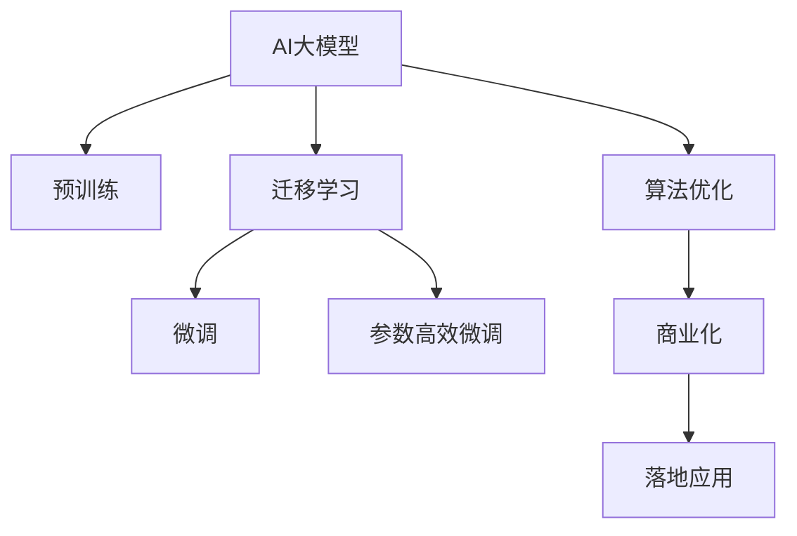

                 

# AI大模型创业：如何应对未来市场挑战？

## 1. 背景介绍

### 1.1 问题由来
随着人工智能技术的快速发展，AI大模型（如GPT-3、BERT等）在自然语言处理（NLP）、计算机视觉（CV）、语音识别等领域取得了显著突破。这些大模型基于海量的数据进行预训练，具备强大的泛化能力，在应用领域展示了巨大的潜力。但同时，大模型的开发、部署、维护成本较高，市场竞争激烈，这对AI大模型的创业公司提出了巨大挑战。

### 1.2 问题核心关键点
AI大模型创业公司如何克服技术壁垒，打造差异化优势，获取市场份额，实现商业成功？本文将从技术、市场、运营等多个角度，探讨AI大模型创业公司应对未来市场挑战的策略。

## 2. 核心概念与联系

### 2.1 核心概念概述

1. **AI大模型**：基于深度学习技术，通过在大规模数据上预训练学习到广泛知识的大型模型。
2. **迁移学习**：通过在目标任务上微调预训练模型，提升模型在特定任务上的性能。
3. **微调**：在大模型基础上，使用特定任务的数据进行进一步训练，优化模型在该任务上的表现。
4. **参数高效微调**：只更新小部分模型参数，避免过拟合，提升微调效率。
5. **算法优化**：包括模型结构设计、优化器选择、超参数调优等，以提升模型性能和训练速度。
6. **商业化**：将AI大模型应用到具体业务场景中，实现产品化、服务化，获取商业价值。

这些核心概念构成了AI大模型创业的基石，通过理解它们之间的关系，可以帮助创业公司更好地应对市场挑战。

### 2.2 核心概念原理和架构的 Mermaid 流程图



此流程图展示了AI大模型从预训练到商业化的全过程，其中迁移学习和微调是核心环节。

## 3. 核心算法原理 & 具体操作步骤

### 3.1 算法原理概述

AI大模型的创业过程涉及到多个关键环节，包括模型构建、数据预处理、模型微调、算法优化和商业化等。这些环节通过一系列算法原理和技术手段连接起来，形成了一个完整的AI大模型创业框架。

1. **模型构建**：选择合适的深度学习框架（如PyTorch、TensorFlow），设计合适的模型结构（如卷积神经网络CNN、循环神经网络RNN、Transformer等）。
2. **数据预处理**：对收集到的数据进行清洗、标注、划分训练集和测试集等预处理工作，确保数据的质量和多样性。
3. **模型微调**：在目标任务上，使用预训练模型进行微调，提升模型在该任务上的性能。
4. **算法优化**：通过选择合适的优化器、学习率、正则化等技术手段，提升模型训练速度和效果。
5. **商业化**：将训练好的模型应用到具体业务场景中，实现产品化、服务化，获取商业价值。

### 3.2 算法步骤详解

#### 3.2.1 模型构建

1. **选择合适的框架**：根据项目需求选择合适的深度学习框架，如PyTorch、TensorFlow等。
2. **设计模型结构**：根据任务类型，选择合适的模型结构，如CNN用于图像识别，RNN用于序列数据处理，Transformer用于自然语言处理。
3. **初始化模型参数**：使用预训练模型或随机初始化模型参数。

#### 3.2.2 数据预处理

1. **数据收集**：收集目标任务的标注数据，确保数据的多样性和代表性。
2. **数据清洗**：处理数据中的噪声、缺失值等，确保数据质量。
3. **数据标注**：对数据进行标注，确保标注的准确性和一致性。
4. **数据划分**：将数据划分为训练集、验证集和测试集，确保模型在未见过的数据上也能表现良好。

#### 3.2.3 模型微调

1. **选择微调方法**：根据任务类型，选择合适的微调方法，如全参数微调、参数高效微调、Prompt Tuning等。
2. **设置超参数**：设置学习率、批大小、迭代轮数等超参数。
3. **训练模型**：在训练集上使用梯度下降等优化算法训练模型，在验证集上评估模型性能，防止过拟合。
4. **微调完成**：在测试集上评估模型性能，根据性能指标调整超参数，重复训练过程直至模型收敛。

#### 3.2.4 算法优化

1. **选择合适的优化器**：根据任务特点选择合适的优化器，如SGD、AdamW等。
2. **设置学习率**：根据任务复杂度和数据规模，选择合适的学习率。
3. **应用正则化技术**：使用L2正则、Dropout、Early Stopping等技术，防止过拟合。
4. **使用梯度积累和混合精度**：优化模型训练速度和资源消耗。

### 3.3 算法优缺点

#### 3.3.1 优点

1. **泛化能力强**：预训练模型在多种任务上表现优异，能够快速适应新任务。
2. **开发周期短**：基于预训练模型微调，能够快速开发新应用，缩短产品上市时间。
3. **效果显著**：微调方法能够在少量标注数据下，提升模型性能。

#### 3.3.2 缺点

1. **资源消耗大**：大模型的预训练和微调需要大量计算资源和存储空间。
2. **成本高**：大模型的开发和部署成本较高，需要高水平的工程师和技术支持。
3. **风险高**：市场竞争激烈，创业公司面临巨大的市场和技术风险。

### 3.4 算法应用领域

AI大模型在多个领域具有广泛的应用前景，包括：

1. **自然语言处理（NLP）**：如文本分类、情感分析、机器翻译、对话系统等。
2. **计算机视觉（CV）**：如图像分类、物体检测、人脸识别、视频分析等。
3. **语音识别**：如语音命令识别、语音转换、语音合成等。
4. **推荐系统**：如电商推荐、内容推荐、广告推荐等。
5. **金融分析**：如风险评估、信用评分、市场预测等。

## 4. 数学模型和公式 & 详细讲解 & 举例说明

### 4.1 数学模型构建

假设目标任务为二分类任务，模型结构为深度神经网络，使用交叉熵损失函数。训练集为 $(x_i, y_i)$，其中 $x_i$ 为输入， $y_i \in \{0, 1\}$ 为标签。模型参数为 $\theta$，训练过程如下：

1. **模型定义**：
   $$
   \begin{aligned}
   M_{\theta}(x) &= [w_1 \cdot x_1 + b_1, w_2 \cdot x_2 + b_2, \ldots, w_n \cdot x_n + b_n] \\
   f_{\theta}(x) &= \sigma(W \cdot M_{\theta}(x) + b)
   \end{aligned}
   $$
   其中 $x_i = (x_{i1}, x_{i2}, \ldots, x_{in})$， $w_j$ 和 $b_j$ 为第 $j$ 层的权重和偏置， $\sigma$ 为激活函数。

2. **损失函数**：
   $$
   \mathcal{L}(\theta) = -\frac{1}{N} \sum_{i=1}^N [y_i \log f_{\theta}(x_i) + (1-y_i) \log (1-f_{\theta}(x_i))]
   $$

### 4.2 公式推导过程

假设训练集大小为 $N$，模型参数更新公式为：
$$
\theta \leftarrow \theta - \eta \nabla_{\theta} \mathcal{L}(\theta)
$$
其中 $\eta$ 为学习率， $\nabla_{\theta} \mathcal{L}(\theta)$ 为损失函数对模型参数的梯度，通过反向传播算法计算得到。

### 4.3 案例分析与讲解

假设在情感分析任务上进行微调，数据集为电影评论和情感标签。使用BERT作为预训练模型，使用AdaGrad作为优化器，设置学习率为 $1e-3$，批大小为 $32$，迭代轮数为 $10$。训练过程如下：

1. **模型初始化**：使用预训练的BERT模型，初始化模型参数。
2. **数据预处理**：对电影评论进行清洗和标注。
3. **划分数据集**：将数据集划分为训练集、验证集和测试集。
4. **训练模型**：在训练集上使用AdaGrad优化器，设置学习率，训练模型，在验证集上评估模型性能，防止过拟合。
5. **微调完成**：在测试集上评估模型性能，根据性能指标调整超参数，重复训练过程直至模型收敛。

## 5. 项目实践：代码实例和详细解释说明

### 5.1 开发环境搭建

1. **安装Anaconda**：从官网下载并安装Anaconda，用于创建独立的Python环境。
2. **创建虚拟环境**：
   ```bash
   conda create -n myenv python=3.8
   conda activate myenv
   ```
3. **安装PyTorch**：
   ```bash
   pip install torch torchvision torchaudio
   ```
4. **安装TensorFlow**：
   ```bash
   pip install tensorflow
   ```
5. **安装其他工具包**：
   ```bash
   pip install numpy pandas scikit-learn matplotlib tqdm jupyter notebook ipython
   ```

### 5.2 源代码详细实现

#### 5.2.1 数据预处理

```python
import pandas as pd
from sklearn.model_selection import train_test_split
from transformers import BertTokenizer

# 加载数据集
df = pd.read_csv('movie_reviews.csv')

# 提取文本和标签
texts = df['text'].tolist()
labels = df['label'].tolist()

# 划分训练集和测试集
train_texts, test_texts, train_labels, test_labels = train_test_split(texts, labels, test_size=0.2, random_state=42)

# 初始化分词器
tokenizer = BertTokenizer.from_pretrained('bert-base-cased')
```

#### 5.2.2 模型构建

```python
from transformers import BertForSequenceClassification

# 定义模型结构
model = BertForSequenceClassification.from_pretrained('bert-base-cased', num_labels=2)
```

#### 5.2.3 模型微调

```python
from torch.utils.data import Dataset, DataLoader
from torch.optim import AdaGrad

# 定义数据集
class MovieReviewDataset(Dataset):
    def __init__(self, texts, labels):
        self.texts = texts
        self.labels = labels
        self.tokenizer = tokenizer
        self.max_len = 128

    def __len__(self):
        return len(self.texts)

    def __getitem__(self, item):
        text = self.texts[item]
        label = self.labels[item]

        encoding = self.tokenizer(text, return_tensors='pt', max_length=self.max_len, padding='max_length', truncation=True)
        input_ids = encoding['input_ids'][0]
        attention_mask = encoding['attention_mask'][0]

        encoded_labels = [label] * self.max_len
        labels = torch.tensor(encoded_labels, dtype=torch.long)

        return {'input_ids': input_ids, 
                'attention_mask': attention_mask,
                'labels': labels}

# 加载数据集
train_dataset = MovieReviewDataset(train_texts, train_labels)
test_dataset = MovieReviewDataset(test_texts, test_labels)

# 设置优化器
optimizer = AdaGrad(model.parameters(), lr=1e-3)

# 训练模型
epochs = 10
batch_size = 32

for epoch in range(epochs):
    for batch in DataLoader(train_dataset, batch_size=batch_size, shuffle=True):
        input_ids = batch['input_ids'].to(device)
        attention_mask = batch['attention_mask'].to(device)
        labels = batch['labels'].to(device)
        model.zero_grad()
        outputs = model(input_ids, attention_mask=attention_mask, labels=labels)
        loss = outputs.loss
        loss.backward()
        optimizer.step()

    print(f'Epoch {epoch+1}, loss: {loss:.3f}')
```

### 5.3 代码解读与分析

1. **数据预处理**：使用Pandas加载数据集，提取文本和标签，并使用BertTokenizer进行分词。
2. **模型构建**：使用BertForSequenceClassification定义模型结构，指定标签数量。
3. **模型微调**：使用AdaGrad优化器进行模型训练，设置学习率和批大小，在验证集上评估模型性能，防止过拟合。

## 6. 实际应用场景

### 6.1 智能客服系统

智能客服系统能够7x24小时不间断服务，快速响应客户咨询，提升客户体验。使用预训练的BERT模型，微调模型进行情感分析和意图识别，结合自然语言处理技术，构建智能客服系统。

### 6.2 金融舆情监测

金融机构需要实时监测市场舆论动向，防止负面信息传播。使用BERT模型进行情感分析和事件识别，构建金融舆情监测系统，及时预警潜在风险。

### 6.3 个性化推荐系统

推荐系统能够根据用户兴趣推荐个性化内容，提升用户体验。使用BERT模型进行文本分析和用户行为分析，构建个性化推荐系统，提高推荐效果。

### 6.4 未来应用展望

未来，AI大模型将在更多领域得到应用，为传统行业带来变革性影响。在智慧医疗、智能教育、智慧城市等场景中，大模型将助力数字化转型升级，加速创新发展。

## 7. 工具和资源推荐

### 7.1 学习资源推荐

1. **《Transformer从原理到实践》系列博文**：深入浅出介绍Transformer原理和BERT模型。
2. **CS224N《深度学习自然语言处理》课程**：斯坦福大学NLP课程，涵盖NLP基本概念和经典模型。
3. **《Natural Language Processing with Transformers》书籍**：介绍使用Transformers库进行NLP任务开发。
4. **HuggingFace官方文档**：提供预训练模型和微调样例代码。
5. **CLUE开源项目**：提供中文NLP数据集和微调baseline。

### 7.2 开发工具推荐

1. **PyTorch**：灵活动态的计算图，适合深度学习研究。
2. **TensorFlow**：生产部署方便，适合大规模工程应用。
3. **Transformers库**：集成了SOTA语言模型，支持PyTorch和TensorFlow。
4. **Weights & Biases**：模型训练实验跟踪工具。
5. **TensorBoard**：实时监测模型训练状态，提供图表呈现方式。
6. **Google Colab**：在线Jupyter Notebook环境，免费GPU/TPU算力。

### 7.3 相关论文推荐

1. **Attention is All You Need**：Transformer原论文，提出Transformer结构。
2. **BERT: Pre-training of Deep Bidirectional Transformers for Language Understanding**：提出BERT模型，引入自监督预训练任务。
3. **Language Models are Unsupervised Multitask Learners（GPT-2论文）**：展示大模型zero-shot学习能力。
4. **Parameter-Efficient Transfer Learning for NLP**：提出Adapter等参数高效微调方法。
5. **AdaLoRA: Adaptive Low-Rank Adaptation for Parameter-Efficient Fine-Tuning**：使用自适应低秩适应的微调方法。
6. **Prefix-Tuning: Optimizing Continuous Prompts for Generation**：引入连续型Prompt的微调范式。

## 8. 总结：未来发展趋势与挑战

### 8.1 研究成果总结

AI大模型微调技术在多个NLP任务上取得了优异性能，但面临数据标注成本高、模型鲁棒性不足、推理效率低等挑战。未来需探索无监督和半监督微调方法，优化参数高效微调，融合因果和对比学习范式，引入先验知识，结合因果分析和博弈论工具，纳入伦理道德约束。

### 8.2 未来发展趋势

1. **模型规模增大**：超大规模语言模型将进一步提升模型的泛化能力。
2. **微调方法多样化**：参数高效微调、Prefix-Tuning、LoRA等方法将提升微调效率和效果。
3. **持续学习成为常态**：模型需持续学习新知识，避免灾难性遗忘。
4. **少样本和零样本学习**：Prompt Tuning等方法将在更少标注数据下提升模型性能。
5. **多模态微调崛起**：融合视觉、语音等多模态信息，增强模型的理解能力。
6. **通用性增强**：大模型将具备更强的常识推理和跨领域迁移能力。

### 8.3 面临的挑战

1. **标注成本瓶颈**：数据标注成本高，需探索无监督和半监督微调方法。
2. **模型鲁棒性不足**：域外数据泛化性能差，需提高模型鲁棒性。
3. **推理效率有待提高**：模型推理速度慢，需优化模型结构和计算图。
4. **可解释性不足**：模型缺乏可解释性，需提高模型的可解释性。
5. **安全性有待保障**：模型可能学习有害信息，需确保模型安全。
6. **知识整合能力不足**：模型难以整合先验知识，需增强模型的知识整合能力。

### 8.4 研究展望

1. **探索无监督和半监督微调方法**：利用自监督学习、主动学习等方法，降低数据标注成本。
2. **开发参数高效和计算高效的微调方法**：如Adapter、Prefix等，提升微调效率和效果。
3. **融合因果和对比学习范式**：增强模型的泛化能力和鲁棒性。
4. **引入更多先验知识**：与知识图谱、逻辑规则等专家知识结合，提升模型性能。
5. **结合因果分析和博弈论工具**：增强模型的稳定性和安全性。
6. **纳入伦理道德约束**：确保模型输出符合伦理道德，避免有害输出。

## 9. 附录：常见问题与解答

**Q1: AI大模型创业需要哪些关键技术？**

A: 需要深度学习框架、模型结构设计、数据预处理、模型微调、算法优化、商业化等关键技术。

**Q2: AI大模型微调中如何防止过拟合？**

A: 数据增强、正则化、Dropout、Early Stopping等技术可以防止过拟合。

**Q3: 如何选择优化器？**

A: 根据任务特点选择SGD、AdamW等优化器，调整学习率和批大小。

**Q4: AI大模型的开发和部署成本高吗？**

A: 高，需要高性能设备、高水平工程师、大量计算资源和存储空间。

**Q5: AI大模型在商业化过程中需要注意什么？**

A: 模型裁剪、量化加速、服务化封装、弹性伸缩、监控告警、安全防护等。

---

作者：禅与计算机程序设计艺术 / Zen and the Art of Computer Programming

