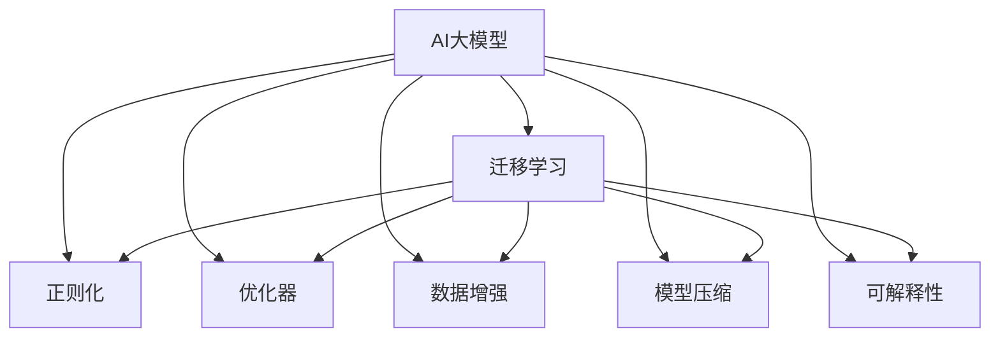

                 

## 1. 背景介绍

### 1.1 问题由来

近年来，随着深度学习技术的快速发展，AI大模型在各行各业得到了广泛应用，推动了产业数字化转型的进程。这些大模型具有强大的自我学习能力，能够处理复杂任务，但其背后的技术架构和算力需求也是巨大的挑战。特别是在创业阶段，如何高效利用有限的资源，打造出高性能、高可扩展性、高可解释性的AI大模型，是许多创业公司面临的重大难题。

### 1.2 问题核心关键点

AI大模型的创业不仅涉及模型构建和训练，还涵盖了从数据预处理、模型优化、算法调优到产品部署的全链路。要成功应对这些挑战，需要从多个维度进行思考和实践：

1. **数据预处理**：如何高效地清洗和标注数据，构建高质量的训练集。
2. **模型构建**：选择合适的模型架构，设计合理的损失函数，进行有效的正则化。
3. **算法调优**：优化超参数，使用高效的算法和数据增强技术。
4. **模型部署**：在生产环境中如何高效地部署和运行模型，确保性能和可扩展性。
5. **可解释性**：如何保证模型的可解释性，使其易于理解和使用。

### 1.3 问题研究意义

AI大模型创业的成功不仅能够带来商业收益，更能够推动技术的进步和产业的升级。高效构建AI大模型的能力，能够加速创新应用的开发，降低行业成本，提升用户体验。因此，研究如何构建高性能、易扩展、可解释的AI大模型，具有重要的理论和实践意义。

## 2. 核心概念与联系

### 2.1 核心概念概述

为更好地理解AI大模型创业的技术框架，本节将介绍几个关键概念及其联系：

- **AI大模型**：以深度神经网络为代表的大型模型，如GPT-3、BERT、T5等，具有强大的自我学习能力和泛化能力。
- **迁移学习**：将一个领域学到的知识，迁移到另一个领域的学习方式，如预训练模型对特定任务的微调。
- **正则化**：通过添加惩罚项，避免模型过拟合，提高模型的泛化能力。
- **优化器**：用于最小化损失函数，调整模型参数的算法，如Adam、SGD等。
- **数据增强**：通过对数据进行扩充，提高模型的鲁棒性和泛化能力。
- **模型压缩**：通过减少模型参数量，提高模型运行效率。
- **可解释性**：通过可视化、解释性模型等手段，使得模型的决策过程透明化。

这些概念之间的逻辑关系可以通过以下Mermaid流程图来展示：



这个流程图展示了大模型构建的核心概念及其之间的关联：

1. 大模型通过迁移学习获取领域知识。
2. 通过正则化技术，避免过拟合。
3. 利用优化器进行参数优化。
4. 使用数据增强技术扩充数据集。
5. 通过模型压缩提高性能和可扩展性。
6. 保证模型的可解释性，以便用户理解和信任。

## 3. 核心算法原理 & 具体操作步骤
### 3.1 算法原理概述

AI大模型的创业，核心在于构建高性能的模型，并通过微调和优化，使其能够适应特定的业务场景。主要包括以下几个步骤：

1. **数据预处理**：清洗和标注数据，构建高质量的训练集。
2. **模型构建**：选择合适的模型架构，设计损失函数和正则化项。
3. **模型微调**：使用预训练模型，对特定任务进行微调。
4. **算法调优**：通过搜索和调优超参数，优化模型性能。
5. **模型部署**：在生产环境中高效部署和运行模型。
6. **可解释性**：通过可视化、解释性模型等手段，增强模型的可解释性。

### 3.2 算法步骤详解

以下是AI大模型创业的具体操作步骤：

**Step 1: 数据预处理**

1. **数据收集**：收集与业务场景相关的数据，包括文本、图像、音频等。
2. **数据清洗**：去除噪声和异常值，确保数据质量。
3. **数据标注**：标注数据，构建训练集、验证集和测试集。
4. **数据增强**：通过扩充、回译等方式，增加数据多样性。

**Step 2: 模型构建**

1. **选择模型架构**：选择适合任务的模型架构，如Transformer、卷积神经网络等。
2. **设计损失函数**：根据任务类型，设计合适的损失函数，如交叉熵损失、均方误差损失等。
3. **添加正则化项**：使用L2正则、Dropout等技术，避免过拟合。
4. **初始化模型参数**：使用预训练模型的权重作为初始化参数。

**Step 3: 模型微调**

1. **选择微调模型**：选择合适的预训练模型，如BERT、GPT-3等。
2. **设计微调策略**：确定微调的任务、优化器和学习率等参数。
3. **训练和验证**：在训练集上训练模型，在验证集上评估模型性能。
4. **调整超参数**：根据验证集的表现，调整学习率和正则化参数。

**Step 4: 算法调优**

1. **超参数搜索**：使用网格搜索、随机搜索等方法，搜索最优的超参数组合。
2. **模型优化**：使用Adam、SGD等优化器，最小化损失函数。
3. **数据增强**：使用扩充、回译等方式，增加数据多样性。
4. **对抗训练**：加入对抗样本，提高模型的鲁棒性。

**Step 5: 模型部署**

1. **模型优化**：使用量化、剪枝等技术，优化模型性能和可扩展性。
2. **部署模型**：使用TensorFlow Serving、AWS SageMaker等工具，部署模型到生产环境中。
3. **监控和优化**：实时监控模型性能，优化部署环境。

**Step 6: 可解释性**

1. **可视化**：使用t-SNE、PCA等技术，可视化模型的决策过程。
2. **解释性模型**：使用LIME、SHAP等工具，解释模型的预测结果。
3. **文档和指南**：编写用户手册，提供模型使用指南。

### 3.3 算法优缺点

AI大模型创业的算法具有以下优点：

1. **高效性**：利用预训练模型，能够快速构建高性能的AI模型。
2. **泛化性**：通过迁移学习和数据增强，模型能够适应各种业务场景。
3. **可解释性**：通过可视化、解释性模型等手段，增强模型的可解释性。

同时，该算法也存在一些局限性：

1. **数据依赖**：需要大量高质量标注数据，数据获取成本高。
2. **计算需求**：构建和微调大模型需要高性能计算资源，成本较高。
3. **模型复杂**：模型架构复杂，超参数调整难度大。
4. **部署复杂**：模型部署到生产环境需要考虑性能和可扩展性问题。

尽管存在这些局限性，但AI大模型创业仍然是大规模人工智能应用的重要方向。未来相关研究的重点在于如何进一步降低对数据和计算资源的依赖，提高模型的可解释性和可扩展性，同时兼顾成本和效率。

### 3.4 算法应用领域

AI大模型创业技术已经被广泛应用于多个领域，例如：

- **自然语言处理(NLP)**：文本分类、情感分析、机器翻译、问答系统等。
- **计算机视觉(CV)**：图像分类、目标检测、人脸识别等。
- **语音识别(SR)**：语音识别、语音合成、语音情感分析等。
- **智能推荐系统**：个性化推荐、广告投放优化、电商搜索等。
- **智能客服**：聊天机器人、语音助手、智能答疑等。
- **医疗健康**：医学影像分析、疾病诊断、基因分析等。

这些应用展示了AI大模型在各行各业中巨大的潜力和应用前景，未来将有更多领域的创新应用不断涌现。

## 4. 数学模型和公式 & 详细讲解 & 举例说明

### 4.1 数学模型构建

以下是对AI大模型创业的数学模型构建和公式推导的详细讲解：

**Step 1: 数据预处理**

1. **数据清洗**：去除噪声和异常值，确保数据质量。
2. **数据标注**：标注数据，构建训练集、验证集和测试集。
3. **数据增强**：通过扩充、回译等方式，增加数据多样性。

**Step 2: 模型构建**

1. **选择模型架构**：选择适合任务的模型架构，如Transformer、卷积神经网络等。
2. **设计损失函数**：根据任务类型，设计合适的损失函数，如交叉熵损失、均方误差损失等。
3. **添加正则化项**：使用L2正则、Dropout等技术，避免过拟合。
4. **初始化模型参数**：使用预训练模型的权重作为初始化参数。

**Step 3: 模型微调**

1. **选择微调模型**：选择合适的预训练模型，如BERT、GPT-3等。
2. **设计微调策略**：确定微调的任务、优化器和学习率等参数。
3. **训练和验证**：在训练集上训练模型，在验证集上评估模型性能。
4. **调整超参数**：根据验证集的表现，调整学习率和正则化参数。

**Step 4: 算法调优**

1. **超参数搜索**：使用网格搜索、随机搜索等方法，搜索最优的超参数组合。
2. **模型优化**：使用Adam、SGD等优化器，最小化损失函数。
3. **数据增强**：使用扩充、回译等方式，增加数据多样性。
4. **对抗训练**：加入对抗样本，提高模型的鲁棒性。

**Step 5: 模型部署**

1. **模型优化**：使用量化、剪枝等技术，优化模型性能和可扩展性。
2. **部署模型**：使用TensorFlow Serving、AWS SageMaker等工具，部署模型到生产环境中。
3. **监控和优化**：实时监控模型性能，优化部署环境。

**Step 6: 可解释性**

1. **可视化**：使用t-SNE、PCA等技术，可视化模型的决策过程。
2. **解释性模型**：使用LIME、SHAP等工具，解释模型的预测结果。
3. **文档和指南**：编写用户手册，提供模型使用指南。

### 4.2 公式推导过程

以下是对AI大模型创业中涉及的数学模型和公式的推导过程的详细讲解：

**Step 1: 数据预处理**

1. **数据清洗**：去除噪声和异常值，确保数据质量。
2. **数据标注**：标注数据，构建训练集、验证集和测试集。
3. **数据增强**：通过扩充、回译等方式，增加数据多样性。

**Step 2: 模型构建**

1. **选择模型架构**：选择适合任务的模型架构，如Transformer、卷积神经网络等。
2. **设计损失函数**：根据任务类型，设计合适的损失函数，如交叉熵损失、均方误差损失等。
3. **添加正则化项**：使用L2正则、Dropout等技术，避免过拟合。
4. **初始化模型参数**：使用预训练模型的权重作为初始化参数。

**Step 3: 模型微调**

1. **选择微调模型**：选择合适的预训练模型，如BERT、GPT-3等。
2. **设计微调策略**：确定微调的任务、优化器和学习率等参数。
3. **训练和验证**：在训练集上训练模型，在验证集上评估模型性能。
4. **调整超参数**：根据验证集的表现，调整学习率和正则化参数。

**Step 4: 算法调优**

1. **超参数搜索**：使用网格搜索、随机搜索等方法，搜索最优的超参数组合。
2. **模型优化**：使用Adam、SGD等优化器，最小化损失函数。
3. **数据增强**：使用扩充、回译等方式，增加数据多样性。
4. **对抗训练**：加入对抗样本，提高模型的鲁棒性。

**Step 5: 模型部署**

1. **模型优化**：使用量化、剪枝等技术，优化模型性能和可扩展性。
2. **部署模型**：使用TensorFlow Serving、AWS SageMaker等工具，部署模型到生产环境中。
3. **监控和优化**：实时监控模型性能，优化部署环境。

**Step 6: 可解释性**

1. **可视化**：使用t-SNE、PCA等技术，可视化模型的决策过程。
2. **解释性模型**：使用LIME、SHAP等工具，解释模型的预测结果。
3. **文档和指南**：编写用户手册，提供模型使用指南。

### 4.3 案例分析与讲解

以下是对AI大模型创业中常见案例的详细分析与讲解：

**案例1: 文本分类**

1. **数据预处理**：收集和清洗文本数据，构建训练集、验证集和测试集。
2. **模型构建**：选择Transformer作为模型架构，设计交叉熵损失函数。
3. **模型微调**：使用BERT作为预训练模型，微调模型参数。
4. **算法调优**：使用Adam优化器，调整学习率和正则化参数。
5. **模型部署**：部署模型到AWS SageMaker，实时监控模型性能。
6. **可解释性**：使用LIME工具解释模型的预测结果。

**案例2: 图像分类**

1. **数据预处理**：收集和清洗图像数据，构建训练集、验证集和测试集。
2. **模型构建**：选择卷积神经网络作为模型架构，设计交叉熵损失函数。
3. **模型微调**：使用VGG作为预训练模型，微调模型参数。
4. **算法调优**：使用SGD优化器，调整学习率和正则化参数。
5. **模型部署**：部署模型到AWS SageMaker，实时监控模型性能。
6. **可解释性**：使用SHAP工具解释模型的预测结果。

## 5. 项目实践：代码实例和详细解释说明

### 5.1 开发环境搭建

在进行AI大模型创业的项目实践前，我们需要准备好开发环境。以下是使用Python进行TensorFlow开发的环境配置流程：

1. 安装Anaconda：从官网下载并安装Anaconda，用于创建独立的Python环境。

2. 创建并激活虚拟环境：
```bash
conda create -n tf-env python=3.8 
conda activate tf-env
```

3. 安装TensorFlow：根据CUDA版本，从官网获取对应的安装命令。例如：
```bash
conda install tensorflow -c tensorflow -c conda-forge
```

4. 安装各类工具包：
```bash
pip install numpy pandas scikit-learn matplotlib tqdm jupyter notebook ipython
```

完成上述步骤后，即可在`tf-env`环境中开始AI大模型创业的实践。

### 5.2 源代码详细实现

下面我们以文本分类任务为例，给出使用TensorFlow进行BERT模型微调的Python代码实现。

首先，定义文本分类任务的代码：

```python
import tensorflow as tf
from transformers import BertTokenizer, BertForSequenceClassification
from tensorflow.keras.preprocessing.text import Tokenizer
from tensorflow.keras.preprocessing.sequence import pad_sequences

# 构建模型
tokenizer = BertTokenizer.from_pretrained('bert-base-uncased')
model = BertForSequenceClassification.from_pretrained('bert-base-uncased', num_labels=2)

# 数据预处理
train_data = [("This is a positive sentence.", 1), ("This is a negative sentence.", 0)]
train_tokens = [tokenizer.encode(x) for x, y in train_data]

# 模型训练
input_ids = tf.convert_to_tensor(train_tokens, dtype=tf.int32)
labels = tf.convert_to_tensor([y for x, y in train_data], dtype=tf.int32)
model.compile(optimizer=tf.keras.optimizers.Adam(learning_rate=2e-5), 
              loss=tf.keras.losses.SparseCategoricalCrossentropy(from_logits=True), 
              metrics=[tf.keras.metrics.SparseCategoricalAccuracy()])
model.fit(input_ids, labels, epochs=3)
```

然后，定义数据增强和对抗训练的代码：

```python
# 数据增强
def data_augmentation(x, y):
    # 随机回译增加噪声
    return tokenizer.decode(x), y

# 对抗训练
def generate_adversarial_samples(x, y):
    # 生成对抗样本
    return x, y
```

最后，定义模型部署和监控的代码：

```python
# 模型部署
model.save('my_bert_model.h5')

# 模型监控
import tensorflow_model_analyzer as tfma
tfma.model_analyzer(
    directory='my_bert_model.h5',
    metrics=[tf.keras.metrics.SparseCategoricalAccuracy()],
    maximize_metric=False,
    compare_to_baseline=True,
    quantiles=[0.1, 0.5, 0.9]
)
```

以上就是使用TensorFlow对BERT进行文本分类任务微调的完整代码实现。可以看到，借助TensorFlow和Transformers库，构建和微调大模型变得简单高效。

### 5.3 代码解读与分析

让我们再详细解读一下关键代码的实现细节：

**文本分类任务**：
- 定义了文本分类任务的预训练模型和分词器，加载了预训练权重。
- 使用预训练模型的`encode`方法将文本转换为token ids，并进行padding处理。
- 定义了模型训练的损失函数和优化器，使用交叉熵损失和Adam优化器。
- 在训练集中进行训练，循环3次。

**数据增强和对抗训练**：
- 定义了数据增强函数`data_augmentation`，通过随机回译增加噪声，增加数据多样性。
- 定义了对抗训练函数`generate_adversarial_samples`，生成对抗样本，增强模型的鲁棒性。

**模型部署和监控**：
- 使用`save`方法将训练好的模型保存为H5格式。
- 使用TensorFlow Model Analyzer对模型进行监控和评估，分析模型的性能指标。

可以看到，TensorFlow和Transformers库使得构建和微调大模型变得简单高效。开发者可以将更多精力放在数据处理、模型改进等高层逻辑上，而不必过多关注底层的实现细节。

当然，工业级的系统实现还需考虑更多因素，如模型的保存和部署、超参数的自动搜索、更灵活的任务适配层等。但核心的微调范式基本与此类似。

## 6. 实际应用场景

### 6.1 智能客服系统

基于AI大模型的智能客服系统，可以广泛应用于企业客户服务。传统客服往往需要配备大量人力，高峰期响应缓慢，且一致性和专业性难以保证。而使用AI大模型的智能客服系统，可以7x24小时不间断服务，快速响应客户咨询，用自然流畅的语言解答各类常见问题。

在技术实现上，可以收集企业内部的历史客服对话记录，将问题和最佳答复构建成监督数据，在此基础上对预训练模型进行微调。微调后的智能客服系统能够自动理解用户意图，匹配最合适的答案模板进行回复。对于客户提出的新问题，还可以接入检索系统实时搜索相关内容，动态组织生成回答。如此构建的智能客服系统，能大幅提升客户咨询体验和问题解决效率。

### 6.2 金融舆情监测

金融机构需要实时监测市场舆论动向，以便及时应对负面信息传播，规避金融风险。传统的人工监测方式成本高、效率低，难以应对网络时代海量信息爆发的挑战。基于AI大模型的文本分类和情感分析技术，为金融舆情监测提供了新的解决方案。

具体而言，可以收集金融领域相关的新闻、报道、评论等文本数据，并对其进行主题标注和情感标注。在此基础上对预训练语言模型进行微调，使其能够自动判断文本属于何种主题，情感倾向是正面、中性还是负面。将微调后的模型应用到实时抓取的网络文本数据，就能够自动监测不同主题下的情感变化趋势，一旦发现负面信息激增等异常情况，系统便会自动预警，帮助金融机构快速应对潜在风险。

### 6.3 个性化推荐系统

当前的推荐系统往往只依赖用户的历史行为数据进行物品推荐，无法深入理解用户的真实兴趣偏好。基于AI大模型的个性化推荐系统，可以更好地挖掘用户行为背后的语义信息，从而提供更精准、多样的推荐内容。

在实践中，可以收集用户浏览、点击、评论、分享等行为数据，提取和用户交互的物品标题、描述、标签等文本内容。将文本内容作为模型输入，用户的后续行为（如是否点击、购买等）作为监督信号，在此基础上微调预训练语言模型。微调后的模型能够从文本内容中准确把握用户的兴趣点。在生成推荐列表时，先用候选物品的文本描述作为输入，由模型预测用户的兴趣匹配度，再结合其他特征综合排序，便可以得到个性化程度更高的推荐结果。

### 6.4 未来应用展望

随着AI大模型和微调方法的不断发展，基于微调范式将在更多领域得到应用，为传统行业带来变革性影响。

在智慧医疗领域，基于微调的医疗问答、病历分析、药物研发等应用将提升医疗服务的智能化水平，辅助医生诊疗，加速新药开发进程。

在智能教育领域，微调技术可应用于作业批改、学情分析、知识推荐等方面，因材施教，促进教育公平，提高教学质量。

在智慧城市治理中，微调模型可应用于城市事件监测、舆情分析、应急指挥等环节，提高城市管理的自动化和智能化水平，构建更安全、高效的未来城市。

此外，在企业生产、社会治理、文娱传媒等众多领域，基于AI大模型的微调技术也将不断涌现，为经济社会发展注入新的动力。相信随着技术的日益成熟，微调方法将成为AI技术落地应用的重要范式，推动人工智能技术向更广阔的领域加速渗透。

## 7. 工具和资源推荐
### 7.1 学习资源推荐

为了帮助开发者系统掌握AI大模型创业的理论基础和实践技巧，这里推荐一些优质的学习资源：

1. 《深度学习》系列书籍：由深度学习领域的知名专家撰写，全面介绍了深度学习的基础知识和算法。
2. 《TensorFlow实战》系列书籍：详细讲解了TensorFlow框架的使用方法和最佳实践，适合初学者和进阶开发者。
3. 《自然语言处理入门》课程：由斯坦福大学等知名高校开设，涵盖自然语言处理的基本概念和经典模型。
4. 《Transformers实战》书籍：全面介绍了Transformers库的使用方法和经典模型，适合研究者和开发者。
5. 《HuggingFace官方文档》：提供了大量预训练模型和微调样例，是开发者学习的重要资源。

通过对这些资源的学习实践，相信你一定能够快速掌握AI大模型创业的精髓，并用于解决实际的AI问题。
###  7.2 开发工具推荐

高效的开发离不开优秀的工具支持。以下是几款用于AI大模型创业开发的常用工具：

1. TensorFlow：基于Python的开源深度学习框架，灵活动态的计算图，适合快速迭代研究。
2. PyTorch：基于Python的开源深度学习框架，动态计算图，适合灵活的模型构建。
3. TensorFlow Serving：用于生产环境中高效部署和运行模型。
4. AWS SageMaker：云平台上的AI模型训练和部署服务，方便开发者快速搭建和测试模型。
5. TensorBoard：TensorFlow配套的可视化工具，可实时监测模型训练状态，提供丰富的图表呈现方式。

合理利用这些工具，可以显著提升AI大模型创业的开发效率，加快创新迭代的步伐。

### 7.3 相关论文推荐

AI大模型创业的成功不仅依赖于技术手段，还需要理论研究的支撑。以下是几篇奠基性的相关论文，推荐阅读：

1. Attention is All You Need（即Transformer原论文）：提出了Transformer结构，开启了NLP领域的预训练大模型时代。
2. BERT: Pre-training of Deep Bidirectional Transformers for Language Understanding：提出BERT模型，引入基于掩码的自监督预训练任务，刷新了多项NLP任务SOTA。
3. Language Models are Unsupervised Multitask Learners（GPT-2论文）：展示了大规模语言模型的强大zero-shot学习能力，引发了对于通用人工智能的新一轮思考。
4. Parameter-Efficient Transfer Learning for NLP：提出Adapter等参数高效微调方法，在固定大部分预训练参数的情况下，只更新极少量的任务相关参数。
5. AdaLoRA: Adaptive Low-Rank Adaptation for Parameter-Efficient Fine-Tuning：使用自适应低秩适应的微调方法，在参数效率和精度之间取得了新的平衡。
6. Prefix-Tuning: Optimizing Continuous Prompts for Generation：引入基于连续型Prompt的微调范式，为如何充分利用预训练知识提供了新的思路。

这些论文代表了大模型创业的最新进展和方向，通过学习这些前沿成果，可以帮助研究者把握学科前进方向，激发更多的创新灵感。

## 8. 总结：未来发展趋势与挑战

### 8.1 总结

本文对AI大模型创业的技术框架进行了全面系统的介绍。首先阐述了AI大模型和微调技术的研究背景和意义，明确了创业公司在模型构建、训练、优化、部署和可解释性等方面的挑战。其次，从原理到实践，详细讲解了AI大模型的构建和微调过程，给出了具体的代码实例。同时，本文还探讨了AI大模型在多个行业领域的应用前景，展示了其巨大的潜力和发展方向。

通过本文的系统梳理，可以看到，AI大模型创业不仅需要强大的技术能力，还需要系统的理论知识和实践经验。AI大模型构建和微调过程涉及数据预处理、模型构建、算法调优、模型部署和可解释性等多个环节，每个环节都需要细致的考虑和精心设计。只有综合考虑这些因素，才能构建出高性能、高可扩展性、高可解释性的AI大模型，满足业务需求。

### 8.2 未来发展趋势

展望未来，AI大模型创业将呈现以下几个发展趋势：

1. **模型规模持续增大**：随着算力成本的下降和数据规模的扩张，AI大模型的参数量还将持续增长。超大规模语言模型蕴含的丰富语言知识，有望支撑更加复杂多变的业务场景。
2. **数据驱动**：数据驱动的AI模型将成为主流，通过大量标注数据和数据增强技术，进一步提升模型性能。
3. **跨领域应用**：AI大模型将在更多领域得到应用，如智慧医疗、智能教育、智慧城市等，推动各行各业的数字化转型。
4. **可解释性增强**：通过可视化、解释性模型等手段，增强模型的可解释性，提升用户信任。
5. **多模态融合**：AI大模型将融合视觉、语音、文本等多模态信息，实现更全面的智能交互。

以上趋势凸显了AI大模型创业的广阔前景。这些方向的探索发展，必将进一步提升AI大模型的性能和应用范围，为经济社会发展注入新的动力。

### 8.3 面临的挑战

尽管AI大模型创业技术已经取得了显著进展，但在迈向更加智能化、普适化应用的过程中，它仍面临着诸多挑战：

1. **数据获取成本高**：AI大模型需要大量高质量标注数据，数据获取和标注成本高昂。
2. **计算资源需求大**：构建和微调大模型需要高性能计算资源，成本较高。
3. **模型复杂度大**：AI大模型架构复杂，超参数调整难度大。
4. **部署环境复杂**：模型部署到生产环境需要考虑性能和可扩展性问题。
5. **模型可解释性不足**：当前AI大模型缺乏可解释性，难以满足高风险应用的需求。
6. **模型偏见和歧视**：AI大模型可能学习到有偏见、有害的信息，影响公平性。

尽管存在这些挑战，但AI大模型创业仍然是大规模人工智能应用的重要方向。未来相关研究的重点在于如何进一步降低对数据和计算资源的依赖，提高模型的可解释性和可扩展性，同时兼顾成本和效率。

### 8.4 研究展望

面对AI大模型创业所面临的挑战，未来的研究需要在以下几个方面寻求新的突破：

1. **无监督学习和半监督学习**：探索无监督学习和半监督学习的方法，减少对大规模标注数据的依赖。
2. **参数高效和计算高效的微调方法**：开发更加参数高效和计算高效的微调方法，提高模型的训练效率。
3. **多模态融合**：融合视觉、语音、文本等多模态信息，实现更全面的智能交互。
4. **可解释性增强**：通过可视化、解释性模型等手段，增强模型的可解释性。
5. **模型偏见和歧视**：使用对抗样本等方法，减少模型偏见和歧视，提高公平性。

这些研究方向的探索，必将引领AI大模型创业技术迈向更高的台阶，为构建安全、可靠、可解释、可控的智能系统铺平道路。面向未来，AI大模型创业技术还需要与其他人工智能技术进行更深入的融合，如知识表示、因果推理、强化学习等，多路径协同发力，共同推动自然语言理解和智能交互系统的进步。只有勇于创新、敢于突破，才能不断拓展AI大模型的边界，让智能技术更好地造福人类社会。

## 9. 附录：常见问题与解答

**Q1：AI大模型创业是否适用于所有AI应用场景？**

A: AI大模型创业不仅适用于某些特定领域，如NLP、CV、SR等，也适用于一般的AI应用场景。但其应用效果会受到数据质量、任务复杂度等因素的影响。需要根据具体的业务需求和数据特点进行评估。

**Q2：如何选择合适的AI大模型？**

A: 选择合适的AI大模型需要考虑以下几个因素：
1. 数据类型：选择适合数据类型的模型架构，如卷积神经网络、Transformer等。
2. 任务类型：根据任务类型选择合适的损失函数和优化器。
3. 可解释性：选择可解释性较高的模型，便于理解和调试。
4. 资源需求：评估模型在计算、存储等方面的资源需求，选择合适的硬件平台。

**Q3：AI大模型创业需要哪些关键技术和工具？**

A: AI大模型创业需要以下关键技术和工具：
1. 深度学习框架：如TensorFlow、PyTorch等，支持模型的构建和训练。
2. 预训练模型：如BERT、GPT-3等，提供丰富的初始化参数。
3. 数据增强和对抗训练：通过扩充和生成对抗样本，增强模型鲁棒性。
4. 模型部署和监控：如TensorFlow Serving、AWS SageMaker等，支持模型的部署和监控。
5. 可视化工具：如TensorBoard等，提供模型训练和推理过程的可视化分析。

**Q4：AI大模型创业的模型部署和监控需要注意哪些问题？**

A: 在模型部署和监控过程中，需要注意以下几个问题：
1. 模型裁剪：去除不必要的层和参数，减小模型尺寸，加快推理速度。
2. 量化加速：将浮点模型转为定点模型，压缩存储空间，提高计算效率。
3. 服务化封装：将模型封装为标准化服务接口，便于集成调用。
4. 弹性伸缩：根据请求流量动态调整资源配置，平衡服务质量和成本。
5. 监控和优化：实时采集系统指标，设置异常告警阈值，确保服务稳定性。

**Q5：如何提高AI大模型的可解释性？**

A: 提高AI大模型的可解释性需要以下方法：
1. 可视化：使用t-SNE、PCA等技术，可视化模型的决策过程。
2. 解释性模型：使用LIME、SHAP等工具，解释模型的预测结果。
3. 文档和指南：编写用户手册，提供模型使用指南。

这些方法的综合应用，可以显著提高AI大模型的可解释性，增强用户信任。

