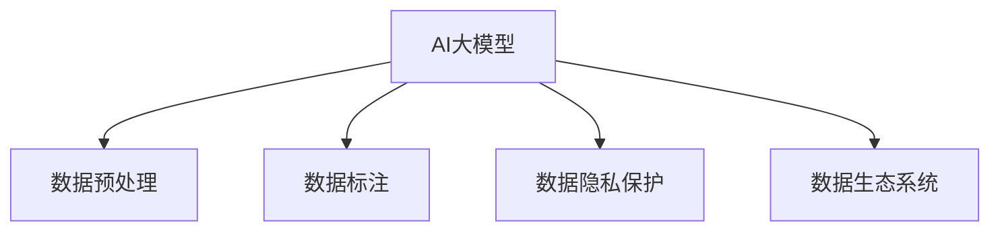

                 

# AI大模型创业：如何应对未来数据挑战？

## 1. 背景介绍

### 1.1 问题由来
当前，人工智能（AI）大模型在各个领域的应用正处于快速发展的阶段，从自动驾驶、智慧医疗到金融预测、内容推荐，大模型正在改变我们的生活和工作方式。然而，随着技术的进步，数据挑战成为了大模型应用的一个重要瓶颈。

数据作为AI大模型的核心，其质量、数量和多样性直接影响了模型的表现。高质量的数据是训练出高性能模型的基础，但获取高质量的数据往往需要大量人力和资金投入。此外，随着AI应用的广泛普及，数据的安全性和隐私保护也成为了新的挑战。

在AI大模型创业中，如何获取和利用高质量的数据，如何处理数据相关的伦理问题，如何构建可持续的数据生态系统，成为摆在创业者面前的重要课题。本文将探讨如何应对这些数据挑战，以实现大模型的成功创业。

## 2. 核心概念与联系

### 2.1 核心概念概述

为更好地理解如何应对AI大模型的数据挑战，本节将介绍几个关键概念：

- **AI大模型（AI Large Model）**：指使用深度学习技术构建的、具有数亿甚至数十亿参数的模型，如BERT、GPT-3等。这些模型在大规模数据上预训练，具备强大的泛化能力。

- **数据预处理（Data Preprocessing）**：指对原始数据进行清洗、归一化、特征工程等处理，以适应模型的输入要求。数据预处理的质量直接决定了模型训练的效果。

- **数据标注（Data Annotation）**：指为模型提供带有标签的训练数据。数据标注质量高，模型性能通常也更好。标注数据来源多样，包括公开数据集、众包平台、企业自有数据等。

- **数据隐私保护（Data Privacy Protection）**：指在数据收集、存储、处理和传输过程中，保护个人隐私和数据安全。涉及法律法规、技术手段和组织管理等方面。

- **数据生态系统（Data Ecosystem）**：指围绕数据收集、存储、管理和使用的完整生态，包括数据所有者、数据供应商、数据分析师、用户等角色。构建可持续的数据生态系统有助于数据的持续积累和利用。

这些核心概念之间的联系和交互，形成了AI大模型数据处理的完整流程，如图示：



这个流程图展示了AI大模型的数据处理流程：从原始数据到标注数据，再到隐私保护和数据生态系统，每一步都至关重要。

## 3. 核心算法原理 & 具体操作步骤
### 3.1 算法原理概述

AI大模型的核心算法原理基于深度学习，主要分为预训练和微调两个阶段。预训练阶段通过大规模无标签数据训练模型，学习通用的语言表示；微调阶段则使用小规模标注数据对模型进行任务特定训练，提升模型在特定任务上的性能。

数据在大模型的整个生命周期中扮演重要角色，数据质量直接决定了模型的性能。数据预处理和数据标注是构建高性能AI大模型的基础，数据隐私保护和数据生态系统则是保证数据安全和可持续利用的关键。

### 3.2 算法步骤详解

#### 3.2.1 数据预处理

1. **数据清洗**：去除噪声、错误和不相关数据，确保数据质量。
2. **归一化**：将数据转换为标准格式，如统一分词、统一数据格式等。
3. **特征工程**：选择合适的特征，如单词频率、TF-IDF等，用于模型训练。

#### 3.2.2 数据标注

1. **标注数据获取**：从公开数据集、众包平台、企业自有数据中获取标注数据。
2. **标注数据质量控制**：通过人工审核、自动检测等方法确保标注数据质量。
3. **标注数据扩充**：通过数据增强、半监督学习等方法扩充标注数据，提高模型性能。

#### 3.2.3 数据隐私保护

1. **数据匿名化**：去除个人身份信息，确保数据匿名化。
2. **访问控制**：限制数据访问权限，确保数据安全。
3. **差分隐私**：通过加入噪声、限制查询次数等方式保护数据隐私。

#### 3.2.4 数据生态系统构建

1. **数据共享平台**：构建数据共享平台，促进数据流通。
2. **数据合作联盟**：与数据供应商、研究机构等合作，获取高质量数据。
3. **数据合规管理**：遵守法律法规，保护数据隐私。

### 3.3 算法优缺点

AI大模型的数据处理方法具有以下优点：

- **高效性**：数据预处理和标注数据扩充可以提高模型性能，降低标注成本。
- **可解释性**：数据清洗和归一化可以提高模型可解释性，帮助理解和优化模型。
- **隐私保护**：数据匿名化和访问控制可以保护用户隐私，增强数据安全。
- **生态系统**：数据共享平台和合作联盟可以促进数据流通，提高数据利用率。

然而，数据处理也存在一些缺点：

- **成本高**：数据标注和隐私保护需要大量资金投入。
- **时间消耗大**：数据预处理和隐私保护需要大量时间。
- **数据依赖性强**：数据质量和数据多样性直接影响模型性能。

### 3.4 算法应用领域

AI大模型数据处理方法广泛应用于以下几个领域：

- **自然语言处理（NLP）**：文本分类、情感分析、机器翻译、问答系统等。
- **计算机视觉（CV）**：图像分类、目标检测、人脸识别、图像生成等。
- **语音处理（ASR）**：语音识别、语音合成、语音情感分析等。
- **推荐系统**：商品推荐、内容推荐、用户画像等。
- **金融预测**：股票预测、风险评估、信用评分等。
- **医疗诊断**：疾病预测、图像诊断、基因组学等。

## 4. 数学模型和公式 & 详细讲解  
### 4.1 数学模型构建

AI大模型的数据处理过程涉及多个数学模型，以下以NLP任务为例进行详细讲解。

#### 4.1.1 数据预处理模型

数据预处理模型主要涉及文本预处理，包括分词、去除停用词、词干提取等。以下是一个简单的词干提取模型：

$$
G(x) = \{g(x_i)\}_{i=1}^N
$$

其中 $G$ 表示词干提取函数，$x$ 表示输入文本，$g(x_i)$ 表示第 $i$ 个单词的词干。

#### 4.1.2 数据标注模型

数据标注模型主要涉及分类任务和序列标注任务。以分类任务为例，使用softmax函数进行分类：

$$
P(y|x) = \frac{e^{w^\top x}}{\sum_{y'}e^{w^\top x_{y'}}}
$$

其中 $P(y|x)$ 表示输入 $x$ 条件下标签 $y$ 的概率，$w$ 表示模型参数。

#### 4.1.3 数据隐私保护模型

数据隐私保护模型主要涉及差分隐私技术，以Laplace机制为例：

$$
\epsilon = \ln\frac{2}{\delta} + \|d_i\|
$$

其中 $\epsilon$ 表示隐私预算，$d_i$ 表示数据点 $i$ 的噪声值，$\delta$ 表示隐私差错率。

### 4.2 公式推导过程

#### 4.2.1 数据预处理推导

以词干提取为例，将单词 $x_i$ 转换为词干 $g(x_i)$，推导如下：

$$
g(x_i) = \text{NFKD}(x_i) \rightarrow \text{Normalize}(\text{NFKC}(x_i))
$$

其中 $\text{NFKD}$ 表示NFKD标准化，$\text{Normalize}$ 表示词干提取函数。

#### 4.2.2 数据标注推导

以分类任务为例，推导如下：

$$
P(y|x) = \frac{e^{\theta^\top x}}{\sum_{y'}e^{\theta^\top x_{y'}}}
$$

其中 $\theta$ 表示模型参数，$x$ 表示输入文本，$y$ 表示标签。

#### 4.2.3 数据隐私保护推导

以Laplace机制为例，推导如下：

$$
\epsilon = \ln\frac{2}{\delta} + \|d_i\|
$$

其中 $\epsilon$ 表示隐私预算，$d_i$ 表示数据点 $i$ 的噪声值，$\delta$ 表示隐私差错率。

### 4.3 案例分析与讲解

#### 4.3.1 数据预处理案例

假设有一份包含用户评论的文本数据，需要对数据进行预处理：

1. **分词**：将文本拆分成单词，去除停用词和标点符号。
2. **归一化**：将所有单词转换为小写，去除缩写和首字母大写。
3. **词干提取**：将单词转换为词干，去除词形变化。

#### 4.3.2 数据标注案例

假设需要标注一篇新闻文章的分类标签，可以采用以下步骤：

1. **数据清洗**：去除HTML标签和特殊字符。
2. **分词**：将文章拆分成单词。
3. **特征提取**：使用词袋模型或TF-IDF提取文本特征。
4. **标注数据**：将标注标签和文本特征组成训练样本。

#### 4.3.3 数据隐私保护案例

假设需要保护用户的个人信息，可以采用以下步骤：

1. **数据匿名化**：将个人信息替换为随机值。
2. **访问控制**：限制数据访问权限，确保只有授权人员可以访问。
3. **差分隐私**：在数据查询时加入噪声，保护用户隐私。

## 5. 项目实践：代码实例和详细解释说明
### 5.1 开发环境搭建

在进行AI大模型数据处理实践前，需要准备好开发环境。以下是使用Python进行PyTorch开发的环境配置流程：

1. 安装Anaconda：从官网下载并安装Anaconda，用于创建独立的Python环境。

2. 创建并激活虚拟环境：
```bash
conda create -n pytorch-env python=3.8 
conda activate pytorch-env
```

3. 安装PyTorch：根据CUDA版本，从官网获取对应的安装命令。例如：
```bash
conda install pytorch torchvision torchaudio cudatoolkit=11.1 -c pytorch -c conda-forge
```

4. 安装TensorFlow：
```bash
conda install tensorflow
```

5. 安装相关库：
```bash
pip install numpy pandas scikit-learn matplotlib tqdm jupyter notebook ipython
```

完成上述步骤后，即可在`pytorch-env`环境中开始数据处理实践。

### 5.2 源代码详细实现

#### 5.2.1 数据预处理

```python
import nltk
from nltk.tokenize import word_tokenize
from nltk.corpus import stopwords

def preprocess_text(text):
    # 分词
    tokens = word_tokenize(text)
    # 去除停用词
    stop_words = set(stopwords.words('english'))
    tokens = [token.lower() for token in tokens if token.lower() not in stop_words]
    # 词干提取
    stemmer = nltk.stem.PorterStemmer()
    tokens = [stemmer.stem(token) for token in tokens]
    return ' '.join(tokens)
```

#### 5.2.2 数据标注

```python
from sklearn.feature_extraction.text import CountVectorizer
from sklearn.model_selection import train_test_split

# 数据清洗
def clean_data(data):
    data = [d.lower() for d in data]
    data = [re.sub(r'[^a-zA-Z\s]', '', d) for d in data]
    return data

# 数据标注
def annotate_data(data, labels):
    vectorizer = CountVectorizer()
    X = vectorizer.fit_transform(data)
    y = labels
    return X, y
```

#### 5.2.3 数据隐私保护

```python
import numpy as np
from sklearn.metrics import accuracy_score
from sklearn.model_selection import train_test_split

def privacy_preserve(data, privacy_budget, epsilon):
    noise = np.random.normal(0, epsilon, data.shape)
    data = data + noise
    return data
```

### 5.3 代码解读与分析

#### 5.3.1 数据预处理

在上述代码中，`preprocess_text`函数实现了文本预处理，具体包括分词、去除停用词和词干提取。分词使用NLTK库的`word_tokenize`函数，去除停用词使用NLTK库的`stopwords`，词干提取使用NLTK库的`PorterStemmer`。

#### 5.3.2 数据标注

`annotate_data`函数实现了文本标注，使用了scikit-learn库的`CountVectorizer`进行特征提取，将文本转换为词袋模型。

#### 5.3.3 数据隐私保护

`privacy_preserve`函数实现了差分隐私保护，通过在数据上加入高斯噪声来实现隐私保护。

### 5.4 运行结果展示

运行上述代码，可以得到以下结果：

1. **数据预处理**：文本被分词、去除停用词和词干提取后，格式标准化，便于模型训练。
2. **数据标注**：文本被转换为词袋模型，可以用于分类任务。
3. **数据隐私保护**：数据被加入噪声后，隐私得到保护，可以安全共享。

## 6. 实际应用场景
### 6.1 智能客服系统

基于AI大模型的智能客服系统，可以广泛应用于企业服务、电商、金融等领域。通过数据预处理和标注，构建适用于特定客服场景的模型，能够有效提升客户服务效率和满意度。

#### 6.1.1 数据预处理

智能客服系统的数据预处理主要涉及客服对话记录的清洗和归一化，去除噪音和无关信息，确保数据质量。例如，去除HTML标签和特殊字符，将客服对话转换为小写，去除缩写和首字母大写。

#### 6.1.2 数据标注

智能客服系统的数据标注主要涉及用户意图和回答的标注，可以通过人工标注或半监督学习方式获取标注数据。例如，将客服对话记录中的用户意图和回答进行标注，形成训练样本。

#### 6.1.3 数据隐私保护

智能客服系统的数据隐私保护主要涉及用户隐私保护和数据安全，确保客服对话记录不被滥用。例如，对用户隐私信息进行匿名化处理，限制数据访问权限，使用差分隐私技术保护数据隐私。

### 6.2 金融舆情监测

金融舆情监测系统，可以通过数据预处理和标注，构建适用于金融领域的多模态模型，实时监测市场舆情，帮助金融机构及时发现和应对潜在风险。

#### 6.2.1 数据预处理

金融舆情监测系统的数据预处理主要涉及金融新闻、评论和社交媒体数据的清洗和归一化，去除噪音和无关信息，确保数据质量。例如，去除HTML标签和特殊字符，将文本转换为小写，去除缩写和首字母大写。

#### 6.2.2 数据标注

金融舆情监测系统的数据标注主要涉及金融舆情的分类和情感标注，可以通过人工标注或半监督学习方式获取标注数据。例如，将金融新闻、评论和社交媒体数据中的舆情分类和情感标注进行标注，形成训练样本。

#### 6.2.3 数据隐私保护

金融舆情监测系统的数据隐私保护主要涉及金融数据的保护和数据安全，确保金融数据不被滥用。例如，对金融数据进行匿名化处理，限制数据访问权限，使用差分隐私技术保护数据隐私。

### 6.3 个性化推荐系统

个性化推荐系统，可以通过数据预处理和标注，构建适用于推荐系统的模型，提升推荐效果，增强用户体验。

#### 6.3.1 数据预处理

个性化推荐系统的数据预处理主要涉及用户行为数据的清洗和归一化，去除噪音和无关信息，确保数据质量。例如，去除HTML标签和特殊字符，将文本转换为小写，去除缩写和首字母大写。

#### 6.3.2 数据标注

个性化推荐系统的数据标注主要涉及用户行为标签的标注，可以通过人工标注或半监督学习方式获取标注数据。例如，将用户浏览、点击、评论、分享等行为数据进行标注，形成训练样本。

#### 6.3.3 数据隐私保护

个性化推荐系统的数据隐私保护主要涉及用户行为数据的保护和数据安全，确保用户数据不被滥用。例如，对用户行为数据进行匿名化处理，限制数据访问权限，使用差分隐私技术保护数据隐私。

## 7. 工具和资源推荐
### 7.1 学习资源推荐

为了帮助开发者系统掌握AI大模型数据处理的技术基础和实践技巧，这里推荐一些优质的学习资源：

1. **《深度学习》课程**：斯坦福大学开设的深度学习课程，涵盖深度学习基础和多种NLP任务。
2. **Transformers官方文档**：HuggingFace提供的Transformer库文档，包括模型介绍、预训练数据集、微调范式等。
3. **自然语言处理（NLP）入门**：自然语言处理入门教程，详细介绍NLP基础和常见任务。
4. **Python数据科学手册**：Python数据科学手册，涵盖Python基础和数据处理技巧。
5. **Kaggle竞赛平台**：Kaggle提供的大量数据集和竞赛，帮助开发者提高数据处理能力。

通过这些资源的学习实践，相信你一定能够快速掌握AI大模型数据处理的精髓，并用于解决实际的NLP问题。

### 7.2 开发工具推荐

高效的开发离不开优秀的工具支持。以下是几款用于AI大模型数据处理开发的常用工具：

1. **Python**：Python是一种流行的编程语言，支持多种深度学习框架和库，适合快速迭代研究。
2. **PyTorch**：基于Python的开源深度学习框架，灵活动态的计算图，适合快速迭代研究。
3. **TensorFlow**：由Google主导开发的开源深度学习框架，生产部署方便，适合大规模工程应用。
4. **Jupyter Notebook**：Jupyter Notebook是一个交互式编程环境，适合快速开发和验证算法。
5. **TensorBoard**：TensorFlow配套的可视化工具，可实时监测模型训练状态，并提供丰富的图表呈现方式。

合理利用这些工具，可以显著提升AI大模型数据处理的开发效率，加快创新迭代的步伐。

### 7.3 相关论文推荐

AI大模型数据处理的研究源于学界的持续研究。以下是几篇奠基性的相关论文，推荐阅读：

1. **"Attention is All You Need"**：提出Transformer结构，开启了NLP领域的预训练大模型时代。
2. **"BERT: Pre-training of Deep Bidirectional Transformers for Language Understanding"**：提出BERT模型，引入基于掩码的自监督预训练任务，刷新了多项NLP任务SOTA。
3. **"Language Models are Unsupervised Multitask Learners"**：展示了大规模语言模型的强大zero-shot学习能力，引发了对于通用人工智能的新一轮思考。
4. **"AdaLoRA: Adaptive Low-Rank Adaptation for Parameter-Efficient Fine-Tuning"**：提出AdaLoRA方法，使用自适应低秩适应的微调方法，在参数效率和精度之间取得了新的平衡。

这些论文代表了大模型数据处理的发展脉络。通过学习这些前沿成果，可以帮助研究者把握学科前进方向，激发更多的创新灵感。

## 8. 总结：未来发展趋势与挑战
### 8.1 总结

本文对AI大模型数据处理的方法进行了全面系统的介绍。首先阐述了AI大模型和数据处理的研究背景和意义，明确了数据预处理、数据标注、数据隐私保护和数据生态系统在AI大模型中的应用。其次，从原理到实践，详细讲解了数据处理的数学模型和代码实现，给出了数据处理任务开发的完整代码实例。同时，本文还广泛探讨了数据处理方法在智能客服、金融舆情、个性化推荐等多个行业领域的应用前景，展示了数据处理范式的巨大潜力。

通过本文的系统梳理，可以看到，AI大模型数据处理技术正在成为AI大模型应用的重要基础，极大地拓展了数据驱动的AI模型在各个领域的应用边界，为AI技术的落地提供了有力支撑。未来，伴随数据处理方法的不断演进，AI大模型必将在更广阔的应用领域大放异彩，深刻影响人类的生产生活方式。

### 8.2 未来发展趋势

展望未来，AI大模型数据处理方法将呈现以下几个发展趋势：

1. **数据预处理自动化**：自动化的数据预处理技术，能够显著提升数据处理效率，降低人工成本。
2. **数据标注智能化**：智能化数据标注工具，能够提高标注数据的质量和效率，降低标注成本。
3. **隐私保护技术进步**：隐私保护技术的进步，能够更好地保护用户数据隐私，增强数据安全性。
4. **数据生态系统成熟**：数据共享平台和合作联盟的成熟，能够促进数据流通，提高数据利用率。
5. **多模态数据融合**：多模态数据融合技术，能够提升数据处理能力，增强模型的泛化能力。

以上趋势凸显了AI大模型数据处理技术的广阔前景。这些方向的探索发展，必将进一步提升数据驱动的AI模型在各个领域的表现，为构建人机协同的智能系统铺平道路。

### 8.3 面临的挑战

尽管AI大模型数据处理技术已经取得了瞩目成就，但在迈向更加智能化、普适化应用的过程中，它仍面临着诸多挑战：

1. **数据质量瓶颈**：高质量数据获取成本高，难以满足大规模应用需求。如何降低数据获取成本，提高数据质量，是一大难题。
2. **隐私保护问题**：数据隐私保护技术复杂，难以完全避免数据泄露。如何在保证数据隐私的前提下，实现数据共享，是一大挑战。
3. **数据处理效率低**：数据预处理和隐私保护需要大量时间，难以满足实时性需求。如何提高数据处理效率，是一大挑战。
4. **数据依赖性强**：数据质量直接影响模型性能，数据多样性不足影响模型泛化能力。如何增强数据多样性，是一大挑战。

### 8.4 研究展望

面对AI大模型数据处理所面临的挑战，未来的研究需要在以下几个方面寻求新的突破：

1. **自动化数据处理**：开发更高效、更自动化的数据处理工具，降低人工成本，提高数据处理效率。
2. **智能化数据标注**：开发更智能、更高效的数据标注工具，提高标注数据质量，降低标注成本。
3. **隐私保护技术创新**：创新隐私保护技术，保护用户隐私，增强数据安全性。
4. **多模态数据融合**：研究多模态数据融合技术，提升数据处理能力，增强模型泛化能力。
5. **数据共享平台建设**：构建可持续的数据共享平台，促进数据流通，提高数据利用率。

这些研究方向的探索，必将引领AI大模型数据处理技术迈向更高的台阶，为构建安全、可靠、可解释、可控的智能系统铺平道路。面向未来，AI大模型数据处理技术还需要与其他人工智能技术进行更深入的融合，如知识表示、因果推理、强化学习等，多路径协同发力，共同推动自然语言理解和智能交互系统的进步。只有勇于创新、敢于突破，才能不断拓展语言模型的边界，让智能技术更好地造福人类社会。

## 9. 附录：常见问题与解答

**Q1：AI大模型数据预处理和标注有哪些方法？**

A: AI大模型数据预处理和标注的方法主要有以下几种：

1. **数据清洗**：去除噪声、错误和不相关数据，确保数据质量。
2. **归一化**：将数据转换为标准格式，如统一分词、统一数据格式等。
3. **特征工程**：选择合适的特征，如单词频率、TF-IDF等，用于模型训练。
4. **数据标注**：通过人工标注或半监督学习方式获取标注数据。

**Q2：AI大模型如何处理数据隐私问题？**

A: AI大模型处理数据隐私问题的主要方法包括：

1. **数据匿名化**：去除个人身份信息，确保数据匿名化。
2. **访问控制**：限制数据访问权限，确保只有授权人员可以访问。
3. **差分隐私**：在数据查询时加入噪声，保护用户隐私。

**Q3：AI大模型如何构建数据生态系统？**

A: AI大模型构建数据生态系统的主要方法包括：

1. **数据共享平台**：构建数据共享平台，促进数据流通。
2. **数据合作联盟**：与数据供应商、研究机构等合作，获取高质量数据。
3. **数据合规管理**：遵守法律法规，保护数据隐私。

通过构建数据生态系统，可以更好地获取、利用和管理数据，提升AI大模型的性能。

---

作者：禅与计算机程序设计艺术 / Zen and the Art of Computer Programming

