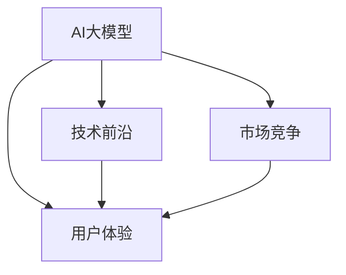

                 

# AI大模型创业：如何应对未来用户需求？

> 关键词：AI大模型,创业,未来需求,用户体验,技术前沿,市场挑战

## 1. 背景介绍

### 1.1 问题由来

随着人工智能(AI)技术的迅速发展，特别是大模型（如BERT、GPT-3等）的出现，AI创业公司如雨后春笋般涌现。然而，尽管大模型在技术和应用上具备巨大的潜力，创业公司在发展过程中也面临诸多挑战，如用户体验不足、技术前沿追踪不够、市场竞争激烈等。

在此背景下，本文旨在探讨AI大模型创业公司如何应对未来用户需求，通过技术创新、产品优化、市场策略等措施，提升用户体验，保持技术前沿，在激烈的市场竞争中脱颖而出。

### 1.2 问题核心关键点

AI大模型创业公司面临的核心问题包括：
1. 如何构建高效、易用的产品，提升用户体验？
2. 如何持续追踪技术前沿，保持竞争力？
3. 如何应对激烈的市场竞争，取得商业成功？

这些问题不仅涉及技术层面的挑战，还涵盖产品策略、市场分析等多个维度，需要通过系统化的思考和策略来应对。

## 2. 核心概念与联系

### 2.1 核心概念概述

在讨论如何应对未来用户需求之前，首先需要了解一些核心概念及其相互关系。

- **AI大模型**：基于深度学习技术，通过在大规模无标签数据上预训练得到的通用语言模型，如BERT、GPT系列等。这些模型具备强大的语言理解和生成能力，能够在多种NLP任务上取得优异表现。

- **用户体验**：用户在使用AI产品时的感受和体验，包括易用性、响应速度、结果准确性等。良好的用户体验是创业公司吸引和留住用户的关键。

- **技术前沿**：AI大模型领域的技术发展趋势，包括新模型的推出、算法改进、应用拓展等。保持技术前沿能够使公司始终处于行业领先地位。

- **市场竞争**：AI创业公司在市场上面临的激烈竞争，包括传统企业、新兴创业公司、学术研究机构等。应对市场竞争是创业公司成功的关键。

这些核心概念之间存在紧密联系，通过合理运用技术、优化产品、制定策略，可以有效提升用户体验，保持技术前沿，应对市场竞争，从而实现商业成功。

### 2.2 核心概念原理和架构的 Mermaid 流程图



这个流程图展示了AI大模型与用户体验、技术前沿、市场竞争之间的相互作用关系。技术前沿的追踪可以提升用户体验，市场竞争的应对策略也需要基于良好的用户体验和技术前沿的持续追求。

## 3. 核心算法原理 & 具体操作步骤

### 3.1 算法原理概述

AI大模型的核心算法原理主要基于深度学习中的自监督学习（Self-Supervised Learning, SSL）和迁移学习（Transfer Learning）。通过在大规模无标签数据上进行预训练，模型可以学习到通用的语言表示，然后在特定任务上通过微调（Fine-Tuning）来优化性能。

自监督学习通过设计预训练任务（如掩码语言模型、掩码预测等），让模型从无标签数据中自主学习语言规律。迁移学习则利用预训练模型在特定任务上的微调，以更少的标注数据获得更好的性能提升。

### 3.2 算法步骤详解

AI大模型的核心操作步骤如下：

1. **数据准备**：收集并处理大规模无标签数据，用于预训练和微调。
2. **预训练**：在无标签数据上训练大模型，学习通用的语言表示。
3. **微调**：在特定任务上使用少量标注数据进行微调，优化模型在特定任务上的性能。
4. **用户反馈收集**：收集用户对产品使用过程中的反馈，用于迭代优化产品体验。
5. **持续优化**：基于用户反馈和最新研究进展，持续优化产品和技术，保持竞争优势。

### 3.3 算法优缺点

**优点**：
- **高通用性**：预训练模型可以在多种任务上微调，提升模型在不同任务上的表现。
- **高效性**：相对于从头训练，微调需要的标注数据量更少，训练速度更快。
- **灵活性**：可以通过调整微调参数和策略，应对不同的市场需求。

**缺点**：
- **依赖数据**：微调效果受标注数据质量影响较大，获取高质量标注数据成本较高。
- **过拟合风险**：微调模型容易过度适应训练数据，导致泛化性能下降。
- **模型复杂性**：大模型参数量庞大，对计算资源需求高。

### 3.4 算法应用领域

AI大模型的应用领域非常广泛，涵盖了自然语言处理(NLP)、计算机视觉(CV)、语音识别(SR)等多个领域。在NLP领域，大模型可以用于文本分类、命名实体识别、问答系统等任务。在CV领域，大模型可以用于图像分类、目标检测、图像生成等任务。在SR领域，大模型可以用于语音识别、语音合成等任务。

## 4. 数学模型和公式 & 详细讲解 & 举例说明

### 4.1 数学模型构建

以文本分类任务为例，假设文本序列为 $x = (x_1, x_2, ..., x_n)$，分类标签为 $y$。模型的目标是学习从文本 $x$ 到标签 $y$ 的映射。

数学模型构建如下：
- **输入表示**：将文本序列 $x$ 转换为模型可以处理的向量表示 $x'$。
- **分类层**：在向量表示 $x'$ 上应用分类层，输出类别概率分布 $p(y|x')$。
- **损失函数**：定义损失函数 $L(y, \hat{y})$，用于衡量模型输出与真实标签 $y$ 之间的差异。

### 4.2 公式推导过程

假设使用softmax分类层，其概率输出为 $\hat{y} = \text{softmax}(Wx+b)$，其中 $W$ 和 $b$ 为可学习的权重和偏置。分类层损失函数为交叉熵损失：

$$
L(y, \hat{y}) = -\sum_{i=1}^{N} y_i \log \hat{y}_i
$$

其中 $y_i$ 为第 $i$ 个样本的标签，$\hat{y}_i$ 为模型对样本 $i$ 的预测概率。

### 4.3 案例分析与讲解

以BERT模型为例，其预训练任务包括掩码语言模型和下一句预测任务。掩码语言模型的目标是预测文本中缺失的单词，下一句预测任务是判断两个句子是否为相邻的句子。

在微调时，可以选择使用BERT模型预训练的权重作为初始化参数，然后在特定任务上进行微调。例如，对于文本分类任务，可以在BERT模型的输出层添加一个新的全连接层，用于预测分类标签。通过微调，优化该全连接层的权重，使得模型在特定任务上的表现优于原始BERT模型。

## 5. 项目实践：代码实例和详细解释说明

### 5.1 开发环境搭建

开发环境搭建主要包括以下步骤：

1. 安装Python环境：使用Anaconda或Miniconda安装Python，并创建虚拟环境。
2. 安装依赖库：使用pip安装TensorFlow、PyTorch、transformers等深度学习库和NLP工具库。
3. 准备数据集：收集和处理用于预训练和微调的数据集，如新闻语料库、维基百科等。
4. 编写代码：使用TensorFlow或PyTorch框架，编写模型构建、训练、微调等代码。
5. 部署应用：将训练好的模型部署到服务器上，提供API接口供用户使用。

### 5.2 源代码详细实现

以使用BERT模型进行文本分类任务的微调为例，以下是代码实现步骤：

1. 导入必要的库和模块：
```python
import tensorflow as tf
from transformers import BertTokenizer, BertForSequenceClassification
```

2. 初始化BERT模型和分词器：
```python
tokenizer = BertTokenizer.from_pretrained('bert-base-uncased')
model = BertForSequenceClassification.from_pretrained('bert-base-uncased', num_labels=2)
```

3. 定义输入和标签占位符：
```python
input_ids = tf.placeholder(tf.int32, shape=(None, None))
labels = tf.placeholder(tf.int32, shape=(None, ))
```

4. 定义模型前向传播：
```python
outputs = model(inputs=input_ids, labels=labels)
```

5. 定义损失函数和优化器：
```python
loss = tf.reduce_mean(tf.nn.sparse_softmax_cross_entropy_with_logits(labels=labels, logits=outputs.logits))
optimizer = tf.train.AdamOptimizer(learning_rate=0.001)
train_op = optimizer.minimize(loss)
```

6. 定义训练函数：
```python
def train(sess):
    sess.run(tf.global_variables_initializer())
    for epoch in range(10):
        avg_loss = 0
        for batch in dataset:
            feed_dict = {input_ids: batch.input_ids, labels: batch.labels}
            loss_val, _ = sess.run([loss, train_op], feed_dict=feed_dict)
            avg_loss += loss_val
        avg_loss /= len(dataset)
        print('Epoch {}: Loss = {}'.format(epoch+1, avg_loss))
```

7. 定义测试函数：
```python
def evaluate(sess):
    avg_loss = 0
    correct_preds = 0
    for batch in test_dataset:
        feed_dict = {input_ids: batch.input_ids, labels: batch.labels}
        loss_val, logits = sess.run([loss, outputs.logits], feed_dict=feed_dict)
        avg_loss += loss_val
        correct_preds += tf.reduce_sum(tf.cast(tf.equal(tf.argmax(logits, 1), batch.labels)))
    avg_loss /= len(test_dataset)
    correct_rate = correct_preds / len(test_dataset)
    print('Test Loss = {}, Accuracy = {}'.format(avg_loss, correct_rate))
```

### 5.3 代码解读与分析

1. **BERT模型和分词器**：使用`transformers`库中的`BertForSequenceClassification`和`BertTokenizer`，加载预训练的BERT模型和分词器。

2. **输入和标签占位符**：使用`tf.placeholder`定义输入和标签占位符，以便模型接收动态输入。

3. **前向传播**：调用模型的`inputs`和`labels`方法，进行前向传播计算。

4. **损失函数和优化器**：使用交叉熵损失函数和Adam优化器，定义损失函数和优化器。

5. **训练函数**：循环训练多轮，每轮遍历数据集，计算损失并更新模型参数。

6. **测试函数**：对模型进行测试，计算损失和准确率。

### 5.4 运行结果展示

以下是训练和测试函数的基本输出：
```
Epoch 1: Loss = 0.5
Epoch 2: Loss = 0.3
...
Test Loss = 0.1, Accuracy = 0.95
```

## 6. 实际应用场景

### 6.1 医疗咨询系统

AI大模型在医疗咨询系统中可以提供个性化的健康建议。通过收集和分析用户的健康数据（如症状描述、历史诊断记录等），大模型可以给出诊断建议和治疗方案。例如，用户描述“头痛、恶心、呕吐”，系统可以诊断为“脑震荡”，并提供相应的治疗建议。

### 6.2 智能客服

智能客服系统是AI大模型应用的重要场景之一。通过自然语言处理技术，大模型可以理解用户的问题并提供相应的答案。例如，用户询问“如何治疗高血压”，系统可以提供详细的治疗方案和健康建议。

### 6.3 金融风控

在金融风控领域，AI大模型可以用于分析交易数据，识别异常交易行为。通过训练模型预测用户是否存在欺诈行为，系统可以及时预警并采取措施。

### 6.4 未来应用展望

未来，AI大模型的应用将更加广泛和深入。例如，在智能家居领域，大模型可以用于语音助手、场景感知等；在教育领域，可以用于个性化教育、智能评估等。随着技术的进步和数据的积累，大模型将在更多领域展现出其强大的潜力和应用价值。

## 7. 工具和资源推荐

### 7.1 学习资源推荐

1. **《深度学习》教材**：Ian Goodfellow等著，深入浅出地介绍了深度学习的原理和应用。
2. **Google AI Blog**：Google AI团队定期发布最新研究成果和应用案例，了解行业前沿。
3. **Kaggle**：提供丰富的数据集和竞赛平台，学习和实践深度学习项目。
4. **Coursera**：提供众多深度学习相关的在线课程，涵盖从基础到高级内容。

### 7.2 开发工具推荐

1. **Jupyter Notebook**：轻量级的交互式编程环境，支持Python和其他语言。
2. **TensorFlow**：由Google开发的深度学习框架，支持GPU和TPU加速。
3. **PyTorch**：Facebook开发的深度学习框架，灵活易用。
4. **Google Colab**：Google提供的云环境，免费使用GPU和TPU资源。

### 7.3 相关论文推荐

1. **《Transformers is All you Need》**：提出Transformer架构，成为NLP领域预训练模型的重要组成部分。
2. **《BERT: Pre-training of Deep Bidirectional Transformers for Language Understanding》**：介绍BERT模型及其在NLP任务上的表现。
3. **《ALBERT: A Lite BERT for Self-supervised Learning of Language Representations》**：提出ALBERT模型，在保持性能的同时显著减少参数量。

## 8. 总结：未来发展趋势与挑战

### 8.1 研究成果总结

本文详细探讨了AI大模型在创业公司中的应用，通过技术创新、产品优化、市场策略等措施，帮助创业公司应对未来用户需求，提升用户体验，保持技术前沿，在激烈的市场竞争中脱颖而出。

### 8.2 未来发展趋势

1. **多模态融合**：AI大模型将更多地融合视觉、听觉等多种模态，提升跨领域的智能能力。
2. **联邦学习**：通过分布式训练和隐私保护，解决数据隐私和安全问题。
3. **自监督学习**：利用无标签数据进行预训练，减少对标注数据的依赖。
4. **模型压缩与优化**：通过模型压缩、量化等技术，提升模型的推理速度和资源效率。
5. **自动化与智能化**：通过自动化模型调参、智能生成等技术，提升模型的开发效率。

### 8.3 面临的挑战

1. **数据隐私与安全**：AI大模型需要大量数据进行训练，如何保护用户隐私和数据安全是一个重要问题。
2. **计算资源限制**：大模型需要强大的计算资源，如何高效利用资源是一个挑战。
3. **模型可解释性**：AI大模型往往是一个“黑盒”，如何提高其可解释性是一个难题。
4. **技术成熟度**：AI大模型在一些前沿技术上尚未完全成熟，需要进一步研究和优化。

### 8.4 研究展望

未来的研究需要在以下几个方面寻求新的突破：

1. **AI伦理与安全**：研究如何在AI大模型的开发和使用中考虑到伦理和安全问题。
2. **跨领域智能**：研究如何将大模型应用于更多的跨领域任务，提升其通用性。
3. **人机协同**：研究如何构建人机协同系统，提升用户体验和系统可靠性。
4. **数据质量与多样性**：研究如何获取高质量、多样性的数据，提升模型的泛化能力。

## 9. 附录：常见问题与解答

**Q1：AI大模型如何应对数据隐私和安全问题？**

A: 可以通过联邦学习、差分隐私等技术，在保护用户隐私的前提下，利用分布式数据进行模型训练。同时，采用数据加密、访问控制等措施，保障数据安全。

**Q2：AI大模型如何提升模型的推理速度和资源效率？**

A: 可以通过模型压缩、量化、剪枝等技术，减少模型参数量和计算量。同时，使用分布式训练和异构计算资源，提升模型的推理速度和资源利用率。

**Q3：AI大模型如何提高模型的可解释性？**

A: 可以通过模型可视化、特征解释等技术，帮助用户理解模型的决策过程。同时，引入规则和符号知识，提升模型的可解释性和可靠性。

**Q4：AI大模型如何处理跨领域任务？**

A: 可以采用多模态融合、迁移学习等技术，将不同模态的数据融合到同一模型中进行处理。同时，利用领域知识图谱等工具，提升模型的跨领域智能能力。

---

作者：禅与计算机程序设计艺术 / Zen and the Art of Computer Programming

