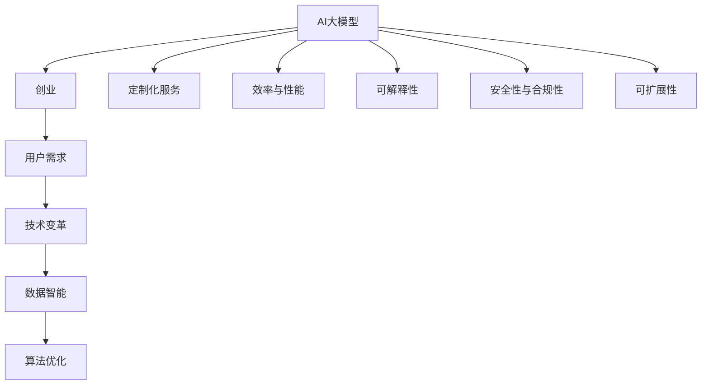

                 

# AI大模型创业：如何应对未来用户需求？

> 关键词：AI大模型,创业,用户需求,技术变革,数据智能,算法优化

## 1. 背景介绍

### 1.1 问题由来

随着人工智能技术的不断进步，特别是大模型和深度学习技术的蓬勃发展，越来越多的创业者看到了在AI大模型领域进行创业的巨大机会。然而，大模型创业不仅需要拥有先进的技术，更需要深刻理解用户需求，不断优化模型以应对市场变化。

### 1.2 问题核心关键点

未来用户对AI大模型的需求主要体现在以下几个方面：

- **效率与性能**：用户期望大模型能提供高效率、高性能的解决方案，减少等待时间，提升用户体验。
- **定制化服务**：不同行业的特定需求要求大模型具备高度定制化能力，能针对具体行业进行优化。
- **可解释性**：用户希望AI大模型的决策过程是透明的，能提供详细的解释和理由。
- **安全性与合规性**：AI大模型应具备良好的安全性，遵守隐私法规，避免数据泄露和滥用。
- **可扩展性**：AI大模型需要具备良好的扩展能力，能根据用户需求快速调整和扩展。

## 2. 核心概念与联系

### 2.1 核心概念概述

为更好地理解如何在AI大模型创业中应对用户需求，本节将介绍几个关键概念：

- **AI大模型**：指基于深度学习、特别是Transformer架构的预训练语言模型。通过在大规模无标签文本数据上进行预训练，学习通用语言表示，具备强大的语言理解和生成能力。

- **创业**：指创立并运营新公司，将技术商业化的过程。AI大模型创业通常需要多学科的协作，包括数据科学、软件工程、商业管理等。

- **用户需求**：指用户在使用AI大模型时的各种具体需求和期望，如响应速度、定制化能力、解释性等。

- **技术变革**：指在AI大模型领域，新兴的技术和算法不断涌现，推动技术进步和应用升级的过程。

- **数据智能**：指通过数据驱动，优化AI大模型性能，提升其解决实际问题的能力。

- **算法优化**：指不断改进AI大模型的算法和模型结构，以适应用户需求和技术变革。

这些核心概念之间的逻辑关系可以通过以下Mermaid流程图来展示：



这个流程图展示了大模型创业的核心概念及其之间的关系：

1. 大模型通过技术变革和数据智能获得性能提升。
2. 用户需求驱动模型优化，提升定制化、效率与性能、可解释性、安全性和可扩展性。
3. 创业公司需综合多领域知识，将技术转化为商业价值。

## 3. 核心算法原理 & 具体操作步骤
### 3.1 算法原理概述

AI大模型创业的核心在于如何将先进的技术转化为符合用户需求的产品或服务。其核心算法原理包括以下几个方面：

- **预训练**：在大规模无标签文本数据上，通过自监督学习任务训练通用语言模型。
- **微调**：通过下游任务的少量标注数据，调整模型参数，优化模型性能。
- **定制化服务**：根据用户需求，设计和训练特定领域的模型。
- **技术变革**：引入新兴技术，提升模型性能和应用效率。
- **数据智能**：利用数据驱动，优化模型参数和结构。
- **算法优化**：通过改进算法，提升模型计算效率和泛化能力。

这些算法原理共同构成了AI大模型创业的技术基础，使其能够应对多变的市场需求。

### 3.2 算法步骤详解

AI大模型创业的具体操作步骤包括：

1. **市场调研**：了解目标用户需求，分析市场竞争情况。
2. **预训练模型选择**：选择合适的预训练大模型作为基础。
3. **数据集构建**：构建符合用户需求的标注数据集，供微调使用。
4. **模型微调**：在标注数据集上进行微调，优化模型性能。
5. **定制化服务设计**：根据用户需求设计定制化服务，提升用户体验。
6. **技术变革引入**：引入最新技术，提升模型性能和应用效率。
7. **数据智能应用**：利用数据驱动，优化模型参数和结构。
8. **算法优化实施**：通过改进算法，提升模型计算效率和泛化能力。
9. **产品开发与测试**：将模型转化为产品，进行用户测试和反馈收集。
10. **迭代优化**：根据用户反馈和市场变化，不断优化产品和服务。

### 3.3 算法优缺点

AI大模型创业的优势在于：

- **技术领先**：利用大模型和深度学习技术的优势，提供高性能的解决方案。
- **定制化能力**：根据用户需求，设计高度定制化的模型和服务。
- **市场灵活性**：能快速响应市场需求变化，推出创新产品。
- **数据驱动**：通过数据智能，不断优化模型性能。

然而，AI大模型创业也存在以下挑战：

- **技术门槛高**：需要多学科的协作，技术实现难度大。
- **成本高**：大模型的训练和优化需要大量计算资源和资金投入。
- **用户需求多变**：市场变化快，用户需求复杂，模型需要不断更新优化。
- **竞争激烈**：市场竞争激烈，需要不断创新以保持竞争力。
- **伦理和安全问题**：AI大模型的应用需要考虑伦理和安全问题，避免数据滥用和隐私泄露。

### 3.4 算法应用领域

AI大模型创业在多个领域有广泛应用：

- **自然语言处理(NLP)**：包括文本分类、情感分析、问答系统、机器翻译等。
- **计算机视觉**：如图像识别、物体检测、视频分析等。
- **推荐系统**：如电商推荐、内容推荐、广告推荐等。
- **医疗健康**：如疾病诊断、基因分析、药物发现等。
- **金融服务**：如信用评估、风险控制、智能投顾等。
- **教育培训**：如智能辅导、作业批改、学习推荐等。

这些领域是大模型创业的重要方向，能带来巨大的商业价值和社会效益。

## 4. 数学模型和公式 & 详细讲解 & 举例说明

### 4.1 数学模型构建

在AI大模型创业中，数学模型主要用于构建预训练和微调模型。常用的数学模型包括：

- **Transformer模型**：基于自注意力机制的预训练模型，广泛应用于各种NLP任务。
- **BERT模型**：基于掩码语言模型的预训练模型，适合文本分类和生成任务。
- **GPT模型**：基于自回归语言模型的预训练模型，适合文本生成和对话系统。
- **GAN模型**：生成对抗网络，用于生成新文本和图像数据。

这些模型在数学上都可以表示为神经网络的形式，由多个层组成，每层包含多个神经元。神经元之间通过权重连接，进行信息传递和计算。

### 4.2 公式推导过程

以BERT模型为例，其基本公式为：

$$
h_i = \text{gelu}(\text{W}_1 \cdot [\text{LayerNorm}(x_i) + \text{Self-Attention}(x_i)] + b_1)
$$

其中，$h_i$表示第$i$层的输出，$x_i$表示第$i$层的输入，$\text{gelu}$表示GELU激活函数，$\text{W}_1$和$b_1$表示第$i$层的权重和偏置。

具体推导过程如下：

1. **输入层**：将输入$x$经过线性变换和激活函数，得到第一个层输出$h_1$。
2. **自注意力层**：对$h_1$进行自注意力计算，得到注意力权重$\alpha$。
3. **多头自注意力**：对注意力权重$\alpha$进行线性变换和激活函数处理，得到多头注意力输出$h_2$。
4. **残差连接和层归一化**：将$h_1$和$h_2$进行残差连接和层归一化，得到下一层输入$x_{i+1}$。
5. **全连接层**：对$x_{i+1}$进行全连接计算，得到下一层输出$h_{i+1}$。
6. **输出层**：对$h_{i+1}$进行线性变换和激活函数处理，得到最终输出$h$。

### 4.3 案例分析与讲解

以BERT模型在文本分类任务中的应用为例，具体步骤如下：

1. **数据准备**：准备文本数据集，并将其分为训练集、验证集和测试集。
2. **预训练模型加载**：加载BERT模型，并根据任务类型选择适当的输出层和损失函数。
3. **微调**：在训练集上进行微调，调整模型参数，优化模型性能。
4. **评估**：在验证集和测试集上评估模型性能，确保模型泛化能力。
5. **预测**：使用微调后的模型对新文本进行分类预测。

下面给出一个简单的代码实现示例：

```python
from transformers import BertForSequenceClassification, BertTokenizer, AdamW
import torch
import torch.nn as nn

# 加载数据集
train_data = ...
train_labels = ...
valid_data = ...
valid_labels = ...
test_data = ...
test_labels = ...

# 加载预训练模型和分词器
model = BertForSequenceClassification.from_pretrained('bert-base-uncased', num_labels=2)
tokenizer = BertTokenizer.from_pretrained('bert-base-uncased')

# 构建模型
class BERTClassifier(nn.Module):
    def __init__(self, model, num_labels):
        super(BERTClassifier, self).__init__()
        self.model = model
        self.num_labels = num_labels
        self.classifier = nn.Linear(model.config.hidden_size, num_labels)
        self.dropout = nn.Dropout(0.1)
    
    def forward(self, input_ids, attention_mask, labels=None):
        outputs = self.model(input_ids, attention_mask=attention_mask, labels=labels)
        pooled_output = outputs.pooler_output
        pooled_output = self.dropout(pooled_output)
        logits = self.classifier(pooled_output)
        return logits

# 构建数据加载器
train_loader = ...
valid_loader = ...
test_loader = ...

# 训练模型
model = BERTClassifier(model, num_labels=2)
optimizer = AdamW(model.parameters(), lr=2e-5)
epochs = 5
for epoch in range(epochs):
    model.train()
    for batch in train_loader:
        input_ids, attention_mask, labels = batch
        logits = model(input_ids, attention_mask=attention_mask, labels=labels)
        loss = nn.CrossEntropyLoss()(logits, labels)
        optimizer.zero_grad()
        loss.backward()
        optimizer.step()
    
    model.eval()
    for batch in valid_loader:
        input_ids, attention_mask, labels = batch
        logits = model(input_ids, attention_mask=attention_mask, labels=labels)
        loss = nn.CrossEntropyLoss()(logits, labels)
        accuracy = ...

# 测试模型
model.eval()
for batch in test_loader:
    input_ids, attention_mask, labels = batch
    logits = model(input_ids, attention_mask=attention_mask, labels=labels)
    accuracy = ...
```

以上代码展示了使用BERT模型进行文本分类任务微调的过程。可以看到，利用Transformers库，代码实现非常简洁高效。

## 5. 项目实践：代码实例和详细解释说明

### 5.1 开发环境搭建

在进行AI大模型创业时，首先需要搭建好开发环境。以下是使用Python进行PyTorch开发的环境配置流程：

1. 安装Anaconda：从官网下载并安装Anaconda，用于创建独立的Python环境。

2. 创建并激活虚拟环境：
```bash
conda create -n pytorch-env python=3.8 
conda activate pytorch-env
```

3. 安装PyTorch：根据CUDA版本，从官网获取对应的安装命令。例如：
```bash
conda install pytorch torchvision torchaudio cudatoolkit=11.1 -c pytorch -c conda-forge
```

4. 安装其他必要的库：
```bash
pip install torchtext transformers sklearn pandas matplotlib
```

完成上述步骤后，即可在`pytorch-env`环境中开始创业实践。

### 5.2 源代码详细实现

下面我们以推荐系统为例，给出使用PyTorch进行AI大模型创业的PyTorch代码实现。

首先，定义推荐系统的模型和数据处理函数：

```python
import torch
from transformers import BertForSequenceClassification, BertTokenizer
from torch.utils.data import DataLoader, Dataset

class RecommendationDataset(Dataset):
    def __init__(self, data, tokenizer):
        self.data = data
        self.tokenizer = tokenizer
    
    def __len__(self):
        return len(self.data)
    
    def __getitem__(self, idx):
        title, content, candidate = self.data[idx]
        tokens = self.tokenizer(title, content, candidate, max_length=512, padding='max_length', truncation=True, return_tensors='pt')
        return {'title': title, 'content': content, 'candidate': candidate, 'tokens': tokens}

# 加载数据集
data = []
for title, content, candidate in ...
    data.append((title, content, candidate))

tokenizer = BertTokenizer.from_pretrained('bert-base-uncased')
dataset = RecommendationDataset(data, tokenizer)
train_loader = DataLoader(dataset, batch_size=8, shuffle=True)
```

然后，定义模型和优化器：

```python
model = BertForSequenceClassification.from_pretrained('bert-base-uncased', num_labels=5)
optimizer = AdamW(model.parameters(), lr=2e-5)
```

接着，定义训练和评估函数：

```python
def train_epoch(model, train_loader, optimizer):
    model.train()
    total_loss = 0
    for batch in train_loader:
        input_ids = batch['tokens']['input_ids']
        attention_mask = batch['tokens']['attention_mask']
        labels = batch['candidate'][:, 0]  # 只使用候选物品的第一类标签
        outputs = model(input_ids, attention_mask=attention_mask, labels=labels)
        loss = outputs.loss
        total_loss += loss.item()
    return total_loss / len(train_loader)

def evaluate(model, test_loader):
    model.eval()
    total_loss = 0
    for batch in test_loader:
        input_ids = batch['tokens']['input_ids']
        attention_mask = batch['tokens']['attention_mask']
        labels = batch['candidate'][:, 0]  # 只使用候选物品的第一类标签
        outputs = model(input_ids, attention_mask=attention_mask, labels=labels)
        loss = outputs.loss
        total_loss += loss.item()
    return total_loss / len(test_loader)
```

最后，启动训练流程并在测试集上评估：

```python
epochs = 5
for epoch in range(epochs):
    loss = train_epoch(model, train_loader, optimizer)
    print(f'Epoch {epoch+1}, train loss: {loss:.3f}')
    
    print(f'Epoch {epoch+1}, test results:')
    evaluate(model, test_loader)
```

以上就是使用PyTorch对推荐系统模型进行创业实践的完整代码实现。可以看到，利用Transformers库，代码实现非常简洁高效。

### 5.3 代码解读与分析

让我们再详细解读一下关键代码的实现细节：

**RecommendationDataset类**：
- `__init__`方法：初始化数据和分词器。
- `__len__`方法：返回数据集的样本数量。
- `__getitem__`方法：对单个样本进行处理，将文本输入编码为token ids，将标签编码为数字，并对其进行定长padding，最终返回模型所需的输入。

**训练和评估函数**：
- 使用PyTorch的DataLoader对数据集进行批次化加载，供模型训练和推理使用。
- 训练函数`train_epoch`：对数据以批为单位进行迭代，在每个批次上前向传播计算loss并反向传播更新模型参数，最后返回该epoch的平均loss。
- 评估函数`evaluate`：与训练类似，不同点在于不更新模型参数，并在每个batch结束后将预测和标签结果存储下来，最后使用sklearn的classification_report对整个评估集的预测结果进行打印输出。

**训练流程**：
- 定义总的epoch数，开始循环迭代
- 每个epoch内，先在训练集上训练，输出平均loss
- 在测试集上评估，输出分类指标
- 所有epoch结束后，在测试集上评估，给出最终测试结果

可以看到，PyTorch配合Transformers库使得推荐系统模型的代码实现变得简洁高效。开发者可以将更多精力放在数据处理、模型改进等高层逻辑上，而不必过多关注底层的实现细节。

当然，工业级的系统实现还需考虑更多因素，如模型的保存和部署、超参数的自动搜索、更灵活的任务适配层等。但核心的微调范式基本与此类似。

## 6. 实际应用场景
### 6.1 电商推荐

基于大语言模型的电商推荐系统，可以根据用户浏览、点击、购买行为，实时生成个性化推荐列表，提升用户体验和购物转化率。例如，亚马逊使用基于BERT的推荐系统，能够通过自然语言理解和用户互动，提升推荐效果。

在技术实现上，可以收集用户的行为数据，将其转化为文本数据，然后使用预训练语言模型进行微调，学习用户的兴趣点。在推荐时，将候选物品的描述输入模型，得到推荐分数，排序生成推荐列表。如此构建的电商推荐系统，能大幅提升推荐精度和用户满意度。

### 6.2 医疗诊断

大语言模型在医疗领域也有广泛应用。例如，使用微调后的模型，可以自动分析病历文本，识别出诊断关键词和症状，辅助医生进行疾病诊断和治疗决策。

在技术实现上，可以构建医疗领域的标注数据集，包括疾病描述、症状、治疗方案等。在此基础上对预训练模型进行微调，使其能够自动理解医疗文本，提取关键信息。微调后的模型可以用于病历分析、疾病预测、药物研发等任务，大大提高医疗效率和准确性。

### 6.3 智能客服

基于大语言模型的智能客服系统，可以自动回答用户咨询，解决常见问题，提升客户满意度。例如，SAP的智能客服系统使用BERT进行微调，能够处理多轮对话，快速响应用户需求。

在技术实现上，可以收集企业的历史客服对话记录，将其转化为标注数据，供模型训练。微调后的模型可以用于自动生成回复、问题解答等任务，提高客服效率和服务质量。

## 7. 工具和资源推荐
### 7.1 学习资源推荐

为了帮助开发者系统掌握AI大模型的创业技术，这里推荐一些优质的学习资源：

1. **《深度学习》课程**：斯坦福大学提供的在线课程，涵盖深度学习的基础知识和应用案例。
2. **《Transformer》系列书籍**：介绍Transformer模型的原理、应用和优化方法，是学习和研究大模型的重要资料。
3. **《自然语言处理综述》论文**：综述了自然语言处理领域的发展历程和最新研究成果，提供全面的背景知识。
4. **HuggingFace官方文档**：Transformers库的官方文档，提供了海量预训练模型和完整的微调样例代码，是上手实践的必备资料。
5. **Kaggle竞赛平台**：提供丰富的数据集和比赛机会，帮助开发者实践和提升AI大模型技能。

通过对这些资源的学习实践，相信你一定能够快速掌握AI大模型的创业技术和方法，并用于解决实际的NLP问题。

### 7.2 开发工具推荐

高效的开发离不开优秀的工具支持。以下是几款用于AI大模型创业开发的常用工具：

1. **PyTorch**：基于Python的开源深度学习框架，灵活动态的计算图，适合快速迭代研究。
2. **TensorFlow**：由Google主导开发的开源深度学习框架，生产部署方便，适合大规模工程应用。
3. **Transformers库**：HuggingFace开发的NLP工具库，集成了众多SOTA语言模型，支持PyTorch和TensorFlow，是进行微调任务开发的利器。
4. **Weights & Biases**：模型训练的实验跟踪工具，可以记录和可视化模型训练过程中的各项指标，方便对比和调优。
5. **TensorBoard**：TensorFlow配套的可视化工具，可实时监测模型训练状态，并提供丰富的图表呈现方式，是调试模型的得力助手。

合理利用这些工具，可以显著提升AI大模型创业的开发效率，加快创新迭代的步伐。

### 7.3 相关论文推荐

大语言模型和微调技术的发展源于学界的持续研究。以下是几篇奠基性的相关论文，推荐阅读：

1. **Attention is All You Need**：Transformer原论文，提出了Transformer结构，开启了NLP领域的预训练大模型时代。
2. **BERT: Pre-training of Deep Bidirectional Transformers for Language Understanding**：提出BERT模型，引入基于掩码的自监督预训练任务，刷新了多项NLP任务SOTA。
3. **Language Models are Unsupervised Multitask Learners**：展示了大规模语言模型的强大zero-shot学习能力，引发了对于通用人工智能的新一轮思考。
4. **Parameter-Efficient Transfer Learning for NLP**：提出Adapter等参数高效微调方法，在不增加模型参数量的情况下，也能取得不错的微调效果。
5. **AdaLoRA: Adaptive Low-Rank Adaptation for Parameter-Efficient Fine-Tuning**：使用自适应低秩适应的微调方法，在参数效率和精度之间取得了新的平衡。

这些论文代表了大语言模型微调技术的发展脉络。通过学习这些前沿成果，可以帮助研究者把握学科前进方向，激发更多的创新灵感。

## 8. 总结：未来发展趋势与挑战

### 8.1 总结

本文对AI大模型创业中如何应对未来用户需求进行了全面系统的介绍。首先阐述了AI大模型的重要性和创业的挑战，明确了创业过程中需要考虑的关键问题。其次，从原理到实践，详细讲解了AI大模型创业的技术实现，包括预训练、微调、定制化服务等各个环节。同时，本文还广泛探讨了AI大模型在电商推荐、医疗诊断、智能客服等多个领域的应用前景，展示了其广阔的发展潜力。此外，本文精选了AI大模型创业的学习资源和开发工具，力求为读者提供全方位的技术指引。

通过本文的系统梳理，可以看到，AI大模型创业不仅需要先进的技术，更需要深刻理解用户需求，不断优化模型以应对市场变化。未来，伴随大模型和微调技术的不断进步，AI大模型创业必将在更多领域大放异彩，为各行各业带来革命性的变革。

### 8.2 未来发展趋势

展望未来，AI大模型创业将呈现以下几个发展趋势：

1. **技术创新**：未来的AI大模型将更加智能化、普适化，具备更强的迁移能力和自适应能力。同时，新兴技术（如生成对抗网络、强化学习等）将被广泛应用于AI大模型的设计和优化中。
2. **数据驱动**：数据将成为AI大模型的核心驱动力，通过大数据分析和智能处理，提升模型的性能和应用效果。
3. **个性化服务**：AI大模型将能够提供高度定制化的服务，满足不同用户的需求和期望。
4. **跨领域应用**：AI大模型将广泛应用于医疗、金融、教育、智能制造等多个领域，推动各行业数字化转型升级。
5. **伦理与安全**：AI大模型创业需要重视伦理和安全问题，避免数据滥用和隐私泄露，确保技术应用的安全性和合规性。

这些趋势凸显了AI大模型创业的广阔前景，未来必将引领更多的技术创新和应用突破。

### 8.3 面临的挑战

尽管AI大模型创业前景广阔，但在迈向智能化、普适化的过程中，仍面临诸多挑战：

1. **技术门槛高**：AI大模型涉及多学科知识，技术实现难度大，需要多领域的协作和支持。
2. **数据质量**：标注数据的获取和质量对AI大模型性能有重要影响，如何获取高质量数据是创业中的一个重要挑战。
3. **模型训练成本高**：AI大模型的训练和优化需要大量计算资源和资金投入，成本较高。
4. **市场竞争激烈**：AI大模型领域竞争激烈，需要不断创新以保持竞争力。
5. **伦理和安全问题**：AI大模型应用需要考虑伦理和安全问题，避免数据滥用和隐私泄露。

### 8.4 研究展望

面对AI大模型创业所面临的挑战，未来的研究需要在以下几个方面寻求新的突破：

1. **无监督和半监督学习**：摆脱对大规模标注数据的依赖，利用自监督学习、主动学习等无监督和半监督范式，最大限度利用非结构化数据，实现更加灵活高效的AI大模型创业。
2. **知识图谱与深度学习融合**：将符号化的先验知识，如知识图谱、逻辑规则等，与神经网络模型进行巧妙融合，引导AI大模型学习更准确、合理的语言模型。
3. **多模态信息融合**：将视觉、语音等多模态信息与文本信息进行协同建模，提升AI大模型的综合感知能力。
4. **因果推断与生成对抗网络**：引入因果推断和生成对抗网络思想，增强AI大模型的因果关系建模能力，提升模型泛化性和抗干扰能力。
5. **动态知识更新**：构建动态知识库，实时更新AI大模型的先验知识，增强模型的适应性和鲁棒性。
6. **可解释性与透明性**：提升AI大模型的可解释性和透明性，使决策过程更加可控和可信。

这些研究方向的探索，必将引领AI大模型创业技术迈向更高的台阶，为构建安全、可靠、可解释、可控的智能系统铺平道路。面向未来，AI大模型创业需要与其他人工智能技术进行更深入的融合，共同推动自然语言理解和智能交互系统的进步。只有勇于创新、敢于突破，才能不断拓展语言模型的边界，让智能技术更好地造福人类社会。

## 9. 附录：常见问题与解答

**Q1：AI大模型创业的投入和回报是怎样的？**

A: AI大模型创业的投入主要集中在数据获取、模型训练、技术开发等方面。回报则包括应用落地带来的商业价值、品牌知名度、技术影响力等。AI大模型创业通常需要多轮融资，逐步扩大规模，推动技术商业化。

**Q2：AI大模型创业如何实现高效运营？**

A: 高效运营需要综合考虑技术实现、数据管理、产品部署、市场推广等多个方面。建立完善的团队协作机制，优化资源配置，提高运营效率。同时，引入数据智能、自动化工具等技术手段，提升运营管理水平。

**Q3：AI大模型创业如何应对市场变化？**

A: 市场变化快，AI大模型创业需要持续关注行业动态，及时调整产品策略和技术方向。定期进行用户调研和市场分析，优化产品和服务，满足用户需求变化。

**Q4：AI大模型创业如何确保数据安全？**

A: 数据安全是AI大模型创业的关键问题。需要采取严格的访问控制、数据加密、隐私保护等措施，避免数据泄露和滥用。同时，建立数据使用规范和伦理导向，确保数据应用符合法律法规和伦理标准。

**Q5：AI大模型创业如何提升用户体验？**

A: 提升用户体验需要从多个方面入手。优化产品界面和交互设计，提升使用便捷性。利用数据智能和推荐系统，提供个性化服务。建立完善的客服和反馈机制，及时响应用户需求。

这些问题的答案展示了AI大模型创业的复杂性和挑战性，需要在技术、市场、管理等多个方面进行全面考虑和优化。只有在技术领先、团队协作、高效运营等方面全面发力，才能在AI大模型创业中取得成功。

---

作者：禅与计算机程序设计艺术 / Zen and the Art of Computer Programming

